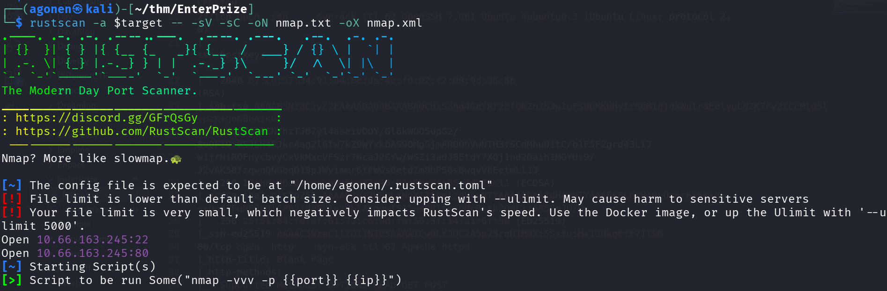
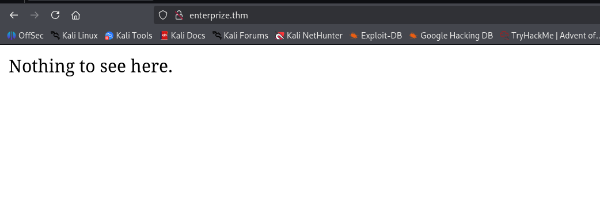

## TL;DR


### Recon

we start with `rustscan`, using this command:
```bash
rustscan -a $target -- -sV -sC -oN nmap.txt -oX nmap.xml
```



we can see port `22` with ssh and port `80` with apache http server.
```bash
PORT   STATE SERVICE REASON         VERSION                                                                                   
22/tcp open  ssh     syn-ack ttl 62 OpenSSH 7.6p1 Ubuntu 4ubuntu0.3 (Ubuntu Linux; protocol 2.0)                              
| ssh-hostkey:                                                                                                                
|   2048 67:c0:57:34:91:94:be:da:4c:fd:92:f2:09:9d:36:8b (RSA)                                                                
| ssh-rsa AAAAB3NzaC1yc2EAAAADAQABAAABAQCdxS3na4GeYRrzzfQRZn/S3w1oFS9UMKUHyIrR0MIgjqXWulraEelyuL82K7Fv2zCcMlgSl+pzK+go6BhAzKG/
+GfkpBquZm00CN/hzTJ07y14aseiVDOY/Gl6kWOO5upG2/8uQFi9tBSJLH4SJkcAag2l6tw7kZ9WYxkbAS9OMgSjmAROOhVwNTH3fSCdMhuQitC/b1F5F2grd43Li7
w1jrNiROFnycbvyCxVkMxcVFSzr70caJ2CYw/WSZi3adJ8EtdY7XQj1nd2DaihIMGYUs9/J2vAK58fzqwnQNGbqQ19pJWyimmr6tFWGsBetdZm8bP56s6wqvVEEetmLl13
|   256 13:ed:d6:6f:ea:b4:5b:87:46:91:6b:cc:58:4d:75:11 (ECDSA) 
| ecdsa-sha2-nistp256 AAAAE2VjZHNhLXNoYTItbmlzdHAyNTYAAAAIbmlzdHAyNTYAAABBBLnmHA9LOr6rBx5KxdL++QodEFqNERudlCPb21dqEr1uxQplAKgqwfS11usQR1scxOMrBsth2QmLi/6R5CqJU/Q=
|   256 25:51:84:fd:ef:61:72:c6:9d:fa:56:5f:14:a1:6f:90 (ED25519)
|_ssh-ed25519 AAAAC3NzaC1lZDI1NTE5AAAAICw0LYJQC2A5p73rqH1M0Xi5SsfuiM+1JHkgEff7IT9M
80/tcp open  http    syn-ack ttl 62 Apache httpd
|_http-title: Blank Page
| http-methods: 
|_  Supported Methods: OPTIONS HEAD GET POST
|_http-server-header: Apache
Service Info: OS: Linux; CPE: cpe:/o:linux:linux_kernel
```

I added `enterprize.thm` to my `/etc/hosts`.

### ...

I went to the home page, and saw nothing:



I tried to fuzz endpoints using `ffuf`, and to search for subdomains using `gobuster`, but I got nothing.

scan with nitko, and use gobuster with 110000.txt subdomain.


### Privilege Escalation to Root


