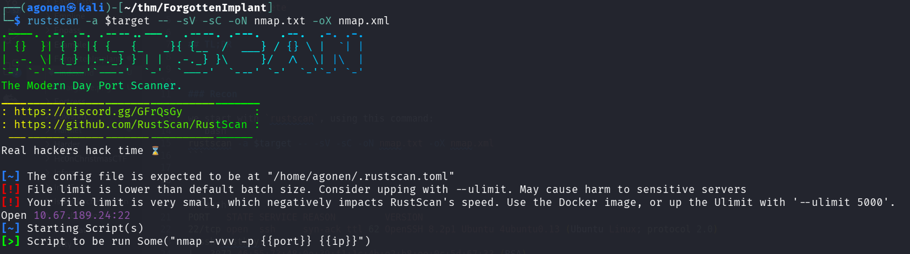

## TL;DR


### Recon

we start with `rustscan`, using this command:
```bash
rustscan -a $target -- -sV -sC -oN nmap.txt -oX nmap.xml
```



we can see port `22` with ssh.
```bash
PORT   STATE SERVICE REASON         VERSION
22/tcp open  ssh     syn-ack ttl 62 OpenSSH 8.2p1 Ubuntu 4ubuntu0.13 (Ubuntu Linux; protocol 2.0)
| ssh-hostkey: 
|   3072 46:55:73:48:0e:39:f1:1c:4b:e2:b8:ee:0c:5d:67:33 (RSA)
| ssh-rsa AAAAB3NzaC1yc2EAAAADAQABAAABgQC6HBJES/PYVt4TYFo0Z9DA6oTm+9PNJdS0UVjCTLkyLhNzYw/d4HEUEiitQSyUkKJEfBjQEFq0ZP8KxfHq9DS4T9O6dfEAb7LcXsjl6D1rSibHzhp2C0gLJoXFw6biVFh5Xe2ikM+aiuBthQb6ogy9ISScd6IbpfMtcuObobaFvxs/Cl64W454C0i5ryLqiaRkLfsVZpCvovYcNml48ZuseVMR4AvmxtFEW8Y5H1jdpMXRWQVXVPW4PNEg2VzyUIGPjt7iS/KmprBTC9ZdLBc+AWsuP/8jjdQldJyucl6BrasZLAwlondFccXitlB9CoCvs39zjAzdpG1ON4uezzt+3hx6rFPIp5EC6h/pN/lEvPh5x8PDdxYZLVh+4gkkIIBkzyUmSQUVOHr6tpLv7ZEJBwz5enQbG/dnjfxMbyK58efrQnLY6A8/C7H9jrybufegSJcL0BQW1eWvIbRWeprpUlwjkB6XSNyF1SacCk5uMOF9LLfllbxNOZnMHctVQ/k=
|   256 bc:c8:81:eb:5d:58:43:02:03:1b:0b:58:75:95:9c:82 (ECDSA)
| ecdsa-sha2-nistp256 AAAAE2VjZHNhLXNoYTItbmlzdHAyNTYAAAAIbmlzdHAyNTYAAABBBN9YbNSF/GPPCLVeLR/up1D48GXDDCcGyu2pPUjYnZSTuSeoKE5OTUxITDmJS9LqNwgwXglc3/S4cZr5vdD3Z8g=
|   256 77:3e:12:8d:a8:ea:36:d2:16:d2:cf:6f:15:16:be:fe (ED25519)
|_ssh-ed25519 AAAAC3NzaC1lZDI1NTE5AAAAIJNT0PF9+pxaPjsTJUKiAFDQU5nNOv3jsCmVXZJur1OI
Service Info: OS: Linux; CPE: cpe:/o:linux:linux_kernel
```

I added `forgottenimplant.thm` to my `/etc/hosts`.

### ...

I think this is broken. I need to listen for port `81` while using rustscan, and then execute commands via the C2 server. However, I don't get any requests on port `81`, checked both with tcpdump and wireshark.


### Privilege Escalation to Root


