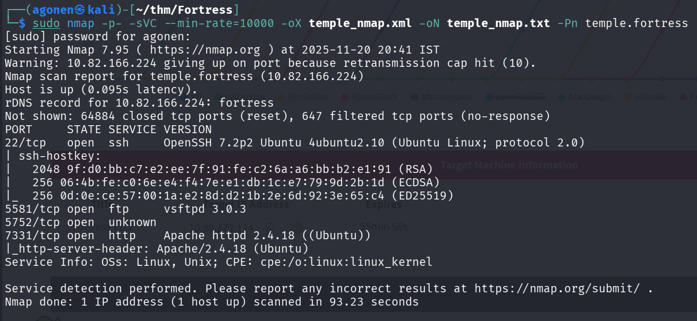
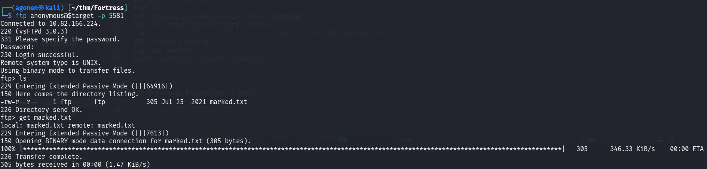
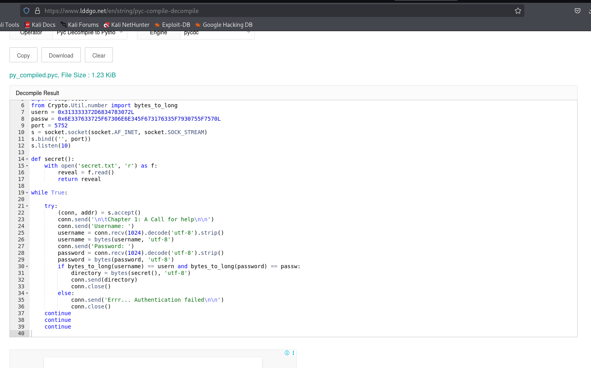
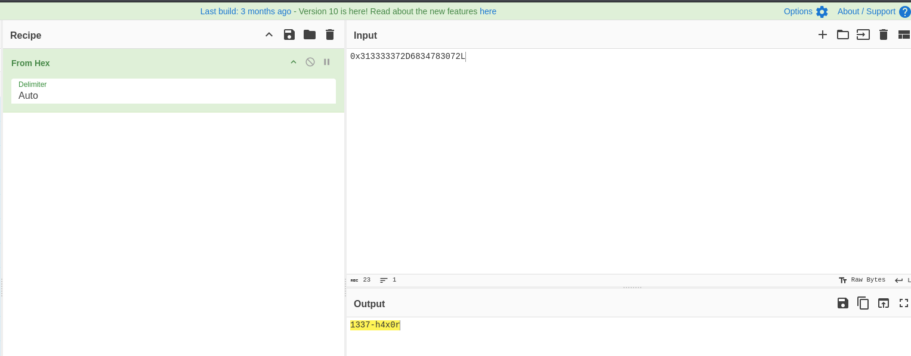
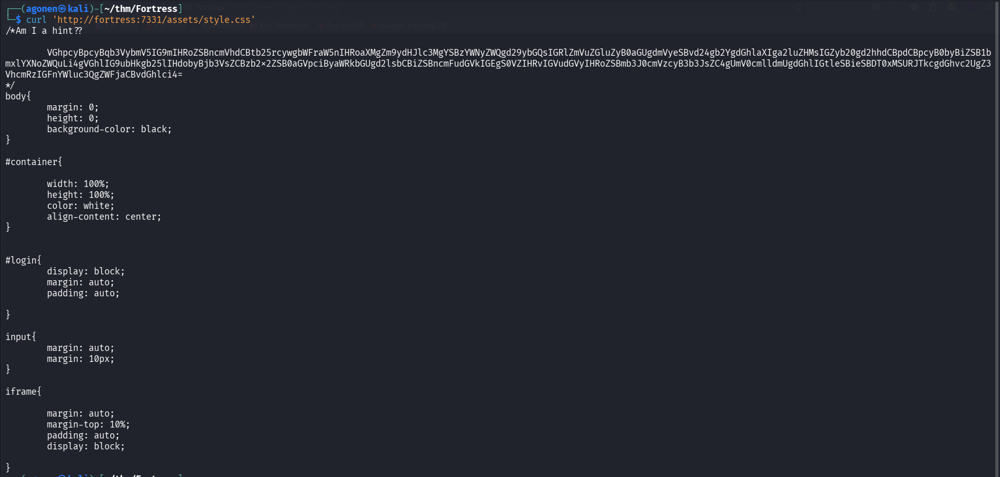
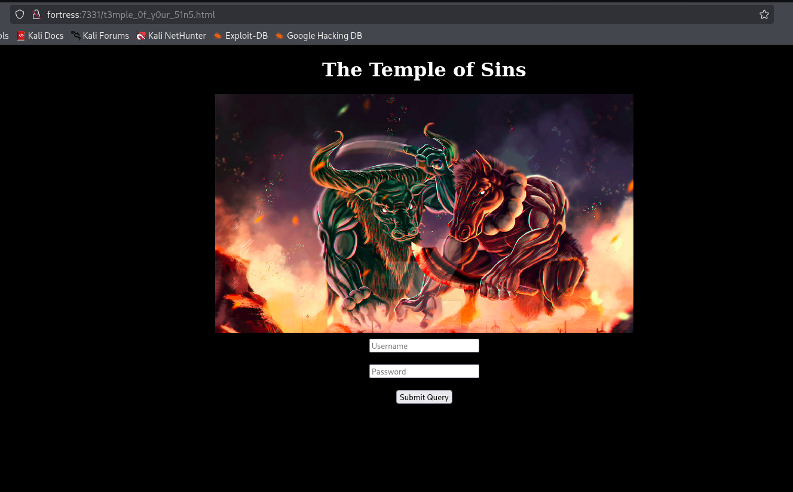

## TL;DR


### Recon

we start with `nmap`, using this command:
```bash
nmap -p- -sVC --min-rate=10000 fortress -oX nmap.xml -oN nmap.txt -Pn
```



We can see port `22` with ssh, port `5581` with ftp, and port `5752` with unknown service, and also `7331` with apache http server.
```bash
PORT     STATE SERVICE VERSION                                                                                                                                                               
22/tcp   open  ssh     OpenSSH 7.2p2 Ubuntu 4ubuntu2.10 (Ubuntu Linux; protocol 2.0)                                                                                                         
| ssh-hostkey:                                                                                                                                                                               
|   2048 9f:d0:bb:c7:e2:ee:7f:91:fe:c2:6a:a6:bb:b2:e1:91 (RSA)                                                                                                                               
|   256 06:4b:fe:c0:6e:e4:f4:7e:e1:db:1c:e7:79:9d:2b:1d (ECDSA)                                                                                                                              
|_  256 0d:0e:ce:57:00:1a:e2:8d:d2:1b:2e:6d:92:3e:65:c4 (ED25519)                                                                                                                            
5581/tcp open  ftp     vsftpd 3.0.3                                                                                                                                                          
| ftp-anon: Anonymous FTP login allowed (FTP code 230)                                                                                                                                       
|_-rw-r--r--    1 ftp      ftp           305 Jul 25  2021 marked.txt                                                                                                                         
| ftp-syst:                                                                                                                                                                                  
|   STAT:                                                                                                                                                                                    
| FTP server status:                                                                                                                                                                         
|      Connected to ::ffff:192.168.131.148                                                                                             
|      Logged in as ftp                                                                                                                
|      TYPE: ASCII                                                                                                                     
|      No session bandwidth limit                                                                                                      
|      Session timeout in seconds is 300                                                                                               
|      Control connection is plain text                                                                                                
|      Data connections will be plain text                                                                                             
|      At session startup, client count was 1                                                                                          
|      vsFTPd 3.0.3 - secure, fast, stable                                                                                             
|_End of status                                                                                                                        
5752/tcp open  unknown                                                                                                                 
| fingerprint-strings:                                                                                                                 
|   DNSStatusRequestTCP, DNSVersionBindReqTCP, GenericLines, GetRequest, HTTPOptions, Help, RTSPRequest:                               
|     Chapter 1: A Call for help                                                                                                                             
|     Username: Password:                                                                                                              
|   Kerberos, NULL, RPCCheck, SSLSessionReq, TLSSessionReq, TerminalServerCookie:                                                      
|     Chapter 1: A Call for help                                                                                                       
|_    Username:                                                                                                                        
1 service unrecognized despite returning data. If you know the service/version, please submit the following fingerprint at https://nmap.org/cgi-bin/submit.cgi?new-service
7331/tcp open  http    Apache httpd 2.4.18 ((Ubuntu))
|_http-server-header: Apache/2.4.18 (Ubuntu)
```

let's add `fortress` and `temple.fortress` to our `/etc/hosts`.

```bash
┌──(agonen㉿kali)-[~/thm/Fortress]
└─$ head /etc/hosts
127.0.0.1       localhost
127.0.1.1       kali

10.82.166.224   fortress temple.fortress
```

### ...

First, I tried to login to the `ftp` anonymously, and it worked.

```bash
──(agonen㉿kali)-[~/thm/Fortress]
└─$ ftp anonymous@$target -p 5581
Connected to 10.82.166.224.
220 (vsFTPd 3.0.3)
331 Please specify the password.
Password: 
230 Login successful.
Remote system type is UNIX.
Using binary mode to transfer files.
ftp> ls
229 Entering Extended Passive Mode (|||64916|)
150 Here comes the directory listing.
-rw-r--r--    1 ftp      ftp           305 Jul 25  2021 marked.txt
226 Directory send OK.
ftp> get marked.txt
local: marked.txt remote: marked.txt
```

I downloaded the file `marked.txt`.



When I searched with `ls -la`, i found another file:
```bash
ftp> ls -la
229 Entering Extended Passive Mode (|||56067|)
150 Here comes the directory listing.
drwxr-xr-x    2 ftp      ftp          4096 Jul 25  2021 .
drwxr-xr-x    2 ftp      ftp          4096 Jul 25  2021 ..
-rw-r--r--    1 ftp      ftp          1255 Jul 25  2021 .file
-rw-r--r--    1 ftp      ftp           305 Jul 25  2021 marked.txt
226 Directory send OK.
ftp> get .file
local: .file remote: .file
229 Entering Extended Passive Mode (|||30353|)
150 Opening BINARY mode data connection for .file (1255 bytes).
100% |************************************************************************************************************************************************|  1255       23.01 MiB/s    00:00 ETA
226 Transfer complete.
1255 bytes received in 00:00 (6.12 KiB/s)
```

I downloaded the file `.file` too.

This is `marked.txt`:
```bash
──(agonen㉿kali)-[~/thm/Fortress]
└─$ cat marked.txt               
If youre reading this, then know you too have been marked by the overlords... Help memkdir /home/veekay/ftp I have been stuck inside this prison for days no light, no escape... Just darkness... Find the backdoor and retrieve the key to the map... Arghhh, theyre coming... HELLLPPPPPmkdir /home/veekay/ftp
```

When I tried to read `.file`, I got binary output. I checked with `file` what is is filetype, and found this is compiled python file.


```bash
┌──(agonen㉿kali)-[~/thm/Fortress]
└─$ file .file
.file: python 2.7 byte-compiled
```

I found online this website [https://www.lddgo.net/en/string/pyc-compile-decompile](https://www.lddgo.net/en/string/pyc-compile-decompile)
 to decompile this binary.



This is the original source code:

```py
import socket
import subprocess
from Crypto.Util.number import bytes_to_long
usern = 0x313333372D6834783072L
passw = 0x6E337633725F67306E6E345F673176335F7930755F7570L
port = 5752
s = socket.socket(socket.AF_INET, socket.SOCK_STREAM)
s.bind(('', port))
s.listen(10)

def secret():
    with open('secret.txt', 'r') as f:
        reveal = f.read()
        return reveal

while True:
    
    try:
        (conn, addr) = s.accept()
        conn.send('\n\tChapter 1: A Call for help\n\n')
        conn.send('Username: ')
        username = conn.recv(1024).decode('utf-8').strip()
        username = bytes(username, 'utf-8')
        conn.send('Password: ')
        password = conn.recv(1024).decode('utf-8').strip()
        password = bytes(password, 'utf-8')
        if bytes_to_long(username) == usern and bytes_to_long(password) == passw:
            directory = bytes(secret(), 'utf-8')
            conn.send(directory)
            conn.close()
        else:
            conn.send('Errr... Authentication failed\n\n')
            conn.close()
    continue
    continue
    continue
```

I decoded the strings using CyberChef, this is the usern 
[https://gchq.github.io/CyberChef/#recipe=From_Hex('Auto')&input=MHgzMTMzMzMzNzJENjgzNDc4MzA3Mkw](https://gchq.github.io/CyberChef/#recipe=From_Hex('Auto')&input=MHgzMTMzMzMzNzJENjgzNDc4MzA3Mkw)



And this is the passw, [https://gchq.github.io/CyberChef/#recipe=From_Hex('Auto')&input=MHg2RTMzNzYzMzcyNUY2NzMwNkU2RTM0NUY2NzMxNzYzMzVGNzkzMDc1NUY3NTcwTA](https://gchq.github.io/CyberChef/#recipe=From_Hex('Auto')&input=MHg2RTMzNzYzMzcyNUY2NzMwNkU2RTM0NUY2NzMxNzYzMzVGNzkzMDc1NUY3NTcwTA)


Okay, we got these credentials
```bash
1337-h4x0r:n3v3r_g0nn4_g1v3_y0u_up
```

Now, let's send them to port `5752`:

```bash
┌──(agonen㉿kali)-[~/thm/Fortress]
└─$ nc fortress 5752   

        Chapter 1: A Call for help

Username: 1337-h4x0r
Password: n3v3r_g0nn4_g1v3_y0u_up
t3mple_0f_y0ur_51n5
```

we got back `secret.txt`.


### 

we can look again on `marked.txt`:
```bash
──(agonen㉿kali)-[~/thm/Fortress]
└─$ cat marked.txt               
If youre reading this, then know you too have been marked by the overlords... Help memkdir /home/veekay/ftp I have been stuck inside this prison for days no light, no escape... Just darkness... Find the backdoor and retrieve the key to the map... Arghhh, theyre coming... HELLLPPPPPmkdir /home/veekay/ftp
```

It looks like there is some backdoor, maybe inside `/home/veekay/ftp`.

Let's move to port `7331`. I started with `ffuf`, but find only `private.php` which gave me nothing.


```bash
┌──(agonen㉿kali)-[~/thm/Fortress]                                                                                                        [13/20]
└─$ ffuf -u "http://temple.fortress:7331/FUZZ" -w /usr/share/SecLists/Discovery/Web-Content/DirBuster-2007_directory-list-2.3-small.txt -e .php  
                                                                                                                                                 
        /'___\  /'___\           /'___\                                                                                                          
       /\ \__/ /\ \__/  __  __  /\ \__/                                                                                                          
       \ \ ,__\\ \ ,__\/\ \/\ \ \ \ ,__\                                                                                                         
        \ \ \_/ \ \ \_/\ \ \_\ \ \ \ \_/                                                                                                         
         \ \_\   \ \_\  \ \____/  \ \_\                                                                                                          
          \/_/    \/_/   \/___/    \/_/                                                                                                          
                                                                                                                                                 
       v2.1.0-dev                                                                                                                                
________________________________________________                                                                                                 
                                                                                                                                                 
 :: Method           : GET                                                                                                                       
 :: URL              : http://temple.fortress:7331/FUZZ
 :: Wordlist         : FUZZ: /usr/share/SecLists/Discovery/Web-Content/DirBuster-2007_directory-list-2.3-small.txt
 :: Extensions       : .php 
 :: Follow redirects : false
 :: Calibration      : false
 :: Timeout          : 10
 :: Threads          : 40
 :: Matcher          : Response status: 200-299,301,302,307,401,403,405,500
________________________________________________

assets                  [Status: 301, Size: 326, Words: 20, Lines: 10, Duration: 81ms]
private.php             [Status: 200, Size: 0, Words: 1, Lines: 1, Duration: 80ms]
```

Maybe `t3mple_0f_y0ur_51n5` is an endpoint.

```bash
┌──(agonen㉿kali)-[~/thm/Fortress]
└─$ curl 'http://fortress:7331/t3mple_0f_y0ur_51n5.php'
<html>
<head>
        <title>Chapter 2</title>
        <link rel='stylesheet' href='assets/style.css' type='text/css'>
</head>
<body>
        <div id="container">
        <video width=100% height=100% autoplay>
            <source src="./assets/flag_hint.mp4" type=video/mp4>
        </video>


<!-- Hmm are we there yet?? May be we just need to connect the dots -->

<!--    <center>
                        <form id="login" method="GET">
                                <input type="text" required name="user" placeholder="Username"/><br/>
                                <input type="text" required name="pass" placeholder="Password" /><br/>
                                <input type="submit"/>
                        </form>
                </center>
-->

    </div>

</body>
</html>
```

Yay, we find another endpoint.

Now, I looked for more hints, I tried to get `assets/style.css`:
```bash
┌──(agonen㉿kali)-[~/thm/Fortress]
└─$ curl 'http://fortress:7331/assets/style.css'                                                            
/*Am I a hint??

        VGhpcyBpcyBqb3VybmV5IG9mIHRoZSBncmVhdCBtb25rcywgbWFraW5nIHRoaXMgZm9ydHJlc3MgYSBzYWNyZWQgd29ybGQsIGRlZmVuZGluZyB0aGUgdmVyeSBvd24gb2YgdGhlaXIga2luZHMsIGZyb20gd2hhdCBpdCBpcyB0byBiZSB1bmxlYXNoZWQuLi4gVGhlIG9ubHkgb25lIHdobyBjb3VsZCBzb2x2ZSB0aGVpciByaWRkbGUgd2lsbCBiZSBncmFudGVkIGEgS0VZIHRvIGVudGVyIHRoZSBmb3J0cmVzcyB3b3JsZC4gUmV0cmlldmUgdGhlIGtleSBieSBDT0xMSURJTkcgdGhvc2UgZ3VhcmRzIGFnYWluc3QgZWFjaCBvdGhlci4=
*/

<REDACTED>
```



So, I decoded this string:
```bash
┌──(agonen㉿kali)-[~/thm/Fortress]
└─$ echo -e 'VGhpcyBpcyBqb3VybmV5IG9mIHRoZSBncmVhdCBtb25rcywgbWFraW5nIHRoaXMgZm9ydHJlc3MgYSBzYWNyZWQgd29ybGQsIGRlZmVuZGluZyB0aGUgdmVyeSBvd24gb2YgdGhlaXIga2luZHMsIGZyb20gd2hhdCBpdCBpcyB0byBiZSB1bmxlYXNoZWQuLi4gVGhlIG9ubHkgb25lIHdobyBjb3VsZCBzb2x2ZSB0aGVpciByaWRkbGUgd2lsbCBiZSBncmFudGVkIGEgS0VZIHRvIGVudGVyIHRoZSBmb3J0cmVzcyB3b3JsZC4gUmV0cmlldmUgdGhlIGtleSBieSBDT0xMSURJTkcgdGhvc2UgZ3VhcmRzIGFnYWluc3QgZWFjaCBvdGhlci4=' | base64 -d
This is journey of the great monks, making this fortress a sacred world, defending the very own of their kinds, from what it is to be unleashed... The only one who could solve their riddle will be granted a KEY to enter the fortress world. Retrieve the key by COLLIDING those guards against each other.
```

Okay, I tried to get `http://fortress:7331/t3mple_0f_y0ur_51n5.html`:



Fine, if we'll check the source code, we can find this:
```php
<!--
<?php
require 'private.php';
$badchar = '000000';
if (isset($_GET['user']) and isset($_GET['pass'])) {
    $test1 = (string)$_GET['user'];
    $test2 = (string)$_GET['pass'];

    $hex1 = bin2hex($test1);
    $hex2 = bin2hex($test2);
    

    if ($test1 == $test2) {
        print 'You can't cross the gates of the temple, GO AWAY!!.';
    } 
    
    else if(strlen($test2) <= 500 and strlen($test1) <= 600){
    	print "<pre>Nah, babe that ain't gonna work</pre>";
    }

    else if( strpos( $hex1, $badchar ) or strpos( $hex2, $badchar )){
    	print '<pre>I feel pitty for you</pre>';
    }
    
    else if (sha1($test1) === sha1($test2)) {
      print "<pre>'Private Spot: '$spot</pre>";
    } 
    
    else {
        print '<center>Invalid password.</center>';
    }
}
?>
-->

<!-- Don't believe what you see... This is not the actual door to the temple. -->
```
### Privilege Escalation to Root


