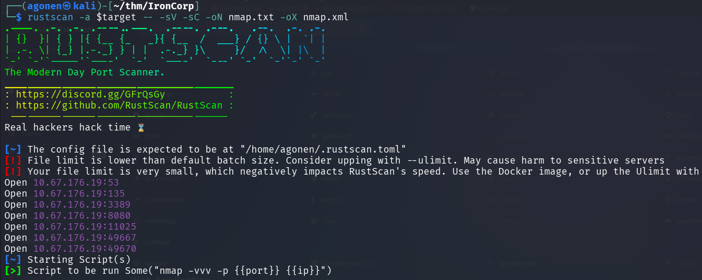

## TL;DR


### Recon

we start with `rustscan`, using this command:
```bash
rustscan -a $target -- -sV -sC -oN nmap.txt -oX nmap.xml
```




```bash
PORT      STATE SERVICE       REASON          VERSION                                                                                                                                                                                       
53/tcp    open  domain        syn-ack ttl 126 Simple DNS Plus                                                                                                                                                                               
135/tcp   open  msrpc         syn-ack ttl 126 Microsoft Windows RPC                                                                                                                                                                         
3389/tcp  open  ms-wbt-server syn-ack ttl 126 Microsoft Terminal Services                                                                                                                                                                   
| rdp-ntlm-info:                                                                                                                                                                                                                            
|   Target_Name: WIN-8VMBKF3G815                                                                                                                                                                                                            
|   NetBIOS_Domain_Name: WIN-8VMBKF3G815                                                                                                                                                                                                    
|   NetBIOS_Computer_Name: WIN-8VMBKF3G815                                                                                                                                                                                                  
|   DNS_Domain_Name: WIN-8VMBKF3G815                                                                                                                                                                                                        
|   DNS_Computer_Name: WIN-8VMBKF3G815                                                                                                                                                                                                      
|   Product_Version: 10.0.14393                                                                                                                                                                                                             
|_  System_Time: 2025-12-28T12:21:27+00:00                                                                                                                                                                                                  
|_ssl-date: 2025-12-28T12:21:36+00:00; -3s from scanner time.                                                                                                                                                                               
| ssl-cert: Subject: commonName=WIN-8VMBKF3G815                                                                                                                                                                                             
| Issuer: commonName=WIN-8VMBKF3G815                                                                                                                                                                                                        
| Public Key type: rsa                                                                                                                                                                                                                      
| Public Key bits: 2048                                                                                                                                                                                                                     
| Signature Algorithm: sha256WithRSAEncryption                                                                                                                                                                                              
| Not valid before: 2025-12-27T12:01:08                                                                                                          
| Not valid after:  2026-06-28T12:01:08                                                                                                          
| MD5:   5fe4:9770:c6ca:9f9a:68aa:cdb4:053c:4cd3                                                                                                 
| SHA-1: 2ace:879c:0a44:1ad1:35a9:87e7:8836:a759:b7b8:9ffc                                                                                       
| -----BEGIN CERTIFICATE-----                                                                                                                    
| MIIC4jCCAcqgAwIBAgIQVUVxSCWLH7VN/s0rfFIHkjANBgkqhkiG9w0BAQsFADAa                                                                               
| MRgwFgYDVQQDEw9XSU4tOFZNQktGM0c4MTUwHhcNMjUxMjI3MTIwMTA4WhcNMjYw                                                                               
| NjI4MTIwMTA4WjAaMRgwFgYDVQQDEw9XSU4tOFZNQktGM0c4MTUwggEiMA0GCSqG                                                                               
| SIb3DQEBAQUAA4IBDwAwggEKAoIBAQCZerdn7D8NiNaRBCJGjucODPUtDHjgC2Cb                                                                               
| cOz+cMDVTMO7RTWaUsrxy9ODTewYd/jJpxjSlmhbQQGzQj8o/XNRHGcEVgEJ61vl                                                                               
| jfFoA5uivMzOz6bYGwi3Ld4i92Emq0G1Rey92KcEpDaqNz8rWEAnSYZjz9iwalp4                                                                               
| gN6UecUxisFZxz7LvAx/0V/a/ICbzsZ7ui0m+Ha/d8mJijXZEKVJQt/lJoCDEL1b                                                                               
| /3cHv7/vog+mNg4CkWJDDPWP+fcBXnBIQO+dBY6jpDbPVBovfdZeyzJ1UJMFxxQ0                                                                               
| v+Rz2RsEvCe6cXdK6A1PdyiJuKENyUGuQ3yOGCyTKXqLOdNt8JaxAgMBAAGjJDAi                                                                               
| MBMGA1UdJQQMMAoGCCsGAQUFBwMBMAsGA1UdDwQEAwIEMDANBgkqhkiG9w0BAQsF                                                                               
| AAOCAQEAg9FudhrX2Ux00YIdIgjG/f5r951kojncqIYGuisoXBGSC1fh/Oa05AqT                                                                               
| VJH+keRT9vrwKS8NDNu2YWNWjY8s8JFM/uMLnrZAkEsc9wG78taA67jljsqlG3cs                                                                               
| ZkgYaM7F/6S4XPeUSwqWcyYQnkQ+x1IR11cg8m3UTmh3Z0MHKhOZ5YgKyNyoD1SO                                                                               
| 5Tb9hzdgvhkNNuDNz6w1AECWTO43WVIu9OGzBctxkfpO4rTVu+TkU85zI71PUWjl                                                                               
| 6n0ZY3kRE4WysRnX/xHBKQpV0NIT9fVIpIllmf8srXWDYkP+3dhVZwzRHcUa4x2i                                                                               
| y4rxrUL3bLIZ2NaQ0AAwOwiYQe+zsA==                                      
|_-----END CERTIFICATE-----                                                                                                                      
8080/tcp  open  http          syn-ack ttl 126 Microsoft IIS httpd 10.0  
|_http-title: Dashtreme Admin - Free Dashboard for Bootstrap 4 by Codervent                                                                                                                                                                 
|_http-server-header: Microsoft-IIS/10.0                                
| http-methods:                                                         
|   Supported Methods: OPTIONS TRACE GET HEAD POST                                                                                               
|_  Potentially risky methods: TRACE                                    
11025/tcp open  http          syn-ack ttl 126 Apache httpd 2.4.41 ((Win64) OpenSSL/1.1.1c PHP/7.4.4)                                                                                                                                        
|_http-server-header: Apache/2.4.41 (Win64) OpenSSL/1.1.1c PHP/7.4.4
| http-methods:                                                         
|   Supported Methods: GET POST OPTIONS HEAD TRACE                                                                                                           
|_  Potentially risky methods: TRACE                               
|_http-title: Coming Soon - Start Bootstrap Theme                       
49667/tcp open  msrpc         syn-ack ttl 126 Microsoft Windows RPC                                                   
49670/tcp open  msrpc         syn-ack ttl 126 Microsoft Windows RPC                                                   
Service Info: OS: Windows; CPE: cpe:/o:microsoft:windows
```

I added `ironcorp.me` to my `/etc/hosts`

### ...

Oh, that's windows. Bye Bye, maybe later :D


### Privilege Escalation to Root


