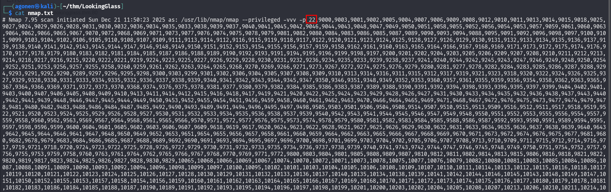
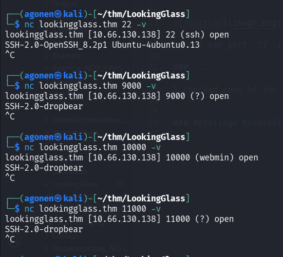
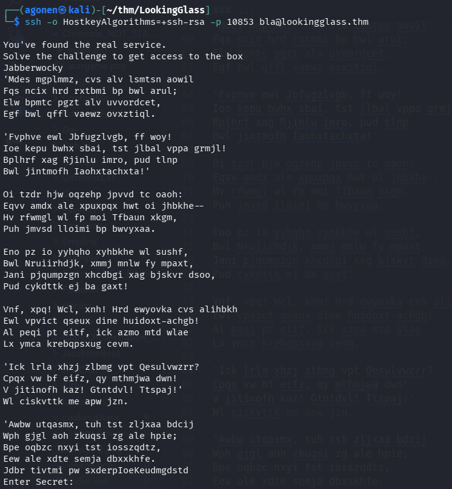
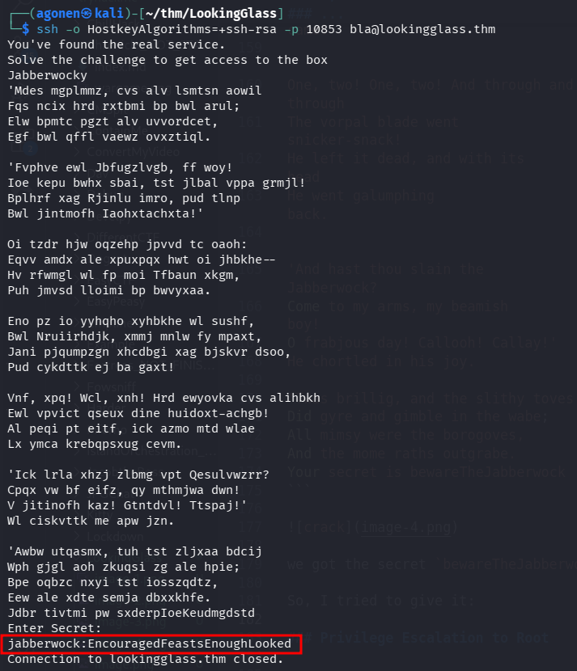

## TL;DR


### Recon

we start with `rustscan`, using this command:
```bash
rustscan -a $target -- -sV -sC -oN nmap.txt -oX nmap.xml
```



we can see port `22` is opened, and then huge amount of ports.

### ...

I checked some of the ports:



as you can see, port `22` is with regular openssh ssh service, while the other ports are with dropbear ssh service.

I tried to connect to the other ssh ports:
```bash
┌──(agonen㉿kali)-[~/thm/LookingGlass]
└─$ ssh -o HostkeyAlgorithms=+ssh-rsa -p 9000 bla@lookingglass.thm 
Lower
Connection to lookingglass.thm closed.
                                                                                                                                                                                             
┌──(agonen㉿kali)-[~/thm/LookingGlass]
└─$ ssh -o HostkeyAlgorithms=+ssh-rsa -p 10000 bla@lookingglass.thm
Lower
Connection to lookingglass.thm closed.
                                                                                                                                                                                             
┌──(agonen㉿kali)-[~/thm/LookingGlass]
└─$ ssh -o HostkeyAlgorithms=+ssh-rsa -p 11000 bla@lookingglass.thm
Higher
Connection to lookingglass.thm closed.
```

I got sometimes "Lower" and sometimes "Higher".


I did manually binary search, and got to port `10853`:
```bash
┌──(agonen㉿kali)-[~/thm/LookingGlass]                                                                                                                                                                            
└─$ ssh -o HostkeyAlgorithms=+ssh-rsa -p 10853 bla@lookingglass.thm                                                                                                                                               
                                               
You've found the real service.              
Solve the challenge to get access to the box
Jabberwocky                        
'Mdes mgplmmz, cvs alv lsmtsn aowil
Fqs ncix hrd rxtbmi bp bwl arul;
Elw bpmtc pgzt alv uvvordcet,
Egf bwl qffl vaewz ovxztiql.
                                               
'Fvphve ewl Jbfugzlvgb, ff woy!          
Ioe kepu bwhx sbai, tst jlbal vppa grmjl!
Bplhrf xag Rjinlu imro, pud tlnp
Bwl jintmofh Iaohxtachxta!'
                                               
Oi tzdr hjw oqzehp jpvvd tc oaoh:    
Eqvv amdx ale xpuxpqx hwt oi jhbkhe--
Hv rfwmgl wl fp moi Tfbaun xkgm,
Puh jmvsd lloimi bp bwvyxaa.
                                               
Eno pz io yyhqho xyhbkhe wl sushf, 
Bwl Nruiirhdjk, xmmj mnlw fy mpaxt,    
Jani pjqumpzgn xhcdbgi xag bjskvr dsoo,
Pud cykdttk ej ba gaxt!
                                               
Vnf, xpq! Wcl, xnh! Hrd ewyovka cvs alihbkh
Ewl vpvict qseux dine huidoxt-achgb!
Al peqi pt eitf, ick azmo mtd wlae
Lx ymca krebqpsxug cevm.
                                               
'Ick lrla xhzj zlbmg vpt Qesulvwzrr?
Cpqx vw bf eifz, qy mthmjwa dwn!
V jitinofh kaz! Gtntdvl! Ttspaj!'                   
Wl ciskvttk me apw jzn.                             

'Awbw utqasmx, tuh tst zljxaa bdcij                 
Wph gjgl aoh zkuqsi zg ale hpie;                    
Bpe oqbzc nxyi tst iosszqdtz,                       
Eew ale xdte semja dbxxkhfe.                        
Jdbr tivtmi pw sxderpIoeKeudmgdstd                  
Enter Secret: 
```



we got some secret message, I used [https://www.guballa.de/vigenere-solver](https://www.guballa.de/vigenere-solver) to crack the secret message:
```bash
'Mdes mgplmmz, cvs alv lsmtsn aowil                                                                                                                          
Fqs ncix hrd rxtbmi bp bwl arul;                                                                                                                             
Elw bpmtc pgzt alv uvvordcet,                                                                                                                                
Egf bwl qffl vaewz ovxztiql.                                                                                                                                 
                                                                                                                                                             
'Fvphve ewl Jbfugzlvgb, ff woy!                                                                                                                              
Ioe kepu bwhx sbai, tst jlbal vppa grmjl!                                                                                                                    
Bplhrf xag Rjinlu imro, pud tlnp                                                                                                                             
Bwl jintmofh Iaohxtachxta!'                                                                                                                                  
                                                                                                                                                             
Oi tzdr hjw oqzehp jpvvd tc oaoh:                                                                                                                            
Eqvv amdx ale xpuxpqx hwt oi jhbkhe--                                                                                                                        
Hv rfwmgl wl fp moi Tfbaun xkgm,                                                                                                                             
Puh jmvsd lloimi bp bwvyxaa.                                                                                                                                 
                                                                                                                                                             
Eno pz io yyhqho xyhbkhe wl sushf,                                                                                                                           
Bwl Nruiirhdjk, xmmj mnlw fy mpaxt,                                                                                                                          
Jani pjqumpzgn xhcdbgi xag bjskvr dsoo,                                                                                                                      
Pud cykdttk ej ba gaxt!                                                                                                                                      
                                                                                                                                                             
Vnf, xpq! Wcl, xnh! Hrd ewyovka cvs alihbkh                                                                                                                  
Ewl vpvict qseux dine huidoxt-achgb!                                                                                                                         
Al peqi pt eitf, ick azmo mtd wlae                                                                                                                           
Lx ymca krebqpsxug cevm.                                                                                                                                     
                                                                                                                                                             
'Ick lrla xhzj zlbmg vpt Qesulvwzrr?                                                                                                                         
Cpqx vw bf eifz, qy mthmjwa dwn!                                                                                                                             
V jitinofh kaz! Gtntdvl! Ttspaj!'
Wl ciskvttk me apw jzn.                        
                                                                              
'Awbw utqasmx, tuh tst zljxaa bdcij            
Wph gjgl aoh zkuqsi zg ale hpie;               
Bpe oqbzc nxyi tst iosszqdtz,                  
Eew ale xdte semja dbxxkhfe.                   
Jdbr tivtmi pw sxderpIoeKeudmgdstd
```

and after cracking using the key it finds `thealphabetcipher`, this is vigenre cipher:
```bash
'Twas brillig, and the slithy toves                                                                                                                          
Did gyre and gimble in the wabe;                                                                                                                             
All mimsy were the borogoves,                                                                                                                                
And the mome raths outgrabe.                                                                                                                                 
                                                                                                                                                             
'Beware the Jabberwock, my son!                                                                                                                              
The jaws that bite, the claws that catch!                                                                                                                    
Beware the Jubjub bird, and shun                                                                                                                             
The frumious Bandersnatch!'                                                                                                                                  
                                                                                                                                                             
He took his vorpal sword in hand:                                                                                                                            
Long time the manxome foe he sought--                                                                                                                        
So rested he by the Tumtum tree,                                                                                                                             
And stood awhile in thought.                                                                                                                                 
                                                                                                                                                             
And as in uffish thought he stood,                                                                                                                           
The Jabberwock, with eyes of flame,                                                                                                                          
Came whiffling through the tulgey wood,                                                                                                                      
And burbled as it came!                                                                                                                                      
                                                                                                                                                             
One, two! One, two! And through and through                                                                                                                  
The vorpal blade went snicker-snack!                                                                                                                         
He left it dead, and with its head                                                                                                                           
He went galumphing back.                                                                                                                                     
                                                                                                                                                             
'And hast thou slain the Jabberwock?                                                                                                                         
Come to my arms, my beamish boy!                                                                                                                             
O frabjous day! Callooh! Callay!'
He chortled in his joy.                        
                                                                              
'Twas brillig, and the slithy toves            
Did gyre and gimble in the wabe;               
All mimsy were the borogoves,                  
And the mome raths outgrabe.                   
Your secret is bewareTheJabberwock
```


we got the secret `bewareTheJabberwock`.

So, I tried to give it, and we got back:
```bash
jabberwock:EncouragedFeastsEnoughLooked
```



I used this credentials to login via ssh:
```bash
┌──(agonen㉿kali)-[~/thm/LookingGlass]
└─$ ssh jabberwock@lookingglass.thm                                
jabberwock@lookingglass.thm's password:  # EncouragedFeastsEnoughLooked

 System information as of Sun Dec 21 10:50:09 UTC 2025

  System load:  0.0               Processes:             113
  Usage of /:   61.1% of 8.76GB   Users logged in:       0
  Memory usage: 21%               IPv4 address for ens5: 10.66.130.138
  Swap usage:   0%
Last login: Sun Dec 21 10:29:59 2025 from 192.168.164.248
jabberwock@ip-10-66-130-138:~$
```


we can grab the user flag:
```bash
jabberwock@ip-10-66-130-138:~$ cat user.txt | rev
thm{65d3710e9d75d5f346d2bac669119a23}
```

### Privilege Escalation to Root

for some reason, I can't execute `sudo -l` ? (altough the writeup's say this is the path)

