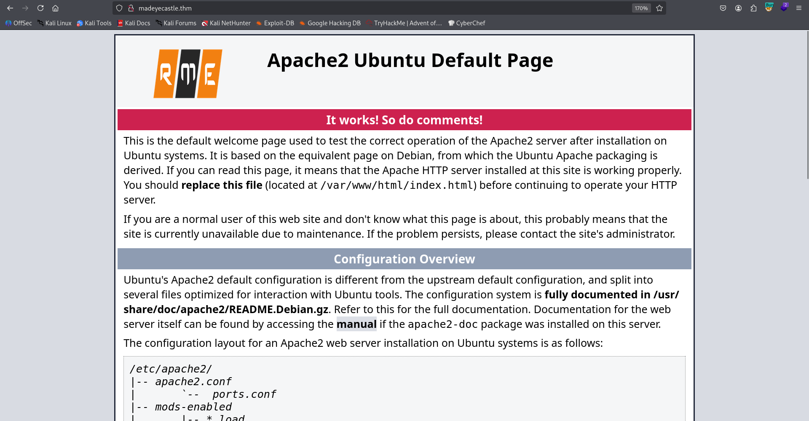
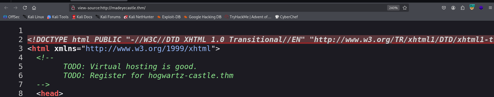
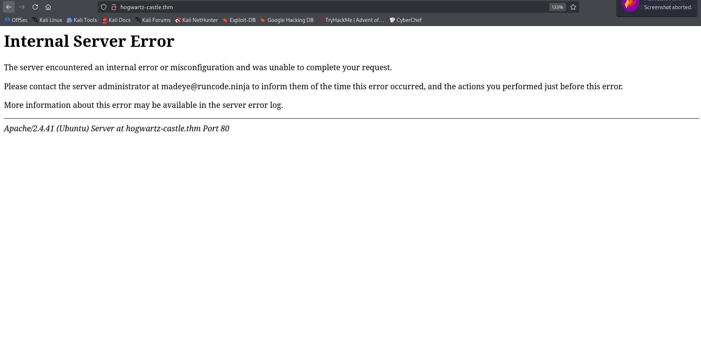
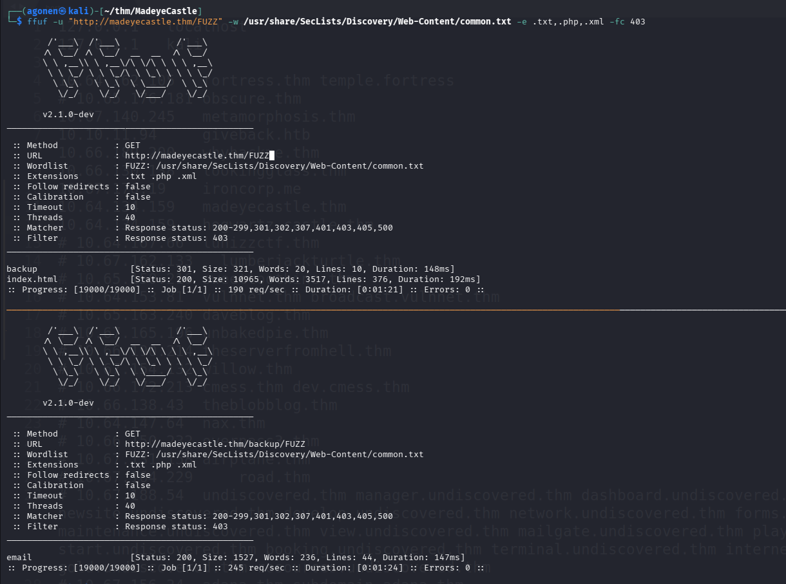
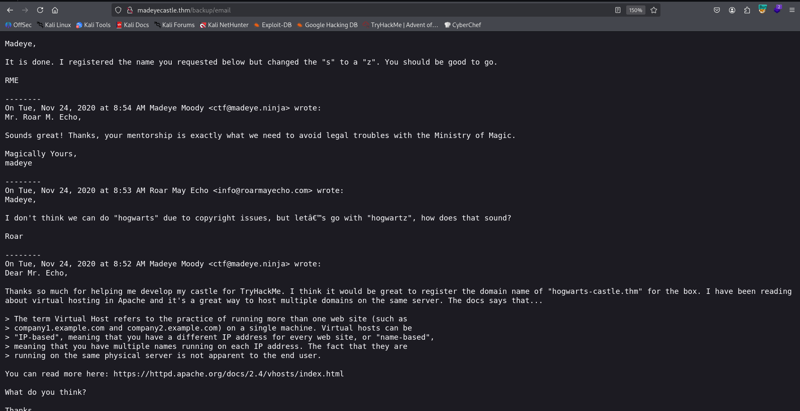
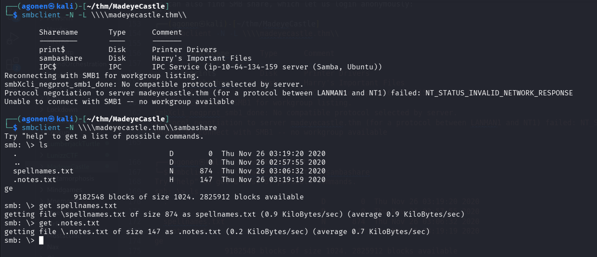

## TL;DR

**BROKEN**
page returns 500, Internal Server Error


### Recon

we start with `rustscan`, using this command:
```bash
rustscan -a $target -- -sV -sC -oN nmap.txt -oX nmap.xml
```


we can see port `22` with ssh, port `80` with apache http server nad port `139` and `445` with smb.
```bash
PORT    STATE SERVICE     REASON         VERSION                                                                                                             
22/tcp  open  ssh         syn-ack ttl 62 OpenSSH 8.2p1 Ubuntu 4ubuntu0.13 (Ubuntu Linux; protocol 2.0)                                                       
| ssh-hostkey:                                                                                                                                               
|   3072 dd:a4:de:2d:3b:01:7a:aa:f0:9c:83:0f:bf:60:96:94 (RSA)                                                                                               
| ssh-rsa AAAAB3NzaC1yc2EAAAADAQABAAABgQCvylLO7NvNsuEdELPzzUWJfgl+Aet0yD/wAXiHVEyexpg0liHZ7CSVYsz7+NrZcsesXuzcJkq/IAlrYpo30UBNwmX1+NSHNOtqmQgIdtGU+tSQxVuiYgH
4HnNl8TB1QccMFM0GHvQS23Ju+xDzakSJiFNuMgoU0gnkbzXmTqXvzwrxCPSt79BB+/Jh7G+Mua/lp1zOB2aG+mebbTuqs/+9xute/u+CxNtfsbeRl+3riE3gmCc/gklUbm3H5cuebPT5OApiWGtm9aaL91Ma
N2v6G+nrmIEOvmZsDsAfZ4SYkhEoWQ6tQ/nD16qUkQsEJ9d0wtV296i0SrWJsLUQnaEqAObUMKFXvgKkLyftI86YLbn946Tjs2v4nVfcJrFf8X9P9xNl8HNEARrbueNW/2YY6I6qmDqWiEZq75I5kn7T8G76A
czDIk/Zz6J4CvDjE3SZTnEnq1Mu6L6q9KRIdWJP8l4pD7N5IOwXw54kzy1MCH9FXTtW7qC9vA4Le+uiBdM=                                                                          
|   256 e1:91:a5:17:6f:24:5f:09:ad:9c:6a:e2:2b:b5:cd:52 (ECDSA)                                                                                              
| ecdsa-sha2-nistp256 AAAAE2VjZHNhLXNoYTItbmlzdHAyNTYAAAAIbmlzdHAyNTYAAABBBAEB/9gFWucOg4mwdC9pmY1BUm5+4gGeQGw2p7NOla8RDUbqCdjH7xxAIAQ7wfsnPfX110YNFxIMeiN6P6O
uSJA=                                                                                                                                                        
|   256 58:f5:91:32:3d:7e:2a:da:95:a5:a2:ad:3b:ea:f8:d2 (ED25519)                                                                                            
|_ssh-ed25519 AAAAC3NzaC1lZDI1NTE5AAAAIOC+aCI9VgyjURhrDG4sdsACEI376F1JGPvEzx7qBX8a                                                                           
80/tcp  open  http        syn-ack ttl 62 Apache httpd 2.4.41 ((Ubuntu))                                                                                      
| http-methods:                                                                                                                                              
|_  Supported Methods: OPTIONS HEAD GET POST                                                                                                                 
|_http-title: Apache2 Ubuntu Default Page: Amazingly It works                                                                                                
|_http-server-header: Apache/2.4.41 (Ubuntu)                                                                                                                 
139/tcp open  netbios-ssn syn-ack ttl 62 Samba smbd 4                                                                                                        
445/tcp open  netbios-ssn syn-ack ttl 62 Samba smbd 4
Service Info: OS: Linux; CPE: cpe:/o:linux:linux_kernel
```

I added `madeyecastle.thm` to my `/etc/hosts`.

### ...

We start with view the root page:



It looks like normal default apache page, however it has something in the comments:



```bash
TODO: Virtual hosting is good. 
TODO: Register for hogwartz-castle.thm
```

Okay, I added `hogwartz-castle.thm` to my `/etc/hosts`, and visited this page:



As we can see, it gives us `500`. The problem is that we should see here login portal...

On the regular domain we started with, I fuzzed:
```bash
┌──(agonen㉿kali)-[~/thm/MadeyeCastle]                                                                                                                                                                                                                                                                                     
└─$ ffuf -u "http://madeyecastle.thm/backup/FUZZ" -w /usr/share/SecLists/Discovery/Web-Content/common.txt -e .txt,.php,.xml -fc 403                                                                                                                                           
                                                                                                         
        /'___\  /'___\           /'___\                                       
       /\ \__/ /\ \__/  __  __  /\ \__/                                                                                                                      
       \ \ ,__\\ \ ,__\/\ \/\ \ \ \ ,__\                                                                 
        \ \ \_/ \ \ \_/\ \ \_\ \ \ \ \_/                                                      
         \ \_\   \ \_\  \ \____/  \ \_\                                                                                                                                                      
          \/_/    \/_/   \/___/    \/_/                                                                                                                                                      
                                                                                                                                                                                                                  
       v2.1.0-dev                                                             
________________________________________________                              
                                                                              
 :: Method           : GET                                                                                                                                                                                                                  
 :: URL              : http://madeyecastle.thm/backup/FUZZ                                                                                                   
 :: Wordlist         : FUZZ: /usr/share/SecLists/Discovery/Web-Content/common.txt                                                                            
 :: Extensions       : .txt .php .xml                                                         
 :: Follow redirects : false                                                                                                                                                                 
 :: Calibration      : false                                                                                                                                                                 
 :: Timeout          : 10                                                                                                                                                                    
 :: Threads          : 40                                                                                                                                                                                         
 :: Matcher          : Response status: 200-299,301,302,307,401,403,405,500                                           
 :: Filter           : Response status: 403                                                                           
________________________________________________                                                                                                                                                                                            
                                                                                                                                                                                                                                            
email                   [Status: 200, Size: 1527, Words: 236, Lines: 44, Duration: 147ms]                                                                                                                                                                                     
:: Progress: [19000/19000] :: Job [1/1] :: 245 req/sec :: Duration: [0:01:24] :: Errors: 0 ::
```



I found `http://madeyecastle.thm/backup/email`:
```txt
Madeye,

It is done. I registered the name you requested below but changed the "s" to a "z". You should be good to go.

RME

--------
On Tue, Nov 24, 2020 at 8:54 AM Madeye Moody <ctf@madeye.ninja> wrote:
Mr. Roar M. Echo,

Sounds great! Thanks, your mentorship is exactly what we need to avoid legal troubles with the Ministry of Magic.

Magically Yours,
madeye

--------
On Tue, Nov 24, 2020 at 8:53 AM Roar May Echo <info@roarmayecho.com> wrote:
Madeye,

I don't think we can do "hogwarts" due to copyright issues, but let’s go with "hogwartz", how does that sound?

Roar

--------
On Tue, Nov 24, 2020 at 8:52 AM Madeye Moody <ctf@madeye.ninja> wrote:
Dear Mr. Echo,

Thanks so much for helping me develop my castle for TryHackMe. I think it would be great to register the domain name of "hogwarts-castle.thm" for the box. I have been reading about virtual hosting in Apache and it's a great way to host multiple domains on the same server. The docs says that...

> The term Virtual Host refers to the practice of running more than one web site (such as 
> company1.example.com and company2.example.com) on a single machine. Virtual hosts can be 
> "IP-based", meaning that you have a different IP address for every web site, or "name-based", 
> meaning that you have multiple names running on each IP address. The fact that they are 
> running on the same physical server is not apparent to the end user.

You can read more here: https://httpd.apache.org/docs/2.4/vhosts/index.html

What do you think?

Thanks,
madeye

```

It only says there is another domain `http://hogwartz-castle.thm/`, which we already find.



We can also find SMB share, which let us login anonymously:
```bash
┌──(agonen㉿kali)-[~/thm/MadeyeCastle]
└─$ smbclient -N -L \\\\madeyecastle.thm\\          

        Sharename       Type      Comment
        ---------       ----      -------
        print$          Disk      Printer Drivers
        sambashare      Disk      Harry's Important Files
        IPC$            IPC       IPC Service (ip-10-64-134-159 server (Samba, Ubuntu))
Reconnecting with SMB1 for workgroup listing.
smbXcli_negprot_smb1_done: No compatible protocol selected by server.
Protocol negotiation to server madeyecastle.thm (for a protocol between LANMAN1 and NT1) failed: NT_STATUS_INVALID_NETWORK_RESPONSE
Unable to connect with SMB1 -- no workgroup available
                                                                                                                                                             
┌──(agonen㉿kali)-[~/thm/MadeyeCastle]
└─$ smbclient -N \\\\madeyecastle.thm\\sambashare
Try "help" to get a list of possible commands.
smb: \> ls
  .                                   D        0  Thu Nov 26 03:19:20 2020
  ..                                  D        0  Thu Nov 26 02:57:55 2020
  spellnames.txt                      N      874  Thu Nov 26 03:06:32 2020
  .notes.txt                          H      147  Thu Nov 26 03:19:19 2020
ge
                9182548 blocks of size 1024. 2825912 blocks available
smb: \> get spellnames.txt
getting file \spellnames.txt of size 874 as spellnames.txt (0.9 KiloBytes/sec) (average 0.9 KiloBytes/sec)
smb: \> get .notes.txt
getting file \.notes.txt of size 147 as .notes.txt (0.2 KiloBytes/sec) (average 0.7 KiloBytes/sec)
```



I downloaded the files, `spellnames.txt` contains list of words, and `.notes.txt` contains some notes:
```bash
┌──(agonen㉿kali)-[~/thm/MadeyeCastle]
└─$ cat .notes.txt 
Hagrid told me that spells names are not good since they will not "rock you"
Hermonine loves historical text editors along with reading old books.
```

Okay, we need to keep investigating, the problem is that `http://hogwartz-castle.thm/` returns 500, altough there should be there some login portal, as I saw from write-ups.

### Privilege Escalation to Root


