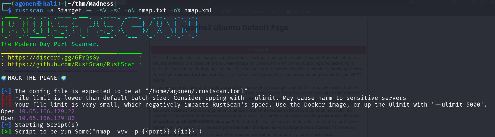
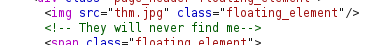
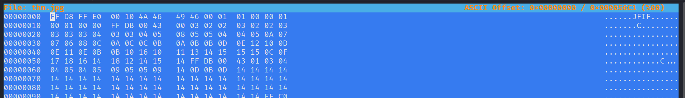
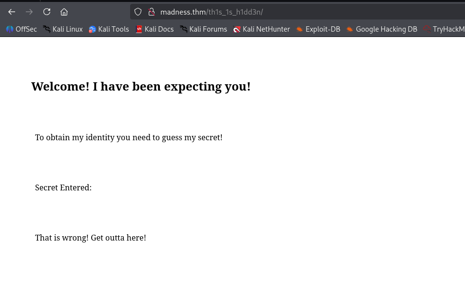
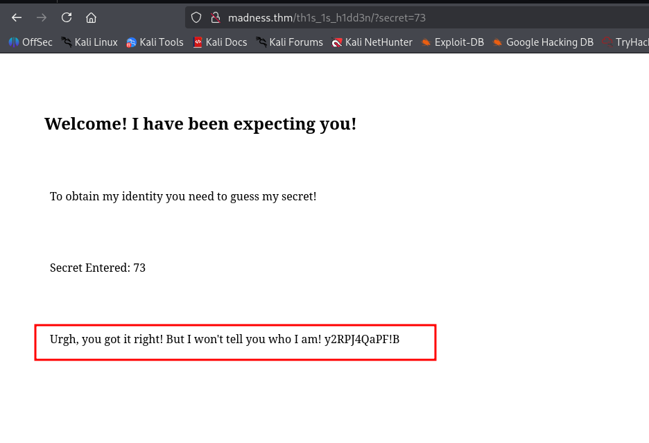
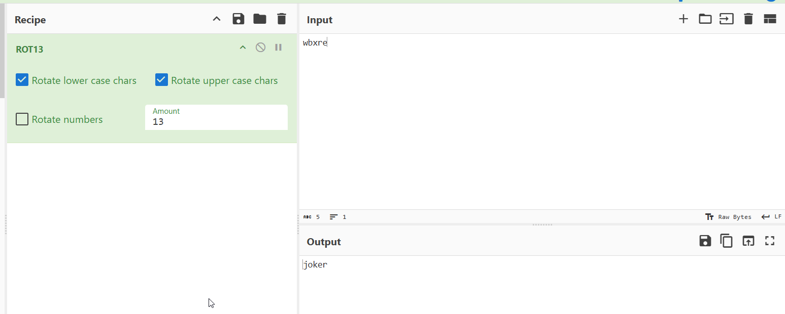
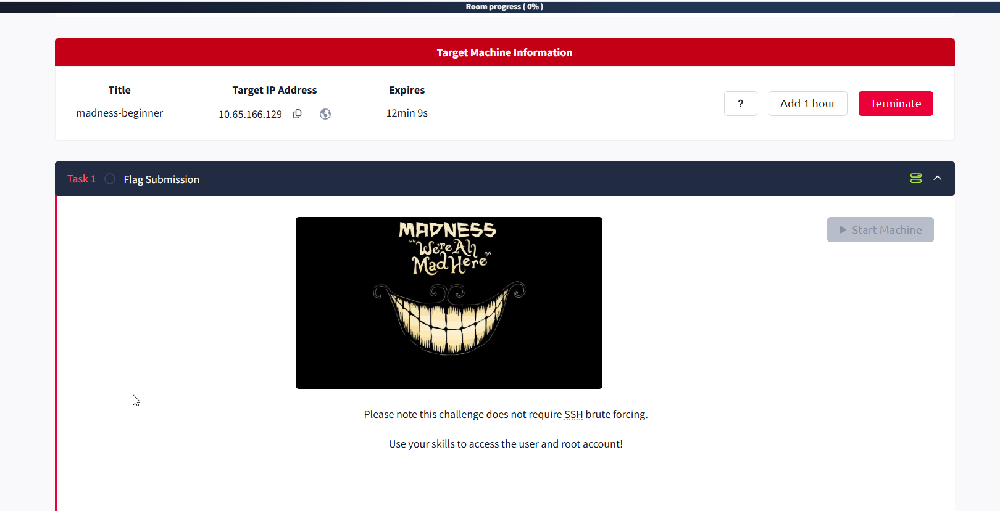
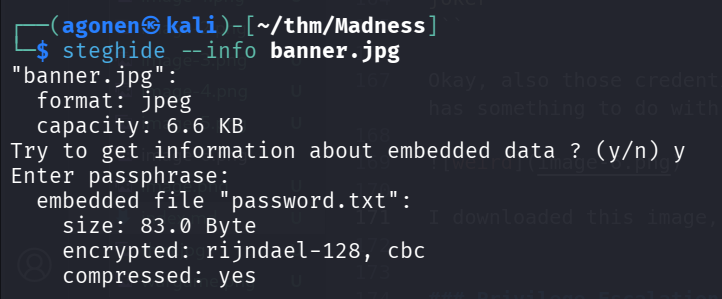
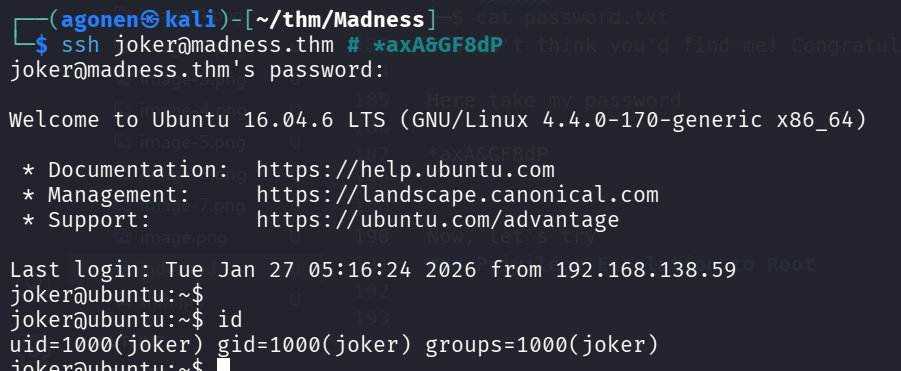
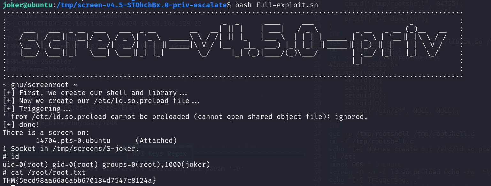

## TL;DR

In this challenge we first find `corrupted image` we need to fix, and then led to hidden endpoint, where we can find `password` for the image, to extract the `username`.

Then, we grab the real ssh `password` that was hidden inside image that was supply on the TryHackMe website.

After login to user `joker`, we move to `root` using SUID bit on `screen-4.5.0` and known exploit for privilege escalate.

### Recon

we start with `rustscan`, using this command:
```bash
rustscan -a $target -- -sV -sC -oN nmap.txt -oX nmap.xml
```



we can see port `22` with ssh and port `80` with apache http server
```bash
PORT   STATE SERVICE REASON         VERSION
22/tcp open  ssh     syn-ack ttl 62 OpenSSH 7.2p2 Ubuntu 4ubuntu2.8 (Ubuntu Linux; protocol 2.0)
| ssh-hostkey: 
|   2048 ac:f9:85:10:52:65:6e:17:f5:1c:34:e7:d8:64:67:b1 (RSA)
| ssh-rsa AAAAB3NzaC1yc2EAAAADAQABAAABAQDnNdHQKU4ZvpWn7Amdx7LPhuwUsHY8p1O8msRAEkaIGcDzlla2FxdlnCnS1h+A84lzn1oubZyb5vMrPM8T2IsxoSU2gcbbgfq/3giAL+hmuKm/nD43OKRflSHlcpIVgwQOVRdEfbQSOVpV5VBtJziA1Xu2dts2WWtawDS93CBtlfyeh+BuxZvBPX2k8XPWwykyR6cWbdGz1AAx6oxNRvNShJ99c9Vs7FW6bogwLAe9SWsFi2oB7ti6M/OH1qxgy7ZPQFhItvI4Vz2zZFGVEltL1fkwk2dat8yfFNWwm6+/cMTJqbVb7MPt3jc9QpmJmpgwyWuy4FTNgFt9GKNOJU6N
|   256 dd:8e:5a:ec:b1:95:cd:dc:4d:01:b3:fe:5f:4e:12:c1 (ECDSA)
| ecdsa-sha2-nistp256 AAAAE2VjZHNhLXNoYTItbmlzdHAyNTYAAAAIbmlzdHAyNTYAAABBBGMMalsXVdAFj+Iu4tESrnvI/5V64b4toSG7PK2N/XPqOe3q3z5OaDTK6TWo0ezdamfDPem/UO9WesVBxmJXDkE=
|   256 e9:ed:e3:eb:58:77:3b:00:5e:3a:f5:24:d8:58:34:8e (ED25519)
|_ssh-ed25519 AAAAC3NzaC1lZDI1NTE5AAAAIB3zGVeEQDBVK50Tz0eNWzBJny6ddQfBb3wmmG3QtMAQ
80/tcp open  http    syn-ack ttl 62 Apache httpd 2.4.18 ((Ubuntu))
|_http-title: Apache2 Ubuntu Default Page: It works
|_http-server-header: Apache/2.4.18 (Ubuntu)
| http-methods: 
|_  Supported Methods: GET HEAD POST OPTIONS
Service Info: OS: Linux; CPE: cpe:/o:linux:linux_kernel
```

I added `madness.thm` to my `/etc/hosts`

### Struggle to find credentials through corrupted images and hidden endpoints

When I visited the website, it looks like regular apache default page. However, There is some comment there:



I downloaded the file `thm.jpg`, which is very weird, because it isn't being recognized as PNG:
```bash
┌──(agonen㉿kali)-[~/thm/Madness]
└─$ xxd thm.jpg| head
00000000: 8950 4e47 0d0a 1a0a 0000 0001 0100 0001  .PNG............
00000010: 0001 0000 ffdb 0043 0003 0202 0302 0203  .......C........
00000020: 0303 0304 0303 0405 0805 0504 0405 0a07  ................
00000030: 0706 080c 0a0c 0c0b 0a0b 0b0d 0e12 100d  ................
00000040: 0e11 0e0b 0b10 1610 1113 1415 1515 0c0f  ................
00000050: 1718 1614 1812 1415 14ff db00 4301 0304  ............C...
00000060: 0405 0405 0905 0509 140d 0b0d 1414 1414  ................
00000070: 1414 1414 1414 1414 1414 1414 1414 1414  ................
00000080: 1414 1414 1414 1414 1414 1414 1414 1414  ................
00000090: 1414 1414 1414 1414 1414 1414 1414 ffc0  ................
                                                                                                                                                 
┌──(agonen㉿kali)-[~/thm/Madness]
└─$ file thm.jpg 
thm.jpg: data
```

Okay, we can see this is with `.jpg` extension, but starts with `.PNG`. I guess it corrupted, I want to add the header `FF D8 FF E0 00 10 4A 46 49 46 00 01`, using `hexeditor` which I installed



Now, save and try to open again
```bash
┌──(agonen㉿kali)-[~/thm/Madness]
└─$ file thm.jpg 
thm.jpg: JPEG image data, JFIF standard 1.01, aspect ratio, density 1x1, segment length 16, baseline, precision 8, 400x400, components 3
```


It sends us to `/th1s_1s_h1dd3n`, let's go there.



We can see it asks for some secret, probably using url param `secret`. Also, I found at the source code the next comment
```html
<!-- It's between 0-99 but I don't think anyone will look here-->
``` 
Okay, let's first create the wordlist:
```bash
seq 0 99 > numbers.txt
```

and now brute force:
```bash
┌──(agonen㉿kali)-[~/thm/Madness]
└─$ ffuf -u 'http://madness.thm/th1s_1s_h1dd3n/?secret=FUZZ' -w numbers.txt -fc 403 -fs 407,408

        /'___\  /'___\           /'___\       
       /\ \__/ /\ \__/  __  __  /\ \__/       
       \ \ ,__\\ \ ,__\/\ \/\ \ \ \ ,__\      
        \ \ \_/ \ \ \_/\ \ \_\ \ \ \ \_/      
         \ \_\   \ \_\  \ \____/  \ \_\       
          \/_/    \/_/   \/___/    \/_/       

       v2.1.0-dev
________________________________________________

 :: Method           : GET
 :: URL              : http://madness.thm/th1s_1s_h1dd3n/?secret=FUZZ
 :: Wordlist         : FUZZ: /home/agonen/thm/Madness/numbers.txt
 :: Follow redirects : false
 :: Calibration      : false
 :: Timeout          : 10
 :: Threads          : 40
 :: Matcher          : Response status: 200-299,301,302,307,401,403,405,500
 :: Filter           : Response status: 403
 :: Filter           : Response size: 407,408
________________________________________________

73                      [Status: 200, Size: 445, Words: 53, Lines: 19, Duration: 150ms]
:: Progress: [100/100] :: Job [1/1] :: 41 req/sec :: Duration: [0:00:02] :: Errors: 0 ::
```

And this is the url:
```bash
http://madness.thm/th1s_1s_h1dd3n/?secret=73
```



we got the password `y2RPJ4QaPF!B` I assume.
Inside the image, there is some hidden data with `steghide`.

I manage to extract it using the password we found
```bash
┌──(agonen㉿kali)-[~/thm/Madness]
└─$ steghide extract -sf thm.jpg -p 'y2RPJ4QaPF!B'
wrote extracted data to "hidden.txt".
                                                                                                                                                 
┌──(agonen㉿kali)-[~/thm/Madness]
└─$ cat hidden.txt                               
Fine you found the password! 

Here's a username 

wbxre

I didn't say I would make it easy for you!
```

Okay, now we have the username and password:
```bash
wbxre:y2RPJ4QaPF!B
```

Ooph. It is not working, maybe this isn't the username, because the password already worked.
Apparetnly, it is encoded in `ROT13`, I verified this with CyberChef



```bash
┌──(agonen㉿kali)-[~/thm/Madness]
└─$ echo -e 'wbxre' | tr 'a-z' 'n-za-m'
joker
```

Okay, also those credentials aren't working for ssh. I'm giving up. Maybe the weird image on the machine page has something to do with the challenge?



I downloaded this image, let's try it.



It hides the password with no password!
```bash
┌──(agonen㉿kali)-[~/thm/Madness]
└─$ steghide extract -sf banner.jpg -p ''     
wrote extracted data to "password.txt".
                                                                                                                                                 
┌──(agonen㉿kali)-[~/thm/Madness]
└─$ cat password.txt                  
I didn't think you'd find me! Congratulations!

Here take my password

*axA&GF8dP
```

Now, let's try:
```bash
┌──(agonen㉿kali)-[~/thm/Madness]
└─$ ssh joker@madness.thm # *axA&GF8dP
```



Finally, let's grab the user flag:
```bash
joker@ubuntu:~$ cat user.txt 
THM{d5781e53b130efe2f94f9b0354a5e4ea}
```

### Privilege Escalation to Root using SUID on screen-4.5.0

I checked for SUID binaries:
```bash
joker@ubuntu:~$ find / -user root -perm -u+s 2>/dev/null
/usr/lib/openssh/ssh-keysign
/usr/lib/dbus-1.0/dbus-daemon-launch-helper
/usr/lib/eject/dmcrypt-get-device
/usr/bin/vmware-user-suid-wrapper
/usr/bin/gpasswd
/usr/bin/passwd
/usr/bin/newgrp
/usr/bin/chsh
/usr/bin/chfn
/usr/bin/sudo
/bin/fusermount
/bin/su
/bin/ping6
/bin/screen-4.5.0
/bin/screen-4.5.0.old
/bin/mount
/bin/ping
```
we can see the file `/bin/screen-4.5.0`. I googled and find this repo [https://github.com/YasserREED/screen-v4.5.0-priv-escalate](https://github.com/YasserREED/screen-v4.5.0-priv-escalate).

I cloned the repo and then uploaded it to the machine.
Last step was to execute the `full-exploit.sh`.



We got root shell, Let's grab the root flag:
```bash
# cat /root/root.txt
THM{5ecd98aa66a6abb670184d7547c8124a}
```
