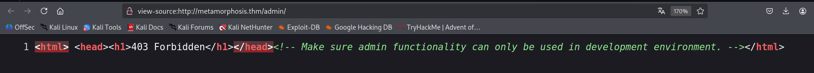
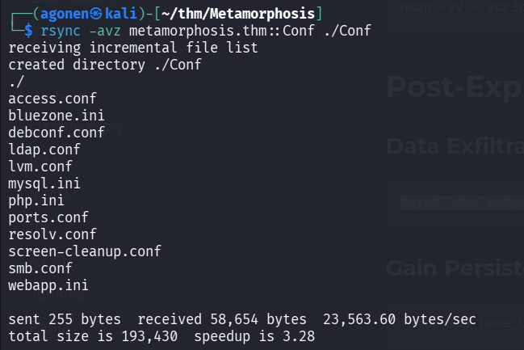
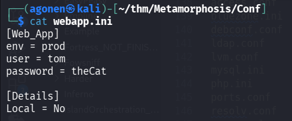
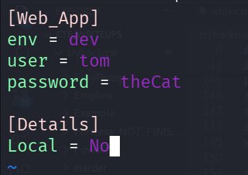

## TL;DR


### Recon

we start with `rustscan`, using this command:
```bash
rustscan -a $target -- -sV -sC -oN nmap.txt -oX nmap.xml
```


we can see port `22` with ssh, port `80` with apache http server, port `139` and `445` with smb and port `873` with rsync.
```bash
PORT    STATE SERVICE     REASON         VERSION                                                                                                             
22/tcp  open  ssh         syn-ack ttl 62 OpenSSH 8.2p1 Ubuntu 4ubuntu0.13 (Ubuntu Linux; protocol 2.0)                                                       
| ssh-hostkey:                                                                                                                                               
|   3072 ff:92:ba:a9:fb:3d:18:ff:ab:41:b5:ad:10:28:64:04 (RSA)                                                                                               
| ssh-rsa AAAAB3NzaC1yc2EAAAADAQABAAABgQCn/dj3+QT2HpsLpq3aRGfvGBqU0X6+rNshN0OzObNakPjdKmCsNo4ZDyY4ts2WMr0AiJbwVKdfWUEJZ1bKPA2TCkjs25e3oM017AQJckHI9pqexRR7K5t
gJq91ydjTO6p2o49tA+EZNxlE33iX7q622XrpILmV6B9vIJOmTMuJnJ3948VHeZ8PFe8ndhyz4dlGMK/bdxoUlKi2/jbnUqYFH9bn5GlujdBw8INeupghwKA6VGjEpoeaPo5iF8iF16aJbn/2NsCNbQhAi+wl
FtwLB2zJulpxmvk/gsUzRBnxn6Yolu4bN3PoHdajS/oCUIzfxxEyqCU1aKCpvh7OzNtqfN2eA7CoBHPT0+AzOZMVaNFpsnq2co+Pc9QMA9ch6+bIZL5V72yGRa+Gc4dACqbunRq0Cn2d95A8iXBPItVSaUc57
qyuXFHObB3PCeI6HEdnbZp3b2LNyGeJPY9o/ihcoXnxW8mwt7PTOsoP908n0Gi60rpIyRJcqVOX9KL/ddc=                                                                          
|   256 ef:d2:54:1a:53:30:4d:11:69:64:78:97:6e:e9:f1:c1 (ECDSA)                                                                                              
| ecdsa-sha2-nistp256 AAAAE2VjZHNhLXNoYTItbmlzdHAyNTYAAAAIbmlzdHAyNTYAAABBBG1lx1nRpNBYVjUpb13wNwKDZ22C7MW3xYrS/4F0NjRoduRPBbYb7ed39mOVMBZLTub9X+0z2aSa+2lxFZc
v4go=                                                                                                                                                        
|   256 8e:7f:ee:bb:1b:65:b5:da:2a:51:53:e9:65:8f:bc:0f (ED25519)                                                                                            
|_ssh-ed25519 AAAAC3NzaC1lZDI1NTE5AAAAIOsU/LkExp9tFlFYpXf6b8CacF/OHPNQtPd2y6d913Cb                                                                           
80/tcp  open  http        syn-ack ttl 62 Apache httpd 2.4.41 ((Ubuntu))                                                                                      
|_http-title: Site doesn't have a title (text/html; charset=UTF-8).                                                                                          
|_http-server-header: Apache/2.4.41 (Ubuntu)                                                                                                                 
139/tcp open  netbios-ssn syn-ack ttl 62 Samba smbd 4                                                                                                        
445/tcp open  netbios-ssn syn-ack ttl 62 Samba smbd 4                                                                                                        
873/tcp open  rsync       syn-ack ttl 62 (protocol version 31)                                                                                               
Service Info: OS: Linux; CPE: cpe:/o:linux:linux_kernel
```

Let's add `metamorphosis.thm` to our `/etc/hosts`.

### Change webapp.ini via rsync to switch into development environment

we start with `ffuf` to enumerate endpoints:
```bash
┌──(agonen㉿kali)-[~/thm/Metamorphosis]
└─$ ffuf -u "http://metamorphosis.thm/FUZZ" -w /usr/share/SecLists/Discovery/Web-Content/common.txt -fc 403                                                                                 

        /'___\  /'___\           /'___\       
       /\ \__/ /\ \__/  __  __  /\ \__/       
       \ \ ,__\\ \ ,__\/\ \/\ \ \ \ ,__\      
        \ \ \_/ \ \ \_/\ \ \_\ \ \ \ \_/      
         \ \_\   \ \_\  \ \____/  \ \_\       
          \/_/    \/_/   \/___/    \/_/       

       v2.1.0-dev
________________________________________________

 :: Method           : GET
 :: URL              : http://metamorphosis.thm/FUZZ
 :: Wordlist         : FUZZ: /usr/share/SecLists/Discovery/Web-Content/common.txt
 :: Follow redirects : false
 :: Calibration      : false
 :: Timeout          : 10
 :: Threads          : 40
 :: Matcher          : Response status: 200-299,301,302,307,401,403,405,500
 :: Filter           : Response status: 403
________________________________________________

admin                   [Status: 301, Size: 322, Words: 20, Lines: 10, Duration: 148ms]
index.php               [Status: 500, Size: 0, Words: 1, Lines: 1, Duration: 159ms]
```


Let's try to fetch `/admin`. This is what the comment says:
```bash
<!-- Make sure admin functionality can only be used in development environment. -->
```



Okay, now I moved to port `873`, which has the `rsync` service behind it.
We can use this source [https://hackviser.com/tactics/pentesting/services/rsync](https://hackviser.com/tactics/pentesting/services/rsync) for basic usage of rsync.

I started with enumeration using `nmap` script:
```bash
┌──(agonen㉿kali)-[~/thm/Metamorphosis]                                                                                                                                                      
└─$ nmap -sV --script "rsync-list-modules" -p 873 metamorphosis.thm                                                                                                                          
Starting Nmap 7.95 ( https://nmap.org ) at 2025-12-08 23:41 IST                                                                                                                              
Stats: 0:00:01 elapsed; 0 hosts completed (0 up), 1 undergoing Ping Scan
Ping Scan Timing: About 100.00% done; ETC: 23:41 (0:00:00 remaining)
Nmap scan report for metamorphosis.thm (10.67.191.11)
Host is up (0.15s latency).

PORT    STATE SERVICE VERSION
873/tcp open  rsync   (protocol version 31)
| rsync-list-modules: 
|_  Conf                All Confs

Service detection performed. Please report any incorrect results at https://nmap.org/submit/ . 
Nmap done: 1 IP address (1 host up) scanned in 2.45 seconds
```

We can find the module `Conf`, let's retrieve all the files in this module:
```bash
┌──(agonen㉿kali)-[~/thm/Metamorphosis]
└─$ rsync -av --list-only rsync://metamorphosis.thm/Conf       
receiving incremental file list
drwxrwxrwx          4,096 2021/04/10 23:03:08 .
-rw-r--r--          4,620 2021/04/09 23:01:22 access.conf
-rw-r--r--          1,341 2021/04/09 22:56:12 bluezone.ini
-rw-r--r--          2,969 2021/04/09 23:02:24 debconf.conf
-rw-r--r--            332 2021/04/09 23:01:38 ldap.conf
-rw-r--r--         94,404 2021/04/09 23:21:57 lvm.conf
-rw-r--r--          9,005 2021/04/09 22:58:40 mysql.ini
-rw-r--r--         70,207 2021/04/09 22:56:56 php.ini
-rw-r--r--            320 2021/04/09 23:03:16 ports.conf
-rw-r--r--            589 2021/04/09 23:01:07 resolv.conf
-rw-r--r--             29 2021/04/09 23:02:56 screen-cleanup.conf
-rw-r--r--          9,542 2021/04/09 23:00:59 smb.conf
-rw-rw-r--             72 2021/04/10 23:03:06 webapp.ini

sent 20 bytes  received 379 bytes  266.00 bytes/sec
total size is 193,430  speedup is 484.79
```

Interesting, I'd like to get some files, we can get all files:
```bash
┌──(agonen㉿kali)-[~/thm/Metamorphosis]
└─$ rsync -avz metamorphosis.thm::Conf ./Conf
receiving incremental file list
created directory ./Conf
./
access.conf
bluezone.ini
debconf.conf
ldap.conf
lvm.conf
mysql.ini
php.ini
ports.conf
resolv.conf
screen-cleanup.conf
smb.conf
webapp.ini

sent 255 bytes  received 58,654 bytes  23,563.60 bytes/sec
total size is 193,430  speedup is 3.28
```



Inside `webapp.ini`, we can find credentials, and also the setting `env = prod`:
```bash
┌──(agonen㉿kali)-[~/thm/Metamorphosis/Conf]
└─$ cat webapp.ini 
[Web_App]
env = prod
user = tom
password = theCat

[Details]
Local = No
```



What if we'll change this from `prod` to `dev`, like it says in the comment before, remember:
```bash
<!-- Make sure admin functionality can only be used in development environment. -->
```

Okay, so first, we need to modify the file `webapp.ini`:



and then upload this new file:
```bash
┌──(agonen㉿kali)-[~/thm/Metamorphosis/Conf]
└─$ rsync -av ./webapp.ini rsync://metamorphosis.thm/Conf/webapp.ini

sending incremental file list
webapp.ini

sent 183 bytes  received 41 bytes  149.33 bytes/sec
total size is 71  speedup is 0.32
```


now we can try to access `http://metamorphosis.thm/admin/` again:


### ...

For some reason, when sending requests I get back 500 Internal Server Error:


I searched on google, and understood i'm quite stuck, because i need this endpoint to exploit `SQLi` to `RCE`.

To be continued ...

### Privilege Escalation to Root


