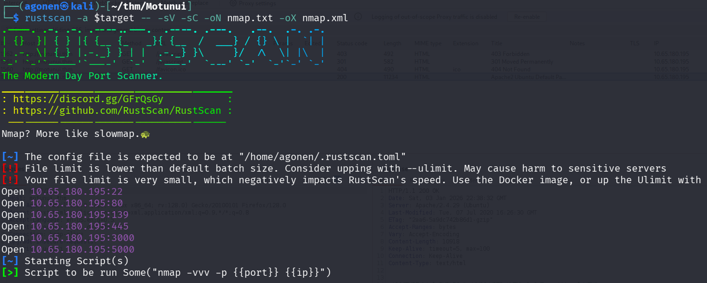
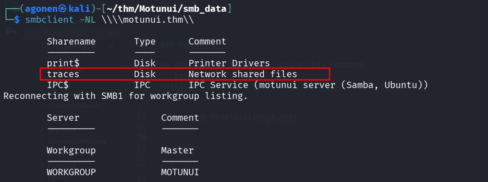
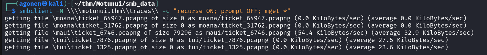
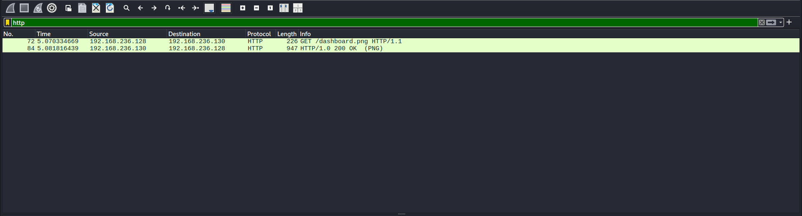
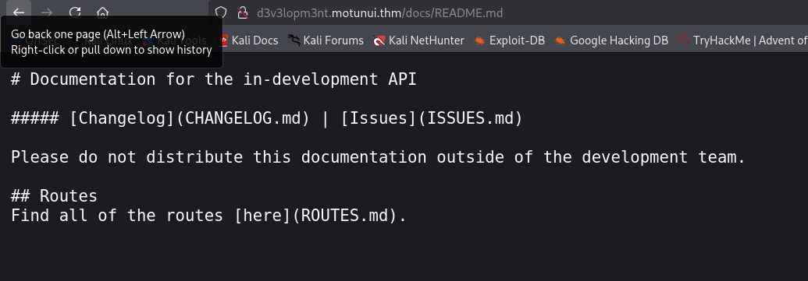
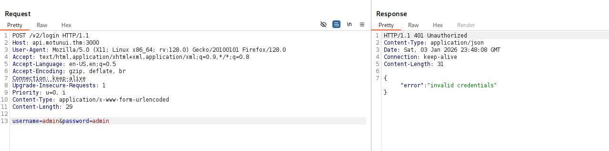
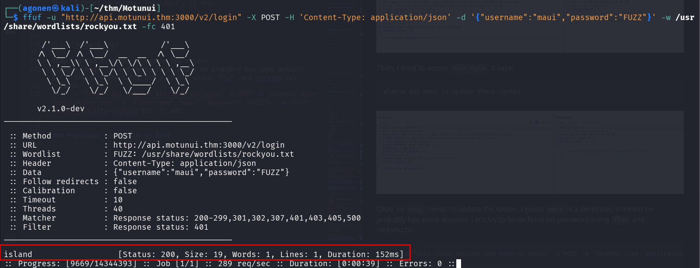
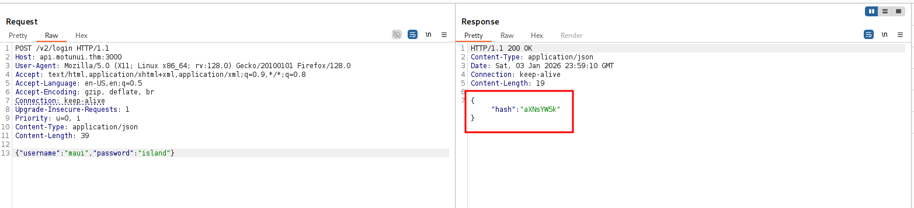

## TL;DR


### Recon

we start with `rustscan`, using this command:
```bash
rustscan -a $target -- -sV -sC -oN nmap.txt -oX nmap.xml
```



we can see port `22` with ssh, port `80` with apache http server, port `139` and `445` with smb, port `3000` with some http server and port `5000` with node.js.

```bash
PORT     STATE SERVICE     REASON         VERSION                                                                                                                                                                                                                           
22/tcp   open  ssh         syn-ack ttl 62 OpenSSH 7.6p1 Ubuntu 4ubuntu0.3 (Ubuntu Linux; protocol 2.0)                                                                                                                                                                      
| ssh-hostkey:                                                                                                                                                                                                                                                              
|   2048 20:f4:43:ac:39:fe:94:13:7a:ad:3d:e6:5f:b4:7e:71 (RSA)                                                                                                                                                                                                              
| ssh-rsa AAAAB3NzaC1yc2EAAAADAQABAAABAQDt7X7Nv+r5+vEn+V8jvNI3Or5lIAdCOlEJb+1IxbUlC5m3EN2HvZnOamrvyJkK/bk9dbBRM2EugTMgwiOLotDtqM5vJkJWr5KRVdXXsBQ7zFH46qF1D126XVLs4MozDbSu9ElYGARZhwyAPIOG4F6G3PY558aD6X7Gn+yuI5GT6Cu1NdPYJJ9FuxOK+jG15vTEEdC4BtDQEvtFrq+tlTvT0D9ssbqsgAJeq8
nk3BhDt3h7btY1OL3zihB7VIWf/KTkw616gCHZdHJ72HAmjB8dNiszCTf2VDV9uExPyEGr6x/hpu5HlOdCWjCKC0sS4p9Sx1RVLyGjzlZWlOuB3FSB                                                                                                                                                          
|   256 49:8c:75:e1:78:e9:72:65:de:c9:14:74:0f:d4:1a:81 (ECDSA)                                                                                                                                                                                                             
| ecdsa-sha2-nistp256 AAAAE2VjZHNhLXNoYTItbmlzdHAyNTYAAAAIbmlzdHAyNTYAAABBBAQsL1elZQegY4ou3qLqRejr0DA0Yh7/csYZP0VWyfbSMjdsZ7uGSfu2EWxt/Em4c8e10+D0vwV0k0F4qBadIpY=                                                                                                          
|   256 0b:b6:27:f9:ad:ed:22:a9:90:ac:9e:b3:85:1b:aa:96 (ED25519)                                                                                                                                                                                                           
|_ssh-ed25519 AAAAC3NzaC1lZDI1NTE5AAAAIKftXXbH4Rbbww9jEU9z1rSmHs3P3a1AUzaEHEfNDtJv                                                                                                                                                                                          
80/tcp   open  http        syn-ack ttl 62 Apache httpd 2.4.29 ((Ubuntu))                                                                                                                                                                                                    
|_http-title: Apache2 Ubuntu Default Page: It works                                                                                                                                                                                                                         
|_http-server-header: Apache/2.4.29 (Ubuntu)                                                                                                                                                                                                                                
| http-methods:                                                                                                                                                                                                                                                             
|_  Supported Methods: GET POST OPTIONS HEAD                                                                                                                                                                                                                                
139/tcp  open  netbios-ssn syn-ack ttl 62 Samba smbd 3.X - 4.X (workgroup: WORKGROUP)                                                                                                                                                                                       
445/tcp  open  netbios-ssn syn-ack ttl 62 Samba smbd 4.7.6-Ubuntu (workgroup: WORKGROUP)                                                                                                                                                                                    
3000/tcp open  ppp?        syn-ack ttl 62                                                                                                                                                                                                                                   
| fingerprint-strings:                                                                                                                                                                                                                                                      
|   FourOhFourRequest:                                                                                                                                                                                                                                                      
|     HTTP/1.1 404 Not Found                                                                                                                                                                                                                                                
|     Content-Security-Policy: default-src 'none'                                                                                                                                                                                                                           
|     X-Content-Type-Options: nosniff                                                                                                                                                                                                                                       
|     Content-Type: text/html; charset=utf-8                                                                                                                                                                                                                                
|     Content-Length: 174                                                                                                                                                                                                                                                   
|     Date: Sat, 03 Jan 2026 22:41:37 GMT                                                                                                                                                                                                                                   
|     Connection: close                                                                                                                                                                                                                                                     
|     <!DOCTYPE html>                                                                                                                                                                                                                                                       
|     <html lang="en">                                                                                                                                                                                                                                                      
|     <head>                                                                                                                                                                                                                                                                
|     <meta charset="utf-8">                                                                                                                                                                                                                                                
|     <title>Error</title>                                                                                                                                                                                                                                                  
|     </head>                                                                                                                                                                                                                                                               
|     <body>                                                                                                                                                                                                                                                                
|     <pre>Cannot GET /nice%20ports%2C/Tri%6Eity.txt%2ebak</pre>                                                                                                                                                                                                            
|     </body>                                                                                                                                                                                                                                                               
|     </html>
|   GetRequest:                                                                                                                                                                                                                                                             
|     HTTP/1.1 404 Not Found                                                                                                                                                                                                                                                
|     Content-Security-Policy: default-src 'none'                                                                                                                                                                                                                           
|     X-Content-Type-Options: nosniff                                                                                                                                                                                                                                       
|     Content-Type: text/html; charset=utf-8                                                                                                                                                                                                                                
|     Content-Length: 139                                                                                                                                                                                                                                                   
|     Date: Sat, 03 Jan 2026 22:41:33 GMT                                                                                                                                                                                                                                   
|     Connection: close                                                                                                                                     
|     <!DOCTYPE html>                                                                                                                                       
|     <html lang="en">                                                                                                                                      
|     <head>                                                       
|     <meta charset="utf-8">                                       
|     <title>Error</title>                                         
|     </head>                                                      
|     <body>                                                       
|     <pre>Cannot GET /</pre>                                      
|     </body>                                                      
|     </html>                                                      
|   HTTPOptions:                                                   
|     HTTP/1.1 404 Not Found                                       
|     Content-Security-Policy: default-src 'none'                                                                                     
|     X-Content-Type-Options: nosniff                              
|     Content-Type: text/html; charset=utf-8                                                                                          
|     Content-Length: 143                                          
|     Date: Sat, 03 Jan 2026 22:41:34 GMT                                                                                             
|     Connection: close                                            
|     <!DOCTYPE html>                                              
|     <html lang="en">                                             
|     <head>                                                       
|     <meta charset="utf-8">                                       
|     <title>Error</title>                                         
|     </head>                                                      
|     <body>                                                       
|     <pre>Cannot OPTIONS /</pre>                                  
|     </body>                                                      
|_    </html>                                                      
5000/tcp open  ssl/http    syn-ack ttl 62 Node.js (Express middleware)                                                                
| http-methods:                                                    
|_  Supported Methods: GET HEAD POST OPTIONS                                                                                          
|_http-title: Site doesn't have a title (text/html; charset=utf-8).
```

I added `motunui.thm` to my `/etc/hosts`.


### Find hidden subdomain d3v3lopm3nt.motunui.thm inside ticket_6746.pcapng file found inside smb share

I started with `smb`, I tried to list shares anonymously, and found `trace`
```bash
┌──(agonen㉿kali)-[~/thm/Motunui/smb_data]                                                                                                                  
└─$ smbclient -NL \\\\motunui.thm\\                                                                                                                         

        Sharename       Type      Comment
        ---------       ----      -------
        print$          Disk      Printer Drivers
        traces          Disk      Network shared files
        IPC$            IPC       IPC Service (motunui server (Samba, Ubuntu))
```



Next, I used command to get all files recursively:
```bash
smbclient -N \\\\motunui.thm\\traces\\ -c "recurse ON; prompt OFF; mget *"
```



First, inside `maui/ticket_6746.pcapng`, which I analyzed with WireShark, I found an image:



I extracted this, Using the following steps:
> File > Export Objects > HTTP


and we got this image:


all the other .pcapng files were empty.
Anyway, We got the message:
```
The pages included on this virtual host are solely for developers Of Motunui. Please ensure you have authorisation to be viewing this.
```

And a new subdomain `d3v3lopm3nt.motunui.thm`, let's add it to our `/etc/hosts`.

### ...

Using `ffuf` I found an endpoint called `/docs`:
```bash
┌──(agonen㉿kali)-[~/thm/Motunui]
└─$ ffuf -u "http://d3v3lopm3nt.motunui.thm/FUZZ" -w /usr/share/SecLists/Discovery/Web-Content/common.txt -fc 403

        /'___\  /'___\           /'___\       
       /\ \__/ /\ \__/  __  __  /\ \__/       
       \ \ ,__\\ \ ,__\/\ \/\ \ \ \ ,__\      
        \ \ \_/ \ \ \_/\ \ \_\ \ \ \ \_/      
         \ \_\   \ \_\  \ \____/  \ \_\       
          \/_/    \/_/   \/___/    \/_/       

       v2.1.0-dev
________________________________________________

 :: Method           : GET
 :: URL              : http://d3v3lopm3nt.motunui.thm/FUZZ
 :: Wordlist         : FUZZ: /usr/share/SecLists/Discovery/Web-Content/common.txt
 :: Follow redirects : false
 :: Calibration      : false
 :: Timeout          : 10
 :: Threads          : 40
 :: Matcher          : Response status: 200-299,301,302,307,401,403,405,500
 :: Filter           : Response status: 403
________________________________________________

docs                    [Status: 301, Size: 333, Words: 20, Lines: 10, Duration: 151ms]
index.php               [Status: 200, Size: 248, Words: 24, Lines: 11, Duration: 162ms]
javascript              [Status: 301, Size: 339, Words: 20, Lines: 10, Duration: 160ms]
:: Progress: [4750/4750] :: Job [1/1] :: 242 req/sec :: Duration: [0:00:20] :: Errors: 0 ::
```

First, I visited:
```bash
http://d3v3lopm3nt.motunui.thm/docs/README.md
```



Then, I went to `routes.md`:
```bash
http://d3v3lopm3nt.motunui.thm/docs/ROUTES.md
```


We can see there are two endpoints at `http://api.motunui.thm:3000/v2/`, `jobs` and `login`.

I tried to login with some default credentials but it didn't work.



Then, I tried to access `/v1/login`, it says:
```
please get maui to update these routes
```


Okay, so `maui` needs to update the routes.
I guess `maui` is a developer, it means he probably has some account. Let's try to brute force his password using `ffuf` and rockyou.txt.
```bash
ffuf -u "http://api.motunui.thm:3000/v2/login" -X POST -H 'Content-Type: application/json' -d '{"username":"maui","password":"FUZZ"}' -w /usr/share/wordlists/rockyou.txt -fc 401
```

I found the password, which is `island`.



I logged in and got the hash `aXNsYW5k`.




### Privilege Escalation to Root


