## TL;DR


### Recon

we start with `rustscan`, using this command:
```bash
rustscan -a $target -- -sV -sC -oN nmap.txt -oX nmap.xml
```

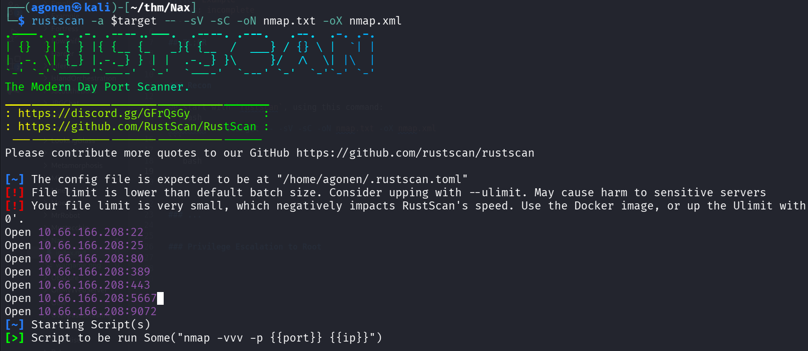

we can see port `22` with ssh, port `25` with smtp, port `80` woth apache http server, port `389` with ldap, port `443` with https and port `5667` and port `9072` with unknown services.

```bash
PORT     STATE SERVICE    REASON         VERSION                                                                                                                                                                                                                              
22/tcp   open  ssh        syn-ack ttl 62 OpenSSH 8.2p1 Ubuntu 4ubuntu0.13 (Ubuntu Linux; protocol 2.0)                                                                                                                                                                        
| ssh-hostkey:                                                                                                                         
|   3072 0d:82:22:e4:8e:03:d1:6c:cf:3a:80:c5:a7:6e:58:be (RSA)                                                                         
| ssh-rsa AAAAB3NzaC1yc2EAAAADAQABAAABgQDziTUM7OL+61Dl68wddUltUw6uxw/djXxN0f0DqGwrJhMK+QuFBiG4P72w6gs2lFblIJ6FHaPrtgbb2NDWLgzYD45I7jTCqHSwU+seRY2l5kNOnh8hupClUoPmkJv0gUwRELOvN2As5vGprKWCF9RbtgIIjImvpeeOJg0a+MA+jxBW1m6VhCfxMuR0ypkzlVxF0ni2xNnaR0/Cg46/oOtaBDdWRXDe3g/zkK1qfwBQcx4qO6x3lZ3t11Gl2bdn3jgioh6dZ6/7/UrTIqmrI2E5VpuY26iRCls4Z5fG+nBG+ZWQxyAIFx5eAD0HWBOjwiky78w+nvTEqNpH6Kc3k0PdsKa85SEV+4qV5rasIaqxk7zh4p6HcqAiDbwcoOL/DWwYHgX50aJlcIZcN5Vygjz4VcdD3MpGvJyjsxtQSZKMSHjQ2yD
ySpG5gqQNhUIRnK18XY3gtmtdnM0hSdCxFtYz9YM4QK63W6CT2I+fP1Rgsc5zKDvh89nlL2rFlNxp7lM=                                                      
|   256 30:9f:e1:dd:0c:cc:e9:7a:aa:f1:38:e4:f6:38:66:ee (ECDSA)                                                                                                                                                                                                               
| ecdsa-sha2-nistp256 AAAAE2VjZHNhLXNoYTItbmlzdHAyNTYAAAAIbmlzdHAyNTYAAABBBCgkeU4/SkYLsNDkKzmD/Kw50hBI5hqkooLi/TaWeeysRMv70K1mdmxFtlVVZ7MF4rCuF9kjyB822EUq5dPyDzk=                                                                          
|   256 2f:2b:64:68:81:3e:19:9a:ed:60:e1:ce:4c:9f:dc:a0 (ED25519)                                                                                                                                                                           
|_ssh-ed25519 AAAAC3NzaC1lZDI1NTE5AAAAIIaAhfsz6AlEMXmg9FyygPzyv/BP+v1NuNTHUDkgjc4X                                                     
25/tcp   open  smtp       syn-ack ttl 62 Postfix smtpd                                                                                 
|_ssl-date: TLS randomness does not represent time                                                                                                                                                                                                                            
| ssl-cert: Subject: commonName=ubuntu                                                                                                                                                                                                                                        
| Issuer: commonName=ubuntu                                                                                                            
| Public Key type: rsa                                                                                                                 
| Public Key bits: 2048                                                                                                                
| Signature Algorithm: sha256WithRSAEncryption                                                                                         
| Not valid before: 2020-03-23T23:42:04                                                                                                
| Not valid after:  2030-03-21T23:42:04                                                                                                
| MD5:   9b85:15ad:46a7:016e:319a:033d:7d96:edbe                                                                                                                                                                                                                                                                           
| SHA-1: c488:0c2d:a210:38dd:cfbb:a299:4a2a:b69c:63fd:2cdc                                                                                                                                                                                                                                                                 
| -----BEGIN CERTIFICATE-----                                                                                                          
| MIICsjCCAZqgAwIBAgIJAMztBzdUafrfMA0GCSqGSIb3DQEBCwUAMBExDzANBgNV                                                                     
| BAMMBnVidW50dTAeFw0yMDAzMjMyMzQyMDRaFw0zMDAzMjEyMzQyMDRaMBExDzAN                                                                     
| BgNVBAMMBnVidW50dTCCASIwDQYJKoZIhvcNAQEBBQADggEPADCCAQoCggEBAM4f                                                                     
| Mj+6LmA7krMf32EdXKtdfPVFVFf3367a+trh4/H6MHZJVOpZ+CrH1j4RTjr9SONC                                                                     
| l5Fzrz1hR1o1oXIwsAXrtqcvYGeNT7gwH4D6m6zifSaOAWEy/IMsbe3+sPMIUPlS                                                                     
| 4NdFl4J6PeyeAAnShUzAOAdUqsvSsAmmvN3ze+Y2OGGfOlO1s7n25FDs72zXo2nX 
| i1EO+1mVdUWuM/Qr8Zctilwv9QNPWxcoTG/Zac/q8/pboWaUg3pf6mfFLbwo96ba                                                                                                                           
| 8p8QR8gfD1Vc1xQMN98/2lPxo8ISkW9ffcBzy0ILIhkSD/8EmynmC7FhgogCU+/l 
| fYpeC3wLLigkDZnOgL0CAwEAAaMNMAswCQYDVR0TBAIwADANBgkqhkiG9w0BAQsF 
| AAOCAQEABDjkkOLVJfqNq1qSDGBgu7IJCG1CAByl82DGlam2nsVBhji54hviiyBi                                                                                                                                                
| euCyeqJRPOX2qS7Kl0scMFw+DVxNW867HcrtTYEHuo1gOCGX3QFz+eUuKf+4X1Wr                                                                               
| a7VgSeYVhboT4w4tKm8Rprh7QkHp9MNTB9TR/edG9RtFJZXtSlykeS5lLeC3DjRw                                                                                           
| 0NhWpgG2ZLa9URDrpzErvVwOBN46IS0PqwDCxJSvsH6sBQhgrm5so71jrPHwmh/o      
| aaqO96Rw+1aRRLwz0O0TEO4aMw8/seeiRJ8w4kXMOy9UrCM5+yW6fbtMKYsmEPJO            
| RxSanrURYb9UJxdRfeWPqWYU1AHVwg==                                                            
|_-----END CERTIFICATE-----                                                                   
|_smtp-commands: ubuntu.localdomain, PIPELINING, SIZE 10240000, VRFY, ETRN, STARTTLS, ENHANCEDSTATUSCODES, 8BITMIME, DSN, CHUNKING                                                                                                          
80/tcp   open  http       syn-ack ttl 62 Apache httpd 2.4.41 ((Ubuntu))                                                                                                                      
|_http-title: Site doesn't have a title (text/html).                                                                                                                                         
|_http-server-header: Apache/2.4.41 (Ubuntu)                                                                                                                                                 
| http-methods:                                                                               
|_  Supported Methods: POST OPTIONS HEAD GET                                                  
389/tcp  open  ldap       syn-ack ttl 62 OpenLDAP 2.2.X - 2.3.X                                                                                                                                                   
443/tcp  open  ssl/http   syn-ack ttl 62 Apache httpd 2.4.41 ((Ubuntu))                                                                
| tls-alpn:                                                                                              
|_  http/1.1                                                                                                          
| http-methods:                                                    
|_  Supported Methods: POST OPTIONS HEAD GET                                                                          
|_http-title: Site doesn't have a title (text/html).               
|_ssl-date: TLS randomness does not represent time                
|_http-server-header: Apache/2.4.41 (Ubuntu)                      
| ssl-cert: Subject: commonName=192.168.85.153/organizationName=Nagios Enterprises/stateOrProvinceName=Minnesota/countryName=US/organizationalUnitName=Development/localityName=St. Paul                                                    
| Issuer: commonName=192.168.85.153/organizationName=Nagios Enterprises/stateOrProvinceName=Minnesota/countryName=US/organizationalUnitName=Development/localityName=St. Paul                                                               
| Public Key type: rsa                                             
| Public Key bits: 2048                                                       
| Signature Algorithm: sha1WithRSAEncryption                                  
| Not valid before: 2020-03-24T00:14:58                            
| Not valid after:  2030-03-22T00:14:58                            
| MD5:   636c:ab0f:6399:34e3:b6de:e6e2:b294:d4ef                              
| SHA-1: 80cd:2e1b:110f:1b5f:1943:1b3f:c218:71e7:8b98:6801                    
| -----BEGIN CERTIFICATE-----                                                 
| MIIDzTCCArWgAwIBAgIBADANBgkqhkiG9w0BAQUFADCBgDELMAkGA1UEBhMCVVMx            
| EjAQBgNVBAgMCU1pbm5lc290YTERMA8GA1UEBwwIU3QuIFBhdWwxGzAZBgNVBAoM            
| Ek5hZ2lvcyBFbnRlcnByaXNlczEUMBIGA1UECwwLRGV2ZWxvcG1lbnQxFzAVBgNV            
| BAMMDjE5Mi4xNjguODUuMTUzMB4XDTIwMDMyNDAwMTQ1OFoXDTMwMDMyMjAwMTQ1                                                                                           
| OFowgYAxCzAJBgNVBAYTAlVTMRIwEAYDVQQIDAlNaW5uZXNvdGExETAPBgNVBAcM            
| CFN0LiBQYXVsMRswGQYDVQQKDBJOYWdpb3MgRW50ZXJwcmlzZXMxFDASBgNVBAsM            
| C0RldmVsb3BtZW50MRcwFQYDVQQDDA4xOTIuMTY4Ljg1LjE1MzCCASIwDQYJKoZI                            
| hvcNAQEBBQADggEPADCCAQoCggEBANdnw2CkJpNnnwjJ+PaxonTH/G5TSKLru67c                            
| aQyy4FhI/xa+0Dwn/HjWnWIOE3gOQB7QyOyG30guUpFohUEtC9agL7tpogpxrV8l            
| ie0vhXsz0ETdzMhaou6QOrLS1OSspAh+t492t71BILl6ReHPLoFyEghyRctP/iK0            
| PelUJKndJ2ElpLdbkMUuVzQ9mp8qIjoTF4CS1JwiUESCtikRmZWp398buklzNGgF                                                                                                                           
| VZIRJPu5VZMPGc7Ui3QUSaTF2aqi9FRXZRXN+0q2nWvdUFrUqnzrmaVynOupGXhS                                                    
| O17VZtC9F/GM+yWpg3Lck9wevt5o3nnYW4k8h5kDNHu4f0oDR88CAwEAAaNQME4w                            
| HQYDVR0OBBYEFFRhBQ3MZkrfjRqOlHjApJZAN+juMB8GA1UdIwQYMBaAFFRhBQ3M                            
| ZkrfjRqOlHjApJZAN+juMAwGA1UdEwQFMAMBAf8wDQYJKoZIhvcNAQEFBQADggEB                            
| ABeWyFzGfxf3vmGuLXdDXVj5e1LwBlvoNmHGf11Buy/yljpUI6jg1HxUTSABU/iS                            
| ZSsCnwOQ5dtqRAIcvFp07ZlUw9DpeSChj2jxXw+YxINOSqqNgE66zelXV9rJb7TX                            
| HWho2/g6OzKs5ii2h5lyjlValQAgfxBYJpRjvf4FfIJpzL+RnrsOqJBNUurbAn1L                            
| yNkqSDJhCPNN/g0V6eyOZRjTipV2FzcHYrbt84qFPN8gQ5Rpd6wNOWoUfuY1tL6H                            
| yepaZ/iLv+wY60Kxd8+GD4Oy7Tpz+Ilkr48EIUffejHzVrcn7JikS8+Uf8nvDi9Q                            
| LnC7LykFocxS13IXPcTfrnI=                                                                    
|_-----END CERTIFICATE-----                                                                   
5667/tcp open  tcpwrapped syn-ack ttl 62                                                      
9072/tcp open  unknown    syn-ack ttl 61                                                                                                                                                     
Service Info: Host:  ubuntu.localdomain; OS: Linux; CPE: cpe:/o:linux:linux_kernel 
```

I added `nax.thm` to my `/etc/hosts`.

### Find credentials inside hidden endpoint when interpreting as piet program

When we visit the root page, we can see this:

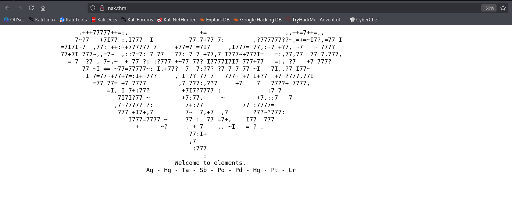

The message on the page is interesting:
```bash
        Welcome to elements.
Ag - Hg - Ta - Sb - Po - Pd - Hg - Pt - Lr
```

I guesses this is elements from the periodic table, so I used online periodic table to view their values, [text](https://ptable.com/#Properties).

We got these numbers:
```bash
47 80 73 51 84 46 80 78 103
```

I tried to decoded them as decimal numbers, we got this string:
```bash
/PI3T.PNg
```

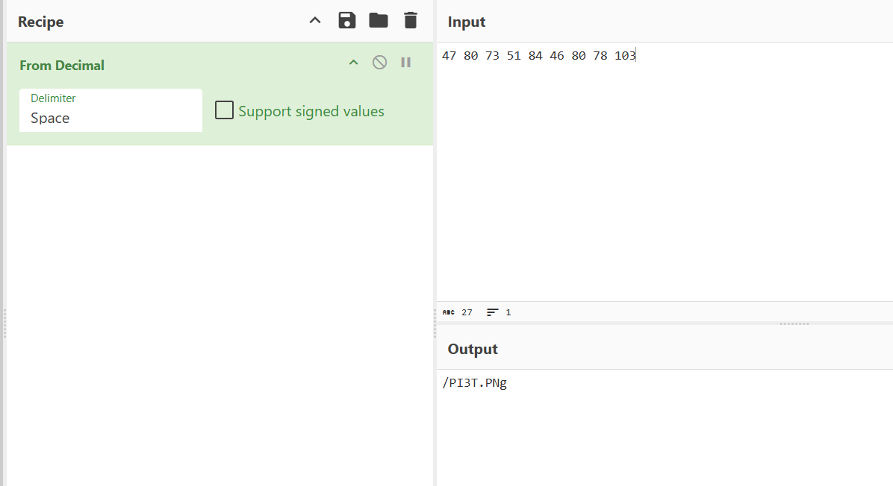

Okay, i went to `http://nax.thm/PI3T.PNg`, we got this image


I checked with `exiftool` the image, we can see the author is `Piet Mondrian`.

```bash
┌──(agonen㉿kali)-[~/thm/Nax]
└─$ exiftool PI3T.PNg 
ExifTool Version Number         : 13.25
File Name                       : PI3T.PNg
Directory                       : .
File Size                       : 982 kB
File Modification Date/Time     : 2025:12:24 09:27:01+02:00
File Access Date/Time           : 2025:12:24 09:27:08+02:00
File Inode Change Date/Time     : 2025:12:24 09:27:01+02:00
File Permissions                : -rw-rw-r--
File Type                       : PNG
File Type Extension             : png
MIME Type                       : image/png
Image Width                     : 990
Image Height                    : 990
Bit Depth                       : 8
Color Type                      : Palette
Compression                     : Deflate/Inflate
Filter                          : Adaptive
Interlace                       : Noninterlaced
Palette                         : (Binary data 768 bytes, use -b option to extract)
Transparency                    : (Binary data 256 bytes, use -b option to extract)
Artist                          : Piet Mondrian
Copyright                       : Piet Mondrian, tryhackme 2020
Image Size                      : 990x990
Megapixels                      : 0.980
```

After googling, I found there is a Piet programming language, which looks like this image. Maybe this is the hint with the Artist name.

I used the website `https://www.bertnase.de/npiet/` to try execute the image:

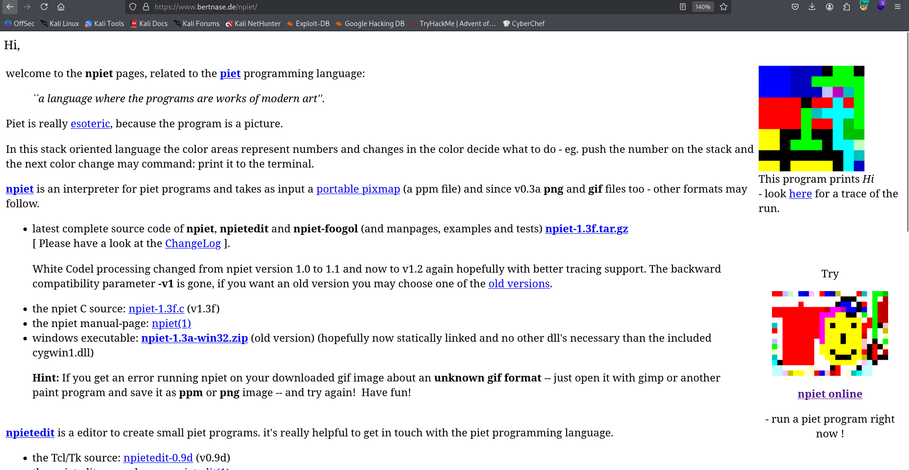

However, It didn't work:

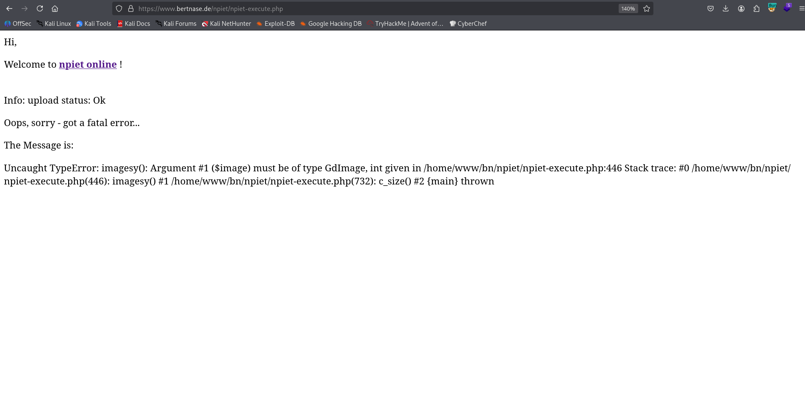

The website gives us this hint:
> **Hint:** If you get an error running npiet on your downloaded gif image about an **unknown gif format** -- just open it with gimp or another paint program and save it as **ppm** or **png** image -- and try again!  Have fun!

So, I used online png to ppm convertor, here [https://convertio.co/png-ppm/](https://convertio.co/png-ppm/).

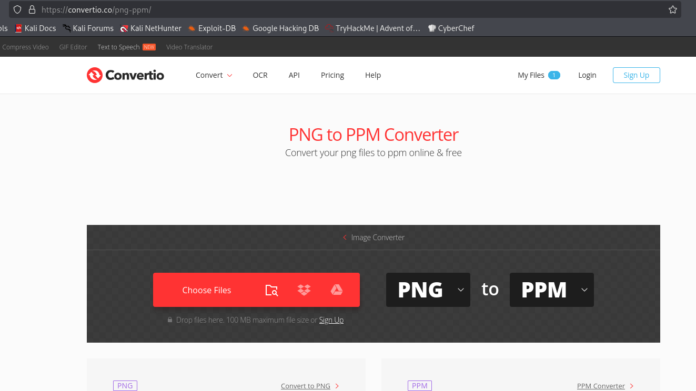

Now, I downloaded `npiet`:
```bash
wget https://www.bertnase.de/npiet/npiet-1.3f.tar.gz
tar -xf npiet-1.3f.tar.gz

cd npiet-1.3f
gcc npiet.c -o npiet
```

Now, I executed the npiet with the .ppm file:
```bash
./npiet ../PI3T.ppm
```

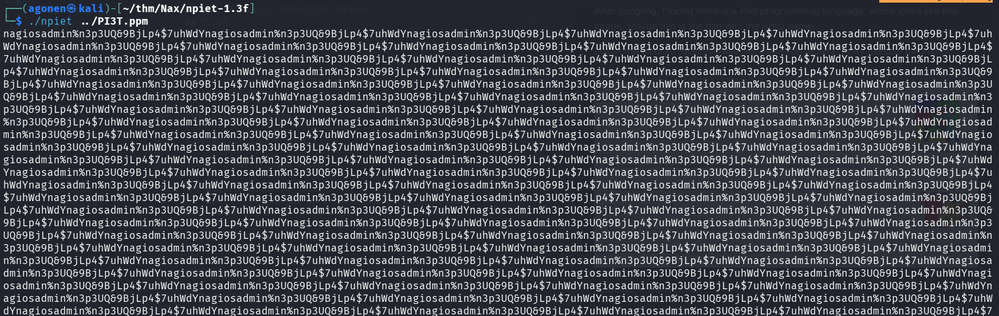

We got the string:
```bash
nagiosadmin%n3p3UQ&9BjLp4$7uhWdY
```

And if we'll interpret the `%n` as a new line, we got these credentials:
```bash
nagiosadmin:3p3UQ&9BjLp4$7uhWdY
```

### Login to Nagios XI and get RCE based on known CVE

The next step is to go to the hidden endpoint we found here `/nagiosxi/`

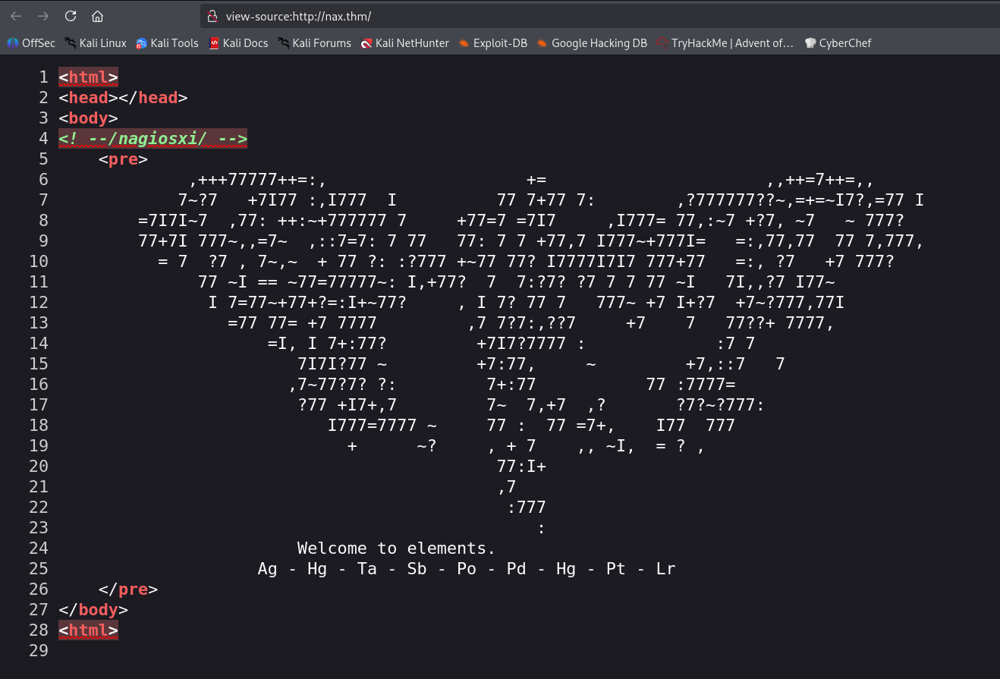

and there login to the system.

However, for some reason, the endpoint `/nagiosxi/` not exists.

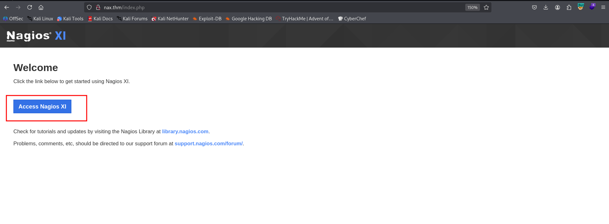

So, this is broken for now.

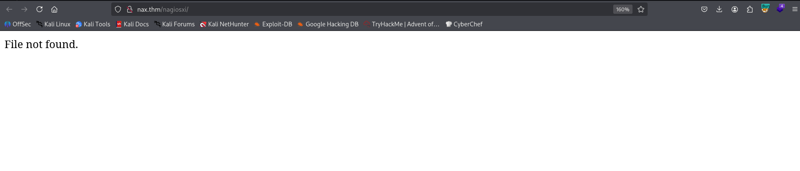

(The idea from now is to login with the credentials, and get `RCE` based on known CVE)

We are stuck.

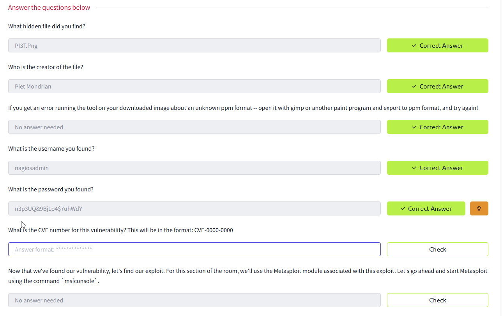

### Privilege Escalation to Root


